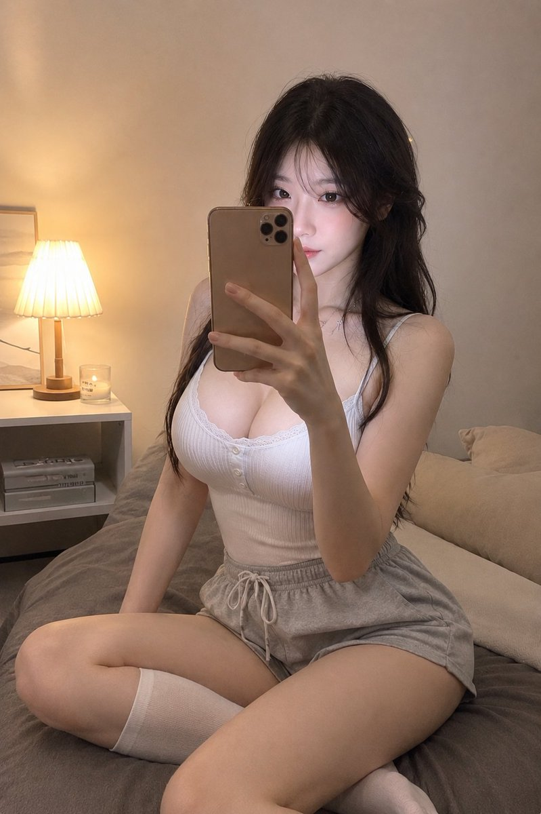
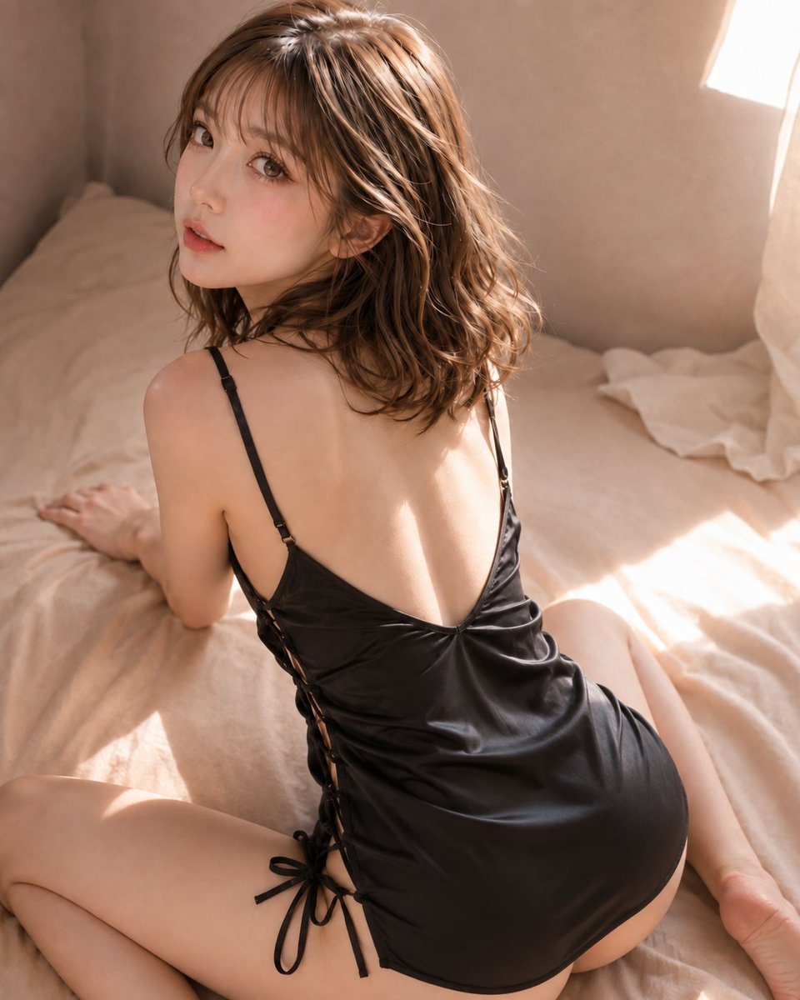
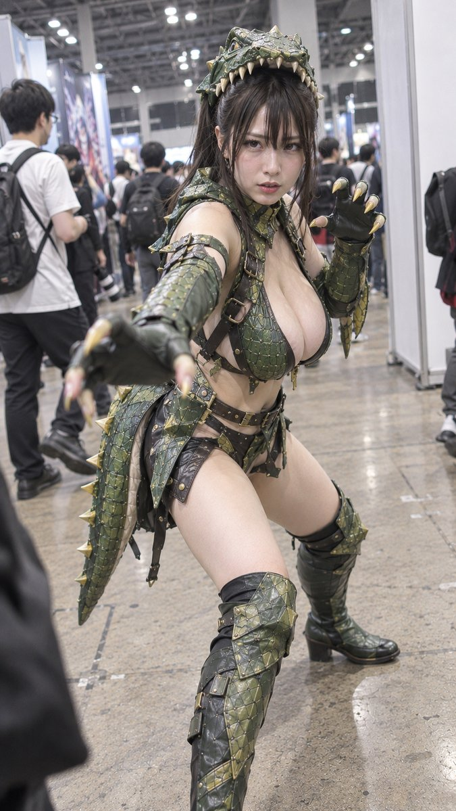
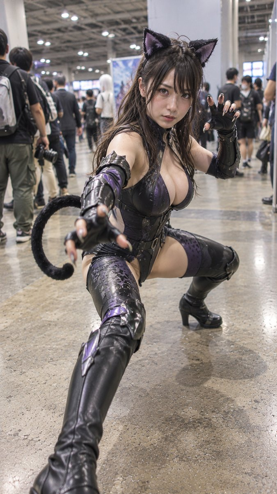
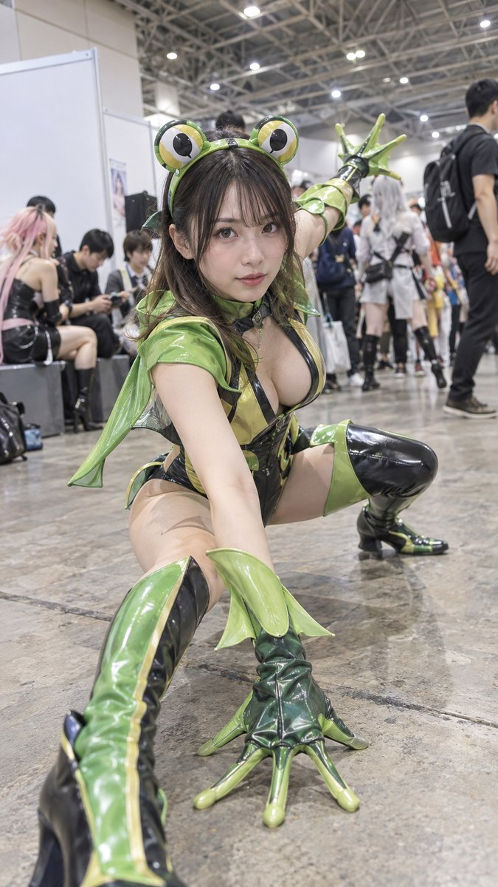
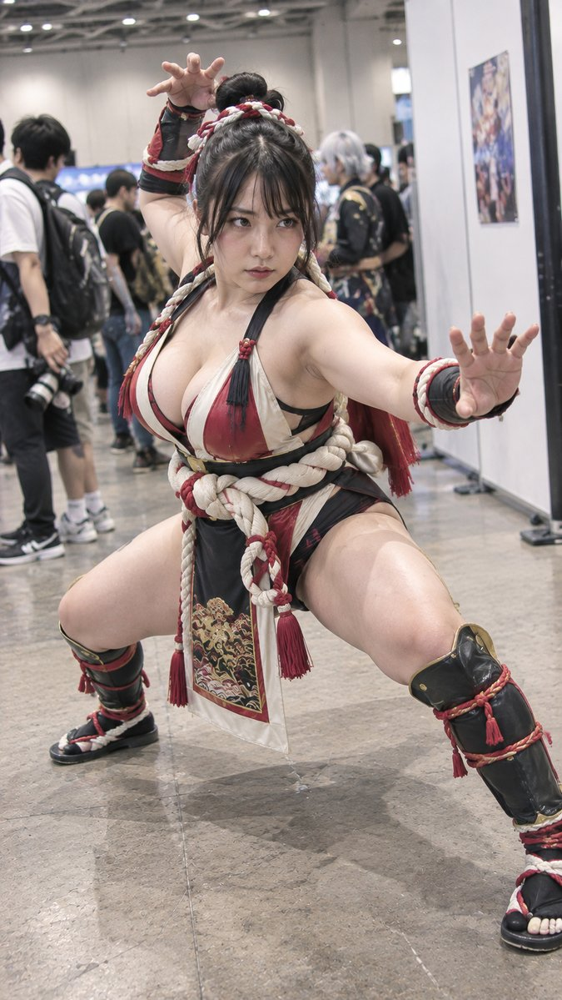
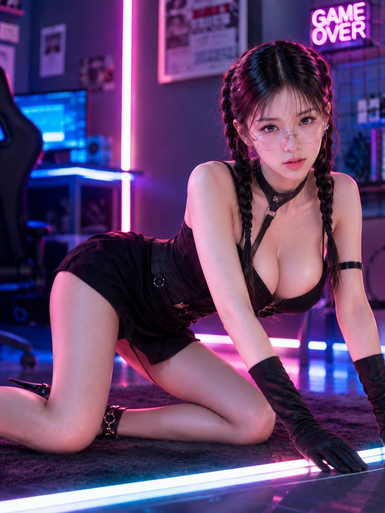
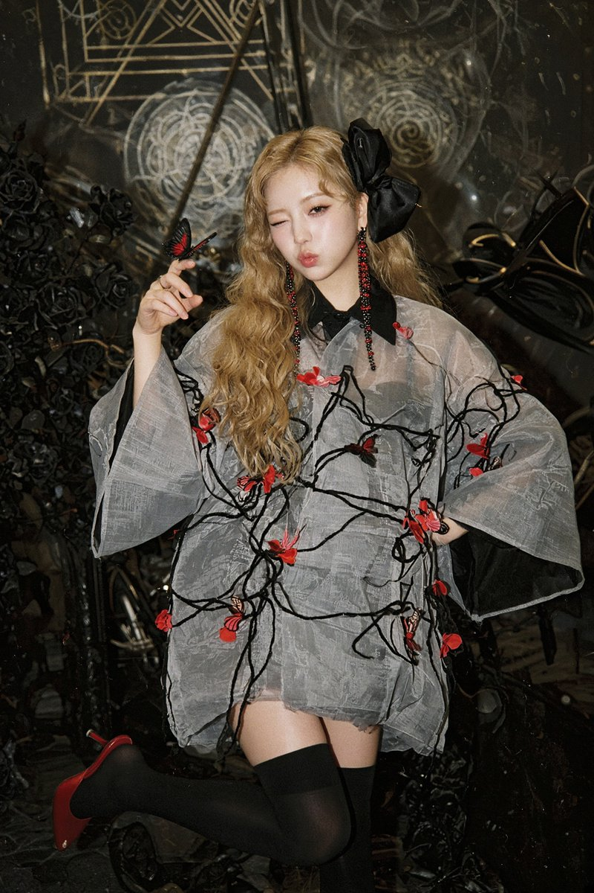
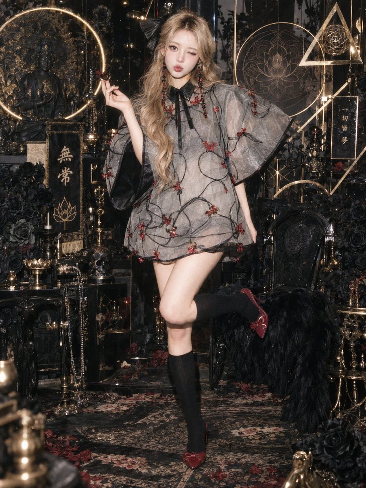

# Image2.5 · Prompt-Bibliothek · Leadde.ai

[](README.md) [](README_zh.md) [](README_zh-TW.md) [](README_ja-JP.md) [](README_ko-KR.md) [](README_th-TH.md) [](README_vi-VN.md) [](README_hi-IN.md) [](README_es-ES.md) [-lightgrey)](README_es-419.md) [](README_de-DE.md) [](README_fr-FR.md) [](README_it-IT.md) [-lightgrey)](README_pt-BR.md) [](README_pt-PT.md) [](README_tr-TR.md)

**Best for:** Image 2.5 prompts for commercial visuals, layouts, keyframes, and image-to-video source assets.

For PDF, PPT, SOP, training, and multilingual video workflows:
[Awesome Document-to-Video](https://github.com/LeaddeOpenLab/awesome-document-to-video)

> **Hochwertige Prompts, täglich kuratiert**

Entdecke vollständige Prompts für KI-Bilder, Videos und 3D. Stöbere nach Stil, lies mehrsprachige Fassungen und finde die ursprünglichen Urheber und Quellen.

[Leadde.ai entdecken →](https://leadde.ai/?utm_source=github&utm_medium=readme&utm_campaign=prompt-library&utm_content=image2.5)

## Leadde.ai kennenlernen

Leadde.ai hilft Teams, Dokumente, Folien und Texte in KI-Geschäftsvideos für Schulungen, Onboarding und Marketing umzuwandeln.

Gib diesem Repository einen Stern, um unsere tägliche Prompt-Auswahl und neue kreative Ideen zu verfolgen.

**91** Prompts · Zuletzt hinzugefügt: **2026-09-13**

<a name="catalog"></a>

## Nach Kategorie durchsuchen

[Fotografie](#category-photography) · [Kinematisch / Filmstill](#category-cinematic-film-still) · [Anime / Manga](#category-anime-manga) · [Illustration](#category-illustration) · [Skizze / Strichzeichnung](#category-sketch-line-art) · [3D-Rendering](#category-3d-render) · [Pixel-Art](#category-pixel-art) · [Aquarell](#category-watercolor) · [Retro / Vintage](#category-retro-vintage) · [Cyberpunk / Sci-Fi](#category-cyberpunk-sci-fi) · [Minimalismus](#category-minimalism) · [Sonstige](#category-other)

<a name="all-prompts"></a>

<a name="category-photography"></a>

## Fotografie

<a name="prompt-2098866288957551034"></a>

### Ein fotorealistisches Blockbuster-Filmbild einer Frau in einem anthrazitfarbenen Reitmantel, die bei greller Sonne auf einem Hirsch aus lebendem Quarz über ein trockenes Steinbett springt.

Autor：[@TraffAlex](https://x.com/TraffAlex) · [Originalbeitrag](https://x.com/TraffAlex/status/2098866288957551034)

Fotografie · Charakter · Veröffentlicht

**Zusammenfassung:** Ein fotorealistisches Blockbuster-Filmbild einer Frau in einem anthrazitfarbenen Reitmantel, die bei greller Sonne auf einem Hirsch aus lebendem Quarz über ein trockenes Steinbett springt.


**Prompt**

```text
Ein fotorealistisches Blockbuster-Filmbild. Eine Frau in einem anthrazitfarbenen Reitmantel klammert sich an den Hals eines Hirsches, dessen Körper aus lebendem Quarz besteht, das Geweih ein Kronleuchter aus Spitzen, der Scherben von Tageslicht wirft. Sie befinden sich mitten im Sprung über ein trockenes Flussbett aus weißen Steinen, die Hufe noch in der Luft, ihr Mantel weht wie eine Flagge. Grelle Sonne, prismatische Regenbögen auf ihrer Wange. Farbpalette: Quarz, Anthrazit, ausgebleichter Himmel, ein Schnittpunkt ihrer blutwarmen Haut. Kinetisch, kein Sattelgewehr, keine Gewalt – Geschwindigkeit. 35mm, Seitenverhältnis 2:3.
```

[↑ Zurück zu Kategorien](#catalog)

---

<a name="prompt-2098868060228927512"></a>

### Fotorealistisches Dschungel-Action-Standbild einer Frau in schlammigem Khaki, die im Regen vor einem floralen Pflanzenmonster flieht.

Autor：[@TraffAlex](https://x.com/TraffAlex) · [Originalbeitrag](https://x.com/TraffAlex/status/2098868060228927512)

Fotografie · Charakter · Veröffentlicht

**Zusammenfassung:** Fotorealistisches Dschungel-Action-Standbild einer Frau in schlammigem Khaki, die im Regen vor einem floralen Pflanzenmonster flieht.


**Prompt**

```text
Ein fotorealistisches Action-Standbild am Rande des Dschungels. Eine Frau in schlammbespritztem Khaki rennt mit weit aufgerissenen Augen auf die Kamera zu; hinter ihr ein dreistöckiger Oger aus nassen Helikonien, Ingwerblüten und Strelizien, dessen Maul aus roten Hochblättern sich öffnet, Pollen wie Rauch. Regen. Farbpalette: Kadmiumrot, Dschungelgrün, Khaki, das Gelb eines Helikonienschnabels. Blütenblätter reißen in ihrem Kielwasser ab. 35mm, Regen auf der Linse. 2:3 Seitenverhältnis.
```

[↑ Zurück zu Kategorien](#catalog)

---

<a name="prompt-2098799449237782991"></a>

### Übersetzung läuft

Autor：[@DeepBlueX0](https://x.com/DeepBlueX0) · [Originalbeitrag](https://x.com/DeepBlueX0/status/2098799449237782991)

Fotografie · Porträt / Selfie · Charakter · Modeartikel · Veröffentlicht

Originalbeitrag：[@DeepBlueX0](https://x.com/DeepBlueX0) · [Originalbeitrag](https://x.com/DeepBlueX0/status/2097630845435572490)

**Zusammenfassung:** Übersetzung läuft


**Prompt**

```text
Übersetzung läuft
```

[↑ Zurück zu Kategorien](#catalog)

---

<a name="prompt-2098797110401335713"></a>

### Übersetzung läuft

Autor：[@sdjn\_wgc](https://x.com/sdjn_wgc) · [Originalbeitrag](https://x.com/sdjn_wgc/status/2098797110401335713)

Fotografie · Porträt / Selfie · Architektur / Interieur · Veröffentlicht

**Zusammenfassung:** Übersetzung läuft


**Prompt**

```text
Übersetzung läuft
```

[↑ Zurück zu Kategorien](#catalog)

---

<a name="prompt-2098779220566839714"></a>

### Übersetzung läuft

Autor：[@AI\_money\_club](https://x.com/AI_money_club) · [Originalbeitrag](https://x.com/AI_money_club/status/2098779220566839714)

Fotografie · Charakter · Essen / Trinken · Veröffentlicht

Originalbeitrag：[@AI\_money\_club](https://x.com/AI_money_club) · [Originalbeitrag](https://x.com/AI_money_club/status/2098767892028535126)

**Zusammenfassung:** Übersetzung läuft


**Prompt**

```text
Übersetzung läuft
```

[↑ Zurück zu Kategorien](#catalog)

---

<a name="prompt-2098610123900064236"></a>

### Ein spontaner Urlaubsschnappschuss einer ostasiatischen Frau mit Mauseohren, die vor einem Fantasieschloss posiert.

Autor：[@Aqsahere\_](https://x.com/Aqsahere_) · [Originalbeitrag](https://x.com/Aqsahere_/status/2098610123900064236)

Fotografie · Charakter · Veröffentlicht

**Zusammenfassung:** Ein spontaner Urlaubsschnappschuss einer ostasiatischen Frau mit Mauseohren, die vor einem Fantasieschloss posiert.


**Prompt**

```text
Ein realistisches, spontanes Reisefoto einer jungen ostasiatischen Frau, die einen vergnüglichen, magischen Tag in einem Märchenschloss verbringt. Sie steht vor einem prächtigen Fantasieschloss im europäischen Stil mit hohen elfenbeinfarbenen Türmen, eleganten blauen Dächern, goldenen Türmchen, kunstvollen Steindetails und wunderschöner Architektur der alten Welt. Das Schloss nimmt den Großteil des Hintergrunds ein und verleiht der Szene die traumhafte Stimmung eines Freizeitparkurlaubs. Sie hat langes, natürlich gewelltes, kastanienbraunes Haar, das locker über ihre Schultern und ihren Rücken fällt. Sie trägt ein süßes, blau-lavendelfarbenes, glitzerndes Mauseohren-Stirnband und lächelt natürlich, während sie leicht nach oben und zur Seite blickt, als sei sie in einem echten Moment des Glücks festgehalten worden. Sie trägt eine kurz geschnittene, cremeweiße Strukturjacke mit Goldknöpfen über einem sauberen weißen Hemd mit Kragen und einer gemusterten Karokrawatte. Ihr hoch taillierter Hosenrock mit Karomuster in Beige, Creme und gedecktem Blau hat weiche Falten, die sich natürlich mit ihrer Pose mitbewegen. Sie streckt beide Arme nach außen und beugt sich mit aufgeregter, verspielter Energie leicht zur Kamera. Die Pose wirkt eher spontan als gestellt, wie ein echter Urlaubsschnappschuss. Der Schlosshof hinter ihr bietet breite Stufen aus hellem Stein, dekorative Geländer, farbenfrohe Banner und eine detaillierte, mittelalterlich inspirierte Architektur. Der Himmel ist sanft bedeckt mit blassen blau-grauen Wolken, was ein sanftes, vorteilhaftes Tageslicht und natürliche Schatten erzeugt. Ultrafotorealistische Reisefotografie, authentisches jugendliches Aussehen, realistische Hauttextur, natürliche Haarsträhnen, detaillierte Stofftexturen, glaubwürdige Proportionen, weiche Tiefenschärfe, subtile natürliche Schatten, lebendige, aber leicht gedämpfte Farben, Schnappschuss-Ästhetik eines Smartphones, traumhafte Urlaubsatmosphäre, hochdetailliert, vertikale 3:4-Komposition.
```

[↑ Zurück zu Kategorien](#catalog)

---

<a name="prompt-2098616431122559479"></a>

### Prompt für Dokumentarfotografie einer Schülerin auf dem Sportplatz im iPhone-Schnappschuss-Stil

Autor：[@DeepBlueX0](https://x.com/DeepBlueX0) · [Originalbeitrag](https://x.com/DeepBlueX0/status/2098616431122559479)

Fotografie · Porträt / Selfie · Veröffentlicht

Originalbeitrag：[@DDJCXX](https://x.com/DDJCXX) · [Originalbeitrag](https://x.com/DDJCXX/status/2098240447038767437)

**Zusammenfassung:** Prompt für Dokumentarfotografie einer Schülerin auf dem Sportplatz im iPhone-Schnappschuss-Stil


**Prompt**

```text
Campus-Alltagsdokumentation; amüsanter Zufall; Schnappschuss mit der Original-iPhone-Kamera; schmale Schultern, extrem schlanke Taille·Schülerin mit betonter Oberweite🙆🏻‍♀️
```

[↑ Zurück zu Kategorien](#catalog)

---

<a name="prompt-2098277829154951371"></a>

### Asymmetrische maritime Kunstfotografie mit einem korallenrosa Segelboot vor Anker in einer ruhigen, verlassenen Bucht, flankiert von einer Kiefer zur Rechten.

Autor：[@listudio](https://x.com/listudio) · [Originalbeitrag](https://x.com/listudio/status/2098277829154951371)

Fotografie · Fahrzeug · Veröffentlicht

**Zusammenfassung:** Asymmetrische maritime Kunstfotografie mit einem korallenrosa Segelboot vor Anker in einer ruhigen, verlassenen Bucht, flankiert von einer Kiefer zur Rechten.


**Prompt**

```text
Erstelle eine maritime Kunstfotografie im Hochformat 3:4. Eine ruhige, menschenleere Bucht, ein klarer graublauer Himmel, der die oberen 70 % einnimmt, und ein gerader, tiefblauer Horizont im unteren Bereich. Ein realistisches, kleines Einrumpf-Segelboot liegt im unteren mittleren Bereich leicht links vor Anker, ein schlanker Mast ragt in den Himmel, das korallenrosa Dreieckssegel ist leicht gebläht, glaubwürdige Nahtspannung im Segeltuch, ein schmaler tiefblauer Streifen am Segelfuß, die Kabine rosig-weiß, die Fenster tiefschwarz, der Unterwasserrumpf korallenrot, stimmig feine Takelage. Die ruhige, cyanblaue Wasseroberfläche zeigt feine horizontale Wellen und weiche, zerstreute rosa Reflexionen. Auf der rechten Seite rahmt eine dunkle Kiefer die Szene asymmetrisch ein; der Stamm wächst von unten rechts empor, die Krone ragt von oben rechts herein, Nadeln mit dezenten dunkelrot-pinken Sonnenlicht-Highlights, wobei viel freier Himmel erhalten bleibt. Ganz unten ein Streifen feinster weiß-rosafarbener Sandstrand mit zarten Baumschatten. Realistischer Rumpf, Baumrinde, Kiefernadeln, Meerwasser, klares Sonnenlicht, tiefe Schatten, feines Filmkorn, dezente matte Drucktextur, surreale Farben bei glaubwürdiger Raumwirkung, ruhig, nachhallend, traumhaft distanziert. Keine Personen, Text, Logo oder Wasserzeichen.
```

[↑ Zurück zu Kategorien](#catalog)

---

<a name="prompt-2098277612053561383"></a>

### Surreale Kunstfotografie eines rosa-weißen Salzufers und Meerwassers mit Farbverlauf von Korallenrot zu Dunkelblau.

Autor：[@listudio](https://x.com/listudio) · [Originalbeitrag](https://x.com/listudio/status/2098277612053561383)

Fotografie · Landschaft / Natur · Veröffentlicht

**Zusammenfassung:** Surreale Kunstfotografie eines rosa-weißen Salzufers und Meerwassers mit Farbverlauf von Korallenrot zu Dunkelblau.


**Prompt**

```text
Erstelle eine surreale Farb-Kunstfotografie im Hochformat 3:4. Eine menschenleere, weite Küste, das obere Viertel besteht aus einem gleichmäßigen grau-kobaltblauen Himmel, durchzogen von einem extrem feinen, blassrosa fernen Ufer entlang des hohen Horizonts. Ein rosa-weißer Salz-Klippenrand erstreckt sich von links bis in den unteren Vordergrund, wobei raue Kristallkörner, loser Kies und natürliche Erosionskanten deutlich sichtbar sind; die Uferlinie bildet einen sanften, asymmetrischen Bogen. Das seichte Wasser in Ufernähe zeigt ein kräftiges Korallenrot, Zinnoberrot und Rosa, während einige zarte, brechende Wellen diagonal nach rechts unten rollen und allmählich in das dunkle preußischblaue Meerwasser auf der rechten Seite übergehen; das Wasser besitzt echte Transparenz, feine Wellen und Reflexionen, ohne wie Farbe oder Lava zu wirken. Sonniges Seitenlicht, rosa-weiße Lichter mit erhaltenen Details, saubere große Farbflächen im Kontrast zu echten mikroskopischen Texturen, feines Filmkorn, matte Druckoptik, still, fremdartig, glühend und doch kühl. Randlose Fotografie, kein Text, Rahmen, Logo oder Wasserzeichen.
```

[↑ Zurück zu Kategorien](#catalog)

---

<a name="prompt-2098277688498880901"></a>

### Surrealistisches Porträtfoto eines rothaarigen Schecken vor reinem blauem Himmel.

Autor：[@listudio](https://x.com/listudio) · [Originalbeitrag](https://x.com/listudio/status/2098277688498880901)

Fotografie · Porträt / Selfie · Zusammenfassung / Hintergrund · Veröffentlicht

**Zusammenfassung:** Surrealistisches Porträtfoto eines rothaarigen Schecken vor reinem blauem Himmel.


**Prompt**

```text
Erstelle eine surrealistische Tierporträt-Kunstfotografie im Hochformat 3:4. Froschperspektive auf Kopf, Hals, Schultern und Brust eines kräftigen Schecken; der Körper ist unten und rechts natürlich beschnitten; der Pferdekopf befindet sich im mittleren unteren Bereich, in einer Dreiviertelansicht nach links gedreht; die Ohren stehen natürlich aufgerichtet; die tiefschwarzen, feuchten Augen weisen eine winzige Lichtreflexion auf. Das obere Drittel zeigt einen wolkenlosen, reinen kobaltblauen Himmel. Das Fell ist detailreich und surrealistisch umgefärbt, hauptsächlich in sattem Ziegelrot und Korallenrot, mit großen, unregelmäßigen rosa-weißen Flecken vom Nasenrücken bis zu den Nüstern und spärlichem Dunkelblau zwischen den roten und weißen Flecken an Schultern und Brust. Die lange Mähne wird von einem starken Wind von rechts nach links geweht, wobei sich feine, lange Haarsträhnen überlagern, leuchtend rote Strähnen mit tief weinroten Schatten verwoben sind und teilweise über den Hals fallen. Kurzes Fell, Nüstern, Tasthaare und Muskeldetails sind lebensecht. Helles, natürliches Seitenlicht, dichte und vielschichtige Tiefen, gestochen scharfe Fotografie, die den Moment einfriert, feines Filmkorn und matte Farbtöne mit einer wilden, freien und markanten Fashion-Editorial-Anmutung. Kein Zaumzeug, keine Personen, kein Text, kein Logo oder Wasserzeichen.
```

[↑ Zurück zu Kategorien](#catalog)

---

<a name="prompt-2098277762410942530"></a>

### Surreale Kaktus-Pflanzenfotografie im Rot-Blau-Farbkontrast mit flachen korallenroten Kakteen und dunkelkobaltblauem Säulenkaktus.

Autor：[@listudio](https://x.com/listudio) · [Originalbeitrag](https://x.com/listudio/status/2098277762410942530)

Fotografie · Veröffentlicht

**Zusammenfassung:** Surreale Kaktus-Pflanzenfotografie im Rot-Blau-Farbkontrast mit flachen korallenroten Kakteen und dunkelkobaltblauem Säulenkaktus.


**Prompt**

```text
Erstelle eine surreale botanische Kunstfotografie im Hochformat 3:4. Vor dem Hintergrund eines leicht gräulichen, wolkenlosen himmelblauen Himmels blickt die Kamera aus der Untersicht auf eine Gruppe echter Kakteen, die vom unteren Bildrand heraufwachsen und angeschnitten sind. Von links bis zur Mitte befinden sich drei bis fünf versetzte, ovale, flache Kaktusglieder, von denen das höchste leicht nach links geneigt ist; die Außenhaut ist in leuchtendem Korallenrot und Wassermelonenrot umgefärbt, wobei das wachsartige, matte Finish, feine Fältelungen und regelmäßige, aber unmechanische Areolen erhalten bleiben. Auf der rechten Seite steht ein hoher, dunkelkobaltblauer Säulenkaktus mit ausgeprägten vertikalen Rippen, tief preußischblauen Rillen und zinnoberroten, sternförmigen Dornen entlang der Rippenkanten. Am unteren Rand überlappen sich wenige blaue Flachglieder mit kleinen roten Gliedern in klaren Schichten, während oben links eine Himmelslücke frei bleibt. Starkes natürliches Sonnenlicht von oben links modelliert das Volumen der Pflanzen und die Dornen; die lebendigen Farben haften auf glaubwürdigem Pflanzengewebe. Geometrisch-skulpturale, asymmetrische Komposition, feine fotografische Textur, dezentes Filmkorn, zurückhaltende Mattierung, frei von Plastik- oder 3D-Rendering-Anmutung. Keine Blumentöpfe, Blüten, Texte, Logos oder Wasserzeichen.
```

[↑ Zurück zu Kategorien](#catalog)

---

<a name="prompt-2097886029692969195"></a>

### Foto-Prompt für das Spiegelselfie einer chinesischen Influencerin im Schlafzimmer, zeigt Kurzhaarfrisur, tief ausgeschnittenes Outfit und sanften Innenlicht-Stil.

Autor：[@ohmuyi](https://x.com/ohmuyi) · [Originalbeitrag](https://x.com/ohmuyi/status/2097886029692969195)

Fotografie · Porträt / Selfie · Influencer / Model · Modeartikel · Architektur / Interieur · Veröffentlicht

**Zusammenfassung:** Foto-Prompt für das Spiegelselfie einer chinesischen Influencerin im Schlafzimmer, zeigt Kurzhaarfrisur, tief ausgeschnittenes Outfit und sanften Innenlicht-Stil.


**Prompt**

```text
3:4, Nahaufnahme-Spiegelselfie mit dem Handy, chinesische Influencerin, kühle helle Haut, schwarzer kurzer Bob mit luftigem geradem Pony, eng anliegendes tief ausgeschnittenes Kurzarmshirt, Handy verdeckt das rechte Drittel des Gesichts, Schlafzimmer mit weißem Bett und Spiegel mit schwarzem Rahmen, sanftes Innenlicht, sanft und bezaubernd
```

[↑ Zurück zu Kategorien](#catalog)

---

<a name="prompt-2097532595814940683"></a>

### Prompt für ein realistisches Reisefoto einer jungen ostasiatischen Frau an der Küste des Mont-Saint-Michel.

Autor：[@saniaspeaks\_](https://x.com/saniaspeaks_) · [Originalbeitrag](https://x.com/saniaspeaks_/status/2097532595814940683)

Fotografie · Porträt / Selfie · Charakter · Veröffentlicht

**Zusammenfassung:** Prompt für ein realistisches Reisefoto einer jungen ostasiatischen Frau an der Küste des Mont-Saint-Michel.


**Prompt**

```text
Ein fotorealistisches, ungestelltes Reiseporträt einer jungen ostasiatischen Frau, die an einer ruhigen Sandküste neben großen moosbedeckten Felsen steht, während sich hinter ihr auf einer felsigen Insel eine prächtige historische Steinabtei und eine mittelalterliche, schlossähnliche Architektur dramatisch erhebt. Sie hat langes, glattes, dunkelbraunes Haar, das natürlich über eine Schulter fällt, weiche jugendliche Gesichtszüge und ein sanftes, warmes Lächeln, während sie direkt in die Kamera blickt.

Sie trägt einen langen, übergroßen schwarzen Mantel, die Hände lässig in den Taschen vergraben, über einem hellen Outfit. Ein großer, weicher, cremeweißer Schal ist wärmend um ihren Hals gewickelt und hängt nach vorne herab, mit einem kleinen schwarzen Designer-Emblem nahe dem Ende. Eine zarte Kettenumhängetasche ist teilweise sichtbar.

Die Komposition fängt sie im Vordergrund ein, während die gewaltige historische Abtei den Hintergrund dominiert, umgeben von alten Steinmauern, felsigen Klippen, sandigen Wattflächen und einer ruhigen Küstenatmosphäre. Einige wenige kleine, entfernte Fahrzeuge und Menschen verleihen der Szene einen realistischen Maßstab. Weiches, natürliches Abendlicht und ein klarer, blassblauer Himmel erzeugen eine friedliche europäische Reisestimmung.

Ultrarealistische Fotografie, authentisches Schnappschuss-Reisefoto, natürliche Hautstruktur, realistische Stoffdetails, weiche filmische Beleuchtung, subtile Smartphone-Kamera-Ästhetik, leicht verträumte Farbgebung, natürliche Proportionen, detaillierte Architektur, friedliche Küstenatmosphäre, vertikale Komposition, Seitenverhältnis 3:4.
```

[↑ Zurück zu Kategorien](#catalog)

---

<a name="prompt-2097411028510179759"></a>

### Prompt für ein hochauflösendes Landschaftsfoto einer Waldlichtung mit üppiger grüner Vegetation.

Autor：[@mark\_k](https://x.com/mark_k) · [Originalbeitrag](https://x.com/mark_k/status/2097411028510179759)

Fotografie · Landschaft / Natur · Veröffentlicht

**Zusammenfassung:** Prompt für ein hochauflösendes Landschaftsfoto einer Waldlichtung mit üppiger grüner Vegetation.


**Prompt**

```text
Foto einer Waldlichtung mit viel grünem Blattwerk, sehr detailliert
```

[↑ Zurück zu Kategorien](#catalog)

---

<a name="prompt-2098975203866837026"></a>

### Realistischer Porträt-Prompt im Hochformat einer Frau, die im warm beleuchteten Schlafzimmer im Schneidersitz auf dem Bett sitzt und ein Selfie im Spiegel macht.

Autor：[@CyberTotal2026](https://x.com/CyberTotal2026) · [Originalbeitrag](https://x.com/CyberTotal2026/status/2098975203866837026)

Fotografie · Porträt / Selfie · Charakter · Veröffentlicht

**Zusammenfassung:** Realistischer Porträt-Prompt im Hochformat einer Frau, die im warm beleuchteten Schlafzimmer im Schneidersitz auf dem Bett sitzt und ein Selfie im Spiegel macht.



**Prompt**

```text
Thema:
Smartphone-Spiegel bei Nachtbeleuchtung

Motiv:
Vertikales Foto einer erwachsenen Frau, die im Schneidersitz auf dem Bett in einem Schlafzimmer mit warmem Lampenlicht sitzt und mit einem großen Smartphone ein Spiegel-Selfie aufnimmt. Die Person ist an der Bildmitte ausgerichtet.

Person & Ausdruck:
Langes schwarzes Haar hinten zusammengebunden, dünner Pony. Das Smartphone verdeckt den zentralen Teil des Gesichts weitgehend; nur ein Auge, eine Wange und ein Teil der glänzenden rosafarbenen Lippen sind sichtbar. Das Gesicht ist nach vorne gerichtet. Ruhiger Gesichtsausdruck.

Kleidung & Pose:
Weißes geripptes Spaghettiträger-Top mit Spitze und kleinen Knöpfen am Dekolleté, graue Shorts mit Kordelzug, weiße kniehohe Socken. Im Schneidersitz sitzend, hält sie mit einer Hand ein großes kupferfarbenes Smartphone vor das Gesicht. Weißes Oberteil und graue Hose.

Hintergrund & Licht:
Weißes Bettzeug, hölzerner Nachttisch, Tischlampe mit warmem Licht, dunkles Fenster. Warmes oranges Licht wirft weiche Schatten auf die Person und das Bettzeug. Das Hauptlicht im Bildhintergrund ist sanftes Licht von der Fensterseite.

Komposition & Kamera:
Vertikale 2:3-Komposition, die Kamera nimmt die Spiegelfläche frontal auf, als sitzende Fast-Ganzkörperaufnahme. Die Person im Zentrum, das große Smartphone mitten im Gesicht, die Beine mit weißen Socken im unteren Bereich platziert. Fokus auf Spiegelbild und Kleidung. Die Person nimmt einen großen Bildbereich ein, die Hauptfigur ist scharf fokussiert, der Hintergrund hat ein leichtes Bokeh.

Textur & Stil:
Fotorealistisches nächtliches Spiegel-Selfie. Spiegelfläche, kupferfarbenes Gerät, weißer Rippenstoff mit Spitze, grauer Stoff und warme Lampe wirken vollkommen natürlich.

Negativ:
Die Komposition, bei der das Smartphone die Mitte des Gesichts weitgehend verdeckt, nicht verändern
```

[↑ Zurück zu Kategorien](#catalog)

---

<a name="prompt-2098945760817479956"></a>

### Fotorealistischer Porträt-Prompt im natürlichen Morgenlicht einer Frau im schwarzen Satin-Slipkleid, die sich im Bett umblickt.

Autor：[@CyberTotal2026](https://x.com/CyberTotal2026) · [Originalbeitrag](https://x.com/CyberTotal2026/status/2098945760817479956)

Fotografie · Charakter · Veröffentlicht

**Zusammenfassung:** Fotorealistischer Porträt-Prompt im natürlichen Morgenlicht einer Frau im schwarzen Satin-Slipkleid, die sich im Bett umblickt.



**Prompt**

```text
Thema:
Schwarzer Satin im Morgenlicht

Hauptmotiv:
Vertikale Fotografie einer erwachsenen Frau, die in einem von der Morgensonne erhellten weißen Bett sitzt, ein schwarzes Satin-Mini-Slipkleid trägt und dem Betrachter den Rücken zuwendet. Die Person ist an der Bildmitte ausgerichtet.

Person & Ausdruck:
Schulterlanges, dunkelbraunes, sanft gewelltes Haar mit feinem Pony. Feine ovale Gesichtsform, mandelförmige braune Augen, natürliche Brauen, zierliche Nase, glänzende rosafarbene Lippen. Ruhiger Blick über die Schulter in die Kamera. Das Gesicht blickt über die Schulter zur Kamera.

Kleidung & Pose:
Schwarzes, glänzendes Satin-Mini-Slipkleid mit Spaghettiträgern. Der Rücken ist bis nahe an die Taille tief ausgeschnitten, an beiden Seiten mit mehreren feinen Schnürungen und kleinen Schleifen versehen. Sie sitzt mit seitlich angewinkelten Beinen da, eine Hand liegt auf dem Bettzeug. Schwarzes Minikleid.

Hintergrund & Licht:
Weiße Laken und Kissen, helle Wände, großes Fenster. Starkes Morgenlicht erzeugt feine weiße Reflexionen auf dem schwarzen Satin und beleuchtet Rücken und Haare warm. Das Hauptlicht im Bildhintergrund ist sanftes Licht von der Fensterseite.

Komposition & Kamera:
Vertikale 4:5-Komposition, Kamera am Bettrand für eine Aufnahme von schräg hinten oberhalb der Knie. Die Person ist dominant in der Mitte platziert, wobei der offene Rücken und die seitlichen Schnürungen im Mittelpunkt stehen. Fokus auf das sich umwendende Gesicht und den Satin. Person groß im Bild, Fokus auf das Hauptmotiv, Hintergrund mit sanftem Bokeh.

Textur & Stil:
Fotorealistische Fotografie bei natürlichem Licht. Spiegelnder Glanz des schwarzen Satins, feine Schnürbänder, weiße Bettwäsche, Morgenlicht auf Haar und Haut detailgetreu eingefangen.

Negativ:
Den tief ausgeschnittenen Rücken und die Schnürungen an beiden Seiten nicht weglassen
```

[↑ Zurück zu Kategorien](#catalog)

---

<a name="prompt-2098925376554811573"></a>

### Übersetzung läuft

Autor：[@splash\_GL](https://x.com/splash_GL) · [Originalbeitrag](https://x.com/splash_GL/status/2098925376554811573)

Fotografie · Tier / Kreatur · Veröffentlicht

**Zusammenfassung:** Übersetzung läuft









**Prompt**

```text
Übersetzung läuft
```

[↑ Zurück zu Kategorien](#catalog)

---

<a name="prompt-2098631695855669712"></a>

### Eine gemütliche, fotorealistische Aufnahme einer ostasiatischen Frau in einem warmen Wohnmobil, die in den sternenklaren Himmel der Milchstraße blickt.

Autor：[@laviniavelle](https://x.com/laviniavelle) · [Originalbeitrag](https://x.com/laviniavelle/status/2098631695855669712)

Fotografie · Charakter · Veröffentlicht

**Zusammenfassung:** Eine gemütliche, fotorealistische Aufnahme einer ostasiatischen Frau in einem warmen Wohnmobil, die in den sternenklaren Himmel der Milchstraße blickt.


**Prompt**

```text
Ein realistisches, gemütliches und hochdetailliertes Foto einer jungen ostasiatischen Frau mit den Haaren in einem lockeren, weichen Dutt, die nachts bequem in einem warmen Campingbus sitzt. Sie ist in eine dicke, plüschige rosa Steppdecke mit Blumenmuster gehüllt, trägt einen gemütlichen, flauschigen rosa Fleecepullover, hält eine rosa Keramiktasse mit beiden Händen und blickt mit einem sanften, heiteren Lächeln aus dem großen Fenster des Vans. Draußen vor dem Fenster offenbart ein atemberaubender dunkler Nachthimmel eine lebendige, sternenübersäte Milchstraße über fernen Bergsilhouetten. Der Innenraum des Vans ist erfüllt von warmen Lichterketten, gemütlichen Holzregalen mit kleiner Wohndekoration, gerahmten Fotos und niedlichen Plüschtieren, einem weißen Häschen und einem gelben Entlein. Warme Umgebungsbeleuchtung, cineastisch, 8k-Auflösung, fotorealistisch, verträumte Atmosphäre.
```

[↑ Zurück zu Kategorien](#catalog)

---

<a name="prompt-2097585546973614232"></a>

### Übersetzung läuft

Autor：[@CyberTotal2026](https://x.com/CyberTotal2026) · [Originalbeitrag](https://x.com/CyberTotal2026/status/2097585546973614232)

Fotografie · Charakter · Veröffentlicht

**Zusammenfassung:** Übersetzung läuft


**Prompt**

```text
Übersetzung läuft
```

[↑ Zurück zu Kategorien](#catalog)

---

<a name="prompt-2097534208541442338"></a>

### Prompt für einen iPhone-Frontkamera-Schnappschuss als Nahaufnahme einer jungen ostasiatischen Frau mit kühlem weißem Hautton, grau-weißem Plüschhintergrund und mehreren Posenoptionen zum Gesichtstützen und Träumen.

Autor：[@AIVideoHub\_](https://x.com/AIVideoHub_) · [Originalbeitrag](https://x.com/AIVideoHub_/status/2097534208541442338)

Profil / Avatar · Fotografie · Porträt / Selfie · Charakter · Zusammenfassung / Hintergrund · Veröffentlicht

**Zusammenfassung:** Prompt für einen iPhone-Frontkamera-Schnappschuss als Nahaufnahme einer jungen ostasiatischen Frau mit kühlem weißem Hautton, grau-weißem Plüschhintergrund und mehreren Posenoptionen zum Gesichtstützen und Träumen.


**Prompt**

```text
📱 Schnappschuss mit der iPhone-Frontkamera, 9:16; wunderschöne ostasiatische Frau im Alter von 18–22 Jahren, eindeutig volljährig, ca. 1,75 m groß, zarte Gesichtszüge, kühle und durchscheinende weiße Haut, schlanke und hochgewachsene Modelfigur, optisch natürlich wirkende E-Körbchen-Brust. Dunkles, geschmeidiges, voluminöses, langes Haar mit großen Wellen, helles, figurbetontes Spaghettiträger-Top mit tiefem V-Ausschnitt, das makellose Schultern und die Halslinie betont, runde Augenform, sanfte gerade Augenbrauen, tiefschwarze, klare Augen, zartrosa Rouge und hydratisierte Lippen mit Rosaton, träge und ruhig.

🩶 Sehr nahes Porträt-Nahaufnahme in gedämpft beleuchtetem Innenraum, verschwommener Hintergrund aus grau-weißem Plüschgewebe, kühles schwaches Licht, geringe Belichtung, entsättigter grau-weißer Filter, geringer Kontrast, leichte Schärfe, weichgezeichnete dunstige Körnung, ungezwungen und entspannt, sauber und edel, mit einer leicht melancholischen, kühlen Atmosphäre.

Zufälliger Posen-Pool:

🤍 Das Gesicht mit einer Hand stützend, die Handfläche liegt an Wange und Kiefer, ruhig in die Kamera blickend
🫧 Der Ellbogen stützt die Wange, der Kopf leicht geneigt und gedankenverloren
🌙 Das halbe Gesicht in die Handfläche vergraben, verträumter und leerer Blick
💭 Die Finger liegen sanft an Kinn und Gesichtswange, den Kopf leicht gesenkt und dann langsam die Augen hebend
🪞 Nah an der Kamera, die Hand stützt das Gesicht, langes Wellenhaar fällt über die Schultern
☁️ Die Wange an den Handrücken geschmiegt, der Blick aus dem Bild gerichtet
💤 Hand stützt die Wange, Schultern leicht zusammengezogen, wie müde überrascht geknipst
✨ Das Gesicht gestützt nahe an einem Plüschkissen, mit einem ganz leichten Lächeln auf den Lippen

🎲 Variiere Selfie-Distanz, Art des Gesichtstützens, Blick, Haarsträhnen, schwaches Licht, Unschärfe und Körnigkeit frei nach verschiedenen Posen, wobei der Fokus auf der sehr nahen Porträt-Nahaufnahme, dem kühlen grau-weißen Farbton und der authentischen iPhone-Frontkamera-Schnappschuss-Qualität liegt, um ein Dreamcore-Zuhause-Gefühl × melancholische Stimmung × elegantes, minimalistisches Porträt zu erzielen.

Erstelle ein zusammenfassendes Vorschaubild, das verschiedene Aktionen enthält, damit ich daraus auswählen kann.
```

[↑ Zurück zu Kategorien](#catalog)

---

<a name="prompt-2096909970398941572"></a>

### Fotorealistisches 9:16-Spiegel-Selfie einer sportlichen brasilianischen Frau in einem terrakotta-orangen Body in einem gehobenen Fitnessstudio.

Autor：[@MrDasOnX](https://x.com/MrDasOnX) · [Originalbeitrag](https://x.com/MrDasOnX/status/2096909970398941572)

Fotografie · Porträt / Selfie · Charakter · Veröffentlicht

**Zusammenfassung:** Fotorealistisches 9:16-Spiegel-Selfie einer sportlichen brasilianischen Frau in einem terrakotta-orangen Body in einem gehobenen Fitnessstudio.


**Prompt**

```text
Fotorealistisches Spiegel-Selfie in einem luxuriösen Indoor-Fitnessstudio, vertikal 9:16, eine junge erwachsene brasilianische Frau in einer entspannten Kontrapost-Pose, die ein Smartphone-Selfie aufnimmt. Die Kamera fängt die Szene durch einen großen, bodentiefen Spiegel mit einem Smartphone-Weitwinkelobjektiv ein, das 28–35 mm entspricht. Die Person steht etwa 1 Meter vom Spiegel entfernt. Der gesamte Körper von Kopf bis zu den Turnschuhen ist sichtbar. Sie befindet sich in der linken Bildmitte. Ein warmer Holzboden, schwarze Gummimatten sowie Reihen von Kettlebells und Seilzuggeräten sind rechts und im Hintergrund zu sehen. Die Person ist eine junge erwachsene brasilianische Frau mit einem kompakten, athletisch-kurvigen Körperbau: mäßig breite Schultern, definierte, aber nicht wuchtige Arme, voller Busen, schmale Taille, runde Hüften und natürlich kräftige Oberschenkel. Die Proportionen wirken geerdet und echt, statt modelhaft-dünn oder übertrieben. Warme, goldbraune Haut mit sichtbaren Poren und subtilen Nuancen. Weiches, natürliches Licht, keine künstliche Plastikhaut. Sie steht mit dem Gewicht auf dem rechten Bein, das linke Knie leicht gebeugt und nach außen gedreht, die Hüften zum Spiegel angewinkelt. Der Oberkörper dreht sich sanft, sodass ihre linke Schulter dem Glas näher ist. Die linke Hand ruht auf ihrer Hüfte; die rechte Hand hält ein dunkles Smartphone auf Wangenhöhe nah an ihr Gesicht. Der Kopf ist über die linke Schulter zum Smartphone gedreht, das Kinn leicht gesenkt, der Gesichtsausdruck ruhig und dezent selbstbewusst mit einem kleinen Lächeln bei geschlossenem Mund. Die Augen blicken auf den Bildschirm. Das Haar ist dunkelbraun mit warmen Karamell-Highlights, schulterlang, getragen in einem lockeren, tiefen Pferdeschwanz mit Strähnen, die das Gesicht umrahmen. Das Gesicht ist oval mit hohen Wangenknochen, vollen Lippen in einem natürlichen Nude-Rosa-Ton und dunkelbraunen, mandelförmigen Augen. Das Outfit ist ein hochgeschlossener, tief terrakotta-oranger Sport-Einteiler mit dünnen Trägern, moderater Bedeckung und einem hoch geschnittenen, aber dennoch dezenten Beinausschnitt. Mattes Stretchmaterial, keine Logos. Weiße Turnschuhe mit sauberen Sohlen. Die Umgebung ist ein modernes High-End-Fitnessstudio mit großen Spiegeln, freiliegendem Backstein an einer Wand, warmen Pendelleuchten gemischt mit kühlen Decken-LEDs und einigen anderen Personen, die im Hintergrund sanft unscharf trainieren. Realistisches Smartphone-HDR, natürliche Körnung, präzise Reflexionen und glaubwürdige Schatten.
```

[↑ Zurück zu Kategorien](#catalog)

---

<a name="prompt-2096901566985068734"></a>

### Prompt für Porträtschnappschüsse einer japanischen Flugbegleiterin in Uniform vor der Flugzeugtür mit integriertem Pool zufälliger Aktionen.

Autor：[@AIVideoHub\_](https://x.com/AIVideoHub_) · [Originalbeitrag](https://x.com/AIVideoHub_/status/2096901566985068734)

Fotografie · Porträt / Selfie · Charakter · Zusammenfassung / Hintergrund · Veröffentlicht

**Zusammenfassung:** Prompt für Porträtschnappschüsse einer japanischen Flugbegleiterin in Uniform vor der Flugzeugtür mit integriertem Pool zufälliger Aktionen.


**Prompt**

```text
📱 Beiläufiger japanischer Airline-Schnappschuss, 3:4; wunderschöne ostasiatische Frau im Alter von 18–22 Jahren, eindeutig erwachsen, ca. 1,75 m groß, feine und süße Gesichtszüge, kühles weißes Porzellanhautbild, hochgewachsene schlanke Modelfigur, visuelle Oberweite ca. natürliches E-Körbchen. Elegante Hochsteckfrisur, weiße Bluse mit tiefem V-Ausschnitt × dunkelblaue Flugbegleiterinnen-Weste × blau-weiß gestreifter kurzer Rock, gelbes Seidentuch, schwarze Pumps mit mittelhohem Absatz und schwarze Strumpfhose.

✈️ Bereich der Flugzeugtür, Klappsitz, Türgriff, Warnschilder und Gepäckablagen natürlich im Bildausschnitt. Kühles Grau mit niedriger Sättigung, schräge Handheld-Smartphone-Komposition, diffuses Deckenlicht, leichte Überbelichtung, Bildrauschen und Unschärfe an den Rändern, transparenter No-Makeup-Look im Pfirsichton, echte Amateurschnappschuss-Atmosphäre.

Zufälliger Posen-Pool:

💺 Auf dem Klappsitz sitzend, ein Bein angewinkelt, die Hand hebend, um die Hochsteckfrisur zu richten
✈️ Seitlich neben der Flugzeugtür sitzend, sich umdrehend mit einem süßen Lächeln
🧣 Den Kopf senkend, um das Seidentuch zu richten, plötzlich den Blick zur Kamera hebend
👜 Vornübergebeugt in der Handtasche kramend, im Moment der Bewegung erfasst
🙆🏻‍♀️ An die Rückenlehne gelehnt sich räkelnd, natürliche und entspannte Haltung
🪞 Aufstehend, um Weste und Rocksaum zu richten, sich seitlich zur Kamera drehend
💬 Sitzend das Kinn aufstützend und tagträumend, Beine natürlich versetzt
🚪 Sich am Rand der Flugzeugtür festhaltend aufstehend, sich umdrehend und lächelnd

🎲 Nach Auswahl der Pose freies Spiel mit Kameraposition, Kabinendetails, Mimik, Handheld-Neigung und Unschärfeeffekten, mit dem Ziel: Flugbegleiterinnen-Uniform × japanisches Lifestyle-Porträt × zufälliger Handy-Schnappschuss-Look.

Erstelle ein kombiniertes Vorschaubild mit verschiedenen Posen, aus denen ich wählen kann.
```

[↑ Zurück zu Kategorien](#catalog)

---

<a name="prompt-2097249218507461093"></a>

### Fotorealistisches Nahaufnahme-Innenporträt einer asiatischen Frau im Sonnenlicht

Autor：[@Aqsahere\_](https://x.com/Aqsahere_) · [Originalbeitrag](https://x.com/Aqsahere_/status/2097249218507461093)

Fotografie · Porträt / Selfie · Charakter · Veröffentlicht

**Zusammenfassung:** Fotorealistisches Nahaufnahme-Innenporträt einer asiatischen Frau im Sonnenlicht


**Prompt**

```text
Ein fotorealistisches Nahaufnahme-Innenporträt einer jungen Frau, die bequem in einem geflochtenen Rattanstuhl in der Nähe eines hellen Fensters sitzt. Sie hat langes, natürlich zerzaustes dunkelbraunes Haar mit warmen braunen Strähnchen, das nahe der Mitte gescheitelt ist, wobei lose Strähnen ihr Gesicht sanft umrahmen und teilweise bedecken. Sie blickt mit einem ruhigen, leicht verträumten Ausdruck und natürlichen, sanft getönten Lippen direkt in die Kamera. Eine Hand ist sanft vor ihr Gesicht gehoben, wobei ihre Fingerspitzen zart um ihre Lippen und ihre Wange ruhen, was eine intime, ungezwungene Pose erzeugt. Ihre Finger sind schlank und natürlich positioniert. Sie trägt ein einfaches, übergroßes, cremeweißes/hellbeiges Oberteil mit weicher Stofftextur. Starkes, warmes Sonnenlicht strömt von der oberen Seite durch das Fenster herein und erzeugt wunderschöne gestreifte Schatten und Glanzlichter auf ihrem Haar, ihrer Stirn, ihrer Wange und ihrer Kleidung. Die Beleuchtung ist natürlich, golden und stellenweise leicht überbelichtet, was dem Foto eine warme, gemütliche Atmosphäre verleiht. Hinter ihr befindet sich ein großer weißer Flecht-/Rattanstuhl mit geschwungenen, kreisförmigen Details. Im Hintergrund ist eine dunkelgrüne Wand oder Fensterscheibe mit eleganten weißen botanischen/Blattmustern sichtbar, zusammen mit einem einfachen dunklen vertikalen Rahmen. Die Umgebung wirkt wie ein gemütliches, modernes Zuhause oder Café. Komposition: vertikales Nahaufnahme-Porträt, Bildformat ca. 4:5, Kamera sehr nah am Motiv, Gesicht nimmt den mittleren bis rechten Teil des Bildausschnitts ein, leicht tiefer und intimer Kamerawinkel, Schultern und oberer Torso sichtbar, natürlicher Bildausschnitt. Fotostil: ultrarealistische Smartphone-Selfie-Fotografie, sanfte koreanische/asiatische Lifestyle-Ästhetik, natürliche Hauttextur, realistische Poren, einzelne Haarsträhnen, subtile Unvollkommenheiten, warmes Sonnenlicht, authentische Schatten, sanfter Kontrast, leichte Filmkörnung, geringe Schärfentiefe, ungezwungenes, ungestelltes Gefühl, hoher Detailgrad, 4K.
```

[↑ Zurück zu Kategorien](#catalog)

---

<a name="prompt-2096805553339342932"></a>

### Nächtliches Straßenporträt einer lächelnden jungen Frau in einer cremefarbenen strukturierten Jacke und einem Faltenrock.

Autor：[@Aqsahere\_](https://x.com/Aqsahere_) · [Originalbeitrag](https://x.com/Aqsahere_/status/2096805553339342932)

Fotografie · Porträt / Selfie · Charakter · Stadtbild / Straße · Veröffentlicht

**Zusammenfassung:** Nächtliches Straßenporträt einer lächelnden jungen Frau in einer cremefarbenen strukturierten Jacke und einem Faltenrock.


**Prompt**

```text
Ein fotorealistisches nächtliches Straßenporträt einer jungen Frau, die auf einer belebten Straße der Stadt steht und eine zarte, cremefarbene, strukturierte Jacke mit winzigen floralen Details, dekorativen Schleifen, dunklen Paspeln und perlenartigen Knöpfen trägt, kombiniert mit einem passenden Faltenrock. Sie hat langes, glattes, dunkelbraunes Haar und ein natürliches, sanftes Make-up, lächelt sanft in die Kamera und macht dabei eine verspielte Handgeste nahe ihrem Gesicht. Eine kleine schwarze Handtasche hängt an ihrem Arm. Warme Straßenlaternen, leuchtende Schaufenster, vorbeifahrende Autos und ein Radfahrer schaffen im Hintergrund eine lebendige urbane Nachtatmosphäre. Leichte Bewegungsunschärfe im Hintergrund, sanftes Umgebungslicht, spontane Smartphone-Fotografie, natürliche Hauttextur, geringe Schärfentiefe, gemütliche und elegante Ästhetik, realistische Details, vertikale Komposition, hohe Auflösung.
```

[↑ Zurück zu Kategorien](#catalog)

---

<a name="prompt-2096982628541100464"></a>

### Doppelporträt-Prompt, der ein aufeinander abgestimmtes Paar von Porträts eines Mannes und einer Frau im tiefblauen kosmischen Galaxie-Fantasy-Stil erstellt.

Autor：[@sha\_zdiii](https://x.com/sha_zdiii) · [Originalbeitrag](https://x.com/sha_zdiii/status/2096982628541100464)

Fotografie · Porträt / Selfie · Charakter · Veröffentlicht

**Zusammenfassung:** Doppelporträt-Prompt, der ein aufeinander abgestimmtes Paar von Porträts eines Mannes und einer Frau im tiefblauen kosmischen Galaxie-Fantasy-Stil erstellt.


**Prompt**

```text
Erstelle zwei separate, hochdetaillierte, filmische Fantasy-Porträts aus einem Prompt, die beide genau dasselbe tiefblaue kosmische Galaxienthema und denselben visuellen Stil verwenden.

BILD 1 — FRAU:
Erstelle eine wunderschöne, eindeutig erwachsene Frau mit langem, wallendem schwarzem Haar, leuchtender, glatter Haut, glamourösem himmlischem Augen-Make-up in Blau und Silber, glänzenden Lippen und funkelnden sternenartigen Details auf ihrem Gesicht. Füge eleganten Schmuck mit Mondsichel- und Sternenmotiven, dezente Kristallakzente und leuchtende kosmische Partikel um sie herum hinzu. Ihr Ausdruck ist selbstbewusst, geheimnisvoll und attraktiv. Umgib sie mit tiefblauen Nebelwolken, leuchtenden Sternen, großen Planeten, Monden, kosmischem Staub und elektrisch-blauem Licht. Die Energie der Galaxie sollte sich natürlich um ihr Gesicht, ihr Haar, ihre Schulter und ihre Kleidung einfügen.

BILD 2 — MANN:
Erstelle einen gutaussehenden, eindeutig erwachsenen Mann im exakt selben blauen kosmischen Thema. Er hat dichtes, leicht zerzaustes schwarzes Haar, einen gepflegten dunklen Bart, markante Gesichtszüge, intensiv leuchtende blaue Augen und einen selbstbewussten, geheimnisvollen Ausdruck. Füge dezente galaxieartige Leuchtmuster und winzige Sterne auf einer Seite seines Gesichts hinzu. Seine Hand befindet sich in einer stilvollen Modepose mit einem eleganten dunkelmetallischen Ring nahe seinem Kinn. Umgib ihn mit denselben tiefblauen Nebelwolken, leuchtenden Planeten, Monden, Sternen, kosmischem Staub und elektrisch-blauer Energie.

WICHTIG:
Generiere die Frau und den Mann als zwei separate Bilder, nicht zusammen in einem Einzelbild. Behalte dieselbe Beleuchtung, dieselbe blaue Galaxie-Farbpalette, denselben erstklassigen Fantasy-Modestil, denselben Detaillierungsgrad und eine passende visuelle Identität bei, sodass beide Bilder wie ein abgestimmtes Paar wirken.

Ultrarealistisch, erstklassige filmische Beleuchtung, hoher Kontrast, glänzender Luxus-Fantasy-Look, scharfer Fokus, detaillierte Haut und Haare, magisches blaues Leuchten, kein Text, kein Wasserzeichen.

Vertikale Porträtkomposition, 9:16 für beide Bilder.
```

[↑ Zurück zu Kategorien](#catalog)

---

<a name="prompt-2097269715966230876"></a>

### Fotografischer Porträt-Prompt einer Frau, die in der Abenddämmerung im seichten Wasser steht und in ein nasses, durchscheinendes weißes Tuch gehüllt ist.

Autor：[@CyberTotal2026](https://x.com/CyberTotal2026) · [Originalbeitrag](https://x.com/CyberTotal2026/status/2097269715966230876)

Fotografie · Porträt / Selfie · Charakter · Veröffentlicht

**Zusammenfassung:** Fotografischer Porträt-Prompt einer Frau, die in der Abenddämmerung im seichten Wasser steht und in ein nasses, durchscheinendes weißes Tuch gehüllt ist.


**Prompt**

```text
Thema:
Das durchscheinende Weiß des Abendmonds

Motiv:
Ein vertikales Ganzkörperfoto in den seichten felsigen Gewässern der Abenddämmerung, mit einer erwachsenen Frau, die in der Bildmitte steht und von der Brust bis zu den Füßen in einen nassen, durchscheinenden weißen Stoff gehüllt ist.

Person und Gesichtsausdruck:
Das Gesicht ist zur unteren rechten Bildseite geneigt, der Blick ist ebenfalls auf die Hand gesenkt, die den Stoff hält, mit einem ruhigen, fast profilartigen Ausdruck. Zarte ovale Gesichtsform, gesenkte, längliche Augen, ein feiner Nasenrücken und leicht geöffnete, blasse Lippen. Nasses, dunkelbraunes Haar, das über die Schultern reicht, mit Seitenscheitel und dünnen Strähnen, die an Wangen und Hals kleben.

Kleidung und Pose:
Ein dünner, weißer Stoff ist wie ein langes, trägerloses Kleid ab der Brust um den Körper gewickelt, wobei sich diagonale Drapierungen über Torso und Beine legen. Barfuß im seichten Wasser stehend, lässt sie ihren rechten Arm seitlich am Körper herabhängen, greift mit der linken Hand vor der Hüfte nach dem Stoff und stellt ein Bein leicht nach vorne.

Hintergrund und Licht:
Eine feine Mondsichel am blauvioletten Himmel oben links im Bild, ein orangefarbener Sonnenuntergang am rechten Horizont und in der unteren Hälfte die Meeresoberfläche und schwarze Felsen. Die tief stehende Abendsonne hinten rechts im Bild säumt den nassen Stoff und den Körper golden ein, während die Vorderseite von sanftem, blauem Dämmerungslicht erhellt wird.

Komposition und Kamera:
3:4-Hochformat, Ganzkörperaufnahme schräg von vorne mit einer Kamera, die knapp unterhalb der Hüfthöhe positioniert ist. Die Person steht groß in der Mitte, die obere Hälfte zeigt den Abendhimmel und die Mondsichel, der untere Rand fängt den nassen Saum und die Füße ein. Schärfefokus auf Person und durchscheinenden Stoff, ferner Hintergrund leicht unscharf.

Textur und Stil:
Fotorealistisches Echtfoto. Fängt den dünnen, nassen Stoff, der sich an die Haut schmiegt, winzige Wassertropfen, Reflexionen auf Felsen und Wasseroberfläche sowie die Farbverläufe der Abenddämmerung in Orange und Blauviolett detailgetreu ein.

Negativ:
Den weißen Stoff nicht undurchsichtig machen; Mondsichel und Sonnenuntergang nicht weglassen
```

[↑ Zurück zu Kategorien](#catalog)

---

<a name="prompt-2096809673378967588"></a>

### Fotorealistisches 9:16-Porträt einer stilvollen Frau, die vor einem schwarzen BMW posiert.

Autor：[@Lianaalane](https://x.com/Lianaalane) · [Originalbeitrag](https://x.com/Lianaalane/status/2096809673378967588)

Fotografie · Porträt / Selfie · Charakter · Veröffentlicht

**Zusammenfassung:** Fotorealistisches 9:16-Porträt einer stilvollen Frau, die vor einem schwarzen BMW posiert.


**Prompt**

```text
Erstelle ein fotorealistisches 9:16-Bild einer stilvollen jungen Frau, die selbstbewusst vor einem luxuriösen schwarzen BMW auf einer modernen Stadtstraße posiert. Sie hat langes, glattes, glänzendes schwarzes Haar mit einem sauberen, koreanisch inspirierten Mittelscheitel und sanften Strähnen, die ihr Gesicht umrahmen. Ihr Gesicht sollte natürlich und unverändert bleiben, mit frischem Make-up im koreanischen Stil, taufrischer Haut, sanftem Rouge, dezentem Eyeliner und glänzenden nuderosafarbenen Lippen. Sie trägt ein modisches rot-weiß kariertes Gingham-Oberteil mit Puffärmeln und eine weiße Hose mit hoher Taille für einen edlen, modernen Look. Ersetze die schwarzen Armreifen durch eine elegante Luxus-Armbanduhr für eine raffinierte Note. Eine Hand ruht natürlich auf der Motorhaube des Autos, während die andere in der Hosentasche steckt. Der Hintergrund zeigt verschwommene Stadtgebäude, Grünflächen, Verkehr, Straßenabsperrungen und sanftes Tageslicht. Behalte die gleiche selbstbewusste Pose, realistische Proportionen, filmische Tiefenschärfe, erstklassigen Fashion-Editorial-Stil, ultrarealistische Details und natürliche Fotoqualität bei.
```

[↑ Zurück zu Kategorien](#catalog)

---

<a name="prompt-2096601368114937969"></a>

### Ultrarealistisches Luxus-Fashion-Editorial mit einem blonden Model in einem elfenbeinfarbenen Umhang-Outfit, das mit einem reinweißen Pferd in einem warmen beigen Studio posiert.

Autor：[@sha\_zdiii](https://x.com/sha_zdiii) · [Originalbeitrag](https://x.com/sha_zdiii/status/2096601368114937969)

Fotografie · Modeartikel · Veröffentlicht

**Zusammenfassung:** Ultrarealistisches Luxus-Fashion-Editorial mit einem blonden Model in einem elfenbeinfarbenen Umhang-Outfit, das mit einem reinweißen Pferd in einem warmen beigen Studio posiert.


**Prompt**

```text
Ultrarealistisches Luxus-Fashion-Editorial in einem minimalistischen, warmen beigen Studio. Ein glamouröses erwachsenes blondes weibliches Model mit langem, sanft gewelltem Haar posiert elegant neben einem majestätischen, ausgewachsenen, reinweißen Pferd, das eine realistische schwarze Ledertrense mit dezenten goldenen Beschlägen trägt. Das Model trägt ein anspruchsvolles, elfenbeinweißes, ärmelloses, maßgeschneidertes Outfit mit weitem Bein, einem langen, fließenden Umhang, eleganten High Heels und raffiniertem Schmuck. Erstellen Sie einen erstklassigen High-Fashion-Kampagnen-Look mit eleganten Posen des Models, teils neben dem Pferd stehend und die Zügel haltend, teils anmutig auf geometrischen cremefarbenen Blöcken sitzend, während das Pferd ruhig hinter oder neben ihr steht. Nahtloser warmer beiger Hintergrund und Boden, weiche gerichtete Studiobeleuchtung, realistische Hautstruktur, realistische Pferdeanatomie und Fell, natürliche Schatten, fließender Stoff, raffinierte neutrale Farbpalette, fotorealistisch, luxuriöse redaktionelle Ästhetik, Ganzkörperkomposition, hoher Detailgrad, vertikal 2:3.
```

[↑ Zurück zu Kategorien](#catalog)

---

<a name="prompt-2096631729410986083"></a>

### Nahaufnahme-Porträt einer orientalischen Edeldame beim Frisieren vor dem Hintergrund eines warmen antiken Pavillons bei Nacht, inklusive detaillierter Beschreibungen von Make-up, Haarschmuck und Kleidung.

Autor：[@liyue\_ai](https://x.com/liyue_ai) · [Originalbeitrag](https://x.com/liyue_ai/status/2096631729410986083)

Fotografie · Porträt / Selfie · Charakter · Modeartikel · Zusammenfassung / Hintergrund · Veröffentlicht

Originalbeitrag：[@liyue\_ai](https://x.com/liyue_ai) · [Originalbeitrag](https://x.com/liyue_ai/status/2096269909076623535)

**Zusammenfassung:** Nahaufnahme-Porträt einer orientalischen Edeldame beim Frisieren vor dem Hintergrund eines warmen antiken Pavillons bei Nacht, inklusive detaillierter Beschreibungen von Make-up, Haarschmuck und Kleidung.


**Prompt**

```text
9:16 Hochformat, Beauty- und Make-up-Fotoshooting im antiken orientalischen Nachtstil, Porträt einer orientalischen adligen Dame aus der Antike, Bruststück-Nahaufnahme, frontale Perspektive, die Person sitzt aufrecht vor einem Schminktisch, der Körper frontal zur Kamera gewandt, der Kopf natürlich aufrecht, sanfter und gefühlvoller Blick, ruhig in die Kamera blickend, zurückhaltender, weicher Ausdruck, innerlich gefühlvoll mit einer subtilen Andeutung von unausgesprochenen nächtlichen Emotionen. Die Gesamtanmutung ist die einer hochgeborenen Adligen: sanftmütig, prachtvoll, exquisit, zurückhaltend und voller Anmut, wie eine Edeldame, die in der Nacht gerade mit dem Frisieren innegehalten hat.

Bei der Person handelt es sich um eine visuell etwa 20–28 Jahre alte, eindeutig erwachsene junge orientalische Frau mit strahlenden Augen und vollen Lippen, weichem ovalem Gesicht, natürlich gewölbter Stirn, vollem und dreidimensionalem Mittelgesicht sowie einer sanften und fließenden Kieferlinie. Zarte und ebenmäßige Augenbrauen, klare und ausdrucksstarke Augen, natürlich längliche Augenform, die äußeren Augenwinkel ganz leicht und unaufdringlich nach oben geschwungen, sanfter, feuchter und gefühlvoller Blick; zierlicher und ebenmäßiger Nasenrücken, feine und gerundete Nasenspitze; weiche und volle Lippenform, Amorbogen und Lippenperle natürlich und klar definiert, die Gesichtszüge insgesamt fein und symmetrisch, im Nahbereich äußerst ansprechend, weder kindlich noch im typischen Internet-Influencer-Stil.

Das Make-up ist ein weiches, verführerisches „Granatapfel-Make-up im Kerzenschein“. Die Grundierung ist transparent und fein, der Teint hell, weich und zart, wobei eine natürliche, feine Hautstruktur erhalten bleibt. Das Augen-Make-up nutzt einen weichen Farbverlauf aus Granatapfelrot, rötlichem Tee, warmem Braun und feinen Akzenten aus warmem Goldglimmer; der äußere Bereich des oberen Augenlids und der äußere Augenwinkel sind leicht vertieft, die Aegyosal-Zone trägt feinen, warmen Goldperlglanz, der Eyeliner ist fein und präzise gezogen, die Wimpern sind geschwungen und klar getrennt. Die Gesichtsmitte und die Wangenknochen ziert ein sanftes, natürliches warmes Rosen-Rouge mit gesundem, zartem Glanz. Nasenrücken, Nasenspitze, Gesichtsmitte und Amorbogen sind mit feinem, transparentem Highlighter versehen, ohne das Gesicht ölig wirken zu lassen. Das Lippen-Make-up besteht aus glänzenden Lippen in Granatapfelrot, frisch, feucht und sanft leuchtend mit einem leichten Glaseffekt. Das Gesamterscheinungsbild nach dem Schminken wirkt sanft, anmutig-verführerisch, zurückhaltend und luxuriös, getragen von der emotionalen Stimmung einer Adligen im nächtlichen Kerzenschein.

Die Frisur ist ein locker gesteckter hoher Dutt aus schwarzem Haar, füllig und rund, am Oberkopf natürlich voluminös, das Haar seidig glänzend und tiefschwarz. Im Haar stecken granatapfelrote Perlnadeln, feine Goldkettchen, goldene Blütenzweig-Elemente, kleine rote Edelsteine, Perlenakzente und mehrlagige hängende Quastenverzierungen; der Haarschmuck ist insgesamt fein gearbeitet und prachtvoll, reich gegliedert, ohne das Gesicht zu erdrücken. Als Ohrschmuck dienen Ohrringe mit Perlenquasten, kombiniert mit roten Jadeperlen und feinen hellgoldenen Kettchen, die sanft an den Seiten herabhängen und die herrschaftliche Eleganz unterstreichen.

Die Kleidung besteht aus einem granatapfelroten Ru-Oberteil mit frontaler Knopfleiste, verziert mit reichen Blumenstickereien aus Goldfaden und dichten, feinen Webmustern, kombiniert mit einem langen Rock in dunklem Gold mit dezentem Muster und einer elfenbeinweißen leichten Chiffon-Stola. Ausschnitt und Brustbereich zeigen eine feine Innenschicht im antiken Korsagen-Stil, der Busen ist voll und natürlich, die Proportionen des Oberkörpers vollrund und harmonisch; der sanfte Verlauf des Dekolletés und die Kontur der Brust sind klar erkennbar, jedoch von der Kleidung vollständig und sittsam bedeckt, keineswegs vulgär und nicht wie ein modernes Abendkleid wirkend. Die Farbpalette der Kleidung wird von Granatapfelrot, dunklem Gold, Elfenbeinweiß und warmem Gold dominiert, prächtig und ausdrucksstark, während die klassische Raffinesse gewahrt bleibt.

Die Szene zeigt ein warmes Gemach mit Palastlaternen / Perlenvorhängen / Bronzespiegel-Schminktisch / flackerndem Kerzenschein. Die Person sitzt vor dem antiken Schminktisch; links ist ein runder Bronzespiegel mit geschnitztem Muster zu sehen, im Vordergrund und an den Seiten hängen mehrlagige Perlenvorhänge herab, auf dem Schminktisch stehen rot-goldene Schmuckkästchen, Perlenketten, kleine Schmuckstücke und Kerzenständer. Im Hintergrund sind warmgelbe Palastlaternen, ein dunkles Holzgemach und in der Ferne unscharfe Lichter von nächtlichen Pavillons zu erkennen; der gesamte Raum ist prunkvoll gestaltet, der Hintergrund bleibt jedoch sanft unscharf, um nicht abzulenken.

Das Licht kombiniert warmweißes, ins Goldene spielendes Kerzenlicht mit dem sanften Schein der Palastlaternen, ergänzt durch ein weiches Aufhelllicht auf dem Gesicht der Frau, sodass Augen, Lidschatten, Rouge, Lippen-Make-up, Haarschmuck, Stickereien und Hautdetails klar erkennbar sind. Das Gesamtbild wirkt warm und durchscheinend, erfüllt von nächtlicher Atmosphäre, aber weder zu dunkel noch gelbstichig oder trüb. Der Hintergrund ist mit geringer Schärfentiefe weichgezeichnet, sodass Gesicht und Make-up der Person stets das visuelle Zentrum bilden.

85mm-Porträtobjektiv, realistische fotorealistische Textur, hochgradig vollendetes Beauty-Fotoshooting einer antiken orientalischen Edeldame, messerscharfer Fokus auf den Augen der Person, Make-up klar definiert, Perlenschmuck und Goldfadenstickereien filigran und detailreich, ein Bild von prachtvoller, zarter, warmer Schönheit und klassischer, nächtlicher filmischer Atmosphäre.
```

[↑ Zurück zu Kategorien](#catalog)

---

<a name="prompt-2096555489073279173"></a>

### Kommerzielle Food-Fotografie-Szene in einer hellen modernen Küche mit gestapelten Gläsern rosa Beerensmoothie, einem Glas Bio-Erdnussbutter und gerösteten Erdnüssen auf einem Servierbrett aus Holz.

Autor：[@DuaFatimaAi](https://x.com/DuaFatimaAi) · [Originalbeitrag](https://x.com/DuaFatimaAi/status/2096555489073279173)

Fotografie · Essen / Trinken · Veröffentlicht

**Zusammenfassung:** Kommerzielle Food-Fotografie-Szene in einer hellen modernen Küche mit gestapelten Gläsern rosa Beerensmoothie, einem Glas Bio-Erdnussbutter und gerösteten Erdnüssen auf einem Servierbrett aus Holz.


**Prompt**

```text
Erstelle eine ultra-realistische High-End-Food-Fotografie-Szene in einer hellen, gemütlichen modernen Küche. Ein leuchtender, dickflüssiger rosa Beerensmoothie wird in einem Stapel aus drei kleinen transparenten Gläsern serviert, die vertikal auf der linken Seite eines sauberen weißen runden Tisches angeordnet sind. Der Smoothie hat eine reichhaltige cremige Textur mit dezenten Beerensprenkeln und glänzenden Glanzlichtern.

Platziere rechts ein durchsichtiges Glas Bio-Erdnussbutter mit grünem Deckel, gefüllt mit goldbrauner cremiger Erdnussbutter. Bewahre die Produktverpackung, die Platzierung des Etiketts, die Farben und die Proportionen präzise. Streue ganz natürlich ein paar ganze Erdnüsse neben das Glas.

Füge im Vordergrund eine kleine Keramikschale mit gemischten gerösteten Erdnüssen und einen beigen Keramikteller hinzu, auf dem ein Löffel mit einem großzügigen Löffel voll cremiger Erdnussbutter liegt. Platziere ein paar zarte grüne Kräuterzweige in der Nähe des Smoothies.

Hintergrund: saubere weiße U-Bahn-Fliesen-Küchenwand, weiches natürliches Sonnenlicht von der Seite, subtile Schatten, warme, gemütliche Atmosphäre. Platziere die Lebensmittel auf einem kleinen hölzernen Servierbrett mit einem Blatt bedrucktem Vintage-Papier darunter.

Füge im oberen linken Bereich eleganten weißen Text im Handschriftstil hinzu, auf dem „Smoothies“ steht, darunter kleinerer kursiver Text mit „Tingi Kalori.

Vertikale 9:16-Komposition, erstklassige kommerzielle Food-Fotografie, realistische Texturen, natürliches Tageslicht, geringe Schärfentiefe, sanftes Bokeh, gestochen scharfe Produktdetails, ausgewogene Komposition, warme Lifestyle-Ästhetik, fotorealistisch, hohe Auflösung, keine Menschen
```

[↑ Zurück zu Kategorien](#catalog)

---

<a name="prompt-2097159277937115208"></a>

### Doppel-Element-Porträt eines südasiatischen Mannes, geteilt mit hervorbrechenden Wasserspritzern auf der einen Seite und glühendem Feuer auf der anderen.

Autor：[@Aiwithamirr1](https://x.com/Aiwithamirr1) · [Originalbeitrag](https://x.com/Aiwithamirr1/status/2097159277937115208)

Fotografie · Porträt / Selfie · Charakter · Veröffentlicht

**Zusammenfassung:** Doppel-Element-Porträt eines südasiatischen Mannes, geteilt mit hervorbrechenden Wasserspritzern auf der einen Seite und glühendem Feuer auf der anderen.


**Prompt**

```text
Verwendung des hochgeladenen Gesichts als Referenz. 
Hochauflösendes Porträt eines 23-jährigen südasiatischen Mannes mit geschlossenen Augen und nach hinten geneigtem Kopf in einem gelassenen Ausdruck, unordentlichem schwarzem Haar, hochgeladenem Bart als Referenz. Dramatischer geteilter Elementareffekt: Die linke Seite seines Gesichts und Körpers birst vor dynamischen Wasserspritzern, flüssiger Gischt und schwebenden Wassertropfen; die rechte Seite ist von glühenden orangefarbenen Flammen, wilden Feuersträngen und brennenden Glutpartikeln umhüllt. Trägt ein dunkles, eng anliegendes T-Shirt. Surrealistische Doppel-Element-Ästhetik, filmische Beleuchtung, kontrastreiche monochrome und feurige Farbpalette, Studiobeleuchtung, hyperrealistische Details, gedeckter hellgrauer Hintergrund, aufgenommen mit einem 85-mm-Porträtobjektiv, 8k-Auflösung, fotorealistisches Meisterwerk.
```

[↑ Zurück zu Kategorien](#catalog)

---

<a name="category-cinematic-film-still"></a>

## Kinematisch / Filmstill

<a name="prompt-2098362443042803749"></a>

### Filmische Actionsequenz eines Assassinen, der in einer Festung im Granada des 15. Jahrhunderts gegen Templerritter kämpft.

Autor：[@yourPlugAI](https://x.com/yourPlugAI) · [Originalbeitrag](https://x.com/yourPlugAI/status/2098362443042803749)

Kinematisch / Filmstill · Veröffentlicht

Originalbeitrag：[@yourPlugAI](https://x.com/yourPlugAI) · [Originalbeitrag](https://x.com/yourPlugAI/status/2097579893017989538)

**Zusammenfassung:** Filmische Actionsequenz eines Assassinen, der in einer Festung im Granada des 15. Jahrhunderts gegen Templerritter kämpft.


**Prompt**

```text
Im Granada des 15. Jahrhunderts kämpft sich ein einsamer Assassine innerhalb der Mauern einer weitläufigen Festung durch Dutzende von Elite-Templerrittern. Mit blitzschnellem Taijutsu, explosionsartigen Beschleunigungen und präzisen Schwertparaden verwandelt er jeden gegnerischen Schlag in einen verheerenden Konter. Eine hochexplosive, 30-sekündige AAA-Blockbuster-Actionsequenz, getragen von roher kinetischer Energie, kontinuierlicher IMAX-Kameraverfolgung und unerbittlicher Kampfdynamik.
```

[↑ Zurück zu Kategorien](#catalog)

---

<a name="prompt-2097716825668702388"></a>

### Verwandle die beiden Referenzbilder in eine atemberaubende, ultrarealistische cineastische Reiselandschaft mit einer nahtlosen Sonnenuntergangs-Animationsschleife, die Elemente aus Istanbul und einem alpinen europäischen Seedorf vereint.

Autor：[@KrishnaBio1](https://x.com/KrishnaBio1) · [Originalbeitrag](https://x.com/KrishnaBio1/status/2097716825668702388)

Kinematisch / Filmstill · Landschaft / Natur · Veröffentlicht

**Zusammenfassung:** Verwandle die beiden Referenzbilder in eine atemberaubende, ultrarealistische cineastische Reiselandschaft mit einer nahtlosen Sonnenuntergangs-Animationsschleife, die Elemente aus Istanbul und einem alpinen europäischen Seedorf vereint.


**Prompt**

```text
Verwandle die beiden Referenzbilder in eine atemberaubende, ultrarealistische cineastische Reiselandschaft mit einer nahtlosen Sonnenuntergangs-Animationsschleife.

SZENE
Kombiniere die Schlüsselelemente beider Bilder zu einem natürlich wirkenden Reiseziel. Binde die grandiose Moschee im osmanischen Stil mit mehreren Minaretten und Kuppeln, die Uferpromenade im Istanbul-Stil und die Boote aus dem ersten Bild ein, zusammen mit dem friedlichen Alpensee, dem farbenfrohen europäischen Dorf, den dramatischen schneebedeckten Bergen und der wunderschönen Steinburg auf dem Hügel aus dem zweiten Bild.

Erstelle eine weite, malerische Uferansicht mit historischer Architektur auf der einen Seite sowie der Burg und den Bergen auf der anderen Seite. Füge im Vordergrund farbenfrohe Blumen, grüne Bäume, mediterrane Pflanzen, eine Vintage-Laterne und eine elegante Terrasse mit einem kleinen Cafétisch hinzu.

SONNENUNTERGANG & BELEUCHTUNG
Wunderschöner Sonnenuntergang zur goldenen Stunde mit pastellblauen, rosa-, pfirsich- und orangefarbenen Wolken. Warmes Sonnenlicht erhellt die Moschee, die Burg, das Dorf, die Berge und die Boote. Der See spiegelt den Sonnenuntergang, die Gebäude und die Berge mit realistischen sanften Wellen und goldenen Reflexionen wider.

ANIMATION
Erstelle 16 aufeinanderfolgende Einzelbilder einer weichen, nahtlosen Schleife. Animiere nur subtile Umweltbewegungen: langsam ziehende Wolken, sanfte Wasserwellen, sich leicht bewegende Boote, in der Ferne fliegende Vögel, sich sanft in der Brise wiegende Blumen und Baumblätter sowie dezentes Flackern von Kerzen/Laternen.

Halte die Kamera vollkommen fixiert. Halte die Moschee, die Burg, die Berge, die Häuser und alle wichtigen Objekte über jedes Bild hinweg vollkommen konsistent. Bild 16 muss nahtlos wieder in Bild 1 übergehen.

STIL
Ultrarealistische cineastische Reisefotografie, luxuriöse Tourismuswerbung, atemberaubende Goldene-Stunde-Atmosphäre, realistische Architektur, detaillierte Berge, natürliche Vegetation, wunderschöne Wasserreflexionen, atmosphärische Tiefe, hoher Dynamikumfang, satte, aber natürliche Farben, professionelle Fotografie, fotorealistische 8K-Qualität.

KAMERA
Weite cineastische Landschaftsansicht, 24-mm-Objektiv, stabile, fest arretierte Kamera, natürliche Perspektive, realistische Schärfentiefe, konsistenter Bildausschnitt und Beleuchtung über alle Bilder hinweg.

ANIMATIONSEINSTELLUNGEN
16 Bilder, etwa 2,2 Sekunden lange vollständige Schleife, flüssige, kontinuierliche GIF-Animation, keine Kamerabewegung, kein Flackern.

NEGATIVER PROMPT
Cartoon, Anime, Gemälde, CGI, 3D-Render, geringe Qualität, verzerrte Gebäude, verzogene Moschee, krumme Minarette, missgebildete Burg, verzerrte Berge, duplizierte Boote, schwebende Objekte, unrealistische Reflexionen, unechtes Wasser, übermäßiger Nebel, übersättigte Farben, extremes HDR, unscharfes Bild, Bewegungsunschärfe, Kamerawackeln, Zoom, Flackern, morphende Gebäude, wechselnde Architektur, verschwindende Objekte, duplizierte Vögel, unnatürliche Wolken, Bildnähte, sichtbare Collage, Text, Logo, Wasserzeichen, Rahmen, schwarze Balken, Artefakte.
```

[↑ Zurück zu Kategorien](#catalog)

---

<a name="prompt-2097676144141312095"></a>

### Dunkler filmischer Porträt-Prompt im Stil eines Psychohorror-Videospiels, der eine Frau mit geheimnisvollen Runen im Gesicht, Staub und Kratzern darstellt.

Autor：[@her19845](https://x.com/her19845) · [Originalbeitrag](https://x.com/her19845/status/2097676144141312095)

Kinematisch / Filmstill · Porträt / Selfie · Charakter · Veröffentlicht

**Zusammenfassung:** Dunkler filmischer Porträt-Prompt im Stil eines Psychohorror-Videospiels, der eine Frau mit geheimnisvollen Runen im Gesicht, Staub und Kratzern darstellt.


**Prompt**

```text
**Stil:** Dunkle und dramatische Filmfotografie mit der Ästhetik eines hochklassigen Psychohorror-Videospiels.

**Motiv:** Das in der Bildererweiterung enthaltene Model. Ihre Haut zeigt detaillierte Texturen von Schmutz, Staub und feinen Kratzern. Auf ihrer Wange sind feine eingeritzte Spuren oder geheimnisvolle vertikale Runen sichtbar.

**Beleuchtung und Farbe:** Eine monochromatische und düstere Farbpalette, dominiert von dunklem Smaragdgrün, Olivgrün und tiefen Schatten. Seitenlicht formt das Gesicht und lässt die Hälfte der Szene in Dunkelheit gehüllt.

**Texturen:** Ausgeprägtes analoges Filmkorn, detaillierte Poren, eine staubige, unheimliche und klaustrophobische Atmosphäre.
```

[↑ Zurück zu Kategorien](#catalog)

---

<a name="prompt-2097222942438649948"></a>

### Prompt-Vorlage für eine handgehaltene Reisekarte, die eine Miniatur-3D-Landschaft eines Reiseziels präsentiert.

Autor：[@Goodmanprotocol](https://x.com/Goodmanprotocol) · [Originalbeitrag](https://x.com/Goodmanprotocol/status/2097222942438649948)

Kinematisch / Filmstill · 3D-Rendering · Landschaft / Natur · Veröffentlicht

**Zusammenfassung:** Prompt-Vorlage für eine handgehaltene Reisekarte, die eine Miniatur-3D-Landschaft eines Reiseziels präsentiert.


**Prompt**

```text
Erstelle ein ultra-realistisches, filmisches, vertikales 4:5-Reisefoto einer eleganten, minimalistischen Reisekarte, die natürlich in einer Hand vor einem weiten Himmel gehalten wird.

Verwende [LÄNDERNAME] als kreativen Mittelpunkt. Verwandle die Karte in ein lebendiges Fenster zum Reiseziel, aus dessen Oberfläche nahtlos eine atemberaubende Miniatur-Luftbildwelt hervorgeht. Zeige das berühmteste Wahrzeichen des Landes, umgeben von authentischen Landschaften, Architektur, Atmosphäre und subtilen Details, die für das Reiseziel einzigartig sind.

Gestalte den Übergang zwischen der physischen Karte und der Miniaturwelt nahtlos, magisch und physikalisch glaubwürdig, so als ob das gesamte Reiseziel innerhalb der Karte existierte.

Integriere [LÄNDERNAME] in eleganter, fetter Großbuchstaben-Typografie als Teil des Kartendesigns.

Nutze filmisches natürliches Licht, realistische Texturen, atmosphärische Tiefe, subtile Reflexionen, dramatische Perspektive, sanften Objektivabfall und die Ästhetik erstklassiger redaktioneller Reisefotografie.

Ultra-fotorealistisch, 8K-Detail, filmisches Color Grading, realistische Haut und Materialien, physikalisch akkurate Beleuchtung, luxuriös, emotional, erstrebenswert, universell schön. Kein Cartoon, keine Illustration, kein künstlicher CGI-Look.
```

[↑ Zurück zu Kategorien](#catalog)

---

<a name="prompt-2096808538534514913"></a>

### Filmisches Porträt eines Mannes im beigen Pullover mit warmem goldenem Streiflicht vor einem stimmungsvollen Hintergrund.

Autor：[@iamsofiaijaz](https://x.com/iamsofiaijaz) · [Originalbeitrag](https://x.com/iamsofiaijaz/status/2096808538534514913)

Kinematisch / Filmstill · Porträt / Selfie · Charakter · Zusammenfassung / Hintergrund · Veröffentlicht

**Zusammenfassung:** Filmisches Porträt eines Mannes im beigen Pullover mit warmem goldenem Streiflicht vor einem stimmungsvollen Hintergrund.


**Prompt**

```text
Fotorealistisches, filmisches Porträt eines gutaussehenden erwachsenen Mannes mit zerzaustem, mittellangem braunem Haar und einem gepflegten Bart, der einen weichen, beigen Strickpullover mit Rundhalsausschnitt trägt. Er blickt mit einem ruhigen, selbstbewussten und leicht nachdenklichen Ausdruck in die Kamera. Warmes, goldenes Streiflicht erzeugt einen leuchtenden Heiligenschein um sein Haar und seine Schultern, während ein starkes, weiches Hauptlicht sein Gesicht erhellt. Dunkler, stimmungsvoller Hintergrund mit dezentem bernsteinfarbenem Dunst und atmosphärischem Rauch, dramatische Beleuchtung mit hohem Kontrast, natürliche Hauttextur, scharfe Augen, realistische Gesichtsdetails, geringe Schärfentiefe, professionelle Studiofotografie, 85-mm-Porträtobjektiv, f/1.8, cremiges Bokeh, warme filmische Farbkorrektur, luxuriöse redaktionelle Ästhetik, extrem detailliert, fotorealistisch, 8K.
```

[↑ Zurück zu Kategorien](#catalog)

---

<a name="category-anime-manga"></a>

## Anime / Manga

<a name="prompt-2097834253748949105"></a>

### Ein Prompt, um Chiikawa und Usagi im dramatischen Gekiga-Stil von JoJo zu zeichnen.

Autor：[@namatorihamu](https://x.com/namatorihamu) · [Originalbeitrag](https://x.com/namatorihamu/status/2097834253748949105)

Anime / Manga · Illustration · Veröffentlicht

**Zusammenfassung:** Ein Prompt, um Chiikawa und Usagi im dramatischen Gekiga-Stil von JoJo zu zeichnen.


**Prompt**

```text
Zeige Chiikawa und Usagi im JoJo-Stil
```

[↑ Zurück zu Kategorien](#catalog)

---

<a name="category-illustration"></a>

## Illustration

<a name="prompt-2097713691433070629"></a>

### ChatGPT auffordern, ein Selbstporträt mit einem Typenschild zu zeichnen, das seine Versionsnummer angibt.

Autor：[@Tz\_2022](https://x.com/Tz_2022) · [Originalbeitrag](https://x.com/Tz_2022/status/2097713691433070629)

Illustration · Porträt / Selfie · Veröffentlicht

**Zusammenfassung:** ChatGPT auffordern, ein Selbstporträt mit einem Typenschild zu zeichnen, das seine Versionsnummer angibt.


**Prompt**

```text
Zeichne ein Selbstporträt von dir selbst, mit einem Namensschild, und auf dem Namensschild soll deine Versionsnummer stehen
```

[↑ Zurück zu Kategorien](#catalog)

---

<a name="prompt-2097521286436065680"></a>

### Erstellung einer reich bebilderten Prüfungsarbeit im Layout des englischen CET-4, deren Prüfungsfragen mit Inhalten von Prüfungen für den öffentlichen Dienst kombiniert sind.

Autor：[@Tz\_2022](https://x.com/Tz_2022) · [Originalbeitrag](https://x.com/Tz_2022/status/2097521286436065680)

Illustration · Text / Typografie · Veröffentlicht

Originalbeitrag：[@Lonely\_\_MH](https://x.com/Lonely__MH) · [Originalbeitrag](https://x.com/Lonely__MH/status/2097494755752202574)

**Zusammenfassung:** Erstellung einer reich bebilderten Prüfungsarbeit im Layout des englischen CET-4, deren Prüfungsfragen mit Inhalten von Prüfungen für den öffentlichen Dienst kombiniert sind.


**Prompt**

```text
Erstelle eine Prüfungsarbeit im Layout des englischen CET-4, bei der jedoch alle Fragen aus Prüfungen für den öffentlichen Dienst stammen, reich bebildert und mit Text versehen
```

[↑ Zurück zu Kategorien](#catalog)

---

<a name="category-sketch-line-art"></a>

## Skizze / Strichzeichnung

<a name="prompt-2097284686448046135"></a>

### Prompt zum Generieren minimalistischer, handgezeichneter Reisetagebuch-Architekturskizzen auf elfenbeinfarbenem Papier.

Autor：[@Naiknelofar788](https://x.com/Naiknelofar788) · [Originalbeitrag](https://x.com/Naiknelofar788/status/2097284686448046135)

Skizze / Strichzeichnung · Architektur / Interieur · Veröffentlicht

**Zusammenfassung:** Prompt zum Generieren minimalistischer, handgezeichneter Reisetagebuch-Architekturskizzen auf elfenbeinfarbenem Papier.


**Prompt**

```text
Erstelle ein minimalistisches, handgezeichnetes architektonisches Kunstwerk von [STRUCTURE] auf warmem elfenbeinfarbenem Papier. Stelle die Struktur als einfache, elegante Tuschskizze mit sauberen, unvollkommenen Linien, subtilen Bleistiftschattierungen, winzigen handschriftlichen Anmerkungen und einigen zarten architektonischen Details dar. Halte die Komposition luftig mit viel Weißraum, gedämpften Erdtönen, weicher Papiertextur und dem authentischen, handgemachten Gefühl eines Reisetagebuchs. Kein Fotorealismus, keine schweren Details, keine Unordnung – einfach, künstlerisch und raffiniert.
```

[↑ Zurück zu Kategorien](#catalog)

---

<a name="prompt-2096902953110299096"></a>

### Prompt verwandelt ein Referenzfoto in ein vertikales 50/50-Poster, das das Originalfoto oben mit einer Buntstift-Aquarell-Skizze unten kombiniert.

Autor：[@MissDelulu9](https://x.com/MissDelulu9) · [Originalbeitrag](https://x.com/MissDelulu9/status/2096902953110299096)

Plakat / Flyer · Skizze / Strichzeichnung · Aquarell · Veröffentlicht

**Zusammenfassung:** Prompt verwandelt ein Referenzfoto in ein vertikales 50/50-Poster, das das Originalfoto oben mit einer Buntstift-Aquarell-Skizze unten kombiniert.


**Prompt**

```text
Erstelle ein erstklassiges vertikales Reisetagebuch-Poster in einer exakten 50/50-Teilung.

Obere 50 %: Behalte das originale Referenzfoto völlig echt und unverändert bei – dieselbe Komposition, Architektur, Personen, Farben, Beleuchtung, Perspektive und Details.

Untere 50 %: Verwandle dasselbe Foto in eine zarte, handgezeichnete Buntstift- und Aquarellskizze auf warmem cremefarbenem Papier, mit sichtbaren Bleistiftstrichen, sanften Lavierungen, feiner Papierkörnung, unvollkommenen Konturen und sanften Schraffuren. Halte jedes Motiv erkennbar.

Füge eleganten handschriftlichen Text hinzu: “A Beautiful Day” oben und “Memories to Keep” unten. Minimalistische, nostalgische, anspruchsvolle Reisemagazin-Ästhetik. Keine zusätzlichen Objekte, kein Fotorealismus in der unteren Hälfte, exaktes 50/50-Layout.
```

[↑ Zurück zu Kategorien](#catalog)

---

<a name="prompt-2097176979497791899"></a>

### Prompt transformiert Fotos in ein redaktionelles Kunstplakat mit Mixed-Media-Skizzenstil und minimalistischem Layout.

Autor：[@saniaspeaks\_](https://x.com/saniaspeaks_) · [Originalbeitrag](https://x.com/saniaspeaks_/status/2097176979497791899)

Plakat / Flyer · Skizze / Strichzeichnung · Veröffentlicht

**Zusammenfassung:** Prompt transformiert Fotos in ein redaktionelles Kunstplakat mit Mixed-Media-Skizzenstil und minimalistischem Layout.


**Prompt**

```text
Erstelle für jedes hochgeladene Foto ein erstklassiges redaktionelles Kunstplakat, behandle jedes Bild als seine eigene unabhängige Komposition und führe niemals mehrere Fotos zusammen. Verwende ein striktes vertikales 3:4-Format, bei dem die Leinwand in zwei vollkommen gleiche horizontale Hälften geteilt ist: Die obere Hälfte soll eine originalgetreue, fotorealistische Darstellung des Originalbildes bleiben, wobei die exakte Identität des Motivs, Gesichtszüge, Proportionen, Pose, Kleidung, Objekte, Komposition, Beleuchtung, Schatten, Stimmung und natürliche Farben erhalten bleiben, nur aufgewertet durch ein anspruchsvolles redaktionelles Color Grading und nahtlose Umgebungserweiterung, wo nötig; die untere Hälfte soll die visuelle Geschichte in eine völlig andere künstlerische Interpretation verwandeln – ein winziges, sorgfältig komponiertes, handgefertigtes Mixed-Media-Kunstwerk, zentriert in einem weitläufigen warmen elfenbeinfarbenen Negativraum, das nicht mehr als 10–20 % des unteren Abschnitts einnimmt, unter Verwendung von ausdrucksstarken Tuschzeichnungen, geschichteten gouacheartigen Farbflächen, subtilen Collage-Texturen, gerissenen Papierkanten, unvollkommenen Pinselstrichen, sichtbaren Fasern, sanften Pigmentvariationen und bezaubernden menschlichen Unvollkommenheiten, während die am besten wiedererkennbare Silhouette, Geste, Objekte und die emotionale Erzählung des Originalfotos beibehalten werden. Extrahiere bis zu vier dominante harmonische Farben aus jedem Foto und reinterpretiere sie in einer gedeckten, anspruchsvollen Farbpalette. Füge nur gelegentlich dezente redaktionelle Typografie hinzu, wenn sie die Komposition wirklich bereichert, wie etwa einen poetischen Titel, Ort, Datum oder ein einzelnes Wort. Das Gesamtergebnis sollte wie das Titelblatt einer sammelwürdigen Publikation zeitgenössischer Kunst wirken – minimalistisch, poetisch, haptisch, elegant, emotional ruhig, visuell unverwechselbar und unverkennbar mit dem Originalfoto verbunden.
```

[↑ Zurück zu Kategorien](#catalog)

---

<a name="category-3d-render"></a>

## 3D-Rendering

<a name="prompt-2097646788258021837"></a>

### Prompt für ein handgefertigtes 3D-Miniatur-Reisediorama mit ikonischen Wahrzeichen von Städten auf strukturiertem Papier.

Autor：[@Naiknelofar788](https://x.com/Naiknelofar788) · [Originalbeitrag](https://x.com/Naiknelofar788/status/2097646788258021837)

3D-Rendering · Veröffentlicht

**Zusammenfassung:** Prompt für ein handgefertigtes 3D-Miniatur-Reisediorama mit ikonischen Wahrzeichen von Städten auf strukturiertem Papier.


**Prompt**

```text
Erstelle eine bezaubernde, handgefertigte Miniatur-Reiseszene mit [IKONISCHES BAUWERK] als zentralem Blickfang.
Zeige das Wahrzeichen als wunderschön modelliertes, winziges 3D-Modell mit weichen, abgerundeten Details, handgemachten Texturen, zarten Unvollkommenheiten und einer verspielten Bilderbuch-Atmosphäre. Umgib es mit wenigen dezenten Elementen, die seinen Standort repräsentieren – wie winzigen Bäumen, Blumen, Straßen, Booten, Bergen, Wolken oder lokalen Gegenständen –, ohne die Szene zu überladen.

Platziere alles auf einem sauberen, warmweißen Papierhintergrund mit Textur und reichlich elegantem Negativraum. Füge eine kleine, geschmackvolle Reiseplakette aus Holz oder Papier hinzu, die Folgendes enthält:

[NAME DES BAUWERKS]
[STADT, LAND]
Berühmt für: [KURZE BESONDERE TATSACHE]

Verwende sanftes natürliches Licht, weiche Schatten, pastellige und dennoch realistische Farben, Miniatur-Diorama-Tiefe, handgefertigte Ton-/Papiertexturen und eine hochwertige, niedliche Reisetagebuch-Ästhetik. Zentrierte Komposition, detailreiches Wahrzeichen, bezaubernd und dennoch raffiniert, klares Design im Stil einer sammelbaren Reisekarte, keine fotorealistischen Menschen, keine Unordnung.
```

[↑ Zurück zu Kategorien](#catalog)

---

<a name="prompt-2097580884098764800"></a>

### Erstelle ein hochwertiges, niedliches 3D-Miniatur-Diorama eines Wahrzeichens mit Souvenirplakettentext.

Autor：[@Naiknelofar788](https://x.com/Naiknelofar788) · [Originalbeitrag](https://x.com/Naiknelofar788/status/2097580884098764800)

3D-Rendering · Architektur / Interieur · Veröffentlicht

**Zusammenfassung:** Erstelle ein hochwertiges, niedliches 3D-Miniatur-Diorama eines Wahrzeichens mit Souvenirplakettentext.


**Prompt**

```text
Erstelle ein hochwertiges, niedliches 3D-Miniatur-Diorama von [NAME DES BAUWERKS], [STADT, LAND]. Gestalte das Wahrzeichen wiedererkennbar, elegant und charmant, mit einer klaren Komposition, sanften Pastelltönen, dezenten handgefertigten Details, sanftem natürlichem Licht und einer raffinierten Reise-Souvenir-Ästhetik.\n\nFüge dezenten, geschmackvollen Text ein:\n[NAME DES BAUWERKS]\n[STADT, LAND]\nBekannt für: [KURZE BESCHREIBUNG]
```

[↑ Zurück zu Kategorien](#catalog)

---

<a name="prompt-2097587863139537262"></a>

### Fiktiver First-Person-Game-Screenshot eines 3D-Romance-RPGs am Strand, inklusive Morrigan Aensland und vollständiger HUD-Interaktions-UI des Spiels.

Autor：[@underwoodxie96](https://x.com/underwoodxie96) · [Originalbeitrag](https://x.com/underwoodxie96/status/2097587863139537262)

App- / Webdesign · 3D-Rendering · Charakter · Veröffentlicht

Originalbeitrag：[@underwoodxie96](https://x.com/underwoodxie96) · [Originalbeitrag](https://x.com/underwoodxie96/status/2097554154554314891)

**Zusammenfassung:** Fiktiver First-Person-Game-Screenshot eines 3D-Romance-RPGs am Strand, inklusive Morrigan Aensland und vollständiger HUD-Interaktions-UI des Spiels.


**Prompt**

```text
Bitte erstelle einen realistischen Screenshot aus einem fiktiven 3D-Open-World-Romantik-RPG der nächsten Generation, dargestellt aus der First-Person-Perspektive des männlichen Protagonisten. Am Strand lädt Morrigan Aensland aus Darkstalkers den Protagonisten ein, ihr beim Eincremen mit Sonnencreme zu helfen. Der visuelle Gesamtstil muss hochwertige, im Cartoon-Stil gerenderte 3D-Charaktere kombiniert mit Grafiken auf Unreal-Engine-5-Niveau aufweisen und visuelle AAA-Qualitätstreue erreichen. Er sollte ein ultra-detailliertes Charakter-Modeling, realistisches Skin-Shading, filmische Beleuchtung, PBR-Materialien, hochpräzise Kleidungstexturen und fein gerenderte Klassenzimmer-Umgebungen enthalten. Das finale Bild muss wie ein tatsächlicher spielbarer Game-Screenshot aussehen, einschließlich einer vollständigen Spiel-Benutzeroberfläche: Minimap, Quest-Anzeige, Charakter-Statusleisten, Interaktionsaufforderungen, Dialoguntertitel, HUD-Elemente und mehr.
```

[↑ Zurück zu Kategorien](#catalog)

---

<a name="prompt-2097704623952035841"></a>

### Prompt-Vorlage zur Generierung sammelbarer 3D-Miniatur-Souvenirkarten von Ländern mit Hervorhebung bestimmter Städte und Sehenswürdigkeiten.

Autor：[@Naiknelofar788](https://x.com/Naiknelofar788) · [Originalbeitrag](https://x.com/Naiknelofar788/status/2097704623952035841)

3D-Rendering · Veröffentlicht

**Zusammenfassung:** Prompt-Vorlage zur Generierung sammelbarer 3D-Miniatur-Souvenirkarten von Ländern mit Hervorhebung bestimmter Städte und Sehenswürdigkeiten.


**Prompt**

```text
Erstelle eine charmante 3D-Miniaturkarte von [COUNTRY] mit klar umrissenen und präzise geformten Landesgrenzen. Platziere eine große, elegante Stecknadel exakt auf [CITY], wobei sich [ICONIC LANDMARK] an der Position der Stecknadel von der Karte erhebt. Füge winzige Straßen, Berge, Flüsse, Gebäude, Bäume und subtile kulturelle Details innerhalb des Landes hinzu. Gestalte die Karte leicht erhaben und skulptural, mit geschichtetem Terrain, weichen Schatten, abgerundeten Kanten und handgefertigten Miniaturtexturen. Verwende eine raffinierte, von [COUNTRY] inspirierte Farbpalette, einen warmen elfenbeinfarbenen Hintergrund, sanfte Studiobeleuchtung und eine saubere Premium-Komposition. Füge eleganten Text hinzu: „[CITY]“ und darunter „[COUNTRY] • [FAMOUS FOR]“. Niedliche, raffinierte, hochgradig wiedererkennbare Ästhetik eines sammelbaren 3D-Reisesouvenirs.
```

[↑ Zurück zu Kategorien](#catalog)

---

<a name="category-pixel-art"></a>

## Pixel-Art

<a name="prompt-2097863751471157498"></a>

### Erstellung eines quadratischen, im 4×4-Raster angeordneten 2D-Pixel-Sprite-Sheets mit insgesamt 16 Frames für eine kontinuierliche Bewegung basierend auf dem Referenzbild, unter Beibehaltung einheitlicher Charakterproportionen und Grundlinien, mit nahtlosen Loop-Animationsanweisungen für Leerlauf, Ausholen, Ausführung und Ausklang.

Autor：[@derek\_wall90176](https://x.com/derek_wall90176) · [Originalbeitrag](https://x.com/derek_wall90176/status/2097863751471157498)

Spiel-Asset · Pixel-Art · Charakter · Veröffentlicht

**Zusammenfassung:** Erstellung eines quadratischen, im 4×4-Raster angeordneten 2D-Pixel-Sprite-Sheets mit insgesamt 16 Frames für eine kontinuierliche Bewegung basierend auf dem Referenzbild, unter Beibehaltung einheitlicher Charakterproportionen und Grundlinien, mit nahtlosen Loop-Animationsanweisungen für Leerlauf, Ausholen, Ausführung und Ausklang.


**Prompt**

```text
Bild 1 als einzige Referenz für die Identität und Kleidung des Charakters hochladen.

Wandle den Charakter aus Bild 1 in einen hochwertigen 2D-Pixel-Art-Spielfigur um und erstelle ein quadratisches, gleichmäßig im 4×4-Raster angeordnetes Sprite-Sheet für eine kontinuierliche Bewegung mit insgesamt 16 Frames.

Die Abmessungen jedes Feldes sind absolut identisch. Die Bilder werden von links nach rechts und von oben nach unten abgespielt.

Behalte Gesichtsform, Frisur, Körperbau, Farbgebung der Kleidung, ikonische Accessoires und Waffenstruktur des Charakters strikt bei. Alle 16 Frames verwenden denselben Pixelmaßstab, dieselbe Charaktergröße, Ausrichtung und Farbpalette.

Der Charakter führt eine vollständige [Schwertangriff / Sprung / Rolle / Zauber / Ausfallschritt]-Aktion aus.

Die Frames 1 bis 3 dienen der Ruheposition und dem Ausholen/Kraftaufladen; die Frames 4 bis 7 der Schwerpunktverlagerung und Bewegungsentfaltung; die Frames 8 bis 10 führen den Hauptangriff und die Kraftentladung aus; die Frames 11 bis 13 stellen Trägheit und Ausklang dar; die Frames 14 bis 16 kehren in die Ruheposition zurück. Frame 16 geht nahtlos in Frame 1 über.

Benachbarte Frames verändern nur die Gelenke, Umrisse, Kleidungssäume, Haare und Waffenpositionen, die zum Ausführen der Bewegung erforderlich sind. Bewegungsrichtung, Kraftverhältnisse und Bewegungsbahnen bleiben kontinuierlich.

Alle Felder behalten denselben Kamerawinkel, dieselbe Charakterskalierung, dieselbe Fuß-Grundlinie und denselben Bildmittelpunkt bei. Der Charakter wird vollständig dargestellt, ohne abgeschnittene Köpfe, Waffen, Schwänze oder Spezialeffekte.

Verwende vorzugsweise einen transparenten Alphakanal für den Hintergrund. Falls ein transparenter Hintergrund instabil ist, wechsle zu einem einheitlichen einfarbigen Hintergrund, um das spätere Freistellen zu erleichtern. Keine Szenen, Bodentexturen, Rasterlinien, Nummerierungen oder Texte generieren.

Verwende klare, scharfkantige Pixel, eine begrenzte Farbpalette und eine einheitliche Pixeldichte. Verboten sind weichgezeichnete Kanten, Anti-Aliasing, halbrealistisches Rendering, doppelte Frames, Frame-Sprünge, Charakterverformungen, Kleidungsänderungen, Hinzufügen oder Entfernen von Waffen, Perspektivwechsel und Neukompositionen pro Feld.
```

[↑ Zurück zu Kategorien](#catalog)

---

<a name="prompt-2097574111518375970"></a>

### Prompt zur Erstellung eines Pixel-Art-Sprite-Sheets basierend auf dem beigefügten Charakter mit 4 Bewegungen \(Rennen, Springen, Wirbelangriff, Umfallen\) à 4 Frames.

Autor：[@npaka123](https://x.com/npaka123) · [Originalbeitrag](https://x.com/npaka123/status/2097574111518375970)

Pixel-Art · Charakter · Veröffentlicht

**Zusammenfassung:** Prompt zur Erstellung eines Pixel-Art-Sprite-Sheets basierend auf dem beigefügten Charakter mit 4 Bewegungen \(Rennen, Springen, Wirbelangriff, Umfallen\) à 4 Frames.


**Prompt**

```text
Halte Gesicht, Frisur, Outfit, Farbpalette und Körperbau des beigefügten Charakters einheitlich und erstelle 4 Arten von Pixel-Art-Bewegungen, die im Spiel gut zur Geltung kommen, mit jeweils maximal 4 Frames auf einem einzigen Sprite-Sheet-Bild. Die Größe jedes Frames beträgt 256x256 px.
・Rennen: Den Körper nach vorne beugen und Arme und Beine weit und abwechselnd bewegen.
・Springen: In die Hocke gehen → hochspringen → Arme und Beine in der Luft ausbreiten → landen.
・Wirbelangriff: Frontalansicht → Seitenansicht → Rückenansicht → entgegengesetzte Seitenansicht, um eine vollständige 360-Grad-Drehung des Körpers auszuführen.
・Umfallen: Taumeln → zur Seite neigen → flach hinlegen → die Augen schließen und regungslos verharren.
Ordne jede Bewegung in einer horizontalen Reihe an und halte Zellengröße, Fußlinie, Ausrichtung zur Mitte und Maßstab für alle Zellen einheitlich. Der Hintergrund muss vollständig einfarbig sein; verwende keine Schatten, Texte, Rahmen, Nummern, UI-Elemente, Unschärfen, Halbtransparenzen, Farbverläufe oder Antialiasing. Looping-Animationen sollten nahtlos und natürlich zwischen Anfang und Ende übergehen.
```

[↑ Zurück zu Kategorien](#catalog)

---

<a name="prompt-2097573967955730524"></a>

### Anweisung zur Generierung eines Sprite-Sheets basierend auf einem Referenzbild, das 4 Arten von Pixel-Art-Aktionen für Spiele \(Laufen, Springen, Drehangriff, Umfallen\) mit jeweils 4 Frames anordnet.

Autor：[@npaka123](https://x.com/npaka123) · [Originalbeitrag](https://x.com/npaka123/status/2097573967955730524)

Pixel-Art · Charakter · Veröffentlicht

**Zusammenfassung:** Anweisung zur Generierung eines Sprite-Sheets basierend auf einem Referenzbild, das 4 Arten von Pixel-Art-Aktionen für Spiele \(Laufen, Springen, Drehangriff, Umfallen\) mit jeweils 4 Frames anordnet.


**Prompt**

```text
Vereinheitliche Gesicht, Frisur, Kleidung, Farbschema und Statur des beigefügten Charakters und generiere ein einzelnes Sprite-Sheet-Bild mit 4 Arten von Pixel-Art-Bewegungen, die im Spiel gut zur Geltung kommen, mit jeweils bis zu 4 Frames. Die Größe eines Frames beträgt 256x256 px.
・Laufen: Den Körper nach vorne neigen und Arme und Beine weit und abwechselnd bewegen.
・Springen: In die Hocke gehen → nach oben abspringen → Arme und Beine in der Luft ausbreiten → landen.
・Drehangriff: Frontalansicht → Seitenansicht → Rückenansicht → entgegengesetzte Seitenansicht, eine vollständige Drehung des gesamten Körpers.
・Umfallen: Taumeln → zur Seite neigen → auf den Boden legen → die Augen schließen und bewegungslos bleiben.
Platziere eine Aktion pro Zeile in einer horizontalen Reihe und passe die Größe aller Zellen, den Bodenkontakt der Füße, die Zentrierung und den Maßstab einheitlich an. Der Hintergrund muss vollständig einfarbig sein, ohne Schatten, Text, Rahmen, Nummern, UI, Unschärfe, Halbtransparenz, Farbverläufe oder Anti-Aliasing. Looping-Aktionen müssen am Anfang und Ende nahtlos ineinander übergehen.
```

[↑ Zurück zu Kategorien](#catalog)

---

<a name="prompt-2097559943075533257"></a>

### Anweisung für eine 16-Frame-Sprite-Sheet-Animationsschleife eines männlichen Goblins im Pixel-Art-Stil, der mit einem Bogen schießt.

Autor：[@Fomsky\_Wei](https://x.com/Fomsky_Wei) · [Originalbeitrag](https://x.com/Fomsky_Wei/status/2097559943075533257)

Pixel-Art · Veröffentlicht

**Zusammenfassung:** Anweisung für eine 16-Frame-Sprite-Sheet-Animationsschleife eines männlichen Goblins im Pixel-Art-Stil, der mit einem Bogen schießt.


**Prompt**

```text
Verwende keine Fähigkeiten, erstelle ein Sprite-Sheet
Dieses Bild enthält den Ablauf, wie ein männlicher Goblin im Pixel-Art-Stil einen Bogen spannt und einen Pfeil abschießt
Insgesamt 16 Frames.
Schneide dieses Bild anschließend aus und erstelle daraus ein Endlos-GIF
```

[↑ Zurück zu Kategorien](#catalog)

---

<a name="category-watercolor"></a>

## Aquarell

<a name="prompt-2097637962137895058"></a>

### Prompt zur Umwandlung eines Fotos in eine handgezeichnete Retro-Reisetagebuch-Illustration mit Buntstiften und Aquarell

Autor：[@tataemugc](https://x.com/tataemugc) · [Originalbeitrag](https://x.com/tataemugc/status/2097637962137895058)

Illustration · Aquarell · Retro / Vintage · Veröffentlicht

Originalbeitrag：[@Crypto\_QianXun](https://x.com/Crypto_QianXun) · [Originalbeitrag](https://x.com/Crypto_QianXun/status/2097174853707284785)

**Zusammenfassung:** Prompt zur Umwandlung eines Fotos in eine handgezeichnete Retro-Reisetagebuch-Illustration mit Buntstiften und Aquarell


**Prompt**

```text
Verwandeln Sie das Foto in den handgezeichneten Stil eines Reisetagebuchs mit Buntstiften und Aquarell. Behalten Sie die ursprüngliche Komposition, Gebäude, Personen, Bäume, Rasenflächen, Straßen und die Perspektive unverändert bei. Verwenden Sie warmes, beigefarbenes, gealtertes Papier, um ein handgezeichnetes Gefühl mit sichtbaren Federstrichen und Aquarellverläufen auszudrücken. Vereinfachen Sie die Gebäude zu ausdrucksstarken Formen und fügen Sie lockere Konturen, feine Kreuzschraffuren und leicht unvollkommene Ränder hinzu. Bewahren Sie die Atmosphäre eines klaren Sommertages, einen sanften blauen Himmel, warmbeige Gebäude, grünen Rasen sowie verstreute, entspannte Personen und Bänke. Verwenden Sie verblasste Töne einer Vintage-Reiseskizze. Platzieren Sie die Illustration in der unteren Hälfte der Seite und lassen Sie oben einen breiten beigen Freiraum. Schreiben Sie oben handschriftlich '맑은 날씨' und unten '— 소중한 순간 —'. Gestalten Sie es im nostalgischen Kunst-Reisemagazin-Stil, der sich wie persönliche Skizzenbuch-Erinnerungen anfühlt, ohne jeglichen fotografischen Eindruck.
```

[↑ Zurück zu Kategorien](#catalog)

---

<a name="category-retro-vintage"></a>

## Retro / Vintage

<a name="prompt-2098762789489873062"></a>

### Übersetzung läuft

Autor：[@lovimg\_com](https://x.com/lovimg_com) · [Originalbeitrag](https://x.com/lovimg_com/status/2098762789489873062)

Plakat / Flyer · Illustration · Retro / Vintage · Modeartikel · Text / Typografie · Veröffentlicht

**Zusammenfassung:** Übersetzung läuft


**Prompt**

```text
Übersetzung läuft
```

[↑ Zurück zu Kategorien](#catalog)

---

<a name="prompt-2098314775344394279"></a>

### Prompt für ein historisches Gruppenfoto der Acht Schönheiten von Qinhuai mit direktem CCD-Blitz

Autor：[@DeepBlueX0](https://x.com/DeepBlueX0) · [Originalbeitrag](https://x.com/DeepBlueX0/status/2098314775344394279)

Fotografie · Retro / Vintage · Porträt / Selfie · Charakter · Gruppe / Paar · Veröffentlicht

Originalbeitrag：[@DeepBlueX0](https://x.com/DeepBlueX0) · [Originalbeitrag](https://x.com/DeepBlueX0/status/2097135361046839783)

**Zusammenfassung:** Prompt für ein historisches Gruppenfoto der Acht Schönheiten von Qinhuai mit direktem CCD-Blitz


**Prompt**

```text
Duftendes Puder und prachtvolle Eleganz; die mondhell-verschleierte Stimmung am Qinhuai; blickende Augen voller frühlingshafter Anmut; jede mit ihrer eigenen Ausdruckskraft und Pose; direkter CCD-Kamerablitz; Die acht Schönheiten von Qinhuai: Gruppenfoto von Liu Rushi, Chen Yuanyuan, Li Xiangjun, Dong Xiaowan, Gu Hengbo, Bian Yujing, Kou Baimen und Ma Xianglan
```

[↑ Zurück zu Kategorien](#catalog)

---

<a name="prompt-2097954772586557873"></a>

### 1980er-Jahre-Retro-Porträt-Prompt unter Verwendung der Referenzidentität mit 35mm-Analogfilm-Ästhetik, Vintage-Mode und Neon-Umgebungsleuchten.

Autor：[@Goodmanprotocol](https://x.com/Goodmanprotocol) · [Originalbeitrag](https://x.com/Goodmanprotocol/status/2097954772586557873)

Fotografie · Retro / Vintage · Porträt / Selfie · Modeartikel · Veröffentlicht

**Zusammenfassung:** 1980er-Jahre-Retro-Porträt-Prompt unter Verwendung der Referenzidentität mit 35mm-Analogfilm-Ästhetik, Vintage-Mode und Neon-Umgebungsleuchten.


**Prompt**

```text
Erstelle ein authentisches Retro-Vintage-Porträt im Stil der 1980er Jahre in einem vertikalen Seitenverhältnis von 4:5, wobei die bereitgestellte Person als exakte Gesichtsreferenz dient. Bewahre ihre Identität, Gesichtsstruktur, erkennbaren Merkmale, den Hautton und den natürlichen Ausdruck mit hoher Genauigkeit – das Gesicht darf nicht verändert oder verschönert werden.

Verleihe der Person eine klassische 1980er-Jahre-Frisur und stilvolle, zeitgenössisch akkurate Mode mit markanten Silhouetten, authentischen Texturen und einer mühelosen Vintage-Attitüde. Gestalte das Porträt natürlich mit einem starken redaktionellen Flair und halte die Person als klaren Fokus.

Nimm das Bild so auf, als wäre es mit einer analogen 35mm-Filmkamera aufgenommen worden, mit realistischem Filmkorn, subtilem Staub und Textur, sanfter Weichheit, natürlichen Hautdetails, leichtem Verblassen der Farben und authentischen analogen Unvollkommenheiten. Verwende ein warmes, nostalgisches Color Grading, sanfte Neon-Highlights, ein dezentes Umgebungsleuchten und einen direkten Kamerablitz, um den unverwechselbaren Look einer ikonischen Fotografie der 1980er Jahre zu erzeugen.

Halte die Beleuchtung filmisch und dennoch glaubwürdig, mit weichen Schatten, realistischen Highlights, natürlichem Kontrast und einer leicht unvollkommenen Filmbelichtung. Das endgültige Bild sollte sich echt wie in den 1980er Jahren fotografiert anfühlen – nicht digital nachgebildet, mit einer zeitlosen, nostalgischen, modischen und mühelos coolen Atmosphäre.
```

[↑ Zurück zu Kategorien](#catalog)

---

<a name="prompt-2097628670143954978"></a>

### Zweigeteiltes Reisetagebuch-Poster erstellen: oben realistische Straßenszene, unten Vintage-Illustrationsstil bei gleicher Komposition, mit Typografie.

Autor：[@Alina\_with\_Ai](https://x.com/Alina_with_Ai) · [Originalbeitrag](https://x.com/Alina_with_Ai/status/2097628670143954978)

Plakat / Flyer · Fotografie · Illustration · Retro / Vintage · Stadtbild / Straße · Text / Typografie · Veröffentlicht

**Zusammenfassung:** Zweigeteiltes Reisetagebuch-Poster erstellen: oben realistische Straßenszene, unten Vintage-Illustrationsstil bei gleicher Komposition, mit Typografie.


**Prompt**

```text
Erstelle ein realistisches zweigeteiltes redaktionelles Reisetagebuch-Poster, wobei das erste Bild als exakte Komposition/Referenz und das zweite hochgeladene Bild als Gesichtsreferenz verwendet wird.

Ersetze die Frau im Originalposter durch die Frau aus meinem Referenzfoto. Bewahre meine Gesichtsidentität und wiedererkennbaren Gesichtszüge präzise—Gesichtsform, Augen, Augenbrauen, Nase, Lippen, Hautton und natürliche Proportionen. Verschönere, verändere oder gestalte mein Gesicht nicht neu.

OBERES PANEL

Stelle die ursprüngliche Straßenszene exakt nach:

Schmale europäische Kopfsteinpflasterstraße

Historische cremefarbene Gebäude

Café-Schilder, Fenster, Balkone, Straßenlaternen und Poller

Gleicher Kamerawinkel, Bildausschnitt, Perspektive und Komposition

Gleiche sitzende/angelehnte Pose und Körperhaltung

Gleicher schwarzer strukturierter Pullover/Mantel

Natürliches langes dunkles Haar

Weiches kinoreifes Tageslicht

Fotorealistische Hauttextur und realistische Beleuchtung

Integriere mein Gesicht natürlich in die Originalpose, den Kopfwinkel und die Beleuchtung

UNTERES PANEL

Erstelle die passende handgezeichnete/gedruckte Illustrationsversion derselben Szene.

Behalte die gleiche Pose, Kleidung, Frisur und Gesichtsidentität bei

Wandle das Foto in eine strukturierte Vintage-Editorial-Illustration um

Tuschpalette aus Blau, Creme und gedecktem warmem Orange

Sichtbare Papierkörnung und unvollkommene Tuschtextur

Halte meine Gesichtszüge wiedererkennbar, während sie dem illustrierten Stil angepasst werden

Bewahre die Straße, Gebäude, Pflanzen, Autos und Perspektive des Originals

TYPOGRAFIE & LAYOUT

Behalte das ursprüngliche Poster-Layout und den typografischen Stil bei:

Großer handgeschriebener Titel: „By the Street“

Kleiner englischer Tagebuchtext

Chinesischer Text oben links

Datum: 2026.08.29

Kleine Tagebuchnummer/Details

Rechtsseitiger Satz: „GOOD THINGS ALWAYS HAPPEN IN QUIET MOMENTS.“

Am wichtigsten: Mein Gesicht sollte die einzige verwendete Gesichtsidentität sein. Kopiere nicht das Gesicht der ursprünglichen Frau. Halte die Gesamtkomposition des Posters, Pose, Kleidung, Hintergrund und künstlerischen Stil so nah wie möglich an der Referenz. Hochwertige, natürliche, nahtlose Gesichtsintegration, fotorealistisches oberes Panel und authentische gedruckte Illustration im unteren Panel.
```

[↑ Zurück zu Kategorien](#catalog)

---

<a name="prompt-2097185580224491672"></a>

### 90er-Jahre Retro-Streetwear-Porträtaufnahme, Mann lehnt an einem US-Oldtimer, im Hintergrund eine verwitterte Wand in Oakland.

Autor：[@harboriis](https://x.com/harboriis) · [Originalbeitrag](https://x.com/harboriis/status/2097185580224491672)

Fotografie · Retro / Vintage · Porträt / Selfie · Charakter · Modeartikel · Fahrzeug · Stadtbild / Straße · Zusammenfassung / Hintergrund · Veröffentlicht

**Zusammenfassung:** 90er-Jahre Retro-Streetwear-Porträtaufnahme, Mann lehnt an einem US-Oldtimer, im Hintergrund eine verwitterte Wand in Oakland.


**Prompt**

```text
Erstelle ein ultra-realistisches vertikales 9:16 Editorial-Streetwear-Foto eines jungen Mannes mit dichtem, lockigem dunklem Haar, der eine schwarze Sonnenbrille trägt, ein cremefarbenes und schwarzes Oversized-Poloshirt mit auffälliger College-Schrift „OAKLAND“ und kleinerem sportlichem Text darunter, eine weite schwarze Cargohose, weiße Sneaker und eine klassische Metallarmbanduhr. Er lehnt lässig an der Front eines amerikanischen Oldtimers, die Hände in den Taschen und ein Bein über das andere geschlagen.
Platziere die Szene in einer rauen urbanen Straße mit einem alten, verwitterten Gebäude im Hintergrund. Füge eine große, verblasste Wandtypografie mit der Aufschrift „OAKLAND“ hinzu, darunter „CALIFORNIA“ und „EST. 1852“. Warmes spätnachmittägliches Sonnenlicht, gedeckte braune und beige Farbpalette, feines Filmkorn, weiche Schatten, nostalgische Streetwear-Ästhetik der 1990er Jahre, realistische Hautstruktur, natürliche Pose, filmische Tiefenschärfe, detaillierter Oldtimer, authentische Editorial-Fotografie.
Ganzkörperkomposition, Kamera auf niedriger Augenhöhe, 35mm-Objektiv, warme filmische Beleuchtung, fotorealistisch, detailreich, 4K.
```

[↑ Zurück zu Kategorien](#catalog)

---

<a name="category-cyberpunk-sci-fi"></a>

## Cyberpunk / Sci-Fi

<a name="prompt-2097880604872438019"></a>

### Übersetzung läuft

Autor：[@listudio](https://x.com/listudio) · [Originalbeitrag](https://x.com/listudio/status/2097880604872438019)

Fotografie · Illustration · Cyberpunk / Sci-Fi · Landschaft / Natur · Veröffentlicht

**Zusammenfassung:** Übersetzung läuft


**Prompt**

```text
Übersetzung läuft
```

[↑ Zurück zu Kategorien](#catalog)

---

<a name="prompt-2098901467956461671"></a>

### Cyberpunk-Porträt-Prompt einer schwarz gekleideten Frau, die auf dem Boden eines von pinkfarbenem und blauem Neonlicht erfüllten Gaming-Zimmers auf allen vieren kniet.

Autor：[@CyberTotal2026](https://x.com/CyberTotal2026) · [Originalbeitrag](https://x.com/CyberTotal2026/status/2098901467956461671)

Fotografie · Cyberpunk / Sci-Fi · Porträt / Selfie · Charakter · Veröffentlicht

**Zusammenfassung:** Cyberpunk-Porträt-Prompt einer schwarz gekleideten Frau, die auf dem Boden eines von pinkfarbenem und blauem Neonlicht erfüllten Gaming-Zimmers auf allen vieren kniet.



**Prompt**

```text
Thema:
Schwarzgekleidet in rosa-blauem Neonlicht

Hauptmotiv:
Vertikales Foto einer erwachsenen Frau in schwarzer Kleidung, die in einem von pinkfarbenem und blauem Neonlicht beleuchteten Gaming-Zimmer auf allen vieren auf dem Boden kniet. Die Person ist an der Bildmitte ausgerichtet.

Person & Ausdruck:
Dunkelbraunes Haar, das zu zwei seitlichen Flechtzöpfen gebunden ist, dünner Pony, runde Brille. Schmales, ovales Gesicht, mandelförmige braune Augen, schmale Augenbrauen, kleine Nase, zartrosa Lippen. Sie hebt den Kopf und blickt ernst in die Kamera.

Kleidung & Pose:
Schwarzes Spaghettiträger-Oberteil im Korsett-Stil, kurze schwarze Hose, schmales Harness um den Hals, ellbogenlange schwarze Handschuhe. Beide Hände und Knie auf dem Boden aufgestützt, der Rücken leicht durchgedrückt, während sie den Kopf hebt.

Hintergrund & Licht:
Leuchtende Gaming-Hardware, Monitore, pinke und blaue LED-Streifen, oben rechts der Neonschriftzug „GAME OVER“. Das Farblicht erzeugt eine zweifarbige Kantenbeleuchtung auf der schwarzen Kleidung und der Haut. Das Hauptlicht des Hintergrunds ist ein weiches Licht aus den seitlichen Neonquellen.

Komposition & Kamera:
Vertikale Komposition im Format 3:4, Kamera nahe am Boden in schräger Frontalansicht als Nah-Ganzkörperaufnahme. Hände im unteren Vordergrund, Gesicht im Zentrum, Schriftzug oben rechts. Fokus scharf auf Gesicht, Brille und schwarzes Harness, der Hintergrund in sanftem Neon-Bokeh. Die Figur ist groß im Bild eingefasst, Fokus auf der Hauptfigur, der Hintergrund leicht unscharf.

Textur & Stil:
Fotorealistische Cyberpunk-Innenaufnahme. Hoher Kontrast und feine Details bei schwarzem Lederimitatstoff, langen Handschuhen, Brille, pink-blauem Neon und Reflexionen auf der Haut.

Negativ-Prompt:
Die Haltung auf allen vieren und die runde Brille nicht weglassen; kein taghell erleuchteter Raum
```

[↑ Zurück zu Kategorien](#catalog)

---

<a name="category-minimalism"></a>

## Minimalismus

<a name="prompt-2097628383362597075"></a>

### Eine Infografik als Leitfaden zur Handlesekunst im cremeweißen, minimalistischen Magazinstil erstellen.

Autor：[@hahazwei](https://x.com/hahazwei) · [Originalbeitrag](https://x.com/hahazwei/status/2097628383362597075)

Infografik / Edu Visual · Minimalismus · Veröffentlicht

**Zusammenfassung:** Eine Infografik als Leitfaden zur Handlesekunst im cremeweißen, minimalistischen Magazinstil erstellen.


**Prompt**

```text
Verwende dieses Bild, um eine vollständige Infografik als Leitfaden zur Handlesekunst zu erstellen. Achte auf die Linien auf der Handfläche, beschrifte die wichtigsten Handlinien, führe eine detaillierte Handlese-Analyse durch und präsentiere die Deutungen auf einem cremeweißen Hintergrund in einem sauberen, minimalistischen und luxuriösen Magazin-Editorial-Stil. Verwende feine Linien, abgerundete Karten und wohlüberlegten Leerraum, um eine edle, hochwertige Ästhetik zu schaffen. Hebe die Deutung der Handlesekunst selbst hervor.
```

[↑ Zurück zu Kategorien](#catalog)

---

<a name="prompt-2097622528340668736"></a>

### Authentisches Porträt aus der Aufsicht einer jungen ostasiatischen Frau im rosa Bikini vor minimalistischem grauem Hintergrund.

Autor：[@catgirlcozy](https://x.com/catgirlcozy) · [Originalbeitrag](https://x.com/catgirlcozy/status/2097622528340668736)

Minimalismus · Porträt / Selfie · Charakter · Zusammenfassung / Hintergrund · Veröffentlicht

**Zusammenfassung:** Authentisches Porträt aus der Aufsicht einer jungen ostasiatischen Frau im rosa Bikini vor minimalistischem grauem Hintergrund.


**Prompt**

```text
Vogelperspektive/Aufsicht im 35-Grad-Winkel, eine junge, authentische ostasiatische Frau mit rötlich-braunem Haar, die in die Kamera blickt, die Hände hinter dem Kopf verschränkt, die Ellbogen weit nach außen gerichtet, mit einem strahlenden, aufrichtigen Lächeln mit Zähnen, die Hände am Kopf. Sie trägt einen rosa Schnürbikini und eine zarte Goldkette und steht barfuß vor einem minimalistischen grauen Betonhintergrund. Weiches natürliches Innenlicht, authentisch strukturierter Lifestyle-Porträt-Schnappschuss-Stil.
```

[↑ Zurück zu Kategorien](#catalog)

---

<a name="prompt-2097204639863287913"></a>

### Prompt für ein Poster-Hintergrundbild mit einer Frau am Gitterfenster im orientalischen Zen- und neuen chinesischen Stil, abgestimmt in Jadegrün, Magentarot und Warmweiß.

Autor：[@liyue\_ai](https://x.com/liyue_ai) · [Originalbeitrag](https://x.com/liyue_ai/status/2097204639863287913)

Plakat / Flyer · Minimalismus · Charakter · Zusammenfassung / Hintergrund · Veröffentlicht

Originalbeitrag：[@liyue\_ai](https://x.com/liyue_ai) · [Originalbeitrag](https://x.com/liyue_ai/status/2096838519918596234)

**Zusammenfassung:** Prompt für ein Poster-Hintergrundbild mit einer Frau am Gitterfenster im orientalischen Zen- und neuen chinesischen Stil, abgestimmt in Jadegrün, Magentarot und Warmweiß.


**Prompt**

```text
Themenrichtung: Minimalistisches Cover-Poster im orientalischen Zen-Stil
Stilrichtung: Neues chinesisches Design mit femininer Ästhetik
Hauptinhalt: Eine traditionell gekleidete chinesische Frau steht vor einem floralen Gitterfenster, in ruhiger und zurückhaltender Haltung
Stimmungsmotiv: Elegant, anmutig, dezenter Luxus
Szene und Bildsprache: Jadegrünes Gitterfenster, magentarote Blumenschatten, warmweiße Wand, Frau, dezente Details in hellem Gold
Komposition und Raum: Vertikale 9:16-Komposition, das Gitterfenster im oberen Mittelbereich, die Figur im unteren Mittelbereich, oben ein sauberer Bereich für Titelzeilen freigehalten
Farbsteuerung: Warmweiß als helle Basis, Jadegrün für das Gitterfenster und minimale Hintergrundstrukturen, Magentarot für Blumenschatten und Akzente, helles Gold nur für ganz wenige Schmuck-Highlights, Kleidung der Figur in Perlweiß oder zartem Rosaweiß; vermeiden, dass das gesamte Bild jadegrün oder magentarot wird
Licht und Textur: Weiches natürliches Licht, lebendige und klare Farben, saubere grafische Plakatästhetik
Bildseitenverhältnis: 9:16
Zusatzanforderung: Das Gesamtbild soll das Flair eines optisch ansprechenden Buch- oder Magazin-Covers im neuen chinesischen Stil vermitteln, exquisit, aber nicht überladen dekoriert
```

[↑ Zurück zu Kategorien](#catalog)

---

<a name="prompt-2096807576168169628"></a>

### Erstelle basierend auf hochgeladenen Fotos ein zweigeteiltes 3:4-Editorial-Poster: Die obere Hälfte bewahrt das Originalfoto originalgetreu, die untere Hälfte wird zu einer kleinen, minimalistischen, handgezeichneten Illustration.

Autor：[@Sairah\_0](https://x.com/Sairah_0) · [Originalbeitrag](https://x.com/Sairah_0/status/2096807576168169628)

Plakat / Flyer · Illustration · Minimalismus · Veröffentlicht

**Zusammenfassung:** Erstelle basierend auf hochgeladenen Fotos ein zweigeteiltes 3:4-Editorial-Poster: Die obere Hälfte bewahrt das Originalfoto originalgetreu, die untere Hälfte wird zu einer kleinen, minimalistischen, handgezeichneten Illustration.


**Prompt**

```text
Erstelle EIN eigenständiges High-End-Editorial-Poster für JEDES hochgeladene Foto. Fotos niemals kombinieren. Jedes Foto muss ein separates Poster werden.

FORMAT
Striktes 3:4-Hochformat. Teile die Leinwand in zwei exakt gleiche 50%-horizontale Abschnitte.

OBERE 50% — ORIGINALFOTO
Bewahre das Foto originalgetreu: Identität, Gesicht, Körperproportionen, Pose, Kleidung, Objekte, Komposition, Beleuchtung, Schatten, Atmosphäre und Farben. Halte es fotorealistisch mit dezentem, hochwertigem redaktionellem Color-Grading. Erweitere den Hintergrund bei Bedarf nahtlos; verzerre oder verändere das Motiv niemals.

UNTERE 50% — MINIMALISTISCHE ILLUSTRATION
Reinterpretiere die am besten wiedererkennbaren Elemente als kleine, zentrierte, handgezeichnete Papierillustration, die nur 10–20% der unteren Hälfte einnimmt. Bewahre das Hauptmotiv, die Silhouette, die Pose, die Objekte und die Narration.

Verwende zarte, unvollkommene Linien, kräftige, flächige Formen im Acrylstil, raue Papierkörnung, handgemachte Pinselspuren und organische Kanten. Halte den Hintergrund in warmem Weiß/Cremeweiß mit großzügigem Negativraum.

FARBE
Extrahiere die dominanten Farben aus dem Originalfoto und reduziere sie auf maximal 4 zurückhaltende, harmonische Farben.

TYPOGRAFIE
Optionaler minimaler Editorial-Text wie ein kurzer Titel, Ort, Jahr oder Schlüsselwort. Erzwinge keinen Text, wenn er nicht notwendig ist.

STIL
Ruhig, poetisch, raffiniert, minimalistisch, unschuldig, künstlerisch, nachdenklich, erstklassig und mit hohem Wiedererkennungswert – wie ein zeitgenössisches Kunstbuch oder das Cover eines unabhängigen Editorial-Magazins.
```

[↑ Zurück zu Kategorien](#catalog)

---

<a name="category-other"></a>

## Sonstige

<a name="prompt-2098980048703467897"></a>

### Übersetzung läuft

Autor：[@SSSS\_CRYPTOMAN](https://x.com/SSSS_CRYPTOMAN) · [Originalbeitrag](https://x.com/SSSS_CRYPTOMAN/status/2098980048703467897)

Sonstige · Veröffentlicht

**Zusammenfassung:** Übersetzung läuft


**Prompt**

```text
Übersetzung läuft
```

[↑ Zurück zu Kategorien](#catalog)

---

<a name="prompt-2098960216792682600"></a>

### Kostümdesign-Prompt mit detaillierten Angaben zu einer halbtransparenten Tunika und Accessoires im Mandala-Gothic-Stil.

Autor：[@AI\_GIRL\_DESIGN](https://x.com/AI_GIRL_DESIGN) · [Originalbeitrag](https://x.com/AI_GIRL_DESIGN/status/2098960216792682600)

Porträt / Selfie · Modeartikel · Veröffentlicht

**Zusammenfassung:** Kostümdesign-Prompt mit detaillierten Angaben zu einer halbtransparenten Tunika und Accessoires im Mandala-Gothic-Stil.





**Prompt**

```text
Eine graue, kurzärmelige Tunika mit riesiger Kasten-Silhouette, die von der Taille bis über die Hüften reicht. Aus einem speziellen Material gefertigt, das wie geschichteter, dicker, halbtransparenter Organza, grobes Netzgewebe und eine dünne Harzmembran wirkt, mit weiten Ärmeln, die von den Schultern bis zu den Bündchen weit nach außen ragen. Am Hals ein kleiner schwarzer Hemdkragen und eine schwarze Schleifenkrawatte. Über die gesamte Tunika ist eine dicke schwarze Kordel als abstrakte Stickerei aufgenäht, die sich wie eine zufällige Einlinienzeichnung windet, mit winzigen zinnoberrot- bis korallenfarbenen Schmetterlingen, Knoten und blütenblattartigen Applikationen an Schnittpunkten und Kanten. Die Innenseite der Ärmelbündchen ist schwarz. Der Stoff zeigt realistische Falten, Wölbungen, Nahtzugaben, Fadenhebungen und feine Transparenz. Schwarze Overknee-Strümpfe. Rote Mules. Am rechten Hinterkopf ein riesiger mattschwarzer Dutt in Form einer Schleife. An beiden Ohren hängen lange, dünne Kettenteil-Ohrringe aus roten und schwarzen Perlen fast bis zur Brust hinab.
```

[↑ Zurück zu Kategorien](#catalog)

---

<a name="prompt-2098634675057238254"></a>

### Prompt zur Erstellung professioneller Live-Ankündigungsflyer im 2×2-Raster mit unterschiedlichen Outfits, Genres und Typografien bei gleichbleibendem Charakter und Kunststil.

Autor：[@hAru\_mAki\_ch](https://x.com/hAru_mAki_ch) · [Originalbeitrag](https://x.com/hAru_mAki_ch/status/2098634675057238254)

Plakat / Flyer · Charakter · Modeartikel · Text / Typografie · Veröffentlicht

Originalbeitrag：[@hAru\_mAki\_ch](https://x.com/hAru_mAki_ch) · [Originalbeitrag](https://x.com/hAru_mAki_ch/status/2098616421190435145)

**Zusammenfassung:** Prompt zur Erstellung professioneller Live-Ankündigungsflyer im 2×2-Raster mit unterschiedlichen Outfits, Genres und Typografien bei gleichbleibendem Charakter und Kunststil.


**Prompt**

```text
Behalte diesen Charakter und Kunststil bei und erstelle in einem 2×2-Raster mit 4 Feldern Ankündigungsflyer für Live-Konzerte mit verschiedenen Bühnenoutfits und Posen, als wären sie von einem professionellen Designer gestaltet worden.

Entwickle Outfits, Posen, Musikgenres, Hintergründe, Beleuchtung und Flyer-Designs frei und verleihe jedem der vier Felder einen eigenen Charme und Überraschungseffekt. Binde visuelle Elemente ein, die die Energie und die Atmosphäre des Konzerts vermitteln, sowie eine eindrucksvolle Typografie inklusive fiktiver Veranstaltungsdetails wie Titel, Datum, Uhrzeit und Veranstaltungsort, um ein professionelles Ergebnis zu erzielen.

Alle vier Felder müssen denselben Charakter und denselben Kunststil beibehalten. Das Gesamtseitenverhältnis beträgt 4:3.
```

[↑ Zurück zu Kategorien](#catalog)

---

<a name="prompt-2098559982035951785"></a>

### Ästhetisches, stimmungsvolles Porträt in klassischer chinesischer Poesie einer Frau, die nach dem Bad in Schleier gehüllt auf einer Liege ruht.

Autor：[@listudio](https://x.com/listudio) · [Originalbeitrag](https://x.com/listudio/status/2098559982035951785)

Porträt / Selfie · Charakter · Veröffentlicht

**Zusammenfassung:** Ästhetisches, stimmungsvolles Porträt in klassischer chinesischer Poesie einer Frau, die nach dem Bad in Schleier gehüllt auf einer Liege ruht.


**Prompt**

```text
Kaum dem duftenden Bad entstiegen, von leichtem Schleier umhüllt,
lehnt der zarte Leib halb seitlich auf der weichen Liege.
Wo transparente Seidenschichten liegen, schimmert Alabasterhaut hervor,
mit geschlossenen Augen, voll frühlingshafter Sehnsucht, die sanft verweilt.
Ein warmer, dunstiger Nebel umfängt den feinen Jadekörper,
und ein Hauch restlicher Wärme verfließt in das Abendrot.
```

[↑ Zurück zu Kategorien](#catalog)

---

<a name="prompt-2098400287262470292"></a>

### 10-sekündiger Storyboard-Prompt für einen High-End-Werbespot kabelloser Kopfhörer, der eine moderne urbane Geschäftsfrau beim Tragen und Verwenden des Produkts im Büroumfeld zeigt.

Autor：[@Adam38363368936](https://x.com/Adam38363368936) · [Originalbeitrag](https://x.com/Adam38363368936/status/2098400287262470292)

Comic / Storyboard · Produktmarketing · Charakter · Produkt · Stadtbild / Straße · Veröffentlicht

Originalbeitrag：[@Adam38363368936](https://x.com/Adam38363368936) · [Originalbeitrag](https://x.com/Adam38363368936/status/2098318586859377102)

**Zusammenfassung:** 10-sekündiger Storyboard-Prompt für einen High-End-Werbespot kabelloser Kopfhörer, der eine moderne urbane Geschäftsfrau beim Tragen und Verwenden des Produkts im Büroumfeld zeigt.


**Prompt**

```text
Verwenden Sie die kabellosen Bluetooth-Kopfhörer AEROX ONE und das Ladeetui aus dem Referenzbild als einzige Produktreferenz. Halten Sie die Form der Kopfhörer, die Proportionen, das silbergraue Metall und die mattweißen Materialien, die abgerundeten Konturen des Ladeetuis, den Markenschriftzug, die Öffnungspositionen und die strukturellen Verhältnisse strikt und identisch ein; nicht neu gestalten, nicht verformen und keine überflüssigen Produkte einfügen.

Erstellen Sie einen 10-sekündigen Werbespot für eine High-End-Unterhaltungselektronikmarke mit einer jungen asiatischen Frau als urbane Lifestyle-Hauptdarstellerin. Die Hauptdarstellerin strahlt eine saubere, gepflegte und zurückhaltende Eleganz aus, trägt ein schlichtes weißes Hemd oder einen hellgrauen Blazer, dezentes Make-up, echte Hauttextur und verkörpert insgesamt das Flair einer modernen städtischen Geschäftsfrau. Die Figur transportiert lediglich Lebensstil und Atmosphäre; das Produkt bleibt stets der visuelle Mittelpunkt.

0–2 Sekunden:
Moderner Büroraum am frühen Morgen, natürliches Licht strömt durch bodentiefe Fenster herein. Die Protagonistin tritt an den Schreibtisch und legt Smartphone und Ledertasche ab. Ein schneller Schnitt zeigt das AEROX ONE Ladeetui auf dem Tisch; der Deckel öffnet sich präzise und beide Kopfhörer kommen deutlich zum Vorschein. Das Kameratempo ist sauber und direkt, das Produkt ist ab der ersten Sekunde sichtbar.

2–4 Sekunden:
Die Protagonistin nimmt einen Kopfhörer und setzt ihn sich ins Ohr – die Bewegung ist natürlich, elegant und unaufdringlich. Die Kamera wechselt zu einer Nahaufnahme des Kopfhörers mit kühl-weißen Reflexionen an den Metallkanten; der Kopfhörer sitzt natürlich im Ohr und betont die exquisite Ästhetik des getragenen Produkts. Der Hintergrund zeigt ein unscharfes Büroambiente.

4–6 Sekunden:
Die Protagonistin geht mit Kopfhörern durch einen modernen Büroflur oder ein Café; die Kamera folgt in einer sanften seitlichen Tracking-Fahrt. Ihre Haltung ist fokussiert, entspannt und souverän. Im Bild müssen die Kopfhörer klar erkennbar bleiben und dürfen nicht vollständig vom Haar verdeckt werden. Der Gesamteindruck betont urbanes Pendeln, Effizienz und Lifestyle-Gefühl.

6–8 Sekunden:
Schnitt auf sie, wie sie am Fenster sitzt und an einem Laptop arbeitet; eine Hand berührt sanft den Kopfhörer, als würde sie den Modus wechseln oder einen Anruf annehmen. Die Kamera fährt leicht heran, die Stadt im Hintergrund verschwimmt, und das Zusammenspiel von Produkt und Protagonistin erzeugt eine hochwertige Lifestyle-Werbeästhetik.

8–10 Sekunden:
Schneller Schnitt zurück zu einem reinen Produkt-Hero-Shot. Die AEROX ONE Kopfhörer und das Ladeetui liegen auf einem minimalistischen silbergrauen Schreibtisch, der Hintergrund ist weich gezeichnet, während die Protagonistin in weiter Ferne unscharf zur Atmosphäre beiträgt. Die Kamera verlangsamt sich allmählich und stoppt; Kopfhörer und Ladeetui werden zum einzigen scharfen Hauptmotiv im Bild – das perfekte Finale eines High-End-Elektronikmarken-Spots.

Gesamtstil:
High-End, modern, technologieorientiert, urban, zurückhaltend, authentisch, wie die Kampagne einer internationalen Unterhaltungselektronikmarke.
Das Bild muss eine echte Werbefotografie-Qualität besitzen, echte optische Linsen, präzise Perspektiven, scharfe Produktkanten sowie natürliche silbergraue Metall- und mattweiße Materialtexturen.
Der Rhythmus muss spürbare Tempowechsel aufweisen; durchgehende Zeitlupe ist zu vermeiden.
Natürliche Bewegungen der Figur, keine gestellten Posen, kein übertriebenes Lächeln, keine theatralische Mimik.

Wichtigste Anforderungen:
Das Erscheinungsbild des Produkts muss konsistent bleiben.
Die Kopfhörer im Ohr der Figur müssen anatomisch korrekt sitzen und realistische Proportionen aufweisen.
Die Haare der Protagonistin dürfen die Kopfhörer nicht verdecken.
Kein zweites Kopfhörerset hinzufügen.
Keine Produktverzerrungen.
Keine übertriebenen Sci-Fi-Spezialeffekte.
Kein Neon-Cyberpunk-Stil.
Keine langen Textuntertitel.
Keine missgebildeten Hände.
Die Figur darf das Produkt nicht als Hauptmotiv verdrängen.
Keine Wasserzeichen.
```

[↑ Zurück zu Kategorien](#catalog)

---

<a name="prompt-2098363788928143624"></a>

### Strukturierter Prompt für ein Explosionsansicht-Produktplakat einer kohlensäurehaltigen Oolong-Teedose.

Autor：[@luo24853969](https://x.com/luo24853969) · [Originalbeitrag](https://x.com/luo24853969/status/2098363788928143624)

Produktmarketing · Plakat / Flyer · Produkt · Veröffentlicht

**Zusammenfassung:** Strukturierter Prompt für ein Explosionsansicht-Produktplakat einer kohlensäurehaltigen Oolong-Teedose.


**Prompt**

```text
{
  "type": "Explosionsansicht-Produktplakat",
  "subject": "Kohlensäurehaltige Teedose",
  "style": "Sauberes High-Tech-3D-Rendering, Studiobeleuchtung, dezent leuchtende Details",
  "background": "Sanfter Farbverlauf aus Pastellorange und hellem Beige",
  "header": {
    "logo": "PUBBLE",
    "subtitle": "REFRESH YOUR MOMENT WITH PUBBLE!"
  },
  "layout": {
    "centerpiece": "Vertikal gestapelte Explosionsansicht, die alle 9 strukturellen Schichten der kohlensäurehaltigen Oolong-Teedose vollständig zeigt: äußerer Aluminiumdosenkörper, Zuglaschendeckel, bedruckte Etikettenschicht, Innenwandbeschichtung, kohlensäurehaltiger Flüssigkeitskörper, Bodenrillenstruktur, zuckerfreier Rezepturkern, Schicht aus duftender Oolong-Tee-Essenz, rutschfestes Bodendesign.",
    "callout_labels": {
      "count": 8,
      "left_side": [
        "Zuckerfreie Rezeptur\nSchwereloser, erfrischender Geschmack, der jeden Schluck leicht und unbeschwert macht.",
        "Kohlensäurestruktur\nFeine und dichte Kohlensäurebläschen für frische, belebende Geschmacksschichten.",
        "Duftende Oolong-Tee-Essenz\nAusgewählte Oolong-Teeblätter bewahren das natürliche Teearoma und den sanften Nachgeschmack."
      ],
      "right_side": [
        "Hochwertiger Aluminiumdosenkörper\nLeicht und langlebig, schließt frische Aromen perfekt ein.",
        "Zuglaschendesign\nLeicht zu öffnen für ein verbessertes Nutzungserlebnis.",
        "Etikett mit visuellem Farbverlauf\nSanfte Farbgebung von Pastellorange bis Beige-Weiß für eine frische Atmosphäre.",
        "Passgenaue 330-ml-Kapazität\nPerfekt zum Mitnehmen, um jeden schönen Moment aufzufrischen.",
        "Stabile Bodenstruktur\nRutschfestes Design für einen sicheren Stand."
      ]
    },
    "footer": {
      "left_text_block": {
        "headline": "Frische beginnt in der Struktur.",
        "body": "Jede einzelne Schicht ist durchdacht gestaltet – von der zuckerfreien Rezeptur bis zur duftenden Oolong-Tee-Essenz bietet PUBBLE mit feiner Handwerkskunst und natürlichem Geschmack ein unverfälscht erfrischendes Erlebnis."
      },
      "right_logo": "PUBBLE"
    }
  }
}
```

[↑ Zurück zu Kategorien](#catalog)

---

<a name="prompt-2098256551425319223"></a>

### Prompt im Stil eines Fantasy-Gesangs zur Beschwörung eines zweischneidigen Schwertes, das die Macht von Drachenschuppen und Lichtblitzen in sich trägt.

Autor：[@0Narasan](https://x.com/0Narasan) · [Originalbeitrag](https://x.com/0Narasan/status/2098256551425319223)

Tier / Kreatur · Veröffentlicht

**Zusammenfassung:** Prompt im Stil eines Fantasy-Gesangs zur Beschwörung eines zweischneidigen Schwertes, das die Macht von Drachenschuppen und Lichtblitzen in sich trägt.


**Prompt**

```text
『Am Ende der Leere, lausche dem Pulsieren des schlafenden Drachen. Horn, das den Himmel durchstößt, Quelle magischer Kraft, die alles verbrennt.
Mit dem Siegel des Paktes befehle ich.
Versammle dich an meinem rechten Arm, einhändig und doch zweischneidig, freier und absoluter Vollstrecker.
Bette den Schutz der Drachenschuppen in die Klinge ein, verwandle das Gebrüll des Verderbens in ein Aufblitzen. Komm und richte——』
```

[↑ Zurück zu Kategorien](#catalog)

---

<a name="prompt-2098277846250922232"></a>

### Alltags-Schnappschuss beim Tennis aus Freund-Perspektive mit dem iPhone, junges Mädchen in schlichter Tenniskleidung

Autor：[@DeepBlueX0](https://x.com/DeepBlueX0) · [Originalbeitrag](https://x.com/DeepBlueX0/status/2098277846250922232)

Porträt / Selfie · Charakter · Veröffentlicht

Originalbeitrag：[@DeepBlueX0](https://x.com/DeepBlueX0) · [Originalbeitrag](https://x.com/DeepBlueX0/status/2096132813120807024)

**Zusammenfassung:** Alltags-Schnappschuss beim Tennis aus Freund-Perspektive mit dem iPhone, junges Mädchen in schlichter Tenniskleidung


**Prompt**

```text
Wie von einem Freund beiläufig mit dem iPhone aufgenommene Tennis-Alltagsmomente: Eine junge erwachsene Frau in schlichter Tenniskleidung und Sneakers; fängt jedes Mal zufällig ihre unterschiedlichen Bewegungen, den flüchtigen Moment und verschiedene Aufnahmeabstände ein, wie echte, spontane Schnappschüsse aus der gemeinsamen Zeit.
```

[↑ Zurück zu Kategorien](#catalog)

---

<a name="prompt-2097797456117539136"></a>

### Vorlagen-Prompt zur Generierung eines 4×4 \(16 Frames\) 2D-Game-Spritesheets aus einem Referenzcharakter.

Autor：[@SSSS\_CRYPTOMAN](https://x.com/SSSS_CRYPTOMAN) · [Originalbeitrag](https://x.com/SSSS_CRYPTOMAN/status/2097797456117539136)

Charakter · Veröffentlicht

**Zusammenfassung:** Vorlagen-Prompt zur Generierung eines 4×4 \(16 Frames\) 2D-Game-Spritesheets aus einem Referenzcharakter.


**Prompt**

```text
Erstelle unter Bezugnahme auf diesen Charakter ein 2D-Animations-Spritesheet für ein Spiel.
Der Inhalt ist „🔴Aktion eintragen“

Stelle eine einzelne, zusammenhängende Aktion in insgesamt 16 Frames dar, angeordnet in 4 Spalten × 4 Zeilen.

【Spritesheet-Spezifikationen】 ・Quadratische Leinwand ・4 Spalten × 4 Zeilen, insgesamt 16 Frames ・Die 16 Zellen müssen exakt dieselbe Größe haben ・Halte oben, unten, links und rechts an jeder Zelle einen Mindestabstand von 10 px ein ・Keinerlei Rahmenlinien, Rasterlinien, Zahlen, Buchstaben, Symbole oder UI-Elemente ・Der Hintergrund ist in allen Frames ein einheitliches, monochromes Weiß ・Ordne die Frames chronologisch von oben links nach rechts und von oben nach unten an

【Am wichtigsten: Feste Größe und Position】 ・Der Darstellungsmaßstab des Charakters muss in allen 16 Frames identisch sein ・Kamera-Zoom (Zoom-In/Zoom-Out) ist verboten ・Die Referenzlinie des Bodenkontakts der Füße muss auf derselben Höhe fixiert sein ・Die zentrale Position des Charakters darf sich zwischen aufeinanderfolgenden Frames nicht stark verschieben ・Ändere die Pose nur in dem für die Bewegung erforderlichen Umfang

【Am wichtigsten: Vollständig innerhalb der Zelle bleiben】 ・Alles, einschließlich Haare, Kleidung, Gliedmaßen, Waffen, Requisiten, Effekte, Nachleuchten und Partikel, darf sich nur innerhalb der jeweiligen Zelle befinden ・Kein Überlappen in benachbarte Zellen ・Der Sicherheitsbereich von 10 px Rand darf nicht verletzt werden ・Auch bei ausladenden Aktionen darf der Charakter nicht verkleinert werden, um zu passen ・Falls nötig, dämpfe die Effekte oder die Ausholbewegung der Arme, damit alles in der Zelle bleibt

【Zeichenrichtlinien】 ・Klare, leicht lesbare Silhouette für ein 2D-Game-Sprite ・Natürlich ineinander übergehende Bewegungen zwischen den Frames ・Fokus auf fehlerfreie Kontinuität als Animationsmaterial, nicht als Einzelillustration ・Vereinheitliche Zeichendichte, Linienführung, Kolorierung und Schattierung in jedem Frame
```

[↑ Zurück zu Kategorien](#catalog)

---

<a name="prompt-2097784050660376617"></a>

### Ein durchscheinendes, leuchtendes Ahornblatt schwebt über ruhigem Wasser, in dessen Innerem rosa Blüten blühen, während sein Stiel die Wasseroberfläche sanft berührt und konzentrische Wellen erzeugt.

Autor：[@churvikv](https://x.com/churvikv) · [Originalbeitrag](https://x.com/churvikv/status/2097784050660376617)

Sonstige · Veröffentlicht

**Zusammenfassung:** Ein durchscheinendes, leuchtendes Ahornblatt schwebt über ruhigem Wasser, in dessen Innerem rosa Blüten blühen, während sein Stiel die Wasseroberfläche sanft berührt und konzentrische Wellen erzeugt.


**Prompt**

```text
Prompt 1:
Ein bezauberndes und surreales digitales Kunstwerk mit einem durchscheinenden, goldenen Ahornblatt, das magisch über der Oberfläche ruhigen, dunklen Wassers schwebt. Das Blatt leuchtet von innen heraus in einem warmen, ätherischen Licht, wobei seine zarten Blattadern deutlich sichtbar sind. In die durchscheinende Struktur des Blattes sind winzige, leuchtend rosa Blüten und geschlossene Knospen eingebettet, die scheinbar direkt in seinen Adern erblühen. Die Blattspitzen sind mit funkelndem, goldenem Glitzer gesäumt, der wie Feenstaub durch die Luft treibt. Der Stiel des Blattes ragt nach unten und berührt gerade eben die Wasseroberfläche, wodurch konzentrische Wellen entstehen, die sich nach außen ausbreiten. Unter dem Wasser ist das Spiegelbild des leuchtenden Blattes und des Stiels schwach zu erkennen. Der Hintergrund zeigt einen verträumten Dämmerungswald mit silhouettierten Kiefern vor einem weichen Farbverlaufshimmel aus Lila, Orange und Blau. Mehrere rosa Seerosen treiben auf dem dunklen Wasser und verstärken die heitere und magische Atmosphäre.

Prompt 2:
Ein majestätisches, ätherisches Ahornblatt aus durchscheinendem, kristallinem Material schwebt zart über einem ruhigen, dunklen Teich. Das Blatt ist detailreich mit leuchtenden Adern ausgearbeitet und mit kleinen, zartrosa Kirschblüten und Knospen besetzt, die direkt aus seiner Struktur zu wachsen scheinen. Goldene, schimmernde magische Staubpartikel wirbeln um das Blatt und werfen ein warmes, strahlendes Leuchten. Die Spitze des Blattstiels berührt sanft die Wasseroberfläche und erzeugt perfekte konzentrische Wellen, die das Licht reflektieren. Der Hintergrund zeigt eine verträumte, unscharfe Waldlandschaft in der Abenddämmerung mit angedeuteten Baumkronen im Scherenschnitt und einem weichen Verlaufshimmel, der von tiefem Dämmerungsblau bis hin zu zartem Rosa reicht. Schwimmende rosa Lotusblüten ruhen im Vorder- und Mittelgrund auf der ruhigen Wasseroberfläche. Die Beleuchtung ist sanft, filmreif und magisch und betont die glasartigen Texturen sowie die biolumineszierende Qualität der Szene. Die Komposition ist zentriert, vertikal und symmetrisch, strahlt ein Gefühl von Ruhe, mystischer Natur und märchenhafter Schönheit aus und ist mit hyperrealistischer digitaler Präzision gerendert.
```

[↑ Zurück zu Kategorien](#catalog)

---

<a name="prompt-2097780695414530375"></a>

### Generierung einer Webseiten-Oberfläche mit Chrome-Rahmen, die einen ChatGPT-Dialog zur Erstellung eines Streamer-Screenshots zeigt.

Autor：[@XChatScout](https://x.com/XChatScout) · [Originalbeitrag](https://x.com/XChatScout/status/2097780695414530375)

App- / Webdesign · Veröffentlicht

**Zusammenfassung:** Generierung einer Webseiten-Oberfläche mit Chrome-Rahmen, die einen ChatGPT-Dialog zur Erstellung eines Streamer-Screenshots zeigt.


**Prompt**

```text
Erstelle einen Webseiten-Screenshot inklusive Chrome-Browserrahmen, dessen Inhalt zeigt, wie ein Benutzer auf ChatGPT chattet und mit GPT-Image-2.5 den Screenshot eines Livestreams einer Streamerin generiert.
```

[↑ Zurück zu Kategorien](#catalog)

---

<a name="prompt-2097715653981667777"></a>

### Prompt für das Porträt einer schüchternen Hofdame im antiken Stil, halb hinter einem Vorhang verborgen.

Autor：[@DeepBlueX0](https://x.com/DeepBlueX0) · [Originalbeitrag](https://x.com/DeepBlueX0/status/2097715653981667777)

Porträt / Selfie · Veröffentlicht

Originalbeitrag：[@DeepBlueX0](https://x.com/DeepBlueX0) · [Originalbeitrag](https://x.com/DeepBlueX0/status/2097367159085420949)

**Zusammenfassung:** Prompt für das Porträt einer schüchternen Hofdame im antiken Stil, halb hinter einem Vorhang verborgen.


**Prompt**

```text
Reine Eleganz voller Zärtlichkeit; verschwommene Blumenschatten; Vorhangschatten, die halb verhüllen; sprechen wollen und doch schweigen; schüchterne schöne Dame; atemberaubende Anmut, die Konventionen bricht
```

[↑ Zurück zu Kategorien](#catalog)

---

<a name="prompt-2097672457582985315"></a>

### Text-zu-Bild-Prompt zur Erstellung einer Reiseguide-Grafik für eine 5-tägige Reiseroute nach Rizhao, Qingdao und Yantai.

Autor：[@MrGafish](https://x.com/MrGafish) · [Originalbeitrag](https://x.com/MrGafish/status/2097672457582985315)

Infografik / Edu Visual · Veröffentlicht

**Zusammenfassung:** Text-zu-Bild-Prompt zur Erstellung einer Reiseguide-Grafik für eine 5-tägige Reiseroute nach Rizhao, Qingdao und Yantai.


**Prompt**

```text
Diesen Monat reise ich für 5 Tage nach Rizhao, Qingdao und Yantai; erstelle eine Reiseguide-Grafik.
```

[↑ Zurück zu Kategorien](#catalog)

---

<a name="prompt-2097710368542146635"></a>

### Poster zum Thema des Qingming-Solarabschnitts erstellen.

Autor：[@shitunote](https://x.com/shitunote) · [Originalbeitrag](https://x.com/shitunote/status/2097710368542146635)

Plakat / Flyer · Veröffentlicht

Originalbeitrag：[@shitunote](https://x.com/shitunote) · [Originalbeitrag](https://x.com/shitunote/status/2096740511612797206)

**Zusammenfassung:** Poster zum Thema des Qingming-Solarabschnitts erstellen.


**Prompt**

```text
Erstelle ein Poster für den Qingming-Solarabschnitt
```

[↑ Zurück zu Kategorien](#catalog)

---

<a name="prompt-2097665256424349855"></a>

### Übersetzung läuft

Autor：[@cnyzgkc](https://x.com/cnyzgkc) · [Originalbeitrag](https://x.com/cnyzgkc/status/2097665256424349855)

Infografik / Edu Visual · Diagramm / Grafik · Veröffentlicht

**Zusammenfassung:** Übersetzung läuft


**Prompt**

```text
Übersetzung läuft
```

[↑ Zurück zu Kategorien](#catalog)

---

<a name="prompt-2097611216139235779"></a>

### Generierung eines 3x3-Rasters mit 9 verschiedenen chinesischen und englischen Emoji-Ausdrücken basierend auf einem Personen-Referenzbild.

Autor：[@DeepBlueX0](https://x.com/DeepBlueX0) · [Originalbeitrag](https://x.com/DeepBlueX0/status/2097611216139235779)

Charakter · Veröffentlicht

Originalbeitrag：[@DeepBlueX0](https://x.com/DeepBlueX0) · [Originalbeitrag](https://x.com/DeepBlueX0/status/2097258933928796451)

**Zusammenfassung:** Generierung eines 3x3-Rasters mit 9 verschiedenen chinesischen und englischen Emoji-Ausdrücken basierend auf einem Personen-Referenzbild.


**Prompt**

```text
Beziehe dich auf die Person im Bild und erstelle ein 3*3-Raster mit insgesamt 9 verschiedenen Emoji-/Meme-Ausdrücken, chinesischer und englischer Text darf vorkommen, heller Farbverlaufshintergrund
```

[↑ Zurück zu Kategorien](#catalog)

---

<a name="prompt-2097631043004273061"></a>

### Animation von Cristiano Ronaldo, der Shawarma isst.

Autor：[@royalpinto007](https://x.com/royalpinto007) · [Originalbeitrag](https://x.com/royalpinto007/status/2097631043004273061)

Sonstige · Veröffentlicht

Originalbeitrag：[@gabrielchua](https://x.com/gabrielchua) · [Originalbeitrag](https://x.com/gabrielchua/status/2097546354373603554)

**Zusammenfassung:** Animation von Cristiano Ronaldo, der Shawarma isst.


**Prompt**

```text
Cristiano Ronaldo isst Shawarma
```

[↑ Zurück zu Kategorien](#catalog)

---

<a name="prompt-2097582500273115191"></a>

### Übersetzung läuft

Autor：[@ky6001481673691](https://x.com/ky6001481673691) · [Originalbeitrag](https://x.com/ky6001481673691/status/2097582500273115191)

Porträt / Selfie · Charakter · Modeartikel · Veröffentlicht

**Zusammenfassung:** Übersetzung läuft


**Prompt**

```text
Übersetzung läuft
```

[↑ Zurück zu Kategorien](#catalog)

---

<a name="prompt-2097558679956664521"></a>

### Kybernetisches Horror-Porträt mit einem hageren Humanoiden mit rissiger Porzellanmaske, Kopfkabeln und kontrastreicher monochromer Beleuchtung.

Autor：[@meng\_dagg695](https://x.com/meng_dagg695) · [Originalbeitrag](https://x.com/meng_dagg695/status/2097558679956664521)

Porträt / Selfie · Veröffentlicht

**Zusammenfassung:** Kybernetisches Horror-Porträt mit einem hageren Humanoiden mit rissiger Porzellanmaske, Kopfkabeln und kontrastreicher monochromer Beleuchtung.


**Prompt**

```text
Kybernetisches Horror-Porträt, hagerer humanoider Körper mit rissiger, porzellanweißer, totenkopfähnlicher Maske, ungleiche hohle Augenhöhlen (eine eingesunkene Leere, ein vertiefter Metallring), zackige freiliegende Zähne, umgeben von einem chaotischen Gewirr dicker schwarzer Kabel und industrieller Spulenaufsätze, die in den Kopf verdrahtet sind, zerlumptes Oberteil aus dunklem Stoff, dramatische Low-Key-Beleuchtung, tiefschwarzer Hintergrund, kontrastreiches Monochrom, Horror-Fotografie, filmisch, hyperdetaillierte Textur, 85mm-Objektiv, geringe Schärfentiefe.
```

[↑ Zurück zu Kategorien](#catalog)

---

<a name="prompt-2097519422407872858"></a>

### Studio-Drehteller-Video eines geschnitzten Holz-Schachspringers, der sich sanft um 360 Grad dreht.

Autor：[@higgsfield](https://x.com/higgsfield) · [Originalbeitrag](https://x.com/higgsfield/status/2097519422407872858)

Produkt · Veröffentlicht

**Zusammenfassung:** Studio-Drehteller-Video eines geschnitzten Holz-Schachspringers, der sich sanft um 360 Grad dreht.


**Prompt**

```text
Erstelle ein fotorealistisches Studio-Drehteller-Video eines polierten Schachspringers aus Holz.

Der Springer hat eine minimalistisch geschnitzte Pferdesilhouette: breite, flache Seiten, eine abgerundete, längliche Schnauze, ein winziges dunkles Auge, ein kantiges Ohr und einen sanft geschwungenen Hals. Ein glatter, dunkelbrauner Einsatz folgt der Mähne entlang des Rückens. Die Figur steht auf einem breiten, kreisförmigen Holzsockel mit mehreren konzentrischen, gestuften Ringen.

Verwende warmes braunes Holz mit deutlich sichtbarer vertikaler Maserung, sanft abgerundeten Kanten und einem glänzenden Lackfinish. Behalte die exakte Form, die Proportionen, die Holzmaserung und den dunklen Mähneneinsatz während des gesamten Videos bei.

Die gesamte Schachfigur, einschließlich ihres Sockels, dreht sich mit konstanter Geschwindigkeit gleichmäßig um eine vollständige 360-Grad-Drehung um ihre vertikale Achse. Sie bleibt perfekt zentriert und fest auf der Oberfläche. Das erste und das letzte Einzelbild stimmen für eine nahtlose Schleife überein.

Halte die Kamera völlig unbeweglich, leicht nach unten auf die Figur gerichtet. Zeige das gesamte Objekt mit einem kleinen Rand oben und unten. Verwende einen nahtlosen hellgrauen Studiohintergrund und -boden, weiches diffuses Licht, sanfte Glanzlichter auf dem Lack und einen dezenten Kontaktschatten unter dem Sockel.

Dauer: 3 Sekunden. Bildrate: 30 fps. Quadratische 1:1-Komposition.

Keine Kamerabewegung, kein Zoom, keine Schnitte, kein Wackeln, kein Schweben, keine Verformung, keine wechselnden Proportionen, keine rutschenden Holztexturen, kein Flackern, keine zusätzlichen Objekte, kein Text oder Logos.
```

[↑ Zurück zu Kategorien](#catalog)

---

<a name="prompt-2097513469172129825"></a>

### Porträt einer schlanken Frau im geblümten Qipao aus der Vogelperspektive mit traumhaft weichem Licht und zartem Make-up.

Autor：[@BubbleBrain](https://x.com/BubbleBrain) · [Originalbeitrag](https://x.com/BubbleBrain/status/2097513469172129825)

Porträt / Selfie · Charakter · Veröffentlicht

**Zusammenfassung:** Porträt einer schlanken Frau im geblümten Qipao aus der Vogelperspektive mit traumhaft weichem Licht und zartem Make-up.


**Prompt**

```text
9:16, trägt ein Qipao, weicher Lichtschein, verträumte Unschärfe, Aufnahme aus der Vogelperspektive mit Blick nach unten, große schlanke Modelfigur, raffiniertes Make-up, fuchsartiges Schönheitsgesicht
```

[↑ Zurück zu Kategorien](#catalog)

---

<a name="prompt-2097486896750338125"></a>

### Bild-zu-Bild-Befehlsvorlage zur Beibehaltung von Licht und Schatten, Textur und Komposition basierend auf einem Referenzbild bei gleichzeitiger Neugestaltung des Charakterthemas.

Autor：[@nanyuan0412](https://x.com/nanyuan0412) · [Originalbeitrag](https://x.com/nanyuan0412/status/2097486896750338125)

Charakter · Veröffentlicht

**Zusammenfassung:** Bild-zu-Bild-Befehlsvorlage zur Beibehaltung von Licht und Schatten, Textur und Komposition basierend auf einem Referenzbild bei gleichzeitiger Neugestaltung des Charakterthemas.


**Prompt**

```text
Verwende das beigefügte Bild als Referenz für das Fotokonzept. Behalte das Belichtungsverhältnis, die Lichtrichtung, die Textur der Kleidung und den Kompositionsrhythmus bei; entwirf die Figur und das thematische Farbschema neu. Die Person ist ein Erwachsener; kopiere nicht das Gesicht der Referenzperson. Nach der Generierung im Vergleich zum Originalbild prüfen: Wurde eigenmächtig die Beleuchtung verändert, die Kleidung dicker gemacht oder die Haut übermäßig glatt retuschiert?
```

[↑ Zurück zu Kategorien](#catalog)

---

<a name="prompt-2098762663941832907"></a>

### Übersetzung läuft

Autor：[@lovimg\_com](https://x.com/lovimg_com) · [Originalbeitrag](https://x.com/lovimg_com/status/2098762663941832907)

Plakat / Flyer · Text / Typografie · Veröffentlicht

**Zusammenfassung:** Übersetzung läuft


**Prompt**

```text
Übersetzung läuft
```

[↑ Zurück zu Kategorien](#catalog)

---

<a name="prompt-2098369223244628234"></a>

### Übersetzung läuft

Autor：[@splash\_GL](https://x.com/splash_GL) · [Originalbeitrag](https://x.com/splash_GL/status/2098369223244628234)

Charakter · Veröffentlicht

**Zusammenfassung:** Übersetzung läuft


**Prompt**

```text
Übersetzung läuft
```

[↑ Zurück zu Kategorien](#catalog)

---

<a name="prompt-2097765578161418569"></a>

### Generierungs-Prompt für eine Körpertausch-Szene zwischen einem Oberschüler und einer Oberschülerin.

Autor：[@irekawarimaniax](https://x.com/irekawarimaniax) · [Originalbeitrag](https://x.com/irekawarimaniax/status/2097765578161418569)

Charakter · Veröffentlicht

**Zusammenfassung:** Generierungs-Prompt für eine Körpertausch-Szene zwischen einem Oberschüler und einer Oberschülerin.


**Prompt**

```text
Zeichne ein Manga-Panel über den Körpertausch zwischen einem Oberschüler und einer Oberschülerin
```

[↑ Zurück zu Kategorien](#catalog)

---

<a name="prompt-2097533103376081383"></a>

### Modeporträt eines stilvollen jungen Mannes mit Sonnenbrille und Jeansjacke, der vor einer Grunge-Wand eine 'Shh'-Geste macht.

Autor：[@Aiwithamirr1](https://x.com/Aiwithamirr1) · [Originalbeitrag](https://x.com/Aiwithamirr1/status/2097533103376081383)

Porträt / Selfie · Charakter · Modeartikel · Veröffentlicht

**Zusammenfassung:** Modeporträt eines stilvollen jungen Mannes mit Sonnenbrille und Jeansjacke, der vor einer Grunge-Wand eine 'Shh'-Geste macht.


**Prompt**

```text
Erstelle ein filmisches, ultrarealistisches Modeporträt eines stilvollen jungen Mannes mit dichtem, voluminösem dunklem Haar und einem sauber gestutzten Bart, der eine schwarze Sonnenbrille mit rotem Rahmen, ein schwarzes T-Shirt, eine abgewetzte schwarze Jeansjacke und eine Dog-Tag-Halskette aus Metall trägt. Er hält einen Finger vertikal an seine Lippen in einer selbstbewussten „Shh“-Geste. Dramatische, warme Studiobeleuchtung, scharfe Gesichtsdetails, starker Kontrast, raue Streetwear-Ästhetik. Der Hintergrund zeigt eine abgenutzte Vintage-Wand mit kräftigen vertikalen Farbabschnitten in Blaugrün, Creme und Rot, starker Grunge-Textur, Farbspritzern und herablaufender schwarzer Farbe. Zentrierte Komposition, Porträt von der Taille aufwärts, redaktionelle Modefotografie, hoher Detailgrad, realistische Hauttextur, geringe Schärfentiefe, 4K, stimmungsvoll und stilvoll, Posterqualität.
```

[↑ Zurück zu Kategorien](#catalog)

---

<a name="prompt-2097543193651007508"></a>

### Ein detaillierter Prompt zur Erstellung einer professionellen Infografik im 9:16-Format im Stil eines koreanischen Beauty-Magazins mit dem Titel 'Makeup Analysis Guide', basierend auf einem Referenzporträt, mit Nahaufnahmen zur Gesichtsanalyse, Farbmustern und strukturierten Make-up-Schritten.

Autor：[@ayzalnooor24521](https://x.com/ayzalnooor24521) · [Originalbeitrag](https://x.com/ayzalnooor24521/status/2097543193651007508)

Infografik / Edu Visual · Porträt / Selfie · Veröffentlicht

**Zusammenfassung:** Ein detaillierter Prompt zur Erstellung einer professionellen Infografik im 9:16-Format im Stil eines koreanischen Beauty-Magazins mit dem Titel 'Makeup Analysis Guide', basierend auf einem Referenzporträt, mit Nahaufnahmen zur Gesichtsanalyse, Farbmustern und strukturierten Make-up-Schritten.


**Prompt**

```text
Wunderschönes koreanisches Mädchen mit weichen, natürlichen Gesichtszügen, gekleidet in ein schwarzes Outfit und mit klarer Brille, gestylt in einem sauberen, modernen Beauty-Editorial-Look. Erstelle eine professionelle Infografik mit dem Titel „MAKEUP ANALYSIS GUIDE“ unter Verwendung des hochgeladenen Porträts als wichtigste visuelle Referenz. Bewahre die ursprünglichen Gesichtszüge, die Frisur, die Hauttextur, die Brille und den natürlichen Wiedererkennungswert ohne übermäßige Retusche. Hebe Augen, Brauen, Nase, Wangen und glänzende rosa Lippen mit eleganten Nahaufnahme-Detailfeldern und dezenten Hinweislinien hervor. Füge eine raffinierte Make-up-Farbpalette aus warmen Neutralltönen, Rosépink und sanftem Braun mit kleinen Beauty-Swatches hinzu. Binde prägnante Abschnitte für Makeup Steps, Best Makeup Looks, Key Products und Quick Tips mit minimalem, gut lesbarem Text ein. Verwende eine erstklassige koreanische Beauty-Magazin-Ästhetik mit klarer Typografie, sanften Beige-Akzenten, dunklem redaktionellem Hintergrund und ausgewogenen Abständen. Gestalte die endgültige Komposition makellos, anspruchsvoll, fotorealistisch und im vertikalen 9:16-Format mit dem Gesamteindruck von „Same You, Just More Polished“.
```

[↑ Zurück zu Kategorien](#catalog)

---

<a name="prompt-2096914920915001598"></a>

### Spontanes Smartphone-Foto einer jungen ostasiatischen Frau im grauen Sweatshirt und Jeans, die auf einer sonnigen Balkongartenterrasse sitzt.

Autor：[@Aqsahere\_](https://x.com/Aqsahere_) · [Originalbeitrag](https://x.com/Aqsahere_/status/2096914920915001598)

Charakter · Veröffentlicht

**Zusammenfassung:** Spontanes Smartphone-Foto einer jungen ostasiatischen Frau im grauen Sweatshirt und Jeans, die auf einer sonnigen Balkongartenterrasse sitzt.


**Prompt**

```text
Ein völlig natürliches, fotorealistisches, spontanes Smartphone-Foto einer jungen ostasiatischen Frau, die bequem im Schneidersitz auf einer Balkongartenterrasse sitzt. Sie hat langes, natürlich gewelltes, dunkelbraunes Haar, das locker über ihre Schultern und an der Vorderseite ihres Körpers herabfällt, wobei sich feine einzelne Strähnen ganz natürlich bewegen. Ihre Gesichtszüge sind zart und realistisch, mit dezentem, natürlichem Make-up und authentischer Hauttextur.
Sie trägt ein gemütliches Oversized-Sweatshirt in Hellgrau und locker sitzende hellblaue Jeans. Lässig und ungezwungen sitzend, stützt sie sanft eine Hand an ihre Wange, während sie nach oben und leicht zur Seite blickt. Ihr Gesichtsausdruck wirkt aufrichtig niedlich und nachdenklich, mit einem dezenten, leicht schmollenden Blick, so als sei das Foto in einem ruhigen, ungestellten Moment aufgenommen worden.
Sie sitzt auf einer hellen Außenterrassenoberfläche, umgeben von üppig grünen Pflanzen, belaubtem Topfpflanzengrün und kleinen blühenden rosa Blumen. Ein schlichtes Balkongeländer aus schwarzem Metall verläuft hinter ihr, während dichte Bäume und natürliches Grün den Hintergrund füllen. Die Umgebung wirkt friedlich, privat und wie ein echter alltäglicher Gartenbalkon.
Sanftes, warmes natürliches Tageslicht fällt sacht über ihr Gesicht und ihre Kleidung und erzeugt realistische, dezente Schatten. Natürliche Hautporen, authentische Haarstruktur, realistischer Sweatshirt-Stoff und glaubhafte Denim-Details sind deutlich sichtbar. Nichts wirkt übermäßig poliert oder künstlich gestellt.
Aufgenommen wie ein authentisches, beiläufiges Smartphone-Foto aus einer natürlichen Perspektive auf Augenhöhe. Ganzkörper-Sitzkomposition, vertikaler Bildausschnitt, wobei die Person leicht im unteren mittleren Bereich des Rahmens positioniert ist. Der Hintergrund weist eine sanfte natürliche Schärfentiefe auf – weich gezeichnet, bleibt jedoch klar erkennbar.
Ultrarealistische Fotografie, natürliche Proportionen, spontaner alltäglicher Moment, koreanisch inspirierte Casual-Fashion-Ästhetik, gedämpfte sanfte Farben, feines Filmkorn, realistische Beleuchtung, leicht unvollkommene Smartphone-Kamera-Details, 4K-Realismus, kein Beauty-Filter-Effekt, keine übermäßige Retusche.
Negative prompt: cartoon, anime, illustration, CGI, artificial-looking skin, plastic skin, excessive makeup, distorted facial features, extra fingers, malformed hands, extra limbs, incorrect anatomy, unnatural body proportions, stiff pose, oversaturated colors, dramatic studio lighting, blurry face, low resolution, watermark, text, logo.
```

[↑ Zurück zu Kategorien](#catalog)

---

<a name="prompt-2097157373936935051"></a>

### Eine koreanische Frau und ein junges Mädchen im Hidschab genießen während der goldenen Stunde Kaffee in einem Straßencafé, verziert mit handgezeichneten Doodles.

Autor：[@Lianaalane](https://x.com/Lianaalane) · [Originalbeitrag](https://x.com/Lianaalane/status/2097157373936935051)

Porträt / Selfie · Charakter · Essen / Trinken · Veröffentlicht

**Zusammenfassung:** Eine koreanische Frau und ein junges Mädchen im Hidschab genießen während der goldenen Stunde Kaffee in einem Straßencafé, verziert mit handgezeichneten Doodles.


**Prompt**

```text
Ein koreanisches Mädchen mit langem, weichem, dunkelbraunem Haar sitzt während der warmen goldenen Stunde in einem gemütlichen Straßencafé und hält sanft eine Keramiktasse Kaffee an ihre Lippen. Sie trägt eine elegante cremefarbene gerippte Strickjacke mit figurbetontem eckigem Ausschnitt und dazu passende cremefarbene Hosen mit hoher Taille, was für einen sanften und edlen Look sorgt. Eine kleine cremefarbene Umhängetasche hängt ganz natürlich an ihrer Schulter, während sie bequem auf einem wunderschönen geflochtenen Rattanstuhl sitzt. Neben ihr sitzt ein süßes kleines Mädchen mit einem beigen Hidschab, einer dezenten cremefarbenen Bluse mit zarten Spitzendetails und einem fließenden braunen Rock. Das kleine Mädchen hält ebenfalls eine warme Tasse und blickt die koreanische junge Frau glücklich an. Vor ihnen steht ein runder Marmorcafétisch mit einer Tasse Kaffee, einem frisch gebackenen Gebäckstück und einer kleinen Glasvase voller zarter weißer Blumen. Der Hintergrund zeigt üppig grüne Bäume, eine bezaubernde Café-Fassade, warmes Sonnenlicht und ein wunderschönes filmisches Bokeh. Füge dezente, weiße, handgezeichnete Herzen, Funkeln und eine lachende Sonne um sie herum hinzu, um eine niedliche, verträumte Atmosphäre zu schaffen, mit hochdetaillierten Gesichtern, natürlichen Gesichtsausdrücken, sanfter Beleuchtung, fotorealistischer Qualität und einer gemütlichen Ästhetik.
```

[↑ Zurück zu Kategorien](#catalog)

---

[Leadde.ai entdecken →](https://leadde.ai/?utm_source=github&utm_medium=readme&utm_campaign=prompt-library&utm_content=image2.5)
