# Image2.5 · Biblioteca de prompts · Leadde.ai

[](README.md) [](README_zh.md) [](README_zh-TW.md) [](README_ja-JP.md) [](README_ko-KR.md) [](README_th-TH.md) [](README_vi-VN.md) [](README_hi-IN.md) [](README_es-ES.md) [-brightgreen)](README_es-419.md) [](README_de-DE.md) [](README_fr-FR.md) [](README_it-IT.md) [-lightgrey)](README_pt-BR.md) [](README_pt-PT.md) [](README_tr-TR.md)

**Best for:** Image 2.5 prompts for commercial visuals, layouts, keyframes, and image-to-video source assets.

For PDF, PPT, SOP, training, and multilingual video workflows:
[Awesome Document-to-Video](https://github.com/LeaddeOpenLab/awesome-document-to-video)

> **Prompts de calidad seleccionados cada día**

Descubre prompts completos para crear imágenes, videos y 3D con IA. Explora por estilo, consulta versiones multilingües y encuentra a los autores originales.

[Explora Leadde.ai →](https://leadde.ai/?utm_source=github&utm_medium=readme&utm_campaign=prompt-library&utm_content=image2.5)

## Conoce Leadde.ai

Leadde.ai ayuda a los equipos a convertir documentos, diapositivas y texto en videos empresariales con IA para capacitación, incorporación y marketing.

Dale una estrella a este repositorio para seguir nuestra selección diaria y descubrir nuevas ideas creativas.

**187** Prompts · Última incorporación: **2026-09-22**

<a name="catalog"></a>

## Explorar por categoría

[Fotografía](#category-photography) · [Cine / Fotograma](#category-cinematic-film-still) · [Anime / Manga](#category-anime-manga) · [Ilustración](#category-illustration) · [Boceto / Arte lineal](#category-sketch-line-art) · [Renderizado 3D](#category-3d-render) · [Pixel Art](#category-pixel-art) · [Pintura al óleo](#category-oil-painting) · [Acuarela](#category-watercolor) · [Tinta / Estilo chino](#category-ink-chinese-style) · [Retro / Vintage](#category-retro-vintage) · [Cyberpunk / Ciencia ficción](#category-cyberpunk-sci-fi) · [Minimalismo](#category-minimalism) · [Otros](#category-other)

<a name="all-prompts"></a>

<a name="category-photography"></a>

## Fotografía

<a name="prompt-2101395682712285664"></a>

### Prompt de fotografía aérea con dron que moldea la costa de una isla tropical de lujo con la forma del logotipo de una marca, con playas de arena blanca, lagunas turquesas y palmeras exuberantes.

Autor：[@SaasJunctionHQ](https://x.com/SaasJunctionHQ) · [Publicación original](https://x.com/SaasJunctionHQ/status/2101395682712285664)

Fotografía · Paisaje / Naturaleza · Publicado

Publicación original：[@SaasJunctionHQ](https://x.com/SaasJunctionHQ) · [Publicación original](https://x.com/SaasJunctionHQ/status/2090485613640446116)

**Resumen:** Prompt de fotografía aérea con dron que moldea la costa de una isla tropical de lujo con la forma del logotipo de una marca, con playas de arena blanca, lagunas turquesas y palmeras exuberantes.

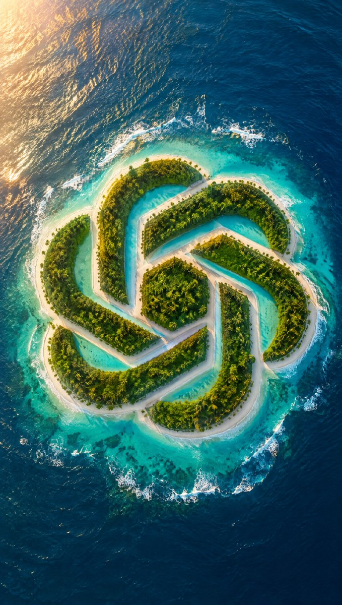

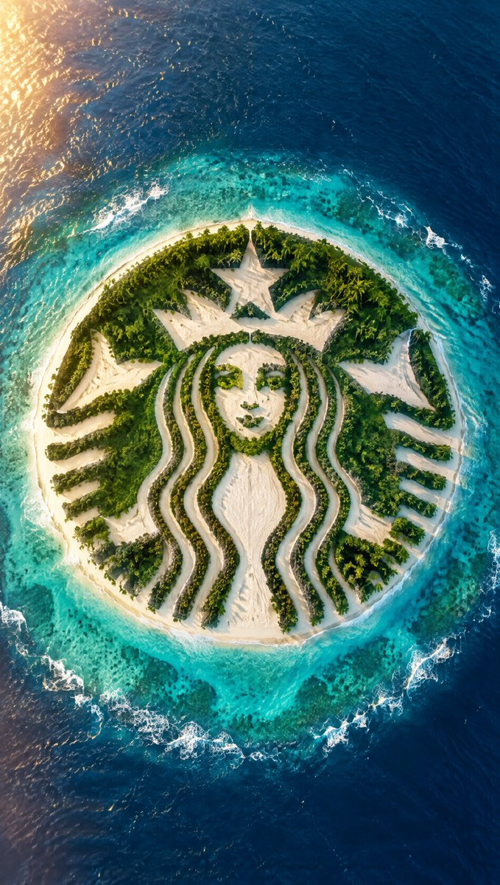

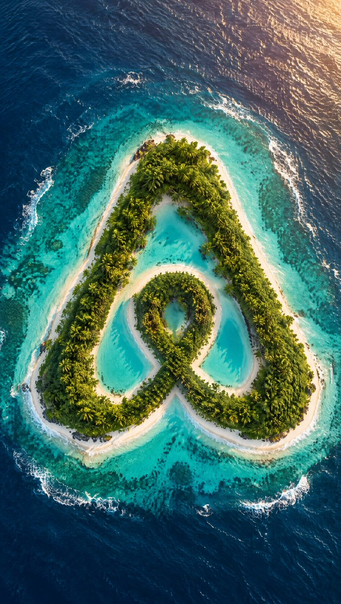

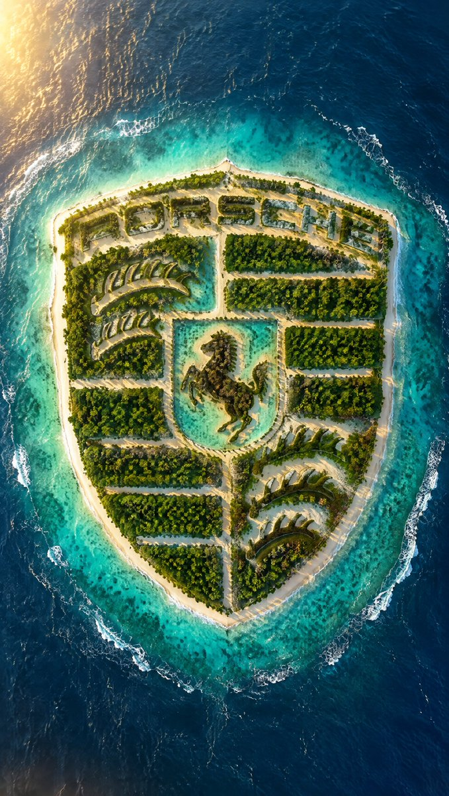

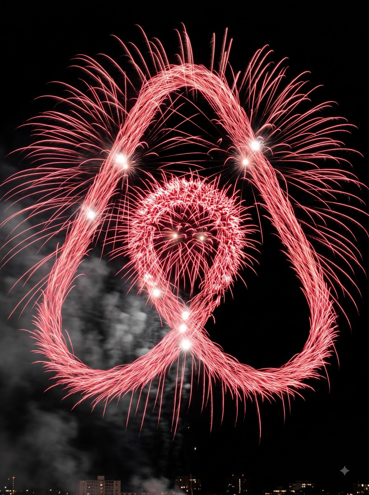

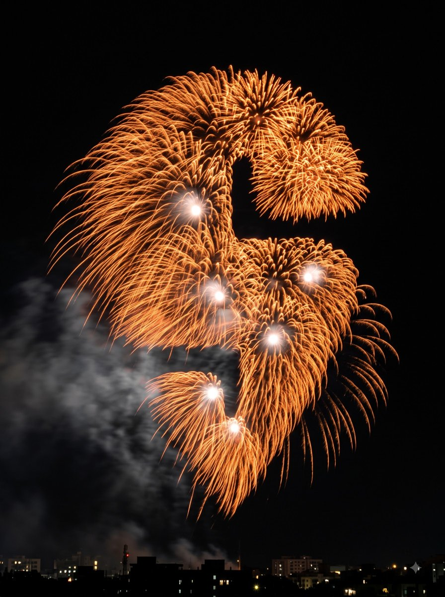


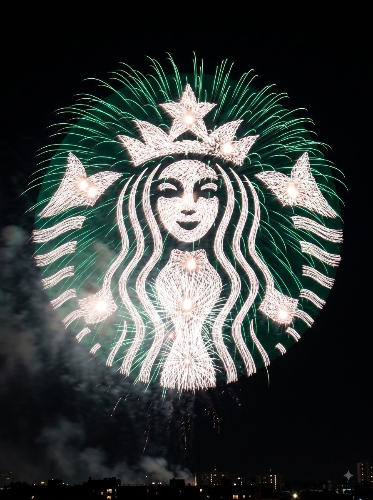

**Prompt**

```text
{
  "prompt_name": "Generador de silueta de isla aérea con forma de logotipo",
  "user_input_required": {
    "input_type": ["company_name (texto)", "logo_image (subida)"],
    "instruction": "Proporciona únicamente el nombre de una empresa O sube una imagen de logotipo. El sistema autogenerará el resto de la escena."
  },
  "scene": {
    "subject": "Una isla tropical remota fotografiada desde una perspectiva de dron aéreo cenital directa, con su costa y masa terrestre contorneadas de forma natural para replicar la silueta del logotipo de la empresa proporcionado",
    "shape_source": "{{company_logo_or_name_silhouette}}",
    "shape_fidelity": "El contorno de la isla debe ser reconocible al instante como la forma del logotipo al verse desde arriba, mientras sigue pareciendo una masa de tierra formada de forma natural; sin geometría artificial o hecha por el hombre"
  },
  "environment": {
    "vegetation": "Palmeras y vegetación tropicales densas y exuberantes que cubren el interior de la isla",
    "shoreline": "Playas de arena blanca y fina que bordean todo el perímetro de la masa terrestre con forma de logotipo",
    "water": {
      "inner_ring": "Laguna turquesa poco profunda y cristalina que rodea la isla",
      "outer_ring": "Océano abierto azul zafiro profundo con patrones de olas realistas y textura de espuma natural"
    }
  },
  "lighting": {
    "type": "Cálida luz solar de la hora dorada",
    "effects": ["sombras naturales suaves", "reflejos cinematográficos en el agua", "suave resplandor de lente en el borde del encuadre"]
  },
  "photography_style": {
    "genre": "Fotografía aérea de viajes de lujo y bienes raíces de alta gama",
    "camera_angle": "Directamente cenital (vista de pájaro / nadir)",
    "realism": "Ultrafotorrealista, natural, orgánico; no debe parecer CGI ni renderizado artificialmente",
    "resolution": "8K, texturas hiperdetalladas en el agua, la arena y el follaje"
  },
  "exclusions": [
    "sin texto visible ni marcas de agua",
    "sin personas",
    "sin edificios ni estructuras hechas por el hombre",
    "sin barcos"
  ]
}
```

[↑ Volver a categorías](#catalog)

---

<a name="prompt-2100266849506316292"></a>

### Foto en cuadrícula de 9 recuadros con composición de 3x3 que recopila numerosas fotos fallidas de aficionados

Autor：[@ahamme35638](https://x.com/ahamme35638) · [Publicación original](https://x.com/ahamme35638/status/2100266849506316292)

Fotografía · Publicado

**Resumen:** Foto en cuadrícula de 9 recuadros con composición de 3x3 que recopila numerosas fotos fallidas de aficionados


**Prompt**

```text
Numerosas fotos fallidas de aficionados, 3x3, 9:16
```

[↑ Volver a categorías](#catalog)

---

<a name="prompt-2100221410358735319"></a>

### Un prompt de selfies realistas en cuadrícula de 3x3 que imita una serie de fotos fallidas de aficionados.

Autor：[@oneruofeng](https://x.com/oneruofeng) · [Publicación original](https://x.com/oneruofeng/status/2100221410358735319)

Fotografía · Retrato / Selfie · Publicado

**Resumen:** Un prompt de selfies realistas en cuadrícula de 3x3 que imita una serie de fotos fallidas de aficionados.


**Prompt**

```text
Una serie de fotos fallidas de aficionados, 3x3, 9:16
```

[↑ Volver a categorías](#catalog)

---

<a name="prompt-2100101909634036032"></a>

### Imagen en cuadrícula de 3x3 que recopila fotos instantáneas fallidas cotidianas de aficionados.

Autor：[@cnyzgkc](https://x.com/cnyzgkc) · [Publicación original](https://x.com/cnyzgkc/status/2100101909634036032)

Fotografía · Retrato / Selfie · Publicado

Publicación original：[@KinGao476942](https://x.com/KinGao476942) · [Publicación original](https://x.com/KinGao476942/status/2100086793995706689)

**Resumen:** Imagen en cuadrícula de 3x3 que recopila fotos instantáneas fallidas cotidianas de aficionados.


**Prompt**

```text
Muchas fotos fallidas de aficionados, 3x3, 9:16
```

[↑ Volver a categorías](#catalog)

---

<a name="prompt-2100065803072897507"></a>

### Sesión de fotos de novia con rostro de primer amor, perspectiva íntima, expresión tierna de enojo y un OOTD contrastante.

Autor：[@DeepBlueX0](https://x.com/DeepBlueX0) · [Publicación original](https://x.com/DeepBlueX0/status/2100065803072897507)

Fotografía · Retrato / Selfie · Artículo de moda · Publicado

Publicación original：[@DeepBlueX0](https://x.com/DeepBlueX0) · [Publicación original](https://x.com/DeepBlueX0/status/2099721592582656282)

**Resumen:** Sesión de fotos de novia con rostro de primer amor, perspectiva íntima, expresión tierna de enojo y un OOTD contrastante.


**Prompt**

```text
Novia con rostro de primer amor × Intimidad ambigua × Lente experimental poco convencional × OOTD en contraste × Expresión tierna de enojo y coquetería
```

[↑ Volver a categorías](#catalog)

---

<a name="prompt-2099520724121883039"></a>

### Traducción en curso

Autor：[@AIVideoHub\_](https://x.com/AIVideoHub_) · [Publicación original](https://x.com/AIVideoHub_/status/2099520724121883039)

Fotografía · Retrato / Selfie · Personaje · Artículo de moda · Paisaje urbano / Calle · Publicado

**Resumen:** Traducción en curso


**Prompt**

```text
Traducción en curso
```

[↑ Volver a categorías](#catalog)

---

<a name="prompt-2099374878910734661"></a>

### Paisaje surrealista de cañón en 9:16, enorme anillo de nubes arremolinadas con efecto time-stack de larga exposición, viajero de espaldas en el fondo del cañón.

Autor：[@listudio](https://x.com/listudio) · [Publicación original](https://x.com/listudio/status/2099374878910734661)

Fotografía · Paisaje / Naturaleza · Publicado

**Resumen:** Paisaje surrealista de cañón en 9:16, enorme anillo de nubes arremolinadas con efecto time-stack de larga exposición, viajero de espaldas en el fondo del cañón.


**Prompt**

```text
Crea una fotografía de apilamiento temporal (time-stack) hiperrealista y surrealista de un cañón en formato vertical 9:16. Un lecho de cañón amplio y seco, flanqueado por enormes paredes rocosas estratificadas verticales en tonos marrón cálido, ocre y negro carbón que se elevan desde los bordes del primer plano, formando un marco natural oscuro, con las texturas de la roca y la grava manteniendo un detalle nítido. En el cielo, a media y lejana distancia del cañón, aparece un gigantesco anillo de nubes arremolinadas que ocupa la mayor parte de la zona central, dejando ver un sereno cielo azul grisáceo en el centro del hueco circular. Aplica un efecto de larga exposición con cámara fija y apilamiento temporal de múltiples fotogramas: densos cúmulos giran lentamente en el mismo sentido, fusionándose en estelas concéntricas continuas y fluidas; la pared interior muestra cientos y miles de finas estrías de nubes en forma de arco, y los bordes del hueco circular presentan suaves estelas de rotación; las nubes conservan un volumen realista de luces y sombras y una textura blanco lechosa, sin parecer un túnel sólido ni presentar ruido quebrado. El lecho del valle se expande ampliamente desde el primer plano y se estrecha hacia el fondo; un viajero adulto de espaldas a la cámara está de pie en el centro inferior, ocupando solo cerca del 2% de la altura del encuadre y manteniéndose nítido. La cálida luz solar en la esquina superior derecha atraviesa las aberturas de las nubes; la exposición continua hace que las áreas brillantes se difundan con suavidad, iluminando la pared de nubes y los bordes de roca de la derecha; la roca cálida, el frío cielo azul grisáceo y las nubes blanco lechosas brillantes forman una relación tricromática equilibrada. Grano de película sutil, perspectiva atmosférica natural, silencio épico y una imponente sensación de inmensidad. El desenfoque de movimiento solo actúa sobre las nubes y una ligera bruma de polvo; las paredes rocosas, el suelo del cañón y la persona se mantienen nítidos. Sin construcciones, sin vegetación tupida, sin pájaros, sin texto, sin logotipos, sin marcas de agua, sin relámpagos.
```

[↑ Volver a categorías](#catalog)

---

<a name="prompt-2099375219546935317"></a>

### Traducción en curso

Autor：[@listudio](https://x.com/listudio) · [Publicación original](https://x.com/listudio/status/2099375219546935317)

Fotografía · Publicado

**Resumen:** Traducción en curso


**Prompt**

```text
Traducción en curso
```

[↑ Volver a categorías](#catalog)

---

<a name="prompt-2099375039166747111"></a>

### Traducción en curso

Autor：[@listudio](https://x.com/listudio) · [Publicación original](https://x.com/listudio/status/2099375039166747111)

Fotografía · Personaje · Paisaje / Naturaleza · Publicado

**Resumen:** Traducción en curso


**Prompt**

```text
Traducción en curso
```

[↑ Volver a categorías](#catalog)

---

<a name="prompt-2099378304985989553"></a>

### Generar una fotografía en cuadrícula 3x3 de 9 paneles con características de divertidas tomas fallidas, como un dedo tapando la lente, fuera de foco o movimiento.

Autor：[@Jane20121221](https://x.com/Jane20121221) · [Publicación original](https://x.com/Jane20121221/status/2099378304985989553)

Fotografía · Publicado

**Resumen:** Generar una fotografía en cuadrícula 3x3 de 9 paneles con características de divertidas tomas fallidas, como un dedo tapando la lente, fuera de foco o movimiento.


**Prompt**

```text
Diversas fotos fallidas de aficionados, 3x3, 9:16
```

[↑ Volver a categorías](#catalog)

---

<a name="prompt-2099106601538097211"></a>

### Instantánea realista desde la perspectiva de alguien sentado en el tren de una joven japonesa sosteniendo un pasamanos y vistiendo un top de tirantes con escote en V profundo.

Autor：[@SGRationalnvest](https://x.com/SGRationalnvest) · [Publicación original](https://x.com/SGRationalnvest/status/2099106601538097211)

Fotografía · Retrato / Selfie · Personaje · Vehículo · Publicado

**Resumen:** Instantánea realista desde la perspectiva de alguien sentado en el tren de una joven japonesa sosteniendo un pasamanos y vistiendo un top de tirantes con escote en V profundo.


**Prompt**

```text
24 años, mujer japonesa, tren, vista frontal, cuerpo inclinado hacia adelante, sosteniendo un pasamanos colgante alto, axila visible, tirantes con escote en V profundo, mirada hacia el frente, expresión mirando hacia abajo, punto de vista de una persona sentada, foto de celular, textura realista, toma vertical
```

[↑ Volver a categorías](#catalog)

---

<a name="prompt-2098866288957551034"></a>

### Una toma cinematográfica fotorrealista de una mujer con un abrigo de montar color carbón saltando sobre un río de piedras secas encima de un ciervo de cuarzo vivo bajo un sol intenso.

Autor：[@TraffAlex](https://x.com/TraffAlex) · [Publicación original](https://x.com/TraffAlex/status/2098866288957551034)

Fotografía · Personaje · Publicado

**Resumen:** Una toma cinematográfica fotorrealista de una mujer con un abrigo de montar color carbón saltando sobre un río de piedras secas encima de un ciervo de cuarzo vivo bajo un sol intenso.


**Prompt**

```text
Una toma cinematográfica fotorrealista de éxito de taquilla. Una mujer con un abrigo de montar color carbón se aferra al cuello de un ciervo cuyo cuerpo es de cuarzo vivo, con cornamentas como un candelabro de puntas que arrojan fragmentos de luz diurna. Están a mitad de un salto sobre un río seco de piedras blancas, las pezuñas aún no tocan el suelo, su abrigo como una bandera. Sol abrasador, arcoíris prismáticos en su mejilla. Paleta: cuarzo, carbón, cielo desteñido, un corte de su piel cálida por la sangre. Cinético, sin rifle en la montura, sin violencia — pura velocidad. 35 mm, relación de aspecto 2:3.
```

[↑ Volver a categorías](#catalog)

---

<a name="prompt-2098868060228927512"></a>

### Fotograma fotorrealista de acción en la selva de una mujer con ropa caqui enlodada que huye de un monstruo vegetal floral bajo la lluvia.

Autor：[@TraffAlex](https://x.com/TraffAlex) · [Publicación original](https://x.com/TraffAlex/status/2098868060228927512)

Fotografía · Personaje · Publicado

**Resumen:** Fotograma fotorrealista de acción en la selva de una mujer con ropa caqui enlodada que huye de un monstruo vegetal floral bajo la lluvia.


**Prompt**

```text
Un fotograma de acción fotorrealista al borde de la selva. Una mujer vestida de caqui salpicado de lodo corre hacia la cámara con los ojos muy abiertos; detrás de ella, un ogro de tres pisos hecho de heliconias húmedas, jengibre y ave del paraíso, con una boca de brácteas rojas que se abre y polen que se eleva como humo. Lluvia. Paleta: rojo cadmio, verde selva, caqui, el amarillo del pico de una heliconia. Los pétalos se desprenden a su paso. 35 mm, lluvia sobre la lente. Relación de aspecto 2:3.
```

[↑ Volver a categorías](#catalog)

---

<a name="prompt-2098799449237782991"></a>

### Traducción en curso

Autor：[@DeepBlueX0](https://x.com/DeepBlueX0) · [Publicación original](https://x.com/DeepBlueX0/status/2098799449237782991)

Fotografía · Retrato / Selfie · Personaje · Artículo de moda · Publicado

Publicación original：[@DeepBlueX0](https://x.com/DeepBlueX0) · [Publicación original](https://x.com/DeepBlueX0/status/2097630845435572490)

**Resumen:** Traducción en curso


**Prompt**

```text
Traducción en curso
```

[↑ Volver a categorías](#catalog)

---

<a name="prompt-2098610123900064236"></a>

### Una instantánea de viaje espontánea de una mujer de Asia oriental con orejas de ratón posando frente a un castillo de fantasía.

Autor：[@Aqsahere\_](https://x.com/Aqsahere_) · [Publicación original](https://x.com/Aqsahere_/status/2098610123900064236)

Fotografía · Personaje · Publicado

**Resumen:** Una instantánea de viaje espontánea de una mujer de Asia oriental con orejas de ratón posando frente a un castillo de fantasía.


**Prompt**

```text
Una foto de viaje espontánea y realista de una joven mujer de Asia oriental disfrutando de un día divertido y mágico en un castillo de cuento de hadas. Está de pie frente a un imponente castillo de fantasía de estilo europeo con altas torres de color marfil, elegantes tejados azules, agujas doradas, intrincados detalles de piedra y una hermosa arquitectura del viejo mundo. El castillo ocupa la mayor parte del fondo, otorgando a la escena una atmósfera de vacaciones de ensueño en un parque temático. Ella tiene el cabello largo, castaño castaño y ondulado de forma natural que cae suelto sobre sus hombros y espalda. Lleva una linda diadema brillante con orejas de ratón en tonos azul y lavanda y sonríe con naturalidad mientras mira ligeramente hacia arriba y hacia un lado, como si hubiera sido capturada en un momento genuino de felicidad. Viste una chaqueta corta texturizada de color blanco crema con botones dorados sobre una camisa blanca de cuello impecable y una corbata a cuadros estampada. Su falda pantalón de tiro alto a cuadros en tonos beige, crema y azul apagado tiene pliegues suaves que se mueven con naturalidad según su pose. Extiende ambos brazos hacia afuera y se inclina ligeramente hacia la cámara con una energía emocionada y juguetona. La pose se siente espontánea en lugar de posada, como una instantánea real de vacaciones. El patio del castillo detrás de ella tiene amplios escalones de piedra clara, barandillas decorativas, coloridos estandartes y una detallada arquitectura de inspiración medieval. El cielo está suavemente nublado con nubes de color azul grisáceo pálido, creando una luz diurna suave y favorecedora y sombras naturales. Fotografía de viaje ultrafotorrealista, apariencia juvenil auténtica, textura de piel realista, mechones de cabello naturales, texturas de tela detalladas, proporciones creíbles, suave profundidad de campo, sombras naturales sutiles, colores vibrantes pero ligeramente apagados, estética de foto espontánea de teléfono inteligente, atmósfera de vacaciones de ensueño, altamente detallada, composición vertical de 3:4.
```

[↑ Volver a categorías](#catalog)

---

<a name="prompt-2098616431122559479"></a>

### Prompt de fotografía documental de estudiante en el patio del campus estilo instantánea de iPhone

Autor：[@DeepBlueX0](https://x.com/DeepBlueX0) · [Publicación original](https://x.com/DeepBlueX0/status/2098616431122559479)

Fotografía · Retrato / Selfie · Publicado

Publicación original：[@DDJCXX](https://x.com/DDJCXX) · [Publicación original](https://x.com/DDJCXX/status/2098240447038767437)

**Resumen:** Prompt de fotografía documental de estudiante en el patio del campus estilo instantánea de iPhone


**Prompt**

```text
Documental de la vida cotidiana en el campus; momento fortuito y divertido; instantánea con la cámara original de iPhone; hombros estrechos y cintura diminuta·estudiante con busto exuberante🙆🏻‍♀️
```

[↑ Volver a categorías](#catalog)

---

<a name="prompt-2098277829154951371"></a>

### Fotografía artística costera asimétrica con un velero rosa coral fondeado en una caleta desierta y tranquila, enmarcado por pinos a la derecha.

Autor：[@listudio](https://x.com/listudio) · [Publicación original](https://x.com/listudio/status/2098277829154951371)

Fotografía · Vehículo · Publicado

**Resumen:** Fotografía artística costera asimétrica con un velero rosa coral fondeado en una caleta desierta y tranquila, enmarcado por pinos a la derecha.


**Prompt**

```text
Crea una fotografía artística costera vertical de 3:4. Una caleta tranquila y desierta, con un cielo despejado azul grisáceo que ocupa el 70% superior y una línea de horizonte azul oscuro recta en la parte inferior. Un pequeño velero monocasco realista fondeado en la parte inferior central, ligeramente a la izquierda, con un mástil delgado que se eleva hacia el cielo, una vela triangular de color rosa coral suavemente hinchada, tensión creíble en las costuras de la lona, una estrecha franja azul oscuro en la base de la vela, cabina blanca rosácea, ventanas negras profundas, casco inferior rojo coral y un aparejo fino y verosímil. La superficie del agua, en calma y de tono azul cian, presenta finas ondas horizontales y suaves reflejos rosados fragmentados. En el lado derecho, un pino oscuro crea un encuadre asimétrico, con el tronco naciendo desde abajo a la derecha y la copa entrando desde arriba a la derecha, con acículas que muestran sutiles toques de luz solar de color rosa rojizo oscuro, preservando una gran extensión de cielo. En la parte inferior absoluta, una franja de playa de arena fina blanco-rosada con sombras tenues del árbol. Casco, corteza, acículas y agua de mar realistas, luz solar nítida, sombras profundas, grano de película sutil, textura de impresión mate sobria, colores surrealistas pero con relaciones espaciales creíbles, serenidad prolongada y distanciamiento onírico. Sin personas, texto, logotipo ni marcas de agua.
```

[↑ Volver a categorías](#catalog)

---

<a name="prompt-2098277612053561383"></a>

### Fotografía artística surrealista de una orilla de sal blanca y rosada con agua marina en degradado de rojo coral a azul oscuro.

Autor：[@listudio](https://x.com/listudio) · [Publicación original](https://x.com/listudio/status/2098277612053561383)

Fotografía · Paisaje / Naturaleza · Publicado

**Resumen:** Fotografía artística surrealista de una orilla de sal blanca y rosada con agua marina en degradado de rojo coral a azul oscuro.


**Prompt**

```text
Crea una fotografía artística surrealista en color en formato vertical 3:4. Una costa solitaria sin personas, el cuarto superior es un cielo azul cobalto grisáceo uniforme, con una orilla lejana de color rosa pálido sumamente delgada que cruza un horizonte alto. Una pared costera salina de color blanco rosado se extiende desde la izquierda hacia el primer plano inferior, con granos cristalinos ásperos, grava suelta y bordes erosionados naturalmente bien visibles, formando una línea costera de curva suave y asimétrica. Las aguas poco profundas cerca de la orilla muestran un intenso rojo coral, bermellón y rosa, con unas pocas olas delgadas que avanzan en diagonal hacia abajo a la derecha, pasando gradualmente al agua marina azul de Prusia oscuro de la derecha; el agua tiene una transparencia realista, finas ondas y reflejos, sin parecer pintura ni lava. Luz lateral de día soleado, luces altas blanco-rosadas que conservan los detalles, grandes bloques de color limpios en contraste con texturas microscópicas reales, grano de película fino, aspecto de impresión mate, silenciosa, extraña, ardiente pero fría. Fotografía a sangre completa, sin texto, bordes, logotipos ni marcas de agua.
```

[↑ Volver a categorías](#catalog)

---

<a name="prompt-2098277688498880901"></a>

### Fotografía de retrato de caballo pinto de pelaje rojo surrealista, con fondo de cielo azul puro.

Autor：[@listudio](https://x.com/listudio) · [Publicación original](https://x.com/listudio/status/2098277688498880901)

Fotografía · Retrato / Selfie · Resumen / Antecedentes · Publicado

**Resumen:** Fotografía de retrato de caballo pinto de pelaje rojo surrealista, con fondo de cielo azul puro.


**Prompt**

```text
Crea una fotografía artística de retrato animal surrealista en formato vertical 3:4. Toma en contrapicado de la cabeza, el cuello, los hombros y el pecho de un caballo pinto robusto; el cuerpo se recorta de forma natural en la parte inferior y a la derecha; la cabeza del caballo se sitúa en la zona media-inferior girada en tres cuartos de perfil hacia la izquierda; las orejas están erguidas con naturalidad; los ojos negros, profundos y húmedos tienen un reflejo diminuto. El tercio superior deja un cielo azul cobalto puro y sin nubes. Pelaje con un recoloreo surrealista y detallado, predominantemente rojo ladrillo intenso y rojo coral, con grandes manchas irregulares de color blanco rosáceo desde el puente de la nariz hasta el hocico, y pequeñas zonas de azul oscuro entre las manchas rojas y blancas de los hombros y el pecho. La larga crin se despliega hacia la izquierda impulsada por un fuerte viento que sopla desde la derecha, con hebras finas y largas superpuestas, pelos rojo brillante entrelazados con sombras rojo vino oscuro, cayendo parcialmente sobre el cuello. Pelo corto, fosas nasales, bigotes y músculos con detalles realistas. Iluminación lateral natural y brillante, zonas oscuras densas y estratificadas, fotografía nítida que congela el instante, ligero grano de película y tonos mate, con un aire editorial de moda salvaje, libre y vibrante. Sin arreos, personas, texto, logotipo ni marcas de agua.
```

[↑ Volver a categorías](#catalog)

---

<a name="prompt-2098277762410942530"></a>

### Fotografía botánica surrealista de cactus en contraste de rojo y azul, con cactus planos rojo coral y cactus columnar azul cobalto oscuro.

Autor：[@listudio](https://x.com/listudio) · [Publicación original](https://x.com/listudio/status/2098277762410942530)

Fotografía · Publicado

**Resumen:** Fotografía botánica surrealista de cactus en contraste de rojo y azul, con cactus planos rojo coral y cactus columnar azul cobalto oscuro.


**Prompt**

```text
Crea una fotografía artística botánica surrealista en formato vertical 3:4. Con un cielo azul celeste despejado y ligeramente grisáceo de fondo, se observa en contrapicado un grupo de cactus reales que crecen desde el borde inferior y aparecen recortados. Desde la izquierda hacia el centro hay de tres a cinco palas de cactus planas y ovaladas escalonadas, la más alta inclinada ligeramente hacia la izquierda, con la piel recoloreada en rojo coral y rojo sandía vibrantes, conservando un acabado mate ceroso, finas arrugas onduladas y areolas regulares pero no mecánicas. A la derecha, un cactus columnar alto de color azul cobalto oscuro, con costillas verticales pronunciadas, surcos en azul de Prusia profundo y espinas estrelladas de color rojo bermellón alineadas a lo largo del borde de las costillas. En la base, unas pocas palas planas azules se superponen con pequeñas palas rojas, con capas claras, dejando un espacio de cielo en la parte superior izquierda. La intensa luz solar natural desde la parte superior izquierda resalta el volumen y las espinas de la planta; los colores vivos se adhieren a un tejido vegetal creíble. Composición asimétrica de escultura geométrica, textura fotográfica fina, grano de película sutil y mate sobrio, evitando el aspecto de plástico o render 3D. Sin macetas, flores, texto, logotipos ni marcas de agua.
```

[↑ Volver a categorías](#catalog)

---

<a name="prompt-2097886029692969195"></a>

### Prompt de foto selfie frente al espejo en la recámara de una influencer china, mostrando peinado corto, atuendo escotado y estilo con luz interior suave.

Autor：[@ohmuyi](https://x.com/ohmuyi) · [Publicación original](https://x.com/ohmuyi/status/2097886029692969195)

Fotografía · Retrato / Selfie · Influencer / Modelo · Artículo de moda · Arquitectura / Interiores · Publicado

**Resumen:** Prompt de foto selfie frente al espejo en la recámara de una influencer china, mostrando peinado corto, atuendo escotado y estilo con luz interior suave.


**Prompt**

```text
3:4, selfie de cerca en el espejo con celular, influencer china, piel blanca de tono frío, bob corto negro con flequillo recto y ligero, playera ajustada de manga corta con escote bajo, el celular cubre un tercio del lado derecho de la cara, recámara con cama blanca y espejo de marco negro, luz interior suave, tierna y seductora
```

[↑ Volver a categorías](#catalog)

---

<a name="prompt-2097532595814940683"></a>

### Prompt de retrato de viaje fotorrealista de una joven mujer de Asia oriental en la costa del monte Saint-Michel.

Autor：[@saniaspeaks\_](https://x.com/saniaspeaks_) · [Publicación original](https://x.com/saniaspeaks_/status/2097532595814940683)

Fotografía · Retrato / Selfie · Personaje · Publicado

**Resumen:** Prompt de retrato de viaje fotorrealista de una joven mujer de Asia oriental en la costa del monte Saint-Michel.


**Prompt**

```text
Un retrato de viaje espontáneo y fotorrealista de una joven mujer de Asia oriental de pie en una tranquila costa arenosa junto a grandes rocas cubiertas de musgo, con una magnífica abadía de piedra histórica y una arquitectura medieval similar a un castillo que se alza dramáticamente sobre una isla rocosa detrás de ella. Tiene el cabello castaño oscuro, largo y lacio, que cae de forma natural sobre un hombro, rasgos faciales suaves y juveniles, y una sonrisa cálida y apacible mientras mira directamente a la cámara.

Lleva un abrigo negro largo y holgado con las manos casualmente metidas dentro de los bolsillos, superpuesto sobre un atuendo de color claro. Una bufanda grande y suave de color blanco crema está envuelta con calidez alrededor de su cuello, colgando hacia el frente con un pequeño emblema negro de estilo de diseñador cerca del extremo. Se aprecia parcialmente un bolso de hombro con una delicada cadena.

La composición la captura en primer plano mientras la vasta abadía histórica domina el fondo, rodeada por antiguos muros de piedra, acantilados rocosos, llanuras de marea arenosas y una tranquila atmósfera costera. Unos pocos vehículos y personas pequeñas en la distancia añaden una escala realista a la escena. La suave luz natural del atardecer y un cielo azul pálido y despejado crean un pacífico ambiente de viaje europeo.

Fotografía ultrarrealista, auténtica foto de viaje espontánea, textura de piel natural, detalles de tela realistas, iluminación cinematográfica suave, sutil estética de cámara de teléfono inteligente, gradación de color ligeramente de ensueño, proporciones naturales, arquitectura detallada, atmósfera costera pacífica, composición vertical, relación de aspecto 3:4.
```

[↑ Volver a categorías](#catalog)

---

<a name="prompt-2097411028510179759"></a>

### Prompt para foto de paisaje en alta definición de un claro en el bosque con densa vegetación verde.

Autor：[@mark\_k](https://x.com/mark_k) · [Publicación original](https://x.com/mark_k/status/2097411028510179759)

Fotografía · Paisaje / Naturaleza · Publicado

**Resumen:** Prompt para foto de paisaje en alta definición de un claro en el bosque con densa vegetación verde.


**Prompt**

```text
Foto de un claro en el bosque con mucho follaje verde, muy detallada
```

[↑ Volver a categorías](#catalog)

---

<a name="prompt-2102325781875794287"></a>

### Traducción en curso

Autor：[@CyberTotal2026](https://x.com/CyberTotal2026) · [Publicación original](https://x.com/CyberTotal2026/status/2102325781875794287)

Fotografía · Retrato / Selfie · Personaje · Artículo de moda · Publicado

**Resumen:** Traducción en curso

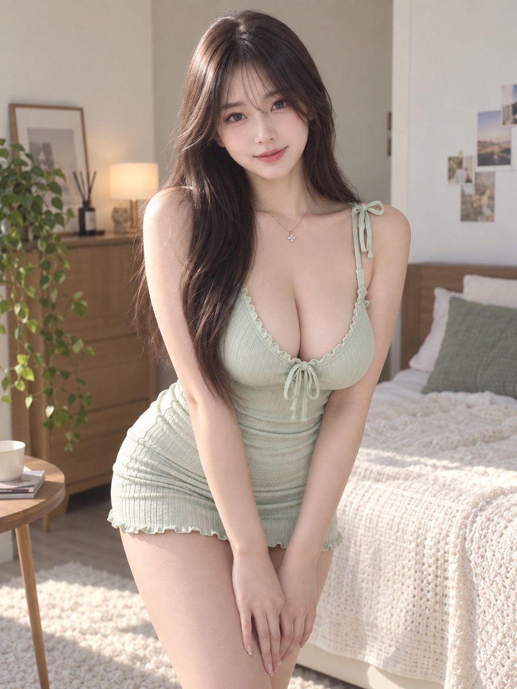

**Prompt**

```text
Traducción en curso
```

[↑ Volver a categorías](#catalog)

---

<a name="prompt-2102354722426675276"></a>

### Traducción en curso

Autor：[@CyberTotal2026](https://x.com/CyberTotal2026) · [Publicación original](https://x.com/CyberTotal2026/status/2102354722426675276)

Fotografía · Retrato / Selfie · Personaje · Publicado

**Resumen:** Traducción en curso

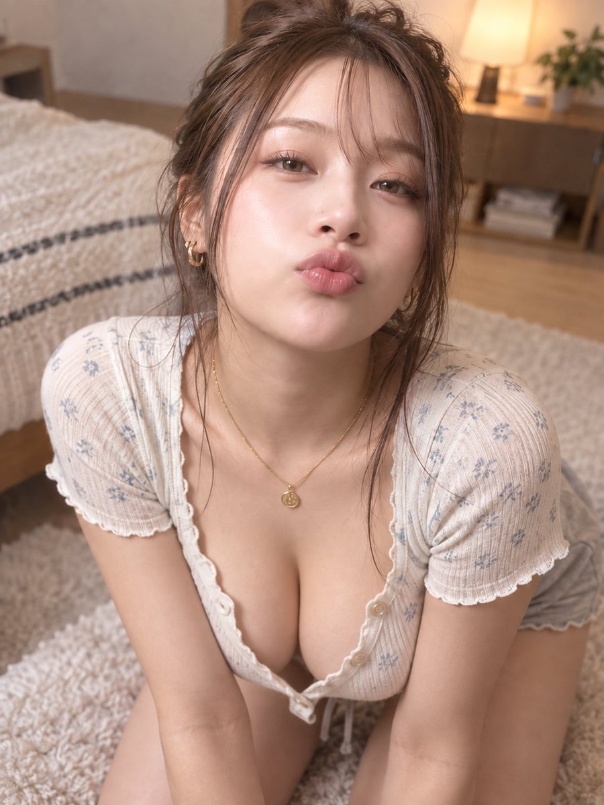

**Prompt**

```text
Traducción en curso
```

[↑ Volver a categorías](#catalog)

---

<a name="prompt-2102342895839973459"></a>

### Traducción en curso

Autor：[@CyberTotal2026](https://x.com/CyberTotal2026) · [Publicación original](https://x.com/CyberTotal2026/status/2102342895839973459)

Fotografía · Retrato / Selfie · Personaje · Publicado

**Resumen:** Traducción en curso

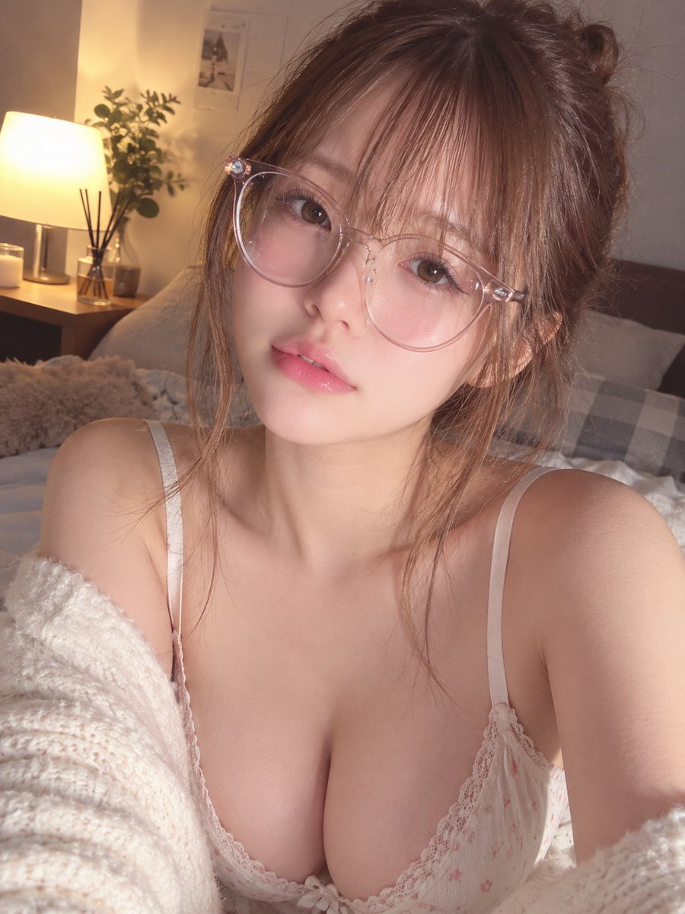

**Prompt**

```text
Traducción en curso
```

[↑ Volver a categorías](#catalog)

---

<a name="prompt-2102370828633674112"></a>

### Traducción en curso

Autor：[@CyberTotal2026](https://x.com/CyberTotal2026) · [Publicación original](https://x.com/CyberTotal2026/status/2102370828633674112)

Fotografía · Retrato / Selfie · Publicado

**Resumen:** Traducción en curso

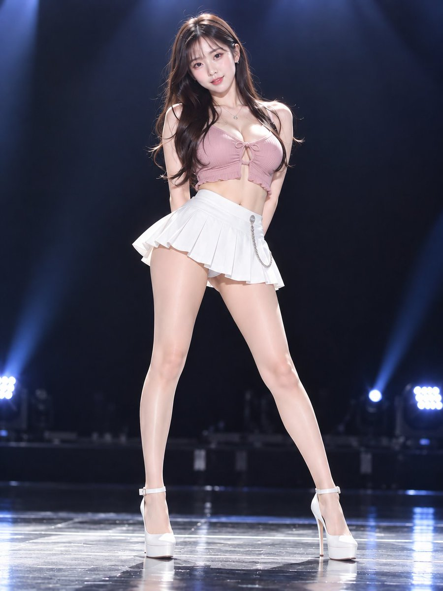

**Prompt**

```text
Traducción en curso
```

[↑ Volver a categorías](#catalog)

---

<a name="prompt-2102203475757015262"></a>

### Traducción en curso

Autor：[@CyberTotal2026](https://x.com/CyberTotal2026) · [Publicación original](https://x.com/CyberTotal2026/status/2102203475757015262)

Fotografía · Retrato / Selfie · Personaje · Publicado

**Resumen:** Traducción en curso

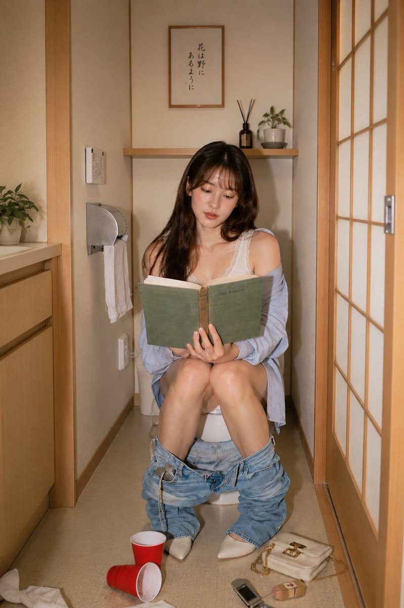

**Prompt**

```text
Traducción en curso
```

[↑ Volver a categorías](#catalog)

---

<a name="prompt-2102237701428920362"></a>

### Traducción en curso

Autor：[@CyberTotal2026](https://x.com/CyberTotal2026) · [Publicación original](https://x.com/CyberTotal2026/status/2102237701428920362)

Fotografía · Retrato / Selfie · Personaje · Publicado

**Resumen:** Traducción en curso

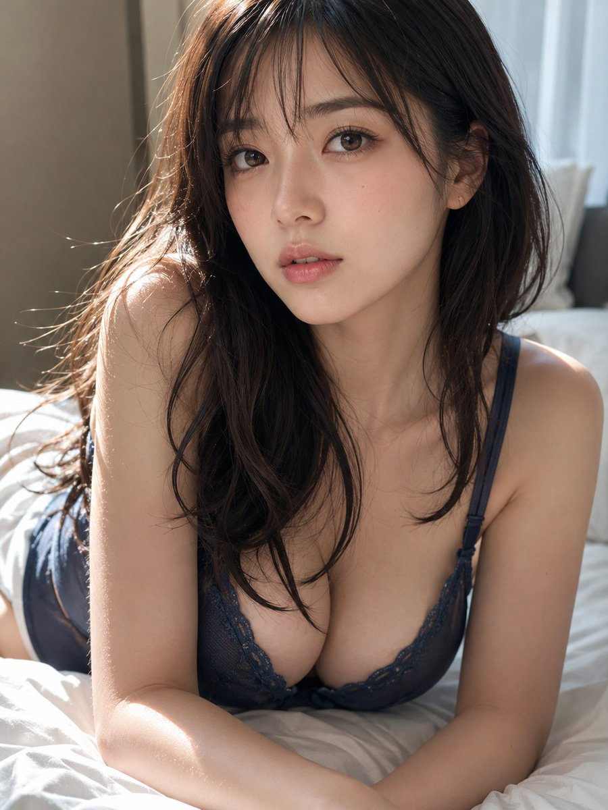

**Prompt**

```text
Traducción en curso
```

[↑ Volver a categorías](#catalog)

---

<a name="prompt-2102160442080874842"></a>

### Traducción en curso

Autor：[@CyberTotal2026](https://x.com/CyberTotal2026) · [Publicación original](https://x.com/CyberTotal2026/status/2102160442080874842)

Fotografía · Personaje · Publicado

**Resumen:** Traducción en curso

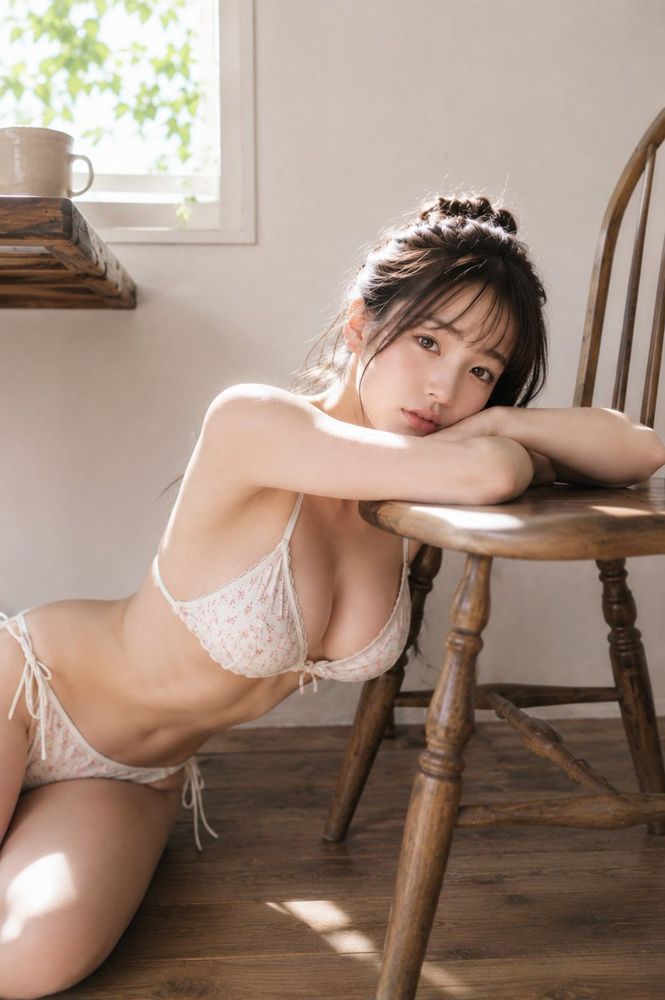

**Prompt**

```text
Traducción en curso
```

[↑ Volver a categorías](#catalog)

---

<a name="prompt-2101873803492216846"></a>

### Traducción en curso

Autor：[@CyberTotal2026](https://x.com/CyberTotal2026) · [Publicación original](https://x.com/CyberTotal2026/status/2101873803492216846)

Fotografía · Retrato / Selfie · Personaje · Artículo de moda · Publicado

**Resumen:** Traducción en curso

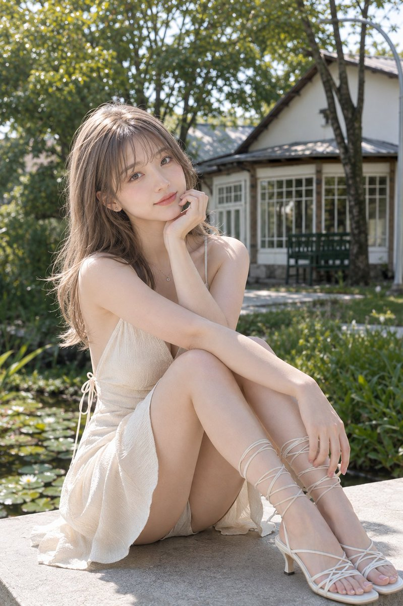

**Prompt**

```text
Traducción en curso
```

[↑ Volver a categorías](#catalog)

---

<a name="prompt-2102010453962662222"></a>

### Traducción en curso

Autor：[@CyberTotal2026](https://x.com/CyberTotal2026) · [Publicación original](https://x.com/CyberTotal2026/status/2102010453962662222)

Fotografía · Retrato / Selfie · Personaje · Publicado

**Resumen:** Traducción en curso

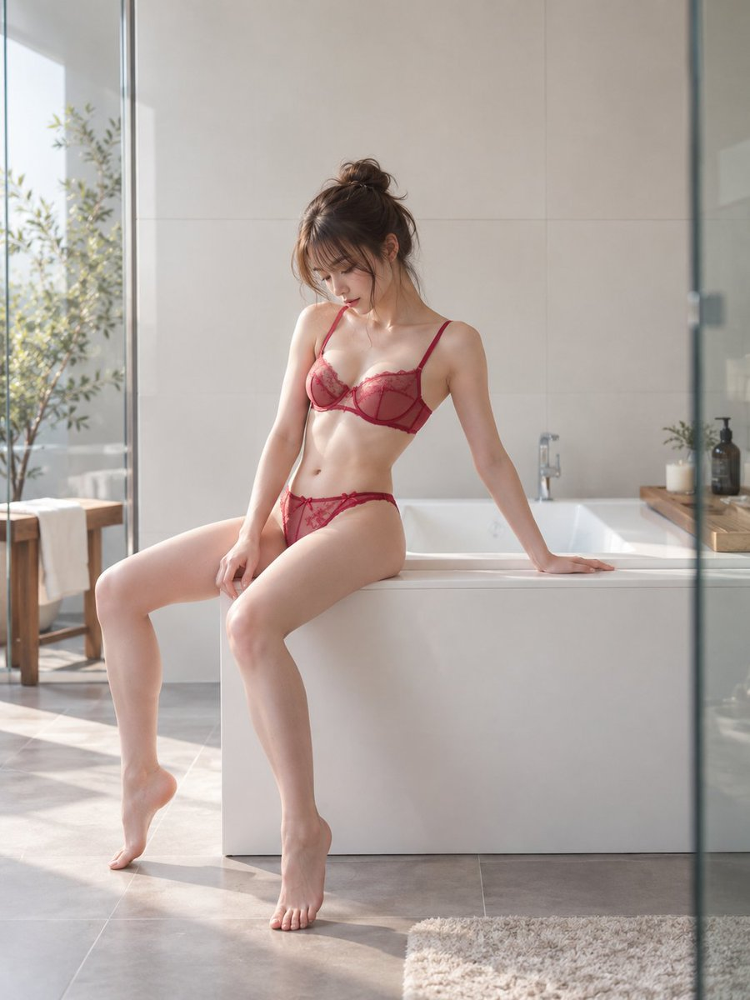

**Prompt**

```text
Traducción en curso
```

[↑ Volver a categorías](#catalog)

---

<a name="prompt-2102024295387963632"></a>

### Traducción en curso

Autor：[@CyberTotal2026](https://x.com/CyberTotal2026) · [Publicación original](https://x.com/CyberTotal2026/status/2102024295387963632)

Fotografía · Retrato / Selfie · Personaje · Artículo de moda · Paisaje / Naturaleza · Publicado

**Resumen:** Traducción en curso

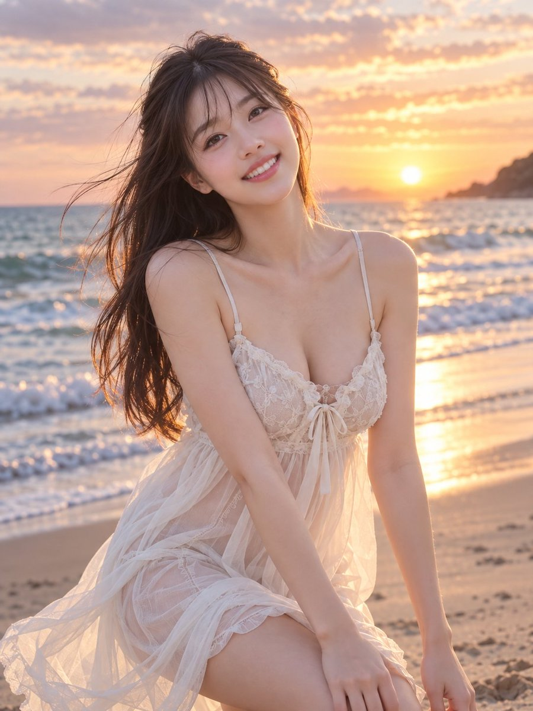

**Prompt**

```text
Traducción en curso
```

[↑ Volver a categorías](#catalog)

---

<a name="prompt-2101844107748372856"></a>

### Traducción en curso

Autor：[@CyberTotal2026](https://x.com/CyberTotal2026) · [Publicación original](https://x.com/CyberTotal2026/status/2101844107748372856)

Fotografía · Retrato / Selfie · Personaje · Publicado

**Resumen:** Traducción en curso

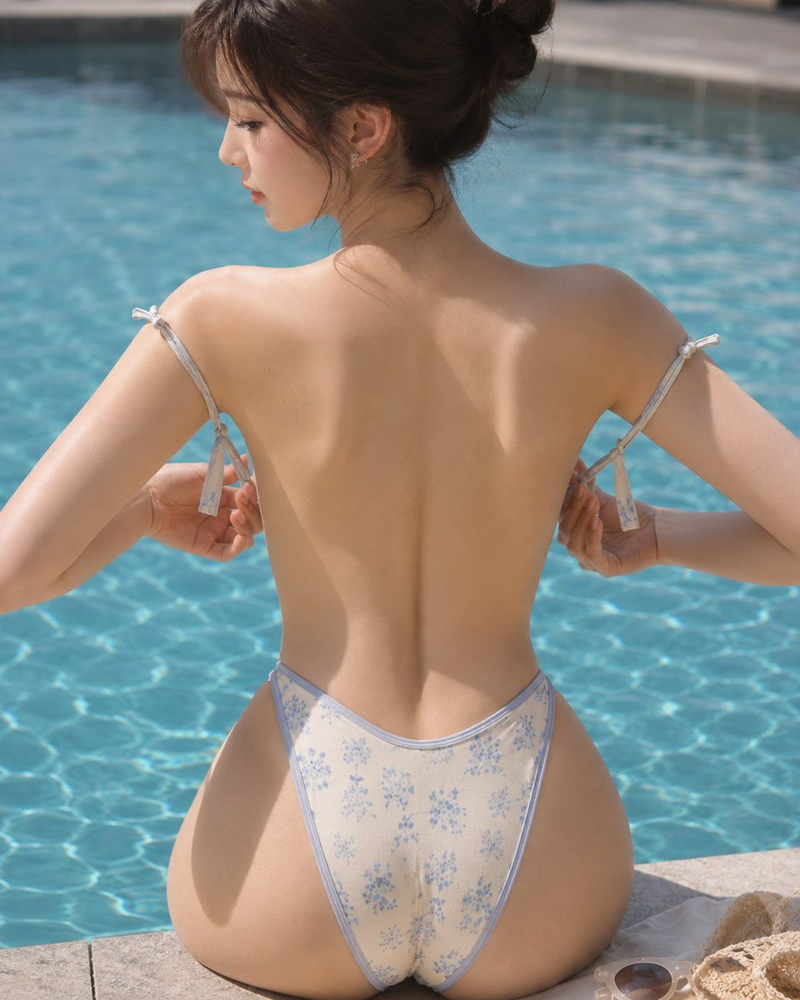

**Prompt**

```text
Traducción en curso
```

[↑ Volver a categorías](#catalog)

---

<a name="prompt-2101978744940638252"></a>

### Traducción en curso

Autor：[@CyberTotal2026](https://x.com/CyberTotal2026) · [Publicación original](https://x.com/CyberTotal2026/status/2101978744940638252)

Fotografía · Retrato / Selfie · Personaje · Paisaje / Naturaleza · Publicado

**Resumen:** Traducción en curso

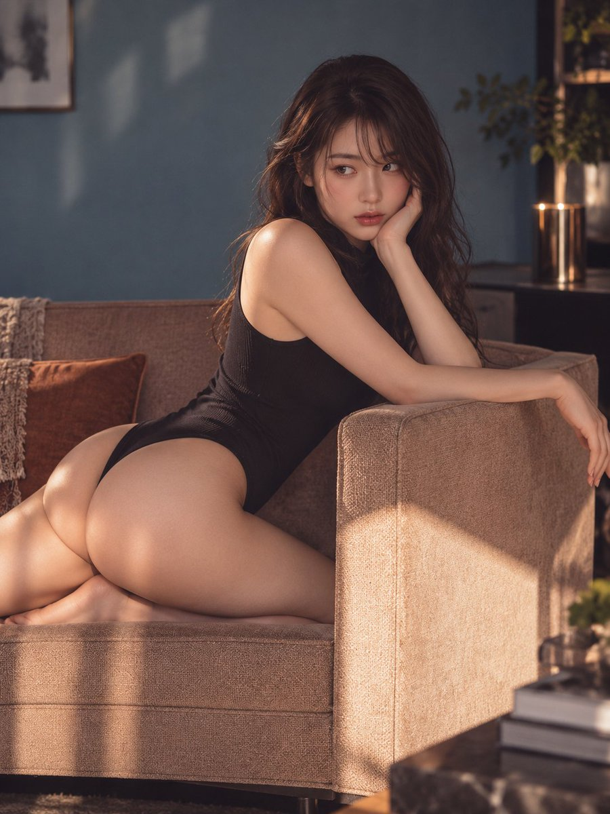

**Prompt**

```text
Traducción en curso
```

[↑ Volver a categorías](#catalog)

---

<a name="prompt-2101963645496562103"></a>

### Traducción en curso

Autor：[@CyberTotal2026](https://x.com/CyberTotal2026) · [Publicación original](https://x.com/CyberTotal2026/status/2101963645496562103)

Fotografía · Retrato / Selfie · Personaje · Publicado

**Resumen:** Traducción en curso

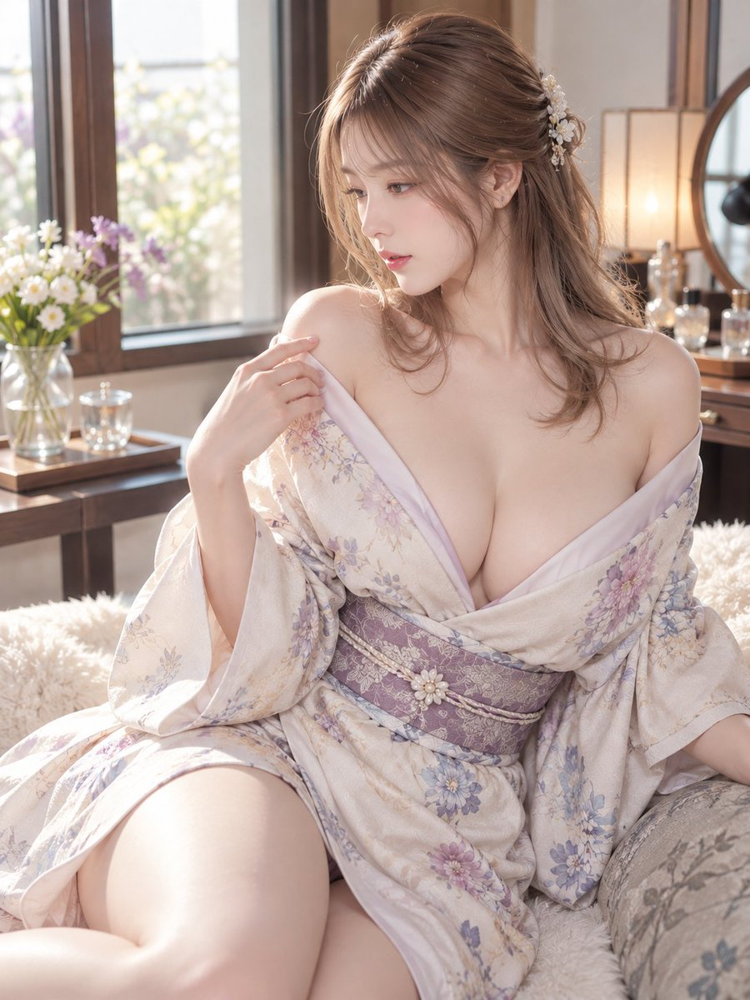

**Prompt**

```text
Traducción en curso
```

[↑ Volver a categorías](#catalog)

---

<a name="prompt-2101993592969404809"></a>

### Traducción en curso

Autor：[@CyberTotal2026](https://x.com/CyberTotal2026) · [Publicación original](https://x.com/CyberTotal2026/status/2101993592969404809)

Fotografía · Retrato / Selfie · Personaje · Publicado

**Resumen:** Traducción en curso

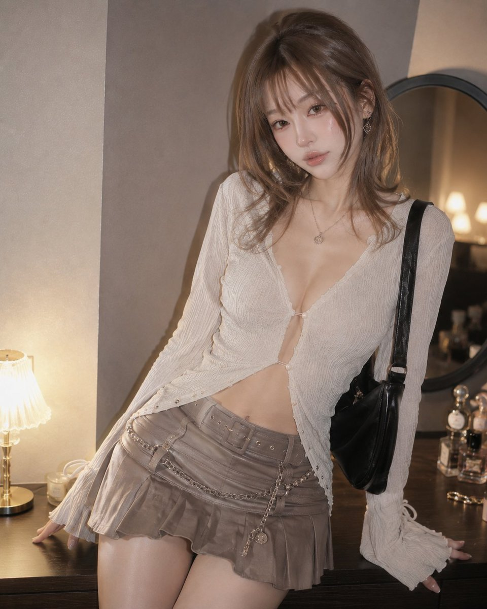

**Prompt**

```text
Traducción en curso
```

[↑ Volver a categorías](#catalog)

---

<a name="prompt-2101934956456845338"></a>

### Traducción en curso

Autor：[@CyberTotal2026](https://x.com/CyberTotal2026) · [Publicación original](https://x.com/CyberTotal2026/status/2101934956456845338)

Fotografía · Retrato / Selfie · Personaje · Publicado

**Resumen:** Traducción en curso

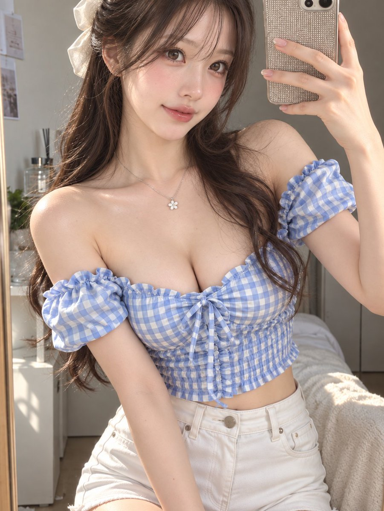

**Prompt**

```text
Traducción en curso
```

[↑ Volver a categorías](#catalog)

---

<a name="prompt-2101900982602932582"></a>

### Traducción en curso

Autor：[@CyberTotal2026](https://x.com/CyberTotal2026) · [Publicación original](https://x.com/CyberTotal2026/status/2101900982602932582)

Fotografía · Retrato / Selfie · Personaje · Publicado

**Resumen:** Traducción en curso

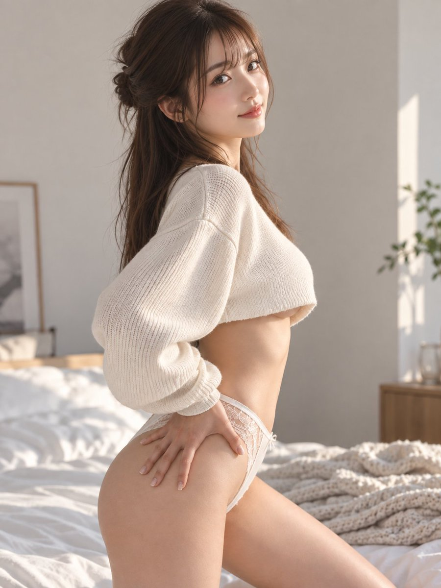

**Prompt**

```text
Traducción en curso
```

[↑ Volver a categorías](#catalog)

---

<a name="prompt-2101799312850124970"></a>

### Traducción en curso

Autor：[@CyberTotal2026](https://x.com/CyberTotal2026) · [Publicación original](https://x.com/CyberTotal2026/status/2101799312850124970)

Fotografía · Retrato / Selfie · Personaje · Arquitectura / Interiores · Publicado

**Resumen:** Traducción en curso

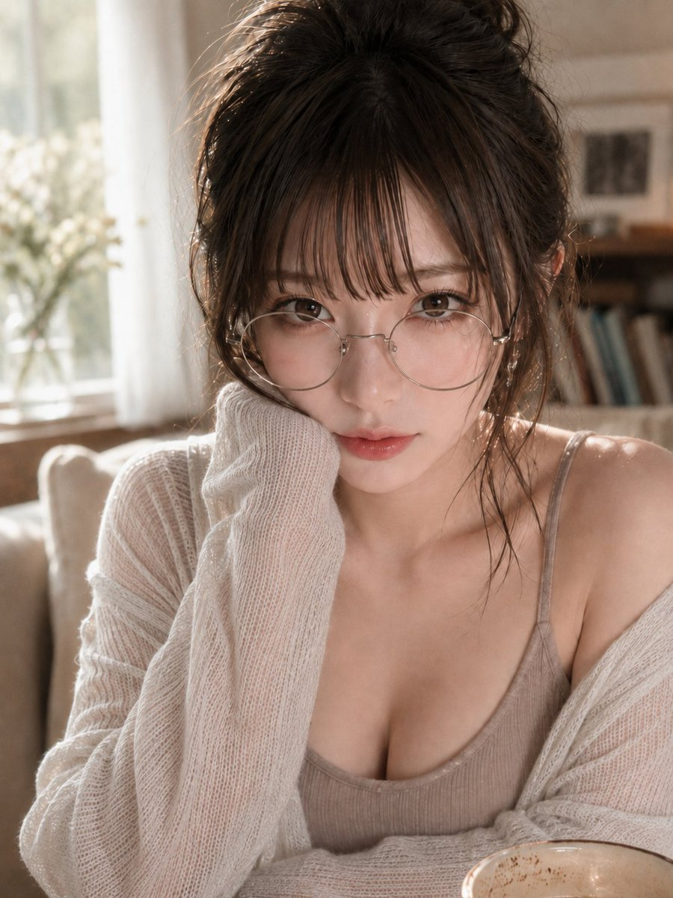

**Prompt**

```text
Traducción en curso
```

[↑ Volver a categorías](#catalog)

---

<a name="prompt-2101659894357139704"></a>

### Traducción en curso

Autor：[@CyberTotal2026](https://x.com/CyberTotal2026) · [Publicación original](https://x.com/CyberTotal2026/status/2101659894357139704)

Fotografía · Retrato / Selfie · Personaje · Artículo de moda · Publicado

**Resumen:** Traducción en curso

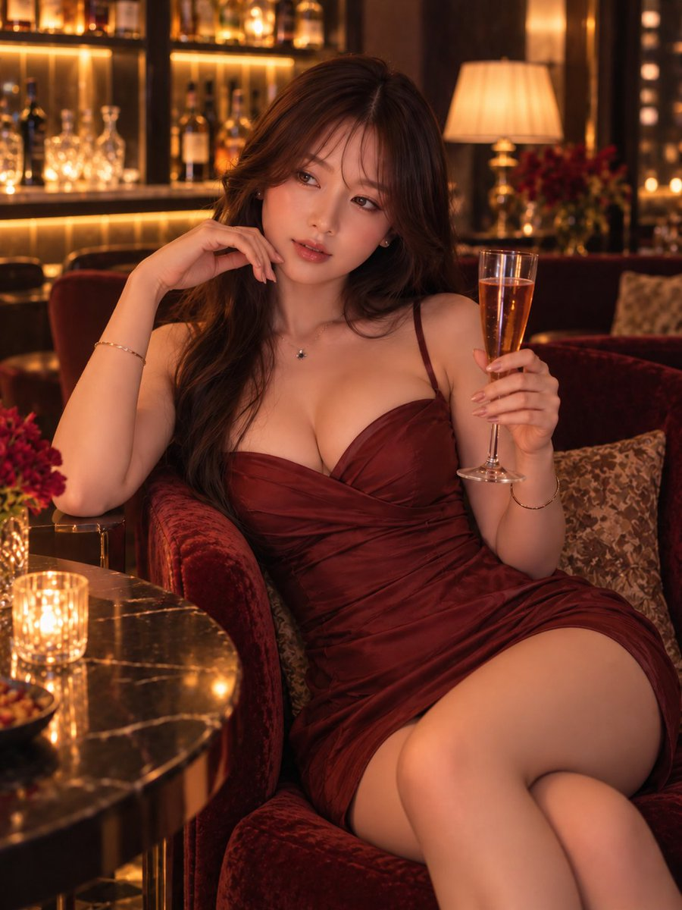

**Prompt**

```text
Traducción en curso
```

[↑ Volver a categorías](#catalog)

---

<a name="prompt-2101617615538110920"></a>

### Traducción en curso

Autor：[@CyberTotal2026](https://x.com/CyberTotal2026) · [Publicación original](https://x.com/CyberTotal2026/status/2101617615538110920)

Fotografía · Retrato / Selfie · Personaje · Vehículo · Paisaje / Naturaleza · Resumen / Antecedentes · Publicado

**Resumen:** Traducción en curso

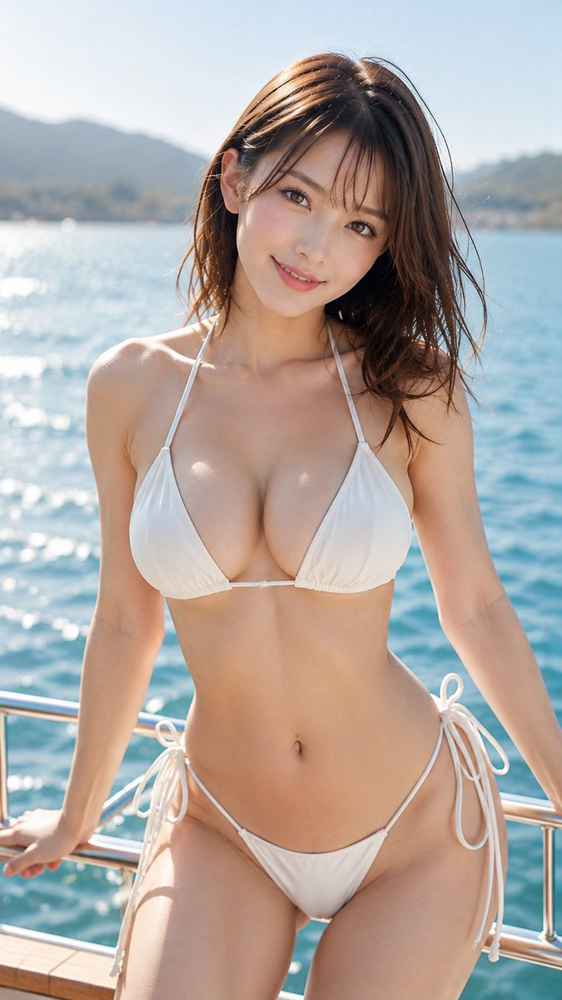

**Prompt**

```text
Traducción en curso
```

[↑ Volver a categorías](#catalog)

---

<a name="prompt-2101603522584387793"></a>

### Traducción en curso

Autor：[@CyberTotal2026](https://x.com/CyberTotal2026) · [Publicación original](https://x.com/CyberTotal2026/status/2101603522584387793)

Fotografía · Retrato / Selfie · Personaje · Publicado

**Resumen:** Traducción en curso

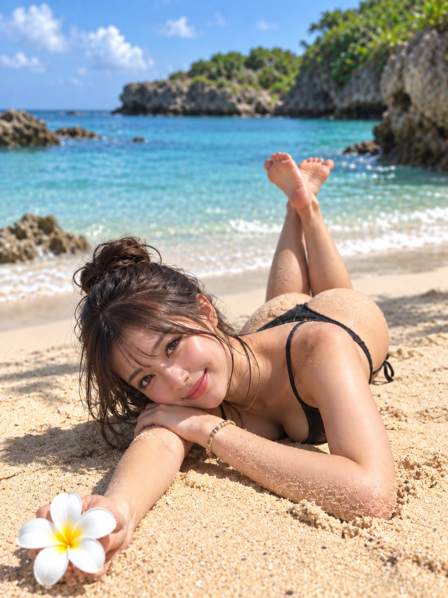

**Prompt**

```text
Traducción en curso
```

[↑ Volver a categorías](#catalog)

---

<a name="prompt-2101631708328272158"></a>

### Traducción en curso

Autor：[@CyberTotal2026](https://x.com/CyberTotal2026) · [Publicación original](https://x.com/CyberTotal2026/status/2101631708328272158)

Fotografía · Retrato / Selfie · Personaje · Publicado

**Resumen:** Traducción en curso

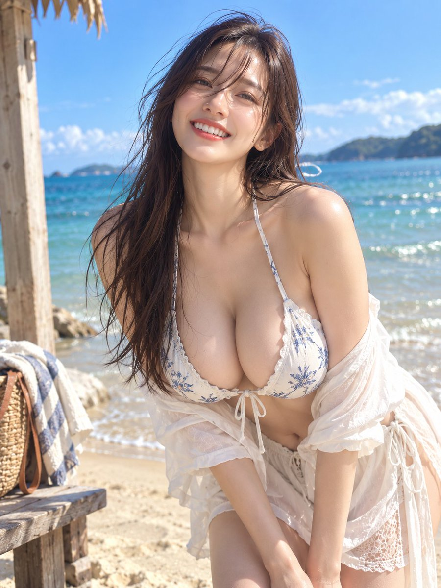

**Prompt**

```text
Traducción en curso
```

[↑ Volver a categorías](#catalog)

---

<a name="prompt-2101645801294360989"></a>

### Traducción en curso

Autor：[@CyberTotal2026](https://x.com/CyberTotal2026) · [Publicación original](https://x.com/CyberTotal2026/status/2101645801294360989)

Fotografía · Personaje · Publicado

**Resumen:** Traducción en curso

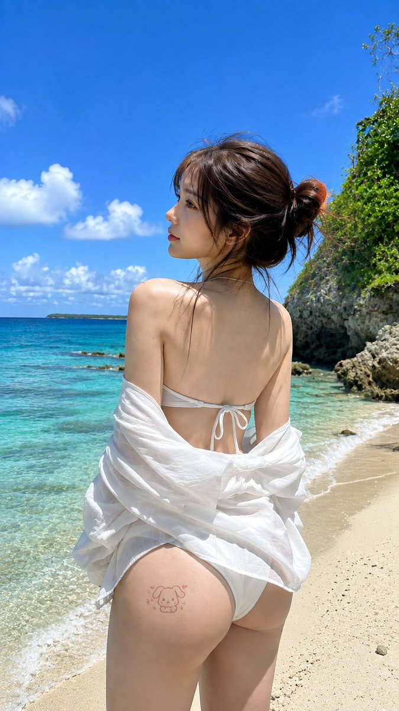

**Prompt**

```text
Traducción en curso
```

[↑ Volver a categorías](#catalog)

---

<a name="prompt-2101542872772219010"></a>

### Traducción en curso

Autor：[@CyberTotal2026](https://x.com/CyberTotal2026) · [Publicación original](https://x.com/CyberTotal2026/status/2101542872772219010)

Fotografía · Retrato / Selfie · Personaje · Vehículo · Resumen / Antecedentes · Publicado

**Resumen:** Traducción en curso

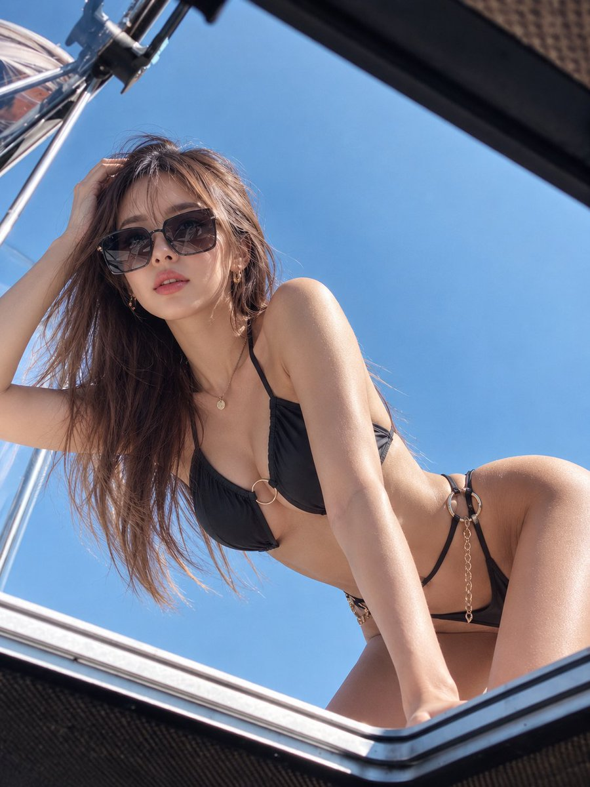

**Prompt**

```text
Traducción en curso
```

[↑ Volver a categorías](#catalog)

---

<a name="prompt-2101569548671705452"></a>

### Traducción en curso

Autor：[@CyberTotal2026](https://x.com/CyberTotal2026) · [Publicación original](https://x.com/CyberTotal2026/status/2101569548671705452)

Fotografía · Retrato / Selfie · Personaje · Artículo de moda · Publicado

**Resumen:** Traducción en curso

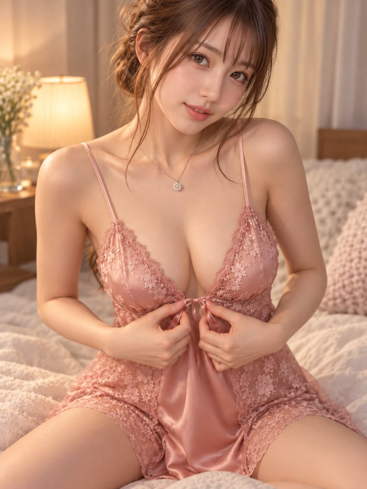

**Prompt**

```text
Traducción en curso
```

[↑ Volver a categorías](#catalog)

---

<a name="prompt-2101297254481223763"></a>

### Traducción en curso

Autor：[@CyberTotal2026](https://x.com/CyberTotal2026) · [Publicación original](https://x.com/CyberTotal2026/status/2101297254481223763)

Fotografía · Retrato / Selfie · Personaje · Publicado

**Resumen:** Traducción en curso

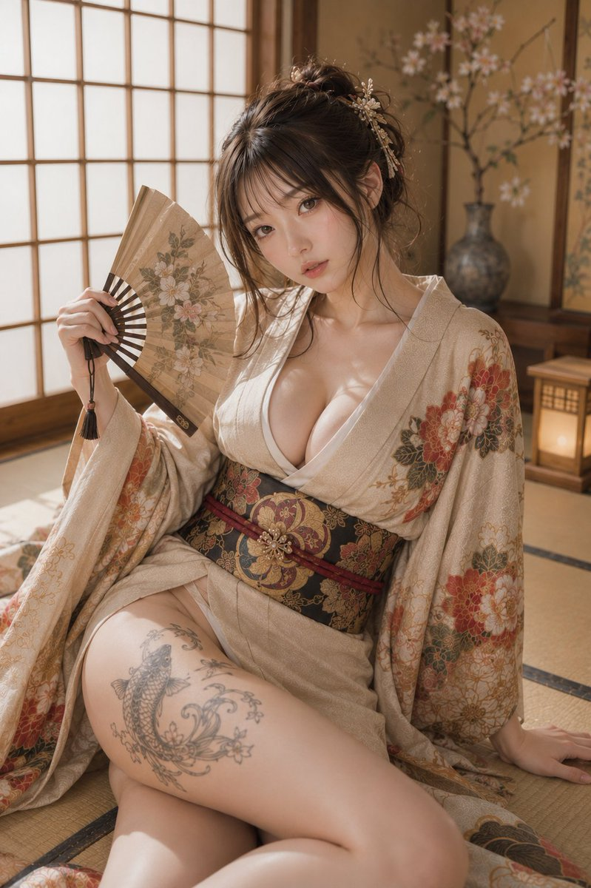

**Prompt**

```text
Traducción en curso
```

[↑ Volver a categorías](#catalog)

---

<a name="prompt-2101282658466562299"></a>

### Traducción en curso

Autor：[@CyberTotal2026](https://x.com/CyberTotal2026) · [Publicación original](https://x.com/CyberTotal2026/status/2101282658466562299)

Fotografía · Retrato / Selfie · Personaje · Paisaje / Naturaleza · Publicado

**Resumen:** Traducción en curso

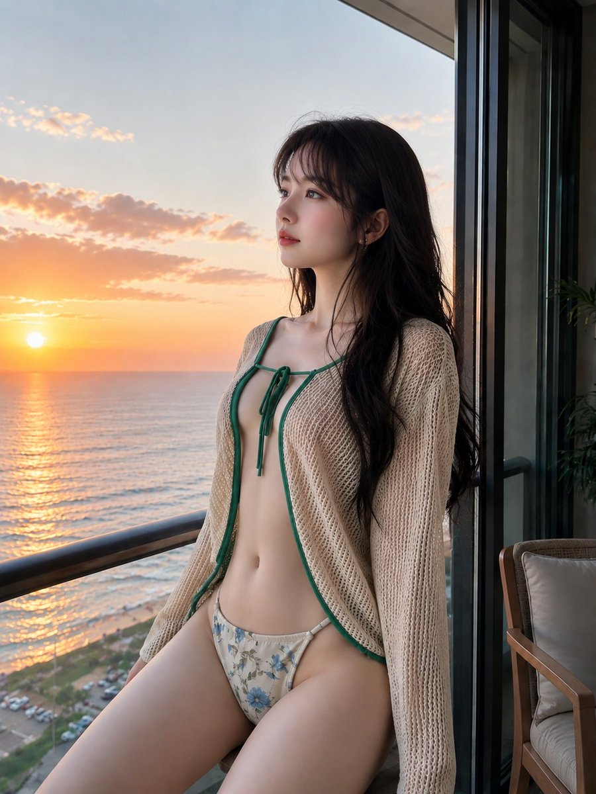

**Prompt**

```text
Traducción en curso
```

[↑ Volver a categorías](#catalog)

---

<a name="prompt-2101239624718856403"></a>

### Traducción en curso

Autor：[@CyberTotal2026](https://x.com/CyberTotal2026) · [Publicación original](https://x.com/CyberTotal2026/status/2101239624718856403)

Fotografía · Personaje · Publicado

**Resumen:** Traducción en curso

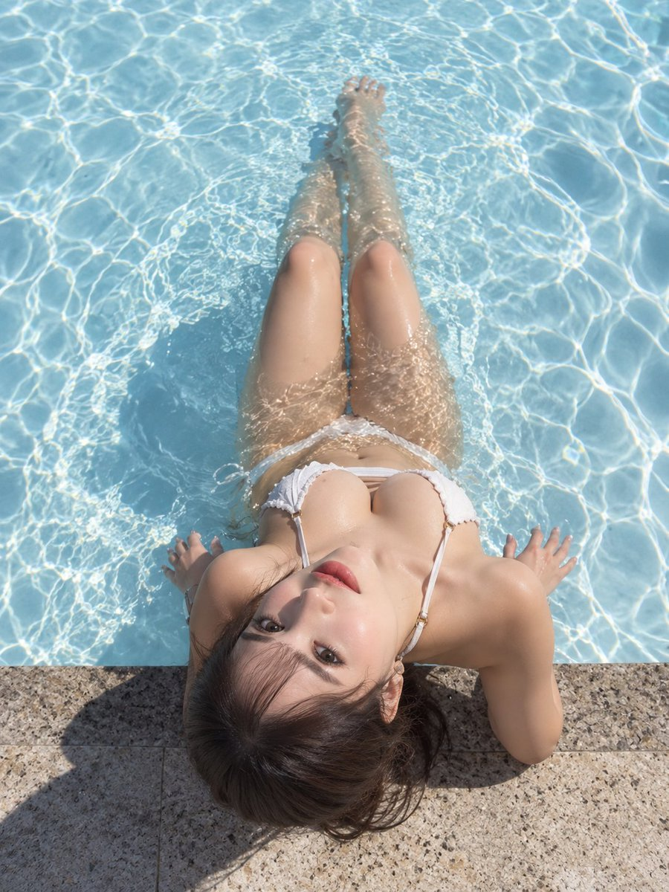

**Prompt**

```text
Traducción en curso
```

[↑ Volver a categorías](#catalog)

---

<a name="prompt-2101272591956840655"></a>

### Traducción en curso

Autor：[@CyberTotal2026](https://x.com/CyberTotal2026) · [Publicación original](https://x.com/CyberTotal2026/status/2101272591956840655)

Fotografía · Retrato / Selfie · Personaje · Publicado

**Resumen:** Traducción en curso

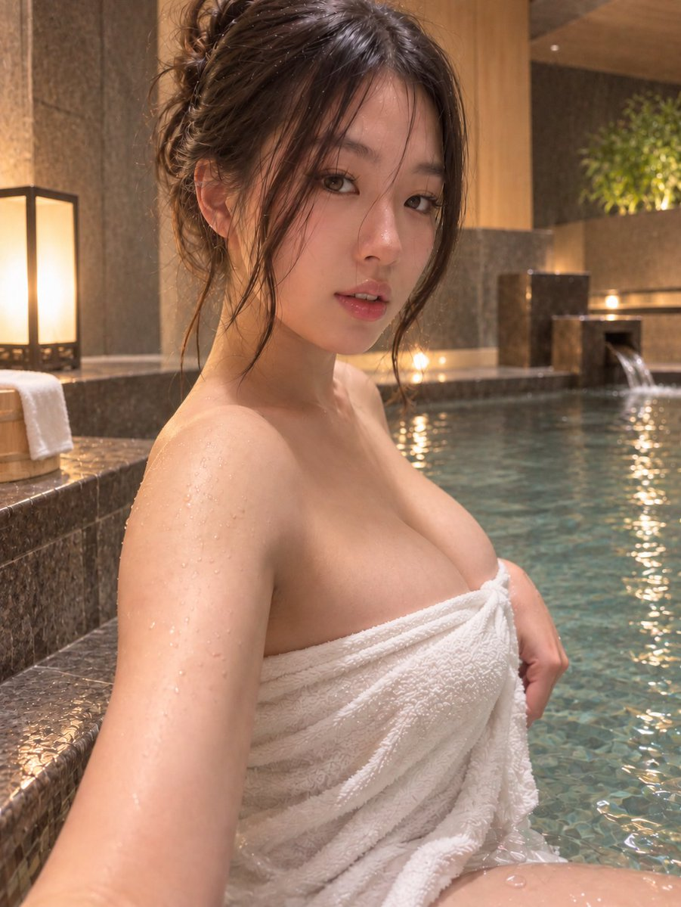

**Prompt**

```text
Traducción en curso
```

[↑ Volver a categorías](#catalog)

---

<a name="prompt-2101251955922256022"></a>

### Traducción en curso

Autor：[@CyberTotal2026](https://x.com/CyberTotal2026) · [Publicación original](https://x.com/CyberTotal2026/status/2101251955922256022)

Fotografía · Retrato / Selfie · Personaje · Publicado

**Resumen:** Traducción en curso

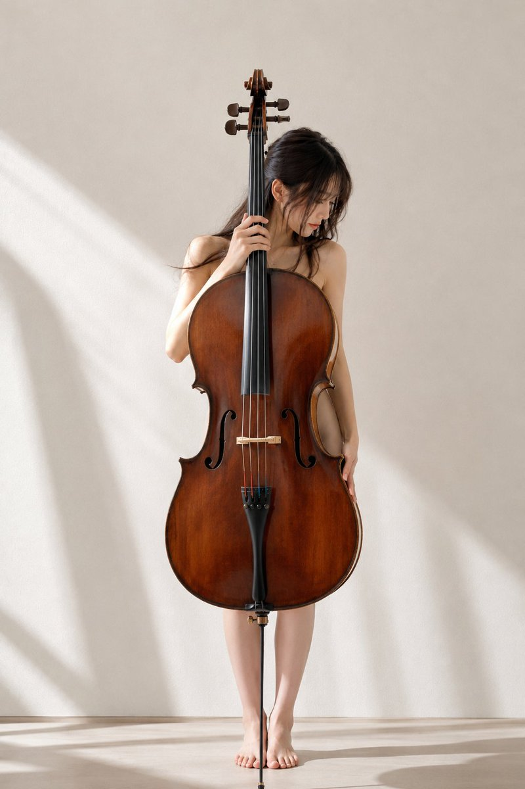

**Prompt**

```text
Traducción en curso
```

[↑ Volver a categorías](#catalog)

---

<a name="prompt-2101181996248805853"></a>

### Traducción en curso

Autor：[@CyberTotal2026](https://x.com/CyberTotal2026) · [Publicación original](https://x.com/CyberTotal2026/status/2101181996248805853)

Fotografía · Retrato / Selfie · Personaje · Artículo de moda · Publicado

**Resumen:** Traducción en curso

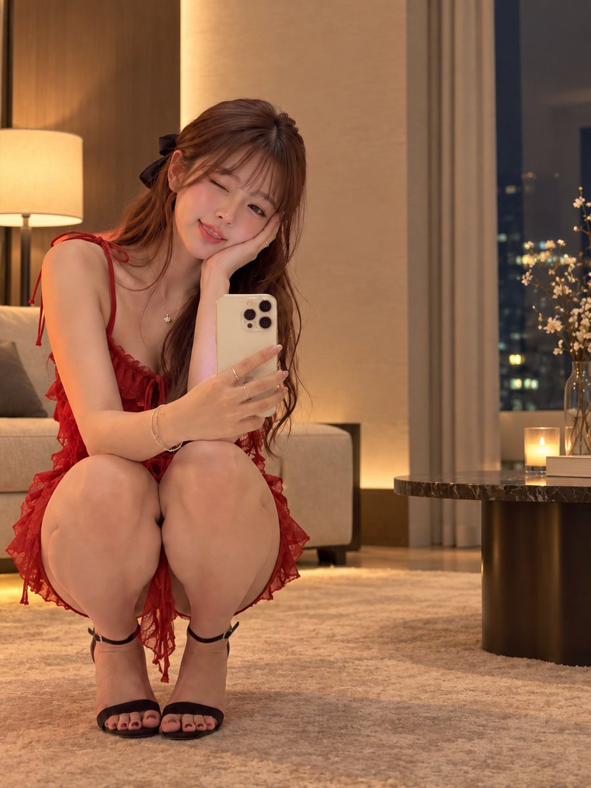

**Prompt**

```text
Traducción en curso
```

[↑ Volver a categorías](#catalog)

---

<a name="prompt-2101205651024494639"></a>

### Traducción en curso

Autor：[@CyberTotal2026](https://x.com/CyberTotal2026) · [Publicación original](https://x.com/CyberTotal2026/status/2101205651024494639)

Fotografía · Personaje · Publicado

**Resumen:** Traducción en curso

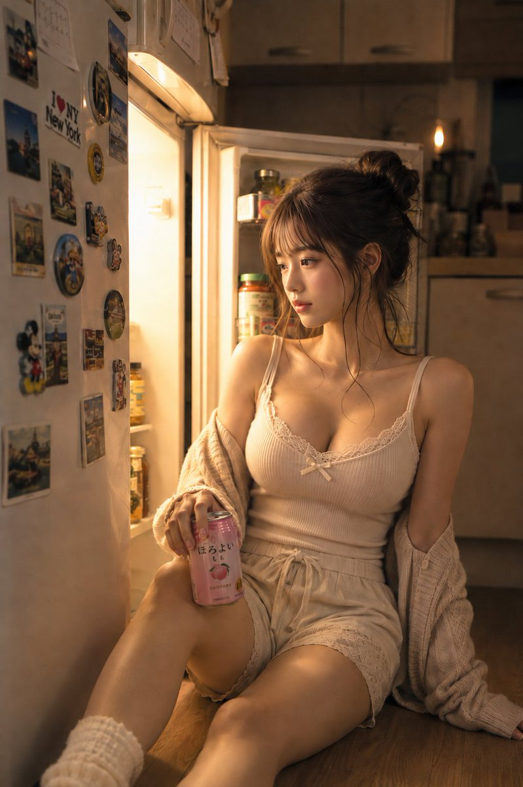

**Prompt**

```text
Traducción en curso
```

[↑ Volver a categorías](#catalog)

---

<a name="prompt-2101145547067506779"></a>

### Un retrato callejero nocturno fotorrealista de una joven sonriente del este de Asia sosteniendo una cámara compacta con atuendo de mezclilla sobre mezclilla.

Autor：[@Aqsahere\_](https://x.com/Aqsahere_) · [Publicación original](https://x.com/Aqsahere_/status/2101145547067506779)

Fotografía · Retrato / Selfie · Personaje · Artículo de moda · Paisaje urbano / Calle · Publicado

**Resumen:** Un retrato callejero nocturno fotorrealista de una joven sonriente del este de Asia sosteniendo una cámara compacta con atuendo de mezclilla sobre mezclilla.

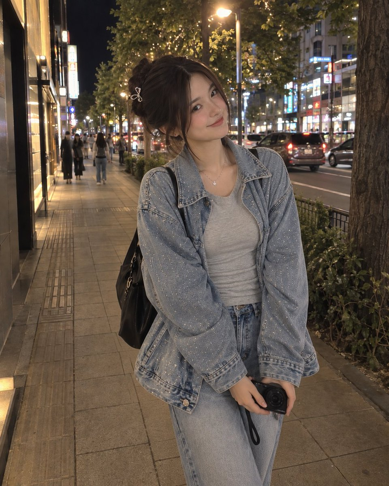

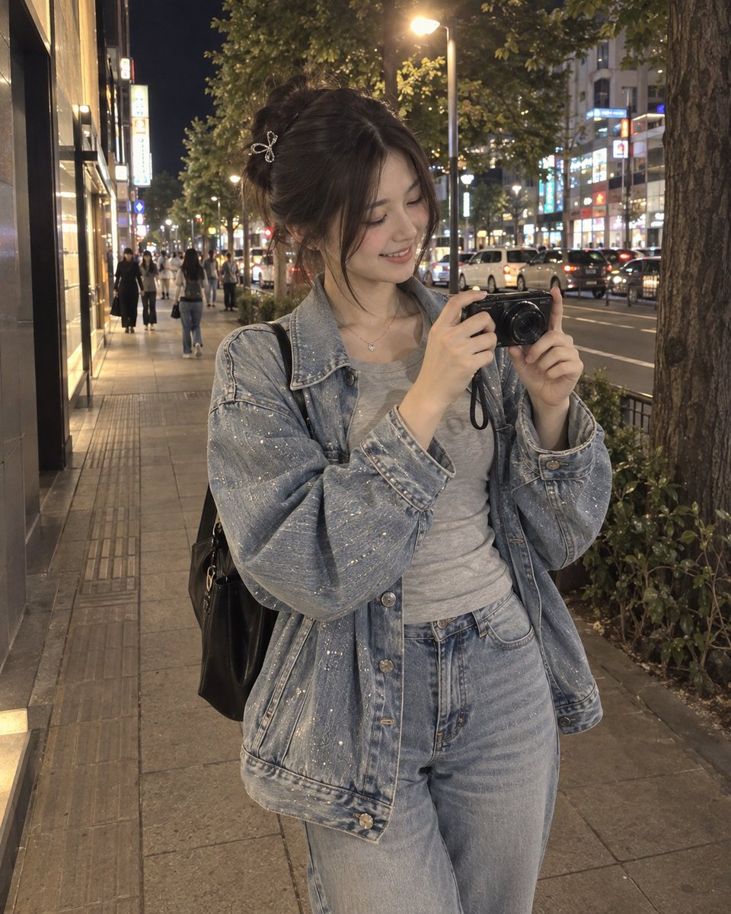

**Prompt**

```text
Un retrato fotorrealista de moda urbana nocturna de una mujer joven parada en una acera de la ciudad, sosteniendo una cámara digital compacta con ambas manos como si estuviera tomando una foto. Tiene el cabello largo, de color negro castaño oscuro, recogido en un moño bajo y prolijo, con mechones suaves que enmarcan su rostro cayendo naturalmente a ambos lados. Una pequeña y elegante horquilla decorativa de plata está sujeta al moño. Tiene rasgos faciales delicados y juveniles, piel suave natural, mejillas sutilmente sonrosadas, labios de color rosa suave y una sonrisa brillante y genuina. Mira ligeramente hacia abajo, hacia la cámara en sus manos, con una expresión alegre y espontánea. Viste una chaqueta de mezclilla azul claro oversize con un lavado ligeramente descolorido y sutiles detalles brillantes/moteados, superpuesta a una camiseta básica ajustada de color gris claro. La combina con unos jeans de mezclilla de tiro alto y lavado claro para un look urbano coordinado de mezclilla sobre mezclilla. Un collar de plata fino y delicado con un pequeño colgante reposa sobre su cuello. Una correa de muñeca negra está unida a la cámara compacta. Sostiene una pequeña cámara digital compacta negra horizontalmente a la altura del pecho, con su mano izquierda sujetando el cuerpo de la cámara y su dedo índice derecho apuntando o tocando los controles de la misma. La cámara es claramente visible y detallada, con un lente circular prominente. El fondo es una animada calle urbana de noche, repleta de escaparates suavemente iluminados, carteles luminosos, farolas, autos que pasan, árboles y peatones a lo lejos. Las luces de fondo crean un hermoso efecto bokeh circular y puntos de luz coloridos, manteniendo a la mujer en un enfoque nítido. Una farola alta brilla detrás de ella, iluminando la copa de los árboles circundantes. Composición: retrato vertical 4:5, encuadre de plano medio a cuerpo entero, sujeto centrado ligeramente hacia la derecha, cámara posicionada alrededor de la altura del pecho, perspectiva espontánea natural, cámara compacta claramente visible en primer plano. Iluminación: iluminación ambiental nocturna de la ciudad mezclada con una cálida iluminación de farolas, reflejos suaves en su rostro y cabello, tenue luz de contorno alrededor de su silueta, sombras realistas, bokeh colorido de fondo, atmósfera cinematográfica con poca luz. Estilo de fotografía: fotografía con smartphone ultrarrealista, estética espontánea de moda callejera coreana/asiática, textura de piel natural, mechones de cabello realistas, fibras de mezclilla detalladas, detalles auténticos de la cámara, profundidad de campo reducida, marcada separación del sujeto, grano de película sutil, exposición nocturna realista, gradación de color cinematográfica suave, alto detalle, 4K. Prompt negativo: anime, caricatura, ilustración, CGI, render 3D, piel plástica, filtro de belleza excesivo, rostro poco realista, anatomía distorsionada, manos malformadas, dedos adicionales, dedos faltantes, dedos fusionados, cámara distorsionada, ropa deformada, cabello artificial, colores sobresaturados, bokeh antinatural, iluminación de estudio dura, sujeto borroso, baja resolución, texto, marca de agua, logotipo.
```

[↑ Volver a categorías](#catalog)

---

<a name="prompt-2101121597423984903"></a>

### Traducción en curso

Autor：[@CyberTotal2026](https://x.com/CyberTotal2026) · [Publicación original](https://x.com/CyberTotal2026/status/2101121597423984903)

Fotografía · Retrato / Selfie · Personaje · Publicado

**Resumen:** Traducción en curso

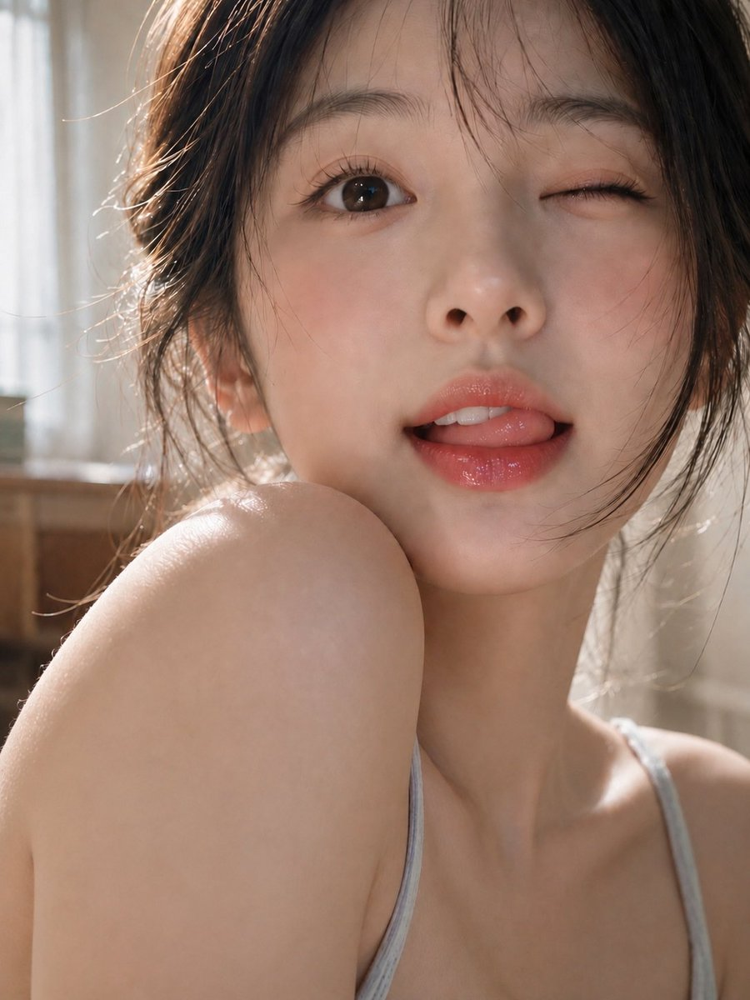

**Prompt**

```text
Traducción en curso
```

[↑ Volver a categorías](#catalog)

---

<a name="prompt-2101149782836150767"></a>

### Traducción en curso

Autor：[@CyberTotal2026](https://x.com/CyberTotal2026) · [Publicación original](https://x.com/CyberTotal2026/status/2101149782836150767)

Fotografía · Retrato / Selfie · Personaje · Arquitectura / Interiores · Publicado

**Resumen:** Traducción en curso

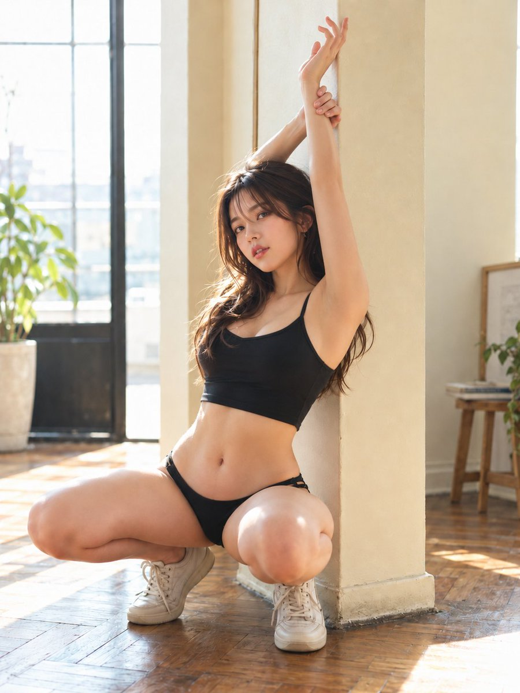

**Prompt**

```text
Traducción en curso
```

[↑ Volver a categorías](#catalog)

---

<a name="prompt-2100935621976191407"></a>

### Traducción en curso

Autor：[@CyberTotal2026](https://x.com/CyberTotal2026) · [Publicación original](https://x.com/CyberTotal2026/status/2100935621976191407)

Fotografía · Retrato / Selfie · Personaje · Publicado

**Resumen:** Traducción en curso


**Prompt**

```text
Traducción en curso
```

[↑ Volver a categorías](#catalog)

---

<a name="prompt-2100848799484915933"></a>

### Traducción en curso

Autor：[@CyberTotal2026](https://x.com/CyberTotal2026) · [Publicación original](https://x.com/CyberTotal2026/status/2100848799484915933)

Fotografía · Personaje · Paisaje urbano / Calle · Publicado

**Resumen:** Traducción en curso


**Prompt**

```text
Traducción en curso
```

[↑ Volver a categorías](#catalog)

---

<a name="prompt-2100819355332427950"></a>

### Traducción en curso

Autor：[@CyberTotal2026](https://x.com/CyberTotal2026) · [Publicación original](https://x.com/CyberTotal2026/status/2100819355332427950)

Fotografía · Retrato / Selfie · Personaje · Resumen / Antecedentes · Publicado

**Resumen:** Traducción en curso


**Prompt**

```text
Traducción en curso
```

[↑ Volver a categorías](#catalog)

---

<a name="prompt-2100759210703421826"></a>

### Traducción en curso

Autor：[@CyberTotal2026](https://x.com/CyberTotal2026) · [Publicación original](https://x.com/CyberTotal2026/status/2100759210703421826)

Fotografía · Retrato / Selfie · Personaje · Publicado

**Resumen:** Traducción en curso


**Prompt**

```text
Traducción en curso
```

[↑ Volver a categorías](#catalog)

---

<a name="prompt-2100454954330980559"></a>

### Traducción en curso

Autor：[@CyberTotal2026](https://x.com/CyberTotal2026) · [Publicación original](https://x.com/CyberTotal2026/status/2100454954330980559)

Fotografía · Retrato / Selfie · Personaje · Publicado

**Resumen:** Traducción en curso


**Prompt**

```text
Traducción en curso
```

[↑ Volver a categorías](#catalog)

---

<a name="prompt-2100486914876850304"></a>

### Traducción en curso

Autor：[@CyberTotal2026](https://x.com/CyberTotal2026) · [Publicación original](https://x.com/CyberTotal2026/status/2100486914876850304)

Fotografía · Personaje · Artículo de moda · Resumen / Antecedentes · Publicado

**Resumen:** Traducción en curso


**Prompt**

```text
Traducción en curso
```

[↑ Volver a categorías](#catalog)

---

<a name="prompt-2100425761840890004"></a>

### Traducción en curso

Autor：[@CyberTotal2026](https://x.com/CyberTotal2026) · [Publicación original](https://x.com/CyberTotal2026/status/2100425761840890004)

Fotografía · Retrato / Selfie · Personaje · Artículo de moda · Publicado

**Resumen:** Traducción en curso


**Prompt**

```text
Traducción en curso
```

[↑ Volver a categorías](#catalog)

---

<a name="prompt-2100394808036516139"></a>

### Traducción en curso

Autor：[@CyberTotal2026](https://x.com/CyberTotal2026) · [Publicación original](https://x.com/CyberTotal2026/status/2100394808036516139)

Fotografía · Retrato / Selfie · Personaje · Paisaje / Naturaleza · Publicado

**Resumen:** Traducción en curso


**Prompt**

```text
Traducción en curso
```

[↑ Volver a categorías](#catalog)

---

<a name="prompt-2100350516463046998"></a>

### Traducción en curso

Autor：[@CyberTotal2026](https://x.com/CyberTotal2026) · [Publicación original](https://x.com/CyberTotal2026/status/2100350516463046998)

Fotografía · Retrato / Selfie · Personaje · Publicado

**Resumen:** Traducción en curso


**Prompt**

```text
Traducción en curso
```

[↑ Volver a categorías](#catalog)

---

<a name="prompt-2100209587974508608"></a>

### Traducción en curso

Autor：[@CyberTotal2026](https://x.com/CyberTotal2026) · [Publicación original](https://x.com/CyberTotal2026/status/2100209587974508608)

Fotografía · Retrato / Selfie · Personaje · Arquitectura / Interiores · Publicado

**Resumen:** Traducción en curso


**Prompt**

```text
Traducción en curso
```

[↑ Volver a categorías](#catalog)

---

<a name="prompt-2100121758799974473"></a>

### Traducción en curso

Autor：[@CyberTotal2026](https://x.com/CyberTotal2026) · [Publicación original](https://x.com/CyberTotal2026/status/2100121758799974473)

Fotografía · Retrato / Selfie · Personaje · Artículo de moda · Publicado

**Resumen:** Traducción en curso


**Prompt**

```text
Traducción en curso
```

[↑ Volver a categorías](#catalog)

---

<a name="prompt-2100088791751135719"></a>

### Traducción en curso

Autor：[@CyberTotal2026](https://x.com/CyberTotal2026) · [Publicación original](https://x.com/CyberTotal2026/status/2100088791751135719)

Fotografía · Personaje · Publicado

**Resumen:** Traducción en curso


**Prompt**

```text
Traducción en curso
```

[↑ Volver a categorías](#catalog)

---

<a name="prompt-2100064633839030572"></a>

### Traducción en curso

Autor：[@CyberTotal2026](https://x.com/CyberTotal2026) · [Publicación original](https://x.com/CyberTotal2026/status/2100064633839030572)

Fotografía · Retrato / Selfie · Personaje · Publicado

**Resumen:** Traducción en curso


**Prompt**

```text
Traducción en curso
```

[↑ Volver a categorías](#catalog)

---

<a name="prompt-2100027640358805923"></a>

### Traducción en curso

Autor：[@CyberTotal2026](https://x.com/CyberTotal2026) · [Publicación original](https://x.com/CyberTotal2026/status/2100027640358805923)

Fotografía · Retrato / Selfie · Personaje · Artículo de moda · Publicado

**Resumen:** Traducción en curso


**Prompt**

```text
Traducción en curso
```

[↑ Volver a categorías](#catalog)

---

<a name="prompt-2099622469099217254"></a>

### Traducción en curso

Autor：[@CyberTotal2026](https://x.com/CyberTotal2026) · [Publicación original](https://x.com/CyberTotal2026/status/2099622469099217254)

Fotografía · Retrato / Selfie · Personaje · Publicado

**Resumen:** Traducción en curso


**Prompt**

```text
Traducción en curso
```

[↑ Volver a categorías](#catalog)

---

<a name="prompt-2099486826192842807"></a>

### Traducción en curso

Autor：[@CyberTotal2026](https://x.com/CyberTotal2026) · [Publicación original](https://x.com/CyberTotal2026/status/2099486826192842807)

Fotografía · Personaje · Publicado

**Resumen:** Traducción en curso


**Prompt**

```text
Traducción en curso
```

[↑ Volver a categorías](#catalog)

---

<a name="prompt-2099370474455396482"></a>

### Retrato de estudio fotorrealista de una mujer elegante con un vestido midi negro entallado.

Autor：[@MissDelulu9](https://x.com/MissDelulu9) · [Publicación original](https://x.com/MissDelulu9/status/2099370474455396482)

Fotografía · Retrato / Selfie · Personaje · Artículo de moda · Publicado

**Resumen:** Retrato de estudio fotorrealista de una mujer elegante con un vestido midi negro entallado.


**Prompt**

```text
Crea un retrato de estudio de cuerpo entero altamente fotorrealista de una mujer adulta y elegante que viste un sofisticado vestido formal midi negro con mangas largas, cintura entallada, tela de primera calidad y textura sutil. Joyería minimalista, elegantes tacones en punta, cabello lacio y pulido, maquillaje suave y natural, expresión confiada y dulce. Fondo de estudio de moda de lujo, iluminación suave y difusa, textura de piel realista, proporciones naturales, fotografía editorial cinematográfica, lente de 85 mm, ultradetallado, 8K, sin texto, sin marcas de agua.
```

[↑ Volver a categorías](#catalog)

---

<a name="prompt-2099398744529600886"></a>

### Prompt de fotografía de retrato realista de una mujer en una cama iluminada por la luz de la mañana, vestida con lencería de color rosa empolvado y mirando por encima del hombro.

Autor：[@CyberTotal2026](https://x.com/CyberTotal2026) · [Publicación original](https://x.com/CyberTotal2026/status/2099398744529600886)

Fotografía · Retrato / Selfie · Personaje · Publicado

**Resumen:** Prompt de fotografía de retrato realista de una mujer en una cama iluminada por la luz de la mañana, vestida con lencería de color rosa empolvado y mirando por encima del hombro.


**Prompt**

```text
Tema:
Rosa empolvado junto a la ventana matutina

Sujeto:
Fotografía vertical en primer plano lateral de una mujer adulta vestida con lencería de color rosa empolvado, sobre una cama blanca iluminada por el sol de la mañana. La persona se sitúa tomando como referencia el centro del encuadre.

Persona y expresión:
Cabello lacio castaño cenizo claro que cae por debajo de los hombros con flequillo ligero. Rostro ovalado y esbelto, barbilla pequeña, ojos castaños redondos, cejas finas naturales, puente nasal delgado y labios rosados brillantes. Expresión serena mirando a la cámara por encima del hombro.

Atuendo y postura:
Sostén con varilla y tirantes finos en color rosa empolvado. Encaje del mismo color en la parte superior de las copas y un pequeño moño en el centro del pecho. Cuerpo orientado de lado, manteniendo la espalda recta y volteando la cara por encima del hombro. Traje de baño de color rosa empolvado.

Fondo e iluminación:
Sábanas y almohadas blancas, muebles de madera clara, gran ventanal. La intensa luz solar matutina procedente de la esquina superior derecha crea bordes luminosos y sombras suaves en la mejilla, el puente de la nariz, el hombro y el cabello. La luz principal del fondo del encuadre es una luz suave proveniente del lado de la ventana.

Composición y cámara:
Composición vertical 3:4, cámara en primer plano debajo del pecho desde una perspectiva diagonal de lado. Rostro en la esquina superior derecha, hombro y copa rosa colocados de forma prominente en la parte inferior central. Ambos ojos, labios, encaje y mechones de cabello nítidos con un fondo intensamente desenfocado. Encuadre amplio de la persona, enfoque centrado en la protagonista y fondo con un suave efecto bokeh.

Textura y estilo:
Fotografía de belleza fotorrealista. Captura con gran precisión la textura natural de la piel, el encaje rosa, los tirantes finos, el cabello castaño cenizo y los suaves reflejos de la luz de la mañana.

Negativo:
No alterar la mirada de lado por encima del hombro ni el encaje en tono rosa empolvado
```

[↑ Volver a categorías](#catalog)

---

<a name="prompt-2099367790524219462"></a>

### Prompt para un retrato fotorrealista de una mujer sentada en una mesa de madera junto a un lago.

Autor：[@CyberTotal2026](https://x.com/CyberTotal2026) · [Publicación original](https://x.com/CyberTotal2026/status/2099367790524219462)

Fotografía · Retrato / Selfie · Personaje · Paisaje / Naturaleza · Publicado

**Resumen:** Prompt para un retrato fotorrealista de una mujer sentada en una mesa de madera junto a un lago.


**Prompt**

```text
Tema:
Botones blancos junto al lago

Sujeto:
Fotografía vertical de una mujer adulta con un crop top blanco sentada junto a una mesa de madera a la orilla de un lago de montaña azul. La figura se ubica tomando como referencia el centro del encuadre.

Rostro y expresión:
Cabello lacio castaño oscuro hasta debajo del busto con raya casi al centro. Rostro ovalado fino, ojos cafés redondos, cejas naturales, nariz pequeña y labios color durazno brillantes. Sonríe suavemente hacia el frente.

Vestimenta y pose:
Crop top blanco de canalé de manga corta con cuello redondo pronunciado ribeteado con encaje fino y una hilera de botones pequeños bajo el busto. Shorts de mezclilla azul claro. Sentada en el borde de la mesa, con ambos brazos hacia adelante.

Fondo e iluminación:
Lago azul verdoso, bosque de coníferas, montañas escarpadas con vetas de nieve, cielo azul y nubes blancas. En la parte inferior izquierda, un café helado en un vaso transparente. Luz de día intensa con sol que se filtra entre las hojas. La luz principal de fondo es una luz cenital dura y directa.

Composición y cámara:
Composición vertical de 2:3, toma de frente de la cintura para arriba. La persona en el centro, el lago y las montañas en la mitad superior, y el café helado en la esquina inferior izquierda. Foco en el rostro y la hilera de botones blancos, con las montañas ligeramente desenfocadas. La figura se capta en un tamaño destacado con el foco en la protagonista y un fondo suavemente desenfocado.

Textura y estilo:
Fotografía de viaje fotorrealista. Captura con nitidez bajo la luz del día el canalé blanco y el encaje, la mezclilla, la bebida fría, el lago azul y las crestas de la montaña.

Negativo:
No omitir el lago de montaña ni el café helado de la parte inferior izquierda
```

[↑ Volver a categorías](#catalog)

---

<a name="prompt-2099400168433152293"></a>

### Prompt de retrato en ángulo extremadamente cerrado de una mujer mirando hacia la cámara con ojos llorosos.

Autor：[@CyberTotal2026](https://x.com/CyberTotal2026) · [Publicación original](https://x.com/CyberTotal2026/status/2099400168433152293)

Fotografía · Retrato / Selfie · Personaje · Publicado

Publicación original：[@CyberTotal2026](https://x.com/CyberTotal2026) · [Publicación original](https://x.com/CyberTotal2026/status/2093263569249005578)

**Resumen:** Prompt de retrato en ángulo extremadamente cerrado de una mujer mirando hacia la cámara con ojos llorosos.


**Prompt**

```text
Tema:
Retrato en primer plano de ojos llorosos

Sujeto:
Una fotografía vertical tomada desde arriba a muy corta distancia de una mujer de unos 20 años. La persona ocupa una gran parte del centro del encuadre, inclinando la parte superior del cuerpo hacia adelante mientras mira hacia la cámara. Extiende una mano ligeramente abierta en forma de cuenco justo debajo de su boca, y en la palma sostiene unas pocas gotas de agua transparentes. Un fondo interior oscuro y una atmósfera íntima propia de la corta distancia.

Persona y expresión:
Rostro pequeño y redondeado con una línea de mandíbula suave. Grandes ojos marrones que miran fijamente a la cámara, con los extremos exteriores ligeramente caídos dando una impresión apacible. Hay una película natural de lágrimas en el párpado inferior y apenas una pequeña gota de lágrima visible cerca de la esquina exterior del ojo, sin llegar a ser una expresión de llanto. Cejas marrones delgadas, rubor rosado tenue, pestañas delicadas y labios brillantes en tono beige rosado. El cabello largo de color castaño claro tiene ondas suaves, con un flequillo fino y mechones delgados que enmarcan las mejillas.

Vestimenta y postura:
Top sin mangas de canalé fino en color rosa claro. Se aprecia un escote en V pronunciado con un pequeño lazo en el centro, combinado debajo con una prenda inferior corta en tono marfil claro. Postura con el torso inclinado hacia la cámara y los hombros ligeramente encogidos hacia adentro. Una mano debajo de la cara con la palma hacia arriba y los dedos curvados de forma natural, sosteniendo una pequeña cantidad de gotas de agua.

Fondo e iluminación:
Interior con tonos predominantes de marrón oscuro y negro. Al fondo a la izquierda se aprecian muebles oscuros y pequeños papeles desenfocados, y al fondo a la derecha un almacenamiento negro y pequeños objetos blancos desenfocados. Una luz cálida y suave que incide principalmente desde el frente ilumina con claridad el rostro, el cabello, los hombros y la palma de la mano, mientras que el fondo cae en una sombra más oscura. La piel tiene un brillo sutil, con pequeños reflejos en las pupilas y la superficie de las lágrimas.

Composición y cámara:
Vertical 4:3. Retrato de ángulo extremadamente cerrado con el rostro ubicado predominantemente en el centro de la mitad superior del encuadre. Una perspectiva gran angular tomada desde una posición alta y ligeramente hacia abajo, destacando en gran medida el rostro y la mano en primer plano. Abarca desde la coronilla hasta el pecho y parte de los muslos, con la palma de la mano superpuesta en la parte inferior central del encuadre. Enfoque nítido y claro en el rostro y los ojos, con un fondo suavemente desenfocado.

Textura y estilo:
Expresión fotográfica realista. Piel suave que conserva su textura natural, cabello suave visible mechón por mechón, tejido de canalé, gotas de agua y la transparencia de las lágrimas representados en detalle. Tonos cálidos y suaves, evitando un HDR excesivo o retoques intensos de belleza. Tridimensionalidad propia de la toma a corta distancia y un aire natural como el de una fotografía cotidiana.

Negativo:
Lágrimas grandes y poco naturales; expresión hinchada por el llanto
```

[↑ Volver a categorías](#catalog)

---

<a name="prompt-2099339353168441687"></a>

### Prompt de fotografía de moda de interiores de una mujer sentada en un sofá vistiendo un minivestido de tweed blanco y negro.

Autor：[@CyberTotal2026](https://x.com/CyberTotal2026) · [Publicación original](https://x.com/CyberTotal2026/status/2099339353168441687)

Fotografía · Retrato / Selfie · Personaje · Artículo de moda · Arquitectura / Interiores · Publicado

**Resumen:** Prompt de fotografía de moda de interiores de una mujer sentada en un sofá vistiendo un minivestido de tweed blanco y negro.


**Prompt**

```text
Tema:
Tweed blanco y negro de la tarde

Sujeto:
Fotografía vertical de una mujer adulta con un minivestido de tweed blanco y negro sentada en un sofá, en una sala luminosa y elegante. El sujeto está ubicado tomando como referencia el centro del encuadre.

Persona y expresión:
Cabello ondulado castaño claro debajo de los hombros con flequillo fino. Rostro ovalado y delgado, ojos castaños rasgados, cejas finas naturales, nariz pequeña y labios rosados brillantes. Apoya la mejilla en una mano y mira con calma hacia la izquierda del encuadre. El rostro está orientado hacia la izquierda del encuadre.

Vestimenta y pose:
Minivestido de tweed fino en blanco crudo con tirantes finos negros, escote en V pronunciado con ribete de encaje negro, ribetes negros en el torso y el dobladillo, y pequeños botones estilo perla. Con las piernas cruzadas, un codo sobre la rodilla y el otro brazo descansando sobre las piernas. Accesorios dorados delgados.

Fondo e iluminación:
Sofá beige claro, mesa de mármol, florero con rosas blancas, repisa y ventana grande. La luz natural de la izquierda genera suaves reflejos en el cabello y los hombros. La luz principal del fondo del encuadre es una luz suave proveniente de la ventana.

Composición y cámara:
Composición vertical 2:3, cámara en ángulo diagonal frontal cerca del nivel de la mirada al estar sentada, toma por encima de las rodillas. Sujeto en el centro a la izquierda, rosas blancas en el primer plano derecho y la ventana al fondo a la izquierda. Enfoque en el rostro y en los ribetes negros del tweed. Sujeto capturado en primer plano con foco en la protagonista y fondo ligeramente desenfocado.

Textura y estilo:
Fotografía de moda de interiores fotorrealista. Captura precisa del tweed rugoso, los bordes negros, los botones estilo perla, los accesorios dorados y el suave brillo de la piel.

Negativo:
No cambiar los bordes en blanco y negro ni la textura de tweed por tela lisa
```

[↑ Volver a categorías](#catalog)

---

<a name="prompt-2099309154334548142"></a>

### Traducción en curso

Autor：[@CyberTotal2026](https://x.com/CyberTotal2026) · [Publicación original](https://x.com/CyberTotal2026/status/2099309154334548142)

Fotografía · Retrato / Selfie · Personaje · Publicado

**Resumen:** Traducción en curso


**Prompt**

```text
Traducción en curso
```

[↑ Volver a categorías](#catalog)

---

<a name="prompt-2099262094302761246"></a>

### Traducción en curso

Autor：[@CyberTotal2026](https://x.com/CyberTotal2026) · [Publicación original](https://x.com/CyberTotal2026/status/2099262094302761246)

Fotografía · Retrato / Selfie · Personaje · Publicado

**Resumen:** Traducción en curso


**Prompt**

```text
Traducción en curso
```

[↑ Volver a categorías](#catalog)

---

<a name="prompt-2099123682249732440"></a>

### Prompt de fotografía fotorrealista de estilo de vida matutino de una mujer sentada en una alfombra blanca en la sala ofreciendo una flor blanca a la cámara.

Autor：[@CyberTotal2026](https://x.com/CyberTotal2026) · [Publicación original](https://x.com/CyberTotal2026/status/2099123682249732440)

Fotografía · Personaje · Publicado

**Resumen:** Prompt de fotografía fotorrealista de estilo de vida matutino de una mujer sentada en una alfombra blanca en la sala ofreciendo una flor blanca a la cámara.


**Prompt**

```text
Tema:
Flor blanca extendida hacia el frente

Sujeto:
Fotografía vertical de una mujer adulta sentada de rodillas dobladas sobre una alfombra blanca en una sala llena de luz solar, extendiendo una sola flor blanca hacia el lente. La persona se ubica con base en el centro del encuadre.

Persona y expresión:
Cabello ondulado castaño claro por debajo de los hombros con flequillo fino. Rostro ovalado, ojos castaños redondos, cejas delgadas, nariz pequeña y labios lustrosos de color coral. Sonríe a la cámara con la boca ligeramente entreabierta. Con el rostro dirigido hacia la cámara de frente.

Vestimenta y pose:
Minivestido lencero de tirantes finos blanco con estampado de florecitas rojas. Encaje blanco en el escote y en el dobladillo corto. Sentada con una pierna doblada de lado, la mano izquierda apoyada en la alfombra y el brazo derecho extendido directamente hacia el lente sosteniendo una flor blanca. Minivestido de florecitas.

Fondo e iluminación:
Mesa baja de madera con mantel de encaje, pan, florero, libros apilados sobre flores, ventanal grande y terraza con vegetación. La luz de la mañana proyecta una sombra cuadriculada sobre la alfombra blanca. La luz principal del fondo del encuadre es una luz suave que proviene de la ventana.

Composición y cámara:
Composición vertical 3:4, cámara frontal ligeramente en plano picado capturando casi el cuerpo entero. La flor blanca en primer plano grande, el rostro al centro, y las piernas dobladas y los libros colocados abajo. Enfoque en el rostro y la flor, fondo desenfocado suavemente. Encuadre amplio de la persona, enfoque en la protagonista y fondo con ligero desenfoque.

Textura y estilo:
Fotografía de estilo de vida luminosa y fotorrealista. Florecitas estampadas, encaje blanco, pétalos, alfombra de pelo largo, madera y luz matutina retratados con tonos limpios.

Negativo:
No omitir el brazo extendido hacia el lente ni la flor única en primer plano
```

[↑ Volver a categorías](#catalog)

---

<a name="prompt-2099093734906613857"></a>

### Traducción en curso

Autor：[@CyberTotal2026](https://x.com/CyberTotal2026) · [Publicación original](https://x.com/CyberTotal2026/status/2099093734906613857)

Fotografía · Personaje · Publicado

**Resumen:** Traducción en curso


**Prompt**

```text
Traducción en curso
```

[↑ Volver a categorías](#catalog)

---

<a name="prompt-2099112358392033544"></a>

### Traducción en curso

Autor：[@CyberTotal2026](https://x.com/CyberTotal2026) · [Publicación original](https://x.com/CyberTotal2026/status/2099112358392033544)

Fotografía · Retrato / Selfie · Personaje · Publicado

**Resumen:** Traducción en curso


**Prompt**

```text
Traducción en curso
```

[↑ Volver a categorías](#catalog)

---

<a name="prompt-2099094091179180195"></a>

### Foto espontánea de estilo callejero de dos mujeres del este de Asia conversando junto a la ventana de un McDonald's.

Autor：[@Aqsahere\_](https://x.com/Aqsahere_) · [Publicación original](https://x.com/Aqsahere_/status/2099094091179180195)

Fotografía · Paisaje urbano / Calle · Publicado

**Resumen:** Foto espontánea de estilo callejero de dos mujeres del este de Asia conversando junto a la ventana de un McDonald's.


**Prompt**

```text
Fotografía callejera espontánea y ultrarrealista en formato 9:16 de dos mujeres adultas del este de Asia con faldas cortas elegantes, sentadas de manera casual en una barra junto a la ventana dentro de un McDonald's, charlando con naturalidad. Fotografiada desde la acera a través de la ventana de vidrio, con reflejos realistas, iluminación interior cálida, lenguaje corporal natural, expresiones auténticas, texturas detalladas de piel y ropa, profundidad de campo reducida y una sensación de fotografía con smartphone sin poses.
```

[↑ Volver a categorías](#catalog)

---

<a name="prompt-2098981813771194613"></a>

### Traducción en curso

Autor：[@ZarnishNael](https://x.com/ZarnishNael) · [Publicación original](https://x.com/ZarnishNael/status/2098981813771194613)

Fotografía · Retrato / Selfie · Personaje · Artículo de moda · Publicado

**Resumen:** Traducción en curso


**Prompt**

```text
Traducción en curso
```

[↑ Volver a categorías](#catalog)

---

<a name="prompt-2098975203866837026"></a>

### Prompt para un retrato realista en composición vertical de una mujer sentada con las piernas cruzadas en la cama tomándose una selfie frente al espejo en una habitación con luz cálida.

Autor：[@CyberTotal2026](https://x.com/CyberTotal2026) · [Publicación original](https://x.com/CyberTotal2026/status/2098975203866837026)

Fotografía · Retrato / Selfie · Personaje · Publicado

**Resumen:** Prompt para un retrato realista en composición vertical de una mujer sentada con las piernas cruzadas en la cama tomándose una selfie frente al espejo en una habitación con luz cálida.


**Prompt**

```text
Tema:
Espejo con smartphone bajo luz nocturna

Sujeto:
Fotografía vertical de una mujer adulta sentada con las piernas cruzadas en la cama de una habitación con una lámpara de luz cálida, tomándose una selfie frente al espejo con un smartphone grande. La persona está centrada en el encuadre.

Persona y expresión:
Cabello largo y negro recogido atrás, flequillo fino. El smartphone tapa en gran parte el centro del rostro, dejando ver únicamente un ojo, la mejilla y parte de unos labios rosados y brillantes. Con el rostro mirando hacia el frente. Expresión tranquila.

Vestimenta y pose:
Camisola blanca acanalada de tirantes delgados con encaje y pequeños botones en el escote, shorts grises con cordón ajustable, calcetines blancos hasta la rodilla. Sentada con las piernas cruzadas, sosteniendo con una mano un smartphone grande de color cobre frente a la cara. Top blanco y short gris.

Fondo e iluminación:
Ropa de cama blanca, mesita de noche de madera, lámpara de mesa de luz cálida, ventana oscura. La luz anaranjada crea sombras suaves sobre la persona y la ropa de cama. La luz principal de fondo es una luz suave proveniente del lado de la ventana.

Composición y cámara:
Composición vertical 2:3, la cámara toma la superficie del espejo de frente, en una toma casi de cuerpo completo sentada. La persona en el centro, el smartphone grande en el centro del rostro y las piernas con calcetines blancos en la parte inferior. Enfoque en el reflejo del espejo y la ropa. Encuadre amplio del sujeto, foco en la protagonista y fondo ligeramente desenfocado.

Textura y estilo:
Selfie frente al espejo de noche fotorrealista. Muestra con naturalidad la superficie del espejo, el teléfono color cobre, el acanalado blanco y el encaje, la tela gris y la lámpara cálida.

Negativo:
No cambiar la composición en la que el smartphone tapa en gran medida el centro de la cara
```

[↑ Volver a categorías](#catalog)

---

<a name="prompt-2098945760817479956"></a>

### Prompt de fotografía de retrato realista con luz natural de una mujer con mini camisón de satén negro mirando hacia atrás en una cama soleada.

Autor：[@CyberTotal2026](https://x.com/CyberTotal2026) · [Publicación original](https://x.com/CyberTotal2026/status/2098945760817479956)

Fotografía · Personaje · Publicado

**Resumen:** Prompt de fotografía de retrato realista con luz natural de una mujer con mini camisón de satén negro mirando hacia atrás en una cama soleada.


**Prompt**

```text
Tema:
Satén negro bajo la luz matutina

Sujeto:
Fotografía vertical de una mujer adulta sentada de espaldas en una cama blanca iluminada por el sol de la mañana, luciendo un mini camisón de satén negro. El sujeto está centrado en el encuadre.

Persona y expresión:
Pelo ondulado y suelto de color castaño oscuro debajo de los hombros con flequillo fino. Rostro ovalado y esbelto, ojos cafés rasgados, cejas naturales, nariz pequeña y labios rosados brillantes. Expresión serena mirando a la cámara por encima del hombro. Rostro dirigido hacia la cámara sobre el hombro.

Vestimenta y postura:
Mini camisón de tirantes finos en satén negro brillante. Espalda con escote profundo casi hasta la cintura, con múltiples cordones delgados cruzados y pequeños lazos a ambos lados. Sentada con las piernas dobladas hacia un lado y una mano apoyada sobre la ropa de cama. Minivestido negro.

Fondo e iluminación:
Sábanas y almohadas blancas, paredes en tonos claros, ventana grande. La luz brillante de la mañana genera finos reflejos blancos en el satén negro, iluminando con calidez la espalda y el cabello. La luz principal del fondo es suave, proveniente de la ventana.

Composición y cámara:
Composición vertical 4:5, plano tomado por encima de las rodillas desde un ángulo diagonal posterior al borde de la cama. El sujeto se ubica de forma prominente en el centro, convirtiendo la espalda descubierta y las agujetas laterales en los protagonistas. Foco en el rostro que gira y en el satén. Encuadre amplio del personaje, foco en el sujeto principal y fondo con desenfoque suave.

Textura y estilo:
Fotografía fotorrealista con luz natural. Detalle minucioso del brillo especular del satén negro, los cordones delgados, la ropa de cama blanca y la luz del amanecer sobre el cabello y la piel.

Negativo:
No omitir la espalda descubierta profunda ni los cordones entrelazados de ambos lados
```

[↑ Volver a categorías](#catalog)

---

<a name="prompt-2098925376554811573"></a>

### Traducción en curso

Autor：[@splash\_GL](https://x.com/splash_GL) · [Publicación original](https://x.com/splash_GL/status/2098925376554811573)

Fotografía · Animal / Criatura · Publicado

**Resumen:** Traducción en curso


**Prompt**

```text
Traducción en curso
```

[↑ Volver a categorías](#catalog)

---

<a name="prompt-2098631695855669712"></a>

### Una toma acogedora y fotorrealista de una mujer del este de Asia en una cálida furgoneta cámper contemplando el cielo estrellado de la Vía Láctea.

Autor：[@laviniavelle](https://x.com/laviniavelle) · [Publicación original](https://x.com/laviniavelle/status/2098631695855669712)

Fotografía · Personaje · Publicado

**Resumen:** Una toma acogedora y fotorrealista de una mujer del este de Asia en una cálida furgoneta cámper contemplando el cielo estrellado de la Vía Láctea.


**Prompt**

```text
Una fotografía realista, acogedora y altamente detallada de una joven mujer del este de Asia con el cabello recogido en un chongo suave y casual, sentada cómodamente dentro de una cálida camioneta cámper por la noche. Está envuelta en un edredón rosa grueso y afelpado con estampado floral, lleva puesto un cómodo suéter de polar rosa afelpado, sostiene una taza de cerámica rosa con ambas manos y mira por la gran ventana de la cámper con una sonrisa suave y serena. Fuera de la ventana, un impresionante cielo nocturno oscuro revela una vívida Vía Láctea repleta de estrellas sobre las siluetas de montañas lejanas. El interior de la camioneta está lleno de cálidas series de luces de hadas, acogedores estantes de madera con pequeñas decoraciones para el hogar, fotos enmarcadas y lindos peluches de un conejito blanco y un patito amarillo. Iluminación ambiental cálida, cinematográfica, resolución 8k, fotorrealista, atmósfera de ensueño.
```

[↑ Volver a categorías](#catalog)

---

<a name="prompt-2097585546973614232"></a>

### Traducción en curso

Autor：[@CyberTotal2026](https://x.com/CyberTotal2026) · [Publicación original](https://x.com/CyberTotal2026/status/2097585546973614232)

Fotografía · Personaje · Publicado

**Resumen:** Traducción en curso


**Prompt**

```text
Traducción en curso
```

[↑ Volver a categorías](#catalog)

---

<a name="prompt-2097534208541442338"></a>

### Prompt para primer plano espontáneo con cámara frontal de iPhone de una joven de Asia oriental de piel fría y blanca, con fondo afelpado grisáceo y varias opciones de poses sosteniendo la cara y soñando despierta.

Autor：[@AIVideoHub\_](https://x.com/AIVideoHub_) · [Publicación original](https://x.com/AIVideoHub_/status/2097534208541442338)

Perfil / Avatar · Fotografía · Retrato / Selfie · Personaje · Resumen / Antecedentes · Publicado

**Resumen:** Prompt para primer plano espontáneo con cámara frontal de iPhone de una joven de Asia oriental de piel fría y blanca, con fondo afelpado grisáceo y varias opciones de poses sosteniendo la cara y soñando despierta.


**Prompt**

```text
📱 Foto espontánea tomada con la cámara frontal del iPhone, 9:16; mujer de Asia oriental hermosa, de 18 a 22 años, claramente mayor de edad, de aproximadamente 1.75 m, facciones delicadas, piel fría y translúcida, figura de modelo alta y esbelta, busto visualmente alrededor de una copa E natural. Cabello oscuro, suave, voluminoso con ondas largas y grandes, top de tirantes finos en color claro, ajustado y con escote en V profundo, mostrando hombros lisos y la línea del cuello, forma de ojos redondeada, cejas rectas y suaves, ojos negros y brillantes, rubor rosa pálido y labios rosados e hidratados, perezosa y tranquila.

🩶 Primer plano cerrado de retrato en interior tenue, fondo desenfocado de tela afelpada gris y blanca, luz tenue de tono frío, baja exposición, filtro desaturado grisáceo, bajo contraste, nitidez ligera, granulado suave y desenfocado con sensación brumosa, casual y relajada, limpia y sofisticada, con un toque de atmósfera melancólica y fría.

Grupo de poses aleatorias:

🤍 Sosteniendo la cara con una mano, la palma pegada a la mejilla y la mandíbula, mirando tranquilamente a la cámara
🫧 Codo apoyando el costado del rostro, con la cabeza ligeramente ladeada mirando a la nada
🌙 Mitad del rostro hundida en la palma, mirada perezosa y ausente
💭 Dedos apoyados suavemente en la barbilla y al lado del rostro, inclinando la cabeza y luego levantando la mirada lentamente
🪞 Cerca de la cámara, sosteniendo la cara con la palma, con el cabello largo y ondulado cayendo sobre los hombros
☁️ El costado del rostro apoyado contra el dorso de la mano, la mirada dirigida hacia fuera del encuadre
💤 Mano sosteniendo la mejilla encogiéndose ligeramente de hombros, como si la hubieran capturado con sueño
✨ Apoyando la cara cerca de un cojín afelpado, con una leve sonrisa en la comisura de los labios

🎲 Varía libremente la distancia de la selfie, la forma de sostener la cara, la mirada, los mechones de cabello, la luz tenue, el desenfoque y el grano alrededor de las diferentes acciones, enfocándote en mantener el primer plano cerrado, el tono frío grisáceo y la textura de foto espontánea con la cámara frontal del iPhone, buscando una estética hogareña de ensueño (dreamcore) × atmósfera melancólica × retrato minimalista sofisticado.

Genera una imagen de vista previa combinada que contenga diferentes acciones para que pueda elegir.
```

[↑ Volver a categorías](#catalog)

---

<a name="prompt-2096909970398941572"></a>

### Selfie fotorrealista 9:16 frente al espejo de una mujer atlética brasileña en un enterizo naranja terracota dentro de un gimnasio exclusivo.

Autor：[@MrDasOnX](https://x.com/MrDasOnX) · [Publicación original](https://x.com/MrDasOnX/status/2096909970398941572)

Fotografía · Retrato / Selfie · Personaje · Publicado

**Resumen:** Selfie fotorrealista 9:16 frente al espejo de una mujer atlética brasileña en un enterizo naranja terracota dentro de un gimnasio exclusivo.


**Prompt**

```text
Selfie fotorrealista frente al espejo en un gimnasio interior de lujo, vertical 9:16, una mujer brasileña adulta joven de pie en una relajada pose de contrapposto tomándose una selfie con un teléfono inteligente. La cámara captura la escena a través de un gran espejo de piso a techo usando una lente gran angular de teléfono equivalente a 28–35 mm. El sujeto se encuentra a aproximadamente 1 metro del espejo. El cuerpo entero, de pies a cabeza con tenis, es visible. Ocupa el centro-izquierda del encuadre. Piso de madera cálida, tapetes de goma negra y filas de pesas rusas y máquinas de poleas aparecen a la derecha y en el fondo. El sujeto es una mujer brasileña adulta joven con una contextura compacta, atlética y con curvas: hombros moderadamente anchos, brazos definidos pero no voluminosos, busto lleno, cintura ceñida, caderas redondeadas y muslos naturalmente gruesos. Las proporciones se sienten realistas y con los pies en la tierra, en lugar de delgadas de modelo o exageradas. Piel cálida de tono bronceado dorado con poros visibles y sutil variación. Iluminación natural suave, sin piel plástica. Está de pie con el peso sobre la pierna derecha, la rodilla izquierda ligeramente flexionada y girada hacia afuera, y las caderas en ángulo hacia el espejo. El torso gira suavemente para que su hombro izquierdo esté más cerca del vidrio. La mano izquierda descansa sobre la cadera; la mano derecha sostiene un teléfono inteligente oscuro cerca de su rostro a la altura de la mejilla. La cabeza está girada sobre su hombro izquierdo hacia el teléfono, la barbilla ligeramente hacia abajo, con una expresión tranquila y sutilmente segura, con una pequeña sonrisa de boca cerrada. Los ojos miran a la pantalla. El cabello es castaño oscuro con reflejos cálidos de color caramelo, hasta los hombros, recogido en una coleta baja y suelta con mechones que enmarcan el rostro. El rostro es ovalado con pómulos altos, labios carnosos en un tono rosa nude natural y ojos rasgados de color marrón oscuro. El atuendo es un enterizo deportivo de cuello alto en color naranja terracota profundo con tirantes delgados, cobertura moderada y una línea de pierna de corte alto pero aún modesta. Tejido elástico mate, sin logotipos. Tenis blancos con suelas limpias. El entorno es un estudio de fitness contemporáneo de alta gama con grandes espejos, ladrillo visto en una pared, luces colgantes cálidas combinadas con luces LED frías en el techo, y algunas otras personas entrenando suavemente desenfocadas en el fondo. HDR realista de teléfono, grano natural, reflejos precisos y sombras creíbles.
```

[↑ Volver a categorías](#catalog)

---

<a name="prompt-2096901566985068734"></a>

### Prompt para instantáneas de retratos fotográficos de azafata con uniforme japonés frente a la puerta de la cabina, con banco de poses aleatorias integrado.

Autor：[@AIVideoHub\_](https://x.com/AIVideoHub_) · [Publicación original](https://x.com/AIVideoHub_/status/2096901566985068734)

Fotografía · Retrato / Selfie · Personaje · Resumen / Antecedentes · Publicado

**Resumen:** Prompt para instantáneas de retratos fotográficos de azafata con uniforme japonés frente a la puerta de la cabina, con banco de poses aleatorias integrado.


**Prompt**

```text
📱 Instantánea casual estilo japonés de aerolínea, 3:4; hermosa mujer del este de Asia de 18 a 22 años, claramente adulta, de aproximadamente 1.75 m, facciones delicadas y dulces, piel de porcelana blanca fría, figura de modelo alta y esbelta, tamaño de busto visualmente alrededor de una copa E natural. Peinado recogido elegante, camisa blanca con escote en V profundo × chaleco de azafata azul marino × falda corta a rayas azules y blancas, pañuelo de seda amarillo, zapatos negros de tacón medio y medias negras.

✈️ Área de la puerta de la cabina del avión, con asiento plegable, manija de la puerta de la cabina, señales de advertencia y compartimentos superiores encuadrados de forma natural. Tonos gris frío de baja saturación, composición inclinada tomada a mano con teléfono móvil, luz difusa de techo, ligera sobreexposición, ruido y desenfoque en los bordes, maquillaje no-makeup estilo durazno blanco translúcido, auténtica sensación de instantánea amateur.

Banco de poses aleatorias:

💺 Sentada en el asiento plegable, una pierna flexionada, levantando la mano para acomodarse el peinado recogido
✈️ Sentada de lado junto a la puerta de la cabina, volteando hacia atrás con una dulce sonrisa
🧣 Bajando la cabeza para acomodarse el pañuelo de seda, levantando repentinamente la mirada hacia la cámara
👜 Inclinándose para buscar en su bolso de mano, capturando el instante del movimiento
🙆🏻‍♀️ Apoyada contra el respaldo del asiento estirándose perezosamente, postura natural y relajada
🪞 Poniéndose de pie para acomodarse el chaleco y la falda, de perfil mirando a la cámara
💬 Sentada apoyando la barbilla en la mano soñando despierta, piernas naturalmente cruzadas/desfasadas
🚪 Sosteniéndose del borde de la puerta de la cabina para levantarse, volteando hacia atrás y sonriendo

🎲 Tras seleccionar una pose, juega libremente con el ángulo de cámara, los detalles de la cabina, la expresión, la inclinación de la toma a mano y los efectos de desenfoque, buscando la combinación de uniforme de azafata × fotografía de retrato de estilo de vida japonés × sensación de instantánea casual de teléfono móvil.

Genera una imagen de vista previa combinada que contenga diferentes poses para que pueda elegir.
```

[↑ Volver a categorías](#catalog)

---

<a name="prompt-2097249218507461093"></a>

### Retrato fotorrealista en primer plano en interiores de una mujer asiática bajo la luz solar

Autor：[@Aqsahere\_](https://x.com/Aqsahere_) · [Publicación original](https://x.com/Aqsahere_/status/2097249218507461093)

Fotografía · Retrato / Selfie · Personaje · Publicado

**Resumen:** Retrato fotorrealista en primer plano en interiores de una mujer asiática bajo la luz solar


**Prompt**

```text
Un retrato fotorrealista en primer plano en interiores de una mujer joven sentada cómodamente en una silla de ratán tejido cerca de una ventana brillante. Tiene el cabello largo, castaño oscuro, naturalmente despeinado con reflejos castaños cálidos, con raya casi al medio y mechones sueltos que enmarcan suavemente y cubren de forma parcial su rostro. Mira directamente a la cámara con una expresión tranquila y ligeramente soñadora, y labios naturales suavemente teñidos. Tiene una mano levantada suavemente frente a su rostro, con las yemas de los dedos apoyadas delicadamente alrededor de sus labios y mejilla, creando una pose espontánea e íntima. Sus dedos son delgados y están posicionados de manera natural. Viste una prenda superior sencilla y holgada de color blanco hueso o beige claro con textura de tela suave. Una intensa y cálida luz solar entra a través de la ventana desde la parte superior lateral, creando hermosas sombras y luces a rayas a través de su cabello, frente, mejilla y ropa. La iluminación es natural, dorada y ligeramente sobreexpuesta en algunas zonas, otorgando a la fotografía una atmósfera cálida y acogedora. Detrás de ella hay una gran silla de ratán/tejido blanco con detalles circulares curvos. En el fondo se aprecia una pared verde oscuro o panel de ventana con elegantes patrones botánicos/hojas blancas, junto con un marco vertical oscuro y simple. El entorno se siente como un hogar o café moderno y acogedor. Composición: retrato vertical en primer plano, relación de aspecto aproximada de 4:5, cámara muy cerca del sujeto, el rostro ocupa la porción central-derecha del encuadre, ángulo de cámara ligeramente bajo e íntimo, hombros y torso superior visibles, encuadre natural. Estilo fotográfico: fotografía de selfi con teléfono inteligente ultrarrealista, estética suave de estilo de vida coreano/asiático, textura natural de la piel, poros realistas, hebras de cabello individuales, imperfecciones sutiles, luz solar cálida, sombras auténticas, contraste suave, ligero grano de película, baja profundidad de campo, sensación espontánea sin posar, alto detalle, 4K.
```

[↑ Volver a categorías](#catalog)

---

<a name="prompt-2096805553339342932"></a>

### Retrato callejero nocturno de una mujer joven sonriente con una chaqueta texturizada de color crema y falda plisada.

Autor：[@Aqsahere\_](https://x.com/Aqsahere_) · [Publicación original](https://x.com/Aqsahere_/status/2096805553339342932)

Fotografía · Retrato / Selfie · Personaje · Paisaje urbano / Calle · Publicado

**Resumen:** Retrato callejero nocturno de una mujer joven sonriente con una chaqueta texturizada de color crema y falda plisada.


**Prompt**

```text
Un retrato callejero nocturno y fotorrealista de una mujer joven de pie en una animada calle de la ciudad, vestida con una delicada chaqueta texturizada de color crema con pequeños detalles florales, lazos decorativos, ribetes oscuros y botones tipo perla, combinada con una falda plisada a juego. Tiene el pelo largo, liso y de color castaño oscuro, y un maquillaje suave y natural, sonriendo suavemente a la cámara mientras hace un gesto juguetón con la mano cerca de su rostro. Un pequeño bolso negro cuelga de su brazo. Cálidas farolas, escaparates iluminados, autos que pasan y un ciclista crean una vibrante atmósfera nocturna urbana en el fondo. Ligero desenfoque de movimiento en el fondo, iluminación ambiental suave, fotografía espontánea con smartphone, textura de piel natural, profundidad de campo reducida, estética acogedora y elegante, detalles realistas, composición vertical, alta resolución.
```

[↑ Volver a categorías](#catalog)

---

<a name="prompt-2096982628541100464"></a>

### Prompt de doble retrato que crea una pareja coordinada de retratos de hombre y mujer en un estilo de fantasía de galaxia cósmica azul profundo.

Autor：[@sha\_zdiii](https://x.com/sha_zdiii) · [Publicación original](https://x.com/sha_zdiii/status/2096982628541100464)

Fotografía · Retrato / Selfie · Personaje · Publicado

**Resumen:** Prompt de doble retrato que crea una pareja coordinada de retratos de hombre y mujer en un estilo de fantasía de galaxia cósmica azul profundo.


**Prompt**

```text
Crea dos retratos cinematográficos de fantasía ultradetallados y separados a partir de un solo prompt, ambos utilizando exactamente el mismo tema de galaxia cósmica azul profundo y estilo visual.

IMAGEN 1 — MUJER:
Crea a una hermosa mujer claramente adulta con cabello negro largo y suelto, piel suave y luminosa, glamoroso maquillaje de ojos celestial en azul y plateado, labios brillantes y relucientes detalles en forma de estrellas por todo su rostro. Añade elegantes joyas de luna creciente y estrellas, sutiles toques de cristal y partículas cósmicas brillantes a su alrededor. Su expresión es segura, misteriosa y atractiva. Rodéala de nubes de nebulosa azul profundo, estrellas resplandecientes, grandes planetas, lunas, polvo cósmico y luz azul eléctrica. La energía de la galaxia debe integrarse de forma natural alrededor de su rostro, cabello, hombro y ropa.

IMAGEN 2 — HOMBRE:
Crea a un hombre atractivo y claramente adulto con exactamente el mismo tema cósmico azul. Tiene el cabello negro, grueso y ligeramente despeinado, una barba oscura y prolija, rasgos faciales marcados, intensos ojos azules brillantes y una expresión confiada y misteriosa. Añade sutiles patrones brillantes de tipo galaxia y diminutas estrellas a lo largo de un lado de su rostro. Su mano está cerca de su barbilla en una elegante pose de moda con un elegante anillo metálico oscuro. Rodéalo de las mismas nubes de nebulosa azul profundo, planetas resplandecientes, lunas, estrellas, polvo cósmico y energía azul eléctrica.

IMPORTANTE:
Genera a la mujer y al hombre como dos imágenes separadas, no juntos en el mismo encuadre. Mantén la misma iluminación, la misma paleta de colores de galaxia azul, el mismo estilo de moda de fantasía premium, el mismo nivel de detalle y una identidad visual a juego para que ambas imágenes parezcan un par coordinado.

Ultrarrealista, iluminación cinematográfica premium, alto contraste, aspecto brillante de fantasía de lujo, enfoque nítido, piel y cabello detallados, brillo mágico azul, sin texto, sin marcas de agua.

Composición de retrato vertical, 9:16 para ambas imágenes.
```

[↑ Volver a categorías](#catalog)

---

<a name="prompt-2097269715966230876"></a>

### Prompt de retrato fotográfico de una mujer de pie en aguas poco profundas al atardecer, envuelta en una tela blanca húmeda y translúcida.

Autor：[@CyberTotal2026](https://x.com/CyberTotal2026) · [Publicación original](https://x.com/CyberTotal2026/status/2097269715966230876)

Fotografía · Retrato / Selfie · Personaje · Publicado

**Resumen:** Prompt de retrato fotográfico de una mujer de pie en aguas poco profundas al atardecer, envuelta en una tela blanca húmeda y translúcida.


**Prompt**

```text
Tema:
El blanco translúcido de la luna vespertina

Sujeto:
Fotografía vertical de cuerpo entero en los bajíos rocosos al atardecer, con una mujer adulta de pie en el centro del encuadre, envuelta desde el pecho hasta los pies en una tela blanca húmeda y translúcida.

Persona y expresión:
Rostro inclinado hacia la parte inferior derecha de la pantalla, con la mirada también baja hacia la mano que sostiene la tela, con una expresión tranquila casi de perfil. Contorno facial ovalado y delgado, ojos rasgados que miran hacia abajo, puente nasal fino y labios pálidos ligeramente entreabiertos. Cabello castaño oscuro húmedo que cae por debajo de los hombros con raya al lado, con finos mechones adheridos a las mejillas y al cuello.

Vestimenta y pose:
Envuelve su cuerpo desde el pecho con una tela fina y blanca en forma de vestido largo sin tirantes, con drapeados diagonales superpuestos en el torso y las piernas. De pie descalza en las aguas poco profundas, baja su mano derecha a un costado del cuerpo, pellizca con la mano izquierda la tela frente a la cadera y adelanta ligeramente una pierna.

Fondo e iluminación:
En el cielo azul violáceo en la parte superior izquierda de la pantalla se ve una fina luna creciente; en el horizonte derecho, un atardecer anaranjado; y en la mitad inferior, la superficie marina y rocas negras. El sol poniente, bajo y detrás a la derecha del encuadre, perfila la tela húmeda y el cuerpo con un borde dorado, mientras que el frente recibe una suave luz azul crepuscular.

Composición y cámara:
Composición vertical 3:4, fotografía de cuerpo entero tomada en ángulo frontal oblicuo con la cámara situada ligeramente por debajo del nivel de la cintura. El sujeto ocupa un tamaño destacado en el centro, con el cielo del atardecer y la luna creciente en la mitad superior, y el dobladillo húmedo y los pies en el borde inferior. Enfoque nítido en el sujeto y la tela translúcida, con el fondo lejano ligeramente desenfocado.

Textura y estilo:
Fotografía fotorrealista de acción real. Representa con precisión la tela fina y húmeda adherida a la piel, gotas de agua diminutas, reflejos en las rocas y la superficie del agua, y las gradaciones del atardecer en naranja y azul violáceo.

Negativo:
No hacer opaca la tela blanca; no omitir la luna creciente ni el atardecer
```

[↑ Volver a categorías](#catalog)

---

<a name="prompt-2096809673378967588"></a>

### Retrato fotorrealista 9:16 de una mujer elegante posando frente a un BMW negro.

Autor：[@Lianaalane](https://x.com/Lianaalane) · [Publicación original](https://x.com/Lianaalane/status/2096809673378967588)

Fotografía · Retrato / Selfie · Personaje · Publicado

**Resumen:** Retrato fotorrealista 9:16 de una mujer elegante posando frente a un BMW negro.


**Prompt**

```text
Crea una imagen fotorrealista en formato 9:16 de una joven elegante posando con seguridad frente a un lujoso BMW negro en una moderna calle urbana. Tiene el cabello largo, liso, negro y brillante, con una raya al medio limpia de inspiración coreana y mechones suaves que enmarcan su rostro. Su rostro debe permanecer natural y sin cambios, con un maquillaje fresco de estilo coreano, piel fresca y radiante, rubor suave, delineador de ojos sutil y labios rosa nude con brillo. Lleva un moderno top de cuadros vichy rojos y blancos con mangas abullonadas y pantalones blancos de tiro alto para un look sofisticado y moderno. Reemplaza los brazaletes negros por un elegante reloj de pulsera de lujo para un toque sofisticado. Una mano descansa naturalmente sobre el capó del auto mientras la otra está dentro del bolsillo del pantalón. El fondo presenta edificios de la ciudad difuminados, vegetación, tráfico, barreras viales y luz natural suave. Mantén la misma pose segura, proporciones realistas, profundidad de campo cinematográfica, estilo editorial de moda premium, detalles ultrarrealistas y calidad fotográfica natural.
```

[↑ Volver a categorías](#catalog)

---

<a name="prompt-2096601368114937969"></a>

### Editorial de moda de lujo ultrarrealista con una modelo rubia vestida con un conjunto de capa color marfil posando junto a un caballo blanco puro en un estudio beige cálido.

Autor：[@sha\_zdiii](https://x.com/sha_zdiii) · [Publicación original](https://x.com/sha_zdiii/status/2096601368114937969)

Fotografía · Artículo de moda · Publicado

**Resumen:** Editorial de moda de lujo ultrarrealista con una modelo rubia vestida con un conjunto de capa color marfil posando junto a un caballo blanco puro en un estudio beige cálido.


**Prompt**

```text
Editorial de moda de lujo ultrarrealista en un estudio minimalista de color beige cálido. Una glamorosa modelo femenina adulta y rubia con cabello largo, suave y ondulado posa con elegancia junto a un majestuoso caballo de tamaño real, blanco puro, que lleva una brida de cuero negro realista con sutiles herrajes dorados. La modelo viste un sofisticado atuendo sastre blanco marfil sin mangas de pierna ancha con una capa larga y fluida, tacones elegantes y joyas refinadas. Crea una apariencia de campaña de alta costura de primera categoría con poses elegantes de la modelo, a veces de pie junto al caballo sosteniendo las riendas y a veces sentada con gracia sobre bloques geométricos color crema mientras el caballo permanece tranquilo detrás o junto a ella. Fondo y piso continuos de color beige cálido, iluminación de estudio suave y direccional, textura de piel realista, anatomía y pelaje del caballo realistas, sombras naturales, tela fluida, paleta de colores neutros refinada, fotorrealista, estética editorial lujosa, composición de cuerpo entero, alto nivel de detalle, vertical 2:3.
```

[↑ Volver a categorías](#catalog)

---

<a name="prompt-2096631729410986083"></a>

### Retrato en primer plano medio de una dama noble oriental arreglándose en un cálido pabellón nocturno de estilo clásico, con descripciones detalladas de maquillaje, peinado y vestimenta.

Autor：[@liyue\_ai](https://x.com/liyue_ai) · [Publicación original](https://x.com/liyue_ai/status/2096631729410986083)

Fotografía · Retrato / Selfie · Personaje · Artículo de moda · Resumen / Antecedentes · Publicado

Publicación original：[@liyue\_ai](https://x.com/liyue_ai) · [Publicación original](https://x.com/liyue_ai/status/2096269909076623535)

**Resumen:** Retrato en primer plano medio de una dama noble oriental arreglándose en un cálido pabellón nocturno de estilo clásico, con descripciones detalladas de maquillaje, peinado y vestimenta.


**Prompt**

```text
Formato vertical 9:16, sesión fotográfica de belleza y maquillaje nocturno de estilo clásico oriental, retrato de una noble dama de la antigüedad oriental, plano medio corto (busto), perspectiva frontal, la mujer está sentada erguida frente a un tocador, cuerpo de frente a la cámara, cabeza colocada de manera natural y recta, mirada tierna y llena de afecto, mirando en silencio a la cámara, expresión reservada, suave, con emociones contenidas y un ligero dejo de palabras no dichas en la noche. El temperamento general es el de una dama de la alta nobleza: tierna, opulenta, refinada, reservada y con encanto evocador, como una dama noble que acaba de terminar de arreglarse en la noche.

La mujer tiene una edad visual de unos 20 a 28 años, una joven oriental claramente adulta, de ojos brillantes y labios carnosos, rostro ovalado suave, frente naturalmente llena, tercio medio facial lleno y tridimensional, línea de la mandíbula suave y fluida. Cejas delicadas y armoniosas, ojos claros y vivaces, forma de ojos naturalmente alargada, extremos ligeramente levantados sin exageración, mirada húmeda, suave y expresiva; puente nasal elegante y fluido, punta de la nariz refinada y redondeada; labios suaves y carnosos, arco de Cupido y centro labial naturalmente definidos, rasgos faciales generales exquisitos y simétricos, visualmente atractivos en primer plano, sin apariencia infantil ni aspecto de influencer de redes sociales.

El maquillaje es un suave y seductor «maquillaje granada a la luz de las velas». Base de maquillaje transparente y fina, piel clara, suave y luminosa, conservando una textura de piel natural y delicada. El maquillaje de ojos utiliza una gradación difuminada de rojo granada, té rojizo, marrón cálido y pequeños destellos dorados cálidos; la parte exterior del párpado superior y la esquina externa del ojo están ligeramente intensificadas, la zona del aegyosal lleva un fino brillo perlado dorado cálido, delineador fino y definido, pestañas curvadas y bien separadas. El centro del rostro y las mejillas lucen un rubor rosa cálido suave y natural, aportando un tono saludable y templado. Se añade un iluminador sutil y transparente en el puente de la nariz, la punta nasal, el centro del rostro y el arco de Cupido, sin crear un aspecto grasoso en todo el rostro. El maquillaje de labios es jugoso en tono rojo granada, con un color fresco, brillante y suave, y un ligero efecto de cristal. Tras el maquillaje, el temperamento general es tierno, delicadamente seductor, sutil y lujoso, con la atmósfera emocional de una dama noble bajo la luz de las velas nocturnas.

El peinado es un chongo alto recogido con holgura de cabello negro, voluminoso y redondeado, con la coronilla naturalmente ahuecada, cabello negro azabache y sedoso. Entre el cabello lleva horquillas de cuentas rojo granada, cadenas doradas claras, adornos con forma de ramas florales doradas, pequeñas gemas rojas, detalles de perlas y múltiples capas de borlas colgantes; el tocado general es exquisito y fastuoso, rico en capas pero sin sobrecargar el rostro. Los aretes son colgantes de borlas de perlas combinados con cuentas de jade rojo y finas cadenas doradas claras, cayendo suavemente a los lados de las orejas para realzar la sensación de nobleza.

La vestimenta consiste en una blusa ru de abotonadura frontal en color rojo granada, con abundante bordado floral en hilo de oro y minuciosos patrones brocados oscuros, combinada con una falda larga de color negro dorado con patrones tenues y un chal de gasa ligera blanco marfil. El escote y el pecho presentan una exquisita capa interior estilo corpiño tradicional chino, con un busto lleno y natural, y una silueta superior redondeada y proporcionada; se aprecia con claridad la suave curva del busto y la mayor parte del contorno del pecho, pero debidamente cubierto por el atuendo completo, manteniéndose decoroso, sin resultar vulgar ni parecer un vestido de noche moderno. La paleta de colores de la vestimenta se compone principalmente de rojo granada, negro dorado, blanco marfil y oro cálido, lujosa y brillante a la vez que conserva la elegancia clásica.

El escenario es un pabellón cálido con faroles de palacio / cortinas de cuentas / tocador con espejo de bronce / luces de velas temblorosas. La mujer está sentada ante el tocador tradicional; a la izquierda se aprecia un espejo redondo de bronce con motivos tallados, en primer plano y a ambos lados cuelgan múltiples capas de cortinas de perlas, sobre el tocador hay cofres de joyas en rojo y oro, collares de perlas, pequeñas piezas de joyería y candeleros con velas. En el fondo se ven faroles de palacio de tono amarillo cálido, aposentos de madera oscura y siluetas luminosas desenfocadas de pabellones en la noche lejana; el espacio en su conjunto es suntuoso pero con un fondo suavemente desenfocado para no restar protagonismo al sujeto.

La iluminación combina una luz de velas blanco cálido con matices dorados y la luz tenue de los faroles palaciegos, complementada con una luz de relleno suave e independiente sobre el rostro de la mujer, asegurando que los ojos, las sombras de ojos, el rubor, el maquillaje labial, los accesorios para el cabello, los bordados y los detalles de la piel sean claramente visibles. La atmósfera general de la imagen es cálida y translúcida, evocando la noche pero sin ser demasiado oscura, amarillenta ni opaca. Fondo con poca profundidad de campo desenfocado, de modo que el rostro y el maquillaje de la mujer son siempre el foco visual principal.

Lente para retratos de 85 mm, textura fotográfica realista, sesión fotográfica de belleza de una dama noble oriental de alta calidad, enfoque de máxima precisión en los ojos, maquillaje nítido, adornos de perlas y bordados de hilo dorado refinados y minuciosos, composición fastuosa, sutilmente seductora, cálida y con un aire cinematográfico clásico de atmósfera nocturna.
```

[↑ Volver a categorías](#catalog)

---

<a name="prompt-2096555489073279173"></a>

### Escena de fotografía gastronómica comercial en una cocina moderna y luminosa que presenta frascos apilados de batido de frutos rojos rosa, un frasco de mantequilla de maní orgánica y maníes tostados sobre una tabla de madera para servir.

Autor：[@DuaFatimaAi](https://x.com/DuaFatimaAi) · [Publicación original](https://x.com/DuaFatimaAi/status/2096555489073279173)

Fotografía · Comida y bebida · Publicado

**Resumen:** Escena de fotografía gastronómica comercial en una cocina moderna y luminosa que presenta frascos apilados de batido de frutos rojos rosa, un frasco de mantequilla de maní orgánica y maníes tostados sobre una tabla de madera para servir.


**Prompt**

```text
Crea una escena de fotografía gastronómica de alta gama y ultrarrealista en una cocina moderna, luminosa y acogedora. Un batido espeso y vibrante de frutos rojos de color rosa se sirve en una pila de tres frascos pequeños de vidrio transparente, colocados verticalmente en el lado izquierdo de una mesa redonda blanca y limpia. El batido tiene una textura rica y cremosa con sutiles motas de frutos rojos y reflejos brillantes.

A la derecha, coloca un frasco transparente de mantequilla de maní orgánica con tapa verde, lleno de mantequilla de maní cremosa de color marrón dorado. Conserva con precisión el empaque del producto, la ubicación de la etiqueta, los colores y las proporciones. Esparce algunos maníes enteros de forma natural junto al frasco.

En primer plano, incluye un tazón pequeño de cerámica lleno de una mezcla de maníes tostados y un plato de cerámica beige que sostenga una cuchara con una porción generosa de mantequilla de maní cremosa. Agrega unas delicadas ramitas de hierbas verdes cerca del batido.

Fondo: pared de cocina de azulejos tipo metro blancos y limpios, luz solar natural suave proveniente del lateral, sombras sutiles, ambiente cálido y acogedor. Coloca los alimentos sobre una pequeña tabla de madera para servir con una hoja de papel vintage impreso debajo.

Agrega un elegante texto blanco de estilo manuscrito en la parte superior izquierda que diga “Smoothies”, con un texto cursivo más pequeño debajo que diga “Tingi Kalori.

Composición vertical 9:16, fotografía gastronómica comercial premium, texturas realistas, luz de día natural, poca profundidad de campo, efecto bokeh suave, detalles nítidos del producto, composición equilibrada, estética cálida de estilo de vida, fotorrealista, alta resolución, sin personas
```

[↑ Volver a categorías](#catalog)

---

<a name="prompt-2097159277937115208"></a>

### Retrato de doble elemento de un hombre del sur de Asia dividido con salpicaduras de agua que estallan en un lado y fuego resplandeciente en el otro.

Autor：[@Aiwithamirr1](https://x.com/Aiwithamirr1) · [Publicación original](https://x.com/Aiwithamirr1/status/2097159277937115208)

Fotografía · Retrato / Selfie · Personaje · Publicado

**Resumen:** Retrato de doble elemento de un hombre del sur de Asia dividido con salpicaduras de agua que estallan en un lado y fuego resplandeciente en el otro.


**Prompt**

```text
Usando el rostro subido como referencia. 
Retrato de alta resolución de un hombre del sur de Asia de 23 años con los ojos cerrados y la cabeza inclinada hacia atrás con una expresión serena, cabello negro desordenado, barba subida como referencia. Efecto elemental dividido dramático: el lado izquierdo de su rostro y cuerpo estalla con dinámicas salpicaduras de agua, rocío fluido y gotas de agua flotantes; el lado derecho está envuelto en brillantes llamas naranjas, feroces hebras de fuego y partículas de brasas encendidas. Vistiendo una playera oscura ajustada. Estética surrealista de doble elemento, iluminación cinematográfica, paleta de colores de alto contraste monocromática y de fuego, iluminación de estudio, detalles hiperrealistas, fondo gris claro apagado, tomada con lente de retrato de 85 mm, resolución 8k, obra maestra fotorrealista.
```

[↑ Volver a categorías](#catalog)

---

<a name="category-cinematic-film-still"></a>

## Cine / Fotograma

<a name="prompt-2102228033306612127"></a>

### Conjunto de imágenes en cuadrícula de 3x3 de boda gótica minimalista y cinematográfica en tonos grises fríos con manchas de sangre.

Autor：[@JoywDan](https://x.com/JoywDan) · [Publicación original](https://x.com/JoywDan/status/2102228033306612127)

Fotografía · Cine / Fotograma · Minimalismo · Publicado

**Resumen:** Conjunto de imágenes en cuadrícula de 3x3 de boda gótica minimalista y cinematográfica en tonos grises fríos con manchas de sangre.

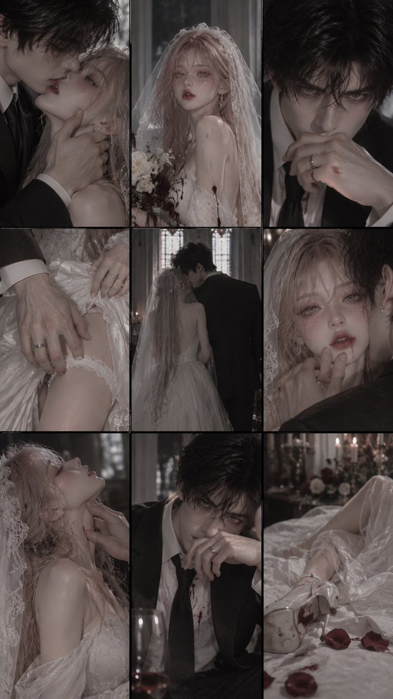

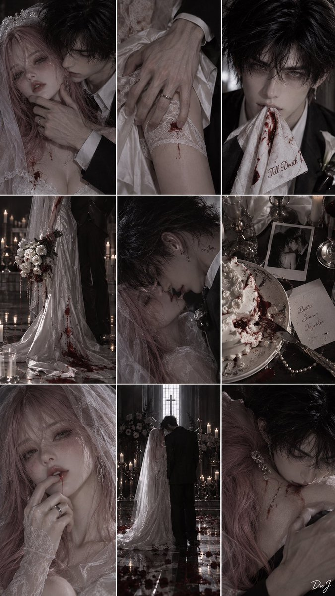

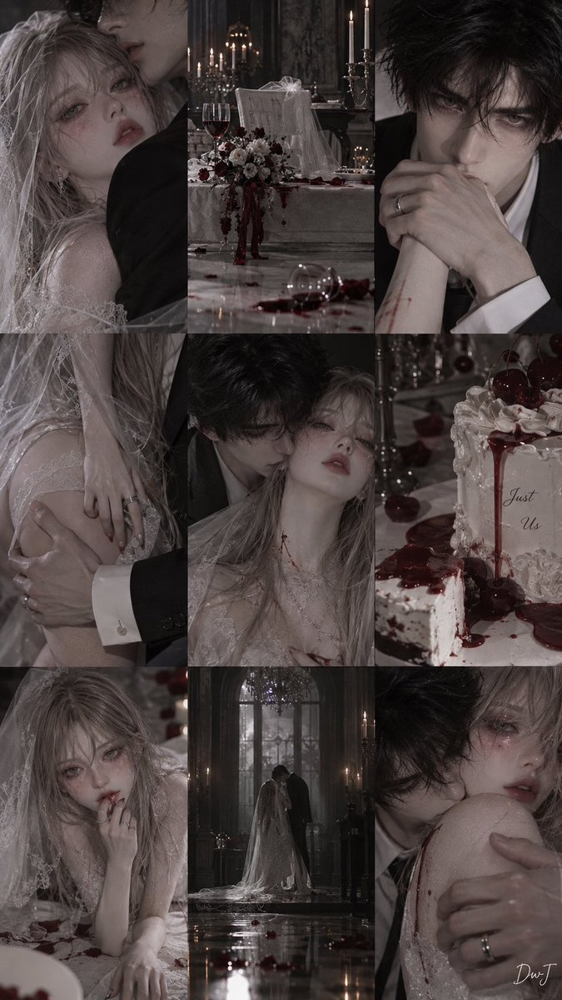

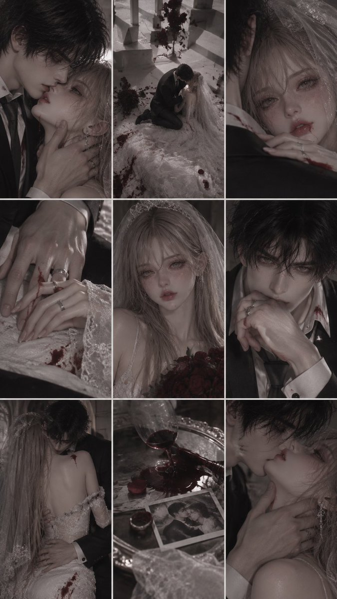

**Prompt**

```text
Boda x cine de moda minimalista en gris frío × una pizca de anomalía sangrienta, 3x3, 9:16
```

[↑ Volver a categorías](#catalog)

---

<a name="prompt-2101248200787320961"></a>

### Prompt de video secuenciado de 30 segundos de una joven que corre por una ciudad plegada e invertida al estilo de Inception para entregar un sobre amarillo al atardecer en la Venecia de 1940.

Autor：[@oggii\_0](https://x.com/oggii_0) · [Publicación original](https://x.com/oggii_0/status/2101248200787320961)

Cine / Fotograma · Personaje · Arquitectura / Interiores · Paisaje urbano / Calle · Publicado

**Resumen:** Prompt de video secuenciado de 30 segundos de una joven que corre por una ciudad plegada e invertida al estilo de Inception para entregar un sobre amarillo al atardecer en la Venecia de 1940.

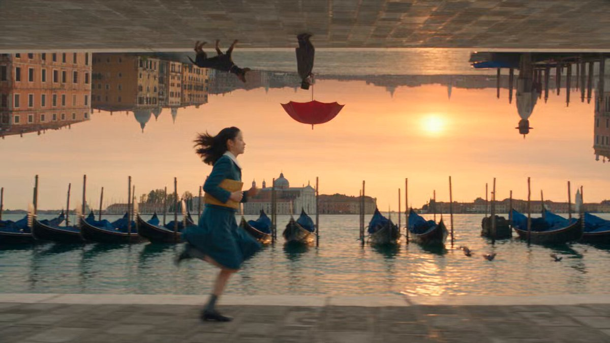

**Prompt**

```text
[PERSONAJE Y ESTILO]

<<<image_1>>> es la referencia de rostro e identidad. Una joven coreana de veintitantos años con EXACTAMENTE el rostro de <<<image_1>>>: la misma estructura facial, los mismos rasgos, piel coreana natural, sin anteojos. Cabello negro y largo, vestida con un vestido-abrigo de lana azul verdoso estilo años 40 con cuello blanco, un bolso de cuero marrón cruzado, calcetas grises hasta la rodilla, zapatos de cuero negro, sosteniendo un sobre amarillo doblado. Cada toma de ella coincide con <<<image_1>>>.

Venecia en los años 40 durante la hora dorada. Gradación cinematográfica ámbar y verde azulado, estética de película anamórfica de 35 mm, profundidad de campo reducida, rayos crepusculares volumétricos, grano de película fino. Arquitectura plegable al estilo de Inception: la ciudad veneciana se curva hacia arriba y cuelga invertida en las alturas como un techo espejado. La mujer siempre permanece bajo gravedad normal mientras el mundo se pliega a su alrededor. Movimiento continuo de cámara, sin cortes bruscos.

[LÍNEA DE TIEMPO DEL PROMPT]

0–3s: Plano de seguimiento lateral a lo largo de un muelle de piedra junto al Gran Canal al atardecer. La joven con el abrigo verde azulado corre a toda velocidad frente a la cámara, aferrando un sobre amarillo. Encima de ella, la ciudad entera cuelga invertida, reflejada; un hombre con bombín pasea a un perro salchicha por la calle invertida. Un paraguas rojo flota sin peso entre los dos mundos. Palomas se dispersan a través de la luz ámbar.

3–6s: La cámara la sigue por detrás hacia un estrecho callejón veneciano, con hojas secas arremolinándose tras su paso. En el extremo opuesto, la calle se curva verticalmente hacia el cielo, con edificios apilándose de forma vertical como una pared de ventanas. El eco de sus pasos resuena entre los muros de piedra.

6–9s: La cámara rueda lentamente 90 grados. La pared del callejón se convierte en el suelo bajo sus pies; ella sigue corriendo, imperturbable. El giro continúa en una órbita amplia mientras sube rápidamente una escalera de caracol de piedra que flota suspendida en el aire, con fragmentos de tejados venecianos de terracota rotando a su alrededor como un caleidoscopio.

9–12s: Silueta en plano general extremo. Corre sobre la parte superior de un puente de piedra arqueado sobre un amplio canal contra el resplandor del sol poniente. La ciudad espejada cuelga tanto por encima como por debajo del arco. En el plano invertido, un peatón solitario camina en dirección opuesta. Bandadas de aves cruzan el encuadre en cámara lenta.

12–15s: Plano contrapicado mirando directo hacia arriba entre dos muros imponentes de edificios, con el cielo reducido a una delgada y brillante franja. Ella salta a través del abismo vertical, con los brazos abiertos de par en par, el abrigo y el cabello ondeando al viento, la bandolera balanceándose. La cámara la mantiene en cuadro contra el cielo. El viento ruge con fuerza.

15–18s: Acercamiento cámara en mano a través de una concurrida calle del mercado de Rialto en los años 40: vendedores apilando cajones de manzanas, ropa tendida entre los edificios. Se desliza entre compradores desenfocados en primer plano, alejándose de la cámara. Una manzana suelta rueda por los adoquines.

18–21s: La cámara hace un paneo vertical hacia arriba sobre un majestuoso campanario de ladrillo —un campanile veneciano— mientras la ciudad circundante se pliega y se curva a su alrededor. La mujer se ve diminuta en la cornisa de la torre, hace una pausa contra el sol y luego salta hacia los tejados. Las campanas comienzan a sonar.

21–24s: Terraza jardín en la azotea enmarcada por un cenador cubierto de rosas. Una anciana con cárdigan gris riega un cantero de flores vivaces con una regadera de hojalata. Detrás de ella, Venecia y las cúpulas de la Basílica de San Marcos brillan al atardecer sobre la laguna mientras la ciudad invertida cuelga suspendida en lo alto. La joven camina en equilibrio a lo largo de la balaustrada de piedra con los brazos extendidos, y luego salta hacia la terraza.

24–27s: Ella le extiende el sobre amarillo. La anciana se voltea, apoya la regadera y lo toma. Ambas se sonríen cálidamente. Pétalos de rosa flotan hacia arriba pasando junto a ellas, cayendo hacia el cielo invertido.

27–30s: La cámara retrocede y asciende con rapidez. Toda la ciudad se pliega y rota hasta convertirse en una vista aérea cenital de los canales y calles de Venecia curvándose en una esfera. Las dos diminutas figuras permanecen en la terraza. Fundido lento a una luz cálida.
```

[↑ Volver a categorías](#catalog)

---

<a name="prompt-2100038053498917288"></a>

### Traducción en curso

Autor：[@AIVideoHub\_](https://x.com/AIVideoHub_) · [Publicación original](https://x.com/AIVideoHub_/status/2100038053498917288)

Cine / Fotograma · Publicado

**Resumen:** Traducción en curso


**Prompt**

```text
Traducción en curso
```

[↑ Volver a categorías](#catalog)

---

<a name="prompt-2098362443042803749"></a>

### Secuencia de acción cinematográfica de un asesino combatiendo contra caballeros templarios en una fortaleza de la Granada del siglo XV.

Autor：[@yourPlugAI](https://x.com/yourPlugAI) · [Publicación original](https://x.com/yourPlugAI/status/2098362443042803749)

Cine / Fotograma · Publicado

Publicación original：[@yourPlugAI](https://x.com/yourPlugAI) · [Publicación original](https://x.com/yourPlugAI/status/2097579893017989538)

**Resumen:** Secuencia de acción cinematográfica de un asesino combatiendo contra caballeros templarios en una fortaleza de la Granada del siglo XV.


**Prompt**

```text
En la Granada del siglo XV, un asesino solitario combate contra decenas de caballeros templarios de élite dentro de los muros de una inmensa fortaleza. Confiando en un taijutsu veloz como el rayo, aceleraciones explosivas y desvíos de espada precisos, transforma cada ataque enemigo en un contraataque demoledor. Una secuencia de acción de 30 segundos digna de una superproducción AAA de alto octanaje, impulsada por energía cinética pura, un seguimiento continuo de cámara IMAX y un impulso de combate implacable.
```

[↑ Volver a categorías](#catalog)

---

<a name="prompt-2097716825668702388"></a>

### Convierte las dos imágenes de referencia en un paisaje de viajes cinematográfico, impresionante y ultrarrealista, con un bucle de animación de atardecer fluido y continuo que combina elementos de Estambul y de un pueblo alpino europeo junto a un lago.

Autor：[@KrishnaBio1](https://x.com/KrishnaBio1) · [Publicación original](https://x.com/KrishnaBio1/status/2097716825668702388)

Cine / Fotograma · Paisaje / Naturaleza · Publicado

**Resumen:** Convierte las dos imágenes de referencia en un paisaje de viajes cinematográfico, impresionante y ultrarrealista, con un bucle de animación de atardecer fluido y continuo que combina elementos de Estambul y de un pueblo alpino europeo junto a un lago.


**Prompt**

```text
Convierte las dos imágenes de referencia en un paisaje de viajes cinematográfico, impresionante y ultrarrealista, con un bucle de animación de atardecer fluido y continuo.

ESCENA
Combina los elementos clave de ambas imágenes en un único destino de aspecto natural. Incluye la grandiosa mezquita de estilo otomano con múltiples minaretes y cúpulas, el paseo marítimo estilo Estambul y los barcos de la primera imagen, junto con el apacible lago alpino, el colorido pueblo europeo, las espectaculares montañas cubiertas de nieve y el hermoso castillo de piedra en la cima de la colina de la segunda imagen.

Crea una amplia vista panorámica frente al agua con arquitectura histórica de un lado y el castillo y las montañas del otro. Añade flores coloridas, árboles verdes, plantas mediterráneas, un farol vintage y una elegante terraza con una pequeña mesa de café en primer plano.

ATARDECER E ILUMINACIÓN
Hermoso atardecer de hora dorada con nubes en tonos azul pastel, rosa, durazno y naranja. La cálida luz del sol ilumina la mezquita, el castillo, el pueblo, las montañas y los barcos. El lago refleja el atardecer, los edificios y las montañas con suaves ondas realistas y reflejos dorados.

ANIMACIÓN
Crea 16 fotogramas consecutivos de un bucle fluido y continuo. Anima únicamente movimientos sutiles del entorno: nubes desplazándose lentamente, suaves ondulaciones del agua, barcos balanceándose ligeramente, aves volando a lo lejos, flores y hojas de árboles moviéndose suavemente con la brisa, y un parpadeo tenue de velas/faroles.

Mantén la cámara completamente fija. Mantén la mezquita, el castillo, las montañas, las casas y todos los objetos principales perfectamente consistentes a lo largo de cada fotograma. El fotograma 16 debe hacer una transición suave de regreso al fotograma 1.

ESTILO
Fotografía de viajes cinematográfica ultrarrealista, anuncio de turismo de lujo, impresionante atmósfera de hora dorada, arquitectura realista, montañas detalladas, vegetación natural, hermosos reflejos en el agua, profundidad atmosférica, alto rango dinámico, colores ricos pero naturales, fotografía profesional, calidad fotorrealista 8K.

CÁMARA
Vista panorámica cinematográfica amplia, lente de 24 mm, cámara fija y estable, perspectiva natural, profundidad de campo realista, encuadre e iluminación consistentes en todos los fotogramas.

AJUSTES DE ANIMACIÓN
16 fotogramas, bucle completo de aproximadamente 2.2 segundos, animación GIF continua y fluida, sin movimiento de cámara, sin parpadeos.

PROMPT NEGATIVO
caricatura, anime, pintura, CGI, render 3D, baja calidad, edificios distorsionados, mezquita deformada, minaretes torcidos, castillo malformado, montañas distorsionadas, barcos duplicados, objetos flotantes, reflejos poco realistas, agua falsa, niebla excesiva, colores sobresaturados, HDR extremo, imagen borrosa, desenfoque de movimiento, vibración de cámara, zoom, parpadeo, edificios mutantes, arquitectura cambiante, objetos que desaparecen, aves duplicadas, nubes poco naturales, costuras de imagen, collage visible, texto, logotipo, marca de agua, borde, barras negras, artefactos.
```

[↑ Volver a categorías](#catalog)

---

<a name="prompt-2101961501955571892"></a>

### Creación de un retrato grupal cinematográfico de celebridades de diversas épocas en una lujosa terraza al atardecer.

Autor：[@IqrasaifiAI](https://x.com/IqrasaifiAI) · [Publicación original](https://x.com/IqrasaifiAI/status/2101961501955571892)

Cine / Fotograma · Retrato / Selfie · Grupo / Pareja · Paisaje / Naturaleza · Publicado

**Resumen:** Creación de un retrato grupal cinematográfico de celebridades de diversas épocas en una lujosa terraza al atardecer.

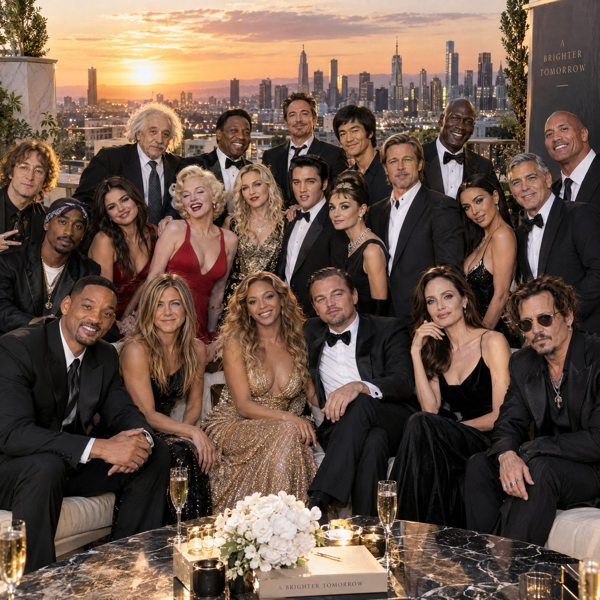

**Prompt**

```text
Crea una imagen hiperrealista, ultranítida y a todo color en gran formato, que muestre a un enorme grupo de celebridades de diferentes épocas reunidas en una única escena amplia y cinematográfica. La imagen debe verse como una portada editorial perfectamente fotografiada: con iluminación impecable, texturas de piel realistas y los detalles más finos de cabello, poros, reflejos y fibras de tela. ESTILO GENERAL Y AMBIENTE: Fotorrealista, 8K, poca profundidad de campo, luz de relleno natural y suave combinada con una fuerte luz de contorno dorada. Alto rango dinámico y gradación de color afinada con precisión. Tonos de piel de aspecto natural y precisos. Detalles de tela nítidos donde incluso las fibras individuales son visibles. Composición equilibrada y centrada con un lente de 35 mm ligeramente gran angular. Todas las celebridades interactúan de manera natural entre sí, sonriendo, posando o conversando. El fondo se mantiene visualmente tranquilo y libre de distracciones innecesarias, pero ofrece suficientes detalles para que el entorno parezca auténtico y realista. EL ENTORNO: Una lujosa terraza al aire libre al atardecer con vista al horizonte de una metrópolis moderna. Elementos: Luz cálida y dorada que enmarca las siluetas de las personas. Superficies de mármol pulido.
```

[↑ Volver a categorías](#catalog)

---

<a name="prompt-2100839251294446037"></a>

### Retrato cinematográfico de un personaje femenino con corte bob púrpura atándose los zapatos en unas ruinas rodeada de humo naranja.

Autor：[@Wareenaa](https://x.com/Wareenaa) · [Publicación original](https://x.com/Wareenaa/status/2100839251294446037)

Cine / Fotograma · Retrato / Selfie · Personaje · Artículo de moda · Publicado

**Resumen:** Retrato cinematográfico de un personaje femenino con corte bob púrpura atándose los zapatos en unas ruinas rodeada de humo naranja.


**Prompt**

```text
Crea un retrato cinematográfico de cuerpo completo hiperrealista del mismo personaje femenino adulto joven de la imagen de referencia, conservando su apariencia distintiva: corte bob recto a la altura de la barbilla de color violeta púrpura intenso con flequillo suave, piel de porcelana clara, pecas naturales en la nariz y las mejillas, ojos almendrados de color avellana/marrón claro, nariz pequeña y recta, rasgos faciales delicados, labios naturales brillantes y complexión delgada.

Está sentada en una silla de madera rústica, con una rodilla levantada hacia el pecho mientras sostiene y ajusta la agujeta de su pie elevado. Se inclina ligeramente hacia adelante con la cabeza ladeada hacia la cámara y una expresión tranquila y relajada. Viste una camiseta holgada de manga corta de color verde oliva de gran tamaño, jeans de mezclilla azul claro con los dobladillos enrollados, tenis de lona oscura estilo Converse con suelas blancas, gafas de armazón redondo negro y una pequeña bolsa cruzada/cangurera beige.

Ambienta la escena al aire libre entre ruinas de piedra y ladrillo desgastadas por el tiempo, con un antiguo arco de piedra que enmarca la composición, plantas secas y follaje en primer plano, y la silla de madera apoyada sobre un suelo de tierra natural. Llena el fondo con un espeso humo de color naranja claro y melocotón que cree una bruma dramática y de ensueño.

Utiliza una iluminación natural suave y temperamental con tonos cálidos de humo pastel, sombras realistas, profundidad de campo cinematográfica, piel y cabello detallados, texturas auténticas de mezclilla y tela, neblina atmosférica, calidad fotorrealista, 8K ultradetallado, fotografía editorial de primera calidad, estética rústica de ensueño.
```

[↑ Volver a categorías](#catalog)

---

<a name="prompt-2097676144141312095"></a>

### Prompt de retrato cinematográfico oscuro con estética de videojuego de terror psicológico, que retrata a una mujer con misteriosas runas en el rostro, manchas de polvo y rasguños.

Autor：[@her19845](https://x.com/her19845) · [Publicación original](https://x.com/her19845/status/2097676144141312095)

Cine / Fotograma · Retrato / Selfie · Personaje · Publicado

**Resumen:** Prompt de retrato cinematográfico oscuro con estética de videojuego de terror psicológico, que retrata a una mujer con misteriosas runas en el rostro, manchas de polvo y rasguños.


**Prompt**

```text
**Estilo:** Fotografía cinematográfica oscura y dramática con una estética de videojuego de terror psicológico de alta gama.

**Sujeto:** La modelo incluida en la extensión de imagen. Su piel muestra texturas detalladas de suciedad, polvo y sutiles rasguños. En su mejilla son visibles finas marcas grabadas o misteriosas runas verticales.

**Iluminación y color:** Una paleta de colores monocromática y sombría dominada por verde esmeralda oscuro, oliva y sombras profundas. La iluminación lateral esculpe el rostro, dejando la mitad de la escena en la oscuridad.

**Texturas:** Pronunciado grano de película analógica, poros detallados, una atmósfera polvorienta, inquietante y claustrofóbica.
```

[↑ Volver a categorías](#catalog)

---

<a name="prompt-2097222942438649948"></a>

### Plantilla de prompt para una tarjeta de viaje sostenida en la mano que muestra un paisaje de destino en 3D en miniatura.

Autor：[@Goodmanprotocol](https://x.com/Goodmanprotocol) · [Publicación original](https://x.com/Goodmanprotocol/status/2097222942438649948)

Cine / Fotograma · Renderizado 3D · Paisaje / Naturaleza · Publicado

**Resumen:** Plantilla de prompt para una tarjeta de viaje sostenida en la mano que muestra un paisaje de destino en 3D en miniatura.


**Prompt**

```text
Crea una fotografía de viaje vertical 4:5 cinemática y ultrarrealista de una tarjeta de viaje elegante y minimalista sostenida de forma natural en una mano contra un cielo expansivo.

Usa [NOMBRE DEL PAÍS] como el enfoque creativo. Transforma la tarjeta en una ventana viva hacia el destino, con un impresionante mundo aéreo en miniatura que emerge a la perfección desde su superficie. Muestra el monumento más emblemático del país, rodeado de paisajes auténticos, arquitectura, atmósfera y detalles sutiles exclusivos del destino.

Haz que la transición entre la tarjeta física y el mundo en miniatura sea perfecta, mágica y físicamente creíble, como si todo el destino existiera dentro de la tarjeta.

Integra [NOMBRE DEL PAÍS] en una tipografía elegante y en mayúsculas audaces como parte del diseño de la tarjeta.

Utiliza luz natural cinematográfica, texturas realistas, profundidad atmosférica, reflejos sutiles, perspectiva dramática, suave desenfoque de lente y una estética de fotografía de viajes editorial de primera calidad.

Ultrafotorrealista, detalle 8K, gradación de color cinematográfica, piel y materiales realistas, iluminación físicamente precisa, lujoso, emotivo, aspiracional, universalmente hermoso. Sin caricaturas, sin ilustraciones, sin apariencia de CGI artificial.
```

[↑ Volver a categorías](#catalog)

---

<a name="prompt-2096808538534514913"></a>

### Retrato cinematográfico de un hombre con un suéter beige con cálida luz dorada de borde contra un fondo sombrío.

Autor：[@iamsofiaijaz](https://x.com/iamsofiaijaz) · [Publicación original](https://x.com/iamsofiaijaz/status/2096808538534514913)

Cine / Fotograma · Retrato / Selfie · Personaje · Resumen / Antecedentes · Publicado

**Resumen:** Retrato cinematográfico de un hombre con un suéter beige con cálida luz dorada de borde contra un fondo sombrío.


**Prompt**

```text
Retrato cinematográfico fotorrealista de un hombre adulto atractivo con cabello castaño despeinado de longitud media y una barba bien recortada, vistiendo un suave suéter de punto beige de cuello redondo. Mira hacia la cámara con una expresión tranquila, segura y ligeramente contemplativa. Una cálida iluminación dorada de borde crea un halo brillante alrededor de su cabello y hombros, con una fuerte luz principal suave que ilumina su rostro. Fondo oscuro y temperamental con una sutil bruma ámbar y humo atmosférico, iluminación dramática de alto contraste, textura de piel natural, ojos nítidos, detalles faciales realistas, profundidad de campo baja, fotografía de estudio profesional, lente de retrato de 85 mm, f/1.8, bokeh cremoso, gradación de color cinematográfica cálida, estética editorial de lujo, ultradetallado, fotorrealista, 8K.
```

[↑ Volver a categorías](#catalog)

---

<a name="category-anime-manga"></a>

## Anime / Manga

<a name="prompt-2101988472164884652"></a>

### Prompt de generación de imágenes que reúne a unos 200 personajes 2D numerados, al estilo del anuario de graduación de una escuela gigantesca en una ciudad académica.

Autor：[@oodate](https://x.com/oodate) · [Publicación original](https://x.com/oodate/status/2101988472164884652)

Anime / Manga · Ilustración · Personaje · Publicado

Publicación original：[@MUucwYWSWUsvy3J](https://x.com/MUucwYWSWUsvy3J) · [Publicación original](https://x.com/MUucwYWSWUsvy3J/status/2101922715569639612)

**Resumen:** Prompt de generación de imágenes que reúne a unos 200 personajes 2D numerados, al estilo del anuario de graduación de una escuela gigantesca en una ciudad académica.

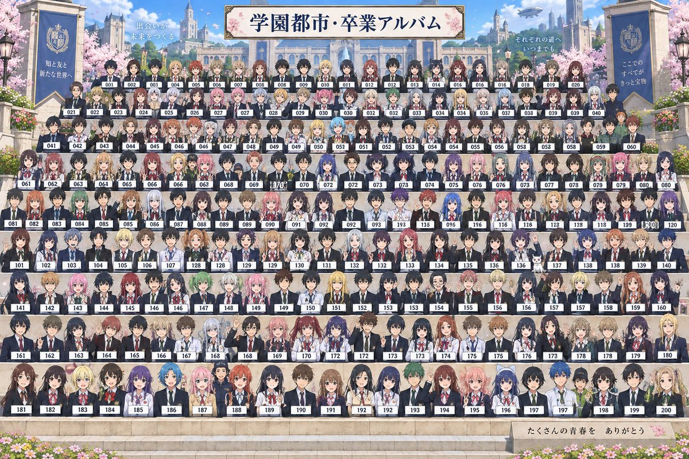

**Prompt**

```text
Mete tantos personajes 2D como quepan hasta que todavía se puedan distinguir las caras, estilo anuario de graduación, al ser una ciudad académica es una escuela gigantesca, ponles números para que sea fácil contarlos, es una prueba de rendimiento extremo para image2.5
```

[↑ Volver a categorías](#catalog)

---

<a name="prompt-2097834253748949105"></a>

### Un prompt para dibujar a Chiikawa y Usagi en el estilo gekiga dramático de JoJo.

Autor：[@namatorihamu](https://x.com/namatorihamu) · [Publicación original](https://x.com/namatorihamu/status/2097834253748949105)

Anime / Manga · Ilustración · Publicado

**Resumen:** Un prompt para dibujar a Chiikawa y Usagi en el estilo gekiga dramático de JoJo.


**Prompt**

```text
Muestra a Chiikawa y Usagi al estilo de JoJo
```

[↑ Volver a categorías](#catalog)

---

<a name="prompt-2099334317306761376"></a>

### El prompt instruye la generación de un retrato de medios mixtos que combina a una persona realista con una sombra en doodle estilo manga exagerada que imita su pose.

Autor：[@itxsarmadd](https://x.com/itxsarmadd) · [Publicación original](https://x.com/itxsarmadd/status/2099334317306761376)

Anime / Manga · Retrato / Selfie · Personaje · Publicado

**Resumen:** El prompt instruye la generación de un retrato de medios mixtos que combina a una persona realista con una sombra en doodle estilo manga exagerada que imita su pose.


**Prompt**

```text
Usa la imagen de referencia subida como referencia estricta de identidad y atuendo. Conserva el rostro, los rasgos faciales, el tono de piel, el peinado, el color de cabello, los accesorios, el atuendo y la vibra general exactamente como se muestra.
Crea un retrato de medios mixtos vertical (4:5 o 9:16) de alta calidad que incluya:
Una versión realista de cuerpo entero de la persona. Una sombra tipo doodle dibujada a mano en color negro de la misma persona en la pared junto a ella.

La persona real debe verse tierna, ligeramente avergonzada, juguetona y copiando de forma natural una nueva pose traviesa al azar en cada generación. La sombra en doodle debe realizar la misma idea de pose de una manera mucho más exagerada, caótica y caricaturesca, con líneas de movimiento estilo manga, estrellas, corazones y destellos.

Usa una pared de estudio limpia de color blanco/crema, fondo minimalista, iluminación natural suave y mantén ambas figuras completamente visibles. El doodle debe parecerse claramente a la persona real a través del peinado, los accesorios, la silueta del atuendo y la pose.

Negative Prompt: outfit changes, identity changes, realistic second person, normal shadow, horror, anime human, cluttered background, repeated pointing or finger-gun poses, stiff pose, extra limbs/fingers, distorted body, text, watermark, logo, AI artifacts.
```

[↑ Volver a categorías](#catalog)

---

<a name="category-illustration"></a>

## Ilustración

<a name="prompt-2102328812386287750"></a>

### Traducción en curso

Autor：[@DeepBlueX0](https://x.com/DeepBlueX0) · [Publicación original](https://x.com/DeepBlueX0/status/2102328812386287750)

Infografía / Visual educativo · Ilustración · Diagrama / Gráfico · Publicado

Publicación original：[@DeepBlueX0](https://x.com/DeepBlueX0) · [Publicación original](https://x.com/DeepBlueX0/status/2097660427216036207)

**Resumen:** Traducción en curso

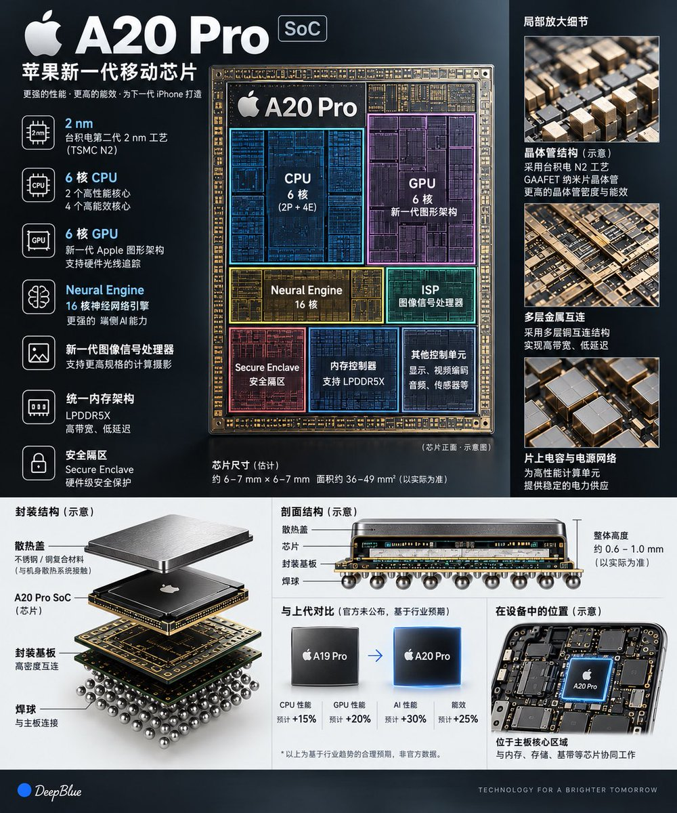


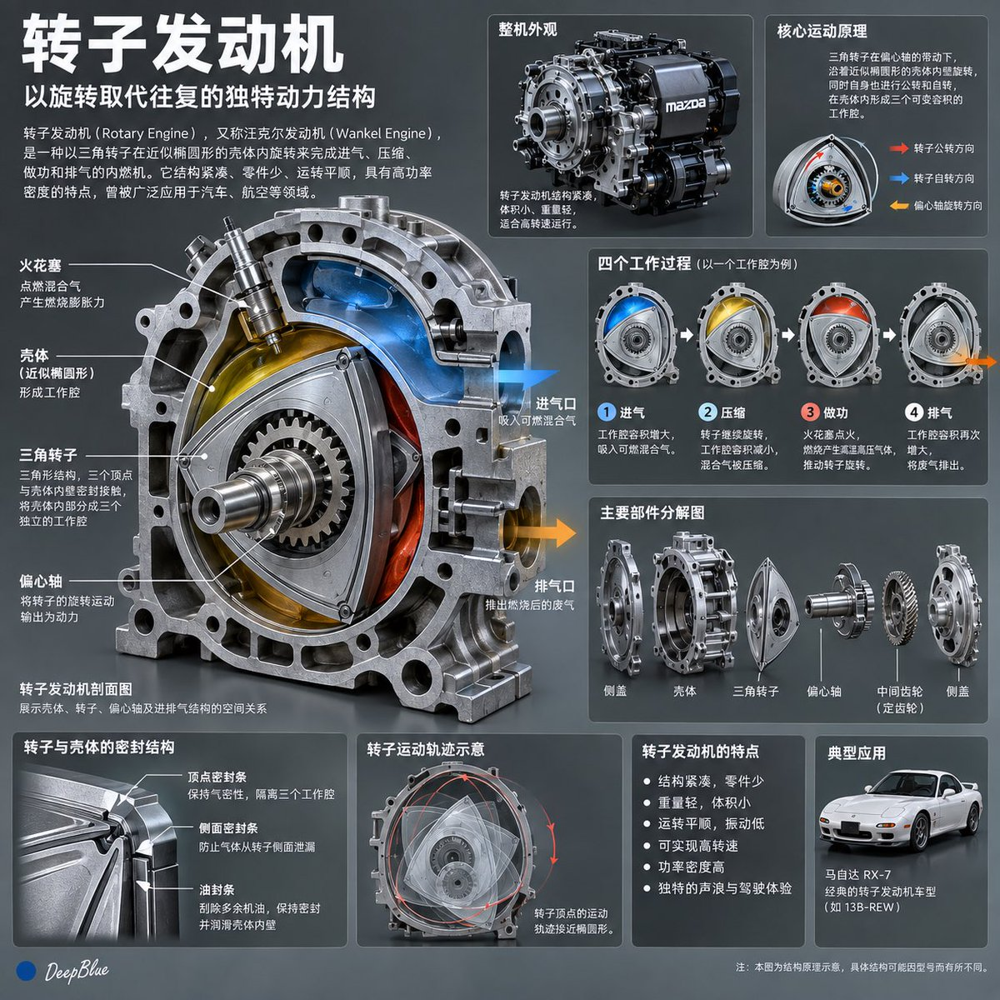


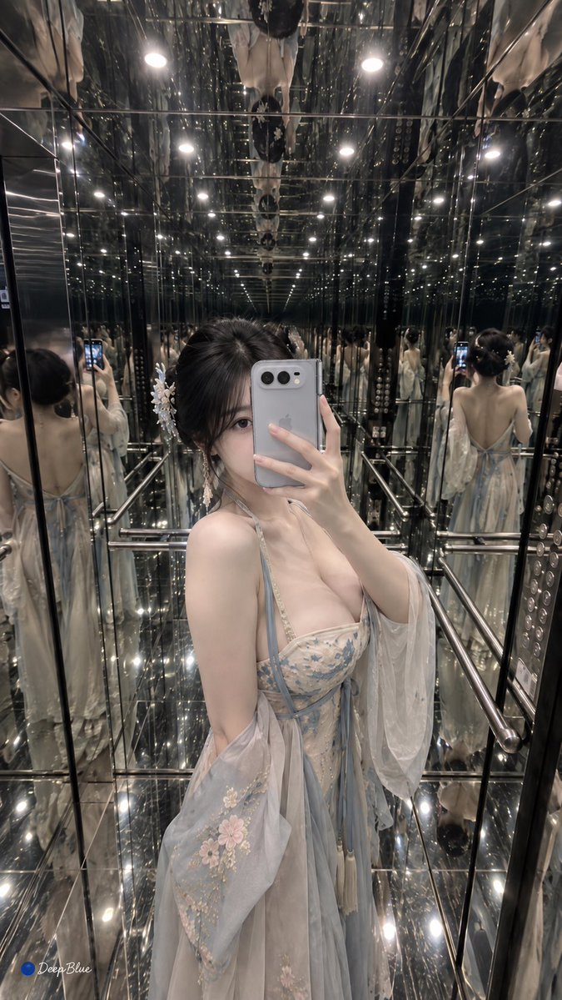

**Prompt**

```text
Traducción en curso
```

[↑ Volver a categorías](#catalog)

---

<a name="prompt-2097713691433070629"></a>

### Petición a ChatGPT para que dibuje un autorretrato con una placa de identificación que indique su número de versión.

Autor：[@Tz\_2022](https://x.com/Tz_2022) · [Publicación original](https://x.com/Tz_2022/status/2097713691433070629)

Ilustración · Retrato / Selfie · Publicado

**Resumen:** Petición a ChatGPT para que dibuje un autorretrato con una placa de identificación que indique su número de versión.


**Prompt**

```text
Dibuja un autorretrato tuyo, con una placa de identificación, y que la placa de identificación tenga tu número de versión
```

[↑ Volver a categorías](#catalog)

---

<a name="prompt-2097521286436065680"></a>

### Generar un examen maquetado al estilo del CET-4 de inglés, ilustrado con textos e imágenes, cuyo contenido de preguntas esté combinado con temas del examen de la función pública.

Autor：[@Tz\_2022](https://x.com/Tz_2022) · [Publicación original](https://x.com/Tz_2022/status/2097521286436065680)

Ilustración · Texto / Tipografía · Publicado

Publicación original：[@Lonely\_\_MH](https://x.com/Lonely__MH) · [Publicación original](https://x.com/Lonely__MH/status/2097494755752202574)

**Resumen:** Generar un examen maquetado al estilo del CET-4 de inglés, ilustrado con textos e imágenes, cuyo contenido de preguntas esté combinado con temas del examen de la función pública.


**Prompt**

```text
Diseña un examen con el formato del CET-4 de inglés, pero donde todas las preguntas sean de exámenes de la función pública (oposiciones), profusamente ilustrado con textos e imágenes
```

[↑ Volver a categorías](#catalog)

---

<a name="prompt-2101196922715250752"></a>

### Ilustración editorial contemporánea de una chica japonesa con formas simplificadas y espacio negativo.

Autor：[@miyajin333](https://x.com/miyajin333) · [Publicación original](https://x.com/miyajin333/status/2101196922715250752)

Ilustración · Personaje · Publicado

**Resumen:** Ilustración editorial contemporánea de una chica japonesa con formas simplificadas y espacio negativo.

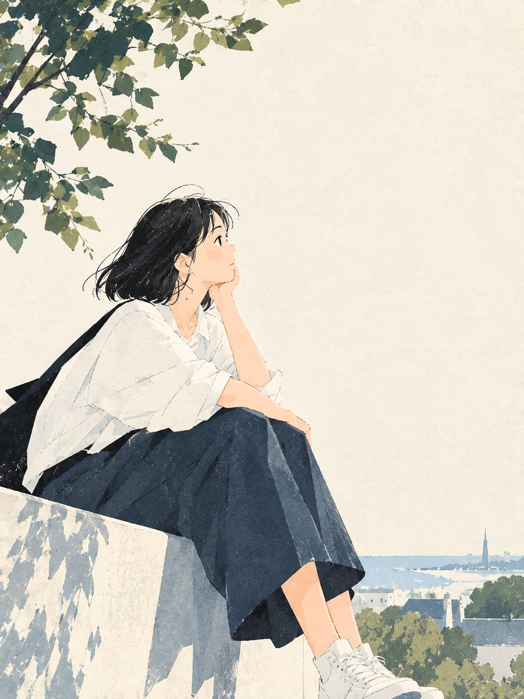

**Prompt**

```text
Tema: Chica japonesa
Estilo: Ilustración editorial contemporánea, formas conceptuales y simplificadas, proporciones expresivas, paleta de colores limitada y sofisticada, espacio negativo audaz, texturas sutiles, formas geométricas ligeramente distorsionadas, simplicidad visual intelectual, ilustración moderna de estilo revista, esquema de color análogo, relación de aspecto 3:4.
```

[↑ Volver a categorías](#catalog)

---

<a name="category-sketch-line-art"></a>

## Boceto / Arte lineal

<a name="prompt-2101315631237021853"></a>

### Una plantilla de prompt para crear pósteres de bocetos arquitectónicos minimalistas de estilo vintage que presentan monumentos emblemáticos con detalles geométricos y tipografía.

Autor：[@Naiknelofar788](https://x.com/Naiknelofar788) · [Publicación original](https://x.com/Naiknelofar788/status/2101315631237021853)

Póster / Volante · Boceto / Arte lineal · Retro / Vintage · Minimalismo · Arquitectura / Interiores · Texto / Tipografía · Publicado

**Resumen:** Una plantilla de prompt para crear pósteres de bocetos arquitectónicos minimalistas de estilo vintage que presentan monumentos emblemáticos con detalles geométricos y tipografía.

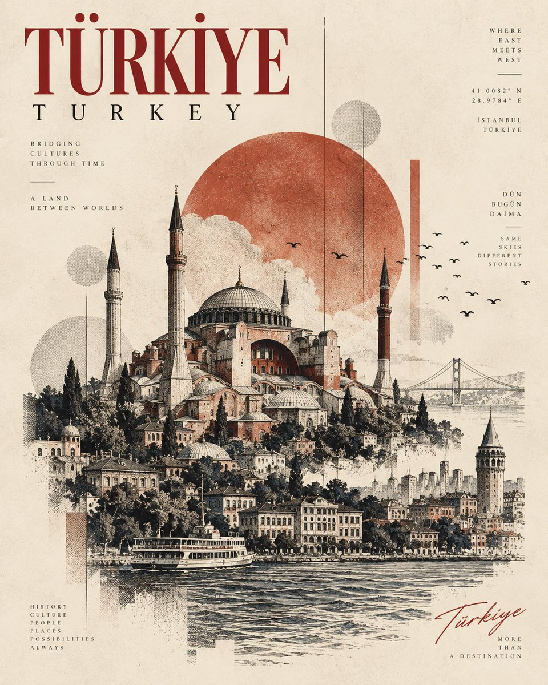

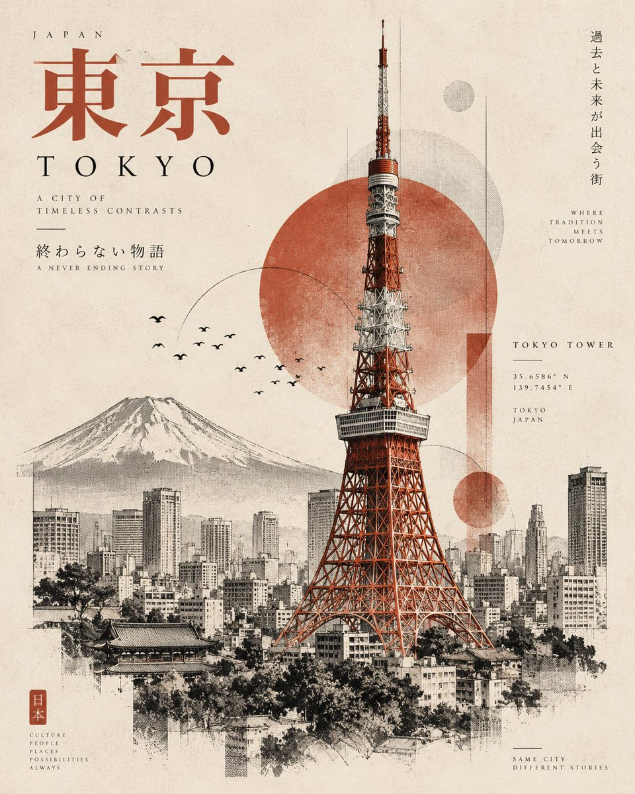

**Prompt**

```text
Un sofisticado póster de arte arquitectónico minimalista que presenta [LANDMARK / STRUCTURE] como sujeto central, ilustrado en un refinado estilo de boceto arquitectónico dibujado a mano. Conserva la silueta reconocible del punto de referencia, sus proporciones y detalles arquitectónicos distintivos, mientras lo transforma en una elegante composición artística.

Utiliza una paleta de colores monocromática y limitada inspirada en la ubicación, con tonos vintage suaves sobre un fondo de papel blanco cálido/marfil. Combina delicadas líneas de tinta, fino sombreado arquitectónico, una sutil textura de semitono y detalles de impresión ligeramente desgastados.

Rodea la estructura con unas pocas formas geométricas abstractas, círculos suaves y translúcidos, sutiles elementos atmosféricos, aves o diminutos detalles contextuales que complementen el monumento sin sobrecargarlo. Añade una sutil sensación de profundidad mediante capas superpuestas y líneas desvanecidas.

Incluye tipografía minimalista pequeña en un lado: [CITY / COUNTRY], [LANDMARK NAME] y coordenadas opcionales o un breve descriptor de la ubicación, dispuestos como una impresión de arte de viaje premium.

Espacio negativo limpio, diseño gráfico editorial, estética de póster de viaje con calidad de museo, composición elegante, lujo discreto, textura vintage de serigrafía, ilustración arquitectónica artística, sin personas, sin fondo fotorrealista, sin objetos innecesarios, composición vertical de 4:5.

[LANDMARK] reinventado como un póster coleccionable de arte de viaje minimalista, que combina bocetos arquitectónicos, grabado vintage, formas geométricas abstractas, trazos delicados, textura de medios tonos, colores apagados inspirados en la ubicación y un elegante espacio negativo. El monumento sigue siendo reconocible al instante, pero se siente como una pieza artesanal de arte gráfico moderno. Añade aves diminutas, sutiles elementos ambientales, coordenadas y tipografía de ubicación minimalista. Estética editorial premium, artística, sofisticada, muy compartible, vertical de 4:5.
```

[↑ Volver a categorías](#catalog)

---

<a name="prompt-2097284686448046135"></a>

### Prompt para generar bocetos arquitectónicos minimalistas dibujados a mano de diario de viaje sobre papel marfil.

Autor：[@Naiknelofar788](https://x.com/Naiknelofar788) · [Publicación original](https://x.com/Naiknelofar788/status/2097284686448046135)

Boceto / Arte lineal · Arquitectura / Interiores · Publicado

**Resumen:** Prompt para generar bocetos arquitectónicos minimalistas dibujados a mano de diario de viaje sobre papel marfil.


**Prompt**

```text
Crea una obra arquitectónica minimalista dibujada a mano de [STRUCTURE] sobre papel marfil cálido. Muestra la estructura como un boceto en tinta simple y elegante con líneas limpias e imperfectas, sombreado sutil a lápiz, pequeñas anotaciones manuscritas y algunos delicados detalles arquitectónicos. Mantén la composición aireada con abundante espacio en blanco, tonos tierra apagados, suave textura de papel y una auténtica sensación artesanal de diario de viaje. Sin fotorrealismo, sin detalles pesados, sin saturación: simple, artístico y refinado.
```

[↑ Volver a categorías](#catalog)

---

<a name="prompt-2096902953110299096"></a>

### El prompt transforma una foto de referencia en un póster vertical 50/50, combinando la foto original arriba con un boceto a lápiz de color y acuarela abajo.

Autor：[@MissDelulu9](https://x.com/MissDelulu9) · [Publicación original](https://x.com/MissDelulu9/status/2096902953110299096)

Póster / Volante · Boceto / Arte lineal · Acuarela · Publicado

**Resumen:** El prompt transforma una foto de referencia en un póster vertical 50/50, combinando la foto original arriba con un boceto a lápiz de color y acuarela abajo.


**Prompt**

```text
Crea un póster vertical premium de diario de viajes con una división exacta de 50/50.

50% superior: Mantén la foto de referencia original completamente real y sin cambios, con la misma composición, arquitectura, personas, colores, iluminación, perspectiva y detalles.

50% inferior: Transforma la misma foto en un delicado boceto a mano con lápices de colores y acuarela sobre papel crema cálido, con trazos visibles de lápiz, aguadas suaves, textura sutil de papel, contornos imperfectos y un suave tramado cruzado. Mantén reconocible cada sujeto.

Agrega un elegante texto manuscrito: “A Beautiful Day” arriba y “Memories to Keep” abajo. Estética minimalista, nostálgica y sofisticada de revista de viajes. Sin objetos adicionales, sin fotorrealismo en la mitad inferior, diseño exacto de 50/50.
```

[↑ Volver a categorías](#catalog)

---

<a name="prompt-2097176979497791899"></a>

### El prompt transforma fotos en un póster de arte editorial con estilo de boceto en técnica mixta y diseño minimalista.

Autor：[@saniaspeaks\_](https://x.com/saniaspeaks_) · [Publicación original](https://x.com/saniaspeaks_/status/2097176979497791899)

Póster / Volante · Boceto / Arte lineal · Publicado

**Resumen:** El prompt transforma fotos en un póster de arte editorial con estilo de boceto en técnica mixta y diseño minimalista.


**Prompt**

```text
Crea un póster de arte editorial prémium para cada fotografía subida, tratando cada imagen como su propia composición independiente y sin fusionar nunca varias fotos entre sí. Utiliza un estricto formato vertical de 3:4 con el lienzo dividido en dos mitades horizontales perfectamente iguales: la mitad superior debe seguir siendo una presentación fiel y fotorrealista de la imagen original, conservando la identidad exacta del sujeto, los rasgos faciales, las proporciones, la pose, la vestimenta, los objetos, la composición, la iluminación, las sombras, el ambiente y los colores naturales, mejorada únicamente con una sofisticada gradación de color editorial y una extensión ambiental fluida donde sea necesario; la mitad inferior debe transformar la historia visual en una interpretación artística completamente diferente: una pequeña obra de arte hecha a mano en técnica mixta cuidadosamente compuesta y centrada dentro de un amplio espacio negativo de color marfil cálido, que no ocupe más del 10 al 20 % de la sección inferior, utilizando un boceto a tinta expresivo, campos de color estratificados similares al gouache, texturas sutiles de collage, bordes de papel rasgado, pinceladas imperfectas, fibras visibles, suaves variaciones de pigmento y encantadoras imperfecciones humanas, mientras conserva la silueta, el gesto, los objetos y la narrativa emocional más reconocibles de la foto original. Extrae hasta cuatro colores dominantes y armoniosos de cada fotografía y reinterprétalos en una paleta apagada y sofisticada. Añade solo tipografía editorial sutil ocasional cuando realmente mejore la composición, como un título poético, lugar, fecha o una sola palabra. El resultado general debe sentirse como la portada coleccionable de una publicación de arte contemporáneo: minimalista, poética, táctil, elegante, emocionalmente serena, visualmente distintiva e inconfundiblemente conectada con su fotografía original.
```

[↑ Volver a categorías](#catalog)

---

<a name="category-3d-render"></a>

## Renderizado 3D

<a name="prompt-2102084659458822632"></a>

### Contiene dos grupos de Prompts de renderizado 3D de hojas de arce de calidad de producto de lujo: el primer grupo es una hoja de arce de esmalte color zafiro con textura de vidrio líquido, accesorios de platino y una base de seda y perlas; el segundo grupo es una hoja de arce de cristal facetado geométrico / vidrio prismático, con un degradado holográfico de esmeralda y bordes dorados.

Autor：[@churvikv](https://x.com/churvikv) · [Publicación original](https://x.com/churvikv/status/2102084659458822632)

Renderizado 3D · Producto · Publicado

**Resumen:** Contiene dos grupos de Prompts de renderizado 3D de hojas de arce de calidad de producto de lujo: el primer grupo es una hoja de arce de esmalte color zafiro con textura de vidrio líquido, accesorios de platino y una base de seda y perlas; el segundo grupo es una hoja de arce de cristal facetado geométrico / vidrio prismático, con un degradado holográfico de esmeralda y bordes dorados.

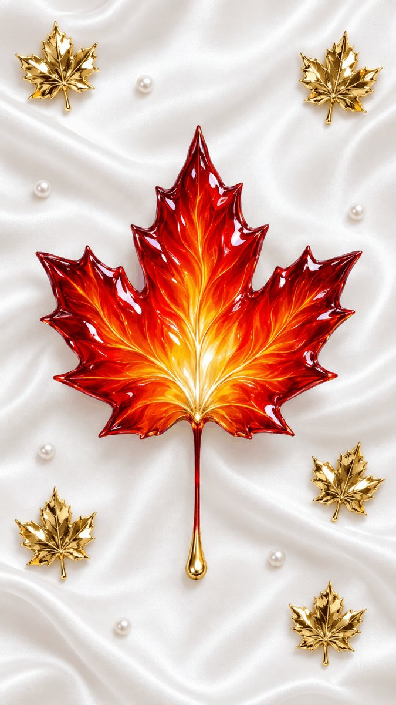

**Prompt**

```text
Una sola hoja de arce grande, brillante y de color azul zafiro, centrada y orientada verticalmente,

su superficie como vidrio líquido / esmalte de color: nervaduras arremolinadas en forma de llamas que brillan
desde un zafiro profundo en los bordes exteriores, pasando por azul real y azul celeste brillante, hasta
un blanco hielo en el centro, reflejos húmedos y ultrabrillantes, aspecto en relieve 3D,
un tallo delgado y fino que se estrecha hacia abajo y termina en una pequeña base de platino pulido.
Alrededor de ella, cerca de las esquinas, cinco hojas de arce de platino metálico más pequeñas con
superficies blanco plateadas brillantes pulidas a espejo y reflejos especulares nítidos.
Fondo: lujosa tela de seda satinada blanca con pliegues suaves y fluidos
y un sutil brillo sedoso; unas pequeñas cuentas de perlas brillantes esparcidas sobre la tela.
Iluminación de estudio suave y difusa desde arriba, estética elegante de toma de producto premium,
ultra detallado, renderizado 3D hiperrealista,
texto, letras, marca de agua, logotipo, firma, marco, borde, orlas ornamentadas,
hojas rojas adicionales, colores mate o apagados, aspecto de juguete de plástico, borroso, bajo nivel de detalle,
dibujo animado, 2D plano, sombras duras, desorden, fondo recargado

Prompt 2:
Una sola hoja de arce grande hecha de cristal tallado facetado / vidrio prismático, centrada

y orientada verticalmente, su superficie dividida en facetas triangulares geométricas afiladas
como una gema destrozada o un mosaico low-poly, recubierta con una película holográfica iridiscente
que cambia a través de verde esmeralda, cerceta, aguamarina, jade profundo y menta suave
según el ángulo. Finas nervaduras de oro pulido recorren la hoja siguiendo la
venación natural del arce, y varios paneles interiores están rellenos con una fina textura dorada punteada /
punteada. Un tallo delgado de oro pulido se estrecha hacia abajo, terminando en una pequeña
base dorada acampanada.
Alrededor de ella, cerca de las cuatro esquinas, cuatro hojas de arce más pequeñas en metal de oro blanco / champán pulido
con el mismo degradado holográfico esmeralda-cerceta y textura punteada dorada en su superficie.
Fondo: tela de seda satinada blanca con pliegues suaves y fluidos y un brillo sedoso;
cáusticas brillantes e iridiscentes de color verde, cerceta y menta, y reflejos de luz coloreada derramados
sobre la tela debajo de la hoja central.
Iluminación de estudio suave, brillante y difusa desde arriba, reflejos especulares intensos y nítidos,
estética de toma de producto de lujo premium, ultra detallado, renderizado 3D hiperrealista,
texto, letras, marca de agua, logotipo, firma, marco, borde, orlas ornamentadas,
superficies mates o apagadas, aspecto de juguete de plástico opaco, facetas borrosas, colores turbios,
2D plano, dibujo animado, sombras negras duras, fondo desordenado, polvo, rasguños
```

[↑ Volver a categorías](#catalog)

---

<a name="prompt-2100051568154538130"></a>

### Traducción en curso

Autor：[@DeepBlueX0](https://x.com/DeepBlueX0) · [Publicación original](https://x.com/DeepBlueX0/status/2100051568154538130)

Fotografía · Renderizado 3D · Personaje · Paisaje urbano / Calle · Publicado

Publicación original：[@DeepBlueX0](https://x.com/DeepBlueX0) · [Publicación original](https://x.com/DeepBlueX0/status/2099508984541769771)

**Resumen:** Traducción en curso


**Prompt**

```text
Traducción en curso
```

[↑ Volver a categorías](#catalog)

---

<a name="prompt-2097646788258021837"></a>

### Prompt de diorama de viaje en 3D en miniatura hecho a mano con monumentos urbanos icónicos sobre papel texturizado.

Autor：[@Naiknelofar788](https://x.com/Naiknelofar788) · [Publicación original](https://x.com/Naiknelofar788/status/2097646788258021837)

Renderizado 3D · Publicado

**Resumen:** Prompt de diorama de viaje en 3D en miniatura hecho a mano con monumentos urbanos icónicos sobre papel texturizado.


**Prompt**

```text
Crea una encantadora escena de viaje en miniatura hecha a mano que tenga a [ESTRUCTURA ICÓNICA] como punto focal principal.
Muestra el monumento como un diminuto modelo 3D hermosamente esculpido, con detalles suaves y redondeados, texturas artesanales, delicadas imperfecciones y una atmósfera caprichosa de cuento de hadas. Rodéalo de unos pocos elementos sutiles que representen su ubicación, tales como diminutos árboles, flores, calles, barcos, montañas, nubes u objetos locales, sin sobrecargar la escena.

Coloca todo sobre un fondo limpio de papel texturizado de color blanco cálido, con abundante y elegante espacio negativo. Añade una pequeña y elegante placa de viaje de madera o papel que contenga:

[NOMBRE DE LA ESTRUCTURA]
[CIUDAD, PAÍS]
Famoso por: [BREVE DATO ÚNICO]

Utiliza iluminación natural suave, sombras tenues, colores pastel pero realistas, profundidad de diorama en miniatura, texturas artesanales de arcilla/papel y una estética prémium y tierna de diario de viaje. Composición centrada, monumento con gran nivel de detalle, adorable pero sofisticado, diseño limpio y coleccionable de tarjeta de viaje, sin personas fotorrealistas, sin desorden.
```

[↑ Volver a categorías](#catalog)

---

<a name="prompt-2097580884098764800"></a>

### Crea un diorama 3D en miniatura tierno y de primera calidad de un monumento con texto de placa de recuerdo.

Autor：[@Naiknelofar788](https://x.com/Naiknelofar788) · [Publicación original](https://x.com/Naiknelofar788/status/2097580884098764800)

Renderizado 3D · Arquitectura / Interiores · Publicado

**Resumen:** Crea un diorama 3D en miniatura tierno y de primera calidad de un monumento con texto de placa de recuerdo.


**Prompt**

```text
Crea un diorama 3D en miniatura tierno y de primera calidad de [NOMBRE DE LA ESTRUCTURA], [CIUDAD, PAÍS]. Mantén el monumento reconocible, elegante y encantador, con una composición limpia, tonos pastel suaves, sutiles detalles artesanales, iluminación natural suave y una refinada estética de recuerdo de viaje.\n\nIncluye texto minimalista y de buen gusto:\n[NOMBRE DE LA ESTRUCTURA]\n[CIUDAD, PAÍS]\nFamoso por: [DESCRIPCIÓN CORTA]
```

[↑ Volver a categorías](#catalog)

---

<a name="prompt-2097587863139537262"></a>

### Captura de pantalla de juego en primera persona en la playa de un RPG romántico en 3D ficticio, que incluye a Morrigan Aensland y una interfaz de usuario HUD de juego completa.

Autor：[@underwoodxie96](https://x.com/underwoodxie96) · [Publicación original](https://x.com/underwoodxie96/status/2097587863139537262)

Diseño de aplicaciones / web · Renderizado 3D · Personaje · Publicado

Publicación original：[@underwoodxie96](https://x.com/underwoodxie96) · [Publicación original](https://x.com/underwoodxie96/status/2097554154554314891)

**Resumen:** Captura de pantalla de juego en primera persona en la playa de un RPG romántico en 3D ficticio, que incluye a Morrigan Aensland y una interfaz de usuario HUD de juego completa.


**Prompt**

```text
Por favor, captura una captura de pantalla realista de un juego de rol romántico de mundo abierto en 3D de próxima generación ficticio, presentado desde la perspectiva en primera persona del protagonista masculino. En la playa, Morrigan Aensland de Darkstalkers invita al protagonista a ayudarla a aplicarse protector solar. El estilo visual general debe presentar personajes en 3D renderizados con sombreado de estilo caricatura de alta calidad combinados con gráficos al nivel de Unreal Engine 5, logrando una fidelidad visual con calidad AAA. Debe incluir un modelado de personajes ultra detallado, sombreado de piel realista, iluminación cinematográfica, materiales PBR, texturas de ropa de alta precisión y entornos de aula finamente renderizados. La imagen final debe parecer una captura de pantalla real de un juego jugable, incluyendo una interfaz de usuario completa del juego: minimapa, visualización de misiones, barras de estado de los personajes, avisos de interacción, subtítulos de diálogo, elementos del HUD y más.
```

[↑ Volver a categorías](#catalog)

---

<a name="prompt-2097704623952035841"></a>

### Plantilla de prompt para generar mapas de recuerdo coleccionables en miniatura 3D de países que destacan ciudades y monumentos específicos.

Autor：[@Naiknelofar788](https://x.com/Naiknelofar788) · [Publicación original](https://x.com/Naiknelofar788/status/2097704623952035841)

Renderizado 3D · Publicado

**Resumen:** Plantilla de prompt para generar mapas de recuerdo coleccionables en miniatura 3D de países que destacan ciudades y monumentos específicos.


**Prompt**

```text
Crea un encantador mapa en miniatura 3D de [COUNTRY] con las fronteras nacionales claramente delimitadas y de forma precisa. Coloca un pin de ubicación grande y elegante exactamente en [CITY], con [ICONIC LANDMARK] elevándose desde el mapa en la ubicación del pin. Agrega diminutas carreteras, montañas, ríos, edificios, árboles y sutiles detalles culturales dentro del país. Haz que el mapa esté ligeramente en relieve y tenga aspecto escultural, con terreno en capas, sombras suaves, bordes redondeados y texturas de miniatura artesanal. Utiliza una paleta refinada inspirada en [COUNTRY], fondo marfil cálido, iluminación suave de estudio y una composición limpia y prémium. Agrega un texto elegante: “[CITY]” y debajo “[COUNTRY] • [FAMOUS FOR]”. Estética de recuerdo de viaje en 3D coleccionable, linda, sofisticada y altamente reconocible.
```

[↑ Volver a categorías](#catalog)

---

<a name="category-pixel-art"></a>

## Pixel Art

<a name="prompt-2100265645103612367"></a>

### Prompt para generar una hoja de sprites de acción en pixel art 2D de 4x4 y 16 fotogramas del monstruo de haba &quot;Soramameman&quot;.

Autor：[@nostalGGames](https://x.com/nostalGGames) · [Publicación original](https://x.com/nostalGGames/status/2100265645103612367)

Pixel Art · Publicado

**Resumen:** Prompt para generar una hoja de sprites de acción en pixel art 2D de 4x4 y 16 fotogramas del monstruo de haba &quot;Soramameman&quot;.


**Prompt**

```text
- Monstruo que es la materialización del espíritu de un haba
- Tiene dos ojos
- Transformar a Soramameman en pixel art 2D
- Crear un atlas de personaje con acciones
- Generar un sprite como una cuadrícula de 4x4 con 16 fotogramas de acción
```

[↑ Volver a categorías](#catalog)

---

<a name="prompt-2097863751471157498"></a>

### Genera una hoja de sprites \(Sprite Sheet\) de píxeles de acción continua en 2D, cuadrada, en cuadrícula de 4×4 y con un total de 16 fotogramas basada en la imagen de referencia, manteniendo la escala del personaje y la línea base uniformes, incluyendo instrucciones de animación en bucle continuo de reposo, acumulación de fuerza, liberación y recuperación.

Autor：[@derek\_wall90176](https://x.com/derek_wall90176) · [Publicación original](https://x.com/derek_wall90176/status/2097863751471157498)

Activo de juego · Pixel Art · Personaje · Publicado

**Resumen:** Genera una hoja de sprites \(Sprite Sheet\) de píxeles de acción continua en 2D, cuadrada, en cuadrícula de 4×4 y con un total de 16 fotogramas basada en la imagen de referencia, manteniendo la escala del personaje y la línea base uniformes, incluyendo instrucciones de animación en bucle continuo de reposo, acumulación de fuerza, liberación y recuperación.


**Prompt**

```text
Sube la Imagen 1 como la única referencia para la identidad y vestimenta del personaje.

Convierte al personaje de la Imagen 1 en un personaje de videojuego pixel art 2D de alta calidad, generando una hoja de sprites (Sprite Sheet) cuadrada de acción continua, dividida uniformemente en una cuadrícula de 4×4 con un total de 16 fotogramas.

El tamaño de cada casilla debe ser exactamente el mismo. Las imágenes se reproducen en orden de izquierda a derecha y de arriba a abajo.

Conserva estrictamente la forma de la cara, el peinado, la complexión corporal, la paleta de colores de la vestimenta, los accesorios característicos y la estructura de las armas del personaje. Los 16 fotogramas deben utilizar la misma escala de píxeles, tamaño del personaje, orientación y paleta de colores.

El personaje realiza una acción completa de [ataque con espada / salto / rodar / lanzamiento de hechizo / embestida].

Los fotogramas 1 al 3 son de reposo y acumulación de fuerza; los fotogramas 4 al 7 son de desplazamiento del centro de gravedad y desarrollo de la acción; los fotogramas 8 al 10 completan el ataque principal y la liberación de poder; los fotogramas 11 al 13 muestran la inercia y la recuperación; los fotogramas 14 al 16 regresan al estado de reposo. El fotograma 16 se conecta de forma natural con el fotograma 1.

Los fotogramas adyacentes solo cambian las articulaciones, contornos, pliegues de la ropa, cabello y posiciones de las armas necesarios para completar la acción. La dirección del movimiento, las relaciones de fuerza y las trayectorias de movimiento se mantienen continuas.

Todas las casillas mantienen el mismo ángulo de cámara, escala del personaje, línea base de los pies y centro de la pantalla. El personaje se muestra por completo, sin recortar la cabeza, las armas, la cola o los efectos especiales.

Prioriza el canal transparente para el fondo. Si el fondo transparente es inestable, utiliza un fondo de color sólido uniforme para facilitar el recorte posterior. No generes escenarios, texturas del suelo, líneas de cuadrícula, números ni texto.

Utiliza píxeles nítidos de bordes duros, una paleta de colores limitada y una densidad de píxeles uniforme. Prohibidos los bordes borrosos, el suavizado (antialiasing), el renderizado semirrealista, fotogramas duplicados, saltos de fotogramas, deformaciones del personaje, cambios de vestimenta, adición o supresión de armas, cambios de perspectiva y reencuadres en cada casilla.
```

[↑ Volver a categorías](#catalog)

---

<a name="prompt-2097574111518375970"></a>

### Prompt para generar una hoja de sprites en pixel art basada en el personaje adjunto, que ilustra 4 acciones \(correr, saltar, ataque giratorio y caer\) con 4 fotogramas cada una.

Autor：[@npaka123](https://x.com/npaka123) · [Publicación original](https://x.com/npaka123/status/2097574111518375970)

Pixel Art · Personaje · Publicado

**Resumen:** Prompt para generar una hoja de sprites en pixel art basada en el personaje adjunto, que ilustra 4 acciones \(correr, saltar, ataque giratorio y caer\) con 4 fotogramas cada una.


**Prompt**

```text
Mantén consistentes la cara, el peinado, el atuendo, la paleta de colores y la contextura física del personaje adjunto, y genera 4 tipos de movimientos en pixel art que se vean bien en un juego, con un máximo de 4 fotogramas cada uno, en una sola imagen de hoja de sprites (sprite sheet). El tamaño de cada fotograma es de 256x256 px.
・Correr: inclina el cuerpo hacia adelante y mueve brazos y piernas alternadamente con amplitud.
・Saltar: agacharse → elevarse de un salto → abrir brazos y piernas en el aire → aterrizar.
・Ataque giratorio: frente → perfil → espalda → perfil opuesto, completando un giro entero de todo el cuerpo.
・Caer / ser derrotado: tambalearse → inclinarse hacia un lado → caer al suelo tendido → cerrar los ojos y quedar inmóvil.
Coloca cada acción en una fila horizontal, y alinea el tamaño de todas las celdas, la posición de los pies en el suelo, el centro y la escala. El fondo debe ser de un color completamente sólido, y no utilices sombras, texto, marcos, números, elementos de interfaz de usuario (UI), desenfoque, semitransparencias, degradados ni suavizado de bordes (antialiasing). Las animaciones en bucle deben conectarse de manera fluida y natural entre el inicio y el final.
```

[↑ Volver a categorías](#catalog)

---

<a name="prompt-2097573967955730524"></a>

### Instrucción para generar una hoja de sprites basada en una imagen de referencia, con 4 tipos de acciones de pixel art para videojuegos \(correr, saltar, ataque giratorio y caer\) organizadas en 4 fotogramas cada una.

Autor：[@npaka123](https://x.com/npaka123) · [Publicación original](https://x.com/npaka123/status/2097573967955730524)

Pixel Art · Personaje · Publicado

**Resumen:** Instrucción para generar una hoja de sprites basada en una imagen de referencia, con 4 tipos de acciones de pixel art para videojuegos \(correr, saltar, ataque giratorio y caer\) organizadas en 4 fotogramas cada una.


**Prompt**

```text
Manteniendo la uniformidad en el rostro, peinado, atuendo, paleta de colores y contextura del personaje adjunto, genera una sola imagen de hoja de sprites con 4 tipos de movimientos en pixel art ideales para videojuegos, cada uno de hasta 4 fotogramas. El tamaño de cada fotograma es de 256x256 px.
・Correr: inclina el cuerpo hacia adelante y mueve brazos y piernas alternadamente de forma amplia.
・Saltar: agacharse → saltar hacia arriba → extender brazos y piernas en el aire → aterrizar.
・Ataque giratorio: frente → perfil → espalda → perfil opuesto, completando un giro entero del cuerpo.
・Caer / ser derrotado: tambalearse → inclinarse hacia un lado → caer al suelo → cerrar los ojos y quedarse inmóvil.
Organiza una acción por fila en una sola línea horizontal, alineando el tamaño de todas las celdas, el nivel de los pies, el centro y la escala. El fondo debe ser de un color completamente sólido, sin sombras, texto, marcos, números, interfaz de usuario (UI), desenfoques, semitransparencias, degradados ni suavizado de bordes (anti-aliasing). Las animaciones en bucle deben conectar de manera natural el inicio y el final.
```

[↑ Volver a categorías](#catalog)

---

<a name="prompt-2097559943075533257"></a>

### Instrucción de bucle de animación de hoja de sprites de 16 fotogramas de un duende masculino en pixel art disparando un arco.

Autor：[@Fomsky\_Wei](https://x.com/Fomsky_Wei) · [Publicación original](https://x.com/Fomsky_Wei/status/2097559943075533257)

Pixel Art · Publicado

**Resumen:** Instrucción de bucle de animación de hoja de sprites de 16 fotogramas de un duende masculino en pixel art disparando un arco.


**Prompt**

```text
No uses habilidades, crea una hoja de sprites
Esta imagen contiene el proceso de un duende masculino en estilo pixel art tensando un arco y disparando una flecha
En total 16 fotogramas.
Luego corta esta imagen y conviértela en un gif en bucle infinito
```

[↑ Volver a categorías](#catalog)

---

<a name="category-oil-painting"></a>

## Pintura al óleo

<a name="prompt-2102043626557878312"></a>

### Plantilla de ilustración al estilo de pintura al óleo con empaste, que muestra una escena reconfortante del sujeto asomándose junto a la ventana y bañándose en la luz del sol.

Autor：[@Adam38363368936](https://x.com/Adam38363368936) · [Publicación original](https://x.com/Adam38363368936/status/2102043626557878312)

Ilustración · Pintura al óleo · Publicado

**Resumen:** Plantilla de ilustración al estilo de pintura al óleo con empaste, que muestra una escena reconfortante del sujeto asomándose junto a la ventana y bañándose en la luz del sol.

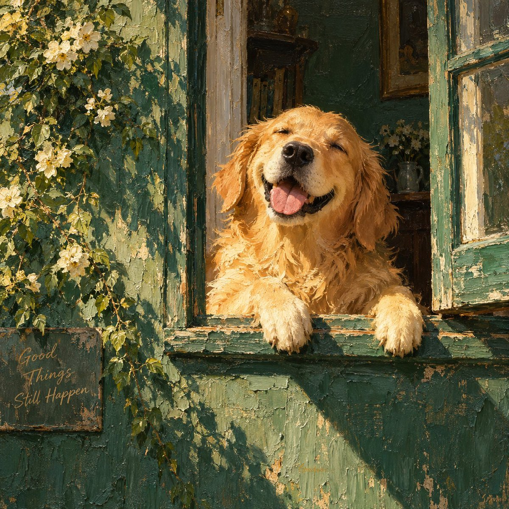

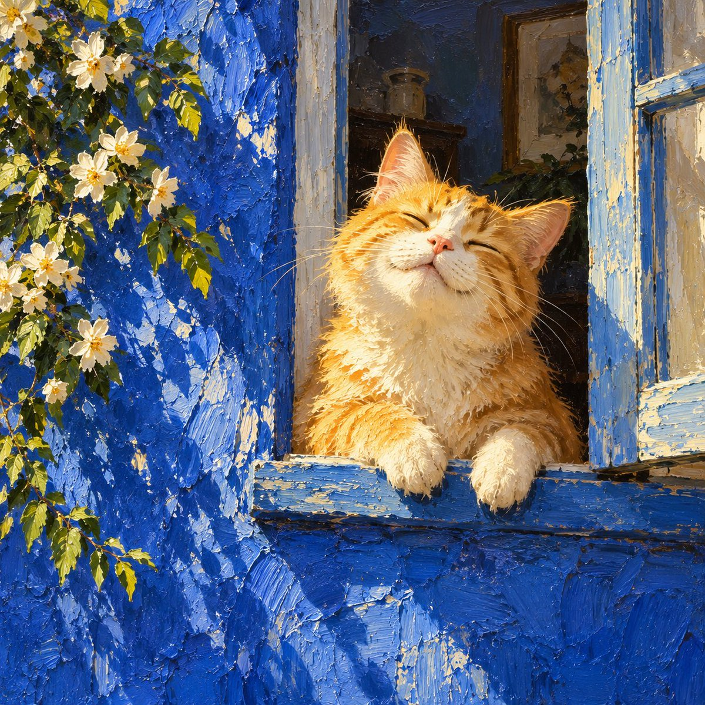

**Prompt**

```text
Ilustración al estilo de pintura al óleo con empaste grueso, 【sujeto】 asomando el cuerpo desde 【marco de puerta/junto a la ventana/detrás de la pared】, con una expresión natural y reconfortante. Fondo de 【color de alta saturación】, con una textura de pintura gruesa y evidente. La luz del sol ilumina al sujeto, creando luces y sombras doradas y cálidas, con un contraste marcado entre tonos fríos y cálidos. Pinceladas sueltas y naturales, textura de óleo realista, composición sencilla, ilustración artística de estilo reconfortante. Proporción 【1:1】.
```

[↑ Volver a categorías](#catalog)

---

<a name="category-watercolor"></a>

## Acuarela

<a name="prompt-2097637962137895058"></a>

### Prompt para transformar una foto al estilo de ilustración de diario de viaje hecho a mano con lápices de colores y acuarela retro

Autor：[@tataemugc](https://x.com/tataemugc) · [Publicación original](https://x.com/tataemugc/status/2097637962137895058)

Ilustración · Acuarela · Retro / Vintage · Publicado

Publicación original：[@Crypto\_QianXun](https://x.com/Crypto_QianXun) · [Publicación original](https://x.com/Crypto_QianXun/status/2097174853707284785)

**Resumen:** Prompt para transformar una foto al estilo de ilustración de diario de viaje hecho a mano con lápices de colores y acuarela retro


**Prompt**

```text
Transforma la foto en un estilo de diario de viaje dibujado a mano con lápices de colores y acuarela. Mantén la composición original, los edificios, las personas, los árboles, el pasto, el camino y la perspectiva intactos. Usa un papel envejecido de color beige cálido para dar una sensación de dibujo a mano donde se noten los trazos de pluma y el sangrado de la acuarela. Simplifica los edificios en formas expresivas, añadiendo contornos sueltos, tramas cruzadas detalladas y bordes ligeramente imperfectos. Conserva la atmósfera de un día claro de verano, un cielo azul suave, edificios de color beige cálido, pasto verde y personas y bancas dispersas y relajadas. Usa tonos de boceto de viaje vintage desteñido. Coloca la ilustración en la mitad inferior de la página y deja un amplio espacio beige en la parte superior. Escribe a mano en la parte superior '맑은 날씨' y en la parte inferior '— 소중한 순간 —'. Con un estilo de revista de viajes artística y nostálgica, como el recuerdo de un cuaderno de bocetos personal, sin ningún aspecto fotográfico.
```

[↑ Volver a categorías](#catalog)

---

<a name="category-ink-chinese-style"></a>

## Tinta / Estilo chino

<a name="prompt-2100241141967081911"></a>

### Prompt de fotografía en primerísimo plano extremo de arte de uñas de estilo tradicional chino centrado en la estética de la dinastía Song, que enfatiza fijar el enfoque en el exquisito impacto visual de la manicura.

Autor：[@DeepBlueX0](https://x.com/DeepBlueX0) · [Publicación original](https://x.com/DeepBlueX0/status/2100241141967081911)

Fotografía · Tinta / Estilo chino · Publicado

Publicación original：[@DeepBlueX0](https://x.com/DeepBlueX0) · [Publicación original](https://x.com/DeepBlueX0/status/2100101510634037441)

**Resumen:** Prompt de fotografía en primerísimo plano extremo de arte de uñas de estilo tradicional chino centrado en la estética de la dinastía Song, que enfatiza fijar el enfoque en el exquisito impacto visual de la manicura.


**Prompt**

```text
Estética de la dinastía Song × Primerísimo primer plano extremo de manicura estilo Song × Enfoque fijado en el arte de uñas como elemento visual principal
```

[↑ Volver a categorías](#catalog)

---

<a name="category-retro-vintage"></a>

## Retro / Vintage

<a name="prompt-2100099718605135962"></a>

### Prompt para un póster de viajes de moda urbana japonesa vintage con una modelo de moda táctica sobre un collage urbano con tipografía en papel envejecido.

Autor：[@harboriis](https://x.com/harboriis) · [Publicación original](https://x.com/harboriis/status/2100099718605135962)

Póster / Volante · Retro / Vintage · Influencer / Modelo · Artículo de moda · Paisaje urbano / Calle · Texto / Tipografía · Publicado

**Resumen:** Prompt para un póster de viajes de moda urbana japonesa vintage con una modelo de moda táctica sobre un collage urbano con tipografía en papel envejecido.


**Prompt**

```text
Crea un póster vertical 4:5 de moda y viajes editorial ultrarrealista inspirado en la portada de una revista callejera japonesa vintage.

Una mujer joven se encuentra prominentemente en el centro del primer plano, fotografiada desde un ángulo ligeramente bajo. Tiene el cabello oscuro recogido en un moño alto despeinado con mechones sueltos enmarcando su rostro, lleva gafas de sol envolventes negras futuristas y estrechas, y mira ligeramente hacia la cámara con una expresión segura y tranquila. Viste una chaqueta utilitaria técnica negra oversized cubierta de correas realistas, hebillas, cremalleras, bolsillos, parches impresos, etiquetas y sutiles detalles reflectantes, combinada con ropa oscura de estilo táctico y un bolso utilitario negro grande. Conserva una textura de tela realista y proporciones naturales.

El fondo es un collage de calles nocturnas de Tokio, con calles de neón empapadas por la lluvia, letreros de tiendas japonesas, callejones urbanos estrechos, la Torre de Tokio brillando de noche y un tren de Tokio llegando a una estación. Distribuye varias fotografías rectangulares alrededor del sujeto central en diferentes ángulos leves, creando un diseño de álbum de recortes editorial hecho a mano. Utiliza papel envejecido de color blanco hueso como fondo principal con una textura sutil de grano de papel, bordes desgastados, pliegues, manchas y textura de impresión vintage.

En la parte superior, añade una tipografía negra enorme y llamativa que diga:

TOKYO

Debajo de ella, un texto serif en cursiva más pequeño y elegante:

FUTURE IS NOW

Añade pequeños bloques de texto editorial como:

“Where tradition meets technology, and every street tells a story of tomorrow.”

Incluye símbolos de globos terráqueos minimalistas, líneas gráficas técnicas, elementos de código de barras, coordenadas, pequeñas etiquetas y marcas editoriales futuristas.

Utiliza paneles gráficos rojos y negros de inspiración japonesa en toda la composición. Añade un panel rojo vertical a la derecha con tipografía japonesa, una tarjeta gráfica roja en la parte inferior izquierda que contenga grandes caracteres japoneses y otro panel fotográfico rojo en la parte inferior derecha que muestre una silueta oscura de la mujer.

Incluye tipografía pequeña como:

35.6895° N
139.6917° E

y:

SHIBUYA • SHINJUKU • HARAJUKU • AKIHABARA

Estética general: revista de moda urbana japonesa de alta gama, Tokio cyberpunk, póster de viaje vintage, editorial de moda contemporánea, collage impreso analógico. Paleta de colores en negro apagado, carbón, crema, gris oscuro y rojo intenso. Fuerte realismo fotográfico, iluminación cinematográfica nocturna, sutil grano de película, tinta ligeramente desvaída, auténtica textura de papel, registro de impresión imperfecto, sofisticada tipografía de revista, espacio negativo equilibrado.

Composición: sujeto central de cuerpo entero, titular "TOKYO" extragrande que ocupa la sección superior, fotografías superpuestas de Tokio que la rodean, detalles gráficos rojos, borde de papel vintage, diseño editorial de primera calidad.

Fotorrealista, muy detallado, cinematográfico, 8K, piel realista, texturas de ropa realistas, fotografía de moda profesional, acabado de impresión vintage auténtico, sin elementos modernos de interfaz digital.
```

[↑ Volver a categorías](#catalog)

---

<a name="prompt-2100123233630519438"></a>

### Prompt de conversión de estilo para extraer las características de una imagen y reconstruirlas en una ilustración editorial ligera, retro y hecha a mano, inspirada en el modernismo, la Bauhaus y los libros ilustrados.

Autor：[@bantya\_otime](https://x.com/bantya_otime) · [Publicación original](https://x.com/bantya_otime/status/2100123233630519438)

Ilustración · Retro / Vintage · Publicado

Publicación original：[@huku\_ken\_ai](https://x.com/huku_ken_ai) · [Publicación original](https://x.com/huku_ken_ai/status/2100054565727113316)

**Resumen:** Prompt de conversión de estilo para extraer las características de una imagen y reconstruirlas en una ilustración editorial ligera, retro y hecha a mano, inspirada en el modernismo, la Bauhaus y los libros ilustrados.


**Prompt**

```text
Extrae los sujetos, contornos, poses y relaciones narrativas más característicos de la imagen, y reconstrúyelos en una ilustración editorial hecha a mano, ligera, rústica y retro. Evitando la reproducción mecánica de detalles, la ilustración se reinterpreta a través de formas generalizadas, proporciones adecuadamente exageradas, rasgos simbólicos y metáforas visuales humorísticas, manteniendo al mismo tiempo la expresión característica del original. Estas ilustraciones fusionan la ilustración editorial modernista, el diseño gráfico de la Bauhaus, los libros infantiles ilustrados, el arte naíf y las técnicas de boceto en tendencia. Las formas son concisas, los contornos dan una impresión ligeramente ambigua reflejando los errores típicos del trazo a mano, y ciertos elementos se amplían adecuadamente para crear una imagen con narrativa, estilo y un toque lúdico.
```

[↑ Volver a categorías](#catalog)

---

<a name="prompt-2098314775344394279"></a>

### Prompt para foto grupal de las Ocho Bellezas de Qinhuai con flash directo CCD estilo clásico

Autor：[@DeepBlueX0](https://x.com/DeepBlueX0) · [Publicación original](https://x.com/DeepBlueX0/status/2098314775344394279)

Fotografía · Retro / Vintage · Retrato / Selfie · Personaje · Grupo / Pareja · Publicado

Publicación original：[@DeepBlueX0](https://x.com/DeepBlueX0) · [Publicación original](https://x.com/DeepBlueX0/status/2097135361046839783)

**Resumen:** Prompt para foto grupal de las Ocho Bellezas de Qinhuai con flash directo CCD estilo clásico


**Prompt**

```text
Aroma a cosméticos y belleza deslumbrante; la brumosa luna sobre el río Qinhuai; miradas llenas de encanto y frescura primaveral; cada una con su propia gracia y porte; flash directo de cámara CCD; las Ocho Bellezas de Qinhuai: foto grupal de Liu Rushi, Chen Yuanyuan, Li Xiangjun, Dong Xiaowan, Gu Hengbo, Bian Yujing, Kou Baimen y Ma Xianglan
```

[↑ Volver a categorías](#catalog)

---

<a name="prompt-2097954772586557873"></a>

### Prompt de retrato retro de los años 80 utilizando la identidad de referencia con estética de película analógica de 35 mm, moda vintage y brillo ambiental de neón.

Autor：[@Goodmanprotocol](https://x.com/Goodmanprotocol) · [Publicación original](https://x.com/Goodmanprotocol/status/2097954772586557873)

Fotografía · Retro / Vintage · Retrato / Selfie · Artículo de moda · Publicado

**Resumen:** Prompt de retrato retro de los años 80 utilizando la identidad de referencia con estética de película analógica de 35 mm, moda vintage y brillo ambiental de neón.


**Prompt**

```text
Crea un auténtico retrato retro-vintage de los años 80 en una relación de aspecto vertical de 4:5, utilizando a la persona proporcionada como referencia facial exacta. Conserva su identidad, estructura facial, rasgos reconocibles, tono de piel y expresión natural con alta precisión; no alteres ni embellezcas el rostro.

Dale al sujeto un peinado clásico de los años 80 y una vestimenta elegante y precisa de la época con siluetas audaces, texturas auténticas y una actitud vintage natural. Compón el retrato de forma natural con un fuerte estilo editorial, manteniendo al sujeto como el punto focal evidente.

Captura la imagen como si hubiera sido tomada con una cámara de película analógica de 35 mm, con grano de película realista, polvo y textura sutiles, una suave delicadeza, detalles naturales de la piel, una ligera decoloración e imperfecciones analógicas auténticas. Utiliza una gradación de color cálida y nostálgica, reflejos suaves de neón, un sutil brillo ambiental y un flash directo en la cámara para crear el aspecto distintivo de una fotografía icónica de los años 80.

Mantén la iluminación cinematográfica pero creíble, con sombras suaves, reflejos realistas, contraste natural y una exposición de película ligeramente imperfecta. La imagen final debe sentirse genuinamente fotografiada en los años 80, no recreada digitalmente, con una atmósfera atemporal, nostálgica, a la moda y espontáneamente genial.
```

[↑ Volver a categorías](#catalog)

---

<a name="prompt-2097628670143954978"></a>

### Crear póster de diario de viaje de dos paneles: escena callejera realista arriba, estilo de ilustración vintage con la misma composición abajo, con tipografía.

Autor：[@Alina\_with\_Ai](https://x.com/Alina_with_Ai) · [Publicación original](https://x.com/Alina_with_Ai/status/2097628670143954978)

Póster / Volante · Fotografía · Ilustración · Retro / Vintage · Paisaje urbano / Calle · Texto / Tipografía · Publicado

**Resumen:** Crear póster de diario de viaje de dos paneles: escena callejera realista arriba, estilo de ilustración vintage con la misma composición abajo, con tipografía.


**Prompt**

```text
Crea un póster realista de diario de viaje editorial de dos paneles utilizando la primera imagen como la composición/referencia exacta y la segunda imagen subida como referencia facial.

Reemplaza a la mujer del póster original con la mujer de mi foto de referencia. Conserva mi identidad facial y mis rasgos faciales reconocibles con precisión: forma del rostro, ojos, cejas, nariz, labios, tono de piel y proporciones naturales. No embellezcas, alteres ni rediseñes mi rostro.

PANEL SUPERIOR

Recrea la escena callejera original exactamente:

Calle estrecha de adoquines de estilo europeo

Edificios históricos de color crema

Letreros de cafeterías, ventanas, balcones, farolas y bolardos

El mismo ángulo de cámara, encuadre, perspectiva y composición

La misma pose sentada/inclinada y posición corporal

El mismo suéter/abrigo texturizado negro

Cabello largo y oscuro natural

Luz diurna cinemática y suave

Textura de piel fotorrealista e iluminación realista

Integra mi rostro de forma natural con la pose original, el ángulo de la cabeza y la iluminación

PANEL INFERIOR

Crea la versión de ilustración a juego dibujada a mano/impresa de la misma escena.

Mantén la misma pose, ropa, peinado e identidad facial

Convierte la fotografía en una ilustración editorial vintage con textura

Paleta de tinta en azul, crema y naranja cálido apagado

Grano de papel visible y textura de tinta imperfecta

Mantén mis rasgos faciales reconocibles mientras se adaptan al estilo ilustrado

Conserva la calle, los edificios, las plantas, los autos y la perspectiva del original

TIPOGRAFÍA Y DISEÑO

Conserva el diseño del póster original y el estilo tipográfico:

Título grande escrito a mano: “By the Street”

Texto pequeño de diario en inglés

Texto en chino en la parte superior izquierda

Fecha: 2026.08.29

Número/detalles pequeños de diario

Frase del lado derecho: “GOOD THINGS ALWAYS HAPPEN IN QUIET MOMENTS.”

Lo más importante: Mi rostro debe ser la única identidad facial utilizada. No copies el rostro de la mujer original. Mantén la composición general del póster, la pose, la ropa, el fondo y el estilo artístico lo más cerca posible de la referencia. Integración facial de alta calidad, natural y fluida, panel superior fotorrealista y panel inferior de ilustración impresa auténtica.
```

[↑ Volver a categorías](#catalog)

---

<a name="prompt-2097185580224491672"></a>

### Retrato editorial retro de moda urbana de los 90, hombre recargado en un auto clásico americano, con una pared urbana desgastada de Oakland de fondo.

Autor：[@harboriis](https://x.com/harboriis) · [Publicación original](https://x.com/harboriis/status/2097185580224491672)

Fotografía · Retro / Vintage · Retrato / Selfie · Personaje · Artículo de moda · Vehículo · Paisaje urbano / Calle · Resumen / Antecedentes · Publicado

**Resumen:** Retrato editorial retro de moda urbana de los 90, hombre recargado en un auto clásico americano, con una pared urbana desgastada de Oakland de fondo.


**Prompt**

```text
Crea una fotografía editorial de moda urbana vertical 9:16 ultrarrealista de un hombre joven con cabello oscuro, rizado y grueso, usando lentes de sol negros, una playera polo oversize en tonos crema y negro con letras universitarias en negrita «OAKLAND» y texto deportivo más pequeño abajo, pantalones holgados tipo cargo negros, tenis blancos y un reloj de pulsera de metal clásico. Está recargado casualmente contra la parte delantera de un auto clásico americano con las manos en los bolsillos y una pierna cruzada sobre la otra.
Ambienta la escena en una calle urbana rústica con un edificio viejo y desgastado detrás de él. Agrega una gran tipografía descolorida en la pared que diga «OAKLAND», con «CALIFORNIA» y «EST. 1852» abajo. Luz cálida de atardecer, paleta de colores tenues en marrón y beige, grano de película sutil, sombras suaves, estética nostálgica de moda urbana de los años 90, textura de piel realista, pose natural, profundidad de campo cinematográfica, auto clásico detallado, auténtica fotografía editorial.
Composición de cuerpo completo, cámara a nivel de los ojos en ángulo bajo, lente de 35 mm, iluminación cinematográfica cálida, fotorrealista, alto detalle, 4K.
```

[↑ Volver a categorías](#catalog)

---

<a name="category-cyberpunk-sci-fi"></a>

## Cyberpunk / Ciencia ficción

<a name="prompt-2097880604872438019"></a>

### Traducción en curso

Autor：[@listudio](https://x.com/listudio) · [Publicación original](https://x.com/listudio/status/2097880604872438019)

Fotografía · Ilustración · Cyberpunk / Ciencia ficción · Paisaje / Naturaleza · Publicado

**Resumen:** Traducción en curso


**Prompt**

```text
Traducción en curso
```

[↑ Volver a categorías](#catalog)

---

<a name="prompt-2098901467956461671"></a>

### Prompt de retrato estilo cyberpunk de una mujer con atuendo negro a cuatro patas en el piso de un cuarto de juegos iluminado por neón rosa y azul.

Autor：[@CyberTotal2026](https://x.com/CyberTotal2026) · [Publicación original](https://x.com/CyberTotal2026/status/2098901467956461671)

Fotografía · Cyberpunk / Ciencia ficción · Retrato / Selfie · Personaje · Publicado

**Resumen:** Prompt de retrato estilo cyberpunk de una mujer con atuendo negro a cuatro patas en el piso de un cuarto de juegos iluminado por neón rosa y azul.


**Prompt**

```text
Tema:
Atuendo negro bajo neón rosa y azul

Sujeto:
Fotografía vertical de una mujer adulta con atuendo negro en cuatro puntos de apoyo en el suelo en un cuarto gamer iluminado con luces de neón rosa y azul. La figura se ubica tomando como referencia el centro del encuadre.

Personaje y expresión:
Cabello castaño oscuro recogido en dos trenzas laterales, flequillo ligero, lentes redondos. Rostro ovalado y delgado, ojos cafés alargados, cejas delgadas, nariz pequeña, labios rosados. Levanta la mirada y observa fijamente a la cámara con seriedad.

Vestimenta y pose:
Top negro de tirantes tipo corsé, shorts negros cortos, arnés delgado en el cuello, guantes largos negros que sobrepasan el codo. Apoyando ambas manos y rodillas en el suelo, arqueando la espalda y levantando la cara.

Fondo e iluminación:
Dispositivos gamer iluminados, monitores, tiras LED rosas y azules, y en la parte superior derecha el letrero de neón «GAME OVER». La luz de color genera un contorno de ambos tonos sobre la ropa negra y la piel. La luz principal del fondo es una luz suave que proviene de las fuentes de neón de ambos lados.

Composición y cámara:
Composición vertical 3:4, cámara casi a ras de piso con ángulo frontal diagonal de cuerpo entero cercano. Manos en el primer plano inferior, rostro al centro, texto en la esquina superior derecha. Enfoque nítido en el rostro, los lentes y el arnés negro, con bokeh de neón al fondo. Figura en plano protagónico amplio, enfocando al sujeto con un leve desenfoque de fondo.

Textura y estilo:
Fotografía de interiores cyberpunk fotorrealista. Textura tipo piel sintética negra, guantes largos, lentes, luces de neón rosa y azul, y reflejos en la piel representados con alto contraste y detalle fino.

Negativo:
No omitir la postura a cuatro patas ni los lentes redondos; no situar en una habitación iluminada de día
```

[↑ Volver a categorías](#catalog)

---

<a name="category-minimalism"></a>

## Minimalismo

<a name="prompt-2097628383362597075"></a>

### Generar una infografía de guía de quiromancia en un estilo de revista minimalista en color blanco hueso.

Autor：[@hahazwei](https://x.com/hahazwei) · [Publicación original](https://x.com/hahazwei/status/2097628383362597075)

Infografía / Visual educativo · Minimalismo · Publicado

**Resumen:** Generar una infografía de guía de quiromancia en un estilo de revista minimalista en color blanco hueso.


**Prompt**

```text
Usa esta imagen para generar una infografía completa de guía de lectura de quiromancia. Presta atención a las líneas de la palma, etiqueta las líneas clave, realiza un análisis quiromántico detallado y presenta las interpretaciones sobre un fondo color blanco hueso, con un estilo editorial de revista limpio, minimalista y lujoso en general. Utiliza líneas finas, tarjetas con esquinas redondeadas y un espacio en blanco refinado para crear una textura sofisticada y de alta gama. Enfócate principalmente en la lectura quiromántica en sí.
```

[↑ Volver a categorías](#catalog)

---

<a name="prompt-2097622528340668736"></a>

### Retrato realista en ángulo picado de una joven mujer del este de Asia en bikini rosa frente a un fondo gris minimalista.

Autor：[@catgirlcozy](https://x.com/catgirlcozy) · [Publicación original](https://x.com/catgirlcozy/status/2097622528340668736)

Minimalismo · Retrato / Selfie · Personaje · Resumen / Antecedentes · Publicado

**Resumen:** Retrato realista en ángulo picado de una joven mujer del este de Asia en bikini rosa frente a un fondo gris minimalista.


**Prompt**

```text
Toma en ángulo picado de 35 grados, una joven y auténtica mujer del este de Asia con cabello castaño rojizo, mirando a la cámara, con las manos detrás de la cabeza, los codos abiertos hacia los lados, mostrando una sonrisa amplia, radiante y sincera mostrando los dientes, con las manos en la cabeza. Viste un bikini de tiras rosa y un fino collar de oro, descalza frente a un fondo minimalista de concreto gris. Luz natural interior suave, estilo de instantánea de retrato de estilo de vida con textura auténtica.
```

[↑ Volver a categorías](#catalog)

---

<a name="prompt-2097204639863287913"></a>

### Prompt de fondo de pantalla y póster de mujer frente a ventana en celosía con nuevo estilo chino y zen oriental, combinando tonos verde jade celadón, magenta y blanco cálido.

Autor：[@liyue\_ai](https://x.com/liyue_ai) · [Publicación original](https://x.com/liyue_ai/status/2097204639863287913)

Póster / Volante · Minimalismo · Personaje · Resumen / Antecedentes · Publicado

Publicación original：[@liyue\_ai](https://x.com/liyue_ai) · [Publicación original](https://x.com/liyue_ai/status/2096838519918596234)

**Resumen:** Prompt de fondo de pantalla y póster de mujer frente a ventana en celosía con nuevo estilo chino y zen oriental, combinando tonos verde jade celadón, magenta y blanco cálido.


**Prompt**

```text
Dirección temática: Póster de portada minimalista de estilo zen oriental
Rama estilística: Nuevo estilo chino con estética femenina
Contenido principal: Una mujer de estilo tradicional chino de pie frente a una ventana en celosía floral, con una postura serena y reservada
Motivo emocional: Elegante, suave, sensación de lujo sutil
Escena e imaginería: Ventana en celosía de color verde jade celadón, sombras de flores color magenta rojizo, pared blanco cálido, mujer, mínimos detalles en dorado claro
Composición y espacio: Composición vertical 9:16, la ventana en celosía se ubica en la parte media superior, la figura en la parte media inferior, manteniendo una zona de título limpia en la parte superior
Control de color: Blanco cálido como base luminosa, verde jade celadón para la celosía y pequeñas estructuras de fondo, magenta rojizo para sombras florales y acentos específicos, dorado claro solo para brillos mínimos de adornos, vestimenta del personaje en blanco perla o blanco rosáceo pálido; evitar que toda la imagen sea solo verde jade o toda magenta
Luz y textura: Luz natural suave, colores vivos y translúcidos, estética limpia de póster gráfico plano
Relación de aspecto: 9:16
Requisitos adicionales: El conjunto debe transmitir la sensación de una portada del nuevo estilo chino de alta belleza visual, refinada pero sin exceso de ornamentación
```

[↑ Volver a categorías](#catalog)

---

<a name="prompt-2096807576168169628"></a>

### Genera un póster editorial díptico 3:4 a partir de las fotos subidas: la mitad superior conserva la foto original y la mitad inferior se transforma en una pequeña ilustración minimalista dibujada a mano.

Autor：[@Sairah\_0](https://x.com/Sairah_0) · [Publicación original](https://x.com/Sairah_0/status/2096807576168169628)

Póster / Volante · Ilustración · Minimalismo · Publicado

**Resumen:** Genera un póster editorial díptico 3:4 a partir de las fotos subidas: la mitad superior conserva la foto original y la mitad inferior se transforma en una pequeña ilustración minimalista dibujada a mano.


**Prompt**

```text
Crea UN póster editorial independiente de alta gama para CADA foto subida. Nunca combines fotos. Cada foto debe convertirse en un póster independiente.

FORMATO
Estrictamente vertical 3:4. Divide el lienzo en dos secciones horizontales exactamente iguales del 50%.

50% SUPERIOR — FOTO ORIGINAL
Conserva la foto fielmente: identidad, rostro, proporciones corporales, pose, ropa, objetos, composición, iluminación, sombras, atmósfera y colores. Mantenla fotorrealista con una sutil gradación de color editorial prémium. Extiende el fondo de manera fluida si es necesario; nunca distorsiones ni alteres al sujeto.

50% INFERIOR — ILUSTRACIÓN MÍNIMA
Reinterpreta los elementos más reconocibles como una ilustración en papel pequeña, centrada y dibujada a mano que ocupe solo del 10 al 20% de la mitad inferior. Conserva el sujeto clave, la silueta, la pose, los objetos y la narrativa.

Usa líneas delicadas e imperfectas, formas planas y llamativas de estilo acrílico, grano de papel rugoso, trazos de pincel hechos a mano y bordes orgánicos. Mantén el fondo en blanco cálido/blanco roto con un generoso espacio negativo.

COLOR
Extrae los colores dominantes de la foto original y redúcelos a un máximo de 4 colores sobrios y armoniosos.

TIPOGRAFÍA
Texto editorial mínimo opcional, como un título corto, ubicación, año o palabra clave. No fuerces el texto si no es necesario.

ESTILO
Tranquilo, poético, refinado, minimalista, inocente, artístico, reflexivo, prémium y altamente reconocible, como el de un libro de arte contemporáneo o la portada de una publicación editorial independiente.
```

[↑ Volver a categorías](#catalog)

---

<a name="category-other"></a>

## Otros

<a name="prompt-2102218694873248214"></a>

### Creación de un retrato grupal de «Sueño en el pabellón rojo: El banquete nocturno de las bellezas» al estilo Gongbi cortesano de la dinastía Qing, basado en la composición de 13 personas de «La última cena».

Autor：[@DeepBlueX0](https://x.com/DeepBlueX0) · [Publicación original](https://x.com/DeepBlueX0/status/2102218694873248214)

Personaje · Comida y bebida · Publicado

**Resumen:** Creación de un retrato grupal de «Sueño en el pabellón rojo: El banquete nocturno de las bellezas» al estilo Gongbi cortesano de la dinastía Qing, basado en la composición de 13 personas de «La última cena».

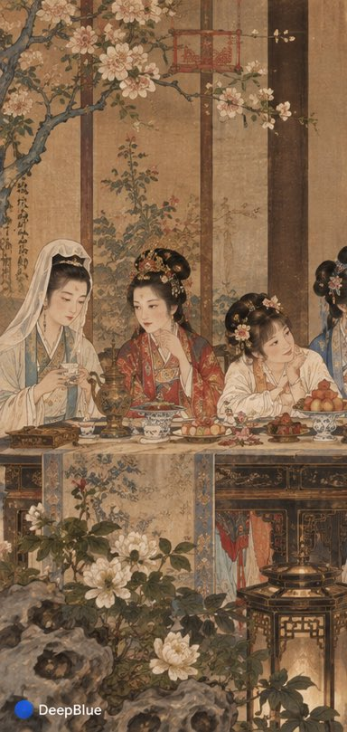

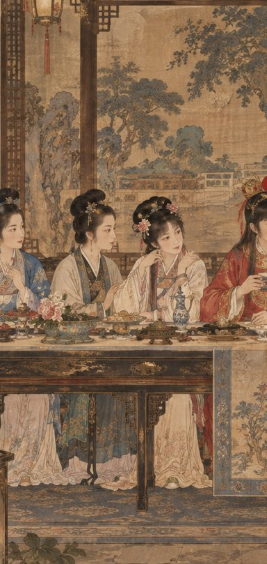

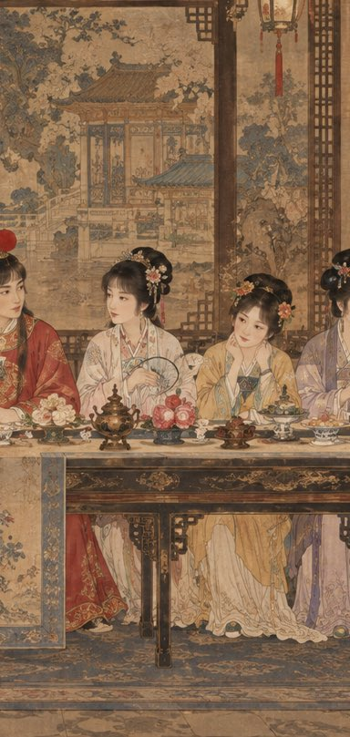

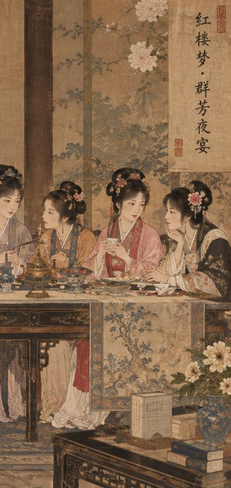

**Prompt**

```text
«Sueño en el pabellón rojo: El banquete nocturno de las bellezas» × Composición clásica de retrato grupal de 13 personas de «La última cena» × Usando únicamente la estructura horizontal del grupo × Formato ancho aproximado de 1.9:1 × 6 personas a la izquierda de la imagen: Miaoyu, Wang Xifeng, Shi Xiangyun, Tanchun, Li Wan, Lin Daiyu × Al centro: Jia Baoyu × 6 personas a la derecha de la imagen: Xue Baochai, Yingchun, Xichun, Ping'er, Xiren, Qingwen × Banquete en mesa larga horizontal × Pintura figurativa estilo Gongbi cortesano de la dinastía Qing
```

[↑ Volver a categorías](#catalog)

---

<a name="prompt-2101902908178776196"></a>

### Foto espontánea con celular y flash barrido de una joven junto a una pared de azulejos blancos por la noche.

Autor：[@sereinworld](https://x.com/sereinworld) · [Publicación original](https://x.com/sereinworld/status/2101902908178776196)

Personaje · Publicado

**Resumen:** Foto espontánea con celular y flash barrido de una joven junto a una pared de azulejos blancos por la noche.

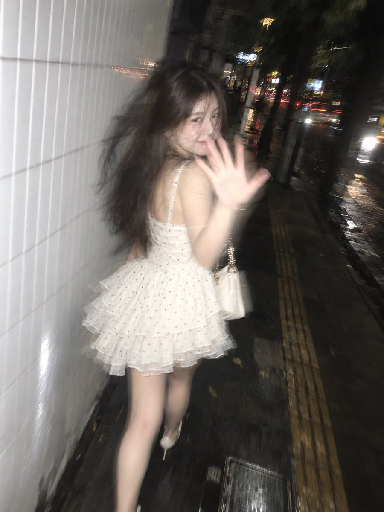

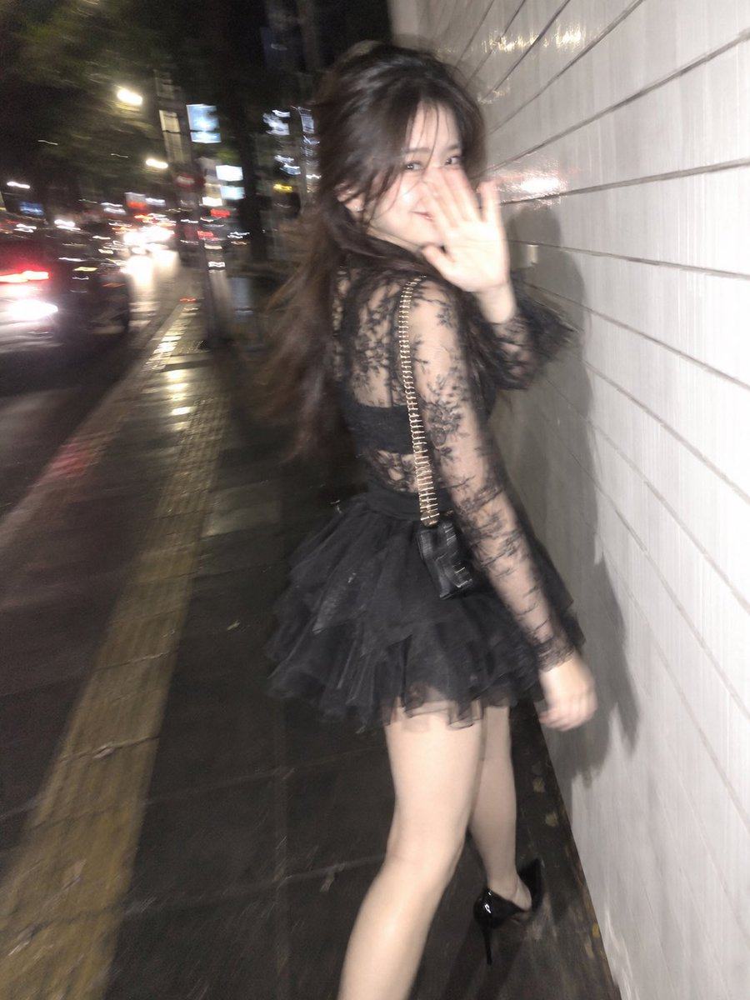

**Prompt**

```text
Foto hiperrealista y espontánea tomada con smartphone, orientación vertical 3:4. Mujer joven original e irreconocible en una banqueta de Yakarta por la noche, recargada contra una pared de azulejos blancos. A mitad de paso, de medio perfil, volteando con una sonrisa tímida, con la mano alzada hacia la cámara. Flash disparado en movimiento, fuerte temblor de mano, severo desenfoque de movimiento, efecto fantasma, azulejos barridos, sombras profundas, luces altas sobreexpuestas, composición imperfecta, instantánea cruda y accidental, estética auténtica y con ruido de fotografía de celular.
```

[↑ Volver a categorías](#catalog)

---

<a name="prompt-2101538802946715870"></a>

### Póster editorial de automovilismo cenital de un auto de carreras GT blanco sobre un fondo gráfico dividido en blanco y negro con tipografía gigante.

Autor：[@harboriis](https://x.com/harboriis) · [Publicación original](https://x.com/harboriis/status/2101538802946715870)

Póster / Volante · Vehículo · Texto / Tipografía · Resumen / Antecedentes · Publicado

**Resumen:** Póster editorial de automovilismo cenital de un auto de carreras GT blanco sobre un fondo gráfico dividido en blanco y negro con tipografía gigante.

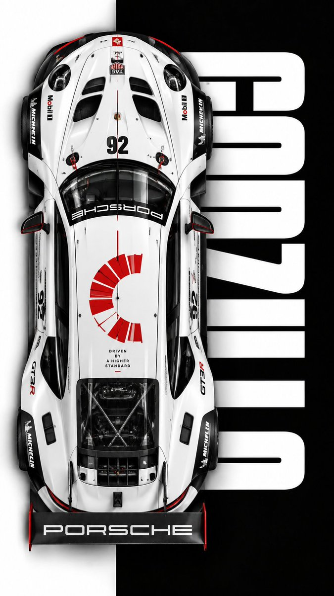

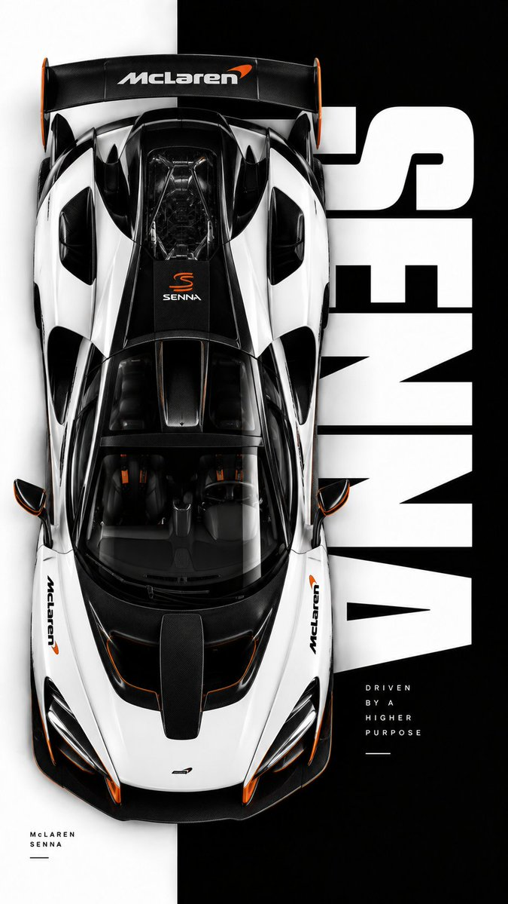

**Prompt**

```text
Crea un póster editorial de automovilismo premium e hiperrealista con un auto de carreras GT blanco fotografiado desde una dramática perspectiva cenital de ángulo alto.

FORMATO:
Composición vertical 9:16, resolución ultraalta, fotografía automotriz comercial limpia, detalles nítidos, reflejos y materiales realistas.

SUJETO PRINCIPAL:
Un auto de carreras GT profesional blanco visto casi a la perfección desde arriba, posicionado verticalmente a lo largo de la izquierda y el centro del encuadre.

Todo el automóvil debe ser visible desde el frente hasta la parte trasera. El vehículo está orientado verticalmente, con la parte delantera hacia la parte superior de la imagen y la parte trasera hacia la parte inferior.

El vehículo cuenta con un diseño de carreras ancho y agresivo con:

- Carrocería aerodinámica blanca
- Ventilaciones y aberturas aerodinámicas negras
- Ruedas de carreras expuestas
- Neumáticos slick de carreras grandes
- Ruedas metálicas multirradio detalladas
- Líneas de acento rojas alrededor de la carrocería
- Alerón aerodinámico trasero grande
- Divisor (splitter) y difusor de carreras
- Paneles aerodinámicos complejos
- Parabrisas y cabina visibles
- Uniones de paneles, tornillos, ventilaciones y componentes de fibra de carbono realistas

El auto debe verse como un auto de carreras profesional de resistencia o GT, con proporciones de automovilismo auténticas y una carrocería aerodinámica extremadamente detallada.

DETALLES DEL AUTOMÓVIL:
Los neumáticos son slicks negros de carreras con letras blancas realistas en los flancos.

Las ruedas deben ser rines de aleación metálica color gris plomo oscuro muy detallados con componentes de freno visibles detrás de los radios.

Añade una sutil marca y gráficos rojos de automovilismo en la carrocería blanca. Incluye un logotipo o gráfico de carreras abstracto circular rojo grande en el panel lateral central.

Utiliza pequeñas calcomanías realistas de estilo patrocinador y marcas técnicas por todo el automóvil.

PERSPECTIVA:
Fotografía automotriz cenital extrema.

La cámara se posiciona casi directamente sobre el vehículo, creando una composición gráfica plana mientras mantiene una profundidad tridimensional realista.

El auto ocupa aproximadamente del 65 al 70 por ciento del ancho de la imagen y se extiende casi por toda la altura de la composición.

FONDO:
Fondo gráfico blanco y negro puramente minimalista.

Todo el fondo está dividido verticalmente:

- Lado izquierdo: fondo blanco brillante y limpio
- Lado derecho: fondo negro sólido y profundo

Crea una transición vertical nítida entre las áreas blanca y negra.

Detrás del automóvil, coloca una enorme tipografía geométrica blanca en negrita que se extienda verticalmente a través del fondo negro.

La tipografía debe ser extremadamente grande, gruesa, moderna y condensada, funcionando principalmente como un elemento de diseño gráfico en lugar de un texto legible normal.

Las letras deben estar parcialmente ocultas detrás del auto de carreras.

Utiliza letras de bloque blancas de gran tamaño con esquinas redondeadas y una construcción geométrica sólida. Algunas letras deben extenderse más allá de los bordes de la composición.

La tipografía debe crear un contraste dramático en blanco y negro alrededor del vehículo.

DISPOSICIÓN:
El auto de carreras blanco se asienta directamente sobre el límite entre el fondo blanco y el negro.

El lado izquierdo del auto se fusiona visualmente con el área blanca, mientras que el lado derecho se superpone a la tipografía blanca gigante en el fondo negro.

Las letras sobredimensionadas deben permanecer detrás del auto y nunca deben cubrir el vehículo.

Crea un espacio negativo fuerte alrededor del automóvil mientras mantienes la apariencia gráfica audaz.

ILUMINACIÓN:
Iluminación de estudio brillante desde arriba, produciendo sombras suaves y realistas debajo del auto.

Utiliza una iluminación limpia en clave alta en la carrocería blanca.

El fondo negro debe permanecer profundo y puro sin degradados innecesarios.

Añade reflejos sutiles y realistas a través de la pintura blanca brillante, el parabrisas, las ruedas metálicas y los componentes de fibra de carbono.

El vehículo debe tener una apariencia de renderizado de estudio premium sin dejar de ser fotorrealista.

MATERIALES:
Pintura automotriz blanca brillante extremadamente realista.
Textura de fibra de carbono realista.
Ruedas de metal cepillado y pulido.
Vidrio de parabrisas transparente.
Neumáticos de carreras de caucho con textura detallada.
Pequeños acentos pintados de rojo.
Bordes aerodinámicos afilados.

ESTILO GRÁFICO:
Campaña publicitaria de automovilismo de lujo minimalista.

Combina:

- Fotografía automotriz premium
- Diseño gráfico brutalista
- Diseño editorial de automovilismo
- Composición en blanco y negro de alto contraste
- Tipografía geométrica de gran tamaño
- Estética publicitaria moderna y limpia

PALETA DE COLORES:
Blanco puro
Negro profundo
Carbón oscuro
Gris plomo metálico
Pequeñas cantidades de rojo de carreras vivo

Sin colores innecesarios.

IMAGEN FINAL:
Póster publicitario profesional fotorrealista para campaña automotriz, auto de carreras extremadamente detallado, proporciones realistas, perspectiva cenital dramática, bordes nítidos, alto contraste, iluminación de estudio limpia, publicidad de automovilismo premium, composición minimalista, tipografía sobredimensionada audaz, dirección de arte editorial sofisticada, calidad 8K ultradetallada.

IMPORTANTE:
Conserva la composición general exacta de la referencia: auto de carreras blanco orientado verticalmente posicionado a través del límite del fondo blanco y negro, letras geométricas blancas gigantes detrás del auto en el lado negro, paleta de colores mínima, fuerte perspectiva cenital, acentos de carreras rojos y una estética limpia de póster de automovilismo premium.
```

[↑ Volver a categorías](#catalog)

---

<a name="prompt-2100545582972751933"></a>

### Colección de prompts para fotos realistas en perspectiva POV con flash directo de CCD de los personajes de Genshin Ningguang y Ganyu en entornos de servicio como reflexología podal, KTV y salas de billar.

Autor：[@0xkyne](https://x.com/0xkyne) · [Publicación original](https://x.com/0xkyne/status/2100545582972751933)

Personaje · Publicado

**Resumen:** Colección de prompts para fotos realistas en perspectiva POV con flash directo de CCD de los personajes de Genshin Ningguang y Ganyu en entornos de servicio como reflexología podal, KTV y salas de billar.


**Prompt**

```text
👠Cosplayer de Ningguang, masajista de reflexología podal, sala privada, qipao, dando servicio, flash directo de CCD, perspectiva POV del cliente

🎤Cosplayer de Ningguang + cosplayer de Ganyu, anfitrionas de KTV de negocios, sala privada de KTV, vestidos minimalistas con la paleta de colores del personaje, interactuando alegremente con el cliente, flash directo de CCD + foto tomada con celular

🎱Joven cosplayer de Ningguang, asistente de billar, sala de billar, minifalda con vuelo + medias blancas, jugando al billar, flash directo de CCD + perspectiva POV del cliente
```

[↑ Volver a categorías](#catalog)

---

<a name="prompt-2100498666763030990"></a>

### Crea un póster comparativo 3:4 a partir de la foto subida: la parte superior con textura de foto espontánea original y la parte inferior simulando el bokeh cremoso de gran apertura de un lente de 85 mm F1.2 de formato completo.

Autor：[@lovimg\_com](https://x.com/lovimg_com) · [Publicación original](https://x.com/lovimg_com/status/2100498666763030990)

Póster / Volante · Retrato / Selfie · Publicado

**Resumen:** Crea un póster comparativo 3:4 a partir de la foto subida: la parte superior con textura de foto espontánea original y la parte inferior simulando el bokeh cremoso de gran apertura de un lente de 85 mm F1.2 de formato completo.


**Prompt**

```text
Con base en la foto que subí, crea un póster visual independiente en formato vertical 3:4 de tipo "gemelo aislado por desenfoque".

La imagen se divide estrictamente en dos áreas superior e inferior, con una altura de 1:1, ocupando el 50% cada una.

La parte superior e inferior deben mantener estrictamente:

El mismo sujeto, el mismo rostro, la misma acción, la misma postura, la misma dirección de la mirada, la misma posición del sujeto, la misma escena, el mismo ángulo de disparo y la misma relación compositiva.

No rediseñes al personaje.

No cambies el fondo.

No alteres el contenido de la foto.

Parte superior | REAL

Conserva por completo la foto original subida.

Mantén la textura original de fotografía móvil, cámara digital o captura espontánea de la vida real.

Conserva toda la información del sujeto, el fondo y el entorno.

Se permite un ligero ajuste de exposición y color, pero no cambies la relación de profundidad de campo.

Permite que el espectador vea claramente el estado real original de la foto.

Parte inferior | 85MM F/1.2

Simula nuevamente y de forma rigurosa una fotografía de retrato profesional de fotograma completo con gran apertura basada en exactamente la misma imagen de la parte superior.

Simula:

Lente fija de 85 mm para fotograma completo, apertura f/1.2.

Los ojos, el rostro y los contornos principales del sujeto se mantienen nítidos y en alta definición.

Recalcula la profundidad de campo según la distancia espacial real.

El plano focal donde se encuentra el sujeto permanece nítido.

El entorno delante y detrás del sujeto entra progresivamente en desenfoque según la distancia.

El fondo a corta distancia conserva una mínima estructura.

El fondo a media distancia comienza a suavizarse.

El fondo lejano se transforma por completo en un bokeh cremoso y natural.

En el fondo:

Farolas, luces de autos, escaparates, reflejos en hojas, brillos metálicos, destellos de luz solar

Se transforman de forma natural en un bokeh óptico real de diferentes tamaños y distintos grados de desenfoque.

El desenfoque debe poseer características de lente reales:

Orbes de luz circulares suaves, ligera distorsión de ojo de gato en los bordes, gradientes de altas luces, capas de profundidad de campo anterior y posterior, y compresión espacial real.

El cabello, los hombros y los bordes de la ropa del personaje no deben mostrar aspecto de recorte artificial.

Debe haber una transición natural entre las hebras de cabello y el desenfoque.

Conserva una ligera respiración de lente, aberración cromática, grano, ligeras imperfecciones de exposición y defectos fotográficos reales.

El resultado final debe parecer:

Como si el mismo fotógrafo, sin moverse de su posición, simplemente hubiera cambiado un teléfono común por un lente profesional de 85 mm F1.2 y hubiera vuelto a disparar.

Prohibido:

Desenfoque gaussiano uniforme en todo el fondo.

Prohibido que el fondo se convierta en una masa de color sin capas espaciales.

Prohibido recortar al sujeto y pegarlo sobre un fondo desenfocado.

Prohibido cambiar el rostro.

Prohibido modificar la acción del personaje.

Prohibido agregar edificios o elementos de paisaje inexistentes.

Prohibido aspecto de ilustración.

Prohibido suavizado excesivo de la piel.

Prohibido piel plástica.

Prohibido aspecto de estudio generado por IA.
```

[↑ Volver a categorías](#catalog)

---

<a name="prompt-2100405863123173606"></a>

### Traducción en curso

Autor：[@TanLuAI](https://x.com/TanLuAI) · [Publicación original](https://x.com/TanLuAI/status/2100405863123173606)

Resumen / Antecedentes · Publicado

**Resumen:** Traducción en curso


**Prompt**

```text
Traducción en curso
```

[↑ Volver a categorías](#catalog)

---

<a name="prompt-2100255511228932598"></a>

### Instantáneas fallidas verticales en cuadrícula de 4, escena de recolección de raíces de loto en un estanque de lotos y personajes

Autor：[@ahamme35638](https://x.com/ahamme35638) · [Publicación original](https://x.com/ahamme35638/status/2100255511228932598)

Personaje · Publicado

**Resumen:** Instantáneas fallidas verticales en cuadrícula de 4, escena de recolección de raíces de loto en un estanque de lotos y personajes


**Prompt**

```text
Fotos fallidas verticales en 2×2, escena de recolección de raíces de loto en un estanque de lotos + personaje
```

[↑ Volver a categorías](#catalog)

---

<a name="prompt-2100102387323076955"></a>

### Generar colección de fotos espontáneas fallidas de aficionados en cuadrícula 3x3

Autor：[@AI\_jacksaku](https://x.com/AI_jacksaku) · [Publicación original](https://x.com/AI_jacksaku/status/2100102387323076955)

Otros · Publicado

Publicación original：[@AI\_jacksaku](https://x.com/AI_jacksaku) · [Publicación original](https://x.com/AI_jacksaku/status/2097878193013199231)

**Resumen:** Generar colección de fotos espontáneas fallidas de aficionados en cuadrícula 3x3


**Prompt**

```text
Una serie de fotos fallidas de aficionados, 3x3, 9:16
```

[↑ Volver a categorías](#catalog)

---

<a name="prompt-2099213523947864179"></a>

### Plantilla de prompt para póster de personaje en abstracción geométrica basada en el constructivismo, suprematismo y futurismo.

Autor：[@VoxcatAI](https://x.com/VoxcatAI) · [Publicación original](https://x.com/VoxcatAI/status/2099213523947864179)

Póster / Volante · Personaje · Resumen / Antecedentes · Publicado

Publicación original：[@VoxcatAI](https://x.com/VoxcatAI) · [Publicación original](https://x.com/VoxcatAI/status/2054455196298932406)

**Resumen:** Plantilla de prompt para póster de personaje en abstracción geométrica basada en el constructivismo, suprematismo y futurismo.


**Prompt**

```text
{Sujeto / Personaje / Concepto}, Constructivism Constructivismo ruso × Suprematism Suprematismo × Futurism Futurismo × Swiss International Style Estilo tipográfico internacional suizo × Geometric Neo-Modernism Neomodernismo geométrico.

Desmonta y traduce el sujeto en un sistema visual geométrico altamente gráfico, sin enfatizar el modelado realista tradicional, sino extrayendo los contornos más esenciales del sujeto, sus rasgos de identidad, colores representativos, relaciones estructurales y direcciones de movimiento, para luego reconstruirlo en planos de bloques geométricos, ejes diagonales, círculos, rectángulos, triángulos, líneas direccionales, módulos y espacio negativo. Figuras humanas, animales, arquitectura, maquinaria, artefactos o conceptos abstractos se unifican bajo esta lógica compositiva geométrica, manteniendo siempre una legibilidad suficiente.

En general, adopta una construcción de formas basada en trazados (Path-based Shape Construction), centrada en el bloqueo geométrico (Geometric Blocking), la abstracción de bordes duros (Hard-edge Abstraction), la repetición modular (Modular Repetition) y el corte direccional (Directional Cutting). Utiliza abundantemente ejes diagonales de 15°, 30° y 45° para establecer dinamismo, dotando al sujeto de una notable sensación de avance, rotación, colisión, corte o expansión.

La composición emplea el recorte constructivista (Constructivist Cropping) y el equilibrio asimétrico (Asymmetrical Balance). El sujeto puede extenderse parcialmente más allá de los bordes del encuadre, ser atravesado u ocultado por grandes bloques de color cortados en diagonal; ciertas estructuras locales pueden ampliarse, repetirse, rotarse o reflejarse para crear un ritmo visual contundente. La imagen conserva un centro visual claro, evitando una disposición estable de retrato tradicionalmente centrado.

La expresión del medio adopta Vector Graphics × Screen Print × Risograph Simulation × Digital Collage. El sujeto se construye con bordes vectoriales nítidos y grandes bloques de color plano, simulando localmente superposiciones de tinta de serigrafía, desalineaciones de registro de risografía, fibras de papel, sutiles puntos de trama y ligeros desajustes de borde, otorgando a la obra tanto la precisión del diseño digital como la tangibilidad de un impreso físico.

La luz y la sombra atenúan la iluminación naturalista, recurriendo a una estructura tonal plana (Flat Tonal Structure) × contraste gráfico (Graphic Contrast) × pseudoprofundidad óptica (Optical Depth). El espacio se genera principalmente a través de contrastes de luminosidad entre bloques cromáticos, oclusiones geométricas, variaciones de escala, capas transparentes y relaciones de superposición frontal/trasera, sin depender de degradados complejos para modelar el volumen. Se pueden incorporar puntualmente geometrías emisivas o bordes brillantes para generar un campo gráfico luminoso (Luminous Graphic Field), pero manteniendo siempre la primacía de la composición plana.

La paleta cromática utiliza una selección limitada de alta identificación, centrada en negro, blanco, rojo, azul cobalto, azul ultramar, amarillo brillante, naranja, gris frío y blanco crema, permitiendo elegir automáticamente entre 2 y 4 colores dominantes según el sujeto. Los colores conservan un alto contraste, un orden estricto y relaciones de proporción de área bien definidas, sin emplear gradientes caóticos ni excesivos tonos compuestos. Se admiten sobreimpresiones serigráficas locales para generar un tercer color.

La estética visual general toma como referencia la geometría espacial de las composiciones Proun de El Lissitzky, los carteles constructivistas y los encuadres radicales de Alexander Rodchenko, las formas elementales suprematistas de Kazimir Malevich, la geometría óptica Bauhaus de László Moholy-Nagy y el orden de cuadrícula suizo (Swiss Grid System) de Josef Müller-Brockmann, conservando en última instancia una estructura visual original.

Incorpora elementos de VOXCAT: en la esquina superior izquierda, añade un logotipo geométrico y minimalista estilizado de “V” + cat, integrándolo armónicamente en la tipografía constructivista; en la esquina inferior derecha, incluye la firma en tamaño pequeño “voxCAT”. La silueta de las orejas de gato, los ojos felinos, los cortes en V y las curvas de la cola pueden traducirse aún más en círculos, triángulos, diagonales o símbolos geométricos modulares, funcionando como motivos visuales recurrentes de VOXCAT dentro de la imagen.

Requisitos generales: estructura clara, relaciones geométricas marcadas, bordes afilados, bloques de color sólidos, composición tipográfica estable, sentido definido de velocidad, abundante espacio negativo, bajo nivel de ruido, sin partículas, sin fondos realistas complejos y un acabado impecable. Aparte del logotipo VOXCAT y la firma voxCAT, no debe aparecer ningún otro texto, número, elemento de interfaz de usuario, marca de agua ni logotipo ajeno.
```

[↑ Volver a categorías](#catalog)

---

<a name="prompt-2099141066784215478"></a>

### Patio de ensueño de estilo chino y alberca moderna sin personas, textura de enfoque suave de CCD

Autor：[@DeepBlueX0](https://x.com/DeepBlueX0) · [Publicación original](https://x.com/DeepBlueX0/status/2099141066784215478)

Otros · Publicado

Publicación original：[@DeepBlueX0](https://x.com/DeepBlueX0) · [Publicación original](https://x.com/DeepBlueX0/status/2099065219259761109)

**Resumen:** Patio de ensueño de estilo chino y alberca moderna sin personas, textura de enfoque suave de CCD


**Prompt**

```text
Fantasía de estilo chino × flash directo CCD con enfoque suave × alberca vacía
```

[↑ Volver a categorías](#catalog)

---

<a name="prompt-2098980048703467897"></a>

### Traducción en curso

Autor：[@SSSS\_CRYPTOMAN](https://x.com/SSSS_CRYPTOMAN) · [Publicación original](https://x.com/SSSS_CRYPTOMAN/status/2098980048703467897)

Otros · Publicado

**Resumen:** Traducción en curso


**Prompt**

```text
Traducción en curso
```

[↑ Volver a categorías](#catalog)

---

<a name="prompt-2098960216792682600"></a>

### Prompt de diseño de vestuario que detalla una túnica semitransparente y accesorios en estilo gótico mandala.

Autor：[@AI\_GIRL\_DESIGN](https://x.com/AI_GIRL_DESIGN) · [Publicación original](https://x.com/AI_GIRL_DESIGN/status/2098960216792682600)

Retrato / Selfie · Artículo de moda · Publicado

**Resumen:** Prompt de diseño de vestuario que detalla una túnica semitransparente y accesorios en estilo gótico mandala.


**Prompt**

```text
Túnica gris de manga corta con una silueta cuadrada gigante que cubre desde la cintura hasta las caderas. Confeccionada con un material especial que parece superponer organza semitransparente gruesa, malla áspera y una fina película de resina, con mangas anchas que sobresalen ampliamente hacia los lados desde los hombros hasta los puños. En el cuello, un pequeño cuello camisero negro y una corbata de lazo negro. Toda la superficie de la túnica está cosida con un cordón negro grueso en un bordado abstracto que serpentea como un trazo continuo aleatorio, con pequeñas mariposas de color rojo bermellón a coral, nudos y aplicaciones en forma de pétalos dispersos en las intersecciones y bordes. El interior de los puños es negro. La tela presenta pliegues realistas, caída natural, márgenes de costura, hilos flotantes y una sutil transparencia. Medias negras por encima de la rodilla. Mules rojos. En la parte posterior derecha de la cabeza, un chongo gigante en forma de lazo en color negro mate. De ambas orejas cuelgan aretes largos y delgados de cadena con cuentas rojas y negras que llegan cerca del pecho.
```

[↑ Volver a categorías](#catalog)

---

<a name="prompt-2098634675057238254"></a>

### Prompt para generar volantes de anuncio de conciertos de calidad profesional en cuadrícula 2×2 con diferentes vestuarios, géneros y tipografías, manteniendo el personaje y el estilo artístico.

Autor：[@hAru\_mAki\_ch](https://x.com/hAru_mAki_ch) · [Publicación original](https://x.com/hAru_mAki_ch/status/2098634675057238254)

Póster / Volante · Personaje · Artículo de moda · Texto / Tipografía · Publicado

Publicación original：[@hAru\_mAki\_ch](https://x.com/hAru_mAki_ch) · [Publicación original](https://x.com/hAru_mAki_ch/status/2098616421190435145)

**Resumen:** Prompt para generar volantes de anuncio de conciertos de calidad profesional en cuadrícula 2×2 con diferentes vestuarios, géneros y tipografías, manteniendo el personaje y el estilo artístico.


**Prompt**

```text
Mantén este personaje y estilo artístico, y genera en una cuadrícula de 4 divisiones (2×2) volantes de anuncio de conciertos en vivo con diversos vestuarios y poses escénicas, como si hubieran sido creados por un diseñador profesional.

Diseña libremente los vestuarios, las poses, los géneros musicales, los fondos, la iluminación y el diseño de los volantes, dándole a cada uno de los cuatro un encanto y un factor sorpresa diferentes. Incorpora elementos visuales que transmitan la energía y el mundo del concierto, junto con una tipografía impactante, e incluye información ficticia del evento como el título del espectáculo, la fecha, la hora y el recinto, logrando un acabado de nivel profesional.

Los cuatro deben mantener el mismo personaje y el mismo estilo artístico. La proporción general debe ser 4:3.
```

[↑ Volver a categorías](#catalog)

---

<a name="prompt-2098559982035951785"></a>

### Retrato estético y evocador descrito con poesía clásica de una mujer tras el baño, envuelta en gasas y recostada en un diván.

Autor：[@listudio](https://x.com/listudio) · [Publicación original](https://x.com/listudio/status/2098559982035951785)

Retrato / Selfie · Personaje · Publicado

**Resumen:** Retrato estético y evocador descrito con poesía clásica de una mujer tras el baño, envuelta en gasas y recostada en un diván.


**Prompt**

```text
Apenas terminado el baño perfumado, envuelta en un velo ligero,
el cuerpo delicado se reclina de lado en el suave diván.
Donde se cruzan las sedas transparentes se trasluce la piel de alabastro,
con los ojos cerrados, colmada de anhelos primaverales que se alargan en calma.
Una cálida y brumosa neblina acaricia su silueta de jade,
y un hilo de tibieza remanente se funde en la luz del atardecer.
```

[↑ Volver a categorías](#catalog)

---

<a name="prompt-2098400287262470292"></a>

### Guion técnico publicitario de 10 segundos para auriculares inalámbricos de alta gama, que muestra a una profesional urbana moderna probándose y usando el producto en un entorno de oficina.

Autor：[@Adam38363368936](https://x.com/Adam38363368936) · [Publicación original](https://x.com/Adam38363368936/status/2098400287262470292)

Cómic / Guion gráfico · Marketing de producto · Personaje · Producto · Paisaje urbano / Calle · Publicado

Publicación original：[@Adam38363368936](https://x.com/Adam38363368936) · [Publicación original](https://x.com/Adam38363368936/status/2098318586859377102)

**Resumen:** Guion técnico publicitario de 10 segundos para auriculares inalámbricos de alta gama, que muestra a una profesional urbana moderna probándose y usando el producto en un entorno de oficina.


**Prompt**

```text
Utiliza los auriculares inalámbricos Bluetooth y el estuche de carga AEROX ONE de la imagen de referencia como única referencia de producto. Mantén de forma estricta e idéntica la forma, las proporciones, el metal gris plateado y los materiales blancos esmerilados de los auriculares, los contornos redondeados del estuche de carga, la tipografía de la marca, las posiciones de los orificios y las relaciones estructurales; no rediseñes, no deformes y no muestres productos redundantes.

Produce un comercial publicitario de 10 segundos para una marca de electrónica de consumo de alta gama, incorporando a una joven mujer asiática como protagonista de estilo de vida urbano. La protagonista tiene una presencia limpia, pulcra y sobria, viste una camisa blanca minimalista o un saco sastre gris claro, con maquillaje natural y textura de piel realista, encarnando el temperamento de una profesional urbana moderna en general. El personaje solo sirve para expresar el estilo de vida y la atmósfera; el producto sigue siendo siempre el núcleo visual.

0-2 segundos:
Espacio de oficina moderno por la mañana, con luz natural entrando por ventanales de piso a techo. La protagonista camina hacia su escritorio, dejando su teléfono y un bolso de piel. La toma corta rápidamente al estuche de carga AEROX ONE sobre el escritorio; la tapa se abre con precisión y ambos auriculares aparecen con claridad. El ritmo de la cámara es limpio y directo, mostrando el producto desde el primer segundo.

2-4 segundos:
La protagonista toma un auricular y se lo coloca en el oído, con un movimiento natural, elegante y sin exageraciones. La toma cambia a un primer plano del auricular, con reflejos blancos fríos en el borde metálico; el auricular encaja de forma natural en el oído, destacando la sofisticación del producto una vez puesto. El fondo muestra un entorno de oficina desenfocado.

4-6 segundos:
La protagonista camina por un pasillo de oficina moderna o cafetería llevando los auriculares puestos; la cámara realiza un paneo de seguimiento lateral suave. Su actitud es concentrada, relajada y en control. En la imagen, el auricular debe permanecer claramente visible, sin quedar totalmente cubierto por el cabello. La atmósfera general enfatiza el traslado urbano, la sensación de eficiencia y el estilo de vida.

6-8 segundos:
Corte a ella sentada junto a la ventana usando una laptop, con una mano tocando suavemente el auricular, como si cambiara de modo o respondiera una llamada. La toma avanza ligeramente hacia adelante, la ciudad al fondo queda desenfocada, y el producto junto con la actitud del personaje crean una sensación publicitaria de lifestyle de alta gama.

8-10 segundos:
Corte rápido de vuelta a una toma hero shot exclusiva del producto. Los auriculares y el estuche de carga AEROX ONE reposan sobre un escritorio gris plateado minimalista, con un fondo suavemente desenfocado y la protagonista fuera de foco a lo lejos como ambiente contextual. La cámara desacelera gradualmente y se detiene; los auriculares y el estuche de carga se convierten en el único sujeto nítido en pantalla, formando el cierre de un anuncio de marca de electrónica de consumo de gama alta.

Estilo general:
De alta gama, moderno, tecnológico, urbano, sobrio, auténtico, como una campaña de una marca internacional de electrónica de consumo.
La imagen debe tener una textura de fotografía comercial real, lentes ópticos reales, perspectiva precisa, bordes de producto nítidos y materiales de metal gris plateado y blanco esmerilado auténticos y naturales.
El ritmo debe presentar variaciones claras, evitando la cámara lenta durante todo el video.
Los movimientos del personaje deben ser naturales, evitando poses forzadas, sonrisas excesivas y expresiones exageradas.

Requisitos clave:
La apariencia del producto debe ser consistente.
La estructura de los auriculares en el oído del personaje debe ser normal y de proporción realista.
El cabello de la protagonista no debe cubrir los auriculares.
No agregar un segundo set de auriculares.
Sin deformación del producto.
Sin efectos especiales de ciencia ficción exagerados.
Sin estética ciberpunk ni neón.
Sin bloques grandes de subtítulos.
Sin manos deformes.
El personaje no debe opacar el protagonismo del producto.
Sin marcas de agua.
```

[↑ Volver a categorías](#catalog)

---

<a name="prompt-2098363788928143624"></a>

### Prompt estructurado para póster de producto con vista explosionada de una lata de té oolong con gas.

Autor：[@luo24853969](https://x.com/luo24853969) · [Publicación original](https://x.com/luo24853969/status/2098363788928143624)

Marketing de producto · Póster / Volante · Producto · Publicado

**Resumen:** Prompt estructurado para póster de producto con vista explosionada de una lata de té oolong con gas.


**Prompt**

```text
{
  "type": "Póster de producto con vista explosionada",
  "subject": "Lata de té con gas",
  "style": "Renderizado 3D limpio y de alta tecnología, iluminación de estudio, detalles sutilmente brillantes",
  "background": "Degradado suave de naranja pastel y beige claro",
  "header": {
    "logo": "PUBBLE",
    "subtitle": "REFRESH YOUR MOMENT WITH PUBBLE!"
  },
  "layout": {
    "centerpiece": "Vista explosionada apilada verticalmente que muestra por completo las 9 capas estructurales de la lata de té oolong con gas: cuerpo exterior de lata de aluminio, anilla de la tapa superior, capa de etiqueta impresa, revestimiento interior, cuerpo de líquido con gas, estructura de hendidura inferior, núcleo de fórmula sin azúcar, capa de esencia de té oolong fragante, diseño antideslizante inferior.",
    "callout_labels": {
      "count": 8,
      "left_side": [
        "Fórmula sin azúcar\nSabor refrescante y ligero, haciendo que cada sorbo sea libre y liviano.",
        "Estructura con gas\nBurbujas finas y densas que brindan capas de textura refrescantes y vigorizantes.",
        "Esencia de té oolong aromático\nHojas de té oolong seleccionadas que preservan el aroma natural y el regusto dulce."
      ],
      "right_side": [
        "Cuerpo de lata de aluminio de alta calidad\nLigero y duradero, conserva perfectamente el sabor fresco.",
        "Diseño de anilla en tapa superior\nFácil de abrir, mejorando la experiencia de uso.",
        "Etiqueta visual degradada\nPaleta suave de naranja pastel a blanco beige que crea una atmósfera fresca.",
        "Capacidad óptima de 330 ml\nIdeal para llevar a todas partes, renovando momentos hermosos en cualquier instante.",
        "Estructura inferior estable\nDiseño antideslizante para una colocación más segura."
      ]
    },
    "footer": {
      "left_text_block": {
        "headline": "La frescura comienza desde la estructura.",
        "body": "Cada capa estructural ha sido cuidadosamente diseñada; desde la fórmula sin azúcar hasta la esencia de té oolong aromático, PUBBLE combina artesanía meticulosa y sabor natural para ofrecer una experiencia puramente refrescante."
      },
      "right_logo": "PUBBLE"
    }
  }
}
```

[↑ Volver a categorías](#catalog)

---

<a name="prompt-2098256551425319223"></a>

### Prompt de estilo encantamiento fantástico para invocar una espada de doble filo imbuida con el poder de las escamas de dragón y el destello.

Autor：[@0Narasan](https://x.com/0Narasan) · [Publicación original](https://x.com/0Narasan/status/2098256551425319223)

Animal / Criatura · Publicado

**Resumen:** Prompt de estilo encantamiento fantástico para invocar una espada de doble filo imbuida con el poder de las escamas de dragón y el destello.


**Prompt**

```text
『En los confines del vacío, escucha el latir del dragón dormido. Cuerno que perfora los cielos, fuente de poder mágico que calcina todas las cosas.
Por el sello del pacto, te lo ordeno.
Reúnanse en mi brazo derecho, a una mano pero de doble filo, ejecutor libre y absoluto.
Alberga la protección de las escamas de dragón en la hoja, transforma el rugido de la ruina en un destello. Ven y juzga——』
```

[↑ Volver a categorías](#catalog)

---

<a name="prompt-2098277846250922232"></a>

### Foto espontánea de tenis con iPhone desde la perspectiva del novio, chica con ropa de tenis sencilla

Autor：[@DeepBlueX0](https://x.com/DeepBlueX0) · [Publicación original](https://x.com/DeepBlueX0/status/2098277846250922232)

Retrato / Selfie · Personaje · Publicado

Publicación original：[@DeepBlueX0](https://x.com/DeepBlueX0) · [Publicación original](https://x.com/DeepBlueX0/status/2096132813120807024)

**Resumen:** Foto espontánea de tenis con iPhone desde la perspectiva del novio, chica con ropa de tenis sencilla


**Prompt**

```text
Una rutina de tenis casual como tomada por el novio con un iPhone: una chica joven adulta, con ropa de tenis sencilla y tenis deportivos; capturando al azar cada vez sus diferentes movimientos, el instante del momento y distintas distancias de disparo, como fotos reales tomadas de forma espontánea mientras pasan tiempo juntos.
```

[↑ Volver a categorías](#catalog)

---

<a name="prompt-2097797456117539136"></a>

### Prompt de plantilla para generar una hoja de sprites de juego 2D de 4×4 \(16 fotogramas\) a partir de un personaje de referencia.

Autor：[@SSSS\_CRYPTOMAN](https://x.com/SSSS_CRYPTOMAN) · [Publicación original](https://x.com/SSSS_CRYPTOMAN/status/2097797456117539136)

Personaje · Publicado

**Resumen:** Prompt de plantilla para generar una hoja de sprites de juego 2D de 4×4 \(16 fotogramas\) a partir de un personaje de referencia.


**Prompt**

```text
Tomando como referencia a este personaje, crea una hoja de sprites (sprite sheet) de animación 2D para un juego.
El contenido es "🔴Introduce la acción"

Representa una sola acción continua en un total de 16 fotogramas organizados en 4 columnas × 4 filas.

【Especificaciones de la hoja de sprites】 ・Lienzo cuadrado ・4 columnas × 4 filas, 16 fotogramas en total ・Las 16 celdas deben tener exactamente el mismo tamaño ・Asegura un margen mínimo de 10 px arriba, abajo, a la izquierda y a la derecha de cada celda ・Sin bordes, líneas de cuadrícula, números, texto, símbolos ni elementos de interfaz de usuario (UI) ・Fondo blanco sólido y uniforme en todos los fotogramas ・Organiza cada fotograma en orden cronológico de arriba a la izquierda hacia la derecha, y de arriba hacia abajo

【Lo más importante: Fijar el tamaño y la posición】 ・Unifica la escala de visualización del personaje en los 16 fotogramas ・Prohibido hacer zoom-in o zoom-out de la cámara ・Fija la línea de referencia de contacto con el suelo a la misma altura ・La posición central del personaje no debe desplazarse considerablemente entre fotogramas consecutivos ・Cambia la pose solo dentro del rango necesario para el movimiento

【Lo más importante: Contenerlo completamente dentro de la celda】 ・Todo, incluyendo cabello, ropa, extremidades, armas, accesorios, efectos, estelas y partículas, debe quedar exclusivamente dentro de cada celda ・No debe sobresalir hacia la celda contigua ・No invadir el área de seguridad del margen de 10 px ・Aunque la acción sea amplia, no reduzcas el tamaño del personaje para ajustarlo ・Si es necesario, modera los efectos o la amplitud del movimiento de los brazos para que quepa dentro de la celda

【Directrices de dibujo】 ・Silueta clara y fácil de leer como sprite de juego en 2D ・Movimiento fluido y natural entre fotogramas ・Prioriza una continuidad coherente como recurso de animación, no como una ilustración individual ・Unifica la densidad de detalle, el trazo, el coloreado y el sombreado en cada fotograma
```

[↑ Volver a categorías](#catalog)

---

<a name="prompt-2097784050660376617"></a>

### Una hoja de arce translúcida y resplandeciente flota sobre aguas en calma, con flores rosadas brotando en su interior y su tallo rozando la superficie para formar ondas concéntricas.

Autor：[@churvikv](https://x.com/churvikv) · [Publicación original](https://x.com/churvikv/status/2097784050660376617)

Otros · Publicado

**Resumen:** Una hoja de arce translúcida y resplandeciente flota sobre aguas en calma, con flores rosadas brotando en su interior y su tallo rozando la superficie para formar ondas concéntricas.


**Prompt**

```text
Prompt 1:
Una obra de arte digital encantadora y surrealista que presenta una hoja de arce dorada y translúcida que flota mágicamente sobre la superficie de un agua oscura y en calma. La hoja brilla desde su interior con una luz cálida y etérea, dejando ver claramente sus delicadas nervaduras. Dentro de la estructura translúcida de la hoja, hay incrustadas diminutas y vibrantes flores rosadas y capullos cerrados que parecen florecer dentro de sus propias nervaduras. Las puntas de la hoja están bordeadas con una brillantina dorada y resplandeciente que flota en el aire como polvo mágico. El tallo de la hoja se extiende hacia abajo, apenas rozando la superficie del agua y creando ondas concéntricas que se expanden hacia afuera. Bajo el agua, se vislumbra tenuemente el reflejo de la hoja resplandeciente y de su tallo. El fondo es un bosque crepuscular de ensueño con siluetas de pinos contra un suave cielo degradado en tonos púrpura, naranja y azul. Varios nenúfares rosados flotan sobre el agua oscura, añadiendo un toque sereno y mágico a la atmósfera.

Prompt 2:
Una majestuosa y etérea hoja de arce hecha de material cristalino y translúcido flota delicadamente sobre un sereno estanque oscuro. La hoja cuenta con detalles intrincados y nervaduras resplandecientes, y lleva incrustadas pequeñas y suaves flores y capullos de cerezo rosados que parecen brotar directamente de su estructura. Partículas doradas y brillantes de polvo mágico se arremolinan alrededor de la hoja, emitiendo un resplandor cálido y radiante. La punta del tallo de la hoja toca suavemente la superficie del agua, creando ondas concéntricas perfectas que reflejan la luz. El fondo muestra un paisaje boscoso de ensueño y desenfocado al anochecer, con sutiles siluetas de árboles y un suave cielo degradado que va desde los azules profundos del crepúsculo hasta los rosas pálidos. Flores de loto rosadas flotan sobre la superficie de las aguas en calma en el primer plano y el plano medio. La iluminación es suave, cinematográfica y mágica, resaltando las texturas cristalinas y la cualidad bioluminiscente de la escena. La composición es centrada, vertical y simétrica, evocando una sensación de tranquilidad, naturaleza mística y belleza de cuento de hadas, plasmada con precisión de arte digital hiperrealista.
```

[↑ Volver a categorías](#catalog)

---

<a name="prompt-2097780695414530375"></a>

### Generar una interfaz de página web con marco de Chrome que muestre una conversación de ChatGPT generando una captura de pantalla de una streamer.

Autor：[@XChatScout](https://x.com/XChatScout) · [Publicación original](https://x.com/XChatScout/status/2097780695414530375)

Diseño de aplicaciones / web · Publicado

**Resumen:** Generar una interfaz de página web con marco de Chrome que muestre una conversación de ChatGPT generando una captura de pantalla de una streamer.


**Prompt**

```text
Crea una captura de pantalla de una página web que incluya el marco del navegador Chrome, con contenido de un usuario conversando en ChatGPT y usando GPT-Image-2.5 para generar una captura de pantalla de una streamer mujer transmitiendo en vivo.
```

[↑ Volver a categorías](#catalog)

---

<a name="prompt-2097715653981667777"></a>

### Prompt para retrato de dama antigua tímida semioculta tras una cortina.

Autor：[@DeepBlueX0](https://x.com/DeepBlueX0) · [Publicación original](https://x.com/DeepBlueX0/status/2097715653981667777)

Retrato / Selfie · Publicado

Publicación original：[@DeepBlueX0](https://x.com/DeepBlueX0) · [Publicación original](https://x.com/DeepBlueX0/status/2097367159085420949)

**Resumen:** Prompt para retrato de dama antigua tímida semioculta tras una cortina.


**Prompt**

```text
Elegancia pura y llena de afecto; sombras florales brumosas; sombra de cortina que apenas oculta; a punto de hablar y callando; hermosa dama tímida; gracia deslumbrante que rompe esquemas
```

[↑ Volver a categorías](#catalog)

---

<a name="prompt-2097672457582985315"></a>

### Prompt de texto a imagen para generar una imagen de guía de viaje para un itinerario de 5 días por Rizhao, Qingdao y Yantai.

Autor：[@MrGafish](https://x.com/MrGafish) · [Publicación original](https://x.com/MrGafish/status/2097672457582985315)

Infografía / Visual educativo · Publicado

**Resumen:** Prompt de texto a imagen para generar una imagen de guía de viaje para un itinerario de 5 días por Rizhao, Qingdao y Yantai.


**Prompt**

```text
Este mes voy a viajar a Rizhao, Qingdao y Yantai durante 5 días; genera una imagen de guía de viaje.
```

[↑ Volver a categorías](#catalog)

---

<a name="prompt-2097710368542146635"></a>

### Generar un póster temático del término solar de Qingming.

Autor：[@shitunote](https://x.com/shitunote) · [Publicación original](https://x.com/shitunote/status/2097710368542146635)

Póster / Volante · Publicado

Publicación original：[@shitunote](https://x.com/shitunote) · [Publicación original](https://x.com/shitunote/status/2096740511612797206)

**Resumen:** Generar un póster temático del término solar de Qingming.


**Prompt**

```text
Genera un póster sobre el término solar de Qingming
```

[↑ Volver a categorías](#catalog)

---

<a name="prompt-2097665256424349855"></a>

### Traducción en curso

Autor：[@cnyzgkc](https://x.com/cnyzgkc) · [Publicación original](https://x.com/cnyzgkc/status/2097665256424349855)

Infografía / Visual educativo · Diagrama / Gráfico · Publicado

**Resumen:** Traducción en curso


**Prompt**

```text
Traducción en curso
```

[↑ Volver a categorías](#catalog)

---

<a name="prompt-2097611216139235779"></a>

### Generación de cuadrícula de 3x3 con 9 emojis de expresiones múltiples en chino e inglés basada en una imagen de referencia de personaje.

Autor：[@DeepBlueX0](https://x.com/DeepBlueX0) · [Publicación original](https://x.com/DeepBlueX0/status/2097611216139235779)

Personaje · Publicado

Publicación original：[@DeepBlueX0](https://x.com/DeepBlueX0) · [Publicación original](https://x.com/DeepBlueX0/status/2097258933928796451)

**Resumen:** Generación de cuadrícula de 3x3 con 9 emojis de expresiones múltiples en chino e inglés basada en una imagen de referencia de personaje.


**Prompt**

```text
Haciendo referencia al personaje de la imagen, genera una cuadrícula de 3*3 con un total de 9 emojis/stickers de expresiones diferentes, puede incluir texto en chino e inglés, fondo degradado claro
```

[↑ Volver a categorías](#catalog)

---

<a name="prompt-2097631043004273061"></a>

### Animación de Cristiano Ronaldo comiendo shawarma.

Autor：[@royalpinto007](https://x.com/royalpinto007) · [Publicación original](https://x.com/royalpinto007/status/2097631043004273061)

Otros · Publicado

Publicación original：[@gabrielchua](https://x.com/gabrielchua) · [Publicación original](https://x.com/gabrielchua/status/2097546354373603554)

**Resumen:** Animación de Cristiano Ronaldo comiendo shawarma.


**Prompt**

```text
Cristiano Ronaldo comiendo shawarma
```

[↑ Volver a categorías](#catalog)

---

<a name="prompt-2097558679956664521"></a>

### Retrato de terror cibernético que presenta a un humanoide demacrado con una máscara de porcelana agrietada, cables en la cabeza e iluminación monocromática de alto contraste.

Autor：[@meng\_dagg695](https://x.com/meng_dagg695) · [Publicación original](https://x.com/meng_dagg695/status/2097558679956664521)

Retrato / Selfie · Publicado

**Resumen:** Retrato de terror cibernético que presenta a un humanoide demacrado con una máscara de porcelana agrietada, cables en la cabeza e iluminación monocromática de alto contraste.


**Prompt**

```text
Retrato de terror cibernético, figura humanoide demacrada con máscara agrietada similar a una calavera de porcelana blanca, cuencas oculares huecas y asimétricas (un vacío hundido, un anillo metálico empotrado), dientes expuestos e irregulares, rodeada por una caótica maraña de cables negros gruesos y accesorios de bobinas industriales cableados a la cabeza, prenda superior de tela oscura y andrajosa, iluminación dramática en clave baja, fondo negro profundo, monocromo de alto contraste, fotografía de terror, cinemático, textura hiperdetallada, lente de 85 mm, profundidad de campo reducida.
```

[↑ Volver a categorías](#catalog)

---

<a name="prompt-2097519422407872858"></a>

### Video de estudio en plataforma giratoria de un caballo de ajedrez de madera tallada que gira suavemente 360 grados.

Autor：[@higgsfield](https://x.com/higgsfield) · [Publicación original](https://x.com/higgsfield/status/2097519422407872858)

Producto · Publicado

**Resumen:** Video de estudio en plataforma giratoria de un caballo de ajedrez de madera tallada que gira suavemente 360 grados.


**Prompt**

```text
Crea un video fotorrealista de estudio estilo plataforma giratoria de un caballo de ajedrez de madera pulida.

El caballo tiene una silueta de caballo tallada minimalista: lados anchos y planos, un hocico alargado y redondeado, un diminuto ojo oscuro, una oreja angular y un cuello suavemente curvado. Una inserción lisa de color marrón oscuro sigue la crin a lo largo del lomo. La figura se apoya sobre una amplia base circular de madera con varios anillos concéntricos escalonados.

Usa madera marrón cálida con vetas verticales claramente visibles, bordes suavemente redondeados y un acabado de laca brillante. Conserva la forma exacta, las proporciones, las vetas de la madera y la inserción oscura de la crin durante todo el video.

Toda la pieza de ajedrez, incluida su base, gira suavemente a través de un giro completo de 360 grados alrededor de su eje vertical a una velocidad constante. Se mantiene perfectamente centrada y firme sobre la superficie. El primer y el último fotograma coinciden para crear un bucle perfecto.

Mantén la cámara completamente fija, mirando ligeramente hacia abajo a la pieza. Muestra todo el objeto con un pequeño margen arriba y abajo. Usa un fondo y suelo de estudio gris claro continuo, iluminación suave y difusa, reflejos tenues en la laca y una sutil sombra de contacto debajo de la base.

Duración: 3 segundos. Velocidad de fotogramas: 30 fps. Composición cuadrada 1:1.

Sin movimiento de cámara, zoom, cortes, oscilaciones, flotación, deformación, proporciones cambiantes, texturas de madera deslizantes, parpadeos, objetos adicionales, texto o logotipos.
```

[↑ Volver a categorías](#catalog)

---

<a name="prompt-2097513469172129825"></a>

### Retrato en ángulo picado de una mujer esbelta que viste un qipao floral con una iluminación suave y de ensueño y un maquillaje delicado.

Autor：[@BubbleBrain](https://x.com/BubbleBrain) · [Publicación original](https://x.com/BubbleBrain/status/2097513469172129825)

Retrato / Selfie · Personaje · Publicado

**Resumen:** Retrato en ángulo picado de una mujer esbelta que viste un qipao floral con una iluminación suave y de ensueño y un maquillaje delicado.


**Prompt**

```text
9:16, vistiendo un qipao, suave resplandor de luz, desenfoque de ensueño, toma en ángulo picado mirando hacia abajo, figura de modelo alta y esbelta, maquillaje refinado, rostro de belleza simiesca y felina parecida a un zorro
```

[↑ Volver a categorías](#catalog)

---

<a name="prompt-2097486896750338125"></a>

### Plantilla de instrucciones imagen a imagen para mantener la iluminación, la textura y la composición a partir de una imagen de referencia, rediseñando el personaje y la temática.

Autor：[@nanyuan0412](https://x.com/nanyuan0412) · [Publicación original](https://x.com/nanyuan0412/status/2097486896750338125)

Personaje · Publicado

**Resumen:** Plantilla de instrucciones imagen a imagen para mantener la iluminación, la textura y la composición a partir de una imagen de referencia, rediseñando el personaje y la temática.


**Prompt**

```text
Usa la imagen adjunta como referencia del esquema fotográfico. Mantén su relación de exposición, dirección de la luz, textura de las telas y ritmo de composición; rediseña el personaje y la paleta de colores temática. El personaje debe ser un adulto, sin copiar el rostro de la persona de referencia. Tras la generación, compárala con la imagen original para verificar: ¿se cambió arbitrariamente la iluminación, se hizo la ropa más gruesa o se suavizó la piel en exceso?
```

[↑ Volver a categorías](#catalog)

---

<a name="prompt-2099184782538395709"></a>

### Prompt de video con guion gráfico para comercial de cuidado de la piel vertical de 10 segundos, que incluye unboxing, toma de botella, exhibición principal, textura de aplicación y rotación de cierre.

Autor：[@Andy4aicreate](https://x.com/Andy4aicreate) · [Publicación original](https://x.com/Andy4aicreate/status/2099184782538395709)

Cómic / Guion gráfico · Publicado

**Resumen:** Prompt de video con guion gráfico para comercial de cuidado de la piel vertical de 10 segundos, que incluye unboxing, toma de botella, exhibición principal, textura de aplicación y rotación de cierre.


**Prompt**

```text
Crea un comercial de cuidado de la piel vertical de 9:16 de 10 segundos, fotorrealista y de alta calidad, utilizando la imagen subida como referencia visual exacta. Conserva con precisión el diseño ficticio de la botella “澄光 / CHENG GUANG Cocoa Soft Glow”, la etiqueta, los colores, el empaque y la composición general. No copies marcas comerciales reales de Vaseline.

Escena 1 (0–2s): Movimiento cinematográfico suave de acercamiento de cámara (push-in) hacia la caja de regalo abierta. La botella de Cheng Guang Cocoa Soft Glow se revela hermosamente entre papel de regalo rosa suave y elementos decorativos. Iluminación cálida y acogedora, destellos sutiles.

Escena 2 (2–4s): Las manos de una mujer toman suavemente la botella de Cheng Guang de la caja. Movimiento de manos lento y natural, textura de piel realista, iluminación suave y cálida, sensación de unboxing premium.

Escena 3 (4–6s): Toma heroica del producto. La botella se sostiene erguida rodeada de granos de cacao, manteca de cacao y hojas verdes frescas. La cámara se mueve lentamente de izquierda a derecha con una profundidad de campo cinematográfica y elegante.

Escena 4 (6–7s): Primer plano extremo de una textura de loción suave esparciéndose delicadamente sobre la piel. Muestra la textura cremosa y ligera y el acabado humectante brillante en un detalle macro realista.

Escena 5 (7–9s): La botella se sostiene con elegancia en una mano y se gira lentamente hacia la cámara. Destaca el concepto de Cocoa Butter y Serum-in-Lotion con una iluminación premium de comercial de belleza.

Escena 6 (9–10s): Toma heroica final de la botella de Cheng Guang Cocoa Soft Glow rodeada de granos de cacao y hojas. La cámara se acerca lentamente, efectos sutiles de destellos, fondo cálido y lujoso, composición limpia y centrada en el producto.

Estilo: fotorrealista, anuncio de belleza premium, iluminación cinematográfica, movimientos de manos realistas, transiciones suaves de cámara, poca profundidad de campo, bokeh suave, tonos dorados cálidos, 4K, altamente detallado, movimiento natural, sin distorsión, sin productos adicionales, sin cambios en la etiqueta de la botella o en la marca.
```

[↑ Volver a categorías](#catalog)

---

<a name="prompt-2098369223244628234"></a>

### Traducción en curso

Autor：[@splash\_GL](https://x.com/splash_GL) · [Publicación original](https://x.com/splash_GL/status/2098369223244628234)

Personaje · Publicado

**Resumen:** Traducción en curso


**Prompt**

```text
Traducción en curso
```

[↑ Volver a categorías](#catalog)

---

<a name="prompt-2097765578161418569"></a>

### Prompt de generación para una escena de intercambio de cuerpos entre un chico y una chica de preparatoria.

Autor：[@irekawarimaniax](https://x.com/irekawarimaniax) · [Publicación original](https://x.com/irekawarimaniax/status/2097765578161418569)

Personaje · Publicado

**Resumen:** Prompt de generación para una escena de intercambio de cuerpos entre un chico y una chica de preparatoria.


**Prompt**

```text
Dibuja una viñeta del intercambio de cuerpos entre un chico y una chica de preparatoria
```

[↑ Volver a categorías](#catalog)

---

<a name="prompt-2097533103376081383"></a>

### Retrato de moda de un joven elegante con gafas de sol y chamarra de mezclilla haciendo el gesto de 'shh' frente a una pared grunge.

Autor：[@Aiwithamirr1](https://x.com/Aiwithamirr1) · [Publicación original](https://x.com/Aiwithamirr1/status/2097533103376081383)

Retrato / Selfie · Personaje · Artículo de moda · Publicado

**Resumen:** Retrato de moda de un joven elegante con gafas de sol y chamarra de mezclilla haciendo el gesto de 'shh' frente a una pared grunge.


**Prompt**

```text
Crea un retrato de moda cinematográfico y ultrarrealista de un joven elegante con cabello oscuro, grueso y voluminoso, y una barba prolijamente recortada, que lleva gafas de sol negras con armazón rojo, una camiseta negra, una chamarra de mezclilla negra desgastada y un collar de placa de identificación militar de metal. Sostiene un dedo verticalmente contra sus labios en un gesto confiado de "shh". Iluminación de estudio cálida y dramática, detalles faciales nítidos, fuerte contraste, estética de moda urbana ruda. El fondo presenta una pared vintage desgastada con secciones verticales de pintura en verde azulado intenso, crema y rojo, textura grunge pesada, salpicaduras de pintura y pintura negra goteando. Composición centrada, retrato de cintura para arriba, fotografía de moda editorial, alto detalle, textura de piel realista, poca profundidad de campo, 4K, melancólico y elegante, calidad de póster.
```

[↑ Volver a categorías](#catalog)

---

<a name="prompt-2097543193651007508"></a>

### Un prompt detallado para crear una infografía profesional en formato 9:16 al estilo de una revista de belleza coreana titulada 'Makeup Analysis Guide' basada en un retrato de referencia, que incluye análisis facial en primer plano, muestras de color y pasos de maquillaje estructurados.

Autor：[@ayzalnooor24521](https://x.com/ayzalnooor24521) · [Publicación original](https://x.com/ayzalnooor24521/status/2097543193651007508)

Infografía / Visual educativo · Retrato / Selfie · Publicado

**Resumen:** Un prompt detallado para crear una infografía profesional en formato 9:16 al estilo de una revista de belleza coreana titulada 'Makeup Analysis Guide' basada en un retrato de referencia, que incluye análisis facial en primer plano, muestras de color y pasos de maquillaje estructurados.


**Prompt**

```text
Hermosa chica coreana con rasgos suaves y naturales, vestida con un atuendo negro y gafas transparentes, con un estilo limpio y moderno de editorial de belleza. Crea una infografía profesional titulada “MAKEUP ANALYSIS GUIDE” utilizando el retrato subido como referencia visual principal. Conserva los rasgos faciales originales, el peinado, la textura de la piel, las gafas y la reconocibilidad natural sin retoques excesivos. Destaca los ojos, las cejas, la nariz, las mejillas y los labios rosas brillantes con elegantes paneles de detalles en primer plano y sutiles líneas señaladoras. Agrega una paleta refinada de colores de maquillaje en tonos neutros cálidos, rosa suave y marrón tenue con pequeñas muestras de color de belleza. Incluye secciones concisas para Makeup Steps, Best Makeup Looks, Key Products y Quick Tips con texto mínimo y legible. Utiliza una estética prémium de revista de belleza coreana con tipografía limpia, detalles en beige suave, fondo editorial oscuro y un espaciado equilibrado. Haz que la composición final sea pulida, sofisticada, fotorrealista y en formato vertical 9:16, con la sensación general de “Same You, Just More Polished”.
```

[↑ Volver a categorías](#catalog)

---

<a name="prompt-2096914920915001598"></a>

### Foto espontánea de teléfono inteligente de una joven mujer de Asia oriental con una sudadera gris y jeans sentada en la terraza con jardín soleada de un balcón.

Autor：[@Aqsahere\_](https://x.com/Aqsahere_) · [Publicación original](https://x.com/Aqsahere_/status/2096914920915001598)

Personaje · Publicado

**Resumen:** Foto espontánea de teléfono inteligente de una joven mujer de Asia oriental con una sudadera gris y jeans sentada en la terraza con jardín soleada de un balcón.


**Prompt**

```text
Una foto espontánea de teléfono inteligente completamente natural y fotorrealista de una joven mujer de Asia oriental sentada cómodamente con las piernas cruzadas en la terraza con jardín de un balcón. Tiene el cabello largo, naturalmente ondulado y castaño oscuro que cae suelto sobre sus hombros y por la parte delantera de su cuerpo, con mechones individuales suaves moviéndose de manera natural. Sus rasgos son delicados y realistas, con un maquillaje natural sutil y una textura de piel auténtica.
Lleva una sudadera holgada y acogedora de color gris claro con jeans celestes de corte relajado. Sentada de manera casual y natural, apoya suavemente una mano contra su mejilla mientras mira hacia arriba y ligeramente hacia un lado. Su expresión se siente genuinamente tierna y pensativa, con un puchero sutil y ligero, como si la foto hubiera sido capturada durante un momento tranquilo y sin poses.
Está sentada sobre la superficie de tono claro de una terraza al aire libre, rodeada de exuberantes plantas verdes, follaje frondoso en macetas y pequeñas flores rosadas en flor. Una barandilla de balcón simple de metal negro pasa detrás de ella, con árboles densos y vegetación natural llenando el fondo. El entorno se siente pacífico, privado y como el balcón con jardín real de todos los días.
Una luz diurna natural, suave y cálida cae suavemente sobre su rostro y su ropa, creando sombras sutiles y realistas. Los poros naturales de la piel, la textura auténtica del cabello, la tela realista de la sudadera y los detalles creíbles de la mezclilla son claramente visibles. Nada parece excesivamente pulido ni artificialmente posado.
Tomada como una auténtica fotografía casual de teléfono inteligente con una perspectiva natural a la altura de los ojos. Composición de cuerpo entero sentada, encuadre vertical, con el sujeto posicionado ligeramente hacia la parte media inferior del encuadre. El fondo tiene una suave profundidad de campo natural: desenfocado con suavidad mientras sigue siendo claramente reconocible.
Fotografía ultrarrealista, proporciones naturales, momento espontáneo cotidiano, estética de moda casual de inspiración coreana, colores apagados y suaves, grano de película sutil, iluminación realista, detalles de cámara de teléfono inteligente ligeramente imperfectos, realismo 4K, sin efecto de filtro de belleza, sin retoque excesivo.
Negative prompt: cartoon, anime, illustration, CGI, artificial-looking skin, plastic skin, excessive makeup, distorted facial features, extra fingers, malformed hands, extra limbs, incorrect anatomy, unnatural body proportions, stiff pose, oversaturated colors, dramatic studio lighting, blurry face, low resolution, watermark, text, logo.
```

[↑ Volver a categorías](#catalog)

---

<a name="prompt-2097157373936935051"></a>

### Una mujer coreana y una niña con hiyab disfrutan de un café en una terraza durante la hora dorada, decorada con garabatos dibujados a mano.

Autor：[@Lianaalane](https://x.com/Lianaalane) · [Publicación original](https://x.com/Lianaalane/status/2097157373936935051)

Retrato / Selfie · Personaje · Comida y bebida · Publicado

**Resumen:** Una mujer coreana y una niña con hiyab disfrutan de un café en una terraza durante la hora dorada, decorada con garabatos dibujados a mano.


**Prompt**

```text
Una chica coreana con cabello castaño oscuro, largo y suave está sentada en un acogedor café al aire libre durante la cálida hora dorada, sosteniendo suavemente una taza de café de cerámica cerca de sus labios. Lleva un elegante cárdigan acanalado color crema con un escote cuadrado ajustado y pantalones de tiro alto a juego color crema, creando un look suave y elegante. Un pequeño bolso de hombro color crema cuelga de manera natural de su hombro mientras se sienta cómodamente en una hermosa silla de ratán tejido. A su lado se sienta una linda niña pequeña que lleva un hiyab beige, una blusa recatada color crema con delicados detalles de encaje y una falda fluida de color marrón. La pequeña también sostiene una taza tibia y mira alegremente hacia la chica coreana. Frente a ellas hay una mesa de café redonda de mármol con una taza de café, un panecillo recién horneado y un pequeño florero de vidrio lleno de delicadas flores blancas. El fondo presenta frondosos árboles verdes, el encantador exterior del café, cálida luz solar y un hermoso bokeh cinematográfico. Agrega sutiles corazones blancos dibujados a mano, destellos y un sol sonriente a su alrededor para lograr una atmósfera tierna y soñadora, con rostros altamente detallados, expresiones naturales, iluminación suave, calidad fotorrealista y una estética acogedora.
```

[↑ Volver a categorías](#catalog)

---

[Explora Leadde.ai →](https://leadde.ai/?utm_source=github&utm_medium=readme&utm_campaign=prompt-library&utm_content=image2.5)
