# Image2.5 · Biblioteca de prompts · Leadde.ai

[](README.md) [](README_zh.md) [](README_zh-TW.md) [](README_ja-JP.md) [](README_ko-KR.md) [](README_th-TH.md) [](README_vi-VN.md) [](README_hi-IN.md) [](README_es-ES.md) [-lightgrey)](README_es-419.md) [](README_de-DE.md) [](README_fr-FR.md) [](README_it-IT.md) [-lightgrey)](README_pt-BR.md) [](README_pt-PT.md) [](README_tr-TR.md)

**Best for:** Image 2.5 prompts for commercial visuals, layouts, keyframes, and image-to-video source assets.

For PDF, PPT, SOP, training, and multilingual video workflows:
[Awesome Document-to-Video](https://github.com/LeaddeOpenLab/awesome-document-to-video)

> **Prompts de calidad seleccionados cada día**

Descubre prompts completos para crear imágenes, vídeos y 3D con IA. Explora por estilo, consulta versiones multilingües y encuentra a los autores originales.

[Explora Leadde.ai →](https://leadde.ai/?utm_source=github&utm_medium=readme&utm_campaign=prompt-library&utm_content=image2.5)

## Conoce Leadde.ai

Leadde.ai ayuda a los equipos a convertir documentos, diapositivas y texto en vídeos empresariales con IA para formación, incorporación y marketing.

Marca este repositorio con una estrella para seguir nuestra selección diaria e inspirarte con nuevas ideas.

**140** Prompts · Última incorporación: **2026-09-18**

<a name="catalog"></a>

## Explorar por categoría

[Fotografía](#category-photography) · [Cine / Fotograma de película](#category-cinematic-film-still) · [Anime / Manga](#category-anime-manga) · [Ilustración](#category-illustration) · [Boceto / Dibujo lineal](#category-sketch-line-art) · [Render 3D](#category-3d-render) · [Pixel Art](#category-pixel-art) · [Acuarela](#category-watercolor) · [Tinta / Estilo chino](#category-ink-chinese-style) · [Retro / Vintage](#category-retro-vintage) · [Ciberpunk / Ciencia ficción](#category-cyberpunk-sci-fi) · [Minimalismo](#category-minimalism) · [Otros](#category-other)

<a name="all-prompts"></a>

<a name="category-photography"></a>

## Fotografía

<a name="prompt-2100266849506316292"></a>

### Foto en cuadrícula de 9 recuadros con composición de 3x3 que recopila numerosas fotos fallidas de aficionados

Autor：[@ahamme35638](https://x.com/ahamme35638) · [Publicación original](https://x.com/ahamme35638/status/2100266849506316292)

Fotografía · Publicado

**Resumen:** Foto en cuadrícula de 9 recuadros con composición de 3x3 que recopila numerosas fotos fallidas de aficionados

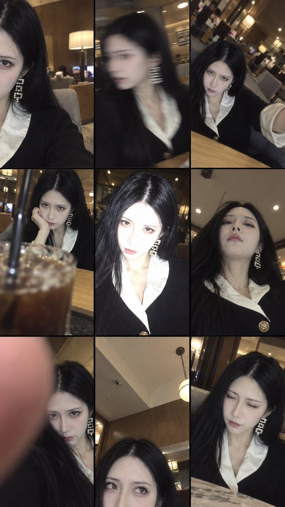

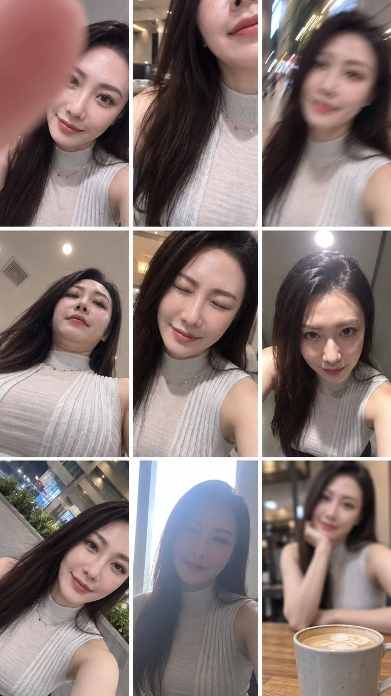

**Prompt**

```text
Numerosas fotos fallidas de aficionados, 3x3, 9:16
```

[↑ Volver a categorías](#catalog)

---

<a name="prompt-2100221410358735319"></a>

### Un prompt de selfis realistas en cuadrícula de 3x3 que imita una serie de fotos fallidas de aficionados.

Autor：[@oneruofeng](https://x.com/oneruofeng) · [Publicación original](https://x.com/oneruofeng/status/2100221410358735319)

Fotografía · Retrato / Selfie · Publicado

**Resumen:** Un prompt de selfis realistas en cuadrícula de 3x3 que imita una serie de fotos fallidas de aficionados.

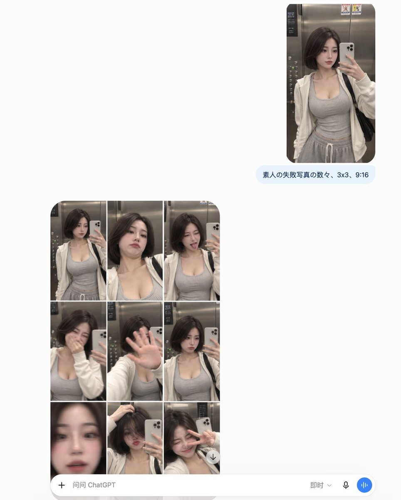

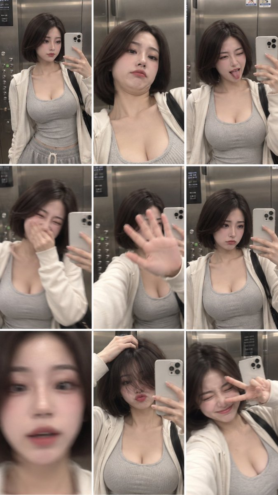

**Prompt**

```text
Una serie de fotos fallidas de aficionados, 3x3, 9:16
```

[↑ Volver a categorías](#catalog)

---

<a name="prompt-2100101909634036032"></a>

### Imagen en cuadrícula de 3x3 que recopila fotos instantáneas fallidas cotidianas de aficionados.

Autor：[@cnyzgkc](https://x.com/cnyzgkc) · [Publicación original](https://x.com/cnyzgkc/status/2100101909634036032)

Fotografía · Retrato / Selfie · Publicado

Publicación original：[@KinGao476942](https://x.com/KinGao476942) · [Publicación original](https://x.com/KinGao476942/status/2100086793995706689)

**Resumen:** Imagen en cuadrícula de 3x3 que recopila fotos instantáneas fallidas cotidianas de aficionados.

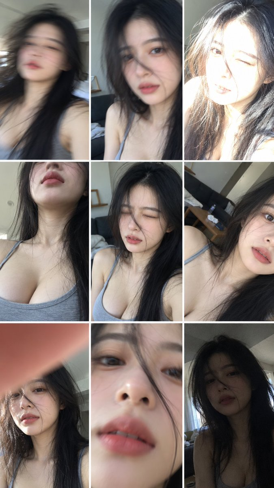

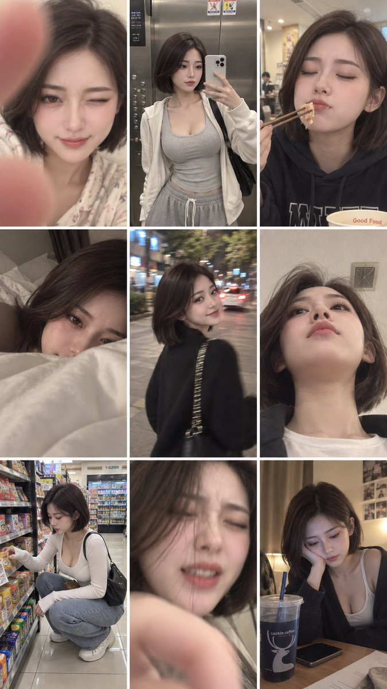

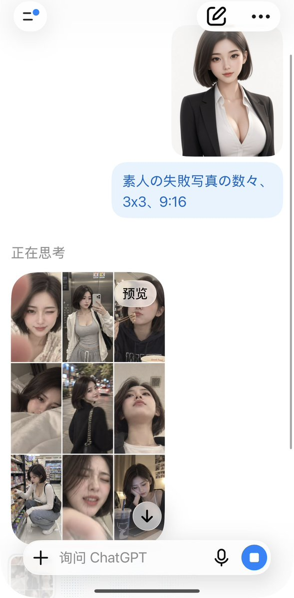

**Prompt**

```text
Numerosas fotos fallidas de aficionados, 3x3, 9:16
```

[↑ Volver a categorías](#catalog)

---

<a name="prompt-2100065803072897507"></a>

### Sesión fotográfica de novia con rostro de primer amor, perspectiva íntima, expresión tierna de enfado y un OOTD contrastante.

Autor：[@DeepBlueX0](https://x.com/DeepBlueX0) · [Publicación original](https://x.com/DeepBlueX0/status/2100065803072897507)

Fotografía · Retrato / Selfie · Artículo de moda · Publicado

Publicación original：[@DeepBlueX0](https://x.com/DeepBlueX0) · [Publicación original](https://x.com/DeepBlueX0/status/2099721592582656282)

**Resumen:** Sesión fotográfica de novia con rostro de primer amor, perspectiva íntima, expresión tierna de enfado y un OOTD contrastante.

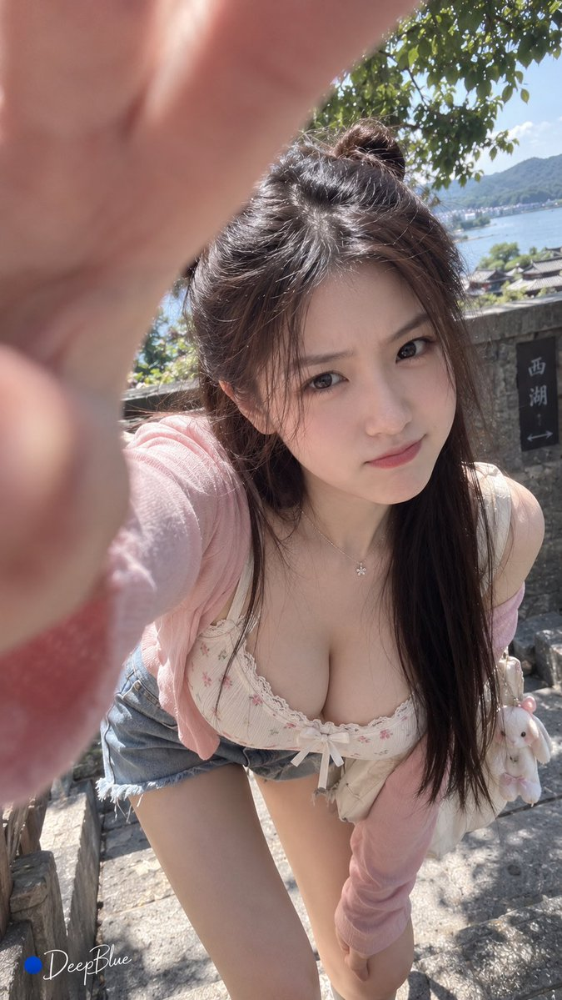

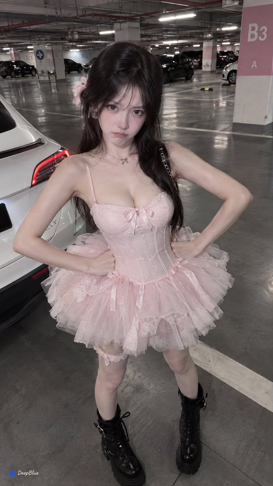

**Prompt**

```text
Novia con cara de primer amor × Intimidad ambigua × Lentes experimentales poco convencionales × OOTD en contraste × Expresión tierna de enfado y coquetería
```

[↑ Volver a categorías](#catalog)

---

<a name="prompt-2099520724121883039"></a>

### Traducción en curso

Autor：[@AIVideoHub\_](https://x.com/AIVideoHub_) · [Publicación original](https://x.com/AIVideoHub_/status/2099520724121883039)

Fotografía · Retrato / Selfie · Personaje · Artículo de moda · Paisaje urbano / Calle · Publicado

**Resumen:** Traducción en curso

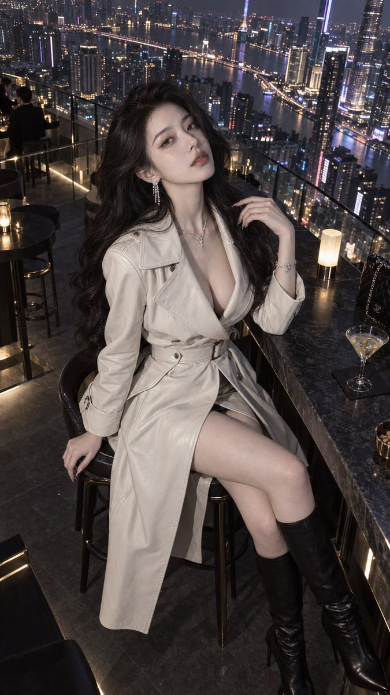

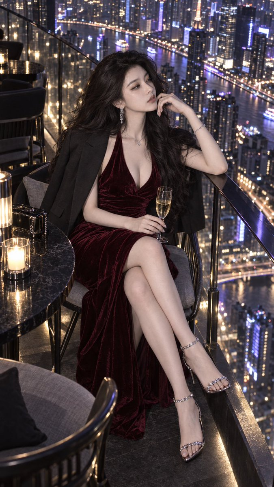

**Prompt**

```text
Traducción en curso
```

[↑ Volver a categorías](#catalog)

---

<a name="prompt-2099374878910734661"></a>

### Paisaje surrealista de cañón 9:16, gigantesco anillo de nubes arremolinadas con efecto time-stack de larga exposición, viajero de espaldas en el lecho del valle.

Autor：[@listudio](https://x.com/listudio) · [Publicación original](https://x.com/listudio/status/2099374878910734661)

Fotografía · Paisaje / Naturaleza · Publicado

**Resumen:** Paisaje surrealista de cañón 9:16, gigantesco anillo de nubes arremolinadas con efecto time-stack de larga exposición, viajero de espaldas en el lecho del valle.

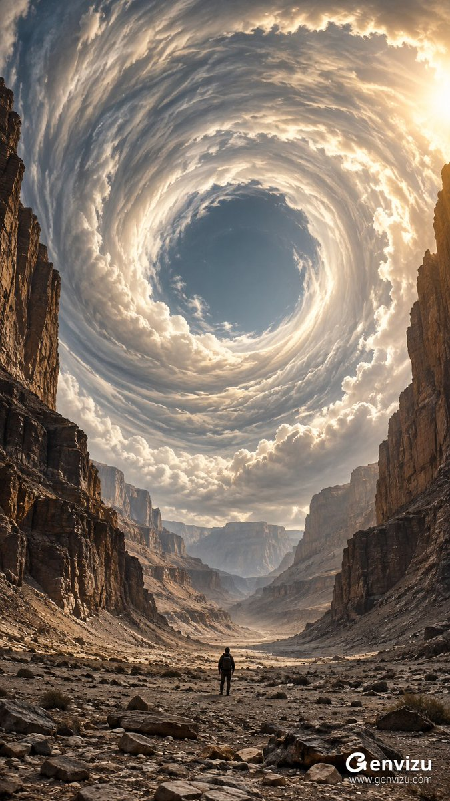

**Prompt**

```text
Crea una fotografía de apilamiento temporal (time-stack) hiperrealista y surrealista de un cañón en formato vertical 9:16. Un fondo de cañón amplio y seco, flanqueado por enormes paredes rocosas estratificadas verticales en tonos marrón cálido, ocre y negro carbón que se elevan desde los bordes del primer plano, formando un marco natural oscuro, con las texturas de la roca y la grava manteniendo un detalle nítido. En el cielo, en la distancia media y lejana del cañón, aparece un gigantesco anillo de nubes arremolinadas que ocupa la mayor parte del área central, revelando un sereno cielo azul grisáceo en el centro del hueco circular. Utiliza un efecto de exposición prolongada con cámara fija y apilamiento temporal de múltiples fotogramas: densos cúmulos giran lentamente en la misma dirección, fundiéndose en estelas concéntricas continuas y suaves; la pared interior presenta cientos y miles de delicadas estrías de nubes en forma de arco, y los bordes del hueco circular tienen trazos suaves de rotación; las nubes conservan su volumen real de luces y sombras y una textura blanco lechosa, sin parecer un túnel sólido ni mostrar ruido fracturado. El lecho del cañón se abre ampliamente desde el primer plano y converge hacia la lejanía; un viajero adulto de espaldas a la cámara se encuentra de pie en el centro inferior, ocupando solo alrededor del 2% de la altura de la imagen y manteniéndose nítido. La cálida luz del sol en la parte superior derecha atraviesa las grietas de las nubes; la exposición continua hace que las luces se difundan suavemente, iluminando la pared de nubes y los bordes rocosos del lado derecho; la roca cálida, el cielo azul grisáceo frío y las nubes blanco lechosas de gran brillo forman una relación tricromática contenida. Grano de película sutil, perspectiva atmosférica natural, silencio épico y sensación sobrecogedora. El desenfoque de movimiento solo afecta a las nubes y a una leve bruma de polvo; las paredes de roca, el lecho del valle y la figura humana permanecen nítidos. Sin edificios, sin bosques densos, sin aves volando, sin texto, sin logotipos, sin marcas de agua, sin rayos.
```

[↑ Volver a categorías](#catalog)

---

<a name="prompt-2099375219546935317"></a>

### Traducción en curso

Autor：[@listudio](https://x.com/listudio) · [Publicación original](https://x.com/listudio/status/2099375219546935317)

Fotografía · Publicado

**Resumen:** Traducción en curso

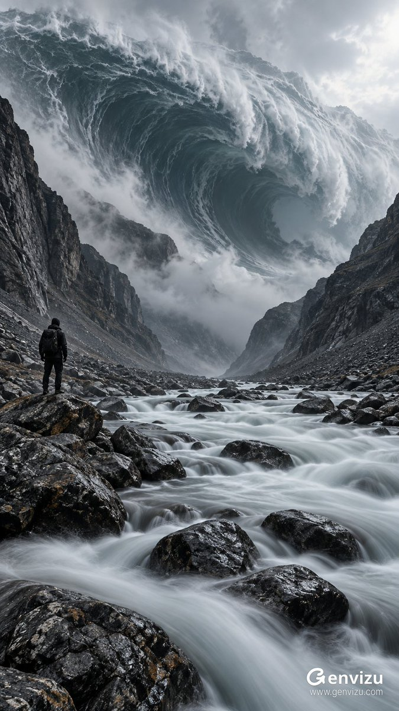

**Prompt**

```text
Traducción en curso
```

[↑ Volver a categorías](#catalog)

---

<a name="prompt-2099375039166747111"></a>

### Traducción en curso

Autor：[@listudio](https://x.com/listudio) · [Publicación original](https://x.com/listudio/status/2099375039166747111)

Fotografía · Personaje · Paisaje / Naturaleza · Publicado

**Resumen:** Traducción en curso

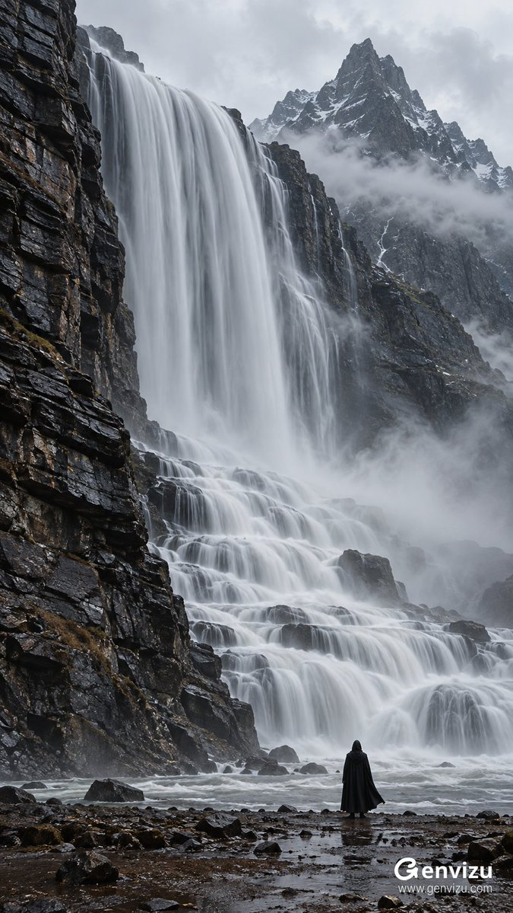

**Prompt**

```text
Traducción en curso
```

[↑ Volver a categorías](#catalog)

---

<a name="prompt-2099378304985989553"></a>

### Generar una fotografía en cuadrícula 3x3 de 9 paneles con características de divertidas tomas fallidas, como un dedo tapando la lente, desenfoque o movimiento.

Autor：[@Jane20121221](https://x.com/Jane20121221) · [Publicación original](https://x.com/Jane20121221/status/2099378304985989553)

Fotografía · Publicado

**Resumen:** Generar una fotografía en cuadrícula 3x3 de 9 paneles con características de divertidas tomas fallidas, como un dedo tapando la lente, desenfoque o movimiento.

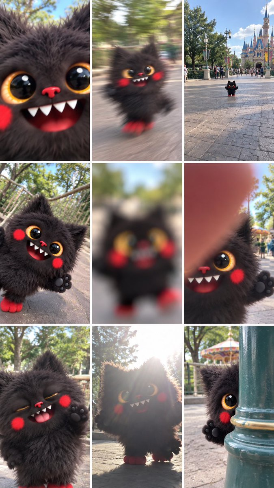

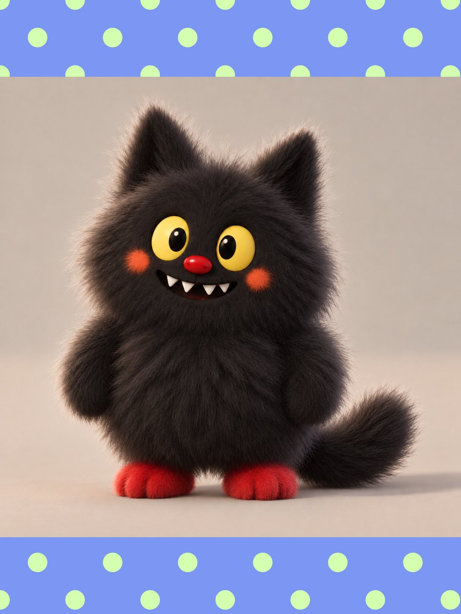

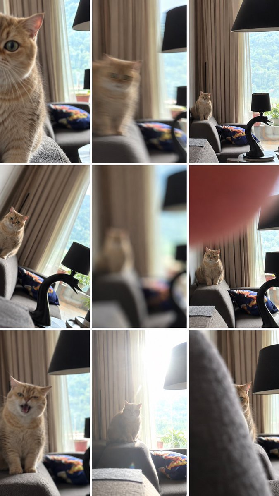

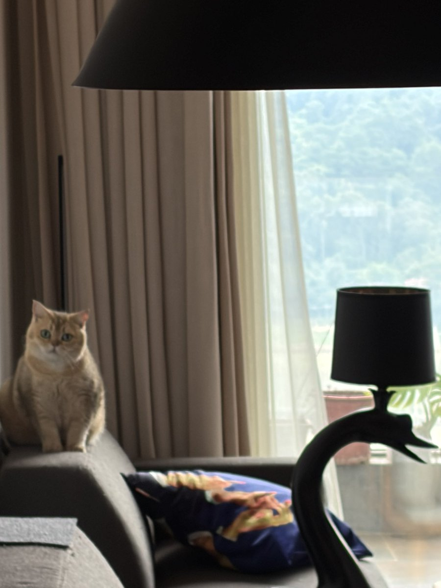

**Prompt**

```text
Diversas fotos fallidas de aficionados, 3x3, 9:16
```

[↑ Volver a categorías](#catalog)

---

<a name="prompt-2099106601538097211"></a>

### Instantánea realista desde la perspectiva de alguien sentado en el tren de una joven japonesa agarrada a una correa con top de tirantes y escote en V pronunciado.

Autor：[@SGRationalnvest](https://x.com/SGRationalnvest) · [Publicación original](https://x.com/SGRationalnvest/status/2099106601538097211)

Fotografía · Retrato / Selfie · Personaje · Vehículo · Publicado

**Resumen:** Instantánea realista desde la perspectiva de alguien sentado en el tren de una joven japonesa agarrada a una correa con top de tirantes y escote en V pronunciado.

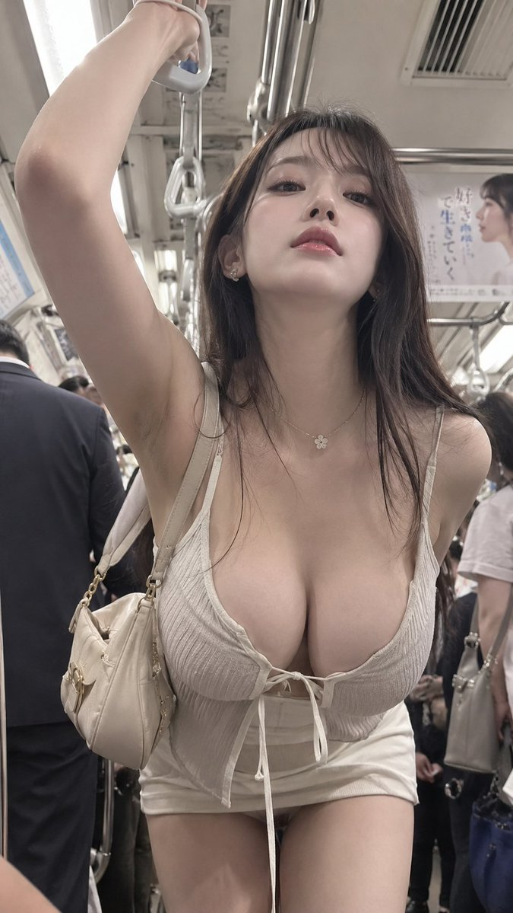

**Prompt**

```text
24 años, mujer japonesa, tren, vista frontal, cuerpo inclinado hacia adelante, agarrando una correa de sujeción alta, axila visible, tirantes con escote en V pronunciado, mirada al frente, expresión de mirar hacia abajo, perspectiva de una persona sentada, foto de teléfono móvil, textura realista, toma vertical
```

[↑ Volver a categorías](#catalog)

---

<a name="prompt-2098866288957551034"></a>

### Un fotograma fotorrealista de superproducción de una mujer con un abrigo de montar color carbón saltando sobre un río de piedras secas a lomos de un ciervo de cuarzo vivo bajo un sol implacable.

Autor：[@TraffAlex](https://x.com/TraffAlex) · [Publicación original](https://x.com/TraffAlex/status/2098866288957551034)

Fotografía · Personaje · Publicado

**Resumen:** Un fotograma fotorrealista de superproducción de una mujer con un abrigo de montar color carbón saltando sobre un río de piedras secas a lomos de un ciervo de cuarzo vivo bajo un sol implacable.


**Prompt**

```text
Un fotograma fotorrealista de superproducción cinematográfica. Una mujer con un abrigo de montar color carbón se aferra al cuello de un ciervo cuyo cuerpo es de cuarzo vivo, con astas como una lámpara de araña de puntas que despiden fragmentos de luz diurna. Están en pleno salto sobre un río seco de piedras blancas, los cascos aún en el aire, su abrigo ondeando como una bandera. Sol implacable, arcoíris prismáticos sobre su mejilla. Paleta: cuarzo, carbón, cielo desteñido, un toque de su piel cálida. Cinético, sin rifle de montura, sin violencia: velocidad. 35 mm, relación de aspecto 2:3.
```

[↑ Volver a categorías](#catalog)

---

<a name="prompt-2098868060228927512"></a>

### Fotograma de acción fotorrealista en la selva de una mujer vestida de caqui embarrado que huye de un monstruo vegetal floral bajo la lluvia.

Autor：[@TraffAlex](https://x.com/TraffAlex) · [Publicación original](https://x.com/TraffAlex/status/2098868060228927512)

Fotografía · Personaje · Publicado

**Resumen:** Fotograma de acción fotorrealista en la selva de una mujer vestida de caqui embarrado que huye de un monstruo vegetal floral bajo la lluvia.


**Prompt**

```text
Un fotograma de acción fotorrealista en el borde de la selva. Una mujer vestida de caqui salpicado de barro corre hacia la cámara con los ojos muy abiertos; detrás de ella, un ogro de tres pisos construido con heliconias mojadas, jengibre y ave del paraíso, con una boca de brácteas rojas abriéndose y polen flotando como humo. Lluvia. Paleta: rojo cadmio, verde selva, caqui, el amarillo del pico de una heliconia. Los pétalos se desprenden a su paso. 35 mm, lluvia en la lente. Relación de aspecto 2:3.
```

[↑ Volver a categorías](#catalog)

---

<a name="prompt-2098799449237782991"></a>

### Traducción en curso

Autor：[@DeepBlueX0](https://x.com/DeepBlueX0) · [Publicación original](https://x.com/DeepBlueX0/status/2098799449237782991)

Fotografía · Retrato / Selfie · Personaje · Artículo de moda · Publicado

Publicación original：[@DeepBlueX0](https://x.com/DeepBlueX0) · [Publicación original](https://x.com/DeepBlueX0/status/2097630845435572490)

**Resumen:** Traducción en curso


**Prompt**

```text
Traducción en curso
```

[↑ Volver a categorías](#catalog)

---

<a name="prompt-2098610123900064236"></a>

### Una instantánea de viaje espontánea de una mujer de Asia oriental con orejas de ratón posando frente a un castillo de fantasía.

Autor：[@Aqsahere\_](https://x.com/Aqsahere_) · [Publicación original](https://x.com/Aqsahere_/status/2098610123900064236)

Fotografía · Personaje · Publicado

**Resumen:** Una instantánea de viaje espontánea de una mujer de Asia oriental con orejas de ratón posando frente a un castillo de fantasía.


**Prompt**

```text
Una foto de viaje realista y espontánea de una joven mujer de Asia oriental pasando un día divertido y mágico en un castillo de cuento de hadas. Está de pie frente a un imponente castillo de fantasía de estilo europeo con altas torres de color marfil, elegantes tejados azules, agujas doradas, intrincados detalles de piedra y una hermosa arquitectura del viejo mundo. El castillo ocupa la mayor parte del fondo, dando a la escena un aire soñador de vacaciones en un parque temático.
Tiene el pelo largo, castaño rojizo y con ondas naturales, cayendo suavemente sobre sus hombros y espalda. Lleva una bonita diadema con orejas de ratón brillantes en azul y lavanda y sonríe de forma natural mientras mira ligeramente hacia arriba y hacia un lado, como si hubiera sido capturada en un momento de auténtica felicidad.
Viste una chaqueta corta texturizada de color blanco crema con botones dorados sobre una impecable camisa blanca de cuello y una corbata de cuadros con estampado. Su falda-pantalón de tiro alto de cuadros en tonos beige, crema y azul apagado tiene suaves pliegues que se mueven de forma natural con su pose.
Extiende ambos brazos hacia afuera y se inclina ligeramente hacia la cámara con una energía emocionada y juguetona. La postura parece espontánea en lugar de posada, como una instantánea real de vacaciones.
El patio del castillo detrás de ella tiene amplios escalones de piedra clara, barandillas decorativas, pancartas coloridas y una arquitectura detallada de inspiración medieval. El cielo está suavemente nublado con nubes de color azul grisáceo pálido, creando una luz diurna tenue y favorecedora con sombras naturales.
Fotografía de viajes ultra fotorrealista, apariencia juvenil auténtica, textura de piel realista, mechones de pelo naturales, texturas de tela detalladas, proporciones creíbles, suave profundidad de campo, sombras naturales sutiles, colores vibrantes pero ligeramente apagados, estética de foto espontánea de smartphone, atmósfera soñadora de vacaciones, altamente detallada, composición vertical de 3:4.
```

[↑ Volver a categorías](#catalog)

---

<a name="prompt-2098616431122559479"></a>

### Prompt de fotografía documental de estudiante en el patio del campus estilo instantánea de iPhone

Autor：[@DeepBlueX0](https://x.com/DeepBlueX0) · [Publicación original](https://x.com/DeepBlueX0/status/2098616431122559479)

Fotografía · Retrato / Selfie · Publicado

Publicación original：[@DDJCXX](https://x.com/DDJCXX) · [Publicación original](https://x.com/DDJCXX/status/2098240447038767437)

**Resumen:** Prompt de fotografía documental de estudiante en el patio del campus estilo instantánea de iPhone


**Prompt**

```text
Documental de la vida cotidiana en el campus; momento fortuito y divertido; instantánea con la cámara original de iPhone; hombros estrechos y cintura diminuta·estudiante con busto exuberante🙆🏻‍♀️
```

[↑ Volver a categorías](#catalog)

---

<a name="prompt-2098277829154951371"></a>

### Fotografía artística costera asimétrica con un velero rosa coral fondeado en una cala desierta y tranquila, enmarcado por pinos a la derecha.

Autor：[@listudio](https://x.com/listudio) · [Publicación original](https://x.com/listudio/status/2098277829154951371)

Fotografía · Vehículo · Publicado

**Resumen:** Fotografía artística costera asimétrica con un velero rosa coral fondeado en una cala desierta y tranquila, enmarcado por pinos a la derecha.


**Prompt**

```text
Crea una fotografía artística costera vertical de 3:4. Una cala tranquila y desierta, con un cielo despejado azul grisáceo que ocupa el 70% superior y una línea de horizonte azul oscuro recta en la parte inferior. Un pequeño velero monocasco realista fondeado en la parte inferior central, ligeramente a la izquierda, con un mástil delgado que se eleva hacia el cielo, una vela triangular de color rosa coral suavemente hinchada, tensión creíble en las costuras de la lona, una estrecha franja azul oscuro en la base de la vela, cabina blanca rosácea, ventanas negras profundas, casco inferior rojo coral y un aparejo fino y verosímil. La superficie del agua, en calma y de tono azul cian, presenta finas ondas horizontales y suaves reflejos rosados fragmentados. En el lado derecho, un pino oscuro crea un encuadre asimétrico, con el tronco naciendo desde abajo a la derecha y la copa entrando desde arriba a la derecha, con acículas que muestran sutiles toques de luz solar de color rosa rojizo oscuro, preservando una gran extensión de cielo. En la parte inferior absoluta, una franja de playa de arena fina blanco-rosada con sombras tenues del árbol. Casco, corteza, acículas y agua de mar realistas, luz solar nítida, sombras profundas, grano de película sutil, textura de impresión mate sobria, colores surrealistas pero con relaciones espaciales creíbles, serenidad prolongada y distanciamiento onírico. Sin personas, texto, logotipo ni marcas de agua.
```

[↑ Volver a categorías](#catalog)

---

<a name="prompt-2098277612053561383"></a>

### Fotografía artística surrealista de una orilla de sal blanca y rosada con agua de mar en degradado de rojo coral a azul oscuro.

Autor：[@listudio](https://x.com/listudio) · [Publicación original](https://x.com/listudio/status/2098277612053561383)

Fotografía · Paisaje / Naturaleza · Publicado

**Resumen:** Fotografía artística surrealista de una orilla de sal blanca y rosada con agua de mar en degradado de rojo coral a azul oscuro.


**Prompt**

```text
Crea una fotografía artística surrealista en color en formato vertical 3:4. Una costa desierta sin personas, el cuarto superior es un cielo azul cobalto grisáceo uniforme, con una orilla lejana de color rosa pálido sumamente fina que cruza un horizonte elevado. Una pared costera salina de color blanco rosáceo se extiende desde la izquierda hacia el primer plano inferior, con granos cristalinos rugosos, grava suelta y bordes erosionados de forma natural claramente visibles, formando una costa de curva suave y asimétrica. Las aguas poco profundas cerca de la orilla muestran un intenso rojo coral, bermellón y rosa, con unas pocas olas finas y rotas que avanzan en diagonal hacia la parte inferior derecha, pasando gradualmente al agua marina azul de Prusia oscuro de la derecha; el agua tiene una transparencia realista, ondas finas y reflejos, sin parecer pintura ni lava. Luz lateral de día soleado, luces altas blanco-rosáceas que conservan los detalles, grandes bloques limpios de color en contraste con texturas microscópicas reales, grano de película fino, sensación de impresión mate, silenciosa, extraña, ardiente y a la vez fría. Fotografía a sangre completa, sin texto, bordes, logotipos ni marcas de agua.
```

[↑ Volver a categorías](#catalog)

---

<a name="prompt-2098277688498880901"></a>

### Fotografía de retrato de caballo pinto de pelaje rojo surrealista, con fondo de cielo azul puro.

Autor：[@listudio](https://x.com/listudio) · [Publicación original](https://x.com/listudio/status/2098277688498880901)

Fotografía · Retrato / Selfie · Resumen / Antecedentes · Publicado

**Resumen:** Fotografía de retrato de caballo pinto de pelaje rojo surrealista, con fondo de cielo azul puro.


**Prompt**

```text
Crea una fotografía artística de retrato animal surrealista en formato vertical 3:4. Plano contrapicado de la cabeza, el cuello, los hombros y el pecho de un caballo pinto robusto; el cuerpo está cortado de forma natural en la parte inferior y a la derecha; la cabeza del caballo se ubica en la zona media-inferior girada en vista de tres cuartos hacia la izquierda; las orejas están erguidas de forma natural; los ojos, negros, profundos y húmedos, tienen un diminuto reflejo. El tercio superior queda reservado a un cielo azul cobalto puro y sin nubes. Pelaje con un recoloreado surrealista y minucioso, con una base intensa en rojo ladrillo y rojo coral, grandes manchas irregulares de color blanco rosáceo desde el puente nasal hasta el hocico, y un sutil azul oscuro entre las manchas rojas y blancas de los hombros y el pecho. Las largas crines ondean hacia la izquierda mecidas por un fuerte viento que sopla desde la derecha, con finas hebras superpuestas donde los mechones rojo brillante se entrelazan con sombras en tono vino tinto oscuro, cayendo parcialmente sobre el cuello. Detalles realistas en el pelo corto, los ollares, los bigotes y la musculatura. Luz lateral natural y brillante, sombras densas y con relieve, fotografía nítida que congela el instante, grano sutil de película y tonos mates, con una marcada sensación editorial de moda, salvaje y libre. Sin arreos, personas, texto, logotipo ni marca de agua.
```

[↑ Volver a categorías](#catalog)

---

<a name="prompt-2098277762410942530"></a>

### Fotografía botánica surrealista de cactus en contraste de rojo y azul, con cactus planos rojo coral y cactus columnar azul cobalto oscuro.

Autor：[@listudio](https://x.com/listudio) · [Publicación original](https://x.com/listudio/status/2098277762410942530)

Fotografía · Publicado

**Resumen:** Fotografía botánica surrealista de cactus en contraste de rojo y azul, con cactus planos rojo coral y cactus columnar azul cobalto oscuro.


**Prompt**

```text
Crea una fotografía artística botánica surrealista en formato vertical 3:4. Con un cielo azul celeste despejado y ligeramente grisáceo de fondo, se observa en contrapicado un grupo de cactus reales que crecen desde el borde inferior y aparecen recortados. Desde la izquierda hacia el centro hay de tres a cinco palas de cactus planas y ovaladas escalonadas, la más alta inclinada ligeramente hacia la izquierda, con la piel recoloreada en rojo coral y rojo sandía vibrantes, conservando un acabado mate ceroso, finas arrugas onduladas y areolas regulares pero no mecánicas. A la derecha, un cactus columnar alto de color azul cobalto oscuro, con costillas verticales pronunciadas, surcos en azul de Prusia profundo y espinas estrelladas de color rojo bermellón alineadas a lo largo del borde de las costillas. En la base, unas pocas palas planas azules se superponen con pequeñas palas rojas, con capas claras, dejando un espacio de cielo en la parte superior izquierda. La intensa luz solar natural desde la parte superior izquierda resalta el volumen y las espinas de la planta; los colores vivos se adhieren a un tejido vegetal creíble. Composición asimétrica de escultura geométrica, textura fotográfica fina, grano de película sutil y mate sobrio, evitando el aspecto de plástico o render 3D. Sin macetas, flores, texto, logotipos ni marcas de agua.
```

[↑ Volver a categorías](#catalog)

---

<a name="prompt-2097886029692969195"></a>

### Prompt de fotografía selfie frente al espejo en el dormitorio de una influencer china, mostrando peinado corto, ropa escotada y estilo de iluminación interior suave.

Autor：[@ohmuyi](https://x.com/ohmuyi) · [Publicación original](https://x.com/ohmuyi/status/2097886029692969195)

Fotografía · Retrato / Selfie · Influencer / Modelo · Artículo de moda · Arquitectura / Interiorismo · Publicado

**Resumen:** Prompt de fotografía selfie frente al espejo en el dormitorio de una influencer china, mostrando peinado corto, ropa escotada y estilo de iluminación interior suave.


**Prompt**

```text
3:4, selfie de cerca en el espejo con el móvil, influencer china, piel blanca de tono frío, corte bob corto negro con flequillo recto y ligero, camiseta ajustada de manga corta con escote pronunciado, el teléfono cubre un tercio del lado derecho de la cara, dormitorio con cama blanca y espejo de marco negro, luz interior suave, tierna y cautivadora
```

[↑ Volver a categorías](#catalog)

---

<a name="prompt-2097532595814940683"></a>

### Prompt de foto de viaje realista de una joven mujer de Asia oriental en la orilla de Monte Saint-Michel.

Autor：[@saniaspeaks\_](https://x.com/saniaspeaks_) · [Publicación original](https://x.com/saniaspeaks_/status/2097532595814940683)

Fotografía · Retrato / Selfie · Personaje · Publicado

**Resumen:** Prompt de foto de viaje realista de una joven mujer de Asia oriental en la orilla de Monte Saint-Michel.


**Prompt**

```text
Un retrato de viaje espontáneo y fotorrealista de una joven mujer de Asia oriental de pie en una tranquila orilla arenosa junto a grandes rocas cubiertas de musgo, con una magnífica abadía histórica de piedra y una arquitectura similar a un castillo medieval que se alza espectacularmente sobre una isla rocosa detrás de ella. Tiene el cabello largo, liso y de color castaño oscuro que cae de forma natural sobre un hombro, rasgos faciales suaves y juveniles, y una sonrisa cálida y apacible mientras mira directamente a la cámara.

Viste un abrigo largo negro de corte holgado con las manos metidas con naturalidad en los bolsillos, sobre un atuendo de color claro. Una bufanda grande y suave de color blanco crema le envuelve el cuello con calidez, cayendo por la parte delantera con un pequeño emblema negro de estilo diseñador cerca del extremo. Se aprecia parcialmente un delicado bolso de hombro con cadena.

La composición la sitúa en primer plano mientras la vasta abadía histórica domina el fondo, rodeada de antiguas murallas de piedra, acantilados rocosos, llanuras mareales arenosas y una tranquila atmósfera costera. Unos pocos vehículos y personas diminutos a lo lejos aportan una escala realista a la escena. La suave luz natural del atardecer y un cielo despejado de color azul pálido crean un pacífico ambiente de viaje europeo.

Fotografía ultrarrealista, auténtica foto de viaje espontánea, textura de piel natural, detalles realistas de las telas, iluminación cinematográfica suave, estética sutil de cámara de smartphone, etalonaje de color ligeramente de ensueño, proporciones naturales, arquitectura detallada, ambiente costero tranquilo, composición vertical, relación de aspecto 3:4.
```

[↑ Volver a categorías](#catalog)

---

<a name="prompt-2097411028510179759"></a>

### Prompt de foto de paisaje en alta definición de un claro en el bosque con densa vegetación verde.

Autor：[@mark\_k](https://x.com/mark_k) · [Publicación original](https://x.com/mark_k/status/2097411028510179759)

Fotografía · Paisaje / Naturaleza · Publicado

**Resumen:** Prompt de foto de paisaje en alta definición de un claro en el bosque con densa vegetación verde.


**Prompt**

```text
Foto de un claro en el bosque con abundante follaje verde, altamente detallada
```

[↑ Volver a categorías](#catalog)

---

<a name="prompt-2100935621976191407"></a>

### Traducción en curso

Autor：[@CyberTotal2026](https://x.com/CyberTotal2026) · [Publicación original](https://x.com/CyberTotal2026/status/2100935621976191407)

Fotografía · Retrato / Selfie · Personaje · Publicado

**Resumen:** Traducción en curso

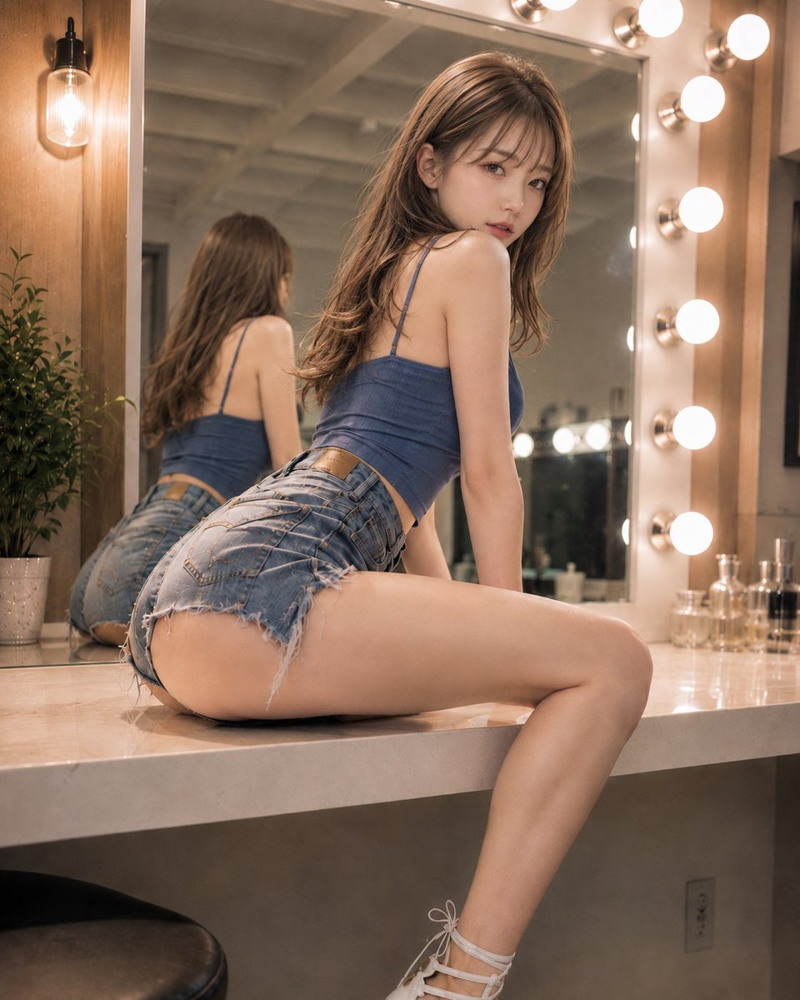

**Prompt**

```text
Traducción en curso
```

[↑ Volver a categorías](#catalog)

---

<a name="prompt-2100848799484915933"></a>

### Traducción en curso

Autor：[@CyberTotal2026](https://x.com/CyberTotal2026) · [Publicación original](https://x.com/CyberTotal2026/status/2100848799484915933)

Fotografía · Personaje · Paisaje urbano / Calle · Publicado

**Resumen:** Traducción en curso

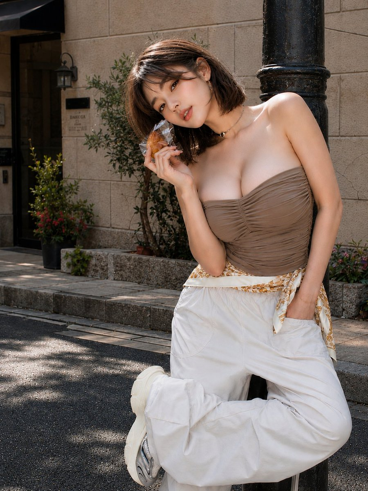

**Prompt**

```text
Traducción en curso
```

[↑ Volver a categorías](#catalog)

---

<a name="prompt-2100819355332427950"></a>

### Traducción en curso

Autor：[@CyberTotal2026](https://x.com/CyberTotal2026) · [Publicación original](https://x.com/CyberTotal2026/status/2100819355332427950)

Fotografía · Retrato / Selfie · Personaje · Resumen / Antecedentes · Publicado

**Resumen:** Traducción en curso

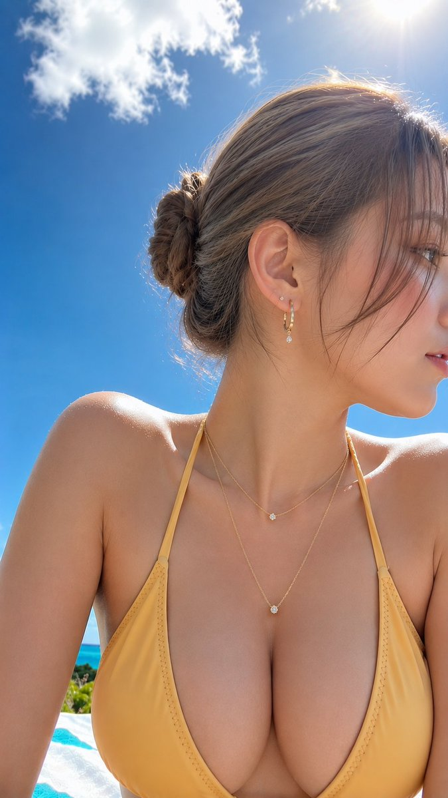

**Prompt**

```text
Traducción en curso
```

[↑ Volver a categorías](#catalog)

---

<a name="prompt-2100759210703421826"></a>

### Traducción en curso

Autor：[@CyberTotal2026](https://x.com/CyberTotal2026) · [Publicación original](https://x.com/CyberTotal2026/status/2100759210703421826)

Fotografía · Retrato / Selfie · Personaje · Publicado

**Resumen:** Traducción en curso

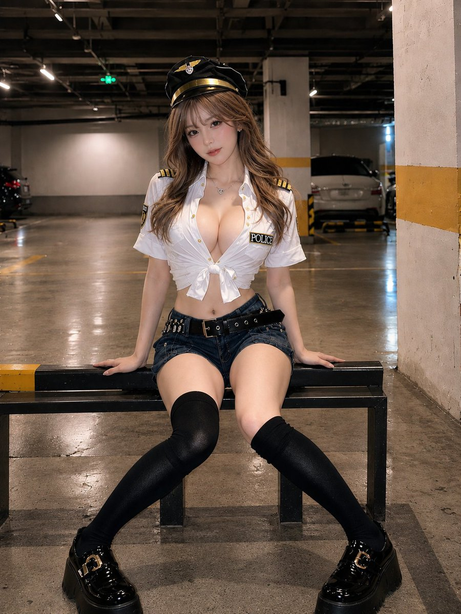

**Prompt**

```text
Traducción en curso
```

[↑ Volver a categorías](#catalog)

---

<a name="prompt-2100454954330980559"></a>

### Traducción en curso

Autor：[@CyberTotal2026](https://x.com/CyberTotal2026) · [Publicación original](https://x.com/CyberTotal2026/status/2100454954330980559)

Fotografía · Retrato / Selfie · Personaje · Publicado

**Resumen:** Traducción en curso

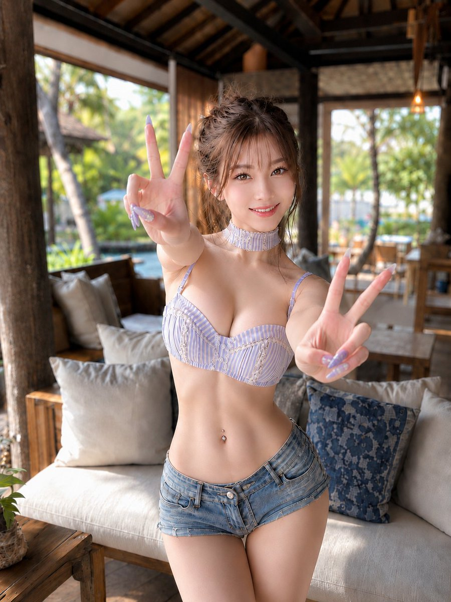

**Prompt**

```text
Traducción en curso
```

[↑ Volver a categorías](#catalog)

---

<a name="prompt-2100486914876850304"></a>

### Traducción en curso

Autor：[@CyberTotal2026](https://x.com/CyberTotal2026) · [Publicación original](https://x.com/CyberTotal2026/status/2100486914876850304)

Fotografía · Personaje · Artículo de moda · Resumen / Antecedentes · Publicado

**Resumen:** Traducción en curso

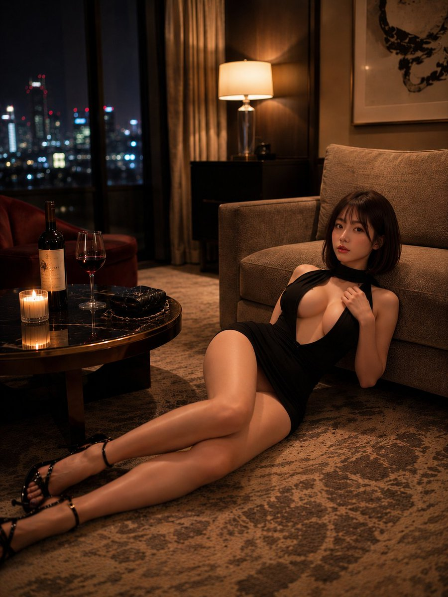

**Prompt**

```text
Traducción en curso
```

[↑ Volver a categorías](#catalog)

---

<a name="prompt-2100425761840890004"></a>

### Traducción en curso

Autor：[@CyberTotal2026](https://x.com/CyberTotal2026) · [Publicación original](https://x.com/CyberTotal2026/status/2100425761840890004)

Fotografía · Retrato / Selfie · Personaje · Artículo de moda · Publicado

**Resumen:** Traducción en curso

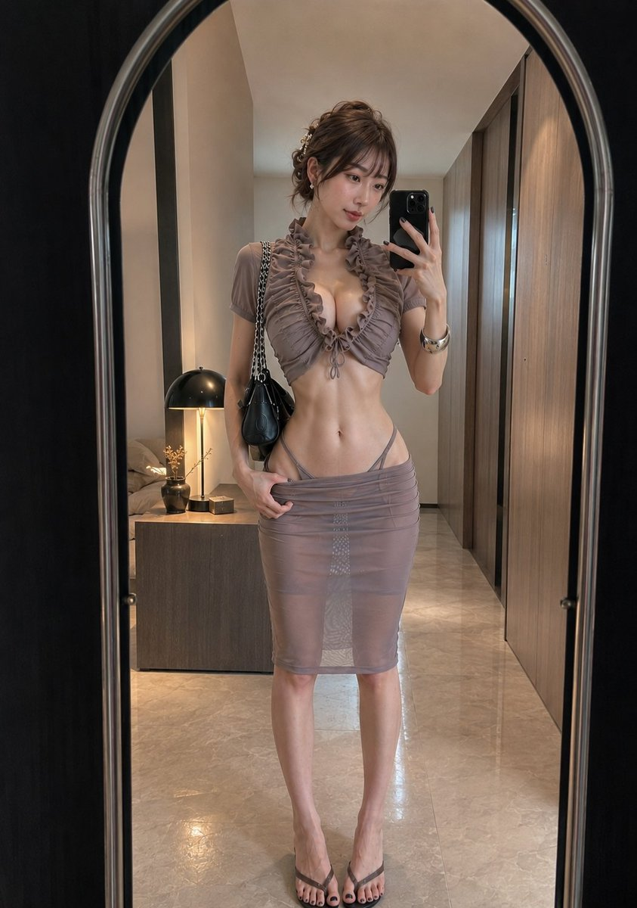

**Prompt**

```text
Traducción en curso
```

[↑ Volver a categorías](#catalog)

---

<a name="prompt-2100394808036516139"></a>

### Traducción en curso

Autor：[@CyberTotal2026](https://x.com/CyberTotal2026) · [Publicación original](https://x.com/CyberTotal2026/status/2100394808036516139)

Fotografía · Retrato / Selfie · Personaje · Paisaje / Naturaleza · Publicado

**Resumen:** Traducción en curso

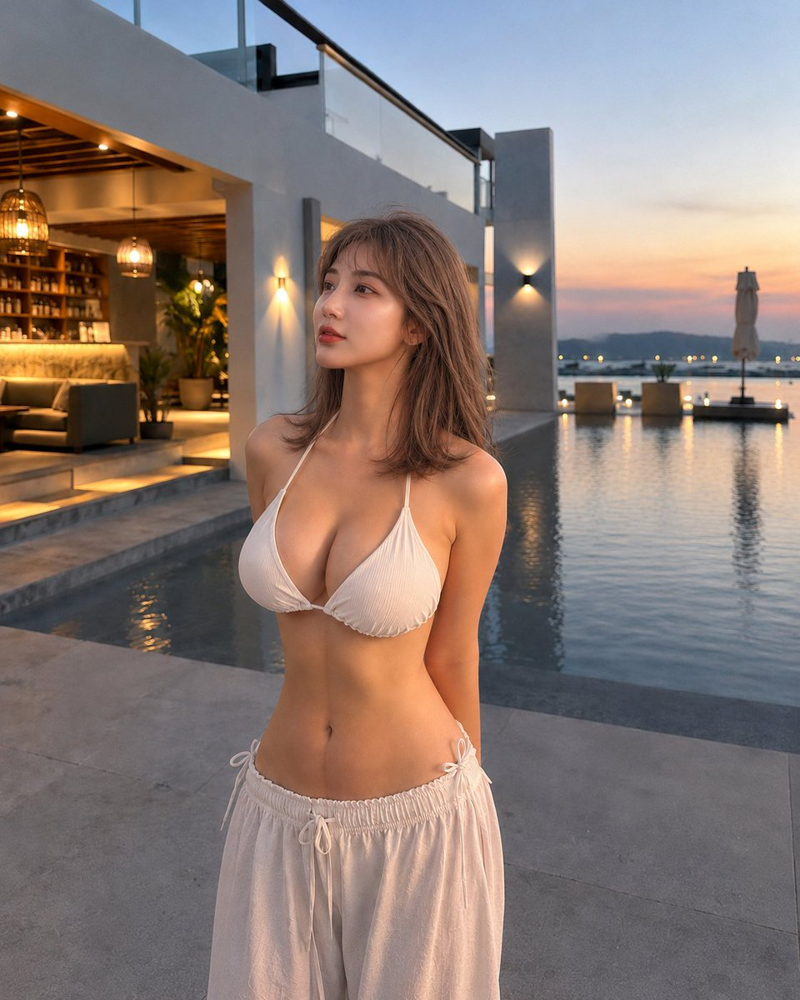

**Prompt**

```text
Traducción en curso
```

[↑ Volver a categorías](#catalog)

---

<a name="prompt-2100350516463046998"></a>

### Traducción en curso

Autor：[@CyberTotal2026](https://x.com/CyberTotal2026) · [Publicación original](https://x.com/CyberTotal2026/status/2100350516463046998)

Fotografía · Retrato / Selfie · Personaje · Publicado

**Resumen:** Traducción en curso

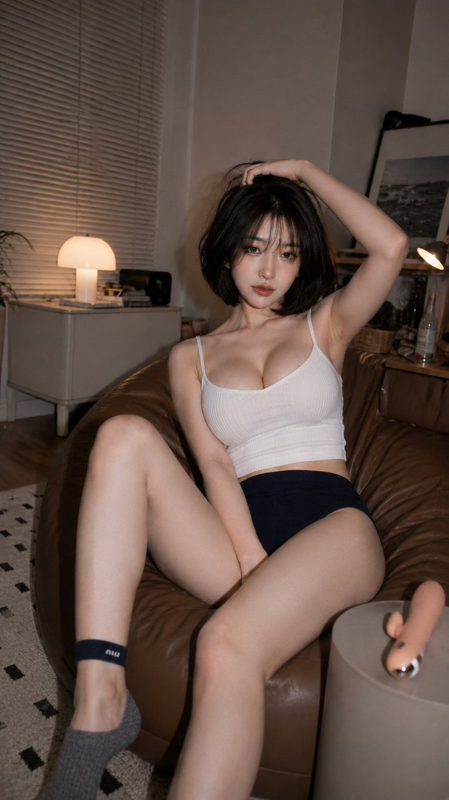

**Prompt**

```text
Traducción en curso
```

[↑ Volver a categorías](#catalog)

---

<a name="prompt-2100209587974508608"></a>

### Traducción en curso

Autor：[@CyberTotal2026](https://x.com/CyberTotal2026) · [Publicación original](https://x.com/CyberTotal2026/status/2100209587974508608)

Fotografía · Retrato / Selfie · Personaje · Arquitectura / Interiorismo · Publicado

**Resumen:** Traducción en curso

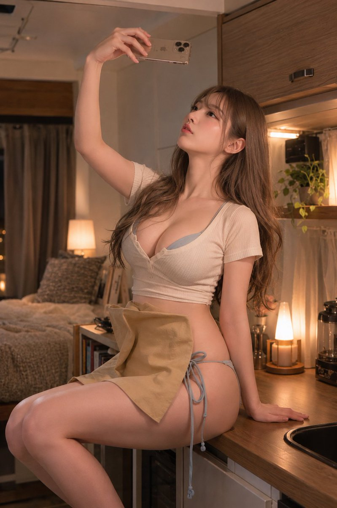

**Prompt**

```text
Traducción en curso
```

[↑ Volver a categorías](#catalog)

---

<a name="prompt-2100121758799974473"></a>

### Traducción en curso

Autor：[@CyberTotal2026](https://x.com/CyberTotal2026) · [Publicación original](https://x.com/CyberTotal2026/status/2100121758799974473)

Fotografía · Retrato / Selfie · Personaje · Artículo de moda · Publicado

**Resumen:** Traducción en curso

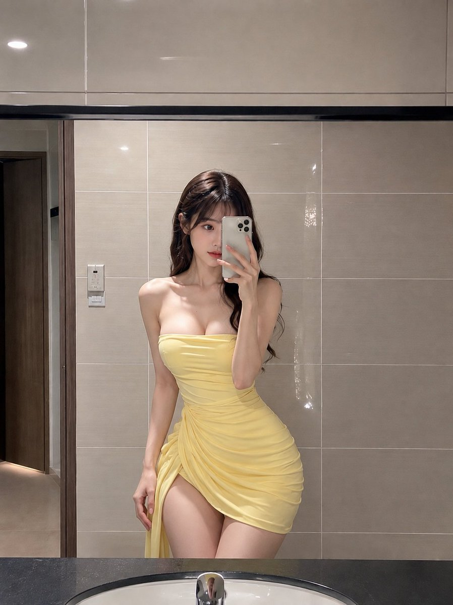

**Prompt**

```text
Traducción en curso
```

[↑ Volver a categorías](#catalog)

---

<a name="prompt-2100088791751135719"></a>

### Traducción en curso

Autor：[@CyberTotal2026](https://x.com/CyberTotal2026) · [Publicación original](https://x.com/CyberTotal2026/status/2100088791751135719)

Fotografía · Personaje · Publicado

**Resumen:** Traducción en curso

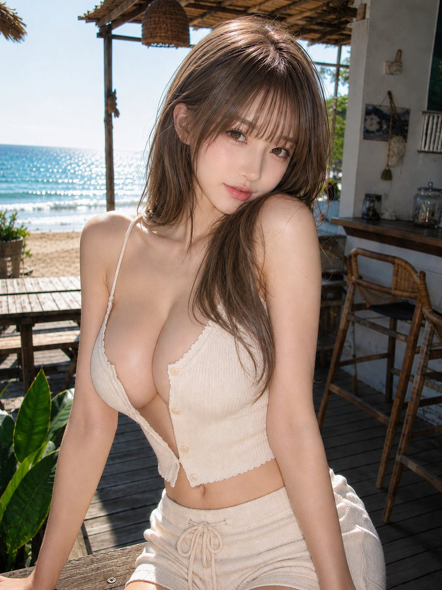

**Prompt**

```text
Traducción en curso
```

[↑ Volver a categorías](#catalog)

---

<a name="prompt-2100064633839030572"></a>

### Traducción en curso

Autor：[@CyberTotal2026](https://x.com/CyberTotal2026) · [Publicación original](https://x.com/CyberTotal2026/status/2100064633839030572)

Fotografía · Retrato / Selfie · Personaje · Publicado

**Resumen:** Traducción en curso

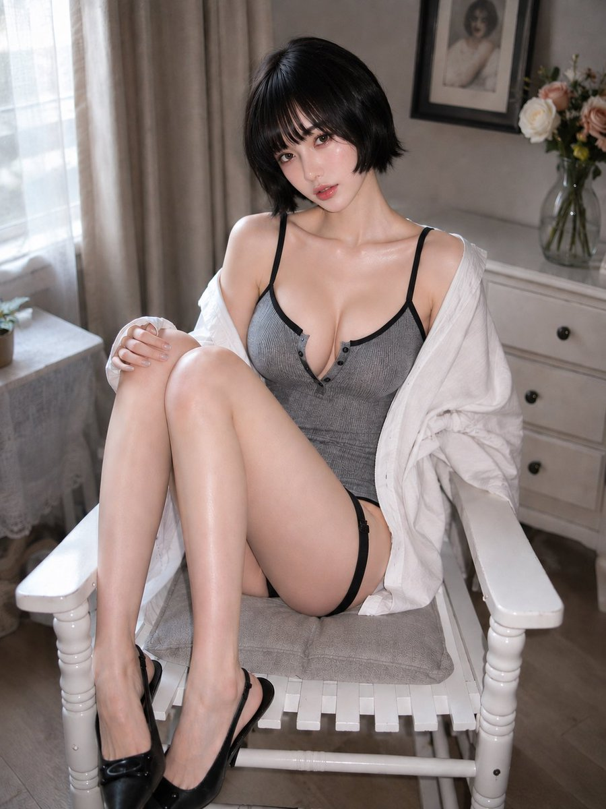

**Prompt**

```text
Traducción en curso
```

[↑ Volver a categorías](#catalog)

---

<a name="prompt-2100027640358805923"></a>

### Traducción en curso

Autor：[@CyberTotal2026](https://x.com/CyberTotal2026) · [Publicación original](https://x.com/CyberTotal2026/status/2100027640358805923)

Fotografía · Retrato / Selfie · Personaje · Artículo de moda · Publicado

**Resumen:** Traducción en curso

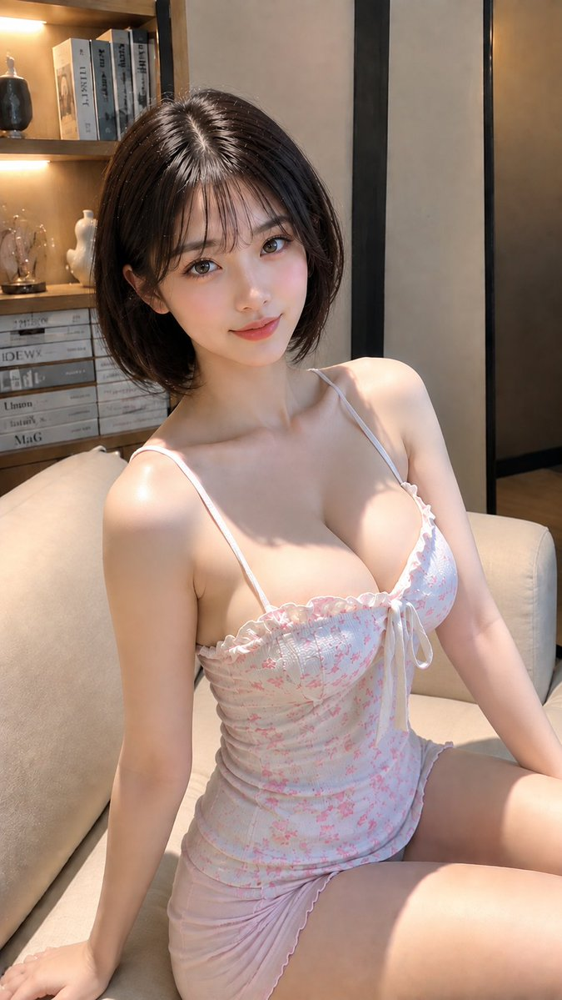

**Prompt**

```text
Traducción en curso
```

[↑ Volver a categorías](#catalog)

---

<a name="prompt-2099622469099217254"></a>

### Traducción en curso

Autor：[@CyberTotal2026](https://x.com/CyberTotal2026) · [Publicación original](https://x.com/CyberTotal2026/status/2099622469099217254)

Fotografía · Retrato / Selfie · Personaje · Publicado

**Resumen:** Traducción en curso

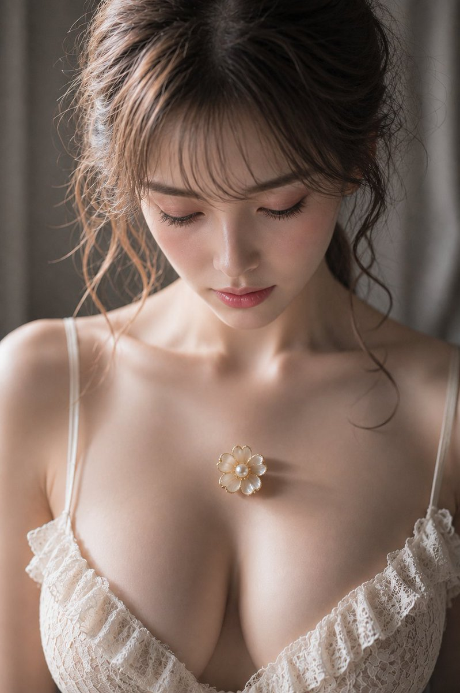

**Prompt**

```text
Traducción en curso
```

[↑ Volver a categorías](#catalog)

---

<a name="prompt-2099486826192842807"></a>

### Traducción en curso

Autor：[@CyberTotal2026](https://x.com/CyberTotal2026) · [Publicación original](https://x.com/CyberTotal2026/status/2099486826192842807)

Fotografía · Personaje · Publicado

**Resumen:** Traducción en curso

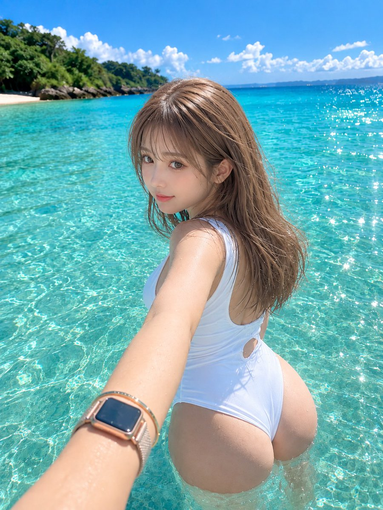

**Prompt**

```text
Traducción en curso
```

[↑ Volver a categorías](#catalog)

---

<a name="prompt-2099370474455396482"></a>

### Retrato de estudio fotorrealista de una mujer elegante con un vestido midi negro entallado.

Autor：[@MissDelulu9](https://x.com/MissDelulu9) · [Publicación original](https://x.com/MissDelulu9/status/2099370474455396482)

Fotografía · Retrato / Selfie · Personaje · Artículo de moda · Publicado

**Resumen:** Retrato de estudio fotorrealista de una mujer elegante con un vestido midi negro entallado.

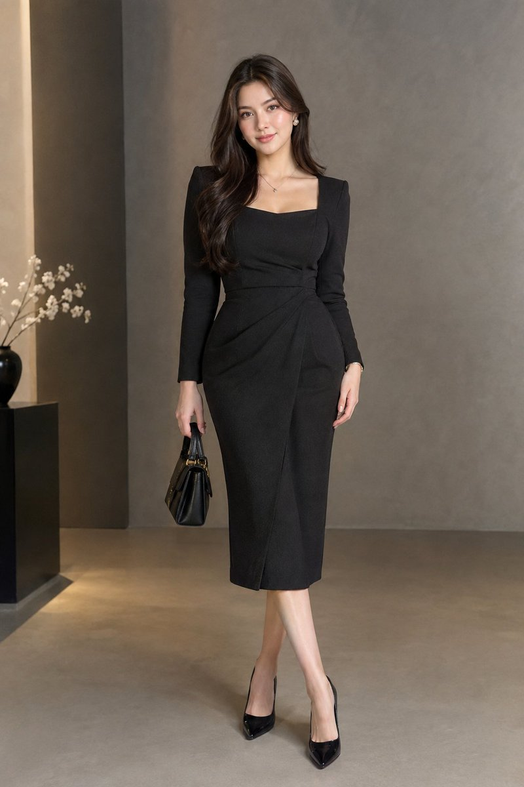

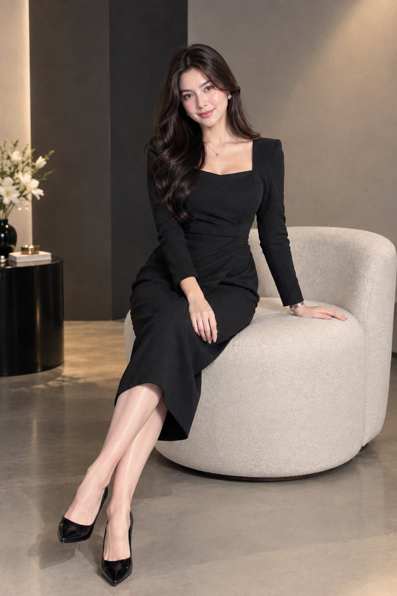

**Prompt**

```text
Crea un retrato de estudio de cuerpo entero altamente fotorrealista de una mujer adulta y elegante que lleva un sofisticado vestido formal midi negro de manga larga, cintura entallada, tejido de primera calidad y textura sutil. Joyería minimalista, elegantes tacones de punta, cabello pulido y liso, maquillaje suave y natural, expresión segura y dulce. Fondo de estudio de moda de lujo, iluminación suave y difusa, textura de piel realista, proporciones naturales, fotografía editorial cinematográfica, lente de 85 mm, ultradetallado, 8K, sin texto, sin marcas de agua.
```

[↑ Volver a categorías](#catalog)

---

<a name="prompt-2099398744529600886"></a>

### Prompt de fotografía de retrato realista de una mujer en una cama iluminada por la luz de la mañana, vestida con lencería de color rosa empolvado y mirando por encima del hombro.

Autor：[@CyberTotal2026](https://x.com/CyberTotal2026) · [Publicación original](https://x.com/CyberTotal2026/status/2099398744529600886)

Fotografía · Retrato / Selfie · Personaje · Publicado

**Resumen:** Prompt de fotografía de retrato realista de una mujer en una cama iluminada por la luz de la mañana, vestida con lencería de color rosa empolvado y mirando por encima del hombro.

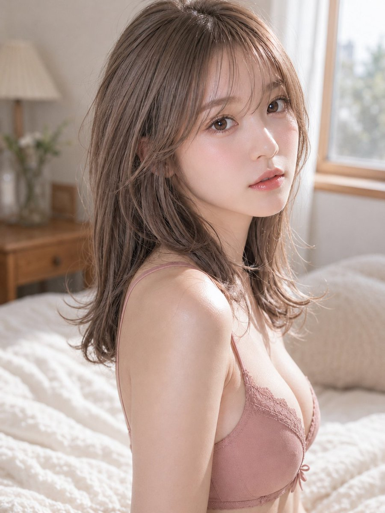

**Prompt**

```text
Tema:
Rosa empolvado junto a la ventana matutina

Sujeto:
Fotografía vertical en primer plano lateral de una mujer adulta vestida con lencería de color rosa empolvado, sobre una cama blanca iluminada por el sol de la mañana. La persona se sitúa tomando como referencia el centro del encuadre.

Persona y expresión:
Cabello liso castaño ceniza claro que cae por debajo de los hombros con flequillo ligero. Rostro ovalado y esbelto, barbilla pequeña, ojos castaños redondos, cejas finas naturales, puente nasal delgado y labios rosados brillantes. Expresión serena mirando a la cámara por encima del hombro.

Atuendo y postura:
Sujetador con aros y tirantes finos en color rosa empolvado. Encaje del mismo color en la parte superior de las copas y un pequeño lazo en el centro del pecho. Cuerpo orientado hacia un lado, manteniendo la espalda recta y girando el rostro por encima del hombro. Traje de baño de color rosa empolvado.

Fondo e iluminación:
Sábanas y almohadas blancas, muebles de madera clara, gran ventanal. La intensa luz solar matutina procedente de la esquina superior derecha crea bordes luminosos y sombras suaves en la mejilla, el puente nasal, el hombro y el cabello. La luz principal del fondo del encuadre es una luz suave proveniente del lado de la ventana.

Composición y cámara:
Composición vertical 3:4, cámara en primer plano por debajo del pecho desde una perspectiva lateral en diagonal. Rostro en la esquina superior derecha, hombro y copa rosa colocados de forma prominente en la parte inferior central. Ambos ojos, labios, encaje y mechones de cabello nítidos con un fondo intensamente desenfocado. Encuadre amplio de la persona, enfoque centrado en la protagonista y fondo con un suave efecto bokeh.

Textura y estilo:
Fotografía de belleza fotorrealista. Captura con gran precisión la textura natural de la piel, el encaje rosa, los tirantes finos, el cabello castaño ceniza y los suaves reflejos de la luz de la mañana.

Negativo:
No alterar la mirada lateral por encima del hombro ni el encaje en tono rosa empolvado
```

[↑ Volver a categorías](#catalog)

---

<a name="prompt-2099367790524219462"></a>

### Prompt de retrato fotorrealista de una mujer sentada en una mesa de madera junto a un lago.

Autor：[@CyberTotal2026](https://x.com/CyberTotal2026) · [Publicación original](https://x.com/CyberTotal2026/status/2099367790524219462)

Fotografía · Retrato / Selfie · Personaje · Paisaje / Naturaleza · Publicado

**Resumen:** Prompt de retrato fotorrealista de una mujer sentada en una mesa de madera junto a un lago.

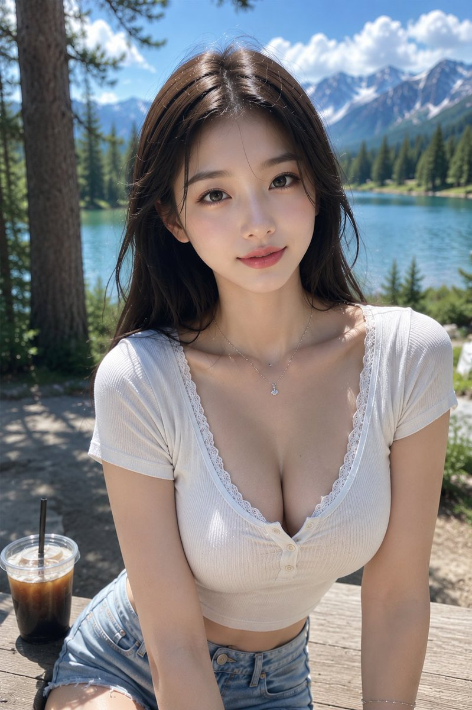

**Prompt**

```text
Tema:
Botones blancos junto al lago

Sujeto:
Fotografía vertical de una mujer adulta con un top corto blanco sentada junto a una mesa de madera al borde de un lago alpino azul. La figura está encuadrada centrada en la imagen.

Persona y expresión:
Cabello liso castaño oscuro hasta debajo del pecho con raya casi en el medio. Rostro ovalado y esbelto, ojos marrones y redondos, cejas naturales, nariz pequeña y labios de color melocotón brillante. Sonríe suavemente hacia el frente.

Vestimenta y pose:
Top corto blanco acanalado de manga corta con cuello redondo pronunciado adornado con fino encaje y una hilera de pequeños botones debajo del pecho. Pantalones cortos vaqueros de color azul claro. Sentada en el borde de la mesa, con ambos brazos descansando hacia adelante.

Fondo e iluminación:
Lago de color azul verdoso, bosque de coníferas, montañas escarpadas con vetas de nieve, cielo azul y nubes blancas. En la parte inferior izquierda, un café helado en un vaso transparente. Fuerte luz diurna y luz filtrada entre las hojas. La luz principal del fondo es una luz directa y dura desde arriba.

Composición y cámara:
Composición vertical 2:3, cámara frontal desde la cintura hacia arriba. La persona en el centro, el lago y las montañas en la mitad superior, y el café helado en la parte inferior izquierda. Enfoque nítido en el rostro y la hilera de botones blancos, con las montañas ligeramente desenfocadas. El sujeto ocupa un espacio destacado con enfoque nítido y fondo ligeramente desenfocado.

Textura y estilo:
Fotografía de viajes fotorrealista. Muestra con nitidez bajo la luz diurna el tejido acanalado blanco y el encaje, el denim, la bebida fría, el lago azul y las crestas de las montañas.

Negativo:
No omitir el lago alpino ni el café helado en la esquina inferior izquierda
```

[↑ Volver a categorías](#catalog)

---

<a name="prompt-2099400168433152293"></a>

### Prompt de retrato en primerísimo plano de una mujer que mira a la cámara con ojos llorosos.

Autor：[@CyberTotal2026](https://x.com/CyberTotal2026) · [Publicación original](https://x.com/CyberTotal2026/status/2099400168433152293)

Fotografía · Retrato / Selfie · Personaje · Publicado

Publicación original：[@CyberTotal2026](https://x.com/CyberTotal2026) · [Publicación original](https://x.com/CyberTotal2026/status/2093263569249005578)

**Resumen:** Prompt de retrato en primerísimo plano de una mujer que mira a la cámara con ojos llorosos.

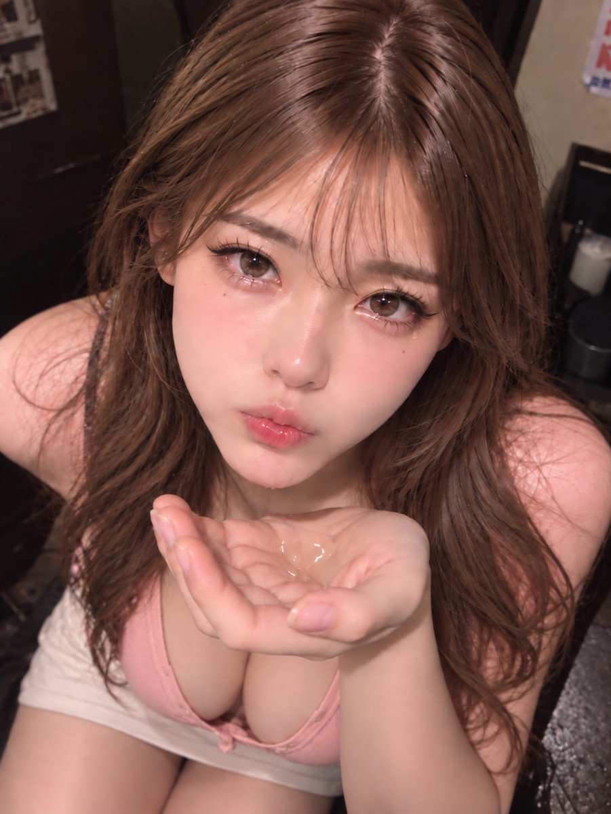

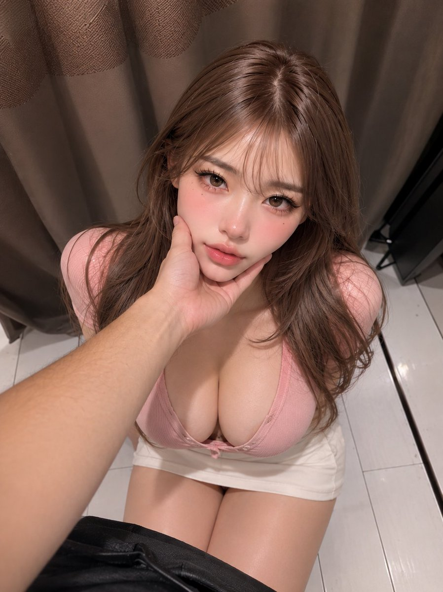

**Prompt**

```text
Tema:
Retrato en primer plano de ojos llorosos

Sujeto:
Fotografía vertical en plano muy cerrado tomada desde arriba de una mujer de unos 20 años. La persona ocupa gran parte del centro del encuadre, inclinando la parte superior del cuerpo hacia adelante mientras mira hacia arriba a la cámara. Tiene una mano ligeramente ahuecada justo debajo de la boca, con unas pocas gotas de agua transparentes sobre la palma. El fondo interior oscuro y una atmósfera íntima propia de la corta distancia.

Persona y expresión:
Rostro pequeño y redondeado con una línea de mandíbula suave. Grandes ojos castaños que miran directamente a la cámara, con las comisuras exteriores ligeramente caídas dando una impresión serena. Una película natural de lágrimas en el párpado inferior y apenas una pequeña lágrima visible cerca del rabillo del ojo, sin llegar a ser una expresión de llanto. Cejas marrones delgadas, rubor tenue en tono rosa, pestañas delicadas y labios brillantes en tono rosa beige. Cabello largo castaño claro con ondas suaves, flequillo ligero y mechones finos alrededor del rostro que acarician las mejillas.

Vestimenta y pose:
Top sin mangas de canalé fino en rosa pálido. Se aprecia un escote en V pronunciado con un pequeño lazo en el centro, combinado debajo con una prenda inferior corta en tono marfil claro. Postura con el torso inclinado hacia la cámara y los hombros ligeramente encogidos hacia adentro. Una mano debajo del rostro con la palma hacia arriba y los dedos curvados de forma natural sosteniendo unas gotas de agua.

Fondo e iluminación:
Interior dominado por tonos marrones oscuros y negros. Al fondo a la izquierda se aprecian muebles oscuros y pequeños papeles desenfocados, y al fondo a la derecha objetos de almacenaje negros y pequeños detalles blancos borrosos. Una luz cálida y suave proveniente del frente ilumina el rostro, el cabello, los hombros y la palma de la mano, mientras que el fondo cae en una sombra más profunda. La piel tiene un brillo sutil y controlado, con pequeños reflejos en las pupilas y en la superficie de las lágrimas.

Composición y cámara:
Formato vertical 4:3. Retrato en primerísimo plano con el rostro situado predominantemente en el centro de la mitad superior del encuadre. Perspectiva angular moderada que mira ligeramente hacia abajo desde una posición elevada, haciendo resaltar con fuerza el rostro y la mano en primer plano. Abarca desde la coronilla hasta el pecho y parte de los muslos, con la palma de la mano superpuesta en la parte inferior central del encuadre. Enfoque nítido en el rostro y las pupilas, con el fondo suavemente desenfocado.

Textura y estilo:
Expresión fotográfica realista. Piel suave que conserva la textura natural, cabello suave visible mechón por mechón, tejido de canalé, gotas de agua y la transparencia de las lágrimas representados minuciosamente. Tonalidades cálidas y suaves, evitando el HDR excesivo o los filtros intensos de embellecimiento. Sensación de volumen tridimensional típica de las tomas de cerca y un aire natural como el de una fotografía cotidiana.

Negativo:
Lágrimas grandes y poco naturales; rostro hinchado por llorar
```

[↑ Volver a categorías](#catalog)

---

<a name="prompt-2099339353168441687"></a>

### Prompt de fotografía de moda en interiores de una mujer sentada en un sofá con un minivestido de tweed blanco y negro.

Autor：[@CyberTotal2026](https://x.com/CyberTotal2026) · [Publicación original](https://x.com/CyberTotal2026/status/2099339353168441687)

Fotografía · Retrato / Selfie · Personaje · Artículo de moda · Arquitectura / Interiorismo · Publicado

**Resumen:** Prompt de fotografía de moda en interiores de una mujer sentada en un sofá con un minivestido de tweed blanco y negro.

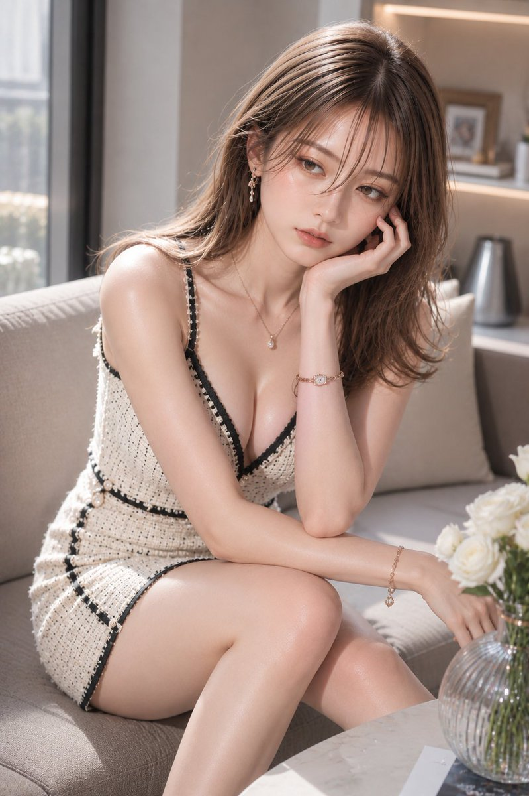

**Prompt**

```text
Tema:
Tweed blanco y negro de tarde

Sujeto:
Fotografía vertical de una mujer adulta con un minivestido de tweed blanco y negro sentada en un sofá, en un salón luminoso y elegante. El sujeto está colocado con referencia al centro del encuadre.

Persona y expresión:
Cabello ondulado de color castaño claro por debajo de los hombros con flequillo fino. Rostro ovalado y estilizado, ojos marrones alargados, cejas finas naturales, nariz pequeña y labios rosados brillantes. Apoya una mejilla en la mano y mira plácidamente hacia la izquierda del encuadre. El rostro se orienta hacia la izquierda del encuadre.

Vestimenta y pose:
Minivestido de tweed fino en blanco crudo con tirantes finos negros, escote en V pronunciado con borde de encaje negro, ribetes negros en el torso y el dobladillo, y pequeños botones de estilo perla. Piernas cruzadas, apoyando un codo sobre la rodilla y el otro brazo sobre las piernas. Accesorios finos dorados.

Fondo e iluminación:
Sofá beige claro, mesa de mármol, jarrón con rosas blancas, estantería y gran ventanal. La luz diurna proveniente de la izquierda crea suaves reflejos en el cabello y los hombros. La luz principal del fondo del encuadre es la luz suave que entra por la ventana.

Composición y cámara:
Composición vertical 2:3, cámara en ángulo frontal diagonal cercano al nivel de los ojos sentada, plano medio largo (por encima de las rodillas). Sujeto situado en el centro a la izquierda, rosas blancas en el primer plano a la derecha y el ventanal al fondo a la izquierda. Enfoque en el rostro y en el ribete negro del tweed. El sujeto ocupa un encuadre generoso, enfocado nítidamente con un ligero desenfoque en el fondo.

Textura y estilo:
Fotografía de moda de interiores fotorrealista. Detalle minucioso del tweed texturizado, bordes negros, botones perlados, accesorios dorados y el suave brillo de la piel.

Negativo:
No sustituir los ribetes en blanco y negro ni la textura del tweed por tela lisa
```

[↑ Volver a categorías](#catalog)

---

<a name="prompt-2099309154334548142"></a>

### Traducción en curso

Autor：[@CyberTotal2026](https://x.com/CyberTotal2026) · [Publicación original](https://x.com/CyberTotal2026/status/2099309154334548142)

Fotografía · Retrato / Selfie · Personaje · Publicado

**Resumen:** Traducción en curso

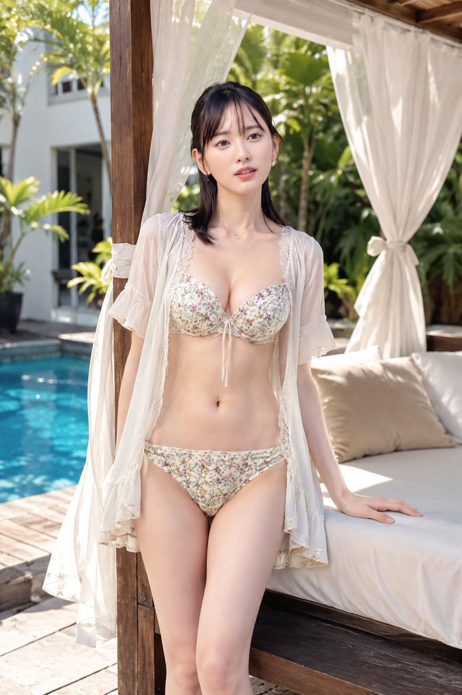

**Prompt**

```text
Traducción en curso
```

[↑ Volver a categorías](#catalog)

---

<a name="prompt-2099262094302761246"></a>

### Traducción en curso

Autor：[@CyberTotal2026](https://x.com/CyberTotal2026) · [Publicación original](https://x.com/CyberTotal2026/status/2099262094302761246)

Fotografía · Retrato / Selfie · Personaje · Publicado

**Resumen:** Traducción en curso

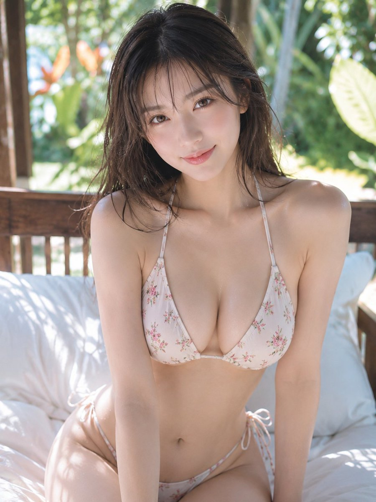

**Prompt**

```text
Traducción en curso
```

[↑ Volver a categorías](#catalog)

---

<a name="prompt-2099123682249732440"></a>

### Prompt de fotografía de estilo de vida matutina realista de una mujer sentada en una alfombra blanca en la sala de estar que ofrece una flor blanca a la cámara.

Autor：[@CyberTotal2026](https://x.com/CyberTotal2026) · [Publicación original](https://x.com/CyberTotal2026/status/2099123682249732440)

Fotografía · Personaje · Publicado

**Resumen:** Prompt de fotografía de estilo de vida matutina realista de una mujer sentada en una alfombra blanca en la sala de estar que ofrece una flor blanca a la cámara.

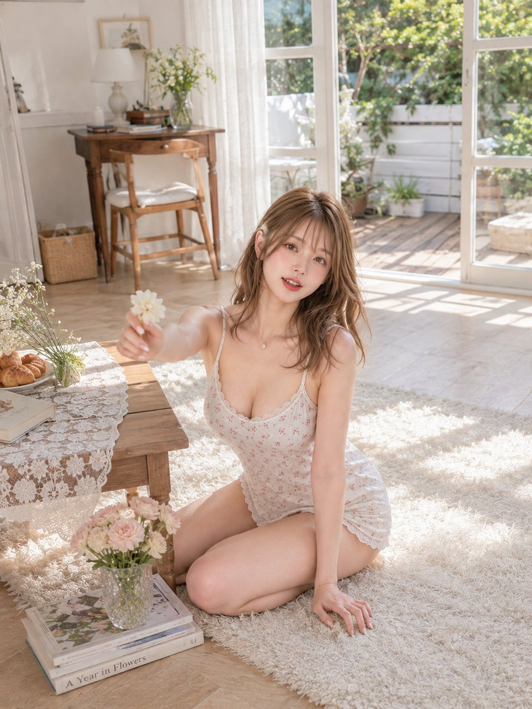

**Prompt**

```text
Tema:
Flor blanca ofrecida

Sujeto:
Fotografía vertical de una mujer adulta sentada con las rodillas dobladas sobre una alfombra blanca en una sala de estar iluminada por el sol, ofreciendo una sola flor blanca hacia el objetivo. El sujeto se sitúa tomando como referencia el centro del encuadre.

Persona y expresión:
Pelo ondulado castaño claro por debajo de los hombros con flequillo ligero. Rostro ovalado, ojos castaños redondos, cejas finas, nariz pequeña y labios brillantes de color coral. Boca ligeramente abierta sonriendo a la cámara. Con el rostro orientado hacia la cámara frontal.

Vestimenta y pose:
Minivestido lencero de tirantes finos blanco con estampado de pequeñas flores rojas. Encaje blanco en el escote y en el bajo corto. Sentada con una pierna doblada hacia un lado, la mano izquierda apoyada en la alfombra y el brazo derecho extendido en línea recta hacia el objetivo sosteniendo una flor blanca. Minivestido con estampado de pequeñas flores.

Fondo e iluminación:
Mesa baja de madera con mantel de encaje, pan, jarrón, libros apilados sobre flores, gran ventanal y terraza verde. La luz matinal proyecta una sombra enrejada sobre la alfombra blanca. La luz principal del fondo del encuadre es una luz suave proveniente del lado de la ventana.

Composición y cámara:
Composición vertical 3:4, cámara frontal ligeramente elevada capturando casi todo el cuerpo. La flor blanca del primer plano en tamaño grande, el rostro en el centro, las piernas dobladas y los libros situados en la parte inferior. Enfoque nítido en el rostro y la flor, con el fondo desenfocado suavemente. Encuadre amplio del sujeto, enfoque en la protagonista y un ligero desenfoque (bokeh) de fondo.

Textura y estilo:
Fotografía de estilo de vida luminosa y fotorrealista. Los estampados de florecitas, el encaje blanco, los pétalos, la alfombra de pelo largo, la madera y la luz de la mañana capturados con colores limpios y frescos.

Negativo:
No omitir el brazo extendido hacia el objetivo ni la flor individual del primer plano
```

[↑ Volver a categorías](#catalog)

---

<a name="prompt-2099093734906613857"></a>

### Traducción en curso

Autor：[@CyberTotal2026](https://x.com/CyberTotal2026) · [Publicación original](https://x.com/CyberTotal2026/status/2099093734906613857)

Fotografía · Personaje · Publicado

**Resumen:** Traducción en curso

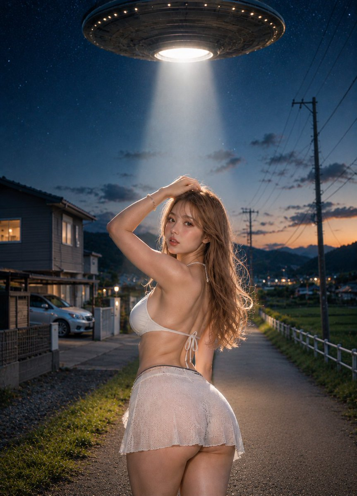

**Prompt**

```text
Traducción en curso
```

[↑ Volver a categorías](#catalog)

---

<a name="prompt-2099112358392033544"></a>

### Traducción en curso

Autor：[@CyberTotal2026](https://x.com/CyberTotal2026) · [Publicación original](https://x.com/CyberTotal2026/status/2099112358392033544)

Fotografía · Retrato / Selfie · Personaje · Publicado

**Resumen:** Traducción en curso

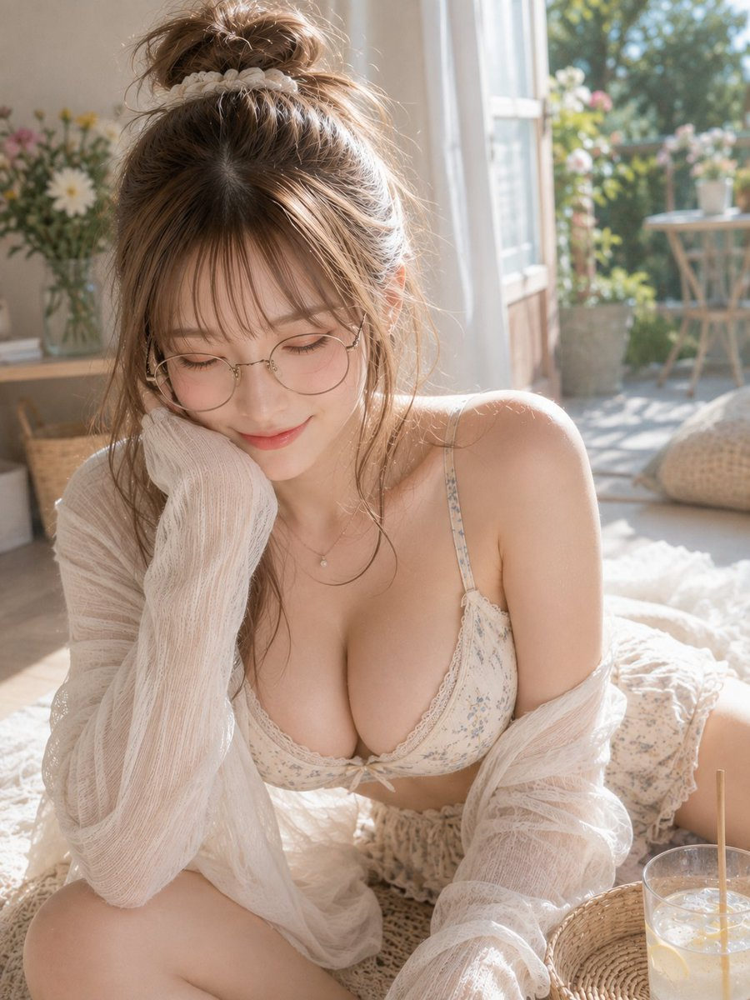

**Prompt**

```text
Traducción en curso
```

[↑ Volver a categorías](#catalog)

---

<a name="prompt-2099094091179180195"></a>

### Foto espontánea de estilo callejero de dos mujeres de Asia oriental conversando junto a la ventana de un McDonald's.

Autor：[@Aqsahere\_](https://x.com/Aqsahere_) · [Publicación original](https://x.com/Aqsahere_/status/2099094091179180195)

Fotografía · Paisaje urbano / Calle · Publicado

**Resumen:** Foto espontánea de estilo callejero de dos mujeres de Asia oriental conversando junto a la ventana de un McDonald's.

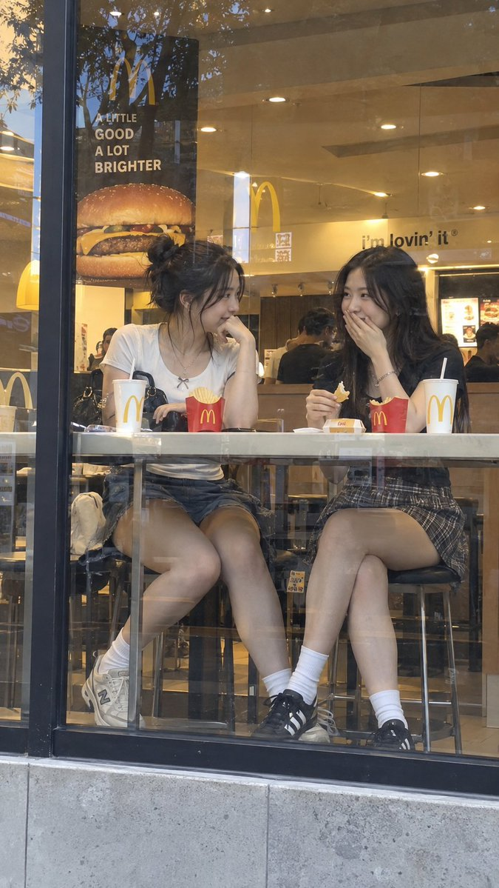

**Prompt**

```text
Fotografía callejera espontánea y ultrarrealista en formato 9:16 de dos mujeres adultas de Asia oriental con faldas cortas elegantes, sentadas de manera informal en una barra junto a la ventana dentro de un McDonald's, charlando con naturalidad. Fotografiada desde la acera a través de la ventana de cristal, con reflejos realistas, iluminación interior cálida, lenguaje corporal natural, expresiones auténticas, texturas detalladas de piel y ropa, poca profundidad de campo y una sensación de fotografía de smartphone sin posar.
```

[↑ Volver a categorías](#catalog)

---

<a name="prompt-2098981813771194613"></a>

### Traducción en curso

Autor：[@ZarnishNael](https://x.com/ZarnishNael) · [Publicación original](https://x.com/ZarnishNael/status/2098981813771194613)

Fotografía · Retrato / Selfie · Personaje · Artículo de moda · Publicado

**Resumen:** Traducción en curso


**Prompt**

```text
Traducción en curso
```

[↑ Volver a categorías](#catalog)

---

<a name="prompt-2098975203866837026"></a>

### Prompt para un retrato realista en composición vertical de una mujer sentada con las piernas cruzadas en la cama frente al espejo en un dormitorio con luz cálida.

Autor：[@CyberTotal2026](https://x.com/CyberTotal2026) · [Publicación original](https://x.com/CyberTotal2026/status/2098975203866837026)

Fotografía · Retrato / Selfie · Personaje · Publicado

**Resumen:** Prompt para un retrato realista en composición vertical de una mujer sentada con las piernas cruzadas en la cama frente al espejo en un dormitorio con luz cálida.


**Prompt**

```text
Tema:
Espejo con smartphone bajo luz nocturna

Sujeto:
Fotografía vertical de una mujer adulta sentada con las piernas cruzadas en la cama de un dormitorio iluminado por una lámpara de luz cálida, tomándose un selfi frente al espejo con un smartphone grande. La persona está centrada en el encuadre.

Persona y expresión:
Pelo largo y negro recogido detrás, flequillo fino. El smartphone oculta en gran parte el centro del rostro, dejando ver únicamente un ojo, la mejilla y parte de unos labios rosados y brillantes. Con el rostro mirando al frente. Expresión tranquila.

Vestimenta y pose:
Camisola blanca acanalada de tirantes finos con encaje y pequeños botones en el escote, pantalones cortos grises con cordón ajustable, calcetines blancos hasta la rodilla. Sentada con las piernas cruzadas, sosteniendo con una mano un smartphone grande de color cobre frente a la cara. Top blanco y pantalón gris.

Fondo e iluminación:
Ropa de cama blanca, mesita de noche de madera, lámpara de mesa de luz cálida, ventana oscura. La luz anaranjada genera sombras suaves sobre la persona y la cama. La luz principal del fondo proviene suavemente del lado de la ventana.

Composición y cámara:
Composición vertical 2:3, la cámara capta la superficie del espejo de frente, con un plano casi de cuerpo entero sentada. La persona en el centro, el smartphone grande en el centro del rostro y las piernas con calcetines blancos situadas en la parte inferior. Enfoque en el reflejo del espejo y la ropa. Encuadre amplio del sujeto, foco nítido en la protagonista y fondo ligeramente desenfocado.

Textura y estilo:
Selfi en el espejo de noche con realismo fotográfico. Reproducción natural de la superficie del espejo, el terminal cobrizo, el tejido acanalado blanco y el encaje, la tela gris y la lámpara cálida.

Negativo:
No alterar la composición en la que el smartphone oculta en gran medida el centro del rostro
```

[↑ Volver a categorías](#catalog)

---

<a name="prompt-2098945760817479956"></a>

### Prompt de fotografía de retrato realista con luz natural de una mujer con mini camisón de satén negro mirando atrás en una cama soleada.

Autor：[@CyberTotal2026](https://x.com/CyberTotal2026) · [Publicación original](https://x.com/CyberTotal2026/status/2098945760817479956)

Fotografía · Personaje · Publicado

**Resumen:** Prompt de fotografía de retrato realista con luz natural de una mujer con mini camisón de satén negro mirando atrás en una cama soleada.


**Prompt**

```text
Tema:
Satén negro bajo la luz matinal

Sujeto:
Fotografía vertical de una mujer adulta sentada de espaldas en una cama blanca bañada por el sol de la mañana, vistiendo un mini camisón de satén negro. El sujeto está centrado en el encuadre.

Persona y expresión:
Cabello ondulado y suelto de color castaño oscuro por debajo de los hombros con flequillo ligero. Rostro ovalado fino, ojos castaños rasgados, cejas naturales, nariz pequeña y labios rosados brillantes. Expresión serena mirando a la cámara por encima del hombro. Rostro orientado hacia la cámara sobre el hombro.

Vestimenta y postura:
Mini camisón de tirantes finos en satén negro brillante. Espalda profundamente abierta casi hasta la cintura, con múltiples cordones finos cruzados y pequeños lazos en ambos costados. Sentada con las piernas dobladas hacia un lado y una mano apoyada sobre la ropa de cama. Minivestido negro.

Fondo e iluminación:
Sábanas y almohadas blancas, paredes de tono claro, ventanal grande. La intensa luz de la mañana crea finos reflejos blancos en el satén negro, iluminando cálidamente la espalda y el cabello. La luz principal del fondo es una suave iluminación que entra por la ventana.

Composición y cámara:
Composición vertical 4:5, toma por encima de las rodillas en ángulo diagonal trasero desde el borde de la cama. El sujeto ocupa un lugar destacado en el centro, destacando la espalda descubierta y los cordones laterales. Enfoque nítido en el rostro que se gira y en el satén. Encuadre amplio del sujeto, enfoque en el elemento principal y suave desenfoque de fondo.

Textura y estilo:
Fotografía fotorrealista con luz natural. Representación precisa del brillo especular del satén negro, los finos cordones, la ropa de cama blanca y la luz matinal sobre el cabello y la piel.

Negativo:
No omitir la espalda profundamente escotada ni los cordones cruzados de los laterales
```

[↑ Volver a categorías](#catalog)

---

<a name="prompt-2098925376554811573"></a>

### Traducción en curso

Autor：[@splash\_GL](https://x.com/splash_GL) · [Publicación original](https://x.com/splash_GL/status/2098925376554811573)

Fotografía · Animal / Criatura · Publicado

**Resumen:** Traducción en curso


**Prompt**

```text
Traducción en curso
```

[↑ Volver a categorías](#catalog)

---

<a name="prompt-2098631695855669712"></a>

### Una toma acogedora y fotorrealista de una mujer de Asia oriental en una cálida furgoneta cámper contemplando el cielo estrellado de la Vía Láctea.

Autor：[@laviniavelle](https://x.com/laviniavelle) · [Publicación original](https://x.com/laviniavelle/status/2098631695855669712)

Fotografía · Personaje · Publicado

**Resumen:** Una toma acogedora y fotorrealista de una mujer de Asia oriental en una cálida furgoneta cámper contemplando el cielo estrellado de la Vía Láctea.


**Prompt**

```text
Una fotografía realista, acogedora y sumamente detallada de una joven mujer de Asia oriental con el pelo recogido en un moño suave e informal, sentada cómodamente dentro de una cálida furgoneta cámper por la noche. Está envuelta en un edredón rosa grueso y afelpado con estampado floral, viste un jersey de forro polar rosa suave y afelpado, sostiene una taza de cerámica rosa con ambas manos y mira por la gran ventana de la furgoneta con una sonrisa dulce y serena. Fuera de la ventana, un sobrecogedor cielo nocturno oscuro revela una vívida Vía Láctea repleta de estrellas sobre las siluetas de montañas lejanas. El interior de la furgoneta está lleno de cálidas guirnaldas de luces, acogedores estantes de madera con pequeños adornos para el hogar, fotos enmarcadas y lindos peluches de un conejito blanco y un patito amarillo. Iluminación ambiental cálida, cinematográfica, resolución 8k, fotorrealista, atmósfera de ensueño.
```

[↑ Volver a categorías](#catalog)

---

<a name="prompt-2097585546973614232"></a>

### Prompt de estilo fotográfico de una mujer con top mostaza y falda plisada mirando hacia atrás a través de la red en una pista de tenis naranja.

Autor：[@CyberTotal2026](https://x.com/CyberTotal2026) · [Publicación original](https://x.com/CyberTotal2026/status/2097585546973614232)

Fotografía · Personaje · Publicado

**Resumen:** Prompt de estilo fotográfico de una mujer con top mostaza y falda plisada mirando hacia atrás a través de la red en una pista de tenis naranja.


**Prompt**

```text
Tema:
Mirada hacia atrás en la pista naranja

Sujeto:
Fotografía vertical de una mujer adulta de espaldas en el centro del encuadre en una pista de tenis al aire libre en un día soleado, mirando hacia atrás por encima del hombro.

Persona y expresión:
Solo gira la cara hacia la cámara por encima de su propio hombro derecho, con una expresión serena y los labios cerrados. Rostro ovalado y fino, barbilla pequeña, ojos castaños ligeramente alargados, cejas delgadas naturales, nariz pequeña, labios de color rosa pálido. Pelo largo y ondulado de color castaño claro extendido sobre la espalda.

Vestimenta y postura:
Top sin mangas de color mostaza con espalda profundamente escotada y falda corta de tenis plisada blanca. Con el peso apoyado en una pierna y la cintura ligeramente girada, baja una raqueta blanca hacia abajo a la derecha con su propia mano derecha, mientras el brazo izquierdo descansa naturalmente junto al cuerpo.

Fondo e iluminación:
En primer plano, una red negra cruza a la altura de la cintura; de fondo, una pista de color naranja, una valla verde, árboles y un cielo azul. Una intensa luz directa de mediodía procedente de la parte superior izquierda del encuadre ilumina el cabello y los hombros, proyectando una sombra corta sobre la pista.

Composición y cámara:
Composición vertical 4:5, toma por encima de la rodilla en ángulo oblicuo desde atrás con la cámara situada a la altura de la cintura. La persona ocupa ampliamente el centro, la red actúa como línea horizontal en primer plano y la raqueta se ubica abajo a la derecha. Enfoque en la cara y la espalda, fondo ligeramente desenfocado, con la parte superior de la cabeza y el dobladillo de la falda contenidos dentro del encuadre.

Textura y estilo:
Fotografía hiperrealista. Muestra con claridad el fino brillo del cabello, el tejido elástico del top, los pliegues de la falda, la malla de la red y la superficie seca de la pista.

Negativo:
No orientar de frente; no omitir la red que cruza por delante de la cintura ni la raqueta en la parte inferior derecha
```

[↑ Volver a categorías](#catalog)

---

<a name="prompt-2097534208541442338"></a>

### Prompt para primer plano casual con cámara frontal de iPhone de una joven de Asia oriental de piel blanca fría, con fondo de felpa grisáceo y varias opciones de poses apoyando la cara ensimismada.

Autor：[@AIVideoHub\_](https://x.com/AIVideoHub_) · [Publicación original](https://x.com/AIVideoHub_/status/2097534208541442338)

Perfil / Avatar · Fotografía · Retrato / Selfie · Personaje · Resumen / Antecedentes · Publicado

**Resumen:** Prompt para primer plano casual con cámara frontal de iPhone de una joven de Asia oriental de piel blanca fría, con fondo de felpa grisáceo y varias opciones de poses apoyando la cara ensimismada.


**Prompt**

```text
📱 Foto casual tomada con la cámara frontal de un iPhone, proporción 9:16; hermosa mujer de Asia oriental, de 18 a 22 años y claramente adulta, de aproximadamente 1,75 m, facciones refinadas, piel translúcida y blanca de tono frío, figura delgada y esbelta de modelo, pecho visualmente natural equivalente a una copa E. Cabello largo, oscuro, suave y voluminoso con ondas grandes, top de tirantes finos ajustado de color claro con escote en V profundo, que deja al descubierto la línea limpia de hombros y cuello, ojos redondeados, cejas rectas y suaves, ojos negros brillantes y limpios, rubor rosa tenue y labios rosados e hidratados, expresión perezosa y tranquila.

🩶 Primer plano muy cerrado del rostro en un interior en penumbra, fondo desenfocado de tejido mullido en tono gris blanquecino, luz tenue de tono frío, subexpuesta, filtro grisáceo de baja saturación, bajo contraste, nitidez ligera, efecto granulado y suavemente desenfocado, aire despreocupado y relajado, limpio y elegante, con una atmósfera melancólica y fría.

Banco de poses aleatorias:

🤍 Apoyar la cara en una mano, con la palma pegada a la mejilla y la mandíbula, mirando tranquilamente a la cámara
🫧 Apoyar el codo sosteniendo el lateral del rostro, ladeando suavemente la cabeza ensimismada
🌙 Media cara enterrada en la palma de la mano, con mirada perezosa y ausente
💭 Yemas de los dedos apoyadas suavemente en la barbilla y el lateral del rostro, bajando la cabeza para luego levantar la mirada despacio
🪞 Acercándose a la cámara, apoyando la cara en la palma de la mano, con las ondas largas cayendo por delante del hombro
☁️ Mejilla pegada al dorso de la mano, con la mirada desviada fuera del encuadre
💤 Mano apoyando la mejilla encogiendo levemente los hombros, como una foto robada al tener sueño
✨ Apoyando el rostro junto a un cojín de felpa, con una sutil sonrisa en la comisura de los labios

🎲 Variar libremente la distancia del selfi, la forma de apoyar la cara, la mirada, los mechones de cabello, la luz tenue, el desenfoque y el grano según las distintas poses, priorizando mantener el primer plano cerrado del rostro, el tono gris blanquecino frío y la textura casual de la cámara frontal del iPhone, buscando una estética de dreamcore casero × atmósfera melancólica × retrato minimalista de alta gama.

Genera una imagen de vista previa combinada que incluya diferentes poses para que pueda elegir entre ellas.
```

[↑ Volver a categorías](#catalog)

---

<a name="prompt-2096909970398941572"></a>

### Selfie frente al espejo fotorrealista 9:16 de una mujer brasileña atlética con un body naranja terracota dentro de un gimnasio exclusivo.

Autor：[@MrDasOnX](https://x.com/MrDasOnX) · [Publicación original](https://x.com/MrDasOnX/status/2096909970398941572)

Fotografía · Retrato / Selfie · Personaje · Publicado

**Resumen:** Selfie frente al espejo fotorrealista 9:16 de una mujer brasileña atlética con un body naranja terracota dentro de un gimnasio exclusivo.


**Prompt**

```text
Selfie frente al espejo fotorrealista en un gimnasio de lujo interior, vertical 9:16, una mujer brasileña adulta joven de pie en una relajada pose de contrapposto tomándose un selfie con un teléfono inteligente. La cámara captura la escena a través de un gran espejo de suelo a techo utilizando una lente gran angular de teléfono equivalente a 28–35 mm. El sujeto se encuentra a aproximadamente 1 metro del espejo. Es visible todo el cuerpo desde la cabeza hasta las zapatillas. Ocupa el centro-izquierda del encuadre. Suelo de madera cálida, esterillas de goma negra y filas de pesas rusas y máquinas de poleas aparecen a la derecha y al fondo.
El sujeto es una mujer brasileña adulta joven con una complexión atlética y curvilínea compacta: hombros moderadamente anchos, brazos definidos pero no voluminosos, busto lleno, cintura ceñida, caderas redondeadas y muslos naturalmente gruesos. Las proporciones se sienten realistas y naturales en lugar de exageradas o delgadas como las de una modelo. Piel bronceada dorada cálida con poros visibles y sutiles variaciones. Iluminación natural suave, sin piel plástica.
Está de pie con el peso sobre la pierna derecha, la rodilla izquierda ligeramente flexionada y girada hacia afuera, y las caderas orientadas hacia el espejo. El torso gira suavemente para que su hombro izquierdo quede más cerca del cristal. La mano izquierda descansa sobre su cadera; la mano derecha sostiene un teléfono inteligente oscuro cerca de su rostro a la altura de la mejilla. La cabeza está girada sobre su hombro izquierdo hacia el teléfono, la barbilla ligeramente hacia abajo, con una expresión tranquila y sutilmente segura, con una pequeña sonrisa de boca cerrada. Los ojos miran a la pantalla.
El cabello es castaño oscuro con reflejos caramelo cálidos, a la altura de los hombros, recogido en una coleta baja y suelta con mechones que enmarcan el rostro. El rostro es ovalado con pómulos altos, labios carnosos en un tono rosa nude natural y ojos almendrados de color marrón oscuro.
El atuendo es un enterizo deportivo de cuello alto en color naranja terracota profundo con tirantes finos, cobertura moderada y una línea de pierna de corte alto pero aún modesta. Tejido elástico mate, sin logotipos. Zapatillas blancas con suelas limpias.
El entorno es un gimnasio contemporáneo de alta gama con grandes espejos, ladrillo visto en una pared, luces colgantes cálidas combinadas con luces LED cenitales frías, y algunas otras personas entrenando suavemente desenfocadas en el fondo. HDR de teléfono realista, grano natural, reflejos precisos y sombras creíbles.
```

[↑ Volver a categorías](#catalog)

---

<a name="prompt-2096901566985068734"></a>

### Prompt de retrato instantáneo en uniforme de azafata japonesa junto a la puerta de la cabina, con múltiples opciones de acciones aleatorias integradas.

Autor：[@AIVideoHub\_](https://x.com/AIVideoHub_) · [Publicación original](https://x.com/AIVideoHub_/status/2096901566985068734)

Fotografía · Retrato / Selfie · Personaje · Resumen / Antecedentes · Publicado

**Resumen:** Prompt de retrato instantáneo en uniforme de azafata japonesa junto a la puerta de la cabina, con múltiples opciones de acciones aleatorias integradas.


**Prompt**

```text
📱 Instantánea casual estilo aerolínea japonesa, 3:4; hermosa mujer de Asia oriental claramente adulta de 18 a 22 años, aproximadamente 1,75 m, rasgos faciales delicados y dulces, piel blanca porcelana fría, figura de modelo alta y esbelta, busto visualmente natural de copa E aproximada. Moño recogido elegante, camisa blanca con cuello en V profundo × chaleco de azafata azul marino × falda corta a rayas azules y blancas, pañuelo de seda amarillo, zapatos negros de tacón medio y medias negras.

✈️ Área de la puerta del avión, asiento plegable, manija de la puerta, señales de advertencia y compartimentos superiores encuadrados de forma natural. Tonos grises fríos de baja saturación, composición inclinada tomada a mano con móvil, luz difusa de techo, ligera sobreexposición, ruido y bordes desenfocados, maquillaje translúcido efecto cara lavada en tonos melocotón, sensación auténtica de foto instantánea amateur.

Grupo de acciones aleatorias:

💺 Sentada en el asiento plegable con una pierna flexionada, levantando la mano para acomodarse el peinado recogido
✈️ Sentada de lado junto a la puerta, girando la cabeza con una dulce sonrisa
🧣 Mirando hacia abajo para arreglarse el pañuelo, levantando repentinamente la mirada hacia la cámara
👜 Inclinándose para buscar en su bolso de mano, capturando el instante del movimiento
🙆🏻‍♀️ Apoyada contra el respaldo estirándose, con una postura natural y relajada
🪞 Poniéndose de pie para ajustarse el chaleco y la falda, mirando hacia la cámara de perfil
💬 Sentada apoyando la barbilla en la mano mientras sueña despierta, con las piernas cruzadas de forma natural
🚪 Apoyándose en el marco de la puerta para levantarse, volteando a sonreír

🎲 Una vez seleccionada la acción, aplica libremente el ángulo de cámara, detalles de la cabina, expresiones, inclinación manual y efectos de desenfoque, buscando el efecto uniforme de azafata × retrato de estilo de vida japonés × foto casual con el móvil.

Genera una imagen de vista previa integral que incluya diferentes acciones para que pueda elegir entre ellas.
```

[↑ Volver a categorías](#catalog)

---

<a name="prompt-2097249218507461093"></a>

### Retrato fotorealista de primer plano en interiores de una mujer asiática bajo la luz solar

Autor：[@Aqsahere\_](https://x.com/Aqsahere_) · [Publicación original](https://x.com/Aqsahere_/status/2097249218507461093)

Fotografía · Retrato / Selfie · Personaje · Publicado

**Resumen:** Retrato fotorealista de primer plano en interiores de una mujer asiática bajo la luz solar


**Prompt**

```text
Un retrato fotorealista de primer plano en interiores de una mujer joven sentada cómodamente en una silla de ratán tejido cerca de una ventana luminosa. Tiene el cabello largo, castaño oscuro, naturalmente despeinado con reflejos castaños cálidos, raya casi al centro, con mechones sueltos que enmarcan suavemente y cubren parcialmente su rostro. Mira directamente a la cámara con una expresión tranquila y ligeramente soñadora, y unos labios naturales suavemente tintados.
Una mano está levantada suavemente frente a su rostro, con las yemas de los dedos descansando delicadamente alrededor de sus labios y mejilla, creando una pose espontánea e íntima. Sus dedos son esbeltos y están colocados de forma natural. Viste una prenda superior simple de gran tamaño de color blanco roto/beige claro con textura de tela suave.
Una fuerte y cálida luz solar entra a través de la ventana desde la parte superior lateral, creando hermosas sombras y luces a rayas a través de su cabello, frente, mejilla y ropa. La iluminación es natural, dorada y ligeramente sobreexpuesta en algunos puntos, lo que le da a la fotografía una atmósfera cálida y acogedora.
Detrás de ella hay una gran silla blanca de ratán/tejido con detalles circulares curvos. En el fondo se ve una pared o panel de ventana verde oscuro con elegantes patrones botánicos/hojas blancas, junto con un marco vertical oscuro simple. El entorno se siente como un hogar o café moderno y acogedor.
Composición: retrato vertical de primer plano, relación de aspecto aproximada de 4:5, cámara muy cerca del sujeto, el rostro ocupando la porción central derecha del encuadre, ángulo de cámara ligeramente bajo e íntimo, hombros y torso superior visibles, encuadre natural.
Estilo de fotografía: fotografía selfie de teléfono inteligente ultrarrealista, estética suave de estilo de vida coreano/asiático, textura de piel natural, poros realistas, hebras de cabello individuales, imperfecciones sutiles, luz solar cálida, sombras auténticas, contraste suave, ligero grano de película, poca profundidad de campo, sensación espontánea sin posar, alto detalle, 4K.
```

[↑ Volver a categorías](#catalog)

---

<a name="prompt-2096805553339342932"></a>

### Retrato callejero nocturno de una mujer joven sonriente con una chaqueta texturizada color crema y falda plisada.

Autor：[@Aqsahere\_](https://x.com/Aqsahere_) · [Publicación original](https://x.com/Aqsahere_/status/2096805553339342932)

Fotografía · Retrato / Selfie · Personaje · Paisaje urbano / Calle · Publicado

**Resumen:** Retrato callejero nocturno de una mujer joven sonriente con una chaqueta texturizada color crema y falda plisada.


**Prompt**

```text
Un retrato callejero nocturno fotorrealista de una mujer joven de pie en una animada calle de la ciudad, vestida con una delicada chaqueta texturizada de color crema con pequeños detalles florales, lazos decorativos, ribetes oscuros y botones tipo perla, combinada con una falda plisada a juego. Tiene el pelo largo, liso y castaño oscuro, y un maquillaje suave y natural, sonriendo gentilmente a la cámara mientras hace un gesto juguetón con la mano cerca de su rostro. Un pequeño bolso negro cuelga de su brazo. Cálidas farolas, escaparates brillantes, coches que pasan y un ciclista crean una vibrante atmósfera nocturna urbana en el fondo. Ligero desenfoque de movimiento en el fondo, iluminación ambiental suave, fotografía espontánea de smartphone, textura natural de la piel, profundidad de campo reducida, estética acogedora y elegante, detalles realistas, composición vertical, alta resolución.
```

[↑ Volver a categorías](#catalog)

---

<a name="prompt-2096982628541100464"></a>

### Prompt de doble retrato para crear un par coordinado de retratos de hombre y mujer en un estilo de fantasía de galaxia cósmica azul profundo.

Autor：[@sha\_zdiii](https://x.com/sha_zdiii) · [Publicación original](https://x.com/sha_zdiii/status/2096982628541100464)

Fotografía · Retrato / Selfie · Personaje · Publicado

**Resumen:** Prompt de doble retrato para crear un par coordinado de retratos de hombre y mujer en un estilo de fantasía de galaxia cósmica azul profundo.


**Prompt**

```text
Crea dos retratos fantásticos cinematográficos ultradetallados y separados a partir de un solo prompt, ambos utilizando exactamente el mismo tema de galaxia cósmica azul profundo y el mismo estilo visual.

IMAGEN 1 — MUJER:
Crea a una hermosa mujer claramente adulta con cabello negro largo y ondulado, piel suave y luminosa, glamuroso maquillaje de ojos celestial en azul y plata, labios brillantes y detalles centelleantes como estrellas en todo su rostro. Agrega elegantes joyas de luna creciente y estrellas, sutiles toques de cristal y partículas cósmicas brillantes a su alrededor. Su expresión es segura, misteriosa y atractiva. Rodéala de nubes de nebulosa azul profundo, estrellas resplandecientes, grandes planetas, lunas, polvo cósmico y luz azul eléctrico. La energía de la galaxia debe fundirse de forma natural alrededor de su rostro, cabello, hombro y vestimenta.

IMAGEN 2 — HOMBRE:
Crea a un hombre atractivo claramente adulto con exactamente el mismo tema cósmico azul. Tiene el cabello negro espeso y ligeramente desordenado, barba oscura y prolija, rasgos faciales marcados, intensos ojos azules brillantes y una expresión confiada y misteriosa. Agrega sutiles patrones luminosos tipo galaxia y diminutas estrellas en un lado de su rostro. Su mano está cerca de su barbilla en una pose de moda estilizada con un elegante anillo metálico oscuro. Rodéalo de las mismas nubes de nebulosa azul profundo, planetas resplandecientes, lunas, estrellas, polvo cósmico y energía azul eléctrico.

IMPORTANTE:
Genera a la mujer y al hombre como dos imágenes separadas, no juntos en un solo encuadre. Mantén la misma iluminación, la misma paleta de colores de galaxia azul, el mismo estilo de moda fantástica prémium, el mismo nivel de detalle y una identidad visual a juego para que ambas imágenes parezcan un par coordinado.

Ultrarrealista, iluminación cinematográfica prémium, alto contraste, aspecto fantástico de lujo brillante, enfoque nítido, piel y cabello detallados, brillo mágico azul, sin texto, sin marcas de agua.

Composición de retrato vertical, 9:16 para ambas imágenes.
```

[↑ Volver a categorías](#catalog)

---

<a name="prompt-2097269715966230876"></a>

### Prompt para un retrato fotográfico de una mujer en las aguas poco profundas al atardecer, envuelta en una tela blanca húmeda y semitransparente.

Autor：[@CyberTotal2026](https://x.com/CyberTotal2026) · [Publicación original](https://x.com/CyberTotal2026/status/2097269715966230876)

Fotografía · Retrato / Selfie · Personaje · Publicado

**Resumen:** Prompt para un retrato fotográfico de una mujer en las aguas poco profundas al atardecer, envuelta en una tela blanca húmeda y semitransparente.


**Prompt**

```text
Tema:
El blanco translúcido bajo la luna vespertina

Sujeto:
En los bajíos de un arrecife rocoso al atardecer, una mujer adulta de pie en el centro de la imagen, fotografía de cuerpo entero en formato vertical, envuelta desde el pecho hasta los pies en una tela blanca húmeda y semitransparente.

Persona y expresión:
El rostro inclinado hacia la parte inferior derecha del encuadre, con la mirada también dirigida hacia la mano que sostiene la tela, en una expresión serena cercana al perfil. Contorno ovalado y fino, ojos rasgados entornados hacia abajo, puente nasal esbelto, labios pálidos ligeramente entreabiertos. Cabello castaño oscuro, húmedo, por debajo de los hombros y con raya al lado, con mechones finos adheridos a la mejilla y al cuello.

Atuendo y pose:
Una fina tela blanca en forma de vestido largo sin tirantes envuelta desde el pecho, con pliegues diagonales que se superponen sobre el torso y las piernas. De pie descalza en el agua poco profunda, con su brazo derecho bajado al costado del cuerpo, pellizcando la tela frente a la cintura con la mano izquierda y adelantando un poco una pierna.

Fondo e iluminación:
En el cielo azul violáceo de la parte superior izquierda se aprecia una fina luna creciente, en el horizonte derecho un atardecer anaranjado, y en la mitad inferior la superficie del mar y rocas negras. El sol poniente bajo, situado detrás a la derecha del encuadre, perfila la tela húmeda y el cuerpo con un halo dorado, mientras que el frente recibe una suave luz crepuscular azulada.

Composición y cámara:
Composición vertical 3:4, fotografía de cuerpo entero tomada en ángulo frontal oblicuo con la cámara situada ligeramente por debajo de la cintura. La figura se sitúa grande en el centro, la mitad superior capta el cielo vespertino y la luna creciente, y el borde inferior abarca el dobladillo mojado y los pies. Enfoque nítido en la persona y la tela translúcida, con el fondo ligeramente desenfocado.

Textura y estilo:
Fotografía de acción real fotorrealista. Capta con gran detalle la tela fina y mojada ceñida a la piel, las diminutas gotas de agua, los reflejos en las rocas y en la superficie del agua, así como la gradación crepuscular entre tonos anaranjados y azul violáceo.

Negativo:
No hacer que la tela blanca sea opaca; no omitir la luna creciente ni el atardecer
```

[↑ Volver a categorías](#catalog)

---

<a name="prompt-2096809673378967588"></a>

### Retrato fotorrealista 9:16 de una mujer elegante posando frente a un BMW negro.

Autor：[@Lianaalane](https://x.com/Lianaalane) · [Publicación original](https://x.com/Lianaalane/status/2096809673378967588)

Fotografía · Retrato / Selfie · Personaje · Publicado

**Resumen:** Retrato fotorrealista 9:16 de una mujer elegante posando frente a un BMW negro.


**Prompt**

```text
Crea una imagen fotorrealista en formato 9:16 de una joven elegante posando con confianza frente a un lujoso BMW negro en una moderna carretera urbana. Tiene el pelo largo, liso, negro y brillante, con una raya al medio de inspiración coreana muy definida y mechones suaves que enmarcan su rostro. Su rostro debe permanecer natural y sin alteraciones, con un maquillaje fresco de estilo coreano, piel húmeda y luminosa, rubor suave, delineador de ojos sutil y labios en tono rosa nude brillante. Viste un top moderno de cuadros vichy rojos y blancos con mangas abullonadas y pantalones blancos de talle alto para lograr un look elegante y actual. Sustituye los brazaletes negros por un elegante reloj de pulsera de lujo para darle un toque sofisticado. Una mano descansa de forma natural sobre el capó del coche mientras la otra está metida en el bolsillo del pantalón. El fondo muestra edificios de la ciudad desenfocados, vegetación, tráfico, barreras de calle y suave luz diurna. Mantén la misma pose segura, proporciones realistas, profundidad de campo cinematográfica, estilo editorial de moda de alta gama, detalles ultrarrealistas y calidad fotográfica natural.
```

[↑ Volver a categorías](#catalog)

---

<a name="prompt-2096601368114937969"></a>

### Editorial de moda de lujo ultrarrealista con una modelo rubia con un atuendo de capa color marfil posando con un caballo blanco puro en un estudio beige cálido.

Autor：[@sha\_zdiii](https://x.com/sha_zdiii) · [Publicación original](https://x.com/sha_zdiii/status/2096601368114937969)

Fotografía · Artículo de moda · Publicado

**Resumen:** Editorial de moda de lujo ultrarrealista con una modelo rubia con un atuendo de capa color marfil posando con un caballo blanco puro en un estudio beige cálido.


**Prompt**

```text
Editorial de moda de lujo ultrarrealista en un estudio minimalista en tono beige cálido. Una glamurosa modelo femenina adulta y rubia con el pelo largo, suave y ondulado posa elegantemente junto a un majestuoso caballo de tamaño natural de color blanco puro que lleva una brida de cuero negro realista con sutiles herrajes dorados. La modelo viste un sofisticado atuendo blanco marfil sin mangas, sastre y de pernera ancha con una capa larga y fluida, tacones elegantes y joyas refinadas. Crea un look de campaña de alta costura de primera categoría con poses elegantes de la modelo, a veces de pie junto al caballo sosteniendo las riendas y a veces sentada con gracia sobre bloques geométricos de color crema mientras el caballo permanece tranquilo detrás o junto a ella. Fondo y suelo continuos de color beige cálido, iluminación de estudio suave y direccional, textura de piel realista, anatomía y pelaje de caballo realistas, sombras naturales, tela fluida, paleta de colores neutros refinada, fotorrealista, estética editorial lujosa, composición de cuerpo entero, alto nivel de detalle, vertical 2:3.
```

[↑ Volver a categorías](#catalog)

---

<a name="prompt-2096631729410986083"></a>

### Retrato en primer plano medio de una dama noble oriental acicalándose en un cálido pabellón nocturno de estilo clásico, con descripciones detalladas de maquillaje, peinado y vestimenta.

Autor：[@liyue\_ai](https://x.com/liyue_ai) · [Publicación original](https://x.com/liyue_ai/status/2096631729410986083)

Fotografía · Retrato / Selfie · Personaje · Artículo de moda · Resumen / Antecedentes · Publicado

Publicación original：[@liyue\_ai](https://x.com/liyue_ai) · [Publicación original](https://x.com/liyue_ai/status/2096269909076623535)

**Resumen:** Retrato en primer plano medio de una dama noble oriental acicalándose en un cálido pabellón nocturno de estilo clásico, con descripciones detalladas de maquillaje, peinado y vestimenta.


**Prompt**

```text
Formato vertical 9:16, sesión fotográfica de belleza y maquillaje nocturno de estilo clásico oriental, retrato de una noble dama de la antigüedad oriental, plano medio corto (busto), perspectiva frontal, la mujer está sentada erguida frente a un tocador, cuerpo de frente a la cámara, cabeza colocada de manera natural y recta, mirada tierna y llena de afecto, mirando en silencio a la cámara, expresión reservada, suave, con emociones contenidas y un leve matiz de palabras no dichas en la noche. El temperamento general es el de una dama de la alta nobleza: tierna, opulenta, refinada, reservada y con encanto evocador, como una dama noble que acaba de terminar de arreglarse en la noche.

La mujer tiene una edad visual de unos 20 a 28 años, una joven oriental claramente adulta, de ojos brillantes y labios carnosos, rostro ovalado suave, frente naturalmente llena, tercio medio facial lleno y tridimensional, línea de la mandíbula suave y fluida. Cejas delicadas y armoniosas, ojos claros y vivaces, forma de ojos naturalmente alargada, extremos ligeramente levantados sin exageración, mirada húmeda, suave y expresiva; puente nasal elegante y fluido, punta de la nariz refinada y redondeada; labios suaves y carnosos, arco de Cupido y centro labial naturalmente definidos, rasgos faciales generales exquisitos y simétricos, visualmente atractivos en primer plano, sin apariencia infantil ni aspecto de influencer contemporánea.

El maquillaje es un suave y seductor «maquillaje granada a la luz de las velas». Base de maquillaje transparente y fina, piel clara, suave y luminosa, conservando una textura de piel natural y delicada. El maquillaje de ojos utiliza una gradación difuminada de rojo granada, té rojizo, marrón cálido y pequeños destellos dorados cálidos; la parte exterior del párpado superior y la esquina externa del ojo están ligeramente intensificadas, la zona del aegyosal lleva un fino brillo perlado dorado cálido, delineador fino y definido, pestañas curvadas y bien separadas. El centro del rostro y las mejillas lucen un rubor rosa cálido suave y natural, aportando un tono saludable y templado. Se añade un iluminador sutil y transparente en el puente de la nariz, la punta nasal, el centro del rostro y el arco de Cupido, sin crear un aspecto graso en todo el rostro. El maquillaje de labios es jugoso en tono rojo granada, con un color fresco, brillante y suave, y un ligero efecto cristalino. Tras el maquillaje, el temperamento general es tierno, delicadamente seductor, sutil y lujoso, con la atmósfera emocional de una dama noble bajo la luz de las velas nocturnas.

El peinado es un moño alto recogido con holgura de cabello negro, voluminoso y redondeado, con la coronilla naturalmente ahuecada, cabello negro azabache y sedoso. Entre el cabello lleva horquillas de cuentas rojo granada, cadenas doradas claras, adornos con forma de ramas florales doradas, pequeñas gemas rojas, detalles de perlas y múltiples capas de borlas colgantes; el tocado general es exquisito y fastuoso, rico en capas pero sin sobrecargar el rostro. Los pendientes son colgantes de borlas de perlas combinados con cuentas de jade rojo y finas cadenas doradas claras, colgando suavemente a los lados de las orejas para realzar la sensación de nobleza.

La vestimenta consiste en una blusa ru de botonadura frontal en color rojo granada, con abundante bordado floral en hilo de oro y minuciosos patrones brocados oscuros, combinada con una falda larga de color negro dorado con patrones tenues y un chal de gasa ligera blanco marfil. El escote y el pecho presentan una exquisita capa interior estilo corpiño tradicional chino, con un busto lleno y natural, y una silueta superior redondeada y proporcionada; se aprecia con claridad la suave curva del busto y la mayor parte del contorno del pecho, pero debidamente cubierto por el atuendo completo, manteniéndose decoroso, sin resultar vulgar ni parecer un vestido de noche occidental moderno. La paleta de colores de la vestimenta se compone principalmente de rojo granada, negro dorado, blanco marfil y oro cálido, lujosa y brillante a la vez que conserva la elegancia clásica.

El escenario es un pabellón cálido con faroles de palacio / cortinas de cuentas / tocador con espejo de bronce / luces de velas temblorosas. La mujer está sentada ante el tocador tradicional; a la izquierda se aprecia un espejo redondo de bronce con motivos tallados, en primer plano y a ambos lados cuelgan múltiples capas de cortinas de perlas, sobre el tocador hay cofres de joyas en rojo y oro, collares de perlas, pequeñas piezas de orfebrería y palmatorias con velas. En el fondo se ven faroles de palacio de tono amarillo cálido, estancias de madera oscura y siluetas luminosas desenfocadas de pabellones en la noche lejana; el espacio en su conjunto es suntuoso pero con un fondo suavemente desenfocado para no restar protagonismo al sujeto.

La iluminación combina una luz de velas blanco cálido con matices dorados y la luz tenue de los faroles palaciegos, complementada con una luz de relleno suave e independiente sobre el rostro de la mujer, asegurando que los ojos, las sombras de ojos, el rubor, el maquillaje labial, los accesorios para el pelo, los bordados y los detalles de la piel sean nítidamente visibles. La atmósfera general de la imagen es cálida y translúcida, evocando la noche pero sin ser demasiado oscura, amarillenta ni apagada. Fondo con poca profundidad de campo desenfocado, de modo que el rostro y el maquillaje de la mujer son siempre el foco visual principal.

Objetivo para retratos de 85 mm, textura fotográfica realista, sesión fotográfica de belleza de una dama noble oriental de alta calidad, enfoque de máxima precisión en los ojos, maquillaje nítido, adornos de perlas y bordados de hilo dorado refinados y minuciosos, composición fastuosa, sutilmente seductora, cálida y con un aire cinematográfico clásico de atmósfera nocturna.
```

[↑ Volver a categorías](#catalog)

---

<a name="prompt-2096555489073279173"></a>

### Escena de fotografía gastronómica comercial en una cocina moderna y luminosa con frascos apilados de batido de frutos rojos rosa, un frasco de mantequilla de cacahuete orgánica y cacahuetes tostados sobre una tabla de servir de madera.

Autor：[@DuaFatimaAi](https://x.com/DuaFatimaAi) · [Publicación original](https://x.com/DuaFatimaAi/status/2096555489073279173)

Fotografía · Comida / Bebida · Publicado

**Resumen:** Escena de fotografía gastronómica comercial en una cocina moderna y luminosa con frascos apilados de batido de frutos rojos rosa, un frasco de mantequilla de cacahuete orgánica y cacahuetes tostados sobre una tabla de servir de madera.


**Prompt**

```text
Crea una escena de fotografía gastronómica de alta gama y ultrarrealista en una cocina moderna, luminosa y acogedora. Un batido espeso y vibrante de frutos rojos de color rosa se sirve en una torre de tres pequeños frascos de vidrio transparente, colocados verticalmente en el lado izquierdo de una mesa redonda blanca e impecable. El batido tiene una textura rica y cremosa con sutiles motas de frutos rojos y reflejos brillantes.

A la derecha, coloca un frasco transparente de mantequilla de cacahuete orgánica con tapa verde, lleno de cremosa mantequilla de cacahuete de color marrón dorado. Conserva con precisión el envase del producto, la ubicación de la etiqueta, los colores y las proporciones. Esparce algunos cacahuetes enteros de forma natural junto al frasco.

En primer plano, incluye un pequeño cuenco de cerámica lleno de cacahuetes tostados variados y un plato de cerámica beige con una cuchara con una generosa porción de cremosa mantequilla de cacahuete. Añade unas delicadas ramitas de hierbas verdes cerca del batido.

Fondo: pared de cocina con azulejos blancos tipo metro limpios, luz solar natural y suave que entra lateralmente, sombras sutiles, ambiente cálido y acogedor. Coloca los alimentos sobre una pequeña tabla de madera para servir con una hoja de papel impreso vintage debajo.

Añade un elegante texto blanco de estilo manuscrito en la zona superior izquierda que diga “Smoothies”, con un texto cursivo más pequeño debajo que diga “Tingi Kalori.

Composición vertical 9:16, fotografía gastronómica comercial premium, texturas realistas, luz natural, profundidad de campo reducida, bokeh suave, detalles de producto nítidos, composición equilibrada, estética de estilo de vida cálida, fotorrealista, alta resolución, sin personas
```

[↑ Volver a categorías](#catalog)

---

<a name="prompt-2097159277937115208"></a>

### Retrato de doble elemento de un hombre del sur de Asia dividido con salpicaduras de agua que estallan en un lado y fuego resplandeciente en el otro.

Autor：[@Aiwithamirr1](https://x.com/Aiwithamirr1) · [Publicación original](https://x.com/Aiwithamirr1/status/2097159277937115208)

Fotografía · Retrato / Selfie · Personaje · Publicado

**Resumen:** Retrato de doble elemento de un hombre del sur de Asia dividido con salpicaduras de agua que estallan en un lado y fuego resplandeciente en el otro.


**Prompt**

```text
Usando el rostro subido como referencia. 
Retrato de alta resolución de un hombre del sur de Asia de 23 años con los ojos cerrados y la cabeza inclinada hacia atrás con una expresión serena, cabello negro desordenado, barba subida como referencia. Efecto elemental dividido dramático: el lado izquierdo de su rostro y cuerpo estalla con dinámicas salpicaduras de agua, rocío fluido y gotas de agua flotantes; el lado derecho está envuelto en brillantes llamas naranjas, feroces hebras de fuego y partículas de brasas encendidas. Vistiendo una camiseta oscura ajustada. Estética surrealista de doble elemento, iluminación cinematográfica, paleta de colores de alto contraste monocromática y de fuego, iluminación de estudio, detalles hiperrealistas, fondo gris claro apagado, tomada con lente de retrato de 85 mm, resolución 8k, obra maestra fotorrealista.
```

[↑ Volver a categorías](#catalog)

---

<a name="category-cinematic-film-still"></a>

## Cine / Fotograma de película

<a name="prompt-2100038053498917288"></a>

### Traducción en curso

Autor：[@AIVideoHub\_](https://x.com/AIVideoHub_) · [Publicación original](https://x.com/AIVideoHub_/status/2100038053498917288)

Cine / Fotograma de película · Publicado

**Resumen:** Traducción en curso

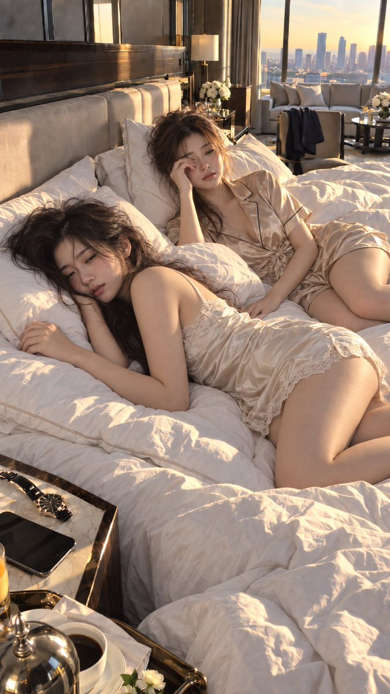

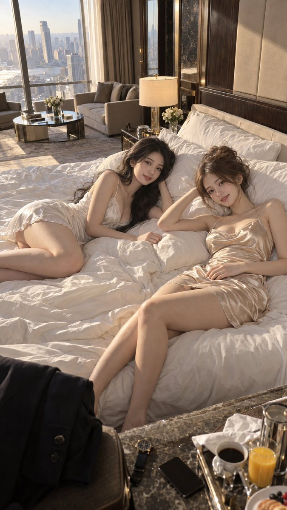

**Prompt**

```text
Traducción en curso
```

[↑ Volver a categorías](#catalog)

---

<a name="prompt-2098362443042803749"></a>

### Secuencia de acción cinematográfica de un asesino luchando contra caballeros templarios en una fortaleza de la Granada del siglo XV.

Autor：[@yourPlugAI](https://x.com/yourPlugAI) · [Publicación original](https://x.com/yourPlugAI/status/2098362443042803749)

Cine / Fotograma de película · Publicado

Publicación original：[@yourPlugAI](https://x.com/yourPlugAI) · [Publicación original](https://x.com/yourPlugAI/status/2097579893017989538)

**Resumen:** Secuencia de acción cinematográfica de un asesino luchando contra caballeros templarios en una fortaleza de la Granada del siglo XV.


**Prompt**

```text
En la Granada del siglo XV, un asesino solitario se abre paso luchando contra decenas de caballeros templarios de élite dentro de los muros de una vasta fortaleza. Valiéndose de un taijutsu ultrarrápido, aceleraciones explosivas y desvíos de espada milimétricos, convierte cada ataque enemigo en un contraataque devastador. Una secuencia de acción de 30 segundos digna de un taquillazo AAA de alto octanaje, impulsada por pura energía cinética, un seguimiento continuo de cámara IMAX y un ritmo de combate implacable.
```

[↑ Volver a categorías](#catalog)

---

<a name="prompt-2097716825668702388"></a>

### Convierte las dos imágenes de referencia en un impresionante paisaje de viaje cinematográfico y ultrarrealista con un bucle de animación de atardecer fluido que combina elementos de Estambul y de un pueblo lacustre alpino europeo.

Autor：[@KrishnaBio1](https://x.com/KrishnaBio1) · [Publicación original](https://x.com/KrishnaBio1/status/2097716825668702388)

Cine / Fotograma de película · Paisaje / Naturaleza · Publicado

**Resumen:** Convierte las dos imágenes de referencia en un impresionante paisaje de viaje cinematográfico y ultrarrealista con un bucle de animación de atardecer fluido que combina elementos de Estambul y de un pueblo lacustre alpino europeo.


**Prompt**

```text
Convierte las dos imágenes de referencia en un único e impresionante paisaje de viaje cinematográfico y ultrarrealista con un bucle de animación de atardecer fluido.

ESCENA
Combina los elementos clave de ambas imágenes en un único destino de aspecto natural. Incluye la gran mezquita de estilo otomano con múltiples minaretes y cúpulas, el paseo marítimo y los barcos de estilo estambulí de la primera imagen, junto con el apacible lago alpino, el colorido pueblo europeo, las espectaculares montañas nevadas y el hermoso castillo de piedra en la cima de la colina de la segunda imagen.

Crea una amplia vista panorámica frente al agua con arquitectura histórica a un lado y el castillo y las montañas al otro. Añade flores coloridas, árboles verdes, plantas mediterráneas, un farol vintage y una elegante terraza con una pequeña mesa de café en primer plano.

ATARDECER E ILUMINACIÓN
Hermoso atardecer de hora dorada con nubes en tonos azul pastel, rosa, melocotón y naranja. La cálida luz del sol ilumina la mezquita, el castillo, el pueblo, las montañas y los barcos. El lago refleja el atardecer, los edificios y las montañas con suaves ondas realistas y reflejos dorados.

ANIMACIÓN
Crea 16 fotogramas consecutivos de un bucle fluido y continuo. Anima únicamente el movimiento ambiental sutil: nubes que se desplazan lentamente, suaves ondas en el agua, barcos balanceándose levemente, pájaros volando en la distancia, flores y hojas de árboles moviéndose suavemente con la brisa, y un sutil parpadeo de velas/faroles.

Mantén la cámara completamente fija. Mantén la mezquita, el castillo, las montañas, las casas y todos los objetos principales perfectamente consistentes en cada fotograma. El fotograma 16 debe hacer una transición fluida de regreso al fotograma 1.

ESTILO
Fotografía de viajes cinematográfica y ultrarrealista, anuncio de turismo de lujo, impresionante atmósfera de hora dorada, arquitectura realista, montañas detalladas, vegetación natural, hermosos reflejos en el agua, profundidad atmosférica, alto rango dinámico, colores ricos pero naturales, fotografía profesional, calidad fotorrealista 8K.

CÁMARA
Vista panorámica cinematográfica amplia, lente de 24 mm, cámara fija y estable, perspectiva natural, profundidad de campo realista, encuadre e iluminación consistentes en todos los fotogramas.

AJUSTES DE ANIMACIÓN
16 fotogramas, bucle completo de aproximadamente 2,2 segundos, animación GIF continua y fluida, sin movimiento de cámara, sin parpadeos.

NEGATIVE PROMPT
cartoon, anime, painting, CGI, 3D render, low quality, distorted buildings, warped mosque, crooked minarets, malformed castle, distorted mountains, duplicated boats, floating objects, unrealistic reflections, fake water, excessive fog, oversaturated colors, extreme HDR, blurry image, motion blur, camera shake, zoom, flickering, morphing buildings, changing architecture, disappearing objects, duplicated birds, unnatural clouds, image seams, visible collage, text, logo, watermark, border, black bars, artifacts.
```

[↑ Volver a categorías](#catalog)

---

<a name="prompt-2100839251294446037"></a>

### Retrato cinematográfico de un personaje femenino con pelo bob morado atándose los zapatos en unas ruinas rodeada de humo naranja.

Autor：[@Wareenaa](https://x.com/Wareenaa) · [Publicación original](https://x.com/Wareenaa/status/2100839251294446037)

Cine / Fotograma de película · Retrato / Selfie · Personaje · Artículo de moda · Publicado

**Resumen:** Retrato cinematográfico de un personaje femenino con pelo bob morado atándose los zapatos en unas ruinas rodeada de humo naranja.

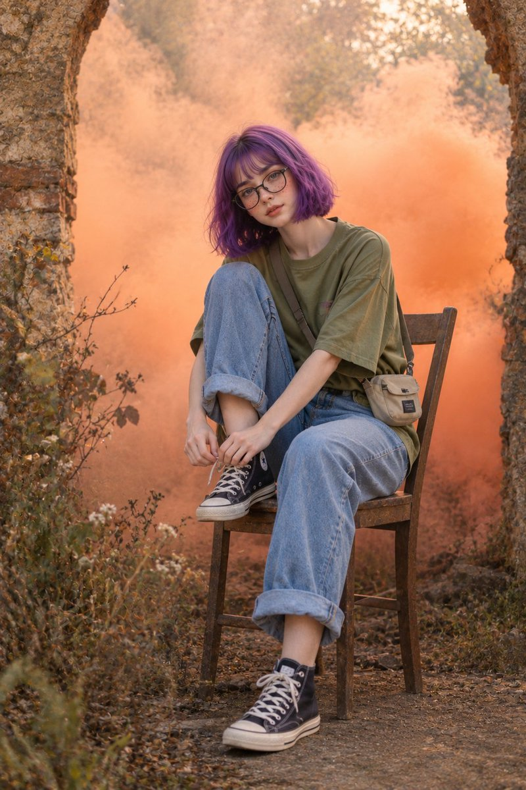

**Prompt**

```text
Crea un retrato cinematográfico hiperrealista de cuerpo entero del mismo personaje femenino joven de la imagen de referencia, conservando su apariencia característica: corte de pelo bob recto a la altura de la barbilla en color violeta púrpura vivo con flequillo suave, piel de porcelana clara, pecas naturales en la nariz y las mejillas, ojos almendrados de color avellana/marrón claro, nariz pequeña y recta, rasgos faciales delicados, labios naturales brillantes y figura esbelta.

Está sentada en una silla de madera rústica, con una rodilla levantada hacia el pecho mientras sostiene y ajusta el cordón del zapato del pie levantado. Se inclina ligeramente hacia adelante con la cabeza ladeada hacia la cámara y una expresión tranquila y relajada. Viste una camiseta holgada de manga corta oversize de color verde oliva, vaqueros de mezclilla azul claro con los bajos remangados, zapatillas de lona oscuras estilo Converse con suela blanca, gafas de montura redonda negra y un pequeño bolso cruzado/riñonera de color beige.

Ambienta la escena al aire libre entre ruinas desgastadas de piedra y ladrillo, con un antiguo arco de piedra que enmarca la composición, plantas secas y follaje en primer plano, y la silla de madera apoyada sobre un suelo de tierra natural. Llena el fondo con un denso humo de color naranja claro y melocotón, creando una bruma dramática y de ensueño.

Utiliza una iluminación natural suave y evocadora con cálidos tonos de humo pastel, sombras realistas, profundidad de campo cinematográfica, piel y cabello detallados, texturas auténticas de mezclilla y tela, neblina atmosférica, calidad fotorrealista, 8K ultradetallado, fotografía editorial de primera calidad y una estética rústica y de ensueño.
```

[↑ Volver a categorías](#catalog)

---

<a name="prompt-2097676144141312095"></a>

### Prompt de retrato cinematográfico oscuro con estética de videojuego de terror psicológico, que retrata a una mujer con misteriosas runas en el rostro, manchas de polvo y arañazos.

Autor：[@her19845](https://x.com/her19845) · [Publicación original](https://x.com/her19845/status/2097676144141312095)

Cine / Fotograma de película · Retrato / Selfie · Personaje · Publicado

**Resumen:** Prompt de retrato cinematográfico oscuro con estética de videojuego de terror psicológico, que retrata a una mujer con misteriosas runas en el rostro, manchas de polvo y arañazos.


**Prompt**

```text
**Estilo:** Fotografía cinematográfica oscura y dramática con una estética de videojuego de terror psicológico de alta gama.

**Sujeto:** La modelo incluida en la extensión de imagen. Su piel muestra texturas detalladas de suciedad, polvo y arañazos sutiles. En su mejilla se aprecian finas marcas grabadas o misteriosas runas verticales.

**Iluminación y color:** Una paleta de colores monocromática y sombría dominada por verde esmeralda oscuro, oliva y sombras profundas. La iluminación lateral esculpe el rostro, dejando la mitad de la escena en la oscuridad.

**Texturas:** Marcado grano de película analógica, poros detallados, una atmósfera polvorienta, inquietante y claustrofóbica.
```

[↑ Volver a categorías](#catalog)

---

<a name="prompt-2097222942438649948"></a>

### Plantilla de prompt para una tarjeta de viaje sostenida en la mano que muestra un paisaje de destino 3D en miniatura.

Autor：[@Goodmanprotocol](https://x.com/Goodmanprotocol) · [Publicación original](https://x.com/Goodmanprotocol/status/2097222942438649948)

Cine / Fotograma de película · Render 3D · Paisaje / Naturaleza · Publicado

**Resumen:** Plantilla de prompt para una tarjeta de viaje sostenida en la mano que muestra un paisaje de destino 3D en miniatura.


**Prompt**

```text
Crea una fotografía de viajes vertical 4:5 cinematográfica y ultrarrealista de una tarjeta de viaje elegante y minimalista sostenida de forma natural en una mano contra un cielo expansivo. Utiliza [COUNTRY NAME] como el foco creativo. Transforma la tarjeta en una ventana viva hacia el destino, con un impresionante mundo aéreo en miniatura que emerge a la perfección de su superficie. Muestra el monumento más emblemático del país, rodeado de paisajes auténticos, arquitectura, atmósfera y detalles sutiles exclusivos del destino. Haz que la transición entre la tarjeta física y el mundo en miniatura sea fluida, mágica y físicamente creíble, como si todo el destino existiera dentro de la tarjeta. Integra [COUNTRY NAME] en una tipografía elegante y en negrita en mayúsculas como parte del diseño de la tarjeta. Utiliza luz natural cinematográfica, texturas realistas, profundidad atmosférica, reflejos sutiles, perspectiva dramática, suave desenfoque de lente y una estética de fotografía de viajes editorial premium. Ultrafotorrealista, detalle en 8K, gradación de color cinematográfica, piel y materiales realistas, iluminación físicamente precisa, lujoso, emotivo, aspiracional, de belleza universal. Sin dibujos animados, sin ilustraciones, sin apariencia de CGI artificial.
```

[↑ Volver a categorías](#catalog)

---

<a name="prompt-2096808538534514913"></a>

### Retrato cinematográfico de un hombre con suéter beige y cálida iluminación dorada de contorno contra un fondo taciturno.

Autor：[@iamsofiaijaz](https://x.com/iamsofiaijaz) · [Publicación original](https://x.com/iamsofiaijaz/status/2096808538534514913)

Cine / Fotograma de película · Retrato / Selfie · Personaje · Resumen / Antecedentes · Publicado

**Resumen:** Retrato cinematográfico de un hombre con suéter beige y cálida iluminación dorada de contorno contra un fondo taciturno.


**Prompt**

```text
Retrato cinematográfico fotorrealista de un apuesto hombre adulto con cabello castaño despeinado de longitud media y una barba prolijamente recortada, vistiendo un suave suéter de punto beige de cuello redondo. Mira a la cámara con una expresión tranquila, confiada y ligeramente contemplativa. Una cálida iluminación de contorno dorada crea un halo brillante alrededor de su cabello y hombros, con una suave pero potente luz principal iluminando su rostro. Fondo oscuro y melancólico con una sutil neblina ámbar y humo atmosférico, iluminación dramática de alto contraste, textura de piel natural, ojos nítidos, detalles faciales realistas, profundidad de campo reducida, fotografía de estudio profesional, lente para retratos de 85 mm, f/1.8, efecto bokeh cremoso, etalonaje cinematográfico cálido, estética editorial de lujo, ultradetallado, fotorrealista, 8K.
```

[↑ Volver a categorías](#catalog)

---

<a name="category-anime-manga"></a>

## Anime / Manga

<a name="prompt-2097834253748949105"></a>

### Prompt para dibujar a Chiikawa y Usagi al estilo dramático gekiga de JoJo.

Autor：[@namatorihamu](https://x.com/namatorihamu) · [Publicación original](https://x.com/namatorihamu/status/2097834253748949105)

Anime / Manga · Ilustración · Publicado

**Resumen:** Prompt para dibujar a Chiikawa y Usagi al estilo dramático gekiga de JoJo.


**Prompt**

```text
Muestra a Chiikawa y Usagi al estilo de JoJo
```

[↑ Volver a categorías](#catalog)

---

<a name="prompt-2099334317306761376"></a>

### El prompt instruye la generación de un retrato de técnica mixta que combina a una persona realista con una sombra en garabato manga exagerada que imita su pose.

Autor：[@itxsarmadd](https://x.com/itxsarmadd) · [Publicación original](https://x.com/itxsarmadd/status/2099334317306761376)

Anime / Manga · Retrato / Selfie · Personaje · Publicado

**Resumen:** El prompt instruye la generación de un retrato de técnica mixta que combina a una persona realista con una sombra en garabato manga exagerada que imita su pose.

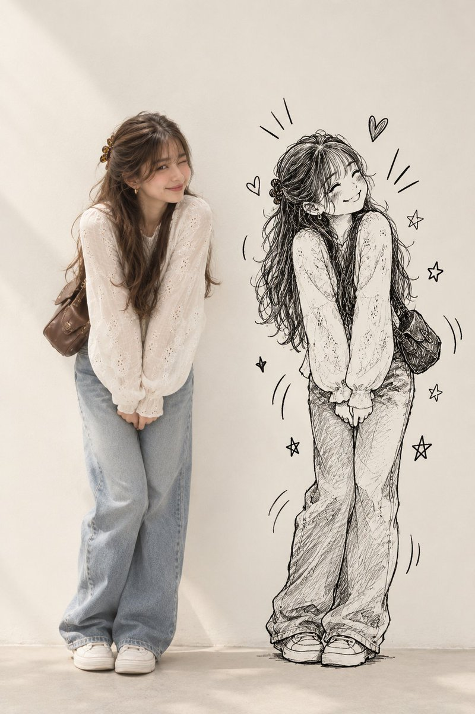

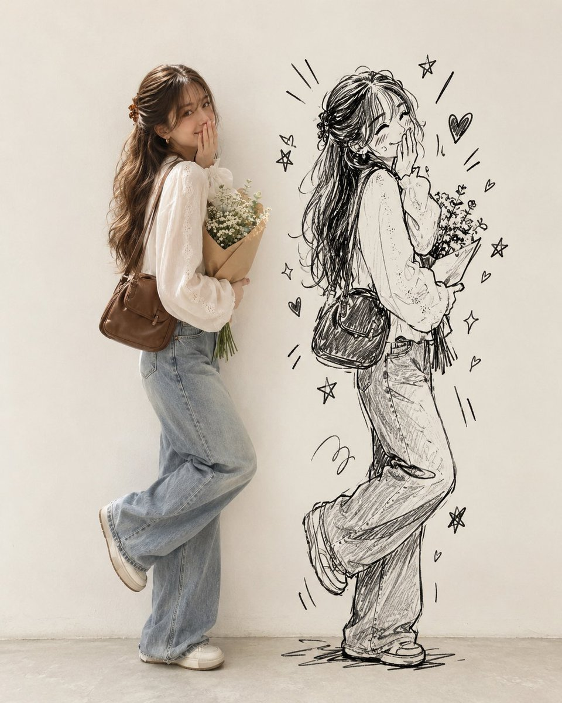

**Prompt**

```text
Utiliza la imagen de referencia subida como referencia estricta de identidad y vestimenta. Conserva el rostro, los rasgos faciales, el tono de piel, el peinado, el color de pelo, los accesorios, el atuendo y la vibra general exactamente como se muestra.
Crea un retrato de técnica mixta vertical de alta calidad (4:5 o 9:16) que incluya:
Una versión realista de cuerpo entero de la persona. Una sombra en garabato negro dibujada a mano de la misma persona en la pared junto a ella.

La persona real debe verse linda, ligeramente avergonzada, juguetona y copiando de forma natural una nueva pose traviesa al azar en cada generación. La sombra en garabato debe realizar la misma idea de pose de una manera mucho más exagerada, caótica y caricaturesca, con líneas de movimiento estilo manga, estrellas, corazones y destellos.

Utiliza una pared de estudio limpia en color blanco/crema, un fondo minimalista, iluminación natural suave y mantén ambas figuras totalmente visibles. El garabato debe parecerse claramente a la persona real a través del peinado, los accesorios, la silueta del atuendo y la pose.

Negative Prompt: cambios de atuendo, cambios de identidad, segunda persona realista, sombra normal, terror, humano estilo anime, fondo desordenado, poses repetidas de señalar o pistola con los dedos, pose rígida, extremidades/dedos adicionales, cuerpo distorsionado, texto, marca de agua, logotipo, artefactos de IA.
```

[↑ Volver a categorías](#catalog)

---

<a name="category-illustration"></a>

## Ilustración

<a name="prompt-2097713691433070629"></a>

### Petición a ChatGPT para que dibuje un autorretrato con una placa de identificación que indique su número de versión.

Autor：[@Tz\_2022](https://x.com/Tz_2022) · [Publicación original](https://x.com/Tz_2022/status/2097713691433070629)

Ilustración · Retrato / Selfie · Publicado

**Resumen:** Petición a ChatGPT para que dibuje un autorretrato con una placa de identificación que indique su número de versión.


**Prompt**

```text
Dibuja un autorretrato de ti mismo, con una placa de identificación, y que la placa de identificación tenga tu número de versión
```

[↑ Volver a categorías](#catalog)

---

<a name="prompt-2097521286436065680"></a>

### Generar un examen con maquetación de inglés de nivel 4 \(CET-4\) ilustrado, combinando el contenido con preguntas de exámenes de oposiciones/función pública.

Autor：[@Tz\_2022](https://x.com/Tz_2022) · [Publicación original](https://x.com/Tz_2022/status/2097521286436065680)

Ilustración · Texto / Tipografía · Publicado

Publicación original：[@Lonely\_\_MH](https://x.com/Lonely__MH) · [Publicación original](https://x.com/Lonely__MH/status/2097494755752202574)

**Resumen:** Generar un examen con maquetación de inglés de nivel 4 \(CET-4\) ilustrado, combinando el contenido con preguntas de exámenes de oposiciones/función pública.


**Prompt**

```text
Crea una hoja de examen con formato CET-4 (nivel 4 de inglés), pero con todas las preguntas pertenecientes a exámenes de funcionarios públicos, con ilustraciones y texto complementados adecuadamente
```

[↑ Volver a categorías](#catalog)

---

<a name="category-sketch-line-art"></a>

## Boceto / Dibujo lineal

<a name="prompt-2097284686448046135"></a>

### Prompt para generar bocetos arquitectónicos de diario de viaje dibujados a mano y minimalistas sobre papel marfil.

Autor：[@Naiknelofar788](https://x.com/Naiknelofar788) · [Publicación original](https://x.com/Naiknelofar788/status/2097284686448046135)

Boceto / Dibujo lineal · Arquitectura / Interiorismo · Publicado

**Resumen:** Prompt para generar bocetos arquitectónicos de diario de viaje dibujados a mano y minimalistas sobre papel marfil.


**Prompt**

```text
Crea una obra de arte arquitectónica minimalista dibujada a mano de [STRUCTURE] sobre papel marfil cálido. Muestra la estructura como un boceto en tinta simple y elegante con líneas limpias e imperfectas, un sutil sombreado a lápiz, diminutas anotaciones manuscritas y algunos detalles arquitectónicos delicados. Mantén la composición diáfana con abundante espacio en blanco, tonos tierra apagados, una textura suave de papel y una auténtica sensación de diario de viaje hecho a mano. Sin fotorrealismo, sin detalles recargados, sin desorden: simple, artístico y refinado.
```

[↑ Volver a categorías](#catalog)

---

<a name="prompt-2096902953110299096"></a>

### El prompt transforma una foto de referencia en un póster vertical 50/50, combinando la foto original arriba con un boceto de lápices de colores y acuarela abajo.

Autor：[@MissDelulu9](https://x.com/MissDelulu9) · [Publicación original](https://x.com/MissDelulu9/status/2096902953110299096)

Póster / Folleto · Boceto / Dibujo lineal · Acuarela · Publicado

**Resumen:** El prompt transforma una foto de referencia en un póster vertical 50/50, combinando la foto original arriba con un boceto de lápices de colores y acuarela abajo.


**Prompt**

```text
Crea un póster vertical premium de diario de viaje dividido exactamente al 50/50.

50% superior: Mantén la foto de referencia original completamente real y sin cambios: misma composición, arquitectura, personas, colores, iluminación, perspectiva y detalles.

50% inferior: Transforma la misma foto en un delicado boceto hecho a mano con lápices de colores y acuarela sobre papel crema cálido, con trazos de lápiz visibles, aguadas suaves, textura de papel sutil, contornos imperfectos y un suave tramado cruzado. Mantén reconocibles todos los elementos y sujetos.

Añade un texto manuscrito elegante: “A Beautiful Day” arriba y “Memories to Keep” abajo. Estética minimalista, nostálgica y sofisticada de revista de viajes. Sin objetos adicionales, sin fotorrealismo en la mitad inferior, composición exacta al 50/50.
```

[↑ Volver a categorías](#catalog)

---

<a name="prompt-2097176979497791899"></a>

### El prompt transforma fotos en un póster de arte editorial con estilo de boceto en técnica mixta y diseño minimalista.

Autor：[@saniaspeaks\_](https://x.com/saniaspeaks_) · [Publicación original](https://x.com/saniaspeaks_/status/2097176979497791899)

Póster / Folleto · Boceto / Dibujo lineal · Publicado

**Resumen:** El prompt transforma fotos en un póster de arte editorial con estilo de boceto en técnica mixta y diseño minimalista.


**Prompt**

```text
Crea un póster de arte editorial premium para cada fotografía subida, tratando cada imagen como su propia composición independiente y sin fusionar nunca varias fotos. Utiliza un formato vertical estricto de 3:4 con el lienzo dividido en dos mitades horizontales perfectamente iguales: la mitad superior debe seguir siendo una presentación fiel y fotorrealista de la imagen original, preservando la identidad exacta del sujeto, sus rasgos faciales, proporciones, pose, vestimenta, objetos, composición, iluminación, sombras, atmósfera y colores naturales, mejorada únicamente con una sofisticada gradación de color editorial y una extensión ambiental fluida donde sea necesario; la mitad inferior debe transformar la historia visual en una interpretación artística completamente diferente: una pequeña obra de arte mixta hecha a mano, cuidadosamente compuesta y centrada dentro de un amplio espacio negativo de color marfil cálido, que no ocupe más del 10-20 % de la sección inferior, utilizando expresivos bocetos a tinta, campos de color estratificados similares al gouache, sutiles texturas de collage, bordes de papel rasgado, pinceladas imperfectas, fibras visibles, suaves variaciones de pigmento y encantadoras imperfecciones humanas, al tiempo que conserva la silueta, el gesto, los objetos y la narrativa emocional más reconocibles de la foto original. Extrae hasta cuatro colores armoniosos dominantes de cada fotografía y reinterprétalos en una paleta sobria y sofisticada. Añade únicamente una tipografía editorial discreta y ocasional cuando realmente mejore la composición, como un título poético, un lugar, una fecha o una sola palabra. El resultado global debe transmitir la sensación de la portada de una publicación de arte contemporáneo de colección: minimalista, poética, táctil, elegante, emocionalmente tranquila, visualmente distintiva e inequívocamente conectada con su fotografía original.
```

[↑ Volver a categorías](#catalog)

---

<a name="category-3d-render"></a>

## Render 3D

<a name="prompt-2100051568154538130"></a>

### Traducción en curso

Autor：[@DeepBlueX0](https://x.com/DeepBlueX0) · [Publicación original](https://x.com/DeepBlueX0/status/2100051568154538130)

Fotografía · Render 3D · Personaje · Paisaje urbano / Calle · Publicado

Publicación original：[@DeepBlueX0](https://x.com/DeepBlueX0) · [Publicación original](https://x.com/DeepBlueX0/status/2099508984541769771)

**Resumen:** Traducción en curso

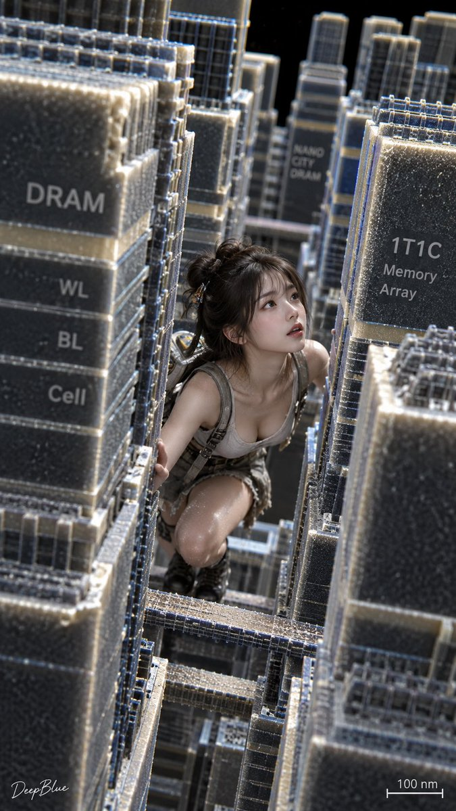

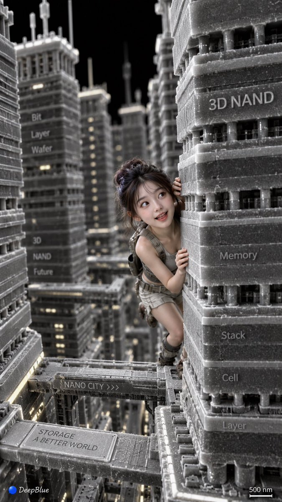

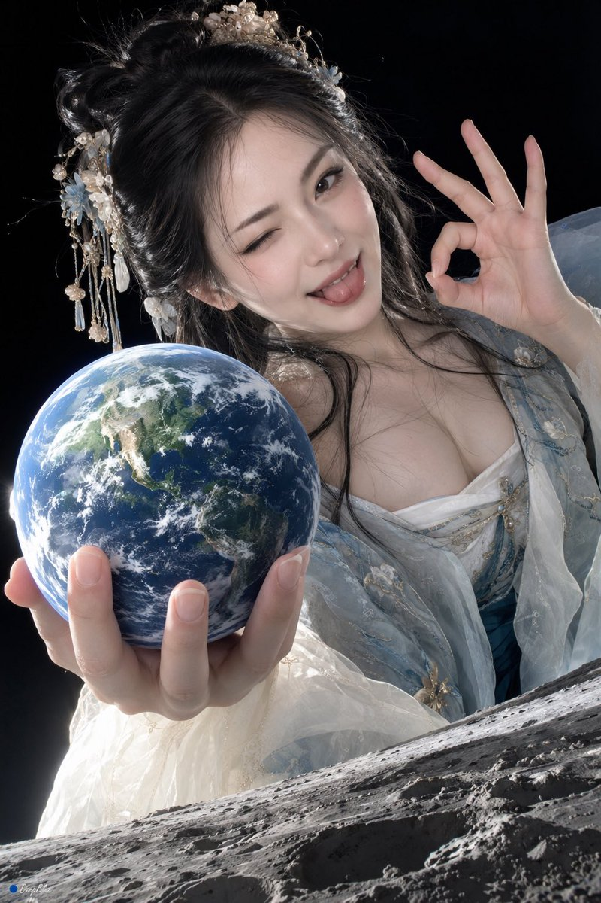

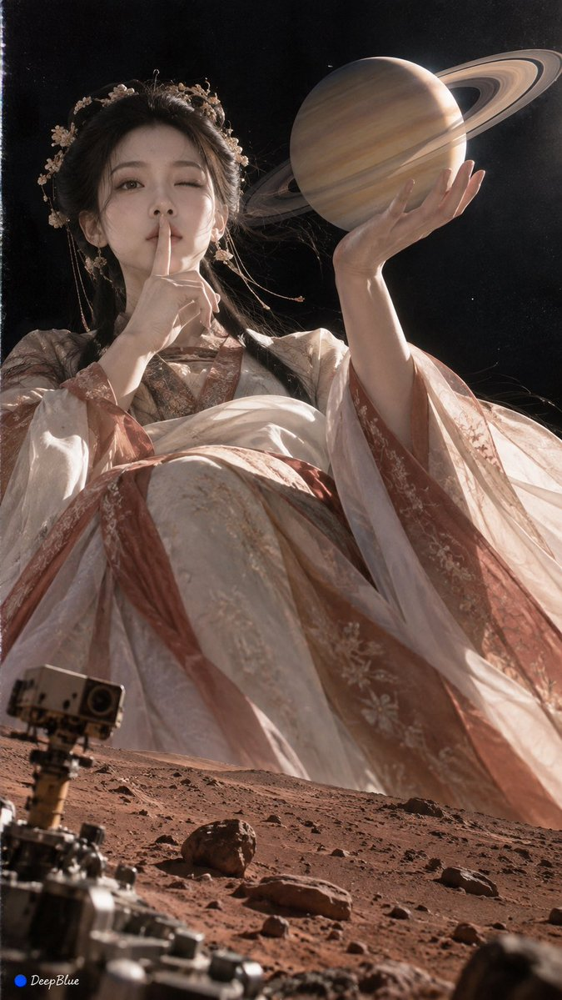

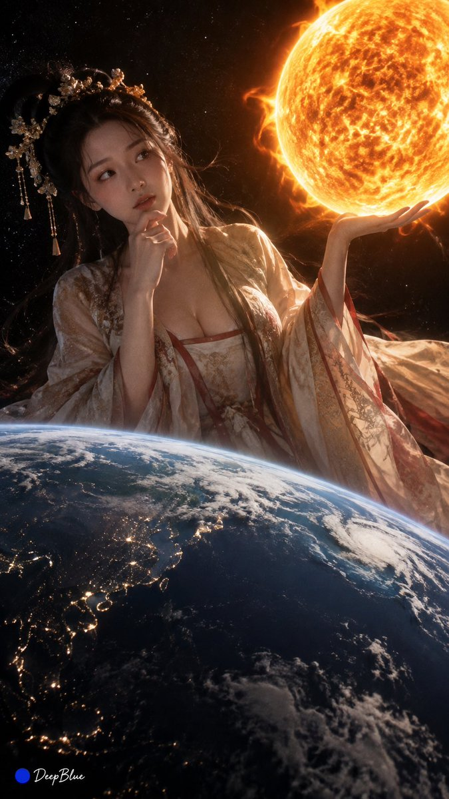

**Prompt**

```text
Traducción en curso
```

[↑ Volver a categorías](#catalog)

---

<a name="prompt-2097646788258021837"></a>

### Prompt de diorama de viaje 3D en miniatura artesanal con monumentos urbanos emblemáticos sobre papel texturizado.

Autor：[@Naiknelofar788](https://x.com/Naiknelofar788) · [Publicación original](https://x.com/Naiknelofar788/status/2097646788258021837)

Render 3D · Publicado

**Resumen:** Prompt de diorama de viaje 3D en miniatura artesanal con monumentos urbanos emblemáticos sobre papel texturizado.


**Prompt**

```text
Crea una encantadora escena de viaje en miniatura hecha a mano con [ICONIC STRUCTURE] como punto focal principal.
Muestra el monumento como un diminuto modelo 3D hermosamente esculpido, con detalles redondeados y suaves, texturas artesanales, delicadas imperfecciones y un aire caprichoso de libro de cuentos. Rodéalo de unos pocos elementos sutiles que representen su ubicación —como árboles diminutos, flores, calles, barcos, montañas, nubes u objetos locales— sin sobrecargar la escena.

Colócalo todo sobre un fondo limpio de papel texturizado blanco cálido, con abundante y elegante espacio negativo. Añade una pequeña y elegante placa de viaje de madera o papel que contenga:

[STRUCTURE NAME]
[CITY, COUNTRY]
Famous for: [SHORT UNIQUE FACT]

Utiliza iluminación natural suave, sombras delicadas, colores pastel pero realistas, profundidad de diorama en miniatura, texturas artesanales de arcilla o papel y una estética cuidada y adorable de diario de viaje. Composición centrada, monumento muy detallado, adorable pero sofisticado, diseño de tarjeta de viaje limpio y coleccionable, sin personas fotorrealistas, sin desorden.
```

[↑ Volver a categorías](#catalog)

---

<a name="prompt-2097580884098764800"></a>

### Crea un diorama 3D en miniatura, prémium y adorable, de un monumento con texto de placa de recuerdo.

Autor：[@Naiknelofar788](https://x.com/Naiknelofar788) · [Publicación original](https://x.com/Naiknelofar788/status/2097580884098764800)

Render 3D · Arquitectura / Interiorismo · Publicado

**Resumen:** Crea un diorama 3D en miniatura, prémium y adorable, de un monumento con texto de placa de recuerdo.


**Prompt**

```text
Crea un diorama 3D en miniatura, prémium y adorable, de [NOMBRE DE LA ESTRUCTURA], [CIUDAD, PAÍS]. Mantén el monumento reconocible, elegante y encantador, con una composición limpia, tonos pastel suaves, sutiles detalles artesanales, iluminación natural suave y una refinada estética de recuerdo de viaje.

Incluye texto minimalista y de buen gusto:
[NOMBRE DE LA ESTRUCTURA]
[CIUDAD, PAÍS]
Famoso por: [BREVE DESCRIPCIÓN]
```

[↑ Volver a categorías](#catalog)

---

<a name="prompt-2097587863139537262"></a>

### Captura de pantalla de juego en primera persona en la playa de un RPG de romance 3D ficticio, que incluye a Morrigan Aensland y una interfaz de usuario de interacción HUD completa del juego.

Autor：[@underwoodxie96](https://x.com/underwoodxie96) · [Publicación original](https://x.com/underwoodxie96/status/2097587863139537262)

Diseño de aplicaciones / web · Render 3D · Personaje · Publicado

Publicación original：[@underwoodxie96](https://x.com/underwoodxie96) · [Publicación original](https://x.com/underwoodxie96/status/2097554154554314891)

**Resumen:** Captura de pantalla de juego en primera persona en la playa de un RPG de romance 3D ficticio, que incluye a Morrigan Aensland y una interfaz de usuario de interacción HUD completa del juego.


**Prompt**

```text
Por favor, captura una captura de pantalla realista de un RPG de romance de mundo abierto en 3D de próxima generación ficticio, presentado desde la perspectiva en primera persona del protagonista masculino. En la playa, Morrigan Aensland de Darkstalkers invita al protagonista a ayudarla a aplicarse protector solar. El estilo visual general debe contar con personajes 3D renderizados con sombreado plano (cel-shaded) de alta calidad combinados con gráficos al nivel de Unreal Engine 5, logrando una fidelidad visual de calidad AAA. Debe incluir un modelado de personajes ultra detallado, sombreado de piel realista, iluminación cinematográfica, materiales PBR, texturas de ropa de alta precisión y entornos renderizados con delicadeza. La imagen final debe parecer una captura de pantalla real de un juego jugable, incluyendo una interfaz de usuario del juego completa: minimapa, visualización de misiones, barras de estado de personajes, avisos de interacción, subtítulos de diálogo, elementos de HUD y más.
```

[↑ Volver a categorías](#catalog)

---

<a name="prompt-2097704623952035841"></a>

### Plantilla de prompt para generar mapas de recuerdo coleccionables en miniatura 3D de países, destacando ciudades y monumentos específicos.

Autor：[@Naiknelofar788](https://x.com/Naiknelofar788) · [Publicación original](https://x.com/Naiknelofar788/status/2097704623952035841)

Render 3D · Publicado

**Resumen:** Plantilla de prompt para generar mapas de recuerdo coleccionables en miniatura 3D de países, destacando ciudades y monumentos específicos.


**Prompt**

```text
Crea un encantador mapa en miniatura 3D de [COUNTRY] con las fronteras nacionales claramente delimitadas y con su forma precisa. Coloca una chincheta de ubicación grande y elegante exactamente en [CITY], con [ICONIC LANDMARK] elevándose desde el mapa en la ubicación de la chincheta. Añade diminutas carreteras, montañas, ríos, edificios, árboles y sutiles detalles culturales dentro del país. Haz que el mapa esté ligeramente en relieve y sea escultural, con terreno en capas, sombras suaves, bordes redondeados y texturas de miniatura artesanal. Utiliza una paleta refinada inspirada en [COUNTRY], fondo marfil cálido, iluminación suave de estudio y una composición limpia y prémium. Añade un texto elegante: “[CITY]” y debajo “[COUNTRY] • [FAMOUS FOR]”. Estética de recuerdo de viaje en 3D coleccionable, adorable, sofisticada y altamente reconocible.
```

[↑ Volver a categorías](#catalog)

---

<a name="category-pixel-art"></a>

## Pixel Art

<a name="prompt-2100265645103612367"></a>

### Prompt para generar una hoja de sprites de acción en pixel art 2D de 4x4 y 16 fotogramas del monstruo de haba «Soramameman».

Autor：[@nostalGGames](https://x.com/nostalGGames) · [Publicación original](https://x.com/nostalGGames/status/2100265645103612367)

Pixel Art · Publicado

**Resumen:** Prompt para generar una hoja de sprites de acción en pixel art 2D de 4x4 y 16 fotogramas del monstruo de haba «Soramameman».

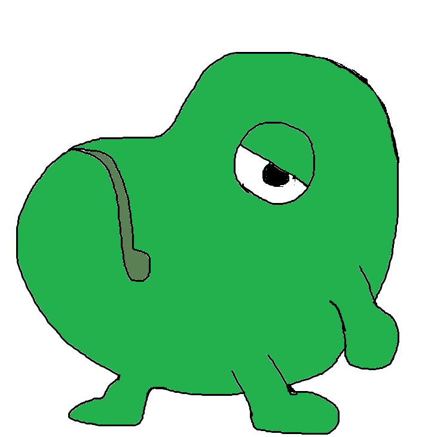

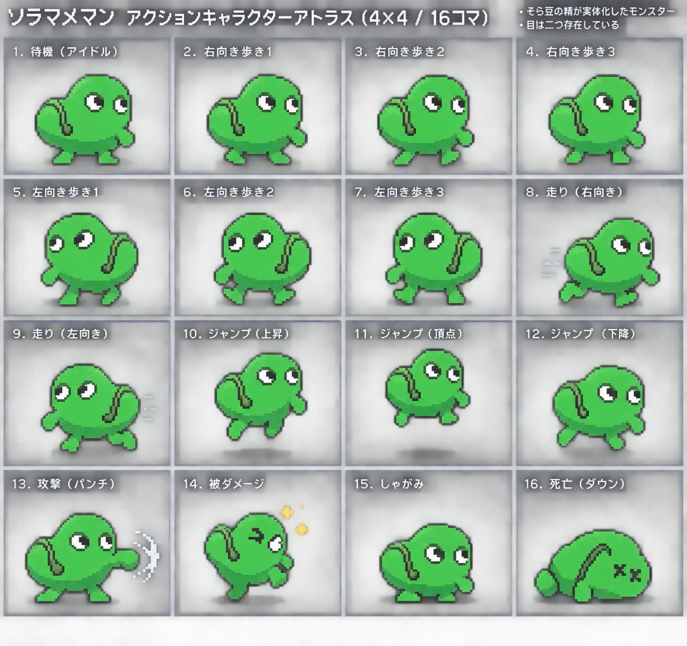

**Prompt**

```text
- Monstruo que es la materialización del espíritu de un haba
- Tiene dos ojos
- Transformar a Soramameman en pixel art 2D
- Crear un atlas de personaje con acciones
- Generar un sprite como una cuadrícula de 4x4 con 16 fotogramas de acción
```

[↑ Volver a categorías](#catalog)

---

<a name="prompt-2097863751471157498"></a>

### Genera una hoja de sprites \(Sprite Sheet\) en píxel art 2D cuadrada de 16 fotogramas en cuadrícula 4×4 con acción continua basada en la imagen de referencia, manteniendo proporciones y línea base constantes con instrucciones de bucle perfecto que incluyen reposo, carga, impacto y recuperación.

Autor：[@derek\_wall90176](https://x.com/derek_wall90176) · [Publicación original](https://x.com/derek_wall90176/status/2097863751471157498)

Activo de juego · Pixel Art · Personaje · Publicado

**Resumen:** Genera una hoja de sprites \(Sprite Sheet\) en píxel art 2D cuadrada de 16 fotogramas en cuadrícula 4×4 con acción continua basada en la imagen de referencia, manteniendo proporciones y línea base constantes con instrucciones de bucle perfecto que incluyen reposo, carga, impacto y recuperación.


**Prompt**

```text
Sube la Imagen 1 como única referencia para la identidad y la vestimenta del personaje.

Transforma el personaje de la Imagen 1 en un personaje de videojuego en píxel art 2D de alta calidad, generando una hoja de sprites (Sprite Sheet) cuadrada de acción continua, dividida uniformemente en una cuadrícula de 4×4 con un total de 16 fotogramas.

El tamaño de cada casilla debe ser exactamente el mismo. La animación se reproduce en orden de izquierda a derecha y de arriba a abajo.

Conserva estrictamente la forma del rostro, el peinado, la complexión corporal, la paleta de colores de la ropa, los accesorios distintivos y la estructura de las armas del personaje. Los 16 fotogramas deben utilizar la misma escala de píxeles, tamaño de personaje, orientación y paleta de colores.

El personaje realiza una acción completa de 【ataque con espada / salto / voltereta / lanzamiento de hechizo / embestida】.

Los fotogramas 1 a 3 corresponden a la postura de espera (idle) y carga de energía; los fotogramas 4 a 7 representan el desplazamiento del centro de gravedad y el despliegue del movimiento; los fotogramas 8 a 10 ejecutan el ataque principal y la liberación de fuerza; los fotogramas 11 a 13 muestran la inercia y la recuperación del movimiento; los fotogramas 14 a 16 regresan al estado de espera. El fotograma 16 debe enlazarse de forma natural y fluida con el fotograma 1.

Los fotogramas adyacentes solo deben modificar las articulaciones, siluetas, caída de la ropa, cabello y posición del arma estrictamente necesarios para completar la acción. La dirección del movimiento, las relaciones de fuerza y la trayectoria del desplazamiento deben mantener una continuidad perfecta.

Todas las casillas deben mantener la misma posición de cámara, escala del personaje, línea base del suelo y centro del encuadre. El personaje debe mostrarse por completo, sin cortar la cabeza, armas, cola ni efectos especiales.

Prioriza el fondo con canal alfa transparente. Si el fondo transparente resulta inestable, utiliza un fondo de color sólido uniforme para facilitar el recorte posterior. No generes escenarios, texturas de suelo, líneas de cuadrícula, números ni texto.

Utiliza píxeles nítidos de bordes duros (hard-edge), una paleta de colores limitada y una densidad de píxeles uniforme. Quedan prohibidos los bordes difuminados, el suavizado de bordes (anti-aliasing), el renderizado semirrealista, los fotogramas repetidos, los saltos de animación, la deformación del personaje, los cambios de vestuario, la adición o eliminación de armas, los cambios de ángulo de cámara y el reencuadre en cada casilla.
```

[↑ Volver a categorías](#catalog)

---

<a name="prompt-2097574111518375970"></a>

### Prompt para generar una hoja de sprites en pixel art basada en el personaje adjunto, que representa 4 acciones \(correr, saltar, ataque giratorio y caer abatido, de 4 fotogramas cada una\).

Autor：[@npaka123](https://x.com/npaka123) · [Publicación original](https://x.com/npaka123/status/2097574111518375970)

Pixel Art · Personaje · Publicado

**Resumen:** Prompt para generar una hoja de sprites en pixel art basada en el personaje adjunto, que representa 4 acciones \(correr, saltar, ataque giratorio y caer abatido, de 4 fotogramas cada una\).


**Prompt**

```text
Unifica el rostro, peinado, atuendo, combinación de colores y complexión del personaje adjunto, y genera una única imagen de hoja de sprites (sprite sheet) en pixel art con 4 tipos de movimientos vistosos para videojuegos, con un máximo de 4 fotogramas cada uno. El tamaño de cada fotograma es de 256x256 px.
· Correr: inclinar el cuerpo hacia adelante y mover los brazos y piernas de forma amplia y alterna.
· Saltar: agacharse → impulsarse hacia arriba → extender brazos y piernas en el aire → aterrizar.
· Ataque giratorio: de frente → de perfil → de espaldas → de perfil opuesto, completando un giro entero con todo el cuerpo.
· Caer abatido: tambalearse → inclinarse hacia un lado → tumbarse en el suelo → cerrar los ojos y quedarse inmóvil.
Coloca una acción por fila en disposición horizontal, y alinea el tamaño, la posición de los pies, el centro y la escala de todas las celdas. El fondo debe ser de un color plano completamente uniforme, sin sombras, texto, marcos, números, interfaz de usuario (UI), desenfoques, semitransparencias, degradados ni suavizado de bordes (antialiasing). Las acciones en bucle deben conectarse de forma fluida y natural entre el primer y el último fotograma.
```

[↑ Volver a categorías](#catalog)

---

<a name="prompt-2097573967955730524"></a>

### Instrucción para generar una hoja de sprites basada en una imagen de referencia, organizando 4 tipos de acciones en pixel art para videojuegos \(correr, saltar, ataque giratorio y caer derrotado\) con 4 fotogramas cada una.

Autor：[@npaka123](https://x.com/npaka123) · [Publicación original](https://x.com/npaka123/status/2097573967955730524)

Pixel Art · Personaje · Publicado

**Resumen:** Instrucción para generar una hoja de sprites basada en una imagen de referencia, organizando 4 tipos de acciones en pixel art para videojuegos \(correr, saltar, ataque giratorio y caer derrotado\) con 4 fotogramas cada una.


**Prompt**

```text
Mantén la coherencia en el rostro, peinado, atuendo, paleta de colores y complexión del personaje adjunto, y genera una única imagen de hoja de sprites (sprite sheet) con 4 tipos de movimientos en pixel art ideales para videojuegos, con un máximo de 4 fotogramas por cada uno. El tamaño de cada fotograma es de 256x256 px.
· Correr: inclinar el cuerpo hacia adelante y mover brazos y piernas alternadamente de forma amplia.
· Saltar: agacharse → impulsarse hacia arriba → extender brazos y piernas en el aire → aterrizar.
· Ataque giratorio: de frente → de perfil → de espaldas → del perfil opuesto, completando un giro entero de todo el cuerpo.
· Caer derrotado: tambalearse → inclinarse hacia un lado → caer al suelo tumbado → cerrar los ojos y quedarse inmóvil.
Dispone una acción por fila en una hilera horizontal, alineando el tamaño de todas las celdas, el nivel de los pies, el centro y la escala. El fondo debe ser de un color completamente plano y sólido; no utilices sombras, texto, marcos, números, elementos de interfaz (UI), desenfoque, semitransparencias, degradados ni suavizado de bordes (anti-aliasing). Las acciones en bucle deben enlazar de forma fluida y natural entre el primer y el último fotograma.
```

[↑ Volver a categorías](#catalog)

---

<a name="prompt-2097559943075533257"></a>

### Instrucción para generar un bucle de animación en hoja de sprites de 16 fotogramas de un goblin masculino de estilo pixel art tensando un arco y disparando.

Autor：[@Fomsky\_Wei](https://x.com/Fomsky_Wei) · [Publicación original](https://x.com/Fomsky_Wei/status/2097559943075533257)

Pixel Art · Publicado

**Resumen:** Instrucción para generar un bucle de animación en hoja de sprites de 16 fotogramas de un goblin masculino de estilo pixel art tensando un arco y disparando.


**Prompt**

```text
No utilices habilidades, crea una hoja de sprites\nEsta imagen contiene el proceso de un goblin masculino en estilo pixel art tensando un arco y disparando una flecha\nEn total 16 fotogramas.\nLuego corta la imagen y crea un gif en bucle infinito
```

[↑ Volver a categorías](#catalog)

---

<a name="category-watercolor"></a>

## Acuarela

<a name="prompt-2097637962137895058"></a>

### Prompt para transformar una foto en una ilustración estilo diario de viaje dibujado a mano con lápices de colores y acuarela retro

Autor：[@tataemugc](https://x.com/tataemugc) · [Publicación original](https://x.com/tataemugc/status/2097637962137895058)

Ilustración · Acuarela · Retro / Vintage · Publicado

Publicación original：[@Crypto\_QianXun](https://x.com/Crypto_QianXun) · [Publicación original](https://x.com/Crypto_QianXun/status/2097174853707284785)

**Resumen:** Prompt para transformar una foto en una ilustración estilo diario de viaje dibujado a mano con lápices de colores y acuarela retro


**Prompt**

```text
Transforma la foto en un estilo de diario de viaje dibujado a mano con lápices de colores y acuarela. Mantén la composición original, los edificios, las personas, los árboles, el césped, la carretera y la perspectiva sin cambios. Utiliza un papel envejecido de color beige cálido para transmitir una sensación artesanal con trazos de pluma y aguadas de acuarela visibles. Simplifica los edificios en formas expresivas, añadiendo contornos sueltos, finos sombreados cruzados y bordes ligeramente imperfectos. Mantén la atmósfera de un día despejado de verano, un cielo azul suave, edificios en beige cálido, hierba verde y personas y bancos dispersos de forma relajada. Utiliza tonos de boceto de viaje vintage y desgastados. Coloca la ilustración en la mitad inferior de la página y deja un amplio espacio en blanco beige en la parte superior. Escribe a mano en la parte superior '맑은 날씨' y en la parte inferior '— 소중한 순간 —'. Con un estilo de revista de viajes artística y nostálgica, como un recuerdo de cuaderno de bocetos personal, sin ningún aspecto fotográfico.
```

[↑ Volver a categorías](#catalog)

---

<a name="category-ink-chinese-style"></a>

## Tinta / Estilo chino

<a name="prompt-2100241141967081911"></a>

### Prompt de fotografía en primerísimo plano extremo de arte de uñas de estilo tradicional chino centrado en la estética de la dinastía Song, que enfatiza fijar el enfoque en el exquisito impacto visual de la manicura.

Autor：[@DeepBlueX0](https://x.com/DeepBlueX0) · [Publicación original](https://x.com/DeepBlueX0/status/2100241141967081911)

Fotografía · Tinta / Estilo chino · Publicado

Publicación original：[@DeepBlueX0](https://x.com/DeepBlueX0) · [Publicación original](https://x.com/DeepBlueX0/status/2100101510634037441)

**Resumen:** Prompt de fotografía en primerísimo plano extremo de arte de uñas de estilo tradicional chino centrado en la estética de la dinastía Song, que enfatiza fijar el enfoque en el exquisito impacto visual de la manicura.

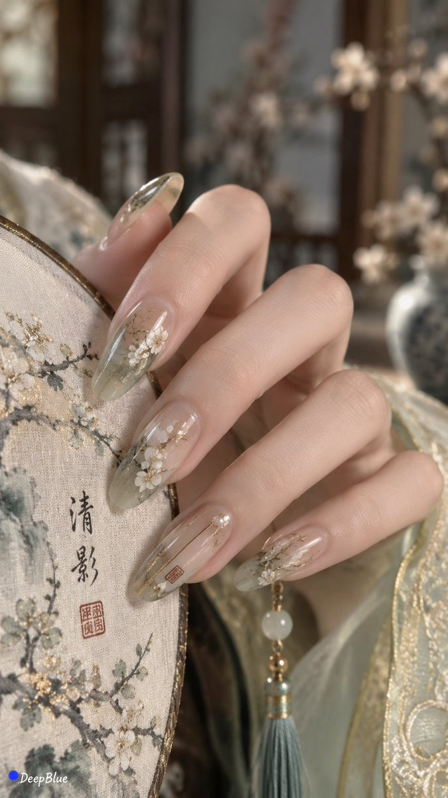

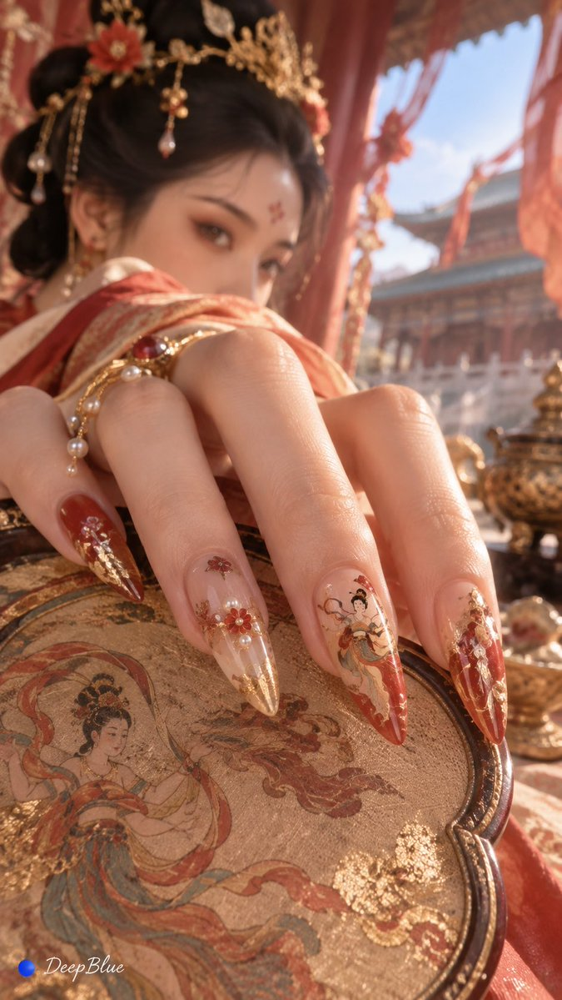

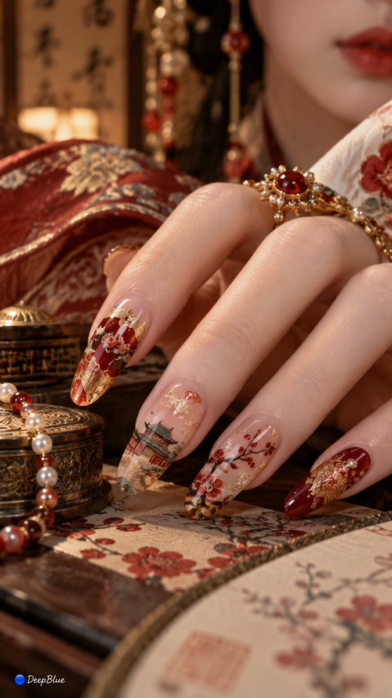

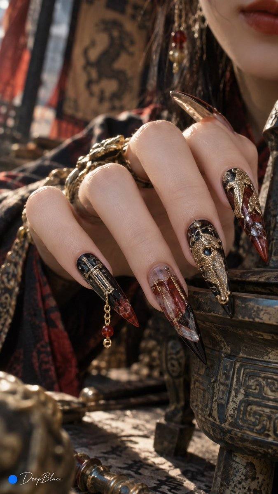

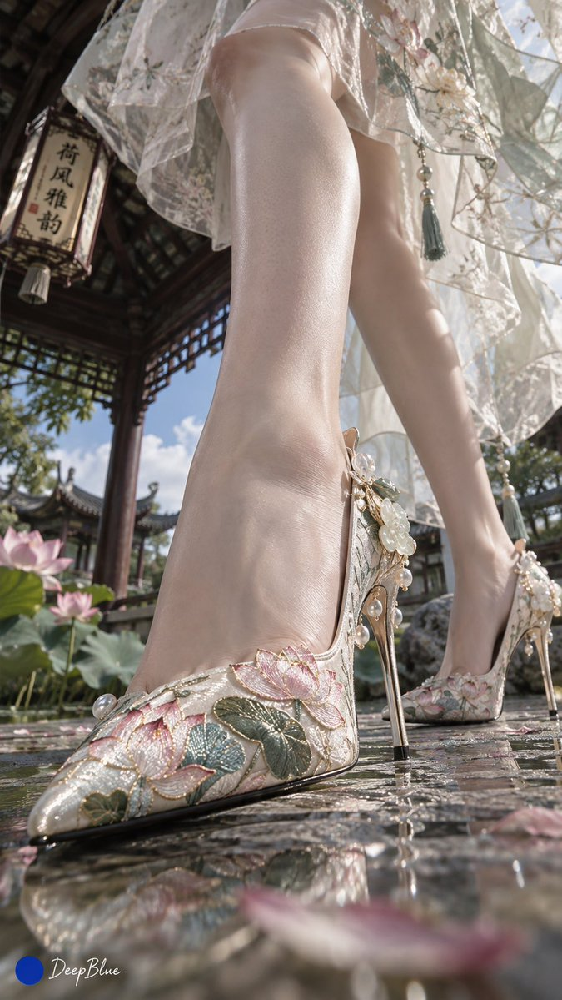

**Prompt**

```text
Estética de la dinastía Song × Primerísimo primer plano extremo de manicura de estilo Song × Enfoque fijado en el arte de uñas como elemento visual principal
```

[↑ Volver a categorías](#catalog)

---

<a name="category-retro-vintage"></a>

## Retro / Vintage

<a name="prompt-2100099718605135962"></a>

### Prompt de póster de viaje de streetwear japonés vintage con una modelo de moda táctica sobre un collage urbano con tipografía en papel envejecido.

Autor：[@harboriis](https://x.com/harboriis) · [Publicación original](https://x.com/harboriis/status/2100099718605135962)

Póster / Folleto · Retro / Vintage · Influencer / Modelo · Artículo de moda · Paisaje urbano / Calle · Texto / Tipografía · Publicado

**Resumen:** Prompt de póster de viaje de streetwear japonés vintage con una modelo de moda táctica sobre un collage urbano con tipografía en papel envejecido.

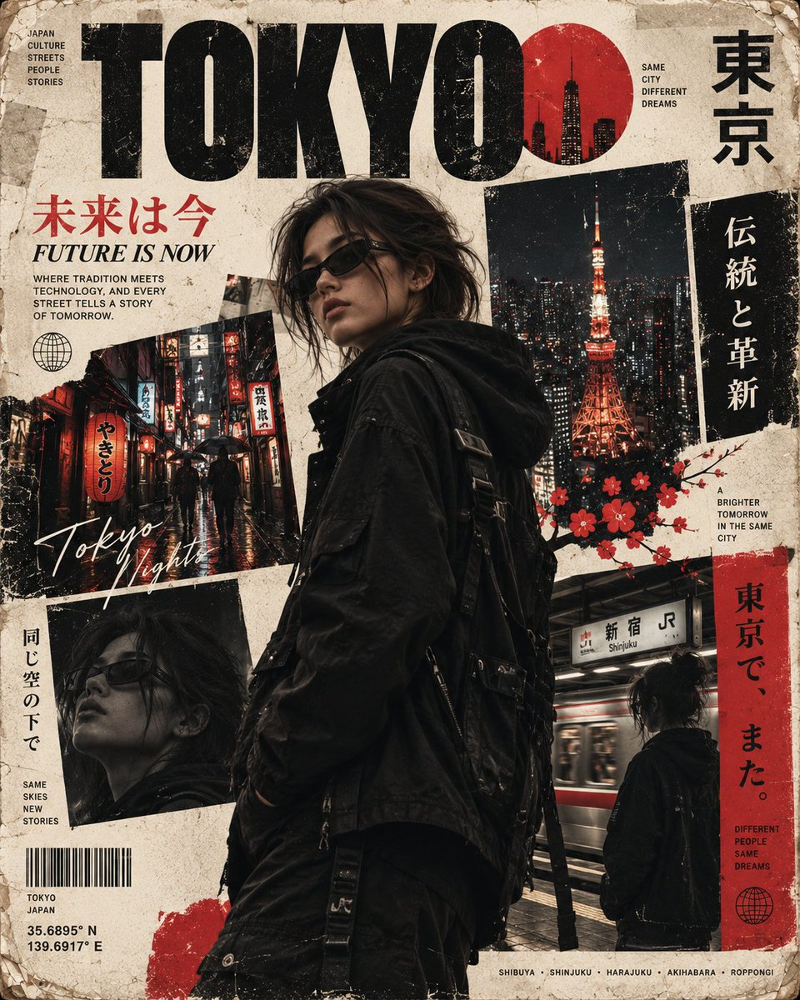

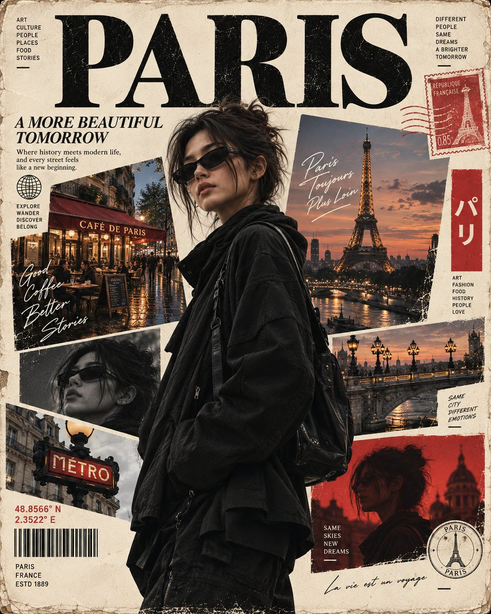

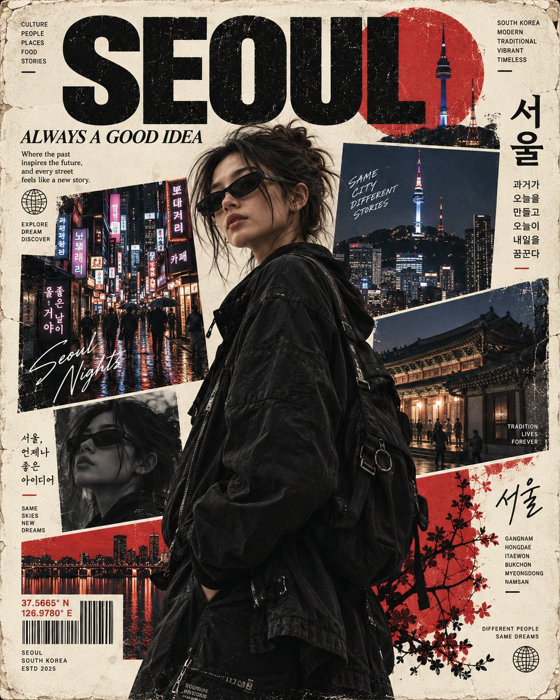

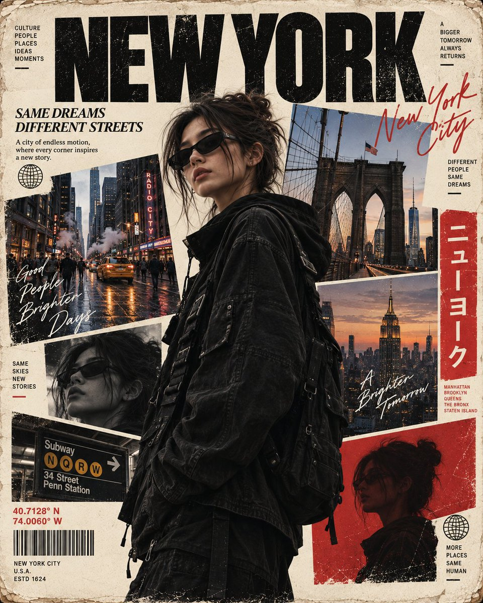

**Prompt**

```text
Crea un póster vertical 4:5 ultrarrealista de moda y viajes de estilo editorial inspirado en la portada de una revista vintage de moda urbana japonesa.

Una mujer joven se encuentra prominentemente en el centro del primer plano, fotografiada desde un ángulo ligeramente bajo. Lleva el cabello oscuro recogido en un moño alto despeinado con mechones sueltos enmarcando su rostro, luce gafas de sol envolventes negras, estrechas y futuristas, y mira ligeramente hacia la cámara con una expresión serena y segura. Viste una chaqueta utilitaria técnica oversize de color negro cubierta de correas, hebillas, cremalleras, bolsillos, parches impresos, etiquetas y sutiles detalles reflectantes realistas, combinada con ropa oscura de estilo táctico y un bolso utilitario negro grande. Conserva la textura realista de la tela y las proporciones naturales.

El fondo es un collage de calles nocturnas de Tokio, que presenta calles de neón empapadas por la lluvia, letreros de tiendas japonesas, estrechos callejones urbanos, la Torre de Tokio brillando de noche y un tren de Tokio llegando a una estación. Distribuye varias fotografías rectangulares alrededor del sujeto central en diferentes ángulos ligeros, creando un diseño de álbum de recortes editorial hecho a mano. Utiliza papel envejecido de color blanco roto como fondo principal con una sutil textura de grano de papel, bordes desgastados, pliegues, manchas y textura de impresión vintage.

En la parte superior, añade una tipografía negra grande y en negrita que diga:

TOKYO

Debajo, un texto con serifa en cursiva, más pequeño y elegante:

FUTURE IS NOW

Añade pequeños bloques de texto editorial como:

“Where tradition meets technology, and every street tells a story of tomorrow.”

Incluye símbolos minimalistas del globo terráqueo, líneas gráficas técnicas, elementos de código de barras, coordenadas, etiquetas pequeñas y marcas editoriales futuristas.

Utiliza paneles gráficos en rojo y negro de inspiración japonesa en toda la composición. Añade un panel vertical rojo a la derecha con tipografía japonesa, una tarjeta gráfica roja en la parte inferior izquierda con grandes caracteres japoneses, y otro panel fotográfico rojo en la parte inferior derecha que muestre una silueta oscura de la mujer.

Incluye tipografía pequeña como:

35.6895° N
139.6917° E

y:

SHIBUYA • SHINJUKU • HARAJUKU • AKIHABARA

Estética general: revista de streetwear japonés de alta gama, Tokio ciberpunk, póster de viaje vintage, editorial de moda contemporánea, collage de impresión analógica. Paleta de colores en negro apagado, carbón, crema, gris oscuro y rojo intenso. Fuerte realismo fotográfico, iluminación nocturna cinematográfica, grano de película sutil, tinta ligeramente desvaída, textura de papel auténtica, registro de impresión imperfecto, tipografía de revista sofisticada, espacio negativo equilibrado.

Composición: sujeto central de cuerpo entero, titular oversize “TOKYO” ocupando la sección superior, fotografías superpuestas de Tokio rodeándola, acentos gráficos rojos, borde de papel vintage, diseño editorial prémium.

Fotorrealista, altamente detallado, cinematográfico, 8K, piel realista, texturas de ropa realistas, fotografía de moda profesional, acabado de impresión vintage auténtico, sin elementos modernos de interfaz digital.
```

[↑ Volver a categorías](#catalog)

---

<a name="prompt-2100123233630519438"></a>

### Prompt de conversión de estilo para extraer las características de una imagen y reconstruirlas en una ilustración editorial ligera, retro y hecha a mano, inspirada en el modernismo, la Bauhaus y los libros ilustrados.

Autor：[@bantya\_otime](https://x.com/bantya_otime) · [Publicación original](https://x.com/bantya_otime/status/2100123233630519438)

Ilustración · Retro / Vintage · Publicado

Publicación original：[@huku\_ken\_ai](https://x.com/huku_ken_ai) · [Publicación original](https://x.com/huku_ken_ai/status/2100054565727113316)

**Resumen:** Prompt de conversión de estilo para extraer las características de una imagen y reconstruirlas en una ilustración editorial ligera, retro y hecha a mano, inspirada en el modernismo, la Bauhaus y los libros ilustrados.

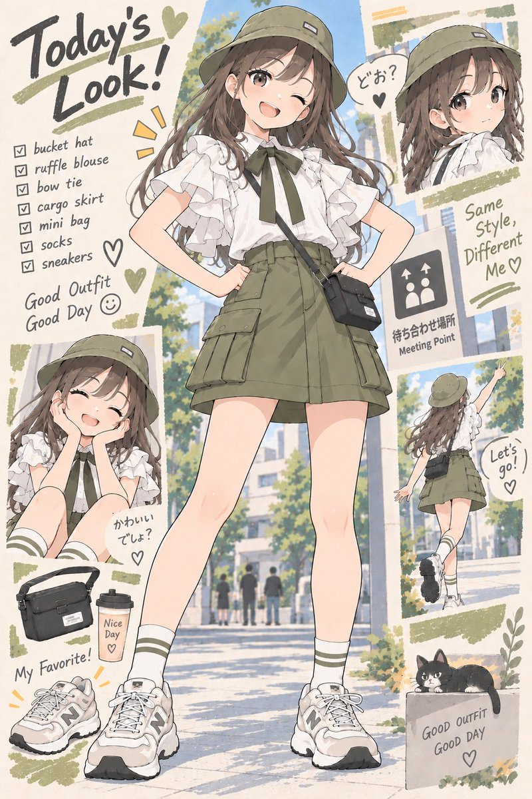

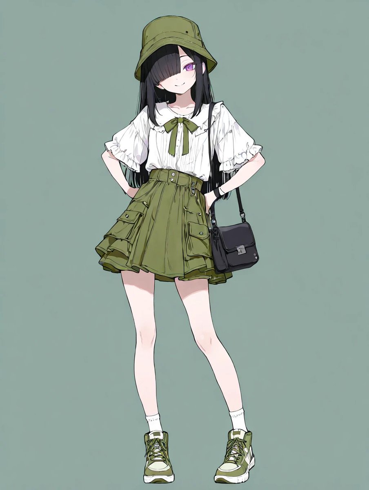

**Prompt**

```text
Extrae los sujetos, contornos, poses y relaciones narrativas más característicos de la imagen, y reconstrúyelos en una ilustración editorial hecha a mano, ligera, rústica y retro. Evitando la reproducción mecánica de detalles, la ilustración se reinterpreta a través de formas generalizadas, proporciones adecuadamente exageradas, rasgos simbólicos y metáforas visuales humorísticas, manteniendo al mismo tiempo la expresión característica del original. Estas ilustraciones fusionan la ilustración editorial modernista, el diseño gráfico de la Bauhaus, los libros ilustrados infantiles, el arte naíf y las técnicas de boceto en tendencia. Las formas son concisas, los contornos dan una impresión ligeramente ambigua reflejando los errores típicos del dibujo a mano, y ciertos elementos se amplían adecuadamente para crear una imagen con narrativa, estilo y un toque lúdico.
```

[↑ Volver a categorías](#catalog)

---

<a name="prompt-2098314775344394279"></a>

### Prompt para foto grupal de las Ocho Bellezas de Qinhuai con flash directo CCD de estilo clásico

Autor：[@DeepBlueX0](https://x.com/DeepBlueX0) · [Publicación original](https://x.com/DeepBlueX0/status/2098314775344394279)

Fotografía · Retro / Vintage · Retrato / Selfie · Personaje · Grupo / Pareja · Publicado

Publicación original：[@DeepBlueX0](https://x.com/DeepBlueX0) · [Publicación original](https://x.com/DeepBlueX0/status/2097135361046839783)

**Resumen:** Prompt para foto grupal de las Ocho Bellezas de Qinhuai con flash directo CCD de estilo clásico


**Prompt**

```text
Aroma a polvos cosméticos y belleza suntuosa; la brumosa luna del río Qinhuai; miradas llenas de encanto y vitalidad primaveral; cada una con su propia gracia y expresión; flash directo de cámara CCD; las Ocho Bellezas de Qinhuai: foto grupal de Liu Rushi, Chen Yuanyuan, Li Xiangjun, Dong Xiaowan, Gu Hengbo, Bian Yujing, Kou Baimen y Ma Xianglan
```

[↑ Volver a categorías](#catalog)

---

<a name="prompt-2097954772586557873"></a>

### Prompt de retrato retro de los años 80 que utiliza la identidad de referencia con estética de película analógica de 35 mm, moda vintage y brillo ambiental de neón.

Autor：[@Goodmanprotocol](https://x.com/Goodmanprotocol) · [Publicación original](https://x.com/Goodmanprotocol/status/2097954772586557873)

Fotografía · Retro / Vintage · Retrato / Selfie · Artículo de moda · Publicado

**Resumen:** Prompt de retrato retro de los años 80 que utiliza la identidad de referencia con estética de película analógica de 35 mm, moda vintage y brillo ambiental de neón.


**Prompt**

```text
Crea un auténtico retrato retro-vintage de los años 80 en una relación de aspecto vertical de 4:5, utilizando a la persona proporcionada como referencia facial exacta. Conserva su identidad, estructura facial, rasgos reconocibles, tono de piel y expresión natural con gran precisión; no alteres ni embellezcas el rostro.

Dale al sujeto un peinado clásico de los años 80 y una vestimenta elegante y fiel a la época con siluetas atrevidas, texturas auténticas y una actitud vintage natural. Compón el retrato de forma natural con un fuerte estilo editorial, manteniendo al sujeto como el punto focal indiscutible.

Captura la imagen como si estuviera tomada con una cámara de película analógica de 35 mm, con grano de película realista, polvo y textura sutiles, suavidad delicada, detalles naturales de la piel, ligero desvanecimiento del color e imperfecciones analógicas auténticas. Utiliza una gradación de color cálida y nostálgica, suaves reflejos de neón, un brillo ambiental sutil y flash directo incorporado en la cámara para lograr el aspecto distintivo de una fotografía icónica de los años 80.

Mantén una iluminación cinematográfica pero creíble, con sombras suaves, luces realistas, contraste natural y una exposición de película ligeramente imperfecta. La imagen final debe dar la sensación de haber sido fotografiada genuinamente en los años 80—no recreada digitalmente, con una atmósfera atemporal, nostálgica, moderna y relajadamente genial.
```

[↑ Volver a categorías](#catalog)

---

<a name="prompt-2097628670143954978"></a>

### Crear un póster de diario de viaje de dos paneles: escena callejera realista en la parte superior, estilo de ilustración vintage con la misma composición en la parte inferior, con tipografía.

Autor：[@Alina\_with\_Ai](https://x.com/Alina_with_Ai) · [Publicación original](https://x.com/Alina_with_Ai/status/2097628670143954978)

Póster / Folleto · Fotografía · Ilustración · Retro / Vintage · Paisaje urbano / Calle · Texto / Tipografía · Publicado

**Resumen:** Crear un póster de diario de viaje de dos paneles: escena callejera realista en la parte superior, estilo de ilustración vintage con la misma composición en la parte inferior, con tipografía.


**Prompt**

```text
Crea un póster realista de diario de viaje editorial de dos paneles utilizando la primera imagen como composición/referencia exacta y la segunda imagen subida como referencia facial.

Reemplaza a la mujer del póster original con la mujer de mi foto de referencia. Conserva con precisión mi identidad facial y mis rasgos faciales reconocibles: forma de la cara, ojos, cejas, nariz, labios, tono de piel y proporciones naturales. No embellezcas, alteres ni rediseñes mi rostro.

PANEL SUPERIOR

Recrea la escena callejera original con exactitud:

Calle estrecha de adoquines de estilo europeo

Edificios históricos de color crema

Carteles de cafeterías, ventanas, balcones, farolas y bolardos

Mismo ángulo de cámara, encuadre, perspectiva y composición

Misma postura sentada/inclinada y posición corporal

Mismo suéter/abrigo negro texturizado

Cabello largo y oscuro natural

Luz diurna cinematográfica suave

Textura de piel fotorrealista e iluminación realista

Integra mi rostro de forma natural con la pose original, el ángulo de la cabeza y la iluminación

PANEL INFERIOR

Crea la versión de ilustración dibujada a mano/impresa a juego de la misma escena.

Mantén la misma pose, ropa, peinado e identidad facial

Convierte la fotografía en una ilustración editorial vintage con textura

Paleta de tintas azul, crema y naranja cálido apagado

Grano de papel visible y textura de tinta imperfecta

Mantén mis rasgos faciales reconocibles mientras se adaptan al estilo ilustrado

Conserva la calle, los edificios, las plantas, los coches y la perspectiva del original

TIPOGRAFÍA Y DISEÑO

Conserva el diseño del póster original y el estilo tipográfico:

Título manuscrito grande: “By the Street”

Texto breve de diario en inglés

Texto en chino en la parte superior izquierda

Fecha: 2026.08.29

Número/detalles pequeños del diario

Frase en el lado derecho: “GOOD THINGS ALWAYS HAPPEN IN QUIET MOMENTS.”

Lo más importante: Mi rostro debe ser la única identidad facial utilizada. No copies el rostro de la mujer original. Mantén la composición general del póster, la postura, la ropa, el fondo y el estilo artístico lo más cerca posible de la referencia. Integración facial de alta calidad, natural y fluida, panel superior fotorrealista y panel inferior de ilustración impresa auténtica.
```

[↑ Volver a categorías](#catalog)

---

<a name="prompt-2097185580224491672"></a>

### Retrato de moda urbana retro de los años 90, hombre apoyado en un coche clásico americano, con un muro urbano desgastado de Oakland al fondo.

Autor：[@harboriis](https://x.com/harboriis) · [Publicación original](https://x.com/harboriis/status/2097185580224491672)

Fotografía · Retro / Vintage · Retrato / Selfie · Personaje · Artículo de moda · Vehículo · Paisaje urbano / Calle · Resumen / Antecedentes · Publicado

**Resumen:** Retrato de moda urbana retro de los años 90, hombre apoyado en un coche clásico americano, con un muro urbano desgastado de Oakland al fondo.


**Prompt**

```text
Crea una fotografía editorial de moda urbana vertical 9:16 ultrarrealista de un hombre joven con pelo oscuro, rizado y grueso, que lleva gafas de sol negras, un polo oversize en tonos crema y negro con la inscripción universitaria en negrita «OAKLAND» y un texto deportivo más pequeño debajo, pantalones holgados tipo cargo negros, zapatillas blancas y un reloj de pulsera metálico clásico. Está apoyado casualmente contra la parte delantera de un coche clásico americano con las manos en los bolsillos y una pierna cruzada sobre la otra.
Ambienta la escena en una calle urbana de aspecto rudo con un edificio antiguo y desgastado detrás de él. Añade una gran tipografía desvaída en la pared donde se lea «OAKLAND», con «CALIFORNIA» y «EST. 1852» debajo. Luz cálida de última hora de la tarde, paleta de colores apagada en marrones y beis, sutil grano de película, sombras suaves, estética nostálgica de la moda urbana de los años 90, textura de piel realista, pose natural, profundidad de campo cinematográfica, coche clásico detallado, auténtica fotografía editorial.
Composición de cuerpo entero, cámara a la altura de los ojos en ángulo bajo, objetivo de 35 mm, iluminación cinematográfica cálida, fotorrealista, gran nivel de detalle, 4K.
```

[↑ Volver a categorías](#catalog)

---

<a name="category-cyberpunk-sci-fi"></a>

## Ciberpunk / Ciencia ficción

<a name="prompt-2097880604872438019"></a>

### Traducción en curso

Autor：[@listudio](https://x.com/listudio) · [Publicación original](https://x.com/listudio/status/2097880604872438019)

Fotografía · Ilustración · Ciberpunk / Ciencia ficción · Paisaje / Naturaleza · Publicado

**Resumen:** Traducción en curso


**Prompt**

```text
Traducción en curso
```

[↑ Volver a categorías](#catalog)

---

<a name="prompt-2098901467956461671"></a>

### Prompt de retrato estilo cyberpunk de una mujer vestida de negro a cuatro patas en el suelo dentro de una sala de juegos iluminada por neones rosas y azules.

Autor：[@CyberTotal2026](https://x.com/CyberTotal2026) · [Publicación original](https://x.com/CyberTotal2026/status/2098901467956461671)

Fotografía · Ciberpunk / Ciencia ficción · Retrato / Selfie · Personaje · Publicado

**Resumen:** Prompt de retrato estilo cyberpunk de una mujer vestida de negro a cuatro patas en el suelo dentro de una sala de juegos iluminada por neones rosas y azules.


**Prompt**

```text
Tema:
Atuendo negro bajo neón rosa y azul

Sujeto:
Fotografía vertical de una mujer adulta con atuendo negro a cuatro patas sobre el suelo en una sala de juegos iluminada con neón rosa y azul. La figura está colocada con referencia al centro del encuadre.

Personaje y expresión:
Cabello castaño oscuro en dos trenzas laterales, flequillo fino, gafas redondas. Rostro ovalado y esbelto, ojos castaños rasgados, cejas finas, nariz pequeña, labios rosados. Levanta la cara y mira a la cámara con seriedad.

Vestimenta y pose:
Top negro de tirantes estilo corsé, pantalones cortos negros, arnés fino en el cuello, guantes largos negros por encima del codo. Con ambas manos y rodillas en el suelo, arqueando la espalda y levantando la cabeza.

Fondo e iluminación:
Equipos de juego luminosos, monitores, líneas LED rosas y azules, y en la esquina superior derecha las letras de neón «GAME OVER». La luz de color crea un perfilado de ambos tonos en la ropa negra y la piel. La luz principal del fondo es una luz suave proveniente de las fuentes de neón de izquierda y derecha.

Composición y cámara:
Composición vertical 3:4, cámara cerca del suelo en una toma frontal oblicua de cuerpo casi entero. Las manos en primer plano inferior, el rostro en el centro, el texto en la esquina superior derecha. Enfoque nítido en el rostro, las gafas y el arnés negro, con desenfoque de neón en el fondo. La figura ocupa un gran tamaño, enfocando al sujeto principal con un ligero desenfoque de fondo.

Textura y estilo:
Fotografía de interiores cyberpunk fotorrealista. Tejido negro con efecto de cuero, guantes largos, gafas, neón rosa y azul, y reflejos en la piel capturados con alto contraste y precisión.

Negativo:
No omitir la postura a cuatro patas ni las gafas redondas; no hacer que sea una habitación iluminada de día
```

[↑ Volver a categorías](#catalog)

---

<a name="category-minimalism"></a>

## Minimalismo

<a name="prompt-2097628383362597075"></a>

### Generar una infografía de guía de quiromancia con estilo de revista minimalista en blanco roto.

Autor：[@hahazwei](https://x.com/hahazwei) · [Publicación original](https://x.com/hahazwei/status/2097628383362597075)

Infografía / Visual Educativo · Minimalismo · Publicado

**Resumen:** Generar una infografía de guía de quiromancia con estilo de revista minimalista en blanco roto.


**Prompt**

```text
Usa esta imagen para generar una infografía completa de guía de quiromancia e interpretación de las líneas de la mano. Presta atención a las líneas de la palma, marca las líneas clave de la mano, realiza un análisis detallado de quiromancia y presenta el contenido de la lectura sobre un fondo blanco roto (off-white), con un estilo editorial de revista limpio, minimalista y lujosamente elegante. Utiliza líneas finas, tarjetas con esquinas redondeadas y un espacio en blanco sofisticado para evocar una textura cara y de alta gama. Enfócate principalmente en la interpretación quiromántica en sí.
```

[↑ Volver a categorías](#catalog)

---

<a name="prompt-2097622528340668736"></a>

### Retrato realista en plano picado de una joven mujer de Asia oriental en bikini rosa frente a un fondo gris minimalista.

Autor：[@catgirlcozy](https://x.com/catgirlcozy) · [Publicación original](https://x.com/catgirlcozy/status/2097622528340668736)

Minimalismo · Retrato / Selfie · Personaje · Resumen / Antecedentes · Publicado

**Resumen:** Retrato realista en plano picado de una joven mujer de Asia oriental en bikini rosa frente a un fondo gris minimalista.


**Prompt**

```text
Toma en ángulo picado de 35 grados, una mujer joven y realista de Asia oriental con cabello castaño rojizo, de frente a la cámara, con las manos detrás de la cabeza, los codos abiertos, mostrando una sonrisa brillante y sincera con los dientes visibles, manos detrás de la cabeza. Lleva un bikini de tiras rosa y un fino collar de oro, descalza frente a un fondo minimalista de hormigón gris. Luz natural interior suave, estilo de instantánea de retrato de estilo de vida con textura realista
```

[↑ Volver a categorías](#catalog)

---

<a name="prompt-2097204639863287913"></a>

### Prompt para póster y fondo de pantalla de mujer y ventana tradicional de estilo nuevo chino y zen oriental, con paleta de verde jade, rosa magenta y blanco cálido.

Autor：[@liyue\_ai](https://x.com/liyue_ai) · [Publicación original](https://x.com/liyue_ai/status/2097204639863287913)

Póster / Folleto · Minimalismo · Personaje · Resumen / Antecedentes · Publicado

Publicación original：[@liyue\_ai](https://x.com/liyue_ai) · [Publicación original](https://x.com/liyue_ai/status/2096838519918596234)

**Resumen:** Prompt para póster y fondo de pantalla de mujer y ventana tradicional de estilo nuevo chino y zen oriental, con paleta de verde jade, rosa magenta y blanco cálido.


**Prompt**

```text
Dirección temática: Póster de portada minimalista de estilo zen oriental
Rama de estilo: Nuevo estilo chino con estética femenina
Contenido principal: Una mujer vestida de época frente a una ventana enrejada tradicional con motivos florales, con una postura tranquila y reservada
Motivo emocional: Elegante, suave, sensación de lujo sutil
Escena e imaginería: Ventana enrejada en tono verde jade, sombras de flores en rosa magenta, pared en blanco cálido, mujer, mínimos detalles en oro claro
Composición y espacio: Composición vertical 9:16, la ventana enrejada ubicada en la parte media superior, la figura en la parte media inferior, reservando un área limpia para el título en la parte superior
Control de color: Blanco cálido como base luminosa, verde jade para la ventana enrejada y algunos elementos del fondo, rosa magenta para las sombras florales y toques de acento, oro claro únicamente para brillos mínimos en accesorios, vestimenta del personaje en blanco perla o blanco rosáceo claro; evitar que toda la imagen sea monocromática en verde jade o rosa magenta
Luz y textura: Luz natural suave, colores vivos y diáfanos, sensación limpia de póster gráfico plano
Relación de aspecto: 9:16
Requisitos adicionales: El conjunto debe transmitir la estética atractiva de una portada de estilo nuevo chino, refinada pero sin sobrecargas ornamentales
```

[↑ Volver a categorías](#catalog)

---

<a name="prompt-2096807576168169628"></a>

### Genera un póster editorial diptico 3:4 basado en las fotos subidas: la mitad superior conserva la foto original y la mitad inferior se transforma en una pequeña ilustración minimalista dibujada a mano.

Autor：[@Sairah\_0](https://x.com/Sairah_0) · [Publicación original](https://x.com/Sairah_0/status/2096807576168169628)

Póster / Folleto · Ilustración · Minimalismo · Publicado

**Resumen:** Genera un póster editorial diptico 3:4 basado en las fotos subidas: la mitad superior conserva la foto original y la mitad inferior se transforma en una pequeña ilustración minimalista dibujada a mano.


**Prompt**

```text
Crea UN póster editorial independiente de alta gama para CADA foto subida. Nunca combines fotos. Cada foto debe convertirse en un póster independiente.

FORMATO
Estrictamente vertical 3:4. Divide el lienzo en dos secciones horizontales exactamente iguales del 50%.

50% SUPERIOR — FOTO ORIGINAL
Conserva la foto fielmente: identidad, rostro, proporciones corporales, pose, vestimenta, objetos, composición, iluminación, sombras, atmósfera y colores. Mantenla fotorrealista con una sutil gradación de color editorial prémium. Extiende el fondo de forma continua si es necesario; nunca distorsiones ni alteres al sujeto.

50% INFERIOR — ILUSTRACIÓN MÍNIMA
Reinterpreta los elementos más reconocibles como una ilustración en papel pequeña, centrada y dibujada a mano que ocupe solo del 10 al 20% de la mitad inferior. Conserva el sujeto clave, la silueta, la pose, los objetos y la narrativa.

Utiliza líneas delicadas e imperfectas, formas planas y audaces de estilo acrílico, grano de papel rugoso, marcas de pincel artesanales y bordes orgánicos. Mantén el fondo en blanco cálido/blanco roto con un generoso espacio negativo.

COLOR
Extrae los colores dominantes de la foto original y redúcelos a un máximo de 4 colores sobrios y armoniosos.

TIPOGRAFÍA
Texto editorial mínimo opcional, como un título corto, ubicación, año o palabra clave. No fuerces el texto si es innecesario.

ESTILO
Tranquilo, poético, refinado, minimalista, inocente, artístico, reflexivo, prémium y altamente reconocible, como el de un libro de arte contemporáneo o la portada de una publicación editorial independiente.
```

[↑ Volver a categorías](#catalog)

---

<a name="category-other"></a>

## Otros

<a name="prompt-2100545582972751933"></a>

### Colección de prompts para fotos realistas en perspectiva POV con flash directo de CCD de los personajes de Genshin Ningguang y Ganyu en escenarios de servicios como reflexología podal, KTV y sala de billar.

Autor：[@0xkyne](https://x.com/0xkyne) · [Publicación original](https://x.com/0xkyne/status/2100545582972751933)

Personaje · Publicado

**Resumen:** Colección de prompts para fotos realistas en perspectiva POV con flash directo de CCD de los personajes de Genshin Ningguang y Ganyu en escenarios de servicios como reflexología podal, KTV y sala de billar.

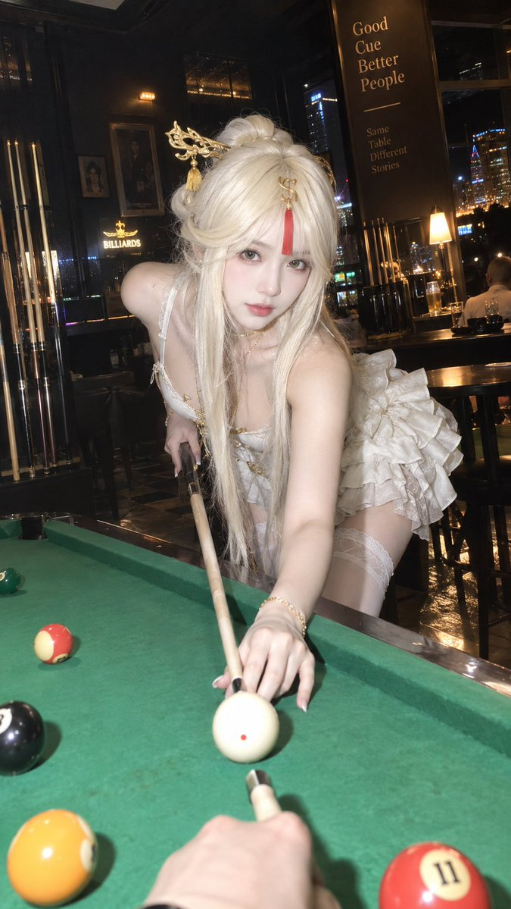

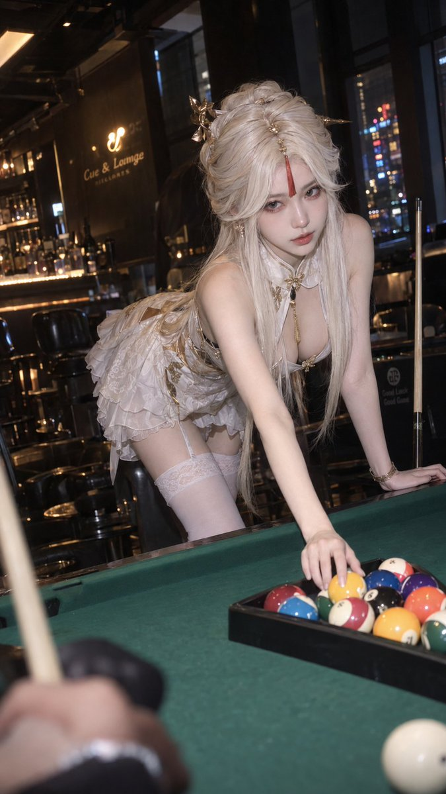

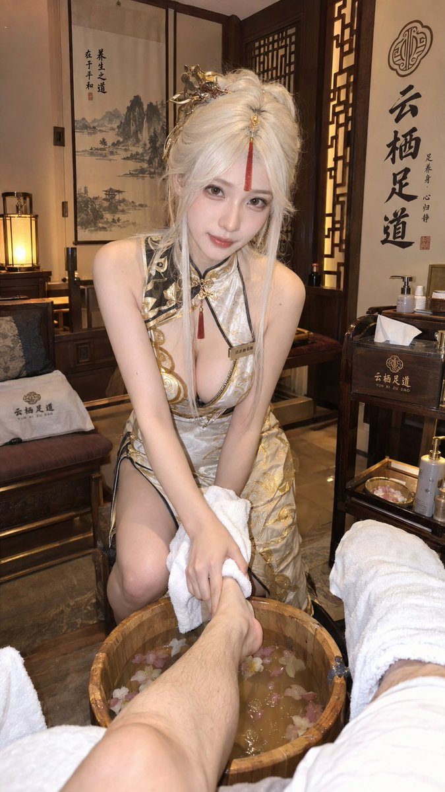


**Prompt**

```text
👠Cosplayer de Ningguang, masajista de reflexología podal, sala privada, qipao, dando servicio, flash directo de CCD, perspectiva POV del cliente

🎤Cosplayer de Ningguang + cosplayer de Ganyu, acompañantes de KTV de negocios, sala privada de KTV, vestidos minimalistas con los colores del personaje, interactuando alegremente con el cliente, flash directo de CCD + foto de móvil

🎱Joven cosplayer de Ningguang, asistente de billar, sala de billar, minifalda con vuelo + medias blancas, jugando al billar, flash directo de CCD + perspectiva POV del cliente
```

[↑ Volver a categorías](#catalog)

---

<a name="prompt-2100498666763030990"></a>

### Crea un póster comparativo en 3:4 basado en la foto subida: la parte superior conserva la textura de instantánea original y la inferior simula el bokeh cremoso de gran apertura de un 85 mm F1.2 full-frame.

Autor：[@lovimg\_com](https://x.com/lovimg_com) · [Publicación original](https://x.com/lovimg_com/status/2100498666763030990)

Póster / Folleto · Retrato / Selfie · Publicado

**Resumen:** Crea un póster comparativo en 3:4 basado en la foto subida: la parte superior conserva la textura de instantánea original y la inferior simula el bokeh cremoso de gran apertura de un 85 mm F1.2 full-frame.

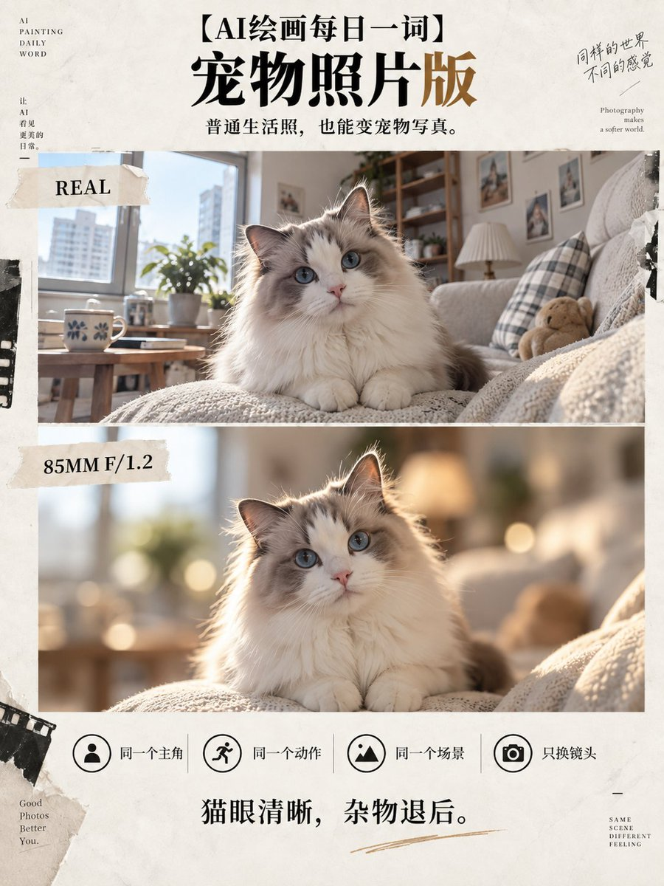

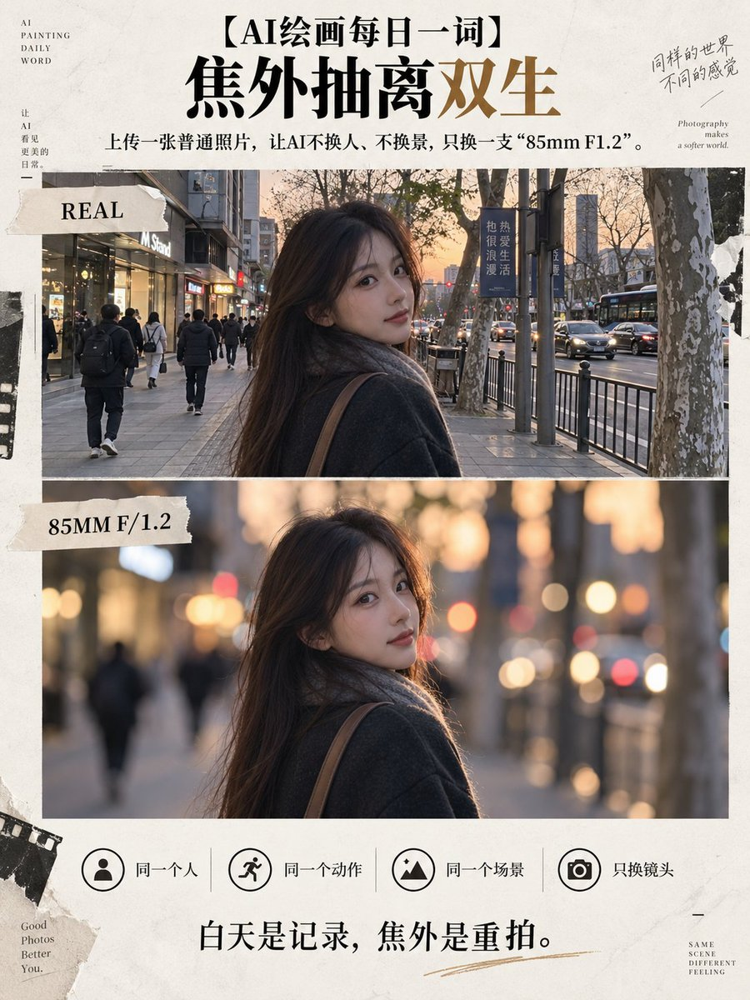

**Prompt**

```text
Por favor, basándote en la foto que he subido, crea un póster visual independiente en formato vertical 3:4 con el concepto de "Doble extracción de desenfoque".

La imagen debe dividirse estrictamente en dos áreas, superior e inferior, con una proporción de altura de 1:1, ocupando el 50% cada una.

Ambas partes deben mantener obligatoriamente:

El mismo sujeto, el mismo rostro, la misma acción, la misma postura, la misma dirección de la mirada, la misma posición del sujeto, la misma escena, el mismo ángulo de toma y la misma relación compositiva.

No rediseñes al personaje.

No cambies el fondo.

No alteres el contenido de la fotografía.

PARTE SUPERIOR ｜ REAL

Conserva íntegramente la foto original subida.

Mantén la textura original de fotografía de móvil, cámara digital o instantánea cotidiana.

Conserva toda la información del personaje, el fondo y el entorno.

Se permite un ligero ajuste de exposición y color, pero sin alterar la relación de profundidad de campo.

Permite que el espectador vea con claridad el estado real original de la fotografía.

PARTE INFERIOR ｜ 85MM F/1.2

Simula estrictamente una sesión de retrato profesional con sensor full-frame y gran apertura basada en el mismo encuadre de la mitad superior.

Simula:

Objetivo fijo full-frame de 85 mm con apertura f/1.2.

Los ojos, el rostro y los contornos principales del sujeto deben mantenerse nítidos y en alta definición.

Recalcula la profundidad de campo en función de la distancia espacial real.

El plano focal donde se encuentra el sujeto debe ser completamente nítido.

El entorno delante y detrás del sujeto debe entrar progresivamente en desenfoque según la distancia.

El fondo cercano conserva una leve estructura.

El fondo a media distancia comienza a suavizarse.

El fondo lejano se transforma por completo en un desenfoque cremoso y natural.

Elementos del fondo como:

Farolas, luces de coches, escaparates, reflejos en hojas, reflejos metálicos y brillos solares

Deben transformarse de forma natural en bokeh óptico real de diferentes tamaños y niveles de desenfoque.

El desenfoque debe exhibir las características de una lente real:

Círculos de bokeh suaves, leve deformación de ojo de gato hacia los bordes, gradación en las altas luces, niveles de profundidad entre primer plano y fondo, y una compresión espacial realista.

Los bordes del cabello, hombros y ropa del sujeto no deben presentar ningún efecto de recorte artificial.

Debe existir una transición natural entre las hebras de cabello y el bokeh.

Conserva leves efectos de respiración de lente, aberración cromática, grano, ligeros errores de exposición e imperfecciones fotográficas reales.

El resultado final debe parecer exactamente como si:

El mismo fotógrafo, sin moverse de posición, hubiera cambiado un teléfono común por un objetivo profesional de 85 mm F1.2 y hubiera vuelto a disparar.

PROHIBIDO:

Prohibido aplicar desenfoque gaussiano uniforme a todo el fondo.

Prohibido convertir el fondo en una mancha de color sin gradación espacial.

Prohibido recortar al sujeto y pegarlo sobre un fondo desenfocado.

Prohibido cambiar el rostro.

Prohibido cambiar las acciones del personaje.

Prohibido añadir edificios o elementos del paisaje inexistentes.

Prohibido el aspecto de ilustración.

Prohibido el suavizado excesivo de la piel.

Prohibida la textura de piel de plástico.

Prohibido el aspecto artificial de estudio generado por IA.
```

[↑ Volver a categorías](#catalog)

---

<a name="prompt-2100405863123173606"></a>

### Traducción en curso

Autor：[@TanLuAI](https://x.com/TanLuAI) · [Publicación original](https://x.com/TanLuAI/status/2100405863123173606)

Resumen / Antecedentes · Publicado

**Resumen:** Traducción en curso

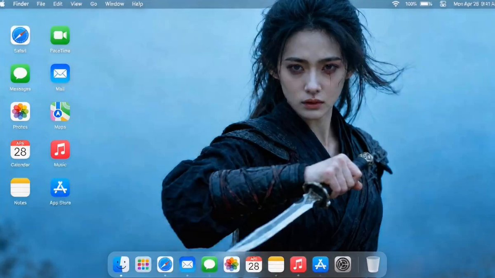

**Prompt**

```text
Traducción en curso
```

[↑ Volver a categorías](#catalog)

---

<a name="prompt-2100255511228932598"></a>

### Instantáneas fallidas verticales en cuadrícula de cuatro, escena de recolección de raíces de loto en un estanque de lotos y personajes

Autor：[@ahamme35638](https://x.com/ahamme35638) · [Publicación original](https://x.com/ahamme35638/status/2100255511228932598)

Personaje · Publicado

**Resumen:** Instantáneas fallidas verticales en cuadrícula de cuatro, escena de recolección de raíces de loto en un estanque de lotos y personajes

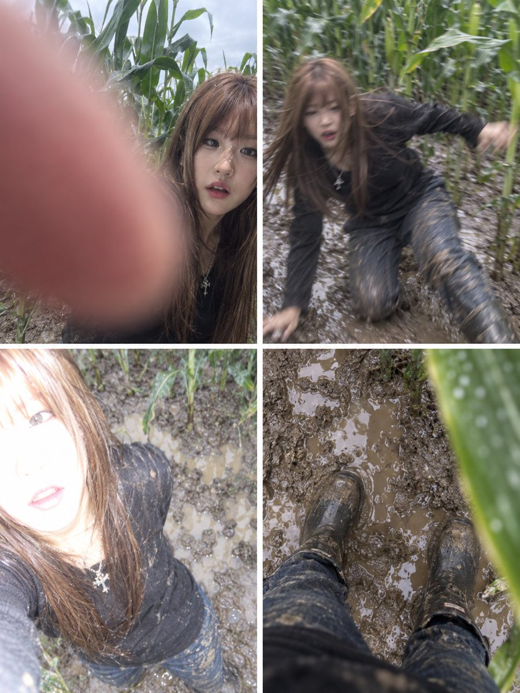

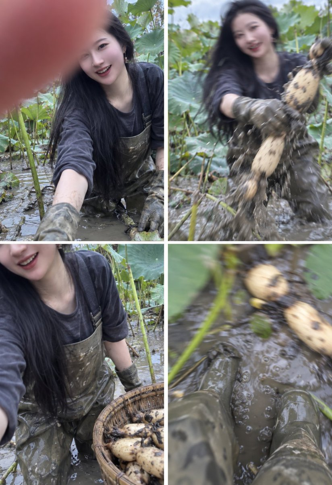

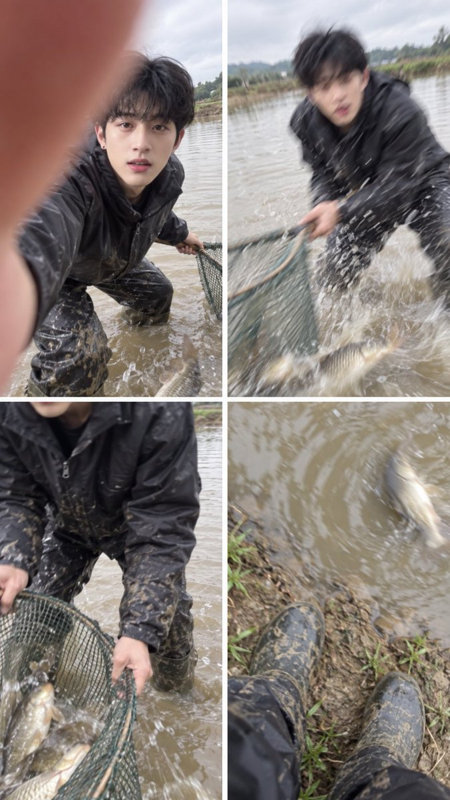

**Prompt**

```text
Fotos fallidas verticales en 2×2, escena de recolección de raíces de loto en un estanque de lotos + personaje
```

[↑ Volver a categorías](#catalog)

---

<a name="prompt-2100102387323076955"></a>

### Generar colección de fotos espontáneas fallidas de aficionados en cuadrícula 3x3

Autor：[@AI\_jacksaku](https://x.com/AI_jacksaku) · [Publicación original](https://x.com/AI_jacksaku/status/2100102387323076955)

Otros · Publicado

Publicación original：[@AI\_jacksaku](https://x.com/AI_jacksaku) · [Publicación original](https://x.com/AI_jacksaku/status/2097878193013199231)

**Resumen:** Generar colección de fotos espontáneas fallidas de aficionados en cuadrícula 3x3

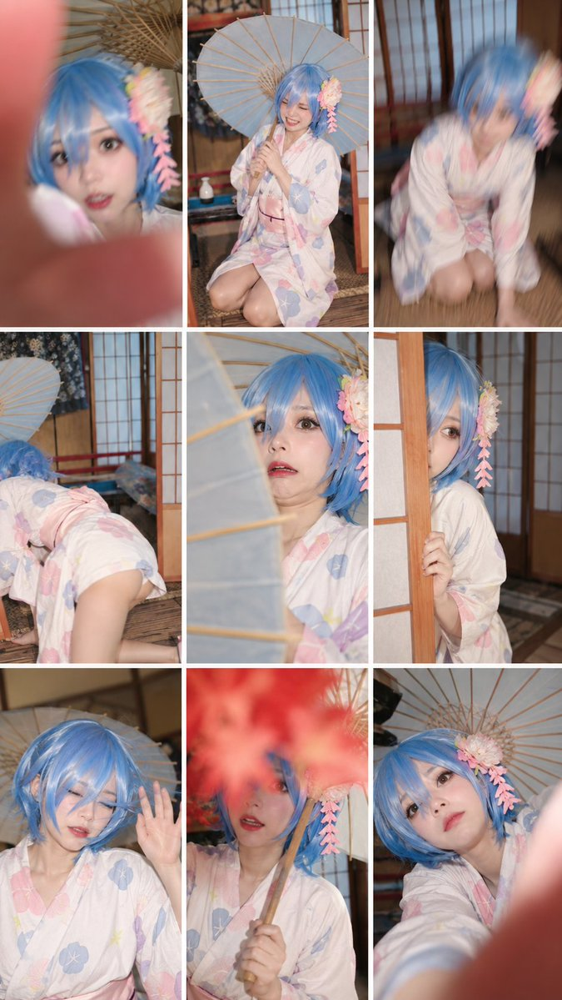

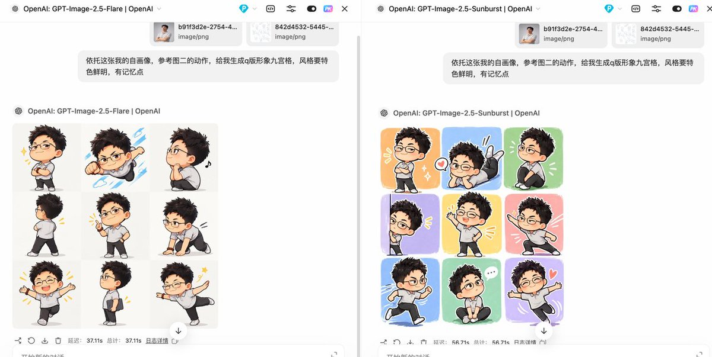

**Prompt**

```text
Una serie de fotos fallidas de aficionados, 3x3, 9:16
```

[↑ Volver a categorías](#catalog)

---

<a name="prompt-2099213523947864179"></a>

### Plantilla de prompt para póster de personaje en abstracción geométrica basada en constructivismo, suprematismo y futurismo.

Autor：[@VoxcatAI](https://x.com/VoxcatAI) · [Publicación original](https://x.com/VoxcatAI/status/2099213523947864179)

Póster / Folleto · Personaje · Resumen / Antecedentes · Publicado

Publicación original：[@VoxcatAI](https://x.com/VoxcatAI) · [Publicación original](https://x.com/VoxcatAI/status/2054455196298932406)

**Resumen:** Plantilla de prompt para póster de personaje en abstracción geométrica basada en constructivismo, suprematismo y futurismo.

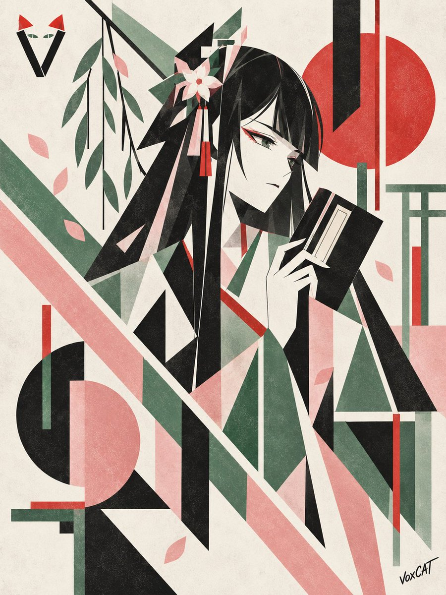

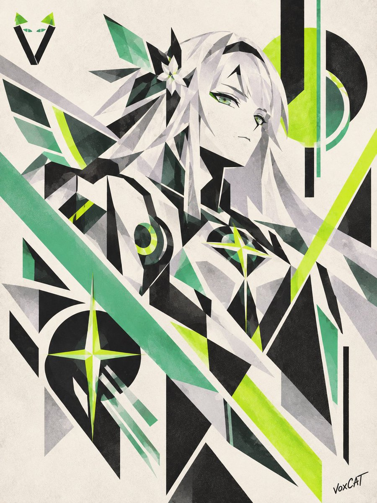

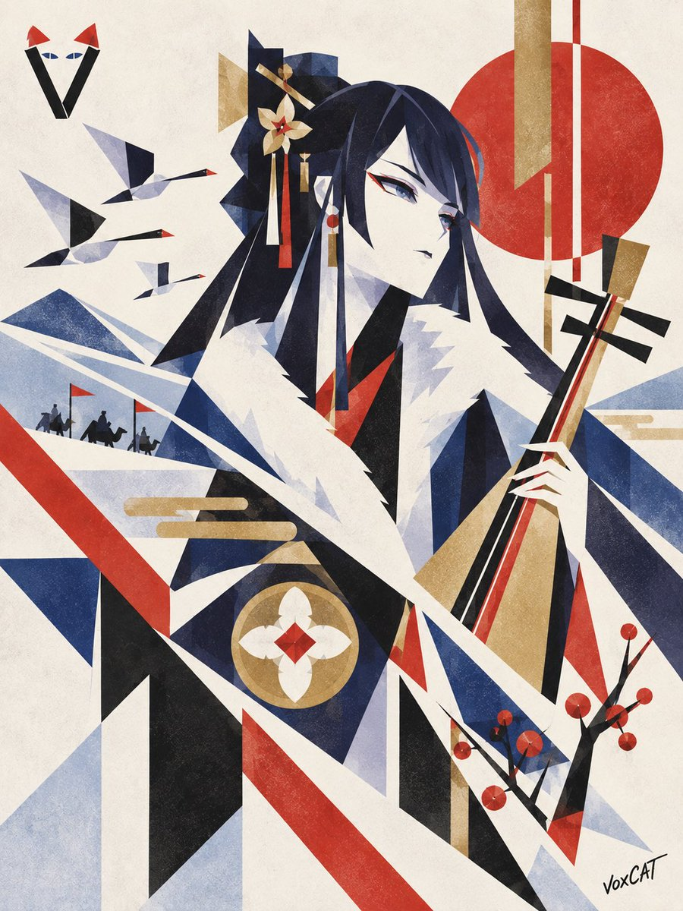

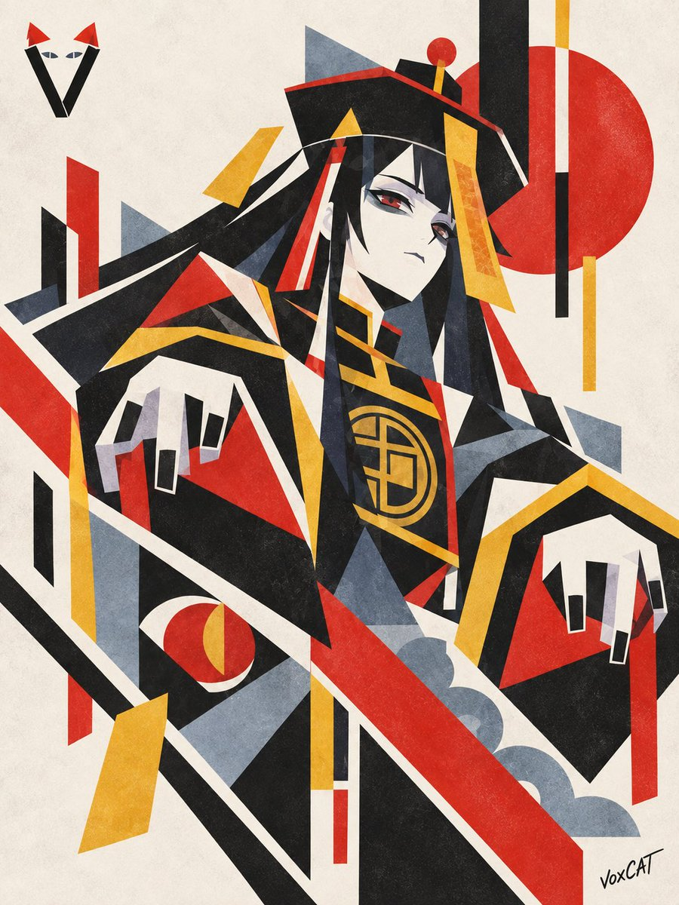

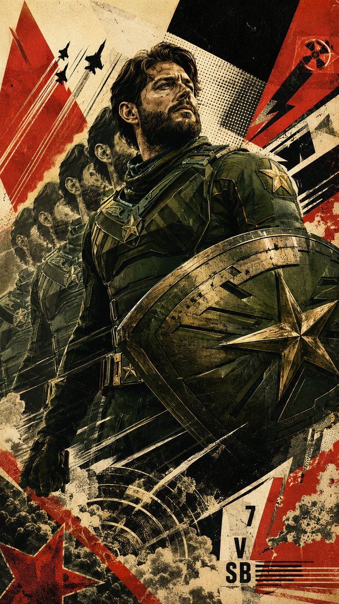

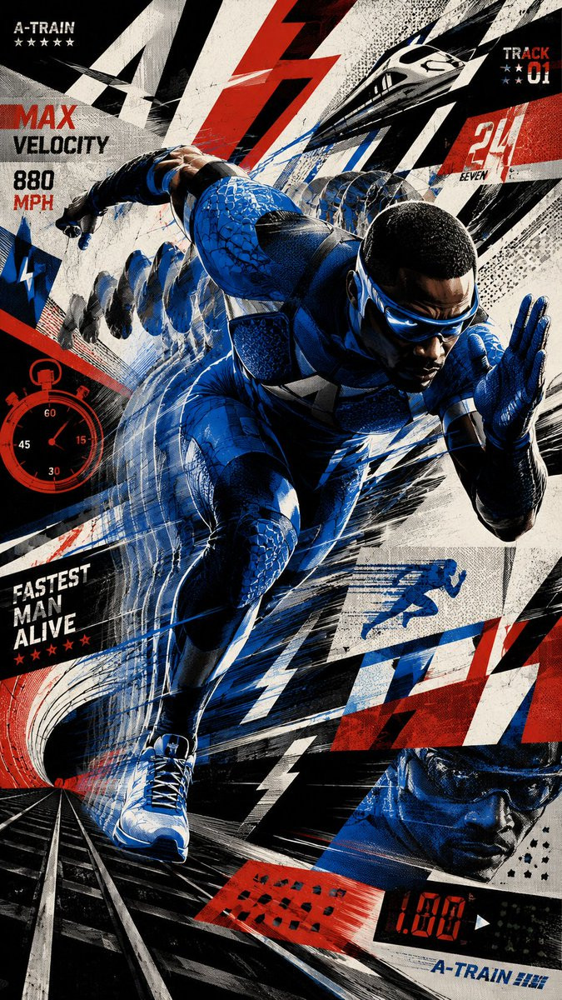

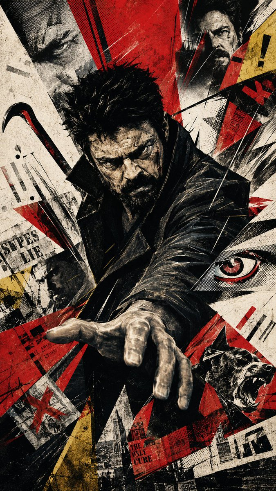

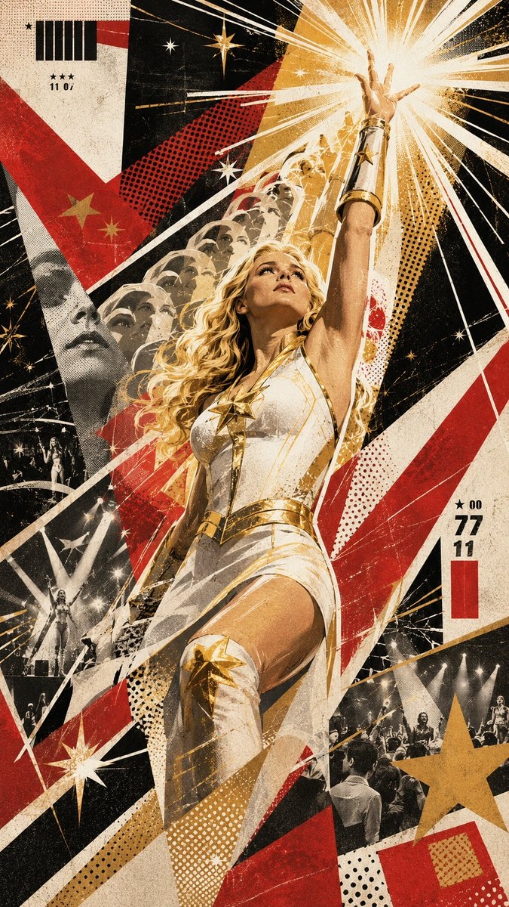

**Prompt**

```text
{Sujeto / Personaje / Concepto}, Constructivism Constructivismo ruso × Suprematism Suprematismo × Futurism Futurismo × Swiss International Style Diseño gráfico de estilo internacional suizo × Geometric Neo-Modernism Neomodernismo geométrico.

Descomponer y reinterpretar el sujeto en un sistema visual geométrico altamente gráfico, sin enfatizar el modelado realista tradicional, sino extrayendo el contorno más esencial del sujeto, sus rasgos de identidad, colores representativos, relaciones estructurales y dirección de movimiento, para luego reconstruirlo en bloques geométricos, ejes inclinados, círculos, rectángulos, triángulos, líneas de dirección, módulos y espacio negativo. Figuras humanas, animales, arquitectura, maquinaria, objetos o conceptos abstractos se integran uniformemente en esta lógica de composición geométrica, conservando al mismo tiempo una clara legibilidad e identidad.

En general, se adopta Path-based Shape Construction (construcción de formas basada en trazados), tomando como núcleo Geometric Blocking (bloqueo geométrico), Hard-edge Abstraction (abstracción de bordes duros), Modular Repetition (repetición modular) y Directional Cutting (corte direccional). Se utiliza ampliamente ejes inclinados de 15°, 30° y 45° para generar dinamismo, logrando que el sujeto transmita una marcada sensación de avance, rotación, colisión, seccionamiento o expansión.

La composición emplea Constructivist Cropping (encuadre constructivista) y Asymmetrical Balance (equilibrio asimétrico). El sujeto puede desbordar parcialmente los bordes del encuadre, ser atravesado o tapado por grandes bloques de color con cortes diagonales; las estructuras locales pueden ampliarse, repetirse, rotarse o reflejarse en espejo, generando un potente ritmo visual. La imagen conserva un centro visual claro, evitando disposiciones centradas y estables propias del retrato tradicional.

La representación del soporte emplea Vector Graphics × Screen Print × Risograph Simulation × Digital Collage. El sujeto se construye con bordes vectoriales nítidos y grandes bloques de color plano, simulando puntualmente la superposición de tintas de serigrafía, desfases de color risográficos, fibras de papel, leves tramas de puntos de impresión y desalineaciones de bordes, dotando a la imagen de la precisión del diseño digital combinada con la tangibilidad física de los medios impresos.

La iluminación atenúa el enfoque naturalista mediante Flat Tonal Structure (estructura tonal plana) × Graphic Contrast (contraste gráfico) × Optical Depth (profundidad óptica ilusoria). El espacio se construye principalmente mediante diferencias tonales entre bloques de color, oclusión geométrica, variaciones de escala, capas transparentes superpuestas y relaciones de plano anterior/posterior, sin depender de degradados complejos para modelar el volumen. Se pueden incorporar localmente pequeñas geometrías luminosas o bordes resaltados para crear un Luminous Graphic Field (campo gráfico luminoso), manteniendo siempre la primacía de la composición bidimensional plana.

La paleta cromática utiliza una gama limitada de alta visibilidad, basada en negro, blanco, rojo, azul cobalto, azul ultramar, amarillo brillante, naranja, gris frío y blanco roto, seleccionando automáticamente de 2 a 4 colores principales según el sujeto. Los colores mantienen un alto contraste, un orden riguroso y una estricta relación de áreas, prescindiendo de degradados confusos y de una excesiva mezcla de tonos. Se permite la aparición de un tercer color derivado de la superposición de tintas serigráficas locales.

El referente visual general alude a la geometría espacial de Proun Composition de El Lissitzky, a los carteles constructivistas y encuadres radicales de Alexander Rodchenko, a las formas básicas suprematistas de Kazimir Malevich, a la geometría óptica Bauhaus de László Moholy-Nagy y al orden reticular de Swiss Grid System de Josef Müller-Brockmann, preservando en última instancia una estructura visual original.

Incorporar elementos VOXCAT: en la esquina superior izquierda, añadir un logotipo geométrico minimalista estilizado “V” + cat, integrado con fluidez en la diagramación constructivista; en la esquina inferior derecha, añadir la firma en tamaño pequeño “voxCAT”. La silueta de las orejas de gato, los ojos felinos, los cortes en ángulo en V y las curvas de la cola de gato pueden reinterpretarse adicionalmente como círculos, triángulos, diagonales o símbolos geométricos modulares, funcionando como motivos visuales VOXCAT recurrentes dentro de la composición.

Requisitos generales: estructura nítida, relaciones geométricas sólidas, bordes definidos, masas de color íntegras, maquetación equilibrada, marcada sensación de velocidad, abundante espacio negativo, bajo nivel de ruido, sin partículas, sin fondos realistas complejos y un acabado impecable. A excepción del logotipo VOXCAT y la firma voxCAT, no debe aparecer ningún otro texto, numeración, elementos de interfaz (UI), marcas de agua ni logotipos ajenos.
```

[↑ Volver a categorías](#catalog)

---

<a name="prompt-2099141066784215478"></a>

### Patio de ensueño de estilo chino y piscina moderna sin personas, textura de enfoque suave de CCD

Autor：[@DeepBlueX0](https://x.com/DeepBlueX0) · [Publicación original](https://x.com/DeepBlueX0/status/2099141066784215478)

Otros · Publicado

Publicación original：[@DeepBlueX0](https://x.com/DeepBlueX0) · [Publicación original](https://x.com/DeepBlueX0/status/2099065219259761109)

**Resumen:** Patio de ensueño de estilo chino y piscina moderna sin personas, textura de enfoque suave de CCD

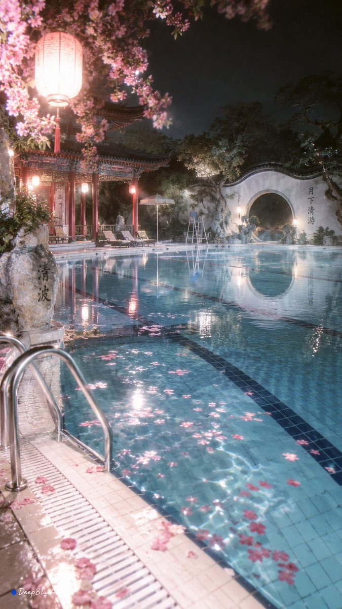

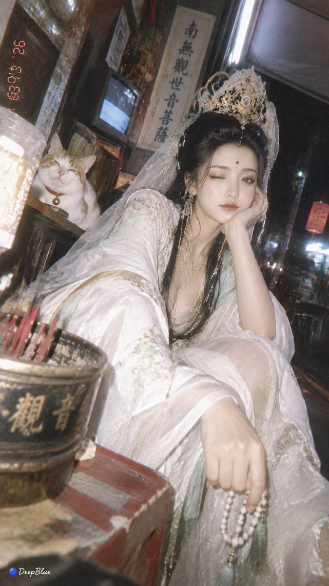

**Prompt**

```text
Fantasía de estilo chino × flash directo CCD con enfoque suave × piscina vacía
```

[↑ Volver a categorías](#catalog)

---

<a name="prompt-2098980048703467897"></a>

### Traducción en curso

Autor：[@SSSS\_CRYPTOMAN](https://x.com/SSSS_CRYPTOMAN) · [Publicación original](https://x.com/SSSS_CRYPTOMAN/status/2098980048703467897)

Otros · Publicado

**Resumen:** Traducción en curso


**Prompt**

```text
Traducción en curso
```

[↑ Volver a categorías](#catalog)

---

<a name="prompt-2098960216792682600"></a>

### Prompt de diseño de vestuario que detalla una túnica semitransparente y accesorios en estilo gótico mandala.

Autor：[@AI\_GIRL\_DESIGN](https://x.com/AI_GIRL_DESIGN) · [Publicación original](https://x.com/AI_GIRL_DESIGN/status/2098960216792682600)

Retrato / Selfie · Artículo de moda · Publicado

**Resumen:** Prompt de diseño de vestuario que detalla una túnica semitransparente y accesorios en estilo gótico mandala.


**Prompt**

```text
Túnica gris de manga corta con una silueta cuadrada gigante que cubre desde la cintura hasta las caderas. Confeccionada con un material especial que parece superponer organza semitransparente gruesa, malla áspera y una fina película de resina, con mangas anchas que sobresalen ampliamente hacia los lados desde los hombros hasta los puños. En el cuello, un pequeño cuello camisero negro y una lazada negra. Toda la superficie de la túnica está cosida con un cordón negro grueso en un bordado abstracto que serpentea como un trazo continuo aleatorio, con pequeñas mariposas de color rojo bermellón a coral, nudos y aplicaciones en forma de pétalos esparcidos en las intersecciones y bordes. El interior de los puños es negro. La tela presenta pliegues realistas, holguras, márgenes de costura, hilos sueltos y una sutil transparencia. Medias negras por encima de la rodilla. Mules rojos. En la parte posterior derecha de la cabeza, un moño gigante en forma de lazo en color negro mate. De ambas orejas cuelgan largos y delgados pendientes de cadena de cuentas rojas y negras que llegan cerca del pecho.
```

[↑ Volver a categorías](#catalog)

---

<a name="prompt-2098634675057238254"></a>

### Prompt para generar folletos de anuncio de conciertos de calidad profesional en cuadrícula 2×2 con diferentes atuendos, géneros y tipografías, manteniendo el personaje y el estilo artístico.

Autor：[@hAru\_mAki\_ch](https://x.com/hAru_mAki_ch) · [Publicación original](https://x.com/hAru_mAki_ch/status/2098634675057238254)

Póster / Folleto · Personaje · Artículo de moda · Texto / Tipografía · Publicado

Publicación original：[@hAru\_mAki\_ch](https://x.com/hAru_mAki_ch) · [Publicación original](https://x.com/hAru_mAki_ch/status/2098616421190435145)

**Resumen:** Prompt para generar folletos de anuncio de conciertos de calidad profesional en cuadrícula 2×2 con diferentes atuendos, géneros y tipografías, manteniendo el personaje y el estilo artístico.


**Prompt**

```text
Mantén este personaje y estilo artístico, y genera en una cuadrícula de 4 divisiones (2×2) folletos de anuncio de conciertos en vivo con diversos atuendos y poses escénicas, como si hubieran sido creados por un diseñador profesional.

Diseña libremente los atuendos, las poses, los géneros musicales, los fondos, la iluminación y el diseño de los folletos, dotando a cada uno de los cuatro de un encanto y un toque sorprendente diferentes. Incorpora elementos visuales que transmitan la energía y el universo del concierto, junto con una tipografía impactante, e incluye información ficticia del evento como el título del espectáculo, la fecha, la hora y el recinto, logrando un acabado de nivel profesional.

Los cuatro deben mantener el mismo personaje y el mismo estilo artístico. La proporción total debe ser 4:3.
```

[↑ Volver a categorías](#catalog)

---

<a name="prompt-2098559982035951785"></a>

### Retrato estético y evocador descrito con poesía clásica de una mujer tras el baño, envuelta en gasas y recostada en un diván.

Autor：[@listudio](https://x.com/listudio) · [Publicación original](https://x.com/listudio/status/2098559982035951785)

Retrato / Selfie · Personaje · Publicado

**Resumen:** Retrato estético y evocador descrito con poesía clásica de una mujer tras el baño, envuelta en gasas y recostada en un diván.


**Prompt**

```text
Recién concluido el baño perfumado, envuelta en un velo ligero,
el cuerpo delicado se reclina a medias en el suave diván.
Donde se superponen las sedas transparentes se vislumbra la piel de alabastro,
con los ojos cerrados, rebosante de anhelos primaverales que se demoran sin fin.
Una cálida y brumosa neblina envuelve sus huesos de jade,
y un hilo de calor remanente se funde con los colores del ocaso.
```

[↑ Volver a categorías](#catalog)

---

<a name="prompt-2098400287262470292"></a>

### Prompt de guion gráfico para anuncio comercial de 10 segundos de auriculares inalámbricos de gama alta, que muestra a una mujer profesional urbana moderna colocándose y usando el producto en un entorno de oficina.

Autor：[@Adam38363368936](https://x.com/Adam38363368936) · [Publicación original](https://x.com/Adam38363368936/status/2098400287262470292)

Cómic / Guion gráfico · Marketing de producto · Personaje · Producto · Paisaje urbano / Calle · Publicado

Publicación original：[@Adam38363368936](https://x.com/Adam38363368936) · [Publicación original](https://x.com/Adam38363368936/status/2098318586859377102)

**Resumen:** Prompt de guion gráfico para anuncio comercial de 10 segundos de auriculares inalámbricos de gama alta, que muestra a una mujer profesional urbana moderna colocándose y usando el producto en un entorno de oficina.


**Prompt**

```text
Utilice los auriculares Bluetooth inalámbricos y el estuche de carga AEROX ONE de la imagen de referencia como única referencia de producto, manteniendo estrictamente la coherencia en la forma, las proporciones, el metal gris plateado y los materiales blancos mate, el contorno redondeado del estuche de carga, el texto de la marca, la posición de las aberturas y las relaciones estructurales; no rediseñar, no deformar, no mostrar productos sobrantes.

Produzca un anuncio de 10 segundos para una marca de electrónica de consumo de gama alta, incorporando a una joven mujer asiática como protagonista del estilo de vida urbano. La protagonista tiene un aire limpio, elegante y sobrio, viste una camisa blanca sencilla o un blazer gris claro, maquillaje natural, textura de piel real, con una actitud general de mujer profesional urbana moderna. El personaje solo asume la expresión del estilo de vida y la atmósfera, siendo el producto siempre el núcleo visual.

0-2 segundos:
Espacio de oficina moderno a primera hora de la mañana, con luz natural entrando por ventanales de suelo a techo. La protagonista se acerca a la mesa y deja su teléfono móvil y un bolso de piel. La cámara corta rápidamente al estuche de carga AEROX ONE sobre el escritorio, la tapa se abre con precisión y aparecen con claridad los dos auriculares. El ritmo de cámara es limpio y ágil, mostrando el producto desde el primer segundo.

2-4 segundos:
La protagonista coge un auricular y se lo coloca en la oreja, con un movimiento natural, elegante y sin exageraciones. La cámara corta a un primer plano del auricular, con reflejos de luz blanca fría en los bordes metálicos; el auricular se ajusta de forma natural al oído, destacando la sofisticación del producto al llevarlo puesto. El fondo es un entorno de oficina desenfocado.

4-6 segundos:
La protagonista camina por una moderna zona de oficinas o el pasillo de una cafetería llevando los auriculares puestos; la cámara realiza un seguimiento lateral fluido. Su actitud es concentrada, relajada y con sensación de control. En el encuadre, el auricular debe permanecer claramente visible, sin quedar totalmente tapado por el pelo. En conjunto, se enfatiza el desplazamiento urbano, la eficiencia y el estilo de vida.

6-8 segundos:
Corte a una escena donde está sentada junto a la ventana usando un portátil; con una mano toca suavemente el auricular, como si cambiara de modo o respondiera una llamada. La cámara avanza ligeramente, la ciudad de fondo se desenfoca, y la interacción entre el producto y el personaje crea una sensación de anuncio de lifestyle de alto nivel.

8-10 segundos:
Corte rápido de vuelta a un hero shot exclusivo del producto. Los auriculares AEROX ONE y el estuche de carga reposan sobre un escritorio gris plateado minimalista, el fondo suavemente desenfocado y la protagonista al fondo fuera de foco sirviendo como atmósfera ambiental. La cámara desacelera gradualmente y se detiene; los auriculares y el estuche se convierten en el único sujeto nítido del encuadre, conformando el cierre de un anuncio de marca de electrónica de consumo de gama alta.

Estilo general:
De gama alta, moderno, tecnológico, urbano, sobrio, auténtico, similar a una campaign de una marca internacional de electrónica de consumo.
La imagen debe tener una textura fotográfica comercial real, lentes ópticas reales, perspectiva precisa, bordes de producto nítidos, y materiales de metal gris plateado y blanco mate realistas y naturales.
El ritmo debe presentar variaciones claras, evitando la cámara lenta durante todo el metraje.
Los movimientos de los personajes deben ser naturales, evitando la sensación de pose artificial, sonrisas excesivas o expresiones exageradas.

Requisitos clave:
Apariencia del producto coherente.
El auricular en la oreja del personaje debe tener una estructura normal y proporciones reales.
El pelo de la protagonista no debe tapar el auricular.
No añadir un segundo juego de auriculares.
No deformar el producto.
Sin efectos especiales de ciencia ficción exagerados.
Sin estética ciberpunk de neón.
Sin bloques largos de subtítulos.
Sin manos deformes.
El personaje no debe quitarle protagonismo al producto.
Sin marcas de agua.
```

[↑ Volver a categorías](#catalog)

---

<a name="prompt-2098363788928143624"></a>

### Prompt estructurado para póster de producto con vista explosionada de una lata de bebida de té oolong con gas.

Autor：[@luo24853969](https://x.com/luo24853969) · [Publicación original](https://x.com/luo24853969/status/2098363788928143624)

Marketing de producto · Póster / Folleto · Producto · Publicado

**Resumen:** Prompt estructurado para póster de producto con vista explosionada de una lata de bebida de té oolong con gas.


**Prompt**

```text
{
  "type": "Póster de producto con vista explosionada",
  "subject": "Lata de bebida de té con gas",
  "style": "Render 3D limpio de alta tecnología, iluminación de estudio, detalles sutilmente luminosos",
  "background": "Degradado suave de naranja rosado y beige claro",
  "header": {
    "logo": "PUBBLE",
    "subtitle": "REFRESH YOUR MOMENT WITH PUBBLE!"
  },
  "layout": {
    "centerpiece": "Vista explosionada apilada verticalmente que muestra por completo los 9 niveles estructurales de la lata de té oolong con gas: cuerpo exterior de lata de aluminio, anilla de apertura de la tapa superior, capa de etiqueta impresa, revestimiento de la pared interior, cuerpo líquido con gas, estructura de hendidura inferior, núcleo de fórmula sin azúcar, capa de extracto de té oolong aromático, diseño antideslizante en la base.",
    "callout_labels": {
      "count": 8,
      "left_side": [
        "Fórmula sin azúcar\nSabor refrescante sin cargas, para que cada sorbo sea ligero y libre.",
        "Estructura de burbujas\nBurbujas finas y densas que aportan un nivel de sabor fresco y estimulante.",
        "Extracto de té oolong aromático\nHojas de té oolong seleccionadas que conservan el aroma natural del té y su regusto dulce."
      ],
      "right_side": [
        "Cuerpo de lata de aluminio de alta calidad\nLigero y duradero, conserva perfectamente el sabor fresco.",
        "Diseño de anilla en tapa superior\nFácil de abrir, mejorando la experiencia de uso.",
        "Etiqueta visual degradada\nSuave combinación de colores desde el naranja rosado hasta el blanco crudo, creando un ambiente fresco.",
        "Capacidad adecuada de 330 ml\nIdeal para llevar, renovando los mejores momentos en cualquier instante.",
        "Estructura estable en la base\nDiseño antideslizante, para apoyarla con mayor tranquilidad."
      ]
    },
    "footer": {
      "left_text_block": {
        "headline": "La frescura comienza desde la estructura.",
        "body": "Cada capa estructural ha sido meticulosamente diseñada: desde la fórmula sin azúcar hasta el extracto de té oolong aromático, PUBBLE ofrece una experiencia pura y refrescante con una artesanía delicada y sabores naturales."
      },
      "right_logo": "PUBBLE"
    }
  }
}
```

[↑ Volver a categorías](#catalog)

---

<a name="prompt-2098256551425319223"></a>

### Prompt de estilo encantamiento fantástico para invocar una espada de doble filo imbuida con el poder de las escamas de dragón y el destello.

Autor：[@0Narasan](https://x.com/0Narasan) · [Publicación original](https://x.com/0Narasan/status/2098256551425319223)

Animal / Criatura · Publicado

**Resumen:** Prompt de estilo encantamiento fantástico para invocar una espada de doble filo imbuida con el poder de las escamas de dragón y el destello.


**Prompt**

```text
『En los confines del vacío, escucha el latido del dragón dormido. Cuerno que perfora los cielos, fuente de poder mágico que abrasa todas las cosas.
Por el sello del pacto, te lo ordeno.
Reúnanse en mi brazo derecho, a una mano pero de doble filo, ejecutor libre y absoluto.
Alberga la protección de las escamas de dragón en la hoja, transforma el rugido de la ruina en un destello. Ven y juzga——』
```

[↑ Volver a categorías](#catalog)

---

<a name="prompt-2098277846250922232"></a>

### Instantánea casual de tenis con iPhone desde la perspectiva del novio, chica con ropa de tenis sencilla

Autor：[@DeepBlueX0](https://x.com/DeepBlueX0) · [Publicación original](https://x.com/DeepBlueX0/status/2098277846250922232)

Retrato / Selfie · Personaje · Publicado

Publicación original：[@DeepBlueX0](https://x.com/DeepBlueX0) · [Publicación original](https://x.com/DeepBlueX0/status/2096132813120807024)

**Resumen:** Instantánea casual de tenis con iPhone desde la perspectiva del novio, chica con ropa de tenis sencilla


**Prompt**

```text
Una rutina de tenis informal como tomada por el novio con un iPhone: una chica joven adulta, con ropa de tenis sencilla y zapatillas; capturando aleatoriamente cada vez sus diferentes movimientos, el instante del momento y diversas distancias de disparo, como fotos reales tomadas espontáneamente mientras pasan tiempo juntos.
```

[↑ Volver a categorías](#catalog)

---

<a name="prompt-2097797456117539136"></a>

### Prompt de plantilla para generar una hoja de sprites de juego 2D de 4×4 \(16 fotogramas\) a partir de un personaje de referencia.

Autor：[@SSSS\_CRYPTOMAN](https://x.com/SSSS_CRYPTOMAN) · [Publicación original](https://x.com/SSSS_CRYPTOMAN/status/2097797456117539136)

Personaje · Publicado

**Resumen:** Prompt de plantilla para generar una hoja de sprites de juego 2D de 4×4 \(16 fotogramas\) a partir de un personaje de referencia.


**Prompt**

```text
Tomando como referencia a este personaje, crea una hoja de sprites (sprite sheet) de animación 2D para un juego.
El contenido es "🔴Introduce la acción"

Representa una única acción continua en un total de 16 fotogramas dispuestos en 4 columnas × 4 filas.

【Especificaciones de la hoja de sprites】 ・Lienzo cuadrado ・4 columnas × 4 filas, 16 fotogramas en total ・Las 16 celdas deben tener exactamente el mismo tamaño ・Asegura un margen mínimo de 10 px arriba, abajo, a la izquierda y a la derecha de cada celda ・Sin bordes, líneas de cuadrícula, números, texto, símbolos ni elementos de interfaz de usuario (UI) ・Fondo blanco liso y uniforme en todos los fotogramas ・Organiza cada fotograma en orden cronológico de arriba a la izquierda hacia la derecha, y de arriba hacia abajo

【Lo más importante: Fijar el tamaño y la posición】 ・Unifica la escala de visualización del personaje en los 16 fotogramas ・Prohibido hacer zoom-in o zoom-out de la cámara ・Fija la línea de referencia de contacto con el suelo a la misma altura ・La posición central del personaje no debe desplazarse de forma notable entre fotogramas consecutivos ・Cambia la pose solo dentro del rango necesario para el movimiento

【Lo más importante: Contenerlo completamente dentro de la celda】 ・Todo, incluyendo pelo, ropa, extremidades, armas, accesorios, efectos, estelas y partículas, debe quedar exclusivamente dentro de cada celda ・No debe sobresalir hacia la celda contigua ・No invadir el área de seguridad del margen de 10 px ・Aunque la acción sea amplia, no reduzcas el tamaño del personaje para ajustarlo ・Si es necesario, modera los efectos o la amplitud del movimiento de los brazos para que quepa dentro de la celda

【Directrices de dibujo】 ・Silueta clara y fácil de leer como sprite de juego en 2D ・Movimiento continuo y natural entre fotogramas ・Prioriza una continuidad fluida y sin fallos como recurso de animación, no como una ilustración individual ・Unifica la densidad de detalle, el trazo, el coloreado y el sombreado en cada fotograma
```

[↑ Volver a categorías](#catalog)

---

<a name="prompt-2097784050660376617"></a>

### Una hoja de arce translúcida y brillante flota sobre agua en calma, con flores rosas floreciendo en su interior, mientras el tallo roza la superficie creando ondas concéntricas.

Autor：[@churvikv](https://x.com/churvikv) · [Publicación original](https://x.com/churvikv/status/2097784050660376617)

Otros · Publicado

**Resumen:** Una hoja de arce translúcida y brillante flota sobre agua en calma, con flores rosas floreciendo en su interior, mientras el tallo roza la superficie creando ondas concéntricas.


**Prompt**

```text
Prompt 1:
Una obra de arte digital encantadora y surrealista que presenta una hoja de arce dorada y translúcida que flota mágicamente sobre la superficie de un agua oscura y en calma. La hoja brilla desde su interior con una luz cálida y etérea, dejando ver claramente sus delicadas nervaduras. Dentro de la estructura translúcida de la hoja, se encuentran incrustadas pequeñas y vibrantes flores rosas y capullos cerrados, que parecen florecer dentro de sus propias nervaduras. Las puntas de la hoja están bordeadas con una purpurina dorada y brillante que flota en el aire como polvo mágico. El tallo de la hoja se extiende hacia abajo, rozando apenas la superficie del agua y creando ondas concéntricas que se extienden hacia el exterior. Bajo el agua, se vislumbra tenuemente el reflejo de la hoja brillante y su tallo. El fondo es un bosque crepuscular de ensueño con siluetas de pinos contra un suave cielo degradado de tonos púrpuras, naranjas y azules. Varios nenúfares rosas flotan sobre el agua oscura, añadiendo un toque sereno y mágico a la atmósfera.

Prompt 2:
Una majestuosa y etérea hoja de arce hecha de material cristalino y translúcido flota delicadamente sobre un estanque oscuro y sereno. La hoja presenta detalles intrincados con nervaduras brillantes y tiene incrustadas pequeñas y suaves flores y capullos de cerezo de color rosa que parecen brotar directamente de su estructura. Partículas doradas y brillantes de polvo mágico se arremolinan alrededor de la hoja, proyectando un resplandor cálido y radiante. La punta del tallo de la hoja toca suavemente la superficie del agua, creando ondas concéntricas perfectas que reflejan la luz. El fondo muestra un paisaje boscoso de ensueño y desenfocado al anochecer, con sutiles siluetas de árboles y un cielo con un suave degradado que va desde los profundos azules crepusculares hasta los rosas pálidos. Flores de loto rosas flotantes descansan sobre la superficie del agua en calma en el primer plano y el plano medio. La iluminación es suave, cinematográfica y mágica, resaltando las texturas vidriosas y la cualidad bioluminiscente de la escena. La composición es centrada, vertical y simétrica, evocando una sensación de tranquilidad, naturaleza mística y belleza de cuento de hadas, plasmada con precisión de arte digital hiperrealista.
```

[↑ Volver a categorías](#catalog)

---

<a name="prompt-2097780695414530375"></a>

### Generar una interfaz de página web con marco de Chrome que muestre una conversación de ChatGPT generando una captura de pantalla de una streamer.

Autor：[@XChatScout](https://x.com/XChatScout) · [Publicación original](https://x.com/XChatScout/status/2097780695414530375)

Diseño de aplicaciones / web · Publicado

**Resumen:** Generar una interfaz de página web con marco de Chrome que muestre una conversación de ChatGPT generando una captura de pantalla de una streamer.


**Prompt**

```text
Crea una captura de pantalla de una página web que incluya el marco del navegador Chrome, cuyo contenido sea un usuario conversando en ChatGPT y usando GPT-Image-2.5 para generar una captura de pantalla de una streamer femenina transmitiendo en vivo.
```

[↑ Volver a categorías](#catalog)

---

<a name="prompt-2097715653981667777"></a>

### Prompt de retrato de una dama de estilo antiguo tímida y medio oculta tras una cortina.

Autor：[@DeepBlueX0](https://x.com/DeepBlueX0) · [Publicación original](https://x.com/DeepBlueX0/status/2097715653981667777)

Retrato / Selfie · Publicado

Publicación original：[@DeepBlueX0](https://x.com/DeepBlueX0) · [Publicación original](https://x.com/DeepBlueX0/status/2097367159085420949)

**Resumen:** Prompt de retrato de una dama de estilo antiguo tímida y medio oculta tras una cortina.


**Prompt**

```text
Elegante y llena de sentimiento; sombras de flores borrosas; sombras de cortinas que intentan ocultar; queriendo hablar pero conteniéndose; hermosa mujer tímida; gracia deslumbrante que rompe esquemas
```

[↑ Volver a categorías](#catalog)

---

<a name="prompt-2097672457582985315"></a>

### Prompt de texto a imagen para generar una imagen de guía turística para un itinerario de 5 días en Rizhao, Qingdao y Yantai.

Autor：[@MrGafish](https://x.com/MrGafish) · [Publicación original](https://x.com/MrGafish/status/2097672457582985315)

Infografía / Visual Educativo · Publicado

**Resumen:** Prompt de texto a imagen para generar una imagen de guía turística para un itinerario de 5 días en Rizhao, Qingdao y Yantai.


**Prompt**

```text
Este mes voy a viajar a Rizhao, Qingdao y Yantai durante 5 días, genera una imagen de guía turística con el itinerario
```

[↑ Volver a categorías](#catalog)

---

<a name="prompt-2097710368542146635"></a>

### Generar un póster temático del término solar Qingming.

Autor：[@shitunote](https://x.com/shitunote) · [Publicación original](https://x.com/shitunote/status/2097710368542146635)

Póster / Folleto · Publicado

Publicación original：[@shitunote](https://x.com/shitunote) · [Publicación original](https://x.com/shitunote/status/2096740511612797206)

**Resumen:** Generar un póster temático del término solar Qingming.


**Prompt**

```text
Genera un póster del término solar Qingming
```

[↑ Volver a categorías](#catalog)

---

<a name="prompt-2097665256424349855"></a>

### Generar una imagen larga ilustrada de los cinco mil años de historia de China

Autor：[@cnyzgkc](https://x.com/cnyzgkc) · [Publicación original](https://x.com/cnyzgkc/status/2097665256424349855)

Infografía / Visual Educativo · Diagrama / Gráfico · Publicado

**Resumen:** Generar una imagen larga ilustrada de los cinco mil años de historia de China


**Prompt**

```text
Genera una imagen que cuente la historia de cinco mil años
```

[↑ Volver a categorías](#catalog)

---

<a name="prompt-2097611216139235779"></a>

### Generación de un paquete de múltiples expresiones en cuadrícula 3x3 de nueve casillas con chino e inglés basado en una imagen de referencia del personaje.

Autor：[@DeepBlueX0](https://x.com/DeepBlueX0) · [Publicación original](https://x.com/DeepBlueX0/status/2097611216139235779)

Personaje · Publicado

Publicación original：[@DeepBlueX0](https://x.com/DeepBlueX0) · [Publicación original](https://x.com/DeepBlueX0/status/2097258933928796451)

**Resumen:** Generación de un paquete de múltiples expresiones en cuadrícula 3x3 de nueve casillas con chino e inglés basado en una imagen de referencia del personaje.


**Prompt**

```text
Tomando como referencia al personaje de la imagen, genera un conjunto de 9 expresiones diferentes en una cuadrícula de 3*3, pueden incluir texto en chino e inglés, con un fondo degradado de color claro
```

[↑ Volver a categorías](#catalog)

---

<a name="prompt-2097631043004273061"></a>

### Animación de Cristiano Ronaldo comiendo shawarma.

Autor：[@royalpinto007](https://x.com/royalpinto007) · [Publicación original](https://x.com/royalpinto007/status/2097631043004273061)

Otros · Publicado

Publicación original：[@gabrielchua](https://x.com/gabrielchua) · [Publicación original](https://x.com/gabrielchua/status/2097546354373603554)

**Resumen:** Animación de Cristiano Ronaldo comiendo shawarma.


**Prompt**

```text
Cristiano Ronaldo comiendo shawarma
```

[↑ Volver a categorías](#catalog)

---

<a name="prompt-2097558679956664521"></a>

### Retrato de terror cibernético que presenta a un humanoide demacrado con una máscara de porcelana agrietada, cables en la cabeza e iluminación monocromática de alto contraste.

Autor：[@meng\_dagg695](https://x.com/meng_dagg695) · [Publicación original](https://x.com/meng_dagg695/status/2097558679956664521)

Retrato / Selfie · Publicado

**Resumen:** Retrato de terror cibernético que presenta a un humanoide demacrado con una máscara de porcelana agrietada, cables en la cabeza e iluminación monocromática de alto contraste.


**Prompt**

```text
Retrato de horror cibernético, figura humanoide demacrada con una máscara agrietada similar a una calavera de porcelana blanca, cuencas oculares huecas asimétricas (una un vacío hundido, la otra un anillo metálico empotrado), dientes dentados expuestos, rodeada por una maraña caótica de gruesos cables negros y accesorios industriales de bobinas/rollos conectados a la cabeza, parte superior de tela oscura y andrajosa, iluminación dramática en clave baja, fondo negro profundo, monocromo de alto contraste, fotografía de terror, cinematográfico, textura hiperdetallada, lente de 85 mm, profundidad de campo reducida.
```

[↑ Volver a categorías](#catalog)

---

<a name="prompt-2097519422407872858"></a>

### Video de estudio en mesa giratoria de un caballo de ajedrez de madera tallada girando suavemente 360 grados.

Autor：[@higgsfield](https://x.com/higgsfield) · [Publicación original](https://x.com/higgsfield/status/2097519422407872858)

Producto · Publicado

**Resumen:** Video de estudio en mesa giratoria de un caballo de ajedrez de madera tallada girando suavemente 360 grados.


**Prompt**

```text
Crea un video fotorrealista de mesa giratoria de estudio de un caballo de ajedrez de madera pulida.

El caballo tiene una silueta de caballo tallada minimalista: laterales anchos y planos, un hocico redondeado y alargado, un ojo diminuto y oscuro, una oreja angular y un cuello suavemente curvado. Una inserción suave de color marrón oscuro recorre la crin a lo largo del lomo. La figura se apoya en una base circular ancha de madera con varios anillos escalonados concéntricos.

Utiliza madera marrón cálida con vetas verticales claramente visibles, bordes suavemente redondeados y un acabado lacado brillante. Conserva la forma exacta, las proporciones, las vetas de la madera y la inserción de la crin oscura durante todo el video.

Toda la pieza de ajedrez, incluida su base, gira suavemente a través de un giro completo de 360 grados alrededor de su eje vertical a una velocidad constante. Se mantiene perfectamente centrada y firme sobre la superficie. El primer y el último fotograma coinciden para crear un bucle continuo.

Mantén la cámara completamente fija, mirando ligeramente hacia abajo a la pieza. Muestra todo el objeto con un pequeño margen arriba y abajo. Utiliza un fondo y suelo de estudio gris claro continuo, iluminación suave y difusa, reflejos tenues en la laca y una sombra de contacto sutil debajo de la base.

Duración: 3 segundos. Frecuencia de fotogramas: 30 fps. Composición cuadrada 1:1.

Sin movimiento de cámara, zoom, cortes, oscilaciones, flotaciones, deformaciones, cambios de proporción, texturas de madera deslizantes, parpadeos, objetos adicionales, texto ni logotipos.
```

[↑ Volver a categorías](#catalog)

---

<a name="prompt-2097513469172129825"></a>

### Retrato en plano picado de una mujer esbelta con un qipao floral, con una iluminación suave y de ensueño y un maquillaje delicado.

Autor：[@BubbleBrain](https://x.com/BubbleBrain) · [Publicación original](https://x.com/BubbleBrain/status/2097513469172129825)

Retrato / Selfie · Personaje · Publicado

**Resumen:** Retrato en plano picado de una mujer esbelta con un qipao floral, con una iluminación suave y de ensueño y un maquillaje delicado.


**Prompt**

```text
9:16, vistiendo un qipao, suave halo de luz, desenfoque de ensueño, toma en plano picado mirando hacia abajo, figura de modelo alta y esbelta, maquillaje refinado, rostro de belleza felina/zorruna
```

[↑ Volver a categorías](#catalog)

---

<a name="prompt-2097486896750338125"></a>

### Plantilla de prompt Image-to-Image para mantener luces, sombras, texturas y composición basadas en una imagen de referencia, rediseñando el personaje y la temática.

Autor：[@nanyuan0412](https://x.com/nanyuan0412) · [Publicación original](https://x.com/nanyuan0412/status/2097486896750338125)

Personaje · Publicado

**Resumen:** Plantilla de prompt Image-to-Image para mantener luces, sombras, texturas y composición basadas en una imagen de referencia, rediseñando el personaje y la temática.


**Prompt**

```text
Usa la imagen adjunta como referencia para el esquema fotográfico. Mantén la relación de exposición, la dirección de la luz, la textura de la tela y el ritmo de la composición; rediseña el personaje y la paleta de colores temáticos. El personaje es un adulto, no copies el rostro del personaje de referencia. Después de generar, coteja con la imagen original: ¿se ha cambiado la iluminación sin permiso, se ha engrosado la ropa o se ha suavizado la piel en exceso?
```

[↑ Volver a categorías](#catalog)

---

<a name="prompt-2099184782538395709"></a>

### 10秒竖屏护肤商业广告分镜视频提示词，包含开箱、取瓶、主体展示、涂抹质地与旋转收尾。

Autor：[@Andy4aicreate](https://x.com/Andy4aicreate) · [Publicación original](https://x.com/Andy4aicreate/status/2099184782538395709)

Cómic / Guion gráfico · Publicado

**Resumen:** 10秒竖屏护肤商业广告分镜视频提示词，包含开箱、取瓶、主体展示、涂抹质地与旋转收尾。

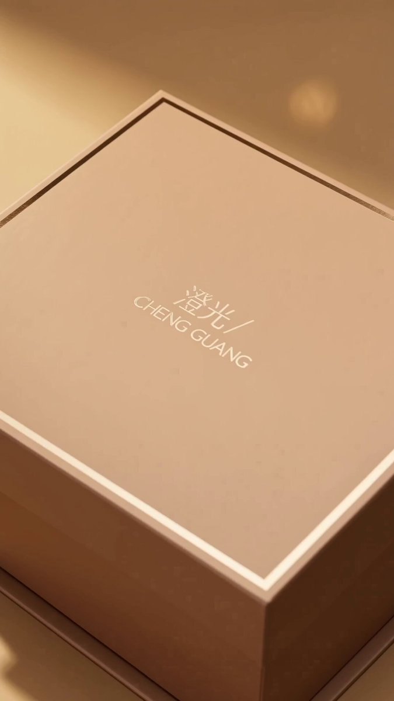

**Prompt**

```text
Crea un anuncio comercial de cuidado de la piel vertical de 9:16 de 10 segundos, fotorrealista y de alta calidad, utilizando la imagen subida como referencia visual exacta. Conserva con precisión el diseño de la botella, la etiqueta, los colores, el empaque y la composición general del producto ficticio “澄光 / CHENG GUANG Cocoa Soft Glow”. No copies marcas registradas reales de Vaseline.

Escena 1 (0–2 s): Acercamiento (push-in) suave y cinematográfico de la cámara hacia la caja de regalo abierta. La botella de Cheng Guang Cocoa Soft Glow se revela hermosamente entre papel de regalo rosa suave y elementos decorativos. Iluminación cálida y acogedora, sutiles destellos.

Escena 2 (2–4 s): Las manos de una mujer toman suavemente la botella de Cheng Guang de la caja. Movimiento lento y natural de las manos, textura de piel realista, iluminación suave y cálida, sensación de desempaquetado premium.

Escena 3 (4–6 s): Plano principal del producto (hero shot). La botella se encuentra en posición vertical rodeada de granos de cacao, manteca de cacao y hojas verdes frescas. La cámara se mueve lentamente de izquierda a derecha con una elegante profundidad de campo cinematográfica.

Escena 4 (6–7 s): Primer plano extremo de la textura suave de una loción que se esparce delicadamente sobre la piel. Muestra la textura cremosa y ligera y el acabado hidratante brillante en un detalle macro realista.

Escena 5 (7–9 s): La botella se sostiene con elegancia con una mano y se gira lentamente hacia la cámara. Destaca el concepto de manteca de cacao y Serum-in-Lotion con una iluminación publicitaria de belleza de primera calidad.

Escena 6 (9–10 s): Plano principal final de la botella de Cheng Guang Cocoa Soft Glow rodeada de granos de cacao y hojas. La cámara se acerca lentamente, sutiles efectos de destellos, fondo cálido y lujoso, composición limpia centrada en el producto.

Estilo: fotorrealista, anuncio de belleza premium, iluminación cinematográfica, movimientos de manos realistas, transiciones de cámara fluidas, profundidad de campo reducida, bokeh suave, tonos dorados cálidos, 4K, altamente detallado, movimiento natural, sin distorsiones, sin productos adicionales, sin cambios en la etiqueta o marca de la botella.
```

[↑ Volver a categorías](#catalog)

---

<a name="prompt-2098369223244628234"></a>

### Traducción en curso

Autor：[@splash\_GL](https://x.com/splash_GL) · [Publicación original](https://x.com/splash_GL/status/2098369223244628234)

Personaje · Publicado

**Resumen:** Traducción en curso


**Prompt**

```text
Traducción en curso
```

[↑ Volver a categorías](#catalog)

---

<a name="prompt-2097765578161418569"></a>

### Prompt de generación para una escena de intercambio de cuerpos entre un chico y una chica de secundaria.

Autor：[@irekawarimaniax](https://x.com/irekawarimaniax) · [Publicación original](https://x.com/irekawarimaniax/status/2097765578161418569)

Personaje · Publicado

**Resumen:** Prompt de generación para una escena de intercambio de cuerpos entre un chico y una chica de secundaria.


**Prompt**

```text
Dibuja una viñeta del intercambio de cuerpos entre un chico y una chica de secundaria
```

[↑ Volver a categorías](#catalog)

---

<a name="prompt-2097533103376081383"></a>

### Retrato de moda de un joven elegante con gafas de sol y chaqueta de mezclilla haciendo el gesto de 'shh' contra una pared grunge.

Autor：[@Aiwithamirr1](https://x.com/Aiwithamirr1) · [Publicación original](https://x.com/Aiwithamirr1/status/2097533103376081383)

Retrato / Selfie · Personaje · Artículo de moda · Publicado

**Resumen:** Retrato de moda de un joven elegante con gafas de sol y chaqueta de mezclilla haciendo el gesto de 'shh' contra una pared grunge.


**Prompt**

```text
Crea un retrato de moda cinematográfico y ultrarrealista de un joven elegante con cabello oscuro, grueso y voluminoso, y una barba prolijamente recortada, que lleva gafas de sol negras con montura roja, una camiseta negra, una chaqueta de mezclilla negra desgastada y un collar con chapa militar metálica. Mantiene un dedo verticalmente contra sus labios en un gesto confiado de "shh". Iluminación dramática y cálida de estudio, detalles faciales nítidos, fuerte contraste, estética streetwear ruda. El fondo presenta una pared vintage desgastada con llamativas secciones de pintura verticales en verde azulado, crema y rojo, textura grunge pesada, salpicaduras de pintura y pintura negra que gotea. Composición centrada, retrato de cintura para arriba, fotografía de moda editorial, alto nivel de detalle, textura de piel realista, profundidad de campo reducida, 4K, temperamental y elegante, calidad de póster.
```

[↑ Volver a categorías](#catalog)

---

<a name="prompt-2097543193651007508"></a>

### Un prompt detallado para crear una infografía profesional estilo revista de belleza coreana en formato 9:16 de 'Guía de análisis de maquillaje' basada en un retrato de referencia, que incluye análisis facial en primer plano, muestras de color y pasos de maquillaje estructurados.

Autor：[@ayzalnooor24521](https://x.com/ayzalnooor24521) · [Publicación original](https://x.com/ayzalnooor24521/status/2097543193651007508)

Infografía / Visual Educativo · Retrato / Selfie · Publicado

**Resumen:** Un prompt detallado para crear una infografía profesional estilo revista de belleza coreana en formato 9:16 de 'Guía de análisis de maquillaje' basada en un retrato de referencia, que incluye análisis facial en primer plano, muestras de color y pasos de maquillaje estructurados.


**Prompt**

```text
Hermosa chica coreana de rasgos suaves y naturales, vestida con ropa negra y gafas transparentes, con un estilo editorial de belleza moderno y limpio. Crea una infografía profesional de “MAKEUP ANALYSIS GUIDE” utilizando el retrato subido como referencia visual principal. Conserva los rasgos faciales originales, el peinado, la textura de la piel, las gafas y la reconocibilidad natural sin un retoque excesivo. Destaca los ojos, las cejas, la nariz, las mejillas y los labios rosados y brillantes con elegantes paneles de detalles en primer plano y sutiles líneas de llamada. Añade una refinada paleta de colores de maquillaje en tonos neutros cálidos, rosa suave y marrón claro con pequeñas muestras de belleza. Incluye secciones concisas para Makeup Steps, Best Makeup Looks, Key Products y Quick Tips con un texto mínimo y legible. Utiliza una estética premium de revista de belleza coreana con tipografía limpia, suaves toques beige, fondo editorial oscuro y un espaciado equilibrado. Haz que la composición final sea pulida, sofisticada, fotorrealista y en formato vertical 9:16, con la sensación general de “Same You, Just More Polished”.
```

[↑ Volver a categorías](#catalog)

---

<a name="prompt-2096914920915001598"></a>

### Foto espontánea con smartphone de una joven mujer del este de Asia con sudadera gris y vaqueros sentada en la soleada terraza de un balcón con jardín.

Autor：[@Aqsahere\_](https://x.com/Aqsahere_) · [Publicación original](https://x.com/Aqsahere_/status/2096914920915001598)

Personaje · Publicado

**Resumen:** Foto espontánea con smartphone de una joven mujer del este de Asia con sudadera gris y vaqueros sentada en la soleada terraza de un balcón con jardín.


**Prompt**

```text
Una foto espontánea con smartphone completamente natural y fotorrealista de una joven mujer del este de Asia sentada cómodamente con las piernas cruzadas en una terraza con jardín en el balcón. Tiene el cabello largo, castaño oscuro, naturalmente ondulado, que cae holgadamente sobre sus hombros y por la parte delantera de su cuerpo, con mechones individuales suaves que se mueven de manera natural. Sus rasgos son delicados y realistas, con un maquillaje natural sutil y una textura de piel auténtica.
Viste una sudadera gris claro de corte oversize y muy cómoda con unos vaqueros de corte relajado en color azul claro. Sentada de manera casual y natural, apoya suavemente una mano en su mejilla mientras mira hacia arriba y ligeramente hacia un lado. Su expresión se siente genuinamente linda y pensativa, con un ligero puchero sutil, como si la foto hubiera sido capturada durante un momento tranquilo y sin posar.
Está sentada sobre la superficie de una terraza al aire libre de color claro rodeada de frondosas plantas verdes, follaje en macetas y pequeñas flores rosadas en floración. Una barandilla de balcón de metal negro simple pasa detrás de ella, con densos árboles y vegetación natural llenando el fondo. El entorno se siente tranquilo, privado y como un auténtico balcón con jardín cotidiano.
Una suave y cálida luz natural del día cae suavemente sobre su rostro y su ropa, creando sombras sutiles y realistas. Los poros naturales de la piel, la auténtica textura del cabello, la tela realista de la sudadera y los detalles creíbles de la mezclilla son claramente visibles. Nada parece excesivamente pulido ni posado artificialmente.
Tomada como una auténtica fotografía casual de smartphone con una perspectiva natural a la altura de los ojos. Composición sentada de cuerpo entero, encuadre vertical, con el sujeto colocado ligeramente hacia la parte media inferior del encuadre. El fondo tiene una suave profundidad de campo natural: desenfocado con suavidad sin dejar de ser claramente reconocible.
Fotografía ultrarrealista, proporciones naturales, momento cotidiano espontáneo, estética de moda casual de inspiración coreana, colores suaves y apagados, grano de película sutil, iluminación realista, detalles de cámara de smartphone ligeramente imperfectos, realismo 4K, sin efecto de filtro de belleza, sin retoques excesivos.
Negative prompt: cartoon, anime, illustration, CGI, artificial-looking skin, plastic skin, excessive makeup, distorted facial features, extra fingers, malformed hands, extra limbs, incorrect anatomy, unnatural body proportions, stiff pose, oversaturated colors, dramatic studio lighting, blurry face, low resolution, watermark, text, logo.
```

[↑ Volver a categorías](#catalog)

---

<a name="prompt-2097157373936935051"></a>

### Una mujer coreana y una niña con hiyab disfrutan de un café en una terraza durante la hora dorada, decorada con garabatos dibujados a mano.

Autor：[@Lianaalane](https://x.com/Lianaalane) · [Publicación original](https://x.com/Lianaalane/status/2097157373936935051)

Retrato / Selfie · Personaje · Comida / Bebida · Publicado

**Resumen:** Una mujer coreana y una niña con hiyab disfrutan de un café en una terraza durante la hora dorada, decorada con garabatos dibujados a mano.


**Prompt**

```text
Una chica coreana con cabello castaño oscuro, largo y suave está sentada en una acogedora cafetería al aire libre durante la cálida hora dorada, sosteniendo suavemente una taza de café de cerámica cerca de sus labios. Viste un elegante cárdigan acanalado de color crema con un escote cuadrado entallado y pantalones de tiro alto a juego en color crema, creando un estilo suave y sofisticado. Un pequeño bolso de hombro color crema cuelga de forma natural de su hombro mientras se sienta cómodamente en una hermosa silla de ratán tejido. A su lado se sienta una niña pequeña y adorable que lleva un hiyab beige, una blusa modesta de color crema con delicados detalles de encaje y una falda vaporosa de color marrón. La niña pequeña también sostiene una taza caliente y mira alegremente hacia la chica coreana. Delante de ellas hay una mesa de café redonda de mármol con una taza de café, un pastelito recién horneado y un pequeño jarrón de cristal lleno de delicadas flores blancas. El fondo muestra frondosos árboles verdes, el encantador exterior de una cafetería, una cálida luz solar y un hermoso bokeh cinematográfico. Añade sutiles corazones blancos dibujados a mano, destellos y un sol sonriente alrededor de ellas para lograr una atmósfera linda y de ensueño, con rostros muy detallados, expresiones naturales, iluminación suave, calidad fotorrealista y una estética acogedora.
```

[↑ Volver a categorías](#catalog)

---

[Explora Leadde.ai →](https://leadde.ai/?utm_source=github&utm_medium=readme&utm_campaign=prompt-library&utm_content=image2.5)
