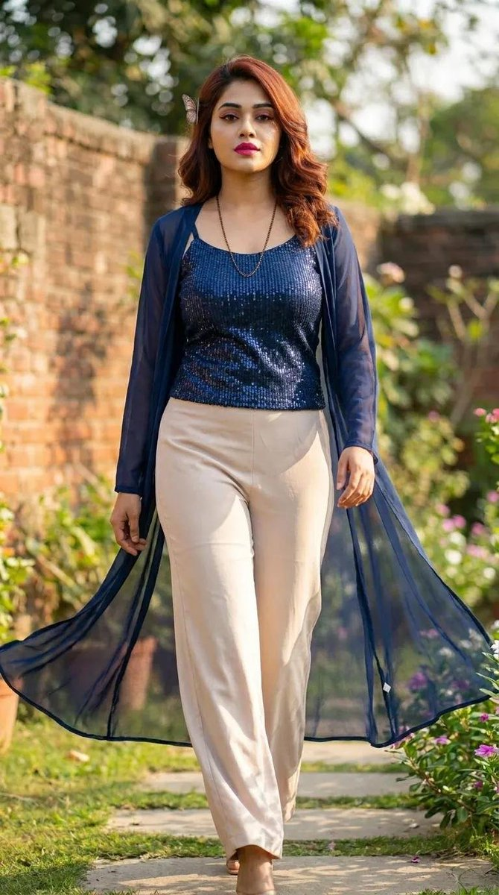

# Image2.5 · Biblioteca de prompts · Leadde.ai

[](README.md) [](README_zh.md) [](README_zh-TW.md) [](README_ja-JP.md) [](README_ko-KR.md) [](README_th-TH.md) [](README_vi-VN.md) [](README_hi-IN.md) [](README_es-ES.md) [-lightgrey)](README_es-419.md) [](README_de-DE.md) [](README_fr-FR.md) [](README_it-IT.md) [-brightgreen)](README_pt-BR.md) [](README_pt-PT.md) [](README_tr-TR.md)

**Best for:** Image 2.5 prompts for commercial visuals, layouts, keyframes, and image-to-video source assets.

For PDF, PPT, SOP, training, and multilingual video workflows:
[Awesome Document-to-Video](https://github.com/LeaddeOpenLab/awesome-document-to-video)

> **Prompts de qualidade selecionados diariamente**

Descubra prompts completos para imagens, vídeos e criações 3D com IA. Explore por estilo, consulte versões em vários idiomas e conheça os autores e as fontes.

[Explore a Leadde.ai →](https://leadde.ai/?utm_source=github&utm_medium=readme&utm_campaign=prompt-library&utm_content=image2.5)

## Conheça a Leadde.ai

A Leadde.ai ajuda equipes a transformar documentos, slides e textos em vídeos empresariais com IA para treinamento, integração e marketing.

Dê uma estrela a este repositório para acompanhar nossa seleção diária de prompts e descobrir novas ideias.

**92** Prompts · Última adição: **2026-09-13**

<a name="catalog"></a>

## Explorar por categoria

[Fotografia](#category-photography) · [Cinematográfico / Imagem de Filme](#category-cinematic-film-still) · [Anime / Mangá](#category-anime-manga) · [Ilustração](#category-illustration) · [Esboço / Arte Linear](#category-sketch-line-art) · [Renderização 3D](#category-3d-render) · [Pixel Art](#category-pixel-art) · [Aquarela](#category-watercolor) · [Retrô / Vintage](#category-retro-vintage) · [Cyberpunk / Ficção Científica](#category-cyberpunk-sci-fi) · [Minimalismo](#category-minimalism) · [Outros](#category-other)

<a name="all-prompts"></a>

<a name="category-photography"></a>

## Fotografia

<a name="prompt-2098866288957551034"></a>

### Um fotograma fotorrealista de grande produção de uma mulher em um casaco de montaria grafite saltando sobre um rio de pedras secas montada em um cervo de quartzo vivo sob sol intenso.

Autor：[@TraffAlex](https://x.com/TraffAlex) · [Publicação original](https://x.com/TraffAlex/status/2098866288957551034)

Fotografia · Personagem · Publicado

**Resumo:** Um fotograma fotorrealista de grande produção de uma mulher em um casaco de montaria grafite saltando sobre um rio de pedras secas montada em um cervo de quartzo vivo sob sol intenso.


**Prompt**

```text
Um fotograma fotorrealista de grande produção cinematográfica. Uma mulher com um casaco de montaria grafite se agarra ao pescoço de um cervo cujo corpo é de quartzo vivo, com galhadas que formam um candelabro de pontas projetando fragmentos de luz do dia. Eles estão no meio de um salto sobre um rio seco de pedras brancas, os cascos ainda no ar, o casaco dela esvoaçando como uma bandeira. Sol intenso, arco-íris prismáticos em sua bochecha. Paleta: quartzo, grafite, céu desbotado, um vislumbre de sua pele quente de sangue. Cinético, sem arma na sela, sem violência — apenas velocidade. 35mm, proporção 2:3.
```

[↑ Voltar às categorias](#catalog)

---

<a name="prompt-2098868060228927512"></a>

### Quadro fotorrealista de ação na selva de uma mulher em cáqui enlameado fugindo de um monstro vegetal floral na chuva.

Autor：[@TraffAlex](https://x.com/TraffAlex) · [Publicação original](https://x.com/TraffAlex/status/2098868060228927512)

Fotografia · Personagem · Publicado

**Resumo:** Quadro fotorrealista de ação na selva de uma mulher em cáqui enlameado fugindo de um monstro vegetal floral na chuva.


**Prompt**

```text
Um quadro de ação fotorrealista na borda da selva. Uma mulher vestindo cáqui salpicado de lama corre em direção à câmera, com os olhos arregalados; atrás dela, um ogro de três andares feito de helicônias molhadas, gengibre e ave-do-paraíso, uma boca de brácteas vermelhas se abrindo, pólen como fumaça. Chuva. Paleta: vermelho cádmio, verde selva, cáqui, o amarelo do bico de uma helicônia. Pétalas se desprendem em seu rastro. 35mm, chuva na lente. Proporção de tela 2:3.
```

[↑ Voltar às categorias](#catalog)

---

<a name="prompt-2098799449237782991"></a>

### Tradução em andamento

Autor：[@DeepBlueX0](https://x.com/DeepBlueX0) · [Publicação original](https://x.com/DeepBlueX0/status/2098799449237782991)

Fotografia · Retrato / Selfie · Personagem · Item de Moda · Publicado

Publicação original：[@DeepBlueX0](https://x.com/DeepBlueX0) · [Publicação original](https://x.com/DeepBlueX0/status/2097630845435572490)

**Resumo:** Tradução em andamento


**Prompt**

```text
Tradução em andamento
```

[↑ Voltar às categorias](#catalog)

---

<a name="prompt-2098797110401335713"></a>

### Tradução em andamento

Autor：[@sdjn\_wgc](https://x.com/sdjn_wgc) · [Publicação original](https://x.com/sdjn_wgc/status/2098797110401335713)

Fotografia · Retrato / Selfie · Arquitetura / Interiores · Publicado

**Resumo:** Tradução em andamento


**Prompt**

```text
Tradução em andamento
```

[↑ Voltar às categorias](#catalog)

---

<a name="prompt-2098779220566839714"></a>

### Tradução em andamento

Autor：[@AI\_money\_club](https://x.com/AI_money_club) · [Publicação original](https://x.com/AI_money_club/status/2098779220566839714)

Fotografia · Personagem · Alimentos / Bebidas · Publicado

Publicação original：[@AI\_money\_club](https://x.com/AI_money_club) · [Publicação original](https://x.com/AI_money_club/status/2098767892028535126)

**Resumo:** Tradução em andamento


**Prompt**

```text
Tradução em andamento
```

[↑ Voltar às categorias](#catalog)

---

<a name="prompt-2098610123900064236"></a>

### Um instantâneo espontâneo de viagem de uma mulher do Leste Asiático usando orelhas de rato e posando em frente a um castelo de fantasia.

Autor：[@Aqsahere\_](https://x.com/Aqsahere_) · [Publicação original](https://x.com/Aqsahere_/status/2098610123900064236)

Fotografia · Personagem · Publicado

**Resumo:** Um instantâneo espontâneo de viagem de uma mulher do Leste Asiático usando orelhas de rato e posando em frente a um castelo de fantasia.


**Prompt**

```text
Uma foto espontânea e realista de viagem de uma jovem mulher do Leste Asiático aproveitando um dia divertido e mágico em um castelo de conto de fadas. Ela está em frente a um grandioso castelo de fantasia em estilo europeu, com altas torres de marfim, elegantes telhados azuis, pináculos dourados, detalhes intrincados em pedra e uma bela arquitetura clássica. O castelo ocupa a maior parte do fundo, conferindo à cena uma sensação mágica de férias em parque temático. Ela tem cabelos longos, castanho-avermelhados e naturalmente ondulados caindo soltos sobre os ombros e as costas. Ela usa uma linda tiara brilhante de orelhas de rato em tons de azul e lavanda e sorri naturalmente enquanto olha ligeiramente para cima e para o lado, como se tivesse sido capturada em um momento genuíno de felicidade. Ela veste uma jaqueta curta texturizada off-white com botões dourados sobre uma camisa branca impecável de gola e uma gravata xadrez estampada. Seu short-saia de cintura alta xadrez em bege, creme e azul suave tem pregas suaves que se movem naturalmente com sua pose. Ela estende ambos os braços para fora e se inclina levemente em direção à câmera com uma energia animada e brincalhona. A pose parece espontânea em vez de ensaiada, como uma foto real de viagem. O pátio do castelo atrás dela tem amplos degraus de pedra clara, grades decorativas, estandartes coloridos e arquitetura detalhada de inspiração medieval. O céu está suavemente nublado com nuvens azul-acinzentadas claras, criando uma luz diurna suave e favorecedora com sombras naturais. Fotografia de viagem ultrafotorrealista, aparência jovem e autêntica, textura de pele realista, mechas de cabelo naturais, texturas de tecido detalhadas, proporções críveis, profundidade de campo suave, sombras naturais sutis, cores vibrantes mas ligeiramente suaves, estética de foto espontânea de smartphone, atmosfera de férias dos sonhos, altamente detalhada, composição vertical 3:4.
```

[↑ Voltar às categorias](#catalog)

---

<a name="prompt-2098616431122559479"></a>

### Prompt de fotografia documental de estudante na quadra esportiva do campus no estilo instantânea de iPhone

Autor：[@DeepBlueX0](https://x.com/DeepBlueX0) · [Publicação original](https://x.com/DeepBlueX0/status/2098616431122559479)

Fotografia · Retrato / Selfie · Publicado

Publicação original：[@DDJCXX](https://x.com/DDJCXX) · [Publicação original](https://x.com/DDJCXX/status/2098240447038767437)

**Resumo:** Prompt de fotografia documental de estudante na quadra esportiva do campus no estilo instantânea de iPhone


**Prompt**

```text
Documentário da rotina no campus; coincidência divertida; foto instantânea com a câmera nativa do iPhone; ombros estreitos e cintura extremamente fina·estudante de busto volumoso🙆🏻‍♀️
```

[↑ Voltar às categorias](#catalog)

---

<a name="prompt-2098277829154951371"></a>

### Fotografia artística costeira assimétrica com veleiro rosa-coral ancorado em uma enseada calma e deserta, emoldurado por pinheiros à direita.

Autor：[@listudio](https://x.com/listudio) · [Publicação original](https://x.com/listudio/status/2098277829154951371)

Fotografia · Veículo · Publicado

**Resumo:** Fotografia artística costeira assimétrica com veleiro rosa-coral ancorado em uma enseada calma e deserta, emoldurado por pinheiros à direita.


**Prompt**

```text
Crie uma fotografia artística costeira vertical em proporção 3:4. Uma enseada tranquila e deserta, com céu cinza-azulado límpido ocupando 70% da parte superior e uma linha do horizonte azul-escuro reta na parte inferior. Um pequeno veleiro monocasco realista ancorado na parte centro-inferior ligeiramente à esquerda, mastro fino estendendo-se em direção ao céu, vela triangular rosa-coral levemente enfunada, tensão verossímil nas costuras da lona, uma faixa estreita azul-escuro na base da vela, cabine branco-rosada, janelas preto-profundo, casco inferior vermelho-coral e cordoamento fino e verossímil. A superfície tranquila da água azul-ciano exibe finas ondulações horizontais e suaves reflexos rosados fragmentados. No lado direito, um pinheiro escuro compõe uma moldura assimétrica, com o tronco subindo do canto inferior direito e a copa entrando pelo canto superior direito, acículas com discretos realces solares em rosa avermelhado escuro, preservando uma ampla área de céu. Na parte mais inferior, uma faixa de praia de areia fina branco-rosada com sombras suaves da árvore. Casco, casca, acículas e água do mar realistas, luz solar nítida, sombras profundas, leve granulação de filme, textura discreta de impressão fosca, cores surrealistas com espacialidade crível, serenidade prolongada e distanciamento onírico. Sem pessoas, texto, logotipo ou marca d'água.
```

[↑ Voltar às categorias](#catalog)

---

<a name="prompt-2098277612053561383"></a>

### Fotografia artística surrealista de uma costa de sal branca-rosada e água do mar em degradê de vermelho-coral a azul-escuro.

Autor：[@listudio](https://x.com/listudio) · [Publicação original](https://x.com/listudio/status/2098277612053561383)

Fotografia · Paisagem / Natureza · Publicado

**Resumo:** Fotografia artística surrealista de uma costa de sal branca-rosada e água do mar em degradê de vermelho-coral a azul-escuro.


**Prompt**

```text
Crie uma fotografia artística colorida e surrealista em formato vertical 3:4. Uma costa vazia sem pessoas, o quarto superior é um céu uniforme em azul-cobalto acinzentado, com uma orla distante rosa-claro extremamente fina cruzando um horizonte alto. Uma encosta costeira salina branca-rosada se estende da esquerda até o primeiro plano inferior, com grãos cristalinos ásperos, cascalho solto e bordas naturalmente erodidas nitidamente visíveis, formando uma linha costeira em curva suave e assimétrica. A água rasa perto da margem tem tons intensos de vermelho-coral, vermelhão e rosa, com algumas ondas finas avançando diagonalmente para o canto inferior direito, fazendo uma transição gradual para a água do mar em azul-da-Prússia escuro à direita; a água tem transparência realista, pequenas ondulações e reflexos, sem parecer tinta ou lava. Luz lateral de dia ensolarado, realces branco-rosados com detalhes preservados, grandes blocos de cores limpas em contraste com microtexturas reais, grão de filme fino, sensação de impressão fosca, silenciosa, estranha, ardente e fria. Fotografia sem bordas (full-bleed), sem texto, molduras, logos ou marcas d'água.
```

[↑ Voltar às categorias](#catalog)

---

<a name="prompt-2098277688498880901"></a>

### Fotografia de retrato surrealista de cavalo malhado de pelo vermelho com fundo de céu azul puro.

Autor：[@listudio](https://x.com/listudio) · [Publicação original](https://x.com/listudio/status/2098277688498880901)

Fotografia · Retrato / Selfie · Resumo / Contexto · Publicado

**Resumo:** Fotografia de retrato surrealista de cavalo malhado de pelo vermelho com fundo de céu azul puro.


**Prompt**

```text
Crie uma fotografia artística de retrato animal surrealista em formato vertical 3:4. Tomada em ângulo baixo da cabeça, pescoço, ombros e peito de um cavalo malhado robusto; o corpo é cortado naturalmente na parte inferior e à direita; a cabeça do cavalo fica na porção centro-inferior voltada em três quartos para a esquerda; as orelhas estão naturalmente eretas; os olhos negros, profundos e úmidos possuem um minúsculo reflexo. O terço superior é preenchido por um céu azul-cobalto puro e sem nuvens. A pelagem tem uma recoloração surrealista e minuciosa, dominada por tons intensos de vermelho-tijolo e vermelho-coral, com grandes manchas irregulares de cor branco-rosada da ponte do nariz ao focinho, e pequenas áreas em azul-escuro entre as manchas vermelhas e brancas dos ombros e peito. A longa crina flui para a esquerda soprada por um vento forte vindo da direita, com fios finos e longos sobrepostos, pelos vermelho-brilhantes entrelaçados a sombras em tom vinho-escuro, caindo parcialmente sobre o pescoço. Pelos curtos, narinas, pelos táteis e musculatura com detalhes realistas. Luz lateral natural e brilhante, sombras densas e ricas em camadas, fotografia nítida congelando o instante, leve granulação de filme e tons foscos, com uma pegada editorial de moda selvagem, livre e marcante. Sem arreios, pessoas, texto, logotipo ou marca-d'água.
```

[↑ Voltar às categorias](#catalog)

---

<a name="prompt-2098277762410942530"></a>

### Fotografia botânica surrealista de cactos em contraste vermelho e azul, contendo cactos achatados vermelho-coral e cacto colunar azul-cobalto escuro.

Autor：[@listudio](https://x.com/listudio) · [Publicação original](https://x.com/listudio/status/2098277762410942530)

Fotografia · Publicado

**Resumo:** Fotografia botânica surrealista de cactos em contraste vermelho e azul, contendo cactos achatados vermelho-coral e cacto colunar azul-cobalto escuro.


**Prompt**

```text
Crie uma fotografia artística botânica surrealista no formato vertical 3:4. Com um céu azul-celeste sem nuvens e levemente acinzentado ao fundo, vista em ângulo baixo de um grupo de cactos reais brotando da borda inferior e cortados pelo enquadramento. Da esquerda para o centro, há de três a cinco artículos achatados e ovais de cacto dispostos de forma intercalada, o mais alto levemente inclinado para a esquerda, com a casca recolorida em vermelho-coral e vermelho-melancia vibrantes, preservando um acabamento fosco ceroso, rugas e ondulações sutis e aréolas regulares, mas não mecânicas. À direita, um cacto colunar alto em azul-cobalto escuro, com costelas verticais bem definidas, sulcos em azul-da-prússia profundo e espinhos estrelados vermelho-vermelhão alinhados ao longo da borda das costelas. Na base, alguns artículos achatados azuis sobrepõem-se a pequenos artículos vermelhos com camadas nítidas, deixando um espaço de céu no canto superior esquerdo. A forte luz solar natural vinda do canto superior esquerdo destaca o volume das plantas e os espinhos; cores vívidas aderem a um tecido vegetal verossímil. Composição assimétrica escultural e geométrica, textura fotográfica refinada, granulado de filme suave, efeito fosco contido, evitando aparência plástica ou de renderização 3D. Sem vasos, flores, textos, logotipos ou marcas d'água.
```

[↑ Voltar às categorias](#catalog)

---

<a name="prompt-2097886029692969195"></a>

### Prompt fotográfico de selfie no espelho do quarto de influenciadora chinesa, mostrando cabelo curto, look decotado e estilo com luz suave em ambiente interno.

Autor：[@ohmuyi](https://x.com/ohmuyi) · [Publicação original](https://x.com/ohmuyi/status/2097886029692969195)

Fotografia · Retrato / Selfie · Influenciador(a) / Modelo · Item de Moda · Arquitetura / Interiores · Publicado

**Resumo:** Prompt fotográfico de selfie no espelho do quarto de influenciadora chinesa, mostrando cabelo curto, look decotado e estilo com luz suave em ambiente interno.


**Prompt**

```text
3:4, selfie de perto no espelho com celular, influenciadora chinesa, pele branca de subtom frio, corte bob curto preto com franja reta e leve, blusa de manga curta justa e decotada, o celular cobre um terço do lado direito do rosto, quarto com cama branca e espelho de moldura preta, iluminação suave de interiores, doce e sedutora
```

[↑ Voltar às categorias](#catalog)

---

<a name="prompt-2097532595814940683"></a>

### Prompt de foto de viagem realista de uma jovem do leste asiático na costa do Monte Saint-Michel.

Autor：[@saniaspeaks\_](https://x.com/saniaspeaks_) · [Publicação original](https://x.com/saniaspeaks_/status/2097532595814940683)

Fotografia · Retrato / Selfie · Personagem · Publicado

**Resumo:** Prompt de foto de viagem realista de uma jovem do leste asiático na costa do Monte Saint-Michel.


**Prompt**

```text
Um retrato de viagem espontâneo e fotorrealista de uma jovem mulher do leste asiático parada em uma praia arenosa e tranquila ao lado de grandes rochas cobertas de musgo, com uma magnífica abadia histórica de pedra e uma arquitetura medieval semelhante a um castelo erguendo-se dramaticamente em uma ilha rochosa atrás dela. Ela tem longos cabelos castanho-escuros lisos que caem naturalmente sobre um ombro, traços faciais suaves e juvenis e um sorriso gentil e caloroso enquanto olha diretamente para a câmera.

Ela está vestindo um casaco preto longo e oversized com as mãos casualmente enfiadas nos bolsos, sobreposto a uma roupa de cor clara. Um cachecol grande e macio branco-creme está enrolado calorosamente em seu pescoço, caindo pela frente com um pequeno emblema preto em estilo de grife perto da ponta. Uma delicada bolsa de ombro com corrente fica parcialmente visível.

A composição a captura em primeiro plano enquanto a vasta abadia histórica domina o fundo, cercada por antigas muralhas de pedra, falésias rochosas, planícies de maré arenosas e uma calma atmosfera costeira. Alguns pequenos veículos e pessoas distantes adicionam uma escala realista à cena. A luz suave e natural do entardecer e um céu azul-pálido e límpido criam um clima tranquilo de viagem europeia.

Fotografia ultrarrealista, foto de viagem autêntica e espontânea, textura de pele natural, detalhes realistas de tecido, iluminação cinematográfica suave, estética sutil de câmera de smartphone, gradação de cores ligeiramente sonhadora, proporções naturais, arquitetura detalhada, atmosfera costeira pacífica, composição vertical, proporção de tela 3:4.
```

[↑ Voltar às categorias](#catalog)

---

<a name="prompt-2097411028510179759"></a>

### Prompt de foto de paisagem em alta definição de uma clareira na floresta com densa vegetação verde.

Autor：[@mark\_k](https://x.com/mark_k) · [Publicação original](https://x.com/mark_k/status/2097411028510179759)

Fotografia · Paisagem / Natureza · Publicado

**Resumo:** Prompt de foto de paisagem em alta definição de uma clareira na floresta com densa vegetação verde.


**Prompt**

```text
Foto de uma clareira na floresta com muita folhagem verde, altamente detalhada
```

[↑ Voltar às categorias](#catalog)

---

<a name="prompt-2098981813771194613"></a>

### Tradução em andamento

Autor：[@ZarnishNael](https://x.com/ZarnishNael) · [Publicação original](https://x.com/ZarnishNael/status/2098981813771194613)

Fotografia · Retrato / Selfie · Personagem · Item de Moda · Publicado

**Resumo:** Tradução em andamento



**Prompt**

```text
Tradução em andamento
```

[↑ Voltar às categorias](#catalog)

---

<a name="prompt-2098975203866837026"></a>

### Prompt de retrato realista em formato vertical de uma mulher sentada de pernas cruzadas na cama tirando uma selfie no espelho em um quarto com luz quente.

Autor：[@CyberTotal2026](https://x.com/CyberTotal2026) · [Publicação original](https://x.com/CyberTotal2026/status/2098975203866837026)

Fotografia · Retrato / Selfie · Personagem · Publicado

**Resumo:** Prompt de retrato realista em formato vertical de uma mulher sentada de pernas cruzadas na cama tirando uma selfie no espelho em um quarto com luz quente.


**Prompt**

```text
Tema:
Espelho e smartphone sob luz noturna

Objeto principal:
Fotografia vertical de uma mulher adulta sentada de pernas cruzadas na cama, em um quarto iluminado por uma luminária de tom quente, tirando uma selfie no espelho com um smartphone grande. A pessoa está centralizada no enquadramento.

Pessoa e expressão:
Cabelos longos e pretos presos atrás, franja rala. O smartphone esconde em grande parte o centro do rosto, revelando apenas um dos olhos, a bochecha e parte dos lábios rosados e brilhantes. Rosto virado para a frente. Expressão tranquila.

Vestuário e pose:
Camiseta regata branca canelada de alças finas com renda e botões pequenos no decote, shorts cinzas com cordão ajustável, meias brancas até o joelho. Sentada de pernas cruzadas, segurando com uma mão um smartphone grande na cor cobre em frente ao rosto. Top branco e calções cinzas.

Fundo e iluminação:
Roupa de cama branca, mesa de cabeceira de madeira, luminária de mesa de luz quente, janela escura. A luz alaranjada cria sombras suaves sobre a pessoa e a cama. A luz principal no fundo é uma luz suave vinda do lado da janela.

Composição e câmera:
Composição vertical 2:3, a câmera captura a superfície do espelho de frente, em um enquadramento quase de corpo inteiro sentada. A pessoa ao centro, o smartphone grande no centro do rosto, as pernas com meias brancas posicionadas abaixo. Foco no reflexo do espelho e nas roupas. Figura ampla no enquadramento, foco nítido na protagonista e fundo levemente desfocado.

Textura e estilo:
Selfie noturna no espelho fotorrealista. Retrato natural da superfície do espelho, do aparelho em tom cobre, do tecido canelado branco com renda, do tecido cinza e da luminária quente.

Negativo:
Não alterar a composição na qual o smartphone cobre amplamente o centro do rosto
```

[↑ Voltar às categorias](#catalog)

---

<a name="prompt-2098945760817479956"></a>

### Prompt de fotografia de retrato realista com luz natural de uma mulher de mini slip dress de cetim preto olhando para trás em uma cama ensolarada.

Autor：[@CyberTotal2026](https://x.com/CyberTotal2026) · [Publicação original](https://x.com/CyberTotal2026/status/2098945760817479956)

Fotografia · Personagem · Publicado

**Resumo:** Prompt de fotografia de retrato realista com luz natural de uma mulher de mini slip dress de cetim preto olhando para trás em uma cama ensolarada.


**Prompt**

```text
Tema:
Cetim preto à luz da manhã

Sujeito:
Fotografia vertical de uma mulher adulta sentada de costas em uma cama branca iluminada pelo sol da manhã, vestindo um mini slip dress de cetim preto. A pessoa está posicionada com base no centro da imagem.

Personagem e expressão:
Cabelos castanho-escuros levemente ondulados abaixo dos ombros com franja rala. Rosto oval e delicado, olhos castanhos amendoados, sobrancelhas naturais, nariz pequeno, lábios rosados viçosos. Expressão serena olhando para a câmera por cima do ombro. Rosto voltado para a câmera por cima do ombro.

Traje e pose:
Mini slip dress com alças finas em cetim preto brilhante. As costas são amplamente abertas quase até a cintura, com múltiplos cordões finos trançados e pequenos laços em ambos os lados. Sentada com as pernas dobradas para o lado, com uma mão apoiada na roupa de cama. Minivestido preto.

Fundo e iluminação:
Lençóis e travesseiros brancos, paredes em tons claros, janela ampla. O sol forte da manhã cria finos reflexos brancos no cetim preto, iluminando calorosamente as costas e os cabelos. A luz principal de fundo é uma luz suave que entra pela janela.

Composição e câmera:
Composição vertical 4:5, foto tirada na diagonal traseira acima do joelho a partir da beirada da cama. A pessoa é posicionada de forma ampla no centro, destacando as costas abertas e os laços laterais. Foco no rosto que se vira e no cetim. Sujeito ocupando grande parte do quadro, foco nítido no elemento principal e fundo com leve desfoque (bokeh).

Textura e estilo:
Fotografia fotorrealista com iluminação natural. Detalhamento preciso do brilho espelhado do cetim preto, dos cordões finos trançados, da roupa de cama branca e da luz matinal sobre os cabelos e a pele.

Negativo:
Não omitir as costas profundamente abertas nem os detalhes dos cordões trançados nas duas laterais
```

[↑ Voltar às categorias](#catalog)

---

<a name="prompt-2098925376554811573"></a>

### Tradução em andamento

Autor：[@splash\_GL](https://x.com/splash_GL) · [Publicação original](https://x.com/splash_GL/status/2098925376554811573)

Fotografia · Animal / Criatura · Publicado

**Resumo:** Tradução em andamento


**Prompt**

```text
Tradução em andamento
```

[↑ Voltar às categorias](#catalog)

---

<a name="prompt-2098631695855669712"></a>

### Uma foto aconchegante e fotorrealista de uma mulher do leste asiático em uma van camper aquecida contemplando o céu estrelado da Via Láctea.

Autor：[@laviniavelle](https://x.com/laviniavelle) · [Publicação original](https://x.com/laviniavelle/status/2098631695855669712)

Fotografia · Personagem · Publicado

**Resumo:** Uma foto aconchegante e fotorrealista de uma mulher do leste asiático em uma van camper aquecida contemplando o céu estrelado da Via Láctea.


**Prompt**

```text
Uma fotografia realista, aconchegante e altamente detalhada de uma jovem mulher do leste asiático com o cabelo preso em um coque casual e macio, sentada confortavelmente dentro de uma van camper aquecida à noite. Ela está enrolada em um edredom rosa espesso e felpudo com estampa floral, vestindo um suéter aconchegante de fleece felpudo rosa, segurando uma caneca de cerâmica rosa com as duas mãos e olhando pela grande janela da van com um sorriso suave e sereno. Do lado de fora da janela, um céu noturno escuro de tirar o fôlego revela uma Via Láctea vívida e repleta de estrelas sobre as silhuetas de montanhas distantes. O interior da van é repleto de luzes de fada quentes em cordão, prateleiras de madeira aconchegantes com pequenas decorações para a casa, fotos emolduradas e bichinhos de pelúcia fofos de um coelhinho branco e um patinho amarelo. Iluminação ambiente quente, cinematográfica, resolução 8k, fotorrealista, atmosfera sonhadora.
```

[↑ Voltar às categorias](#catalog)

---

<a name="prompt-2097585546973614232"></a>

### Tradução em andamento

Autor：[@CyberTotal2026](https://x.com/CyberTotal2026) · [Publicação original](https://x.com/CyberTotal2026/status/2097585546973614232)

Fotografia · Personagem · Publicado

**Resumo:** Tradução em andamento


**Prompt**

```text
Tradução em andamento
```

[↑ Voltar às categorias](#catalog)

---

<a name="prompt-2097534208541442338"></a>

### Prompt para close-up espontâneo de câmera frontal de iPhone de jovem mulher leste-asiática de pele branca e fria, com fundo felpudo cinza e branco e várias opções de poses apoiando o rosto e divagando.

Autor：[@AIVideoHub\_](https://x.com/AIVideoHub_) · [Publicação original](https://x.com/AIVideoHub_/status/2097534208541442338)

Perfil / Avatar · Fotografia · Retrato / Selfie · Personagem · Resumo / Contexto · Publicado

**Resumo:** Prompt para close-up espontâneo de câmera frontal de iPhone de jovem mulher leste-asiática de pele branca e fria, com fundo felpudo cinza e branco e várias opções de poses apoiando o rosto e divagando.


**Prompt**

```text
📱 Foto espontânea tirada com a câmera frontal do iPhone, 9:16; mulher leste-asiática bonita de 18 a 22 anos, claramente maior de idade, cerca de 1,75 m, traços faciais delicados, pele branca fria e translúcida, corpo de modelo alto e esbelto, seios visualmente em torno de um sutiã tamanho E natural. Cabelos escuros, macios e volumosos com ondas longas e largas, blusa de alcinha fina clara e justa com decote V profundo, revelando ombros lisos e a linha do pescoço, olhos arredondados, sobrancelhas retas e suaves, olhos pretos e brilhantes, blush rosa suave e lábios hidratados em tom rosado, preguiçosa e tranquila.

🩶 Close-up muito fechado de retrato em ambiente interno mal iluminado, fundo desfocado de tecido felpudo cinza e branco, luz fraca em tons frios, baixa exposição, filtro cinza e branco de baixa saturação, baixo contraste, leve nitidez, granulação suave e enevoada em foco suave, casual e relaxada, limpa e sofisticada, com uma leve atmosfera melancólica e fria.

Conjunto de poses aleatórias:

🤍 Com uma mão apoiando o rosto, a palma colada à bochecha e à mandíbula, olhando calmamente para a câmera
🫧 Cotovelo apoiando a lateral do rosto, com a cabeça levemente inclinada no mundo da lua
🌙 Metade do rosto escondida na palma da mão, olhar preguiçoso e vago
💭 Dedos tocando suavemente o queixo e a lateral do rosto, abaixando a cabeça e levantando lentamente o olhar
🪞 Próxima da câmera, palma da mão apoiando o rosto, cabelos longos e ondulados caindo sobre a frente dos ombros
☁️ A lateral do rosto encostada nas costas da mão, olhar direcionado para fora do enquadramento
💤 Mão apoiando a bochecha com os ombros levemente encolhidos, como se fosse um flagra de sonolência
✨ Apoiando o rosto perto de uma almofada felpuda, com um leve sorriso no canto dos lábios

🎲 Varie livremente a distância da selfie, o modo de apoiar o rosto, o olhar, as mechas de cabelo, a luz fraca, o desfoque e a granulação com base nas diferentes poses, mantendo como prioridade o close-up bem fechado, os tons frios acinzentados e a textura de foto espontânea tirada na câmera frontal do iPhone, buscando uma estética dreamcore caseira × atmosfera melancólica × sensação de retrato minimalista de alto nível.

Gere uma imagem de prévia composta contendo diferentes poses para que eu possa escolher.
```

[↑ Voltar às categorias](#catalog)

---

<a name="prompt-2096909970398941572"></a>

### Selfie no espelho fotorrealista 9:16 de uma mulher brasileira atlética em um macacão laranja-terracota dentro de uma academia de luxo.

Autor：[@MrDasOnX](https://x.com/MrDasOnX) · [Publicação original](https://x.com/MrDasOnX/status/2096909970398941572)

Fotografia · Retrato / Selfie · Personagem · Publicado

**Resumo:** Selfie no espelho fotorrealista 9:16 de uma mulher brasileira atlética em um macacão laranja-terracota dentro de uma academia de luxo.


**Prompt**

```text
Selfie no espelho fotorrealista em estúdio de fitness de luxo em ambiente interno, vertical 9:16, uma jovem mulher brasileira em pé em uma pose relaxada de contrapposto tirando uma selfie com smartphone. A câmera captura a cena através de um grande espelho do chão ao teto usando uma lente grande-angular de celular equivalente a 28–35 mm. A modelo está a cerca de 1 metro do espelho. O corpo inteiro, da cabeça aos tênis, está visível. Ela ocupa o centro-esquerdo do enquadramento. Piso de madeira quente, tapetes de borracha pretos e fileiras de kettlebells e máquinas de cabos aparecem à direita e ao fundo.
A modelo é uma jovem mulher brasileira com um físico atlético-curvilíneo e compacto: ombros moderadamente largos, braços definidos, mas não volumosos, busto cheio, cintura fina, quadris arredondados e coxas naturalmente grossas. As proporções parecem fundamentadas e reais, em vez de magras como modelos ou exageradas. Pele bronzeada dourada e quente com poros visíveis e variação sutil. Iluminação suave e natural, sem pele plástica.
Ela fica com o peso na perna direita, o joelho esquerdo ligeiramente flexionado e virado para fora, os quadris angulados em direção ao espelho. O tronco se torce suavemente para que o ombro esquerdo fique mais perto do vidro. A mão esquerda repousa sobre o quadril; a mão direita segura um smartphone escuro perto do rosto, na altura da bochecha. A cabeça está virada sobre o ombro esquerdo em direção ao telefone, o queixo ligeiramente para baixo, expressão calma e levemente confiante com um pequeno sorriso de boca fechada. Os olhos olham para a tela.
O cabelo é castanho-escuro com mechas cor de caramelo quente, na altura dos ombros, preso em um rabo de cavalo baixo e frouxo com mechas emoldurando o rosto. O rosto é oval com maçãs do rosto proeminentes, lábios cheios em tom rosa-nude natural e olhos amendoados castanho-escuros.
A roupa é um macacão atlético de gola alta em laranja-terracota escuro com alças finas, cobertura moderada e uma linha de perna cavada, mas ainda modesta. Tecido elástico fosco, sem logotipos. Tênis brancos com solas limpas.
O cenário é um estúdio de fitness contemporâneo de alto padrão com grandes espelhos, tijolos aparentes em uma parede, luminárias pendentes quentes misturadas com LEDs superiores frios e algumas outras pessoas treinando suavemente fora de foco ao fundo. HDR de celular realista, granulação natural, reflexos precisos e sombras verossímeis.
```

[↑ Voltar às categorias](#catalog)

---

<a name="prompt-2096901566985068734"></a>

### Prompt para foto instantânea de retrato de aeromoça com uniforme japonês em frente à porta da cabine, com banco integrado de poses aleatórias.

Autor：[@AIVideoHub\_](https://x.com/AIVideoHub_) · [Publicação original](https://x.com/AIVideoHub_/status/2096901566985068734)

Fotografia · Retrato / Selfie · Personagem · Resumo / Contexto · Publicado

**Resumo:** Prompt para foto instantânea de retrato de aeromoça com uniforme japonês em frente à porta da cabine, com banco integrado de poses aleatórias.


**Prompt**

```text
📱 Foto casual instantânea estilo companhia aérea japonesa, 3:4; linda mulher do leste asiático de 18 a 22 anos, claramente adulta, cerca de 1,75 m de altura, traços faciais delicados e doces, pele de porcelana branca e fria, corpo de modelo alta e esguia, busto visualmente em torno de um sutiã tamanho E natural. Penteado preso sofisticado, camisa branca com decote em V profundo × colete de comissária azul-marinho × saia curta listrada de azul e branco, lenço de seda amarelo, sapatos pretos de salto médio e meia-calça preta.

✈️ Área da porta da cabine do avião, com assento dobrável, maçaneta da porta, placas de aviso e compartimentos superiores enquadrados naturalmente. Tons de cinza frio de baixa saturação, composição inclinada segurada à mão com smartphone, luz difusa de teto, leve superexposição, ruído e desfoque nas bordas, maquiagem estilo sem maquiagem translúcida pêssego branco, sensação autêntica de foto amadora.

Banco de poses aleatórias:

💺 Sentada no assento dobrável, uma perna dobrada, levantando a mão para ajeitar o penteado preso
✈️ Sentada de lado perto da porta, virando-se para trás com um sorriso doce
🧣 De cabeça baixa arrumando o lenço de seda, levantando de repente o olhar para a câmera
👜 Inclinada procurando algo na bolsa de mão, capturando o instante do movimento
🙆🏻‍♀️ Apoiada no encosto do banco se espreguiçando, postura natural e relaxada
🪞 Levantando-se para arrumar o colete e a saia, virando-se de lado olhando para a câmera
💬 Sentada apoiando o queixo nas mãos sonhando acordada, pernas naturalmente desalinhadas
🚪 Apoiando-se na borda da porta para se levantar, olhando para trás e sorrindo

🎲 Após sortear a pose, liberdade para criar o ângulo da câmera, detalhes da cabine, expressão, inclinação do smartphone e efeito de desfoque, buscando a combinação de uniforme de comissária de bordo × fotografia lifestyle japonesa × sensação de foto espontânea tirada com o celular.

Gere uma imagem de pré-visualização combinada contendo diferentes poses para que eu possa escolher.
```

[↑ Voltar às categorias](#catalog)

---

<a name="prompt-2097249218507461093"></a>

### Retrato interno em close-up fotorrealista de uma mulher asiática à luz do sol

Autor：[@Aqsahere\_](https://x.com/Aqsahere_) · [Publicação original](https://x.com/Aqsahere_/status/2097249218507461093)

Fotografia · Retrato / Selfie · Personagem · Publicado

**Resumo:** Retrato interno em close-up fotorrealista de uma mulher asiática à luz do sol


**Prompt**

```text
Um retrato interno em close-up fotorrealista de uma jovem mulher sentada confortavelmente em uma cadeira de vime trançado perto de uma janela iluminada. Ela tem cabelos castanho-escuros longos e naturalmente despenteados, com reflexos castanho-claros quentes, repartidos perto do centro, com mechas soltas emoldurando suavemente e cobrindo parcialmente seu rosto. Ela olha diretamente para a câmera com uma expressão calma e ligeiramente sonhadora e lábios naturais e suavemente coloridos.
Uma das mãos está suavemente levantada na frente de seu rosto, com as pontas dos dedos descansando delicadamente ao redor de seus lábios e bochecha, criando uma pose espontânea e íntima. Seus dedos são esguios e posicionados naturalmente. Ela está vestindo uma blusa simples oversized off-white/bege claro com textura de tecido suave.
A luz solar forte e quente entra pela janela pela parte superior lateral, criando belas sombras listradas e realces em seu cabelo, testa, bochecha e roupas. A iluminação é natural, dourada e ligeiramente superexposta em alguns pontos, conferindo à fotografia uma atmosfera acolhedora e calorosa.
Atrás dela há uma grande cadeira de vime/trançada branca com detalhes circulares curvos. Uma parede ou painel de janela verde-escuro com padrões botânicos/folhas brancas elegantes é visível ao fundo, juntamente com uma moldura vertical escura e simples. O ambiente parece um lar ou café moderno e acolhedor.
Composição: retrato vertical em close-up, proporção de aproximadamente 4:5, câmera muito próxima do sujeito, rosto ocupando a porção centro-direita do enquadramento, ângulo de câmera ligeiramente baixo e íntimo, ombros e tronco superior visíveis, enquadramento natural.
Estilo de fotografia: fotografia selfie de smartphone ultrarrealista, estética suave de estilo de vida coreano/asiático, textura natural da pele, poros realistas, fios de cabelo individuais, imperfeições sutis, luz solar quente, sombras autênticas, contraste suave, leve granulação de filme, profundidade de campo rasa, sensação espontânea e sem pose, alto detalhamento, 4K.
```

[↑ Voltar às categorias](#catalog)

---

<a name="prompt-2096805553339342932"></a>

### Retrato de rua noturno de uma jovem sorridente com jaqueta texturizada creme e saia plissada.

Autor：[@Aqsahere\_](https://x.com/Aqsahere_) · [Publicação original](https://x.com/Aqsahere_/status/2096805553339342932)

Fotografia · Retrato / Selfie · Personagem · Paisagem Urbana / Rua · Publicado

**Resumo:** Retrato de rua noturno de uma jovem sorridente com jaqueta texturizada creme e saia plissada.


**Prompt**

```text
Um retrato de rua noturno e fotorrealista de uma jovem em pé em uma rua movimentada da cidade, usando uma jaqueta delicada texturizada na cor creme com pequenos detalhes florais, laços decorativos, acabamento escuro e botões tipo pérola, combinada com uma saia plissada combinando. Ela tem cabelos longos, lisos e castanho-escuros e maquiagem natural e suave, sorrindo gentilmente para a câmera enquanto faz um gesto brincalhão com a mão perto do rosto. Uma pequena bolsa preta está pendurada em seu braço. Postes de luz quentes, vitrines iluminadas, carros passando e um ciclista criam uma atmosfera urbana noturna vibrante ao fundo. Leve desfoque de movimento no fundo, iluminação ambiente suave, fotografia espontânea de smartphone, textura natural de pele, profundidade de campo rasa, estética aconchegante e elegante, detalhes realistas, composição vertical, alta resolução.
```

[↑ Voltar às categorias](#catalog)

---

<a name="prompt-2096982628541100464"></a>

### Prompt de retrato duplo criando um par coordenado de retratos de homem e mulher em um estilo de fantasia de galáxia cósmica azul-profundo.

Autor：[@sha\_zdiii](https://x.com/sha_zdiii) · [Publicação original](https://x.com/sha_zdiii/status/2096982628541100464)

Fotografia · Retrato / Selfie · Personagem · Publicado

**Resumo:** Prompt de retrato duplo criando um par coordenado de retratos de homem e mulher em um estilo de fantasia de galáxia cósmica azul-profundo.


**Prompt**

```text
Crie dois retratos cinematográficos de fantasia ultradetalhados e separados a partir de um único prompt, ambos usando exatamente o mesmo tema de galáxia cósmica azul-profundo e estilo visual.

IMAGEM 1 — MULHER:
Crie uma linda mulher claramente adulta com longos cabelos pretos esvoaçantes, pele macia e luminosa, maquiagem celestial glamourosa nos olhos em azul e prata, lábios brilhantes e detalhes cintilantes semelhantes a estrelas pelo rosto. Adicione elegantes joias de lua crescente e estrelas, detalhes sutis em cristal e partículas cósmicas brilhantes ao redor dela. Sua expressão é confiante, misteriosa e atraente. Cerque-a com nuvens de nebulosa azul-profundo, estrelas resplandecentes, grandes planetas, luas, poeira cósmica e luz azul-elétrica. A energia da galáxia deve se misturar naturalmente ao redor do rosto, cabelo, ombro e roupas dela.

IMAGEM 2 — HOMEM:
Crie um homem bonito, claramente adulto, exatamente no mesmo tema cósmico azul. Ele tem cabelos pretos grossos e levemente bagunçados, uma barba escura e bem aparada, traços faciais fortes, intensos olhos azuis brilhantes e uma expressão confiante e misteriosa. Adicione padrões brilhantes sutis semelhantes a uma galáxia e pequenas estrelas em um dos lados do rosto dele. A mão dele está próxima ao queixo em uma pose estilosa de moda com um elegante anel metálico escuro. Cerque-o com as mesmas nuvens de nebulosa azul-profundo, planetas brilhantes, luas, estrelas, poeira cósmica e energia azul-elétrica.

IMPORTANTE:
Gere a mulher e o homem como duas imagens separadas, não juntos no mesmo enquadramento. Mantenha a mesma iluminação, a mesma paleta de cores de galáxia azul, o mesmo estilo sofisticado de moda fantástica, o mesmo nível de detalhe e uma identidade visual correspondente para que ambas as imagens pareçam um par coordenado.

Ultrarrealista, iluminação cinematográfica premium, alto contraste, visual sofisticado e brilhante de fantasia, foco nítido, pele e cabelos detalhados, brilho azul mágico, sem texto, sem marca d'água.

Composição de retrato vertical, 9:16 para ambas as imagens.
```

[↑ Voltar às categorias](#catalog)

---

<a name="prompt-2097269715966230876"></a>

### Prompt de retrato fotográfico de uma mulher de pé em águas rasas ao entardecer, envolta em um tecido branco molhado e translúcido.

Autor：[@CyberTotal2026](https://x.com/CyberTotal2026) · [Publicação original](https://x.com/CyberTotal2026/status/2097269715966230876)

Fotografia · Retrato / Selfie · Personagem · Publicado

**Resumo:** Prompt de retrato fotográfico de uma mulher de pé em águas rasas ao entardecer, envolta em um tecido branco molhado e translúcido.


**Prompt**

```text
Tema:
O branco translúcido da lua vespertina

Indivíduo:
Fotografia vertical de corpo inteiro nas águas rasas de recifes ao entardecer, com uma mulher adulta de pé no centro do quadro, envolta do peito aos pés em um tecido branco molhado e translúcido.

Pessoa e expressão:
Rosto inclinado em direção ao canto inferior direito da imagem, com o olhar também voltado para baixo em direção à mão que segura o tecido, exibindo uma expressão serena próxima ao perfil. Contorno facial oval e fino, olhos amendoados e baixos, ponte nasal estreita e lábios claros ligeiramente entreabertos. Cabelos castanho-escuros molhados caindo abaixo dos ombros com risca lateral, com mechas finas grudadas nas bochechas e no pescoço.

Vestuário e pose:
Um tecido fino branco em formato de vestido longo sem alças enrolado a partir do busto, com drapeados diagonais sobrepostos no tronco e nas pernas. De pés descalços nas águas rasas, ela mantém o braço direito abaixado junto ao corpo, segura o tecido à frente do quadril com a mão esquerda e projeta uma perna levemente para a frente.

Fundo e iluminação:
No céu azul-arroxeado no canto superior esquerdo da imagem há uma fina lua crescente, no horizonte à direita um pôr do sol alaranjado, e na metade inferior a superfície do mar e rochas negras. O sol poente baixo, atrás e à direita do quadro, contorna o tecido molhado e o corpo com uma borda dourada, enquanto a parte frontal recebe uma suave luz azul crepuscular.

Composição e câmera:
Composição vertical 3:4, fotografia de corpo inteiro em ângulo oblíquo frontal com a câmera posicionada ligeiramente abaixo do nível da cintura. A pessoa ganha grande destaque no centro, com o céu crepuscular e a lua crescente na metade superior, e a barra molhada e os pés na borda inferior. Foco nítido na pessoa e no tecido translúcido, com o fundo distante levemente desfocado.

Textura e estilo:
Fotografia fotorrealista de cena real. Retrata com precisão o tecido fino e molhado colado à pele, gotículas de água detalhadas, reflexos nas rochas e na superfície da água, e os gradientes do entardecer em tons de laranja e azul-arroxeado.

Negativo:
Não tornar o tecido branco opaco; não omitir a lua crescente e o pôr do sol
```

[↑ Voltar às categorias](#catalog)

---

<a name="prompt-2096809673378967588"></a>

### Retrato fotorrealista 9:16 de uma mulher elegante posando em frente a uma BMW preta.

Autor：[@Lianaalane](https://x.com/Lianaalane) · [Publicação original](https://x.com/Lianaalane/status/2096809673378967588)

Fotografia · Retrato / Selfie · Personagem · Publicado

**Resumo:** Retrato fotorrealista 9:16 de uma mulher elegante posando em frente a uma BMW preta.


**Prompt**

```text
Crie uma imagem fotorrealista em formato 9:16 de uma jovem elegante posando com confiança em frente a uma luxuosa BMW preta em uma rua moderna da cidade. Ela tem cabelos pretos longos, lisos e sedosos, com uma risca central impecável de inspiração coreana e mechas suaves emoldurando o rosto. O rosto dela deve permanecer natural e inalterado, com uma maquiagem fresca em estilo coreano, pele viçosa, blush suave, delineador sutil e lábios nude-rosados brilhantes. Ela veste uma blusa xadrez vichy vermelha e branca na moda com mangas bufantes e calça branca de cintura alta para um visual elegante e contemporâneo. Substitua as pulseiras pretas por um elegante relógio de pulso de luxo para um toque sofisticado. Uma mão repousa naturalmente sobre o capô do carro, enquanto a outra está dentro do bolso da calça. O fundo apresenta prédios da cidade desfocados, vegetação, trânsito, barreiras viárias e luz natural suave. Mantenha a mesma pose confiante, proporções realistas, profundidade de campo cinematográfica, estilo editorial de moda premium, detalhes ultrarrealistas e qualidade de fotografia natural.
```

[↑ Voltar às categorias](#catalog)

---

<a name="prompt-2096601368114937969"></a>

### Editorial de moda de luxo ultrarrealista com uma modelo loira em um traje de capa marfim posando com um cavalo branco puro em um estúdio em bege quente.

Autor：[@sha\_zdiii](https://x.com/sha_zdiii) · [Publicação original](https://x.com/sha_zdiii/status/2096601368114937969)

Fotografia · Item de Moda · Publicado

**Resumo:** Editorial de moda de luxo ultrarrealista com uma modelo loira em um traje de capa marfim posando com um cavalo branco puro em um estúdio em bege quente.


**Prompt**

```text
Editorial de moda de luxo ultrarrealista em um estúdio minimalista em bege quente. Uma modelo feminina adulta loira e glamorosa com cabelos longos, macios e ondulados posa elegantemente ao lado de um majestoso cavalo de tamanho real, branco puro, usando uma rédea de couro preto realista com detalhes sutis em dourado. A modelo veste um traje sofisticado branco marfim sem mangas de pernas largas sob medida com uma capa longa e esvoaçante, saltos elegantes e joias refinadas. Crie um visual de campanha de alta-costura premium com poses elegantes da modelo, às vezes de pé ao lado do cavalo segurando as rédeas e às vezes sentada graciosamente em blocos geométricos em tom creme enquanto o cavalo fica calmamente atrás ou ao lado dela. Fundo e piso contínuos em bege quente, iluminação suave e direcional de estúdio, textura de pele realista, anatomia e pelagem do cavalo realistas, sombras naturais, tecido esvoaçante, paleta refinada de cores neutras, fotorrealista, estética editorial luxuosa, composição de corpo inteiro, alto nível de detalhes, vertical 2:3.
```

[↑ Voltar às categorias](#catalog)

---

<a name="prompt-2096631729410986083"></a>

### Retrato em plano médio curto de uma dama nobre oriental se arrumando em um acolhedor aposento noturno em estilo clássico, com descrições detalhadas da maquiagem, penteado e vestimenta.

Autor：[@liyue\_ai](https://x.com/liyue_ai) · [Publicação original](https://x.com/liyue_ai/status/2096631729410986083)

Fotografia · Retrato / Selfie · Personagem · Item de Moda · Resumo / Contexto · Publicado

Publicação original：[@liyue\_ai](https://x.com/liyue_ai) · [Publicação original](https://x.com/liyue_ai/status/2096269909076623535)

**Resumo:** Retrato em plano médio curto de uma dama nobre oriental se arrumando em um acolhedor aposento noturno em estilo clássico, com descrições detalhadas da maquiagem, penteado e vestimenta.


**Prompt**

```text
Formato vertical 9:16, ensaio fotográfico de beleza e maquiagem noturna em estilo clássico oriental, retrato de uma nobre dama da antiguidade oriental, plano médio curto (busto), perspectiva frontal, a mulher está sentada de forma ereta diante da penteadeira, corpo de frente para a câmera, cabeça posicionada de modo naturalmente ereto, olhar meigo e expressivo, olhando serenamente para a câmera, expressão contida, suave, com emoções veladas e uma leve nuance de palavras não ditas na noite. A presença geral é a de uma dama da alta nobreza: meiga, suntuosa, refinada, contida e cheia de encanto, como uma nobre dama que acabou de se aprontar na calada da noite.

A modelo tem idade visual em torno de 20 a 28 anos, uma jovem mulher oriental evidentemente adulta, com olhos brilhantes e lábios carnudos, rosto oval suave, testa naturalmente cheia, terço médio do rosto preenchido e tridimensional, mandíbula de contornos suaves e harmoniosos. Sobrancelhas finas e bem delineadas, olhos límpidos e vívidos, formato naturalmente alongado, cantos externos ligeiramente erguidos sem exagero, olhar úmido, doce e carinhoso; dorso nasal gracioso e retilíneo, ponta do nariz fina e arredondada; lábios macios e cheios, arco do cupido e tubérculo labial naturalmente definidos, traços faciais gerais requintados e simétricos, admiráveis de perto, sem aspecto infantil e sem parecer influenciadora digital contemporânea.

A maquiagem é uma suave e sedutora «maquiagem romã à luz de velas». A base é translúcida e aveludada, pele clara, suave e acetinada, preservando a textura natural e delicada da cútis. A maquiagem dos olhos utiliza um esfumado suave em degradê de vermelho-romã, chá avermelhado, marrom quente e sutis toques de brilho dourado quente; a parte externa da pálpebra superior e o canto externo dos olhos são ligeiramente escurecidos, a região do aegyosal recebe um brilho perolado dourado quente sutil, delineador fino e preciso, cílios curvados e bem separados. O centro do rosto e as maçãs recebem um blush rosa quente suave e natural, conferindo viço e frescor. Iluminador fino e translúcido é aplicado no dorso e na ponta do nariz, no centro do rosto e no arco do cupido, sem criar aspecto oleoso na face. A maquiagem labial é um batom de efeito molhado em tom vermelho-romã, com cor viva, macia e brilhante, exibindo um discreto efeito vitrificado. A aura geral após a maquiagem é doce, suavemente exuberante, discreta e faustosa, emanando o sentimento nobre sob a luz das velas noturnas.

O penteado é um coque alto frouxo de cabelos negros, volumoso e arredondado, com o topo da cabeça naturalmente fofo, fios pretos sedosos e reluzentes. Entre os cabelos, destacam-se grampos com contas vermelho-romã, correntinhas em ouro claro, adornos dourados em forma de galhos florais, pequenos rubis, pérolas delicadas e pingentes de franjas em várias camadas; o conjunto de acessórios de cabelo é minucioso e pomposo, rico em camadas sem sufocar o rosto. Os brincos são pingentes de franjas de pérolas combinados com contas de jade vermelho e finas correntes de ouro claro, caindo suavemente pelas laterais do rosto para intensificar o ar aristocrático.

O traje é composto por uma blusa ru com abotoamento frontal em vermelho-romã, ricamente ornamentada com bordados florais em fios de ouro e densos padrões de brocado escuro, combinada com uma saia longa preta com detalhes dourados discretos e uma estola leve de musselina branco-marfim. O decote e o colo trazem uma requintada camada interna no estilo corpete tradicional chinês, o busto é farto e natural, com proporções superiores curvilíneas e harmoniosas; é possível notar claramente a linha suave do colo e a maior parte do contorno dos seios, contudo totalmente coberta pela vestimenta completa, mantendo a decência, sem conotação vulgar e sem lembrar vestidos de gala ocidentais modernos. A paleta de cores do traje enfatiza vermelho-romã, preto-ouro, branco-marfim e ouro quente, esplêndida e marcante, mantendo o primor clássico.

O cenário é um aposento acolhedor com lanternas de palácio / cortinas de pérolas / penteadeira com espelho de bronze / velas tremeluzentes. A jovem está sentada diante da penteadeira clássica; à esquerda vê-se um espelho redondo de bronze esculpido, enquanto cortinas de pérolas em várias camadas caem em primeiro plano e pelas laterais; sobre a bancada repousam caixas de joias em vermelho e ouro, colares de pérolas, pequenas joias e castiçais. Ao fundo, avistam-se lanternas palacianas de tom amarelo aconchegante, divisórias de madeira escura e, ao longe, o brilho difuso das luzes de pavilhões noturnos; o ambiente é suntuoso, mas com o plano de fundo suavemente desfocado para não ofuscar a protagonista.

A iluminação mescla a luz de velas em tom branco-quente dourado com a iluminação suave das lanternas do palácio, complementada por uma luz de preenchimento suave e independente no rosto da dama, assegurando visibilidade cristalina dos olhos, sombras, blush, batom, adereços capilares, bordados e textura da pele. A composição é quente e límpida, com atmosfera de noite, mas sem ficar excessivamente escura, amarelada ou sem contraste. Profundidade de campo reduzida com fundo desfocado, mantendo o rosto e a maquiagem da modelo sempre como o ponto focal primordial.

Lente para retratos de 85 mm, textura fotográfica realista, ensaio de beleza de nobre dama oriental de altíssimo acabamento, foco cravado com máxima precisão nos olhos, maquiagem nítida, enfeites perolados e bordados em fio de ouro minuciosos e requintados, imagem faustosa, delicadamente glamourosa, acolhedora e com estética cinematográfica clássica noturna.
```

[↑ Voltar às categorias](#catalog)

---

<a name="prompt-2096555489073279173"></a>

### Cena de fotografia gastronômica comercial em uma cozinha moderna e iluminada, apresentando potes empilhados de smoothie rosa de frutas vermelhas, um pote de pasta de amendoim orgânica e amendoins torrados em uma tábua de servir de madeira.

Autor：[@DuaFatimaAi](https://x.com/DuaFatimaAi) · [Publicação original](https://x.com/DuaFatimaAi/status/2096555489073279173)

Fotografia · Alimentos / Bebidas · Publicado

**Resumo:** Cena de fotografia gastronômica comercial em uma cozinha moderna e iluminada, apresentando potes empilhados de smoothie rosa de frutas vermelhas, um pote de pasta de amendoim orgânica e amendoins torrados em uma tábua de servir de madeira.


**Prompt**

```text
Crie uma cena de fotografia gastronômica de alto padrão e ultrarrealista em uma cozinha moderna, iluminada e aconchegante. Um smoothie grosso e vibrante de frutas vermelhas cor-de-rosa é servido em uma pilha de três pequenos potes de vidro transparente, organizados verticalmente no lado esquerdo de uma mesa redonda branca e limpa. O smoothie tem uma textura rica e cremosa, com sutis pontinhos de frutas vermelhas e destaques brilhantes.

À direita, coloque um pote transparente de pasta de amendoim orgânica com tampa verde, cheio de pasta de amendoim cremosa em tom marrom-dourado. Preserve a embalagem do produto, o posicionamento do rótulo, as cores e as proporções com precisão. Espalhe alguns amendoins inteiros naturalmente ao lado do pote.

Em primeiro plano, inclua uma pequena tigela de cerâmica cheia de amendoins torrados mistos e um prato de cerâmica bege segurando uma colher com uma porção generosa de pasta de amendoim cremosa. Adicione alguns raminhos delicados de ervas verdes perto do smoothie.

Plano de fundo: parede de cozinha limpa com azulejos brancos tipo metrô, luz solar natural e suave vindo pela lateral, sombras sutis, atmosfera calorosa e aconchegante. Posicione os itens de comida sobre uma pequena tábua de servir de madeira com uma folha de papel estampado vintage embaixo.

Adicione um elegante texto branco em estilo manuscrito na área superior esquerda onde se lê “Smoothies”, com um texto cursivo menor embaixo onde se lê “Tingi Kalori.

Composição vertical 9:16, fotografia gastronômica comercial premium, texturas realistas, luz natural do dia, profundidade de campo rasa, bokeh suave, detalhes nítidos do produto, composição equilibrada, estética lifestyle calorosa, fotorrealista, alta resolução, sem pessoas
```

[↑ Voltar às categorias](#catalog)

---

<a name="prompt-2097159277937115208"></a>

### Retrato de elemento duplo de um homem do sul da Ásia dividido com respingos de água explodindo de um lado e fogo brilhante do outro.

Autor：[@Aiwithamirr1](https://x.com/Aiwithamirr1) · [Publicação original](https://x.com/Aiwithamirr1/status/2097159277937115208)

Fotografia · Retrato / Selfie · Personagem · Publicado

**Resumo:** Retrato de elemento duplo de um homem do sul da Ásia dividido com respingos de água explodindo de um lado e fogo brilhante do outro.


**Prompt**

```text
Usando o rosto enviado como referência. 
Retrato em alta resolução de um homem do sul da Ásia de 23 anos com os olhos fechados e a cabeça inclinada para trás em uma expressão serena, cabelo preto desgrenhado, barba enviada como referência. Efeito elemental dividido dramático: o lado esquerdo de seu rosto e corpo está explodindo com respingos de água dinâmicos, névoa fluida e gotas de água flutuantes; o lado direito está envolvido por chamas laranjas brilhantes, fios de fogo ferozes e partículas de brasas ardentes. Vestindo uma camiseta escura ajustada. Estética surreal de elemento duplo, iluminação cinematográfica, paleta de cores monocromática e de fogo de alto contraste, iluminação de estúdio, detalhes hiper-realistas, fundo cinza claro suave, fotografado com lente de retrato de 85 mm, resolução 8k, obra-prima fotorrealista.
```

[↑ Voltar às categorias](#catalog)

---

<a name="category-cinematic-film-still"></a>

## Cinematográfico / Imagem de Filme

<a name="prompt-2098362443042803749"></a>

### Sequência de ação cinematográfica de um assassino enfrentando cavaleiros templários em uma fortaleza da Granada do século XV.

Autor：[@yourPlugAI](https://x.com/yourPlugAI) · [Publicação original](https://x.com/yourPlugAI/status/2098362443042803749)

Cinematográfico / Imagem de Filme · Publicado

Publicação original：[@yourPlugAI](https://x.com/yourPlugAI) · [Publicação original](https://x.com/yourPlugAI/status/2097579893017989538)

**Resumo:** Sequência de ação cinematográfica de um assassino enfrentando cavaleiros templários em uma fortaleza da Granada do século XV.


**Prompt**

```text
Na Granada do século XV, um assassino solitário luta contra dezenas de cavaleiros templários de elite dentro dos muros de uma imensa fortaleza. Confiando em um taijutsu veloz como um raio, acelerações explosivas e desvios precisos de espada, ele transforma cada golpe inimigo em um contra-ataque devastador. Uma sequência de ação eletrizante de 30 segundos com padrão de superprodução AAA, impulsionada por pura energia cinética, rastreamento contínuo de câmera IMAX e um ritmo de combate implacável.
```

[↑ Voltar às categorias](#catalog)

---

<a name="prompt-2097716825668702388"></a>

### Transforme as duas imagens de referência em uma paisagem cinematográfica de viagem deslumbrante e ultrarrealista com um loop de animação contínuo ao pôr do sol combinando elementos de Istambul e de uma vila à beira de um lago alpino europeu.

Autor：[@KrishnaBio1](https://x.com/KrishnaBio1) · [Publicação original](https://x.com/KrishnaBio1/status/2097716825668702388)

Cinematográfico / Imagem de Filme · Paisagem / Natureza · Publicado

**Resumo:** Transforme as duas imagens de referência em uma paisagem cinematográfica de viagem deslumbrante e ultrarrealista com um loop de animação contínuo ao pôr do sol combinando elementos de Istambul e de uma vila à beira de um lago alpino europeu.


**Prompt**

```text
Transforme as duas imagens de referência em uma paisagem cinematográfica de viagem deslumbrante e ultrarrealista com um loop de animação contínuo ao pôr do sol. CENA: Combine os elementos principais de ambas as imagens em um destino de aparência natural. Inclua a imponente mesquita em estilo otomano com múltiplos minaretes e cúpulas, a orla marítima e barcos no estilo de Istambul da primeira imagem, juntamente com o tranquilo lago alpino, a colorida vila europeia, montanhas dramáticas cobertas de neve e o belo castelo de pedra no topo da colina da segunda imagem. Crie uma ampla vista panorâmica da orla com arquitetura histórica de um lado e o castelo e as montanhas do outro. Adicione flores coloridas, árvores verdes, plantas mediterrâneas, uma lanterna vintage e um terraço elegante com uma pequena mesa de café em primeiro plano. PÔR DO SOL E ILUMINAÇÃO: Lindo pôr do sol na hora de ouro com nuvens em tons pastel de azul, rosa, pêssego e laranja. A luz solar quente ilumina a mesquita, o castelo, a vila, as montanhas e os barcos. O lago reflete o pôr do sol, os edifícios e as montanhas com ondulações suaves e realistas e reflexos dourados. ANIMAÇÃO: Crie 16 quadros consecutivos de um loop suave e contínuo. Anime apenas movimentos sutis do ambiente: nuvens derivando lentamente, suaves ondulações na água, barcos se movendo levemente, pássaros voando à distância, flores e folhas de árvores se movendo suavemente com a brisa, e um piscar sutil de velas/lanternas. Mantenha a câmera completamente fixa. Mantenha a mesquita, o castelo, as montanhas, as casas e todos os objetos principais perfeitamente consistentes em cada quadro. O quadro 16 deve transitar suavemente de volta para o quadro 1. ESTILO: Fotografia cinematográfica de viagem ultrarrealista, anúncio de turismo de luxo, atmosfera deslumbrante da hora de ouro, arquitetura realista, montanhas detalhadas, vegetação natural, belos reflexos na água, profundidade atmosférica, alto alcance dinâmico, cores ricas porém naturais, fotografia profissional, qualidade fotorrealista 8K. CÂMERA: Vista panorâmica cinematográfica ampla, lente de 24 mm, câmera estável e travada, perspectiva natural, profundidade de campo realista, enquadramento e iluminação consistentes em todos os quadros. CONFIGURAÇÕES DE ANIMAÇÃO: 16 quadros, loop completo de aproximadamente 2,2 segundos, animação GIF contínua e suave, sem movimento de câmera, sem oscilações. PROMPT NEGATIVO: desenho animado, anime, pintura, CGI, renderização 3D, baixa qualidade, edifícios distorcidos, mesquita deformada, minaretes tortos, castelo malformado, montanhas distorcidas, barcos duplicados, objetos flutuantes, reflexos irrealistas, água falsa, névoa excessiva, cores supersaturadas, HDR extremo, imagem borrada, desfoque de movimento, tremor de câmera, zoom, cintilação, edifícios se transformando, arquitetura mudando, objetos desaparecendo, pássaros duplicados, nuvens não naturais, emendas na imagem, colagem visível, texto, logotipo, marca d'água, borda, barras pretas, artefatos.
```

[↑ Voltar às categorias](#catalog)

---

<a name="prompt-2097676144141312095"></a>

### Prompt de retrato cinematográfico escuro com estética de jogo de terror psicológico, retratando uma mulher com runas misteriosas no rosto, poeira e arranhões.

Autor：[@her19845](https://x.com/her19845) · [Publicação original](https://x.com/her19845/status/2097676144141312095)

Cinematográfico / Imagem de Filme · Retrato / Selfie · Personagem · Publicado

**Resumo:** Prompt de retrato cinematográfico escuro com estética de jogo de terror psicológico, retratando uma mulher com runas misteriosas no rosto, poeira e arranhões.


**Prompt**

```text
**Estilo:** Fotografia cinematográfica escura e dramática com a estética de um videogame de terror psicológico de alto padrão.

**Assunto:** A modelo incluída na extensão de imagem. Sua pele exibe texturas detalhadas de sujeira, poeira e arranhões sutis. Marcas finas gravadas ou runas verticais misteriosas são visíveis em sua bochecha.

**Iluminação e cor:** Uma paleta de cores monocromática e sombria dominada por verde-esmeralda escuro, oliva e sombras profundas. A iluminação lateral esculpe o rosto, deixando metade da cena na escuridão.

**Texturas:** Granulação pronunciada de filme analógico, poros detalhados, uma atmosfera empoeirada, sinistra e claustrofóbica.
```

[↑ Voltar às categorias](#catalog)

---

<a name="prompt-2097222942438649948"></a>

### Modelo de prompt para um cartão de viagem segurado na mão exibindo uma paisagem de destino 3D em miniatura.

Autor：[@Goodmanprotocol](https://x.com/Goodmanprotocol) · [Publicação original](https://x.com/Goodmanprotocol/status/2097222942438649948)

Cinematográfico / Imagem de Filme · Renderização 3D · Paisagem / Natureza · Publicado

**Resumo:** Modelo de prompt para um cartão de viagem segurado na mão exibindo uma paisagem de destino 3D em miniatura.


**Prompt**

```text
Crie uma fotografia de viagem vertical 4:5 cinematográfica e ultrarrealista de um cartão de viagem elegante e minimalista segurado naturalmente em uma mão contra um céu expansivo.

Use [NOME DO PAÍS] como o foco criativo. Transforme o cartão em uma janela viva para o destino, com um mundo aéreo em miniatura deslumbrante emergindo perfeitamente de sua superfície. Destaque o ponto turístico mais icônico do país, cercado por paisagens autênticas, arquitetura, atmosfera e detalhes sutis exclusivos do destino.

Torne a transição entre o cartão físico e o mundo em miniatura perfeita, mágica e fisicamente crível, como se todo o destino existisse dentro do cartão.

Integre [NOME DO PAÍS] em uma tipografia elegante e ousada em maiúsculas como parte do design do cartão.

Use luz natural cinematográfica, texturas realistas, profundidade atmosférica, reflexos sutis, perspectiva dramática, suave desfoque de lente e estética premium de fotografia editorial de viagem.

Ultrafotorrealista, detalhes em 8K, gradação de cor cinematográfica, pele e materiais realistas, iluminação fisicamente precisa, luxuoso, emocional, inspirador, universalmente belo. Sem desenho animado, sem ilustração, sem aparência de CGI artificial.
```

[↑ Voltar às categorias](#catalog)

---

<a name="prompt-2096808538534514913"></a>

### Retrato cinematográfico de um homem com suéter bege e iluminação dourada quente contra um fundo envolvente.

Autor：[@iamsofiaijaz](https://x.com/iamsofiaijaz) · [Publicação original](https://x.com/iamsofiaijaz/status/2096808538534514913)

Cinematográfico / Imagem de Filme · Retrato / Selfie · Personagem · Resumo / Contexto · Publicado

**Resumo:** Retrato cinematográfico de um homem com suéter bege e iluminação dourada quente contra um fundo envolvente.


**Prompt**

```text
Retrato cinematográfico fotorrealista de um belo homem adulto com cabelo castanho médio despenteado e barba bem aparada, vestindo um suéter de tricô bege macio de gola careca. Ele encara a câmera com uma expressão calma, confiante e ligeiramente contemplativa. Uma iluminação de borda dourada e quente cria uma auréola brilhante ao redor de seus cabelos e ombros, com uma luz principal suave e marcante iluminando seu rosto. Fundo escuro e intimista com uma névoa âmbar sutil e fumaça atmosférica, iluminação dramática de alto contraste, textura de pele natural, olhos nítidos, detalhes faciais realistas, profundidade de campo rasa, fotografia profissional de estúdio, lente de retrato de 85 mm, f/1.8, bokeh cremoso, gradação de cor cinematográfica quente, estética editorial de luxo, ultradetalhado, fotorrealista, 8K.
```

[↑ Voltar às categorias](#catalog)

---

<a name="category-anime-manga"></a>

## Anime / Mangá

<a name="prompt-2097834253748949105"></a>

### Um prompt para desenhar Chiikawa e Usagi no estilo dramático gekiga de JoJo.

Autor：[@namatorihamu](https://x.com/namatorihamu) · [Publicação original](https://x.com/namatorihamu/status/2097834253748949105)

Anime / Mangá · Ilustração · Publicado

**Resumo:** Um prompt para desenhar Chiikawa e Usagi no estilo dramático gekiga de JoJo.


**Prompt**

```text
Mostre Chiikawa e Usagi no estilo de JoJo
```

[↑ Voltar às categorias](#catalog)

---

<a name="category-illustration"></a>

## Ilustração

<a name="prompt-2097713691433070629"></a>

### Pedido ao ChatGPT para desenhar um autorretrato com uma placa de identificação indicando seu número de versão.

Autor：[@Tz\_2022](https://x.com/Tz_2022) · [Publicação original](https://x.com/Tz_2022/status/2097713691433070629)

Ilustração · Retrato / Selfie · Publicado

**Resumo:** Pedido ao ChatGPT para desenhar um autorretrato com uma placa de identificação indicando seu número de versão.


**Prompt**

```text
Desenhe um autorretrato de si mesmo, com uma placa de identificação, e na placa de identificação deve constar o seu número de versão
```

[↑ Voltar às categorias](#catalog)

---

<a name="prompt-2097521286436065680"></a>

### Gerar uma prova diagramada no estilo do exame de inglês CET-4, ricamente ilustrada com textos e imagens, com conteúdo de questões combinado com tópicos de concurso público.

Autor：[@Tz\_2022](https://x.com/Tz_2022) · [Publicação original](https://x.com/Tz_2022/status/2097521286436065680)

Ilustração · Texto / Tipografia · Publicado

Publicação original：[@Lonely\_\_MH](https://x.com/Lonely__MH) · [Publicação original](https://x.com/Lonely__MH/status/2097494755752202574)

**Resumo:** Gerar uma prova diagramada no estilo do exame de inglês CET-4, ricamente ilustrada com textos e imagens, com conteúdo de questões combinado com tópicos de concurso público.


**Prompt**

```text
Crie uma prova no formato do exame de inglês CET-4, mas na qual todas as perguntas sejam de provas de concurso público, ricamente ilustrada com textos e imagens
```

[↑ Voltar às categorias](#catalog)

---

<a name="category-sketch-line-art"></a>

## Esboço / Arte Linear

<a name="prompt-2097284686448046135"></a>

### Prompt para gerar esboços arquitetônicos minimalistas desenhados à mão em estilo diário de viagem em papel marfim.

Autor：[@Naiknelofar788](https://x.com/Naiknelofar788) · [Publicação original](https://x.com/Naiknelofar788/status/2097284686448046135)

Esboço / Arte Linear · Arquitetura / Interiores · Publicado

**Resumo:** Prompt para gerar esboços arquitetônicos minimalistas desenhados à mão em estilo diário de viagem em papel marfim.


**Prompt**

```text
Crie uma obra de arte arquitetônica minimalista desenhada à mão de [STRUCTURE] em papel marfim quente. Mostre a estrutura como um esboço a tinta simples e elegante, com linhas limpas e imperfeitas, sombreamento sutil a lápis, pequenas anotações manuscritas e alguns detalhes arquitetônicos delicados. Mantenha a composição arejada com bastante espaço em branco, tons terrosos suaves, textura macia de papel e uma sensação autêntica e artesanal de diário de viagem. Sem fotorrealismo, sem detalhes pesados, sem excessos — simples, artístico e refinado.
```

[↑ Voltar às categorias](#catalog)

---

<a name="prompt-2096902953110299096"></a>

### O prompt transforma uma foto de referência em um pôster vertical 50/50, combinando a foto original na parte superior com um esboço em lápis de cor e aquarela na parte inferior.

Autor：[@MissDelulu9](https://x.com/MissDelulu9) · [Publicação original](https://x.com/MissDelulu9/status/2096902953110299096)

Pôster / Flyer · Esboço / Arte Linear · Aquarela · Publicado

**Resumo:** O prompt transforma uma foto de referência em um pôster vertical 50/50, combinando a foto original na parte superior com um esboço em lápis de cor e aquarela na parte inferior.


**Prompt**

```text
Crie um pôster vertical premium de diário de viagem em uma divisão exata de 50/50.

50% superior: Mantenha a foto de referência original completamente real e inalterada: mesma composição, arquitetura, pessoas, cores, iluminação, perspectiva e detalhes.

50% inferior: Transforme a mesma foto em um esboço delicado feito à mão com lápis de cor e aquarela sobre papel creme quente, com traços visíveis de lápis, aguadas suaves, textura sutil de papel, contornos imperfeitos e hachuras suaves. Mantenha cada elemento reconhecível.

Adicione um texto elegante escrito à mão: “A Beautiful Day” acima e “Memories to Keep” abaixo. Estética minimalista, nostálgica e sofisticada de revista de viagens. Sem objetos extras, sem fotorrealismo na metade inferior, layout exato de 50/50.
```

[↑ Voltar às categorias](#catalog)

---

<a name="prompt-2097176979497791899"></a>

### Prompt transforma fotos em um pôster de arte editorial com estilo de esboço em técnica mista e layout minimalista.

Autor：[@saniaspeaks\_](https://x.com/saniaspeaks_) · [Publicação original](https://x.com/saniaspeaks_/status/2097176979497791899)

Pôster / Flyer · Esboço / Arte Linear · Publicado

**Resumo:** Prompt transforma fotos em um pôster de arte editorial com estilo de esboço em técnica mista e layout minimalista.


**Prompt**

```text
Crie um pôster de arte editorial de alto padrão para cada fotografia enviada, tratando cada imagem como uma composição independente própria e nunca mesclando várias fotos. Use um formato vertical estrito de 3:4 com a tela dividida em duas metades horizontais perfeitamente iguais: a metade superior deve permanecer uma apresentação fiel e fotorrealista da imagem original, preservando a identidade exata do sujeito, traços faciais, proporções, pose, roupas, objetos, composição, iluminação, sombras, clima e cores naturais, aprimorada apenas com gradação de cores editorial sofisticada e extensão ambiental contínua quando necessário; a metade inferior deve transformar a história visual em uma interpretação artística completamente diferente — uma minúscula obra de arte mista feita à mão e cuidadosamente composta, centralizada dentro de um amplo espaço negativo marfim quente, ocupando não mais que 10 a 20% da seção inferior, usando esboços expressivos em tinta, campos de cores em camadas semelhantes a guache, texturas sutis de colagem, bordas de papel rasgado, pinceladas imperfeitas, fibras visíveis, variações suaves de pigmentos e encantadoras imperfeições humanas, ao mesmo tempo em que mantém a silhueta, o gesto, os objetos e a narrativa emocional mais reconhecíveis da foto original. Extraia até quatro cores harmoniosas dominantes de cada fotografia e reinterprete-as em uma paleta suave e sofisticada. Adicione apenas tipografia editorial sutil e ocasional quando ela genuinamente enriquecer a composição, como um título poético, lugar, data ou uma única palavra. O resultado geral deve se parecer com a capa colecionável de uma publicação de arte contemporânea — minimalista, poética, tátil, elegante, emocionalmente serena, visualmente distinta e inconfundivelmente conectada à sua fotografia original.
```

[↑ Voltar às categorias](#catalog)

---

<a name="category-3d-render"></a>

## Renderização 3D

<a name="prompt-2097646788258021837"></a>

### Prompt de diorama de viagem 3D em miniatura feito à mão com marcos urbanos icônicos em papel texturizado.

Autor：[@Naiknelofar788](https://x.com/Naiknelofar788) · [Publicação original](https://x.com/Naiknelofar788/status/2097646788258021837)

Renderização 3D · Publicado

**Resumo:** Prompt de diorama de viagem 3D em miniatura feito à mão com marcos urbanos icônicos em papel texturizado.


**Prompt**

```text
Crie uma charmosa cena de viagem em miniatura feita à mão com [ESTRUTURA ICÔNICA] como ponto focal principal.
Mostre o ponto turístico como um modelo 3D minúsculo e belamente esculpido, com detalhes suaves e arredondados, texturas artesanais, delicadas imperfeições e uma atmosfera lúdica de livro de histórias. Cerque-o com alguns elementos sutis que representem sua localização — como pequenas árvores, flores, ruas, barcos, montanhas, nuvens ou objetos locais —, sem deixar a cena sobrecarregada.

Posicione tudo sobre um fundo limpo de papel texturizado branco-quente, com bastante espaço negativo elegante. Adicione uma pequena e elegante placa de viagem de madeira ou papel contendo:

[NOME DA ESTRUTURA]
[CIDADE, PAÍS]
Famoso por: [BREVE FATO ÚNICO]

Use iluminação natural suave, sombras delicadas, cores pastéis porém realistas, profundidade de diorama em miniatura, texturas artesanais de argila/papel e uma estética premium e fofa de diário de viagem. Composição centralizada, monumento altamente detalhado, adorável mas sofisticado, design limpo e colecionável de cartão de viagem, sem pessoas fotorrealistas, sem poluição visual.
```

[↑ Voltar às categorias](#catalog)

---

<a name="prompt-2097580884098764800"></a>

### Crie um diorama 3D em miniatura fofo e premium de um ponto turístico com texto de placa de lembrança.

Autor：[@Naiknelofar788](https://x.com/Naiknelofar788) · [Publicação original](https://x.com/Naiknelofar788/status/2097580884098764800)

Renderização 3D · Arquitetura / Interiores · Publicado

**Resumo:** Crie um diorama 3D em miniatura fofo e premium de um ponto turístico com texto de placa de lembrança.


**Prompt**

```text
Crie um diorama 3D em miniatura fofo e premium de [NOME DA ESTRUTURA], [CIDADE, PAÍS]. Mantenha o ponto turístico reconhecível, elegante e encantador, com composição limpa, tons pastéis suaves, detalhes artesanais sutis, iluminação natural suave e uma estética refinada de souvenir de viagem.\n\nInclua texto minimalista e de bom gosto:\n[NOME DA ESTRUTURA]\n[CIDADE, PAÍS]\nFamoso por: [BREVE DESCRIÇÃO]
```

[↑ Voltar às categorias](#catalog)

---

<a name="prompt-2097587863139537262"></a>

### Captura de tela de jogo em primeira pessoa na praia de um RPG de romance 3D fictício, com Morrigan Aensland e interface de usuário HUD interativa completa do jogo.

Autor：[@underwoodxie96](https://x.com/underwoodxie96) · [Publicação original](https://x.com/underwoodxie96/status/2097587863139537262)

Design de Aplicativos / Web · Renderização 3D · Personagem · Publicado

Publicação original：[@underwoodxie96](https://x.com/underwoodxie96) · [Publicação original](https://x.com/underwoodxie96/status/2097554154554314891)

**Resumo:** Captura de tela de jogo em primeira pessoa na praia de um RPG de romance 3D fictício, com Morrigan Aensland e interface de usuário HUD interativa completa do jogo.


**Prompt**

```text
Por favor, capture uma captura de tela realista de um RPG de romance fictício de mundo aberto 3D de última geração, apresentado a partir da perspectiva em primeira pessoa do protagonista masculino. Na praia, Morrigan Aensland de Darkstalkers convida o protagonista para ajudá-la a passar protetor solar. O estilo visual geral deve apresentar personagens 3D de renderização em estilo desenho animado de alta qualidade combinados com gráficos de nível Unreal Engine 5, alcançando fidelidade visual com qualidade AAA. Deve incluir modelagem de personagens ultradetalhada, sombreamento de pele realista, iluminação cinematográfica, materiais PBR, texturas de roupas de alta precisão e ambientes de sala de aula finamente renderizados. A imagem final deve parecer uma captura de tela de um jogo realmente jogável, incluindo uma interface de usuário de jogo completa: minimapa, exibição de missões, barras de status do personagem, avisos de interação, legendas de diálogo, elementos de HUD e muito mais.
```

[↑ Voltar às categorias](#catalog)

---

<a name="prompt-2097704623952035841"></a>

### Modelo de prompt para gerar mapas de lembranças colecionáveis em miniatura 3D de países, destacando cidades e pontos turísticos específicos.

Autor：[@Naiknelofar788](https://x.com/Naiknelofar788) · [Publicação original](https://x.com/Naiknelofar788/status/2097704623952035841)

Renderização 3D · Publicado

**Resumo:** Modelo de prompt para gerar mapas de lembranças colecionáveis em miniatura 3D de países, destacando cidades e pontos turísticos específicos.


**Prompt**

```text
Crie um charmoso mapa em miniatura 3D de [COUNTRY] com as fronteiras nacionais claramente delineadas e com formato preciso. Coloque um alfinete de localização grande e elegante exatamente sobre [CITY], com [ICONIC LANDMARK] erguendo-se do mapa no local do alfinete. Adicione estradas minúsculas, montanhas, rios, edifícios, árvores e detalhes culturais sutis dentro do país. Faça o mapa ligeiramente em relevo e escultural, com relevo em camadas, sombras suaves, bordas arredondadas e texturas de miniatura artesanal. Use uma paleta refinada inspirada em [COUNTRY], fundo marfim quente, iluminação de estúdio suave e composição limpa e premium. Adicione um texto elegante: “[CITY]” e abaixo “[COUNTRY] • [FAMOUS FOR]”. Estética de lembrança de viagem 3D colecionável, fofa, sofisticada e altamente reconhecível.
```

[↑ Voltar às categorias](#catalog)

---

<a name="category-pixel-art"></a>

## Pixel Art

<a name="prompt-2097863751471157498"></a>

### Geração de uma folha de sprites em pixel art 2D de ação contínua baseada na imagem de referência, disposta em grade quadrada de 4×4 com 16 quadros no total, mantendo consistência na proporção do personagem e na linha de base, com instruções de animação em loop contínuo contendo espera, preparação, liberação e recuperação.

Autor：[@derek\_wall90176](https://x.com/derek_wall90176) · [Publicação original](https://x.com/derek_wall90176/status/2097863751471157498)

Ativo de Jogo · Pixel Art · Personagem · Publicado

**Resumo:** Geração de uma folha de sprites em pixel art 2D de ação contínua baseada na imagem de referência, disposta em grade quadrada de 4×4 com 16 quadros no total, mantendo consistência na proporção do personagem e na linha de base, com instruções de animação em loop contínuo contendo espera, preparação, liberação e recuperação.


**Prompt**

```text
Envie a Imagem 1 como a única referência para a identidade e o vestuário do personagem.

Converta o personagem da Imagem 1 em um personagem de jogo em pixel art 2D de alta qualidade, gerando uma folha de sprites (Sprite Sheet) quadrada de ação contínua, distribuída uniformemente em 4×4 com um total de 16 quadros.

O tamanho de cada quadro é rigorosamente idêntico. A reprodução ocorre da esquerda para a direita e de cima para baixo.

Preserve estritamente o formato do rosto, o penteado, o tipo físico, a paleta de cores das roupas, os acessórios característicos e a estrutura das armas do personagem. Todos os 16 quadros devem usar a mesma escala de pixels, tamanho do personagem, orientação e paleta de cores.

O personagem realiza uma ação completa de [ataque com espada / pulo / rolamento / conjuração de feitiço / investida].

Os quadros de 1 a 3 correspondem ao estado de espera e preparação/acúmulo de força; os quadros de 4 a 7 mostram o deslocamento do centro de gravidade e o desenvolvimento da ação; os quadros de 8 a 10 executam o ataque principal e a liberação de força; os quadros de 11 a 13 representam a inércia e a desaceleração; os quadros de 14 a 16 retornam ao estado de espera. O quadro 16 conecta-se de forma natural ao quadro 1.

Quadros adjacentes alteram apenas as articulações, contornos, caimento das roupas, cabelos e posições de armas necessários para concluir o movimento. A direção do movimento, a relação de forças e as trajetórias mantêm-se contínuas.

Todos os quadros mantêm o mesmo enquadramento de câmera, escala do personagem, linha de base dos pés e centro da imagem. O personagem é exibido por inteiro, sem cortar cabeça, armas, cauda ou efeitos especiais.

Dê preferência ao canal transparente para o fundo. Se o fundo transparente for instável, utilize um fundo uniforme de cor sólida para facilitar o recorte posterior. Não gere cenários, texturas de chão, linhas de grade, numerações ou textos.

Adote pixels nítidos de bordas duras, paleta de cores limitada e densidade de pixels uniforme. É proibido o uso de bordas borradas, suavização de serrilhado (anti-aliasing), renderização semirrealista, quadros duplicados, saltos de quadros, deformação do personagem, alterações de vestuário, adição ou remoção de armas, mudanças de perspectiva e recomposição a cada quadro.
```

[↑ Voltar às categorias](#catalog)

---

<a name="prompt-2097574111518375970"></a>

### Prompt para gerar uma folha de sprites em pixel art baseada no personagem anexado, contendo 4 ações \(correr, pular, ataque giratório e cair\) com 4 quadros cada.

Autor：[@npaka123](https://x.com/npaka123) · [Publicação original](https://x.com/npaka123/status/2097574111518375970)

Pixel Art · Personagem · Publicado

**Resumo:** Prompt para gerar uma folha de sprites em pixel art baseada no personagem anexado, contendo 4 ações \(correr, pular, ataque giratório e cair\) com 4 quadros cada.


**Prompt**

```text
Mantenha consistentes o rosto, penteado, traje, paleta de cores e porte físico do personagem anexado e gere 4 tipos de animações em pixel art que se destaquem em um jogo, com no máximo 4 quadros cada, em uma única imagem de folha de sprites (sprite sheet). O tamanho de cada quadro é de 256x256 px.
・Correr: inclinar o corpo para a frente e mover braços e pernas de forma ampla e alternada.
・Pular: agachar → saltar → abrir braços e pernas no ar → aterrissar.
・Ataque giratório: frente → perfil → costas → perfil oposto, completando um giro total de 360 graus do corpo.
・Cair / ser derrotado: cambalear → inclinar para o lado → deitar no chão → fechar os olhos e ficar imóvel.
Disponha cada ação em uma linha horizontal e alinhe o tamanho de todas as células, a posição dos pés no chão, a centralização e a escala. O fundo deve ser de uma cor completamente sólida, sem sombras, texto, molduras, números, elementos de interface de usuário (UI), desfoque, semitransparência, gradientes ou suavização de serrilhado (antialiasing). As animações em loop devem se conectar de forma suave e natural entre o início e o fim.
```

[↑ Voltar às categorias](#catalog)

---

<a name="prompt-2097573967955730524"></a>

### Instrução para gerar uma folha de sprites baseada em uma imagem de referência, organizando 4 tipos de ações em pixel art para jogos \(corrida, salto, ataque giratório e queda\) com 4 quadros cada.

Autor：[@npaka123](https://x.com/npaka123) · [Publicação original](https://x.com/npaka123/status/2097573967955730524)

Pixel Art · Personagem · Publicado

**Resumo:** Instrução para gerar uma folha de sprites baseada em uma imagem de referência, organizando 4 tipos de ações em pixel art para jogos \(corrida, salto, ataque giratório e queda\) com 4 quadros cada.


**Prompt**

```text
Mantendo a uniformidade do rosto, penteado, traje, esquema de cores e porte físico do personagem anexado, gere uma única imagem de folha de sprites com 4 tipos de movimentos em pixel art ideais para jogos, cada um com até 4 quadros. O tamanho de cada quadro é de 256x256 px.
・Correr: inclinar o corpo para a frente e mover braços e pernas de forma ampla e alternada.
・Pular: agachar → saltar para cima → abrir braços e pernas no ar → aterrissar.
・Ataque giratório: frente → lateral → costas → lateral oposta, completando um giro total do corpo.
・Cair / ser derrotado: cambalear → inclinar-se para o lado → deitar no chão → fechar os olhos e ficar imóvel.
Posicione uma ação por linha em uma sequência horizontal, alinhando o tamanho de todas as células, a linha dos pés, a centralização e a escala. O fundo deve ser de uma cor completamente sólida, sem sombras, texto, bordas, números, interface de usuário (UI), desfoque, semitransparência, gradientes ou suavização de bordas (anti-aliasing). As animações em loop devem conectar o início e o fim de maneira natural.
```

[↑ Voltar às categorias](#catalog)

---

<a name="prompt-2097559943075533257"></a>

### Instrução de loop de animação de folha de sprites de 16 quadros de um goblin masculino em pixel art disparando um arco.

Autor：[@Fomsky\_Wei](https://x.com/Fomsky_Wei) · [Publicação original](https://x.com/Fomsky_Wei/status/2097559943075533257)

Pixel Art · Publicado

**Resumo:** Instrução de loop de animação de folha de sprites de 16 quadros de um goblin masculino em pixel art disparando um arco.


**Prompt**

```text
Não use habilidades, crie uma folha de sprites
Esta imagem contém o processo de um goblin masculino em estilo pixel art puxando um arco e disparando uma flecha
Total de 16 quadros.
Em seguida, fatie a imagem e crie um gif em loop contínuo
```

[↑ Voltar às categorias](#catalog)

---

<a name="category-watercolor"></a>

## Aquarela

<a name="prompt-2097637962137895058"></a>

### Prompt para converter fotos em estilo de ilustração de diário de viagem retrô desenhado à mão com lápis de cor e aquarela

Autor：[@tataemugc](https://x.com/tataemugc) · [Publicação original](https://x.com/tataemugc/status/2097637962137895058)

Ilustração · Aquarela · Retrô / Vintage · Publicado

Publicação original：[@Crypto\_QianXun](https://x.com/Crypto_QianXun) · [Publicação original](https://x.com/Crypto_QianXun/status/2097174853707284785)

**Resumo:** Prompt para converter fotos em estilo de ilustração de diário de viagem retrô desenhado à mão com lápis de cor e aquarela


**Prompt**

```text
Converta a foto para o estilo de um diário de viagem desenhado à mão com lápis de cor e aquarela. Mantenha a composição original, os edifícios, as pessoas, as árvores, o gramado, a estrada e a perspectiva intactos. Use um papel envelhecido bege quente para transmitir uma sensação artesanal com traços de caneta e manchas de aquarela visíveis. Simplifique os edifícios em formas expressivas, adicionando contornos soltos, hachuras cruzadas detalhadas e bordas ligeiramente imperfeitas. Mantenha a atmosfera de um dia claro de verão, céu azul suave, edifícios em bege quente, grama verde, além de pessoas e bancos dispersos e descontraídos. Use tons de esboço de viagem vintage desbotados. Posicione a ilustração na metade inferior da página e deixe uma ampla margem bege na parte superior. Escreva à mão '맑은 날씨' no topo e '— 소중한 순간 —' na parte inferior. Adote um estilo nostálgico de revista de viagens de arte, como uma lembrança de caderno de esboços pessoal, sem qualquer aspecto fotográfico.
```

[↑ Voltar às categorias](#catalog)

---

<a name="category-retro-vintage"></a>

## Retrô / Vintage

<a name="prompt-2098762789489873062"></a>

### Tradução em andamento

Autor：[@lovimg\_com](https://x.com/lovimg_com) · [Publicação original](https://x.com/lovimg_com/status/2098762789489873062)

Pôster / Flyer · Ilustração · Retrô / Vintage · Item de Moda · Texto / Tipografia · Publicado

**Resumo:** Tradução em andamento


**Prompt**

```text
Tradução em andamento
```

[↑ Voltar às categorias](#catalog)

---

<a name="prompt-2098314775344394279"></a>

### Prompt para foto em grupo das Oito Belezas de Qinhuai com flash direto CCD em estilo clássico

Autor：[@DeepBlueX0](https://x.com/DeepBlueX0) · [Publicação original](https://x.com/DeepBlueX0/status/2098314775344394279)

Fotografia · Retrô / Vintage · Retrato / Selfie · Personagem · Grupo / Casal · Publicado

Publicação original：[@DeepBlueX0](https://x.com/DeepBlueX0) · [Publicação original](https://x.com/DeepBlueX0/status/2097135361046839783)

**Resumo:** Prompt para foto em grupo das Oito Belezas de Qinhuai com flash direto CCD em estilo clássico


**Prompt**

```text
Aroma de maquiagem e beleza esplêndida; a lua enevoada sobre o rio Qinhuai; olhares repletos de encanto primaveril; cada uma com sua graça e expressão distintas; flash direto de câmera CCD; as Oito Belezas de Qinhuai: foto em grupo de Liu Rushi, Chen Yuanyuan, Li Xiangjun, Dong Xiaowan, Gu Hengbo, Bian Yujing, Kou Baimen e Ma Xianglan
```

[↑ Voltar às categorias](#catalog)

---

<a name="prompt-2097954772586557873"></a>

### Prompt de retrato retrô dos anos 1980 usando identidade de referência com estética de filme analógico de 35 mm, moda vintage e brilho ambiente neon.

Autor：[@Goodmanprotocol](https://x.com/Goodmanprotocol) · [Publicação original](https://x.com/Goodmanprotocol/status/2097954772586557873)

Fotografia · Retrô / Vintage · Retrato / Selfie · Item de Moda · Publicado

**Resumo:** Prompt de retrato retrô dos anos 1980 usando identidade de referência com estética de filme analógico de 35 mm, moda vintage e brilho ambiente neon.


**Prompt**

```text
Crie um autêntico retrato retrô-vintage dos anos 1980 na proporção vertical de 4:5, utilizando a pessoa fornecida como referência facial exata. Preserve sua identidade, estrutura facial, traços reconhecíveis, tom de pele e expressão natural com alta precisão — não altere nem embeleze o rosto.

Dê ao indivíduo um penteado clássico dos anos 1980 e roupas estilosas e fiéis à época, com silhuetas ousadas, texturas autênticas e uma atitude vintage natural. Componha o retrato de forma natural com uma forte pegada editorial, mantendo a pessoa como o ponto focal claro.

Capture a imagem como se tivesse sido tirada em uma câmera de filme analógico de 35 mm, com granulação de filme realista, poeira e textura sutis, suavidade delicada, detalhes naturais da pele, leve desbotamento de cores e imperfeições analógicas autênticas. Use uma gradação de cores quente e nostálgica, realces suaves de neon, brilho ambiente sutil e flash direto da câmera para criar o visual característico de uma fotografia icônica dos anos 1980.

Mantenha a iluminação cinematográfica, porém crível, com sombras suaves, realces realistas, contraste natural e uma exposição de filme ligeiramente imperfeita. A imagem final deve parecer genuinamente fotografada nos anos 1980 — não recriada digitalmente —, com uma atmosfera atemporal, nostálgica, moderna e naturalmente estilosa.
```

[↑ Voltar às categorias](#catalog)

---

<a name="prompt-2097628670143954978"></a>

### Criar pôster de diário de viagem em dois painéis: cena de rua realista na parte superior, estilo de ilustração vintage com a mesma composição na parte inferior, com tipografia.

Autor：[@Alina\_with\_Ai](https://x.com/Alina_with_Ai) · [Publicação original](https://x.com/Alina_with_Ai/status/2097628670143954978)

Pôster / Flyer · Fotografia · Ilustração · Retrô / Vintage · Paisagem Urbana / Rua · Texto / Tipografia · Publicado

**Resumo:** Criar pôster de diário de viagem em dois painéis: cena de rua realista na parte superior, estilo de ilustração vintage com a mesma composição na parte inferior, com tipografia.


**Prompt**

```text
Crie um pôster editorial realista de diário de viagem em dois painéis usando a primeira imagem como a composição/referência exata e a segunda imagem enviada como referência facial.

Substitua a mulher do pôster original pela mulher da minha foto de referência. Preserve minha identidade facial e traços faciais reconhecíveis com precisão — formato do rosto, olhos, sobrancelhas, nariz, lábios, tom de pele e proporções naturais. Não embeleze, altere ou redesenhe meu rosto.

PAINEL SUPERIOR

Recrie a cena de rua original exatamente:

Rua estreita de paralelepípedos em estilo europeu

Edifícios históricos em tom creme

Letreiros de cafés, janelas, varandas, postes de iluminação pública e balizadores

Mesmo ângulo de câmera, enquadramento, perspectiva e composição

Mesma pose sentada/inclinada e posição corporal

Mesmo suéter/casaco preto texturizado

Cabelo escuro longo e natural

Luz do dia cinematográfica suave

Textura de pele fotorrealista e iluminação realista

Integre meu rosto naturalmente com a pose original, ângulo da cabeça e iluminação

PAINEL INFERIOR

Crie a versão correspondente em ilustração desenhada à mão/impressa da mesma cena.

Mantenha a mesma pose, roupas, penteado e identidade facial

Converta a fotografia em uma ilustração editorial vintage texturizada

Paleta de tintas em azul, creme e laranja-quente suave

Grão de papel visível e textura de tinta imperfeita

Mantenha meus traços faciais reconhecíveis enquanto combina com o estilo ilustrado

Preserve a rua, edifícios, plantas, carros e a perspectiva do original

TIPOGRAFIA E LAYOUT

Mantenha o layout do pôster original e o estilo de tipografia:

Título grande manuscrito: “By the Street”

Pequeno texto de diário em inglês

Texto em chinês no canto superior esquerdo

Data: 2026.08.29

Pequeno número/detalhes do diário

Frase do lado direito: “GOOD THINGS ALWAYS HAPPEN IN QUIET MOMENTS.”

Mais importante: meu rosto deve ser a única identidade facial usada. Não copie o rosto da mulher original. Mantenha a composição geral do pôster, a pose, as roupas, o fundo e o estilo artístico o mais próximo possível da referência. Alta qualidade, integração facial natural e perfeita, painel superior fotorrealista e painel inferior de ilustração impressa autêntica.
```

[↑ Voltar às categorias](#catalog)

---

<a name="prompt-2097185580224491672"></a>

### Retrato editorial de moda streetwear retrô dos anos 90, homem encostado em um carro clássico americano, com uma parede urbana desgastada de Oakland ao fundo.

Autor：[@harboriis](https://x.com/harboriis) · [Publicação original](https://x.com/harboriis/status/2097185580224491672)

Fotografia · Retrô / Vintage · Retrato / Selfie · Personagem · Item de Moda · Veículo · Paisagem Urbana / Rua · Resumo / Contexto · Publicado

**Resumo:** Retrato editorial de moda streetwear retrô dos anos 90, homem encostado em um carro clássico americano, com uma parede urbana desgastada de Oakland ao fundo.


**Prompt**

```text
Crie uma fotografia editorial de streetwear vertical 9:16 ultrarrealista de um jovem com cabelo escuro, cacheado e volumoso, usando óculos de sol pretos, uma camisa polo oversized creme e preta com a inscrição universitária em negrito “OAKLAND” e um texto atlético menor embaixo, calça cargo preta folgada, tênis brancos e um relógio de pulso metálico clássico. Ele está encostado casualmente na frente de um carro americano vintage com as mãos nos bolsos e uma perna cruzada sobre a outra.
Defina o cenário em uma rua urbana rústica com um prédio antigo e desgastado atrás dele. Adicione uma grande tipografia desbotada na parede onde se lê “OAKLAND”, com “CALIFORNIA” e “EST. 1852” abaixo. Luz quente do sol do fim de tarde, paleta de cores suaves em tons de marrom e bege, granulação sutil de filme, sombras suaves, estética nostálgica da moda de rua dos anos 1990, textura de pele realista, pose natural, profundidade de campo cinematográfica, carro vintage detalhado, fotografia editorial autêntica.
Composição de corpo inteiro, câmera baixa no nível dos olhos, lente de 35mm, iluminação cinematográfica quente, fotorrealista, riqueza de detalhes, 4K.
```

[↑ Voltar às categorias](#catalog)

---

<a name="category-cyberpunk-sci-fi"></a>

## Cyberpunk / Ficção Científica

<a name="prompt-2097880604872438019"></a>

### Tradução em andamento

Autor：[@listudio](https://x.com/listudio) · [Publicação original](https://x.com/listudio/status/2097880604872438019)

Fotografia · Ilustração · Cyberpunk / Ficção Científica · Paisagem / Natureza · Publicado

**Resumo:** Tradução em andamento


**Prompt**

```text
Tradução em andamento
```

[↑ Voltar às categorias](#catalog)

---

<a name="prompt-2098901467956461671"></a>

### Prompt de retrato estilo cyberpunk de uma mulher vestida de preto de quatro apoios no chão de um quarto gamer iluminado por néon rosa e azul.

Autor：[@CyberTotal2026](https://x.com/CyberTotal2026) · [Publicação original](https://x.com/CyberTotal2026/status/2098901467956461671)

Fotografia · Cyberpunk / Ficção Científica · Retrato / Selfie · Personagem · Publicado

**Resumo:** Prompt de retrato estilo cyberpunk de uma mulher vestida de preto de quatro apoios no chão de um quarto gamer iluminado por néon rosa e azul.


**Prompt**

```text
Tema:
Roupas pretas sob néon rosa e azul

Sujeito:
Fotografia vertical de uma mulher adulta em traje preto engatinhando no chão em uma sala de jogos iluminada por néon rosa e azul. A figura é posicionada tendo como referência o centro da imagem.

Personagem e expressão:
Cabelo castanho-escuro em duas tranças laterais, franja fina, óculos redondos. Rosto oval e fino, olhos castanhos amendoados, sobrancelhas finas, nariz pequeno, lábios rosados. Ergue o rosto e olha seriamente para a câmera.

Vestuário e pose:
Top preto estilo espartilho com alças, shorts curtos pretos, arnês fino no pescoço, luvas pretas compridas acima do cotovelo. Ambas as mãos e joelhos apoiados no chão, arqueando as costas e levantando a cabeça.

Fundo e iluminação:
Equipamentos de jogos luminosos, monitores, faixas de LED rosa e azul, e no canto superior direito as letras em néon "GAME OVER". A luz colorida cria um contorno de iluminação de borda bicolor sobre a roupa preta e a pele. A luz principal do fundo é uma luz suave proveniente das fontes de néon à esquerda e à direita.

Composição e câmera:
Composição vertical 3:4, câmera rente ao chão em ângulo frontal oblíquo de corpo quase inteiro. Mãos no primeiro plano inferior, rosto ao centro, texto no canto superior direito. Foco nítido no rosto, nos óculos e no arnês preto, com efeito bokeh de néon ao fundo. Figura em destaque amplo, com foco no sujeito principal e fundo levemente desfocado.

Textura e estilo:
Fotografia de interiores cyberpunk fotorrealista. Tecido preto estilo couro, luvas compridas, óculos, néon rosa e azul e reflexos na pele retratados com alto contraste e precisão de detalhes.

Negativo:
Não omitir a postura de quatro apoios nem os óculos redondos; não ambientar em um quarto claro de dia
```

[↑ Voltar às categorias](#catalog)

---

<a name="category-minimalism"></a>

## Minimalismo

<a name="prompt-2097628383362597075"></a>

### Gerar um infográfico de guia de quiromancia em estilo de revista minimalista off-white.

Autor：[@hahazwei](https://x.com/hahazwei) · [Publicação original](https://x.com/hahazwei/status/2097628383362597075)

Infográfico / Edu Visual · Minimalismo · Publicado

**Resumo:** Gerar um infográfico de guia de quiromancia em estilo de revista minimalista off-white.


**Prompt**

```text
Use esta imagem para gerar um infográfico completo de guia de leitura de quiromancia. Preste atenção às linhas da palma, marque as principais linhas da mão, faça uma análise detalhada de quiromancia e apresente as interpretações sobre um fundo off-white, com um estilo editorial de revista limpo, minimalista e luxuoso. Use linhas finas, cartões com cantos arredondados e espaços em branco refinados para criar uma textura sofisticada e de alto padrão. Destaque a interpretação da quiromancia em si.
```

[↑ Voltar às categorias](#catalog)

---

<a name="prompt-2097622528340668736"></a>

### Retrato realista em ângulo picado de uma jovem do leste asiático de biquíni rosa em frente a um fundo cinza minimalista.

Autor：[@catgirlcozy](https://x.com/catgirlcozy) · [Publicação original](https://x.com/catgirlcozy/status/2097622528340668736)

Minimalismo · Retrato / Selfie · Personagem · Resumo / Contexto · Publicado

**Resumo:** Retrato realista em ângulo picado de uma jovem do leste asiático de biquíni rosa em frente a um fundo cinza minimalista.


**Prompt**

```text
Foto em ângulo plongée de 35 graus, uma jovem e autêntica mulher do leste asiático com cabelo castanho-avermelhado, olhando para a câmera, com as mãos atrás da cabeça, cotovelos abertos para fora, exibindo um sorriso aberto, radiante e sincero mostrando os dentes, com as mãos na cabeça. Ela veste um biquíni rosa de amarrar e um colar fino de ouro, descalça em frente a um fundo minimalista de concreto cinza. Luz natural suave de interiores, estilo de retrato instantâneo casual com textura autêntica.
```

[↑ Voltar às categorias](#catalog)

---

<a name="prompt-2097204639863287913"></a>

### Prompt de pôster e papel de parede de mulher em janela treliçada no novo estilo chinês zen oriental, combinando tons de verde-jade, magenta e branco quente.

Autor：[@liyue\_ai](https://x.com/liyue_ai) · [Publicação original](https://x.com/liyue_ai/status/2097204639863287913)

Pôster / Flyer · Minimalismo · Personagem · Resumo / Contexto · Publicado

Publicação original：[@liyue\_ai](https://x.com/liyue_ai) · [Publicação original](https://x.com/liyue_ai/status/2096838519918596234)

**Resumo:** Prompt de pôster e papel de parede de mulher em janela treliçada no novo estilo chinês zen oriental, combinando tons de verde-jade, magenta e branco quente.


**Prompt**

```text
Direção temática: Pôster de capa minimalista de estilo zen oriental
Vertente estilística: Novo estilo chinês com estética feminina
Conteúdo principal: Uma mulher de estilo tradicional chinês em pé diante de uma janela treliçada floral, com postura serena e contida
Motivo emocional: Elegância, suavidade, sensação de luxo sutil
Cenário e imagens: Janela treliçada em verde-jade, sombras de flores magenta-rosadas, parede em branco quente, mulher, detalhes mínimos em dourado claro
Composição e espaço: Composição vertical 9:16, a janela treliçada localizada na parte média superior, a personagem na parte média inferior, preservando uma área limpa para título no topo
Controle de cores: Branco quente como base luminosa, verde-jade para a janela e poucas estruturas de fundo, magenta para sombras de flores e pontos de destaque específicos, dourado claro apenas para raros brilhos em ornamentos, vestimenta da personagem em branco-pérola ou branco-rosado suave; evitar que a imagem inteira seja toda verde-jade ou toda magenta
Luz e textura: Luz natural suave, cores vivas e translúcidas, aspecto limpo de pôster gráfico
Proporção de tela: 9:16
Requisito adicional: O conjunto deve transmitir o visual de capa no novo estilo chinês de alto valor estético, requintada, mas sem excesso de ornamentos
```

[↑ Voltar às categorias](#catalog)

---

<a name="prompt-2096807576168169628"></a>

### Gere um pôster editorial dividido 3:4 com base nas fotos enviadas: a metade superior preserva a foto original e a metade inferior transforma-se em uma pequena ilustração minimalista feita à mão.

Autor：[@Sairah\_0](https://x.com/Sairah_0) · [Publicação original](https://x.com/Sairah_0/status/2096807576168169628)

Pôster / Flyer · Ilustração · Minimalismo · Publicado

**Resumo:** Gere um pôster editorial dividido 3:4 com base nas fotos enviadas: a metade superior preserva a foto original e a metade inferior transforma-se em uma pequena ilustração minimalista feita à mão.


**Prompt**

```text
Crie UM pôster editorial independente de alta qualidade para CADA foto enviada. Nunca combine fotos. Cada foto deve se tornar um pôster separado.

FORMATO
Estritamente vertical 3:4. Divida a tela em duas seções horizontais exatamente iguais de 50%.

50% SUPERIOR — FOTO ORIGINAL
Preserve a foto fielmente: identidade, rosto, proporções corporais, pose, roupas, objetos, composição, iluminação, sombras, atmosfera e cores. Mantenha-a fotorrealista com gradação de cores editorial premium e sutil. Estenda o fundo de forma integrada, se necessário; nunca distorça ou altere o sujeito.

50% INFERIOR — ILUSTRAÇÃO MINIMALISTA
Reinterprete os elementos mais reconhecíveis como uma pequena ilustração em papel, centralizada e feita à mão, ocupando apenas de 10 a 20% da metade inferior. Preserve o tema principal, a silhueta, a pose, os objetos e a narrativa.

Use linhas delicadas e imperfeitas, formas planas e marcantes em estilo acrílico, textura áspera de papel, marcas de pincel artesanais e bordas orgânicas. Mantenha o fundo em branco quente/off-white com espaço negativo generoso.

COR
Extraia as cores dominantes da foto original e reduza-as a um máximo de 4 cores comedidas e harmoniosas.

TIPOGRAFIA
Texto editorial mínimo opcional, como um título curto, local, ano ou palavra-chave. Não force texto se for desnecessário.

ESTILO
Tranquilo, poético, refinado, minimalista, inocente, artístico, ponderado, sofisticado e altamente reconhecível — como um livro de arte contemporânea ou a capa de um editorial independente.
```

[↑ Voltar às categorias](#catalog)

---

<a name="category-other"></a>

## Outros

<a name="prompt-2098980048703467897"></a>

### Tradução em andamento

Autor：[@SSSS\_CRYPTOMAN](https://x.com/SSSS_CRYPTOMAN) · [Publicação original](https://x.com/SSSS_CRYPTOMAN/status/2098980048703467897)

Outros · Publicado

**Resumo:** Tradução em andamento


**Prompt**

```text
Tradução em andamento
```

[↑ Voltar às categorias](#catalog)

---

<a name="prompt-2098960216792682600"></a>

### Prompt de design de figurino especificando detalhadamente uma túnica semitransparente e acessórios em estilo gótico mandala.

Autor：[@AI\_GIRL\_DESIGN](https://x.com/AI_GIRL_DESIGN) · [Publicação original](https://x.com/AI_GIRL_DESIGN/status/2098960216792682600)

Retrato / Selfie · Item de Moda · Publicado

**Resumo:** Prompt de design de figurino especificando detalhadamente uma túnica semitransparente e acessórios em estilo gótico mandala.


**Prompt**

```text
Túnica cinza de mangas curtas com uma silhueta quadrada gigante cobrindo desde acima da cintura até o quadril. Confeccionada em um material especial que parece sobrepor organza espessa semitransparente, malha áspera e uma fina película de resina, com mangas largas que se projetam amplamente para os lados a partir dos ombros até os punhos. Na gola, um pequeno colarinho de camisa preto e uma fita preta em laço. Toda a túnica é costurada com um cordão preto grosso em bordado abstrato que ondula como um desenho contínuo aleatório, com pequenas borboletas em tons de vermelho-vermelhão a coral, nós e apliques em forma de pétalas espalhados nas interseções e bordas. A parte interna dos punhos é preta. O tecido apresenta dobras realistas, caimento natural, margens de costura, fios soltos e sutil transparência. Meias pretas acima do joelho. Mules vermelhos. Na parte posterior direita da cabeça, um coque gigante em formato de laço em preto fosco. De ambas as orelhas pendem brincos longos e finos de corrente com contas pretas e vermelhas que chegam perto do peito.
```

[↑ Voltar às categorias](#catalog)

---

<a name="prompt-2098634675057238254"></a>

### Prompt para gerar panfletos de anúncio de shows de qualidade profissional em grade 2×2 com diferentes trajes, gêneros e tipografias, mantendo o personagem e o estilo artístico.

Autor：[@hAru\_mAki\_ch](https://x.com/hAru_mAki_ch) · [Publicação original](https://x.com/hAru_mAki_ch/status/2098634675057238254)

Pôster / Flyer · Personagem · Item de Moda · Texto / Tipografia · Publicado

Publicação original：[@hAru\_mAki\_ch](https://x.com/hAru_mAki_ch) · [Publicação original](https://x.com/hAru_mAki_ch/status/2098616421190435145)

**Resumo:** Prompt para gerar panfletos de anúncio de shows de qualidade profissional em grade 2×2 com diferentes trajes, gêneros e tipografias, mantendo o personagem e o estilo artístico.


**Prompt**

```text
Mantenha este personagem e o estilo artístico, e crie em uma grade 2×2 com 4 divisões panfletos de anúncio de show ao vivo com vários trajes de palco e poses, como se tivessem sido criados por um designer profissional.

Crie livremente os trajes, as poses, os gêneros musicais, os cenários, a iluminação e o design dos panfletos, conferindo a cada um dos quatro um charme e um toque de surpresa diferentes. Incorpore recursos visuais que transmitam o entusiasmo e a atmosfera do show, além de uma tipografia marcante, incluindo informações fictícias de divulgação como título da apresentação, data, horário e local, proporcionando um acabamento de nível profissional.

Todos os quatro devem manter o mesmo personagem e o mesmo estilo artístico. A proporção geral deve ser 4:3.
```

[↑ Voltar às categorias](#catalog)

---

<a name="prompt-2098559982035951785"></a>

### Retrato estético e poético em estilo clássico de uma mulher após o banho, coberta de gaze e reclinada em um divã.

Autor：[@listudio](https://x.com/listudio) · [Publicação original](https://x.com/listudio/status/2098559982035951785)

Retrato / Selfie · Personagem · Publicado

**Resumo:** Retrato estético e poético em estilo clássico de uma mulher após o banho, coberta de gaze e reclinada em um divã.


**Prompt**

```text
Terminado o banho perfumado, envolta em um véu ligeiro,
o corpo delicado reclina-se a meio sobre o divã macio.
Onde as camadas de seda se sobrepõem, transparece a pele de alabastro,
de olhos fechados, tomada por um arroubo primaveril que se prolonga em calma.
Uma bruma morna e tênue envolve sua silhueta de jade,
e um fio de calor residual funde-se às cores do crepúsculo.
```

[↑ Voltar às categorias](#catalog)

---

<a name="prompt-2098400287262470292"></a>

### Prompt de roteiro/storyboard de anúncio comercial de 10 segundos para fones de ouvido sem fio topo de linha, retratando uma mulher profissional urbana moderna usando o produto em ambiente corporativo.

Autor：[@Adam38363368936](https://x.com/Adam38363368936) · [Publicação original](https://x.com/Adam38363368936/status/2098400287262470292)

Quadrinhos / Storyboard · Marketing de Produto · Personagem · Produto · Paisagem Urbana / Rua · Publicado

Publicação original：[@Adam38363368936](https://x.com/Adam38363368936) · [Publicação original](https://x.com/Adam38363368936/status/2098318586859377102)

**Resumo:** Prompt de roteiro/storyboard de anúncio comercial de 10 segundos para fones de ouvido sem fio topo de linha, retratando uma mulher profissional urbana moderna usando o produto em ambiente corporativo.


**Prompt**

```text
Utilize os fones de ouvido sem fio Bluetooth e o estojo de carregamento AEROX ONE da imagem de referência como a única referência de produto. Mantenha de forma estrita e idêntica o formato dos fones, as proporções, o metal cinza-prateado e os materiais em branco fosco, os contornos arredondados do estojo de carregamento, a tipografia da marca, a posição das aberturas e as relações estruturais; não redesenhe, não deforme e não inclua produtos extras.

Produza um comercial publicitário de 10 segundos para uma marca de eletrônicos de consumo topo de linha, introduzindo uma jovem mulher asiática como protagonista de estilo de vida urbano. A protagonista possui uma presença limpa, elegante e comedida, vestindo uma camisa branca minimalista ou um blazer cinza-claro, com maquiagem natural, textura de pele realista, transmitindo no geral a atitude de uma mulher profissional urbana contemporânea. A personagem atua apenas na expressão do estilo de vida e do ambiente; o produto permanece sempre como o núcleo visual.

0-2 segundos:
Espaço de escritório moderno logo pela manhã, com luz natural entrando através de janelas do chão ao teto. A protagonista caminha até a mesa e pousa o celular e uma bolsa de couro. A câmera corta rapidamente para o estojo de carregamento AEROX ONE sobre a mesa; a tampa se abre de forma precisa, revelando nitidamente os dois fones. O ritmo do plano é limpo e direto, exibindo o produto logo no primeiro segundo.

2-4 segundos:
A protagonista pega um fone e o coloca no ouvido, com um movimento natural, refinado e sem exageros. A câmera corta para um close-up do fone, exibindo reflexos brancos frios na borda metálica; o fone se ajusta com naturalidade à orelha, destacando a sofisticação do produto em uso. O fundo exibe o ambiente de escritório desfocado.

4-6 segundos:
A protagonista caminha pelo corredor de um escritório moderno ou de uma cafeteria usando os fones de ouvido; a câmera realiza um movimento de acompanhamento lateral suave. Sua atitude é focada, tranquila e confiante. No enquadramento, o fone deve permanecer claramente visível, sem ser totalmente encoberto pelo cabelo. O tom geral enfatiza a rotina urbana, a eficiência e o estilo de vida.

6-8 segundos:
Corte para ela sentada perto da janela usando um laptop, tocando suavemente no fone com uma mão, como se alternasse modos ou atendesse a uma ligação. A câmera se aproxima suavemente, a paisagem urbana ao fundo fica desfocada, e a relação entre o produto e a personagem evoca uma atmosfera requintada de anúncio de lifestyle.

8-10 segundos:
Corte rápido de volta para um hero shot focado exclusivamente no produto. Os fones de ouvido e o estojo de carregamento AEROX ONE repousam sobre uma mesa minimalista cinza-prateada, com o fundo suavemente desfocado e a protagonista ao longe fora de foco, compondo a atmosfera. A câmera desacelera gradualmente até parar; os fones e o estojo de carregamento tornam-se o único objeto em foco nítido na tela, finalizando o anúncio de marca de eletrônicos de luxo.

Estilo geral:
Topo de linha, moderno, tecnológico, urbano, sóbrio, autêntico, com a identidade de uma campanha internacional de eletrônicos de consumo.
A imagem deve apresentar textura autêntica de fotografia comercial, lentes ópticas reais, perspectiva exata, arestas de produto nítidas e materiais de metal cinza-prateado e branco fosco realistas.
O ritmo deve conter variações perceptíveis, evitando o uso contínuo de câmera lenta.
Movimentos naturais da personagem, sem poses artificiais, sem sorrisos exagerados e sem expressões teatrais.

Requisitos fundamentais:
Aparência do produto rigorosamente consistente.
Os fones no ouvido da personagem devem possuir estrutura correta e proporções reais.
O cabelo da protagonista não deve cobrir os fones.
Não adicionar um segundo par de fones.
Sem deformação do produto.
Sem efeitos especiais exagerados de ficção científica.
Sem estética cyberpunk ou neon.
Sem blocos extensos de texto ou legendas.
Sem deformações nas mãos.
A personagem não deve roubar o protagonismo do produto.
Sem marcas d'água.
```

[↑ Voltar às categorias](#catalog)

---

<a name="prompt-2098363788928143624"></a>

### Prompt estruturado para pôster de produto com vista explodida de uma lata de chá oolong com gás.

Autor：[@luo24853969](https://x.com/luo24853969) · [Publicação original](https://x.com/luo24853969/status/2098363788928143624)

Marketing de Produto · Pôster / Flyer · Produto · Publicado

**Resumo:** Prompt estruturado para pôster de produto com vista explodida de uma lata de chá oolong com gás.


**Prompt**

```text
{
  "type": "Pôster de produto em vista explodida",
  "subject": "Lata de chá com gás",
  "style": "Renderização 3D limpa e de alta tecnologia, iluminação de estúdio, detalhes sutilmente brilhantes",
  "background": "Gradiente suave de laranja pastel e bege-claro",
  "header": {
    "logo": "PUBBLE",
    "subtitle": "REFRESH YOUR MOMENT WITH PUBBLE!"
  },
  "layout": {
    "centerpiece": "Vista explodida empilhada verticalmente mostrando completamente as 9 camadas estruturais da lata de chá oolong com gás: corpo externo em lata de alumínio, anel da tampa superior, camada do rótulo impresso, revestimento interno, líquido gaseificado, ranhura estrutural inferior, núcleo da fórmula sem açúcar, camada de essência de chá oolong aromático, design antiderrapante na base.",
    "callout_labels": {
      "count": 8,
      "left_side": [
        "Fórmula sem açúcar\nSabor refrescante e leve para que cada gole seja suave e agradável.",
        "Estrutura gaseificada\nBolhas finas e densas que trazem uma textura refrescante e revigorante.",
        "Essência de chá oolong aromático\nFolhas selecionadas de chá oolong que preservam o aroma natural e o retrogosto adocicado."
      ],
      "right_side": [
        "Corpo da lata em alumínio de alta qualidade\nLeve e resistente, retém perfeitamente o frescor do sabor.",
        "Design de anel na tampa superior\nFácil de abrir, proporcionando melhor experiência de uso.",
        "Rótulo visual em degradê\nTons suaves de laranja pastel a bege-claro, criando uma atmosfera fresca.",
        "Capacidade ideal de 330 ml\nFácil de levar para qualquer lugar, renovando seus melhores momentos.",
        "Estrutura de base estável\nDesign antiderrapante para um apoio mais seguro."
      ]
    },
    "footer": {
      "left_text_block": {
        "headline": "O frescor começa na estrutura.",
        "body": "Cada camada estrutural foi cuidadosamente projetada; da fórmula sem açúcar à essência de chá oolong aromático, a PUBBLE une artesanato refinado e sabor natural para proporcionar uma experiência puramente refrescante."
      },
      "right_logo": "PUBBLE"
    }
  }
}
```

[↑ Voltar às categorias](#catalog)

---

<a name="prompt-2098256551425319223"></a>

### Prompt no estilo encantamento de fantasia para invocar uma espada de lâmina dupla imbuída com o poder das escamas de dragão e do lampejo.

Autor：[@0Narasan](https://x.com/0Narasan) · [Publicação original](https://x.com/0Narasan/status/2098256551425319223)

Animal / Criatura · Publicado

**Resumo:** Prompt no estilo encantamento de fantasia para invocar uma espada de lâmina dupla imbuída com o poder das escamas de dragão e do lampejo.


**Prompt**

```text
『Nos confins do vazio, ouça o pulsar do dragão adormecido. Chifre que perfura os céus, fonte de poder mágico que queima todas as coisas.
Pelo selo do pacto, eu ordeno.
Reúna-se em meu braço direito, de uma mão mas com lâmina dupla, executor livre e absoluto.
Abrigue a proteção das escamas de dragão na lâmina, transforme o rugido da ruína em um lampejo. Venha e julgue——』
```

[↑ Voltar às categorias](#catalog)

---

<a name="prompt-2098277846250922232"></a>

### Flagrante do cotidiano de tênis na perspectiva do namorado com iPhone, garota com roupa de tênis simples

Autor：[@DeepBlueX0](https://x.com/DeepBlueX0) · [Publicação original](https://x.com/DeepBlueX0/status/2098277846250922232)

Retrato / Selfie · Personagem · Publicado

Publicação original：[@DeepBlueX0](https://x.com/DeepBlueX0) · [Publicação original](https://x.com/DeepBlueX0/status/2096132813120807024)

**Resumo:** Flagrante do cotidiano de tênis na perspectiva do namorado com iPhone, garota com roupa de tênis simples


**Prompt**

```text
Como o cotidiano do tênis registrado despretensiosamente pelo namorado com um iPhone: uma jovem adulta vestindo roupas de tênis simples e tênis esportivo; capturando aleatoriamente a cada vez seus diferentes movimentos, o momento exato e distâncias variadas, como fotos reais tiradas espontaneamente enquanto passam o tempo juntos.
```

[↑ Voltar às categorias](#catalog)

---

<a name="prompt-2097797456117539136"></a>

### Prompt de modelo para gerar uma folha de sprites para jogos 2D de 4×4 \(16 quadros\) a partir de um personagem de referência.

Autor：[@SSSS\_CRYPTOMAN](https://x.com/SSSS_CRYPTOMAN) · [Publicação original](https://x.com/SSSS_CRYPTOMAN/status/2097797456117539136)

Personagem · Publicado

**Resumo:** Prompt de modelo para gerar uma folha de sprites para jogos 2D de 4×4 \(16 quadros\) a partir de um personagem de referência.


**Prompt**

```text
Com referência a este personagem, crie uma folha de sprites (sprite sheet) de animação 2D para jogos.
O conteúdo é "🔴Insira a ação"

Represente uma única ação contínua em um total de 16 quadros organizados em 4 colunas × 4 linhas.

【Especificações da folha de sprites】 ・Tela quadrada ・4 colunas × 4 linhas, 16 quadros no total ・As 16 células devem ter exatamente o mesmo tamanho ・Mantenha uma margem mínima de 10 px acima, abaixo, à esquerda e à direita de cada célula ・Sem bordas, linhas de grade, números, textos, símbolos ou elementos de interface (UI) ・Fundo branco sólido e uniforme em todos os quadros ・Organize cada quadro em ordem cronológica do canto superior esquerdo para a direita, e de cima para baixo

【Mais importante: Fixação de tamanho e posição】 ・Padronize a escala de exibição do personagem em todos os 16 quadros ・Proibido dar zoom-in ou zoom-out na câmera ・Fixe a linha de referência do chão onde os pés tocam na mesma altura ・A posição central do personagem não deve se mover drasticamente entre quadros consecutivos ・Mude a pose apenas na medida necessária para o movimento

【Mais importante: Conter completamente dentro da célula】 ・Tudo, incluindo cabelo, roupas, membros, armas, acessórios, efeitos, rastros de luz e partículas, deve ficar exclusivamente dentro de cada célula ・Não deve vazar para a célula vizinha ・Não invada a área de segurança da margem de 10 px ・Mesmo que a ação seja ampla, não reduza a escala do personagem para ajustar ・Se necessário, reduza os efeitos ou a amplitude do movimento dos braços para caber dentro da célula

【Diretrizes de desenho】 ・Silhueta clara e de fácil leitura como sprite de jogo 2D ・Movimento fluido que se conecta naturalmente entre os quadros ・Priorize a continuidade consistente como recurso de animação, e não como uma ilustração isolada ・Padronize a densidade de detalhes, o traço, a pintura e o sombreamento em cada quadro
```

[↑ Voltar às categorias](#catalog)

---

<a name="prompt-2097784050660376617"></a>

### Uma folha de bordo translúcida e brilhante flutua sobre a água calma, com flores cor-de-rosa florescendo em seu interior, e sua haste tocando levemente a superfície para criar ondulações concêntricas.

Autor：[@churvikv](https://x.com/churvikv) · [Publicação original](https://x.com/churvikv/status/2097784050660376617)

Outros · Publicado

**Resumo:** Uma folha de bordo translúcida e brilhante flutua sobre a água calma, com flores cor-de-rosa florescendo em seu interior, e sua haste tocando levemente a superfície para criar ondulações concêntricas.


**Prompt**

```text
Prompt 1:
Uma obra de arte digital encantadora e surreal apresentando uma folha de bordo dourada e translúcida pairando magicamente sobre a superfície de águas calmas e escuras. A folha brilha por dentro com uma luz quente e etérea, suas veias delicadas claramente visíveis. Dentro da estrutura translúcida da folha, minúsculas e vibrantes flores cor-de-rosa e botões fechados estão incrustados, parecendo florescer dentro de suas próprias veias. As pontas da folha são orladas com um brilho dourado e reluzente que se dispersa no ar como poeira mágica. O pecíolo da folha se estende para baixo, apenas tocando a superfície da água, criando ondulações concêntricas que se espalham para fora. Abaixo da água, um reflexo da folha brilhante e de sua haste é fracamente visível. O fundo é uma floresta crepuscular e sonhadora com silhuetas de pinheiros contra um céu suave em degradê de roxo, laranja e azul. Vários nenúfares cor-de-rosa flutuam na água escura, aumentando a atmosfera serena e mágica.

Prompt 2:
Uma majestosa e etérea folha de bordo feita de material cristalino e translúcido flutua delicadamente acima de um lago sereno e escuro. A folha é intrinsecamente detalhada com veias brilhantes e traz incrustadas pequenas e suaves flores de cerejeira cor-de-rosa e botões que parecem brotar diretamente de sua estrutura. Partículas de poeira mágica dourada e cintilante rodopiam ao redor da folha, lançando um brilho quente e radiante. A ponta da haste da folha toca suavemente a superfície da água, criando ondulações concêntricas perfeitas que refletem a luz. O fundo apresenta uma paisagem florestal sonhadora e desfocada ao anoitecer, com toques de árvores em silhueta e um suave céu em degradê variando de tons profundos de azul crepuscular a rosas pálidos. Flores de lótus cor-de-rosa flutuantes repousam sobre a superfície da água calma no primeiro plano e no plano médio. A iluminação é suave, cinematográfica e mágica, destacando as texturas vítreas e a qualidade bioluminescente da cena. A composição é centralizada, vertical e simétrica, evocando uma sensação de tranquilidade, natureza mística e beleza de conto de fadas, renderizada com precisão de arte digital hiper-realista.
```

[↑ Voltar às categorias](#catalog)

---

<a name="prompt-2097780695414530375"></a>

### Gerar uma interface de página da web com moldura do Chrome exibindo uma conversa no ChatGPT para gerar uma captura de tela de uma streamer.

Autor：[@XChatScout](https://x.com/XChatScout) · [Publicação original](https://x.com/XChatScout/status/2097780695414530375)

Design de Aplicativos / Web · Publicado

**Resumo:** Gerar uma interface de página da web com moldura do Chrome exibindo uma conversa no ChatGPT para gerar uma captura de tela de uma streamer.


**Prompt**

```text
Crie uma captura de tela de uma página da web que inclua a moldura do navegador Chrome, cujo conteúdo seja um usuário conversando no ChatGPT e usando o GPT-Image-2.5 para gerar uma captura de tela de uma streamer feminina fazendo transmissão ao vivo.
```

[↑ Voltar às categorias](#catalog)

---

<a name="prompt-2097715653981667777"></a>

### Prompt de retrato de uma donzela de estilo antigo envergonhada e semioculta atrás de uma cortina.

Autor：[@DeepBlueX0](https://x.com/DeepBlueX0) · [Publicação original](https://x.com/DeepBlueX0/status/2097715653981667777)

Retrato / Selfie · Publicado

Publicação original：[@DeepBlueX0](https://x.com/DeepBlueX0) · [Publicação original](https://x.com/DeepBlueX0/status/2097367159085420949)

**Resumo:** Prompt de retrato de uma donzela de estilo antigo envergonhada e semioculta atrás de uma cortina.


**Prompt**

```text
Elegância pura e cheia de afeto; sombras florais nebulosas; sombra da cortina que tenta ocultar; querendo falar e retendo as palavras; bela dama tímida; graça deslumbrante que rompe padrões
```

[↑ Voltar às categorias](#catalog)

---

<a name="prompt-2097672457582985315"></a>

### Prompt de texto para imagem para gerar uma imagem de guia de viagem para um roteiro de 5 dias em Rizhao, Qingdao e Yantai.

Autor：[@MrGafish](https://x.com/MrGafish) · [Publicação original](https://x.com/MrGafish/status/2097672457582985315)

Infográfico / Edu Visual · Publicado

**Resumo:** Prompt de texto para imagem para gerar uma imagem de guia de viagem para um roteiro de 5 dias em Rizhao, Qingdao e Yantai.


**Prompt**

```text
Vou viajar para Rizhao, Qingdao e Yantai por 5 dias este mês; gere uma imagem de guia de viagem.
```

[↑ Voltar às categorias](#catalog)

---

<a name="prompt-2097710368542146635"></a>

### Gerar um pôster temático sobre o termo solar de Qingming.

Autor：[@shitunote](https://x.com/shitunote) · [Publicação original](https://x.com/shitunote/status/2097710368542146635)

Pôster / Flyer · Publicado

Publicação original：[@shitunote](https://x.com/shitunote) · [Publicação original](https://x.com/shitunote/status/2096740511612797206)

**Resumo:** Gerar um pôster temático sobre o termo solar de Qingming.


**Prompt**

```text
Gere um pôster para o termo solar de Qingming
```

[↑ Voltar às categorias](#catalog)

---

<a name="prompt-2097665256424349855"></a>

### Tradução em andamento

Autor：[@cnyzgkc](https://x.com/cnyzgkc) · [Publicação original](https://x.com/cnyzgkc/status/2097665256424349855)

Infográfico / Edu Visual · Diagrama / Gráfico · Publicado

**Resumo:** Tradução em andamento


**Prompt**

```text
Tradução em andamento
```

[↑ Voltar às categorias](#catalog)

---

<a name="prompt-2097611216139235779"></a>

### Geração de grade 3x3 de 9 figurinhas de expressões múltiplas em chinês e inglês com base em imagem de referência de personagem.

Autor：[@DeepBlueX0](https://x.com/DeepBlueX0) · [Publicação original](https://x.com/DeepBlueX0/status/2097611216139235779)

Personagem · Publicado

Publicação original：[@DeepBlueX0](https://x.com/DeepBlueX0) · [Publicação original](https://x.com/DeepBlueX0/status/2097258933928796451)

**Resumo:** Geração de grade 3x3 de 9 figurinhas de expressões múltiplas em chinês e inglês com base em imagem de referência de personagem.


**Prompt**

```text
Com base no personagem da imagem de referência, gere uma grade de 3*3 com um total de 9 figurinhas/emotes de expressões diferentes, pode conter texto em chinês e inglês, fundo em degradê claro
```

[↑ Voltar às categorias](#catalog)

---

<a name="prompt-2097631043004273061"></a>

### Animação de Cristiano Ronaldo comendo shawarma.

Autor：[@royalpinto007](https://x.com/royalpinto007) · [Publicação original](https://x.com/royalpinto007/status/2097631043004273061)

Outros · Publicado

Publicação original：[@gabrielchua](https://x.com/gabrielchua) · [Publicação original](https://x.com/gabrielchua/status/2097546354373603554)

**Resumo:** Animação de Cristiano Ronaldo comendo shawarma.


**Prompt**

```text
Cristiano Ronaldo comendo shawarma
```

[↑ Voltar às categorias](#catalog)

---

<a name="prompt-2097582500273115191"></a>

### Tradução em andamento

Autor：[@ky6001481673691](https://x.com/ky6001481673691) · [Publicação original](https://x.com/ky6001481673691/status/2097582500273115191)

Retrato / Selfie · Personagem · Item de Moda · Publicado

**Resumo:** Tradução em andamento


**Prompt**

```text
Tradução em andamento
```

[↑ Voltar às categorias](#catalog)

---

<a name="prompt-2097558679956664521"></a>

### Retrato de terror cibernético apresentando um humanoide esguio com uma máscara de porcelana rachada, cabos na cabeça e iluminação monocromática de alto contraste.

Autor：[@meng\_dagg695](https://x.com/meng_dagg695) · [Publicação original](https://x.com/meng_dagg695/status/2097558679956664521)

Retrato / Selfie · Publicado

**Resumo:** Retrato de terror cibernético apresentando um humanoide esguio com uma máscara de porcelana rachada, cabos na cabeça e iluminação monocromática de alto contraste.


**Prompt**

```text
Retrato de terror cibernético, figura humanoide esguia com máscara rachada semelhante a um crânio de porcelana branca, órbitas oculares ocas e assimétricas (um vazio afundado, um anel metálico embutido), dentes serrilhados expostos, cercada por um emaranhado caótico de cabos pretos grossos e acessórios de bobinas industriais conectados à cabeça, parte superior de tecido escuro esfarrapado, iluminação dramática em low-key, fundo preto profundo, monocromático de alto contraste, fotografia de terror, cinematográfico, textura hiperdetalhada, lente de 85 mm, profundidade de campo rasa.
```

[↑ Voltar às categorias](#catalog)

---

<a name="prompt-2097519422407872858"></a>

### Vídeo de estúdio em mesa giratória de um cavalo de xadrez de madeira entalhada girando suavemente em 360 graus.

Autor：[@higgsfield](https://x.com/higgsfield) · [Publicação original](https://x.com/higgsfield/status/2097519422407872858)

Produto · Publicado

**Resumo:** Vídeo de estúdio em mesa giratória de um cavalo de xadrez de madeira entalhada girando suavemente em 360 graus.


**Prompt**

```text
Crie um vídeo fotorrealista de estúdio estilo mesa giratória de um cavalo de xadrez de madeira polida.

O cavalo tem uma silhueta de cavalo entalhada minimalista: laterais largas e planas, focinho alongado e arredondado, um olho escuro minúsculo, orelha angular e pescoço suavemente curvado. Um aplique marrom-escuro liso segue a crina ao longo do dorso. A figura fica apoiada sobre uma ampla base circular de madeira com vários anéis concêntricos em degraus.

Use madeira marrom-quente com veios verticais claramente visíveis, bordas suavemente arredondadas e acabamento em laca brilhante. Preserve a forma exata, as proporções, os veios da madeira e o aplique escuro da crina durante todo o vídeo.

A peça inteira de xadrez, incluindo a base, gira suavemente em uma volta completa de 360 graus em torno do seu eixo vertical a uma velocidade constante. Ela permanece perfeitamente centralizada e firme sobre a superfície. O primeiro e o último quadro coincidem para criar um loop perfeito.

Mantenha a câmera completamente imóvel, apontando ligeiramente para baixo em direção à peça. Mostre o objeto inteiro com uma pequena margem acima e abaixo. Use fundo e piso de estúdio cinza-claro contínuos, iluminação suave e difusa, brilhos suaves na laca e uma sombra de contato sutil sob a base.

Duração: 3 segundos. Taxa de quadros: 30 fps. Composição quadrada 1:1.

Sem movimento de câmera, zoom, cortes, oscilação, flutuação, deformação, proporções variáveis, texturas de madeira deslizando, oscilação de luz, objetos adicionais, texto ou logotipos.
```

[↑ Voltar às categorias](#catalog)

---

<a name="prompt-2097513469172129825"></a>

### Retrato em ângulo plongée de uma mulher esbelta vestindo um qipao floral com iluminação suave e sonhadora e maquiagem delicada.

Autor：[@BubbleBrain](https://x.com/BubbleBrain) · [Publicação original](https://x.com/BubbleBrain/status/2097513469172129825)

Retrato / Selfie · Personagem · Publicado

**Resumo:** Retrato em ângulo plongée de uma mulher esbelta vestindo um qipao floral com iluminação suave e sonhadora e maquiagem delicada.


**Prompt**

```text
9:16, vestindo um qipao, suave efeito de luz difusa, desfoque sonhador, foto em ângulo plongée olhando para baixo, figura de modelo alta e esbelta, maquiagem refinada, rosto de beleza de raposa
```

[↑ Voltar às categorias](#catalog)

---

<a name="prompt-2097486896750338125"></a>

### Modelo de comando imagem para imagem baseado em imagem de referência para manter iluminação, textura e composição enquanto redesenha o tema e o personagem.

Autor：[@nanyuan0412](https://x.com/nanyuan0412) · [Publicação original](https://x.com/nanyuan0412/status/2097486896750338125)

Personagem · Publicado

**Resumo:** Modelo de comando imagem para imagem baseado em imagem de referência para manter iluminação, textura e composição enquanto redesenha o tema e o personagem.


**Prompt**

```text
Use a imagem anexada como referência para o plano fotográfico. Mantenha a relação de exposição, a direção da luz, a textura dos tecidos e o ritmo de composição; redesenhe o personagem e a paleta de cores temática. O personagem deve ser um adulto, sem copiar o rosto da pessoa de referência. Após a geração, compare com a imagem original para verificar: a iluminação foi alterada arbitrariamente, as roupas ficaram mais grossas ou a pele foi excessivamente suavizada?
```

[↑ Voltar às categorias](#catalog)

---

<a name="prompt-2098762663941832907"></a>

### Tradução em andamento

Autor：[@lovimg\_com](https://x.com/lovimg_com) · [Publicação original](https://x.com/lovimg_com/status/2098762663941832907)

Pôster / Flyer · Texto / Tipografia · Publicado

**Resumo:** Tradução em andamento


**Prompt**

```text
Tradução em andamento
```

[↑ Voltar às categorias](#catalog)

---

<a name="prompt-2098369223244628234"></a>

### Tradução em andamento

Autor：[@splash\_GL](https://x.com/splash_GL) · [Publicação original](https://x.com/splash_GL/status/2098369223244628234)

Personagem · Publicado

**Resumo:** Tradução em andamento


**Prompt**

```text
Tradução em andamento
```

[↑ Voltar às categorias](#catalog)

---

<a name="prompt-2097765578161418569"></a>

### Prompt de geração de cena de troca de corpos entre um garoto e uma garota do ensino médio.

Autor：[@irekawarimaniax](https://x.com/irekawarimaniax) · [Publicação original](https://x.com/irekawarimaniax/status/2097765578161418569)

Personagem · Publicado

**Resumo:** Prompt de geração de cena de troca de corpos entre um garoto e uma garota do ensino médio.


**Prompt**

```text
Desenhe um quadro de mangá da troca de corpos entre um garoto e uma garota do ensino médio
```

[↑ Voltar às categorias](#catalog)

---

<a name="prompt-2097533103376081383"></a>

### Retrato de moda de um jovem estiloso com óculos de sol e jaqueta jeans fazendo o gesto de 'shh' contra uma parede grunge.

Autor：[@Aiwithamirr1](https://x.com/Aiwithamirr1) · [Publicação original](https://x.com/Aiwithamirr1/status/2097533103376081383)

Retrato / Selfie · Personagem · Item de Moda · Publicado

**Resumo:** Retrato de moda de um jovem estiloso com óculos de sol e jaqueta jeans fazendo o gesto de 'shh' contra uma parede grunge.


**Prompt**

```text
Crie um retrato de moda cinematográfico e ultrarrealista de um jovem estiloso com cabelos escuros, grossos e volumosos e barba bem aparada, usando óculos de sol pretos com armação vermelha, camiseta preta, jaqueta jeans preta desgastada e um colar de plaqueta militar de metal. Ele segura um dedo verticalmente contra os lábios em um gesto confiante de “shh”. Iluminação de estúdio dramática e quente, detalhes faciais nítidos, forte contraste, estética streetwear rústica. O fundo apresenta uma parede vintage desgastada com seções verticais de tinta marcantes nas cores azul-petróleo, creme e vermelho, textura grunge pesada, respingos de tinta e tinta preta escorrendo. Composição centralizada, retrato da cintura para cima, fotografia de moda editorial, alto nível de detalhes, textura de pele realista, profundidade de campo rasa, 4K, melancólico e estiloso, qualidade de pôster.
```

[↑ Voltar às categorias](#catalog)

---

<a name="prompt-2097543193651007508"></a>

### Um prompt detalhado para criar um infográfico profissional em formato 9:16 no estilo de revista de beleza coreana, intitulado 'Makeup Analysis Guide', baseado em um retrato de referência, apresentando análise facial em close-up, amostras de cores e etapas estruturadas de maquiagem.

Autor：[@ayzalnooor24521](https://x.com/ayzalnooor24521) · [Publicação original](https://x.com/ayzalnooor24521/status/2097543193651007508)

Infográfico / Edu Visual · Retrato / Selfie · Publicado

**Resumo:** Um prompt detalhado para criar um infográfico profissional em formato 9:16 no estilo de revista de beleza coreana, intitulado 'Makeup Analysis Guide', baseado em um retrato de referência, apresentando análise facial em close-up, amostras de cores e etapas estruturadas de maquiagem.


**Prompt**

```text
Linda garota coreana com traços suaves e naturais, vestindo uma roupa preta e óculos transparentes, com um visual editorial de beleza limpo e moderno. Crie um infográfico profissional “MAKEUP ANALYSIS GUIDE” usando o retrato enviado como a principal referência visual. Preserve os traços faciais originais, penteado, textura da pele, óculos e a reconhecibilidade natural sem retoques excessivos. Destaque os olhos, sobrancelhas, nariz, bochechas e lábios rosa brilhantes com elegantes painéis de detalhes em close-up e linhas de chamada sutis. Adicione uma paleta refinada de cores de maquiagem em tons neutros quentes, rosa suave e marrom suave com pequenas amostras de beleza. Inclua seções concisas para Makeup Steps, Best Makeup Looks, Key Products e Quick Tips com texto mínimo e legível. Use uma estética premium de revista de beleza coreana com tipografia limpa, detalhes em bege suave, fundo editorial escuro e espaçamento equilibrado. Torne a composição final polida, sofisticada, fotorrealista e no formato vertical 9:16, com a sensação geral de “Same You, Just More Polished”.
```

[↑ Voltar às categorias](#catalog)

---

<a name="prompt-2096914920915001598"></a>

### Foto espontânea de smartphone de uma jovem mulher do Leste Asiático de moletom cinza e jeans sentada em um terraço de varanda ensolarado com jardim.

Autor：[@Aqsahere\_](https://x.com/Aqsahere_) · [Publicação original](https://x.com/Aqsahere_/status/2096914920915001598)

Personagem · Publicado

**Resumo:** Foto espontânea de smartphone de uma jovem mulher do Leste Asiático de moletom cinza e jeans sentada em um terraço de varanda ensolarado com jardim.


**Prompt**

```text
Uma foto espontânea de smartphone completamente natural e fotorrealista de uma jovem mulher do Leste Asiático sentada confortavelmente de pernas cruzadas no terraço de um jardim de varanda. Ela tem cabelos castanho-escuros longos e naturalmente ondulados caindo soltos sobre os ombros e pela frente do corpo, com fios individuais suaves se movendo naturalmente. Seus traços são delicados e realistas, com maquiagem natural sutil e textura de pele autêntica.
Ela está vestindo um moletom cinza-claro aconchegante e oversized com calça jeans azul-clara de corte solto. Sentada de forma casual e natural, ela apoia suavemente uma mão contra a bochecha enquanto olha para cima e ligeiramente para o lado. Sua expressão parece genuinamente fofa e pensativa, com um sutil biquinho, como se a foto tivesse sido tirada durante um momento calmo e espontâneo.
Ela está sentada em uma superfície clara de terraço ao ar livre, cercada por plantas verdes exuberantes, folhagens frondosas em vasos e pequenas flores cor-de-rosa desabrochando. Uma grade de varanda de metal preto simples corre atrás dela, com árvores densas e vegetação natural preenchendo o fundo. O ambiente transmite uma sensação de paz, privacidade e de uma varanda com jardim real do dia a dia.
A luz do dia suave, quente e natural incide gentilmente sobre seu rosto e roupas, criando sombras sutis e realistas. Poros naturais da pele, textura autêntica do cabelo, tecido realista do moletom e detalhes críveis do jeans são claramente visíveis. Nada parece excessivamente polido ou artificialmente posado.
Fotografado como uma foto autêntica e casual de smartphone com uma perspectiva natural no nível dos olhos. Composição de corpo inteiro sentada, enquadramento vertical, com a pessoa posicionada ligeiramente em direção ao centro inferior do enquadramento. O fundo tem uma profundidade de campo suave e natural — suavemente desfocado, mas ainda claramente reconhecível.
Fotografia ultrarrealista, proporções naturais, momento cotidiano espontâneo, estética de moda casual de inspiração coreana, cores suaves e atenuadas, granulado sutil de filme, iluminação realista, detalhes ligeiramente imperfeitos de câmera de smartphone, realismo em 4K, sem efeito de filtro de beleza, sem retoque excessivo.
Prompt negativo: desenho animado, anime, ilustração, CGI, pele de aparência artificial, pele de plástico, maquiagem excessiva, traços faciais distorcidos, dedos extras, mãos malformadas, membros extras, anatomia incorreta, proporções corporais não naturais, pose rígida, cores supersaturadas, iluminação de estúdio dramática, rosto borrado, baixa resolução, marca d'água, texto, logotipo.
```

[↑ Voltar às categorias](#catalog)

---

<a name="prompt-2097157373936935051"></a>

### Uma mulher coreana e uma menina de hijab apreciam um café ao ar livre durante a hora de ouro, decorada com rabiscos desenhados à mão.

Autor：[@Lianaalane](https://x.com/Lianaalane) · [Publicação original](https://x.com/Lianaalane/status/2097157373936935051)

Retrato / Selfie · Personagem · Alimentos / Bebidas · Publicado

**Resumo:** Uma mulher coreana e uma menina de hijab apreciam um café ao ar livre durante a hora de ouro, decorada com rabiscos desenhados à mão.


**Prompt**

```text
Uma garota coreana com cabelos longos, macios e castanho-escuros está sentada em um café acolhedor ao ar livre durante a calorosa hora dourada, segurando suavemente uma xícara de café de cerâmica perto dos lábios. Ela veste um elegante cardigã canelado na cor creme com decote quadrado ajustado e calças de cintura alta combinando na cor creme, criando um visual suave e elegante. Uma pequena bolsa de ombro cor creme repousa naturalmente em seu ombro enquanto ela se senta confortavelmente em uma linda cadeira de rattan trançado. Ao lado dela está sentada uma garotinha fofa usando um hijab bege, uma blusa discreta na cor creme com delicados detalhes de renda e uma saia marrom esvoaçante. A garotinha também segura uma xícara quente e olha alegremente para a garota coreana. À frente delas está uma mesa redonda de mármore com uma xícara de café, um doce recém-assado e um pequeno vaso de vidro cheio de flores brancas delicadas. O fundo apresenta árvores verdes exuberantes, a fachada charmosa de um café, luz solar acolhedora e um lindo bokeh cinematográfico. Adicione corações brancos sutis desenhados à mão, brilhos e um sol sorridente ao redor delas para uma atmosfera fofa e sonhadora, com rostos altamente detalhados, expressões naturais, iluminação suave, qualidade fotorrealista e uma estética acolhedora.
```

[↑ Voltar às categorias](#catalog)

---

[Explore a Leadde.ai →](https://leadde.ai/?utm_source=github&utm_medium=readme&utm_campaign=prompt-library&utm_content=image2.5)
